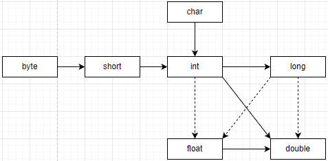
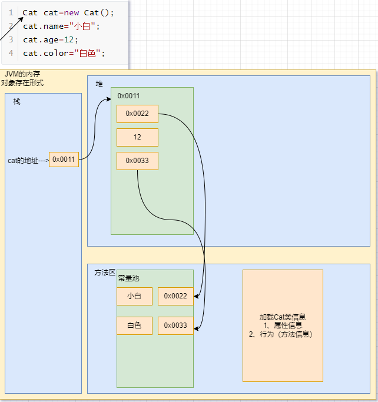
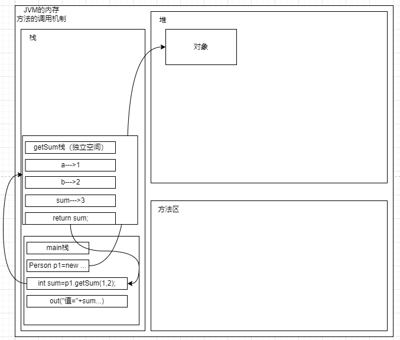

# JAVA基础

## 第1章	基础知识

## 第2章	JAVA概述

### Java运行机制


- 什么是编译

  java Hello.java

- 有了java源文件，通过编译器将其编译成JVM可以识别的字节码文件。

- 在该源文件目录下，通过javac编译工具对Hello.java文件进行编译。

- 如果程序没有错误，没有任何提示，但在当前目录下会出现一个Hello.class文件，该文件称为字节码文件，也是执行的java的程序。

```java
/*
对代码的相关说明
1、public class Hello表示Hello是个类，是一个public公有的类
2、Hello{}表示一个类的开始和结束
3、public static void main(String[] args)表示一个主方法，即我们程序的入口
4、main(){}表示方法的开始和结束
5、System.out.println("Hello,world!!!");表示输出"Hello,world!!!"到屏幕
6、;表示语句结束
*/
public class Hello{
    //编写一个main方法
    public static void main(String[] args){
        System.out.println("Hello,World!!!");
    }
}
//一个源文件中最多只能有一个public类。其他类的个数不限。
//编译后，每一个类，都对应一个.class
//Dog是一个类
class Dog{
    
}
//Tiger是一个类
class Tiger{
    
}
//一个源文件中最多只能有一个public类。其他类的个数不限，也可以将main方法写在非public类中，然后指定运行非public类，这样入口方法就是非public的main方法。
class test{
    public static void main(String[] args){
        System.out.println("Hello test!!");
    }
}
//java test-Hello test!!
```

- 什么是运行

  1、有了可执行的java程序（Hello.class字节码文件)

  2、通过运行工具java.exe对字节码文件进行执行，本质就是.class装载到jvm机执行。

- java程序开发注意事项

  对修改后的Hello.java源文件需要重新编译，生成新的class文件后，再进行执行，才能生效。

环境变量path配置

1、环境变量的作用是为了在dos的任意目录，可以去使用java和javac命令

2、先配置JAVA_HOME = 指向jdk安装的主目录

3、编辑path环境变量，增加%JAVA_HOME%\bin

#### Java开发注意事项和细节说明

1. Java源文件以`.java`为扩展名。源文件的基本组成部分是类（class），如本类中的Hello类。

2. Java应用程序的执行入口是main()方法。它有固定的书写格式：

   `public static void main(String[] args){...}`

3. Java语言严格区分大小写

4. Java方法由一条条语句构成，每个语句以`;`结束。

5. 大括号都是成对出现的，缺一不可。[习惯，先写{}再写代码]

6. 一个源文件中最多只能有一个public类。其他类的个数不限。

7. 如果源文件包含一个public类，则文件名必须按该类名命名！！！

8. 一个源文件中最多只能有一个public类。其他类的个数不限，也可以将main方法写在非public类中，然后指定运行非public类，这样入口方法就是非public的main方法。

### 转义字符

- Java常用的转义字符

  | 符号 | 说明                                         |
  | ---- | -------------------------------------------- |
  | `\t` | 一个制表位，实现对齐的功能                   |
  | `\n` | 换行符                                       |
  | `\\` | 一个\                                        |
  | `\"` | 一个"                                        |
  | `\'` | 一个'                                        |
  | `\r` | 一个回车`System.out.println("hello\rjava");` |

  ```java
  //转移字符
  public class ChangeChar{
  	public static void main(String[] args){
  		System.out.println("四川\t成都\t双流");
  		System.out.println("四川\n成都\n双流");
  		System.out.println("四川\\成都\\双流");
  		System.out.println("四川\"成都\"双流");
  		System.out.println("四川\'成都\'双流");
          //输出：四川你好
          //\r表示回车
  		System.out.println("四川你好\r成都");
  	}
  }
  ```

  


```java
//练习：请使用一句输出语句，达到输入如下图形的效果
```


```java
public class ChangeChar{
	public static void main(String[] args){
		System.out.println("书名\t作者\t价格\t销量\n三国\t罗贯中\t120\t1000");
	}
}
```

### 注释（comment）

- 介绍

  用于注解说明解释程序的文字就是注释，注释提高了代码的阅读性（可读性）；注释是**一个程序员必须具有的良好编程习惯**。将自己的思想通过注释先整理出来，再用代码去体现。

- Java中的注释类型

  1、单行注释

  格式：`//注释文字`

  2、多行注释

  格式：`/*注释文字*/`

  使用细节

  ​	1、被注释的文字，不会被JVM（java虚拟机）解释执行

  ​	2、多行注释里面不允许有多行注释嵌套

  3、文档注释

  注释内容可以被JDK提供的工具javadoc所解析，生成一套以网页文件形式体现的该程序的说明文档，一般写在类

  基本格式

  如何生成对应的文档注释

  应用实例

  ```java
  javadoc -d 文件夹名 -xx -yy Demo03.java
  ```

  `javadoc标签`

  | 标签          | 描述                                                   | 示例                                                         |
  | ------------- | ------------------------------------------------------ | ------------------------------------------------------------ |
  | @author       | 标识一个类的作者，一般用于类注释                       | @author description                                          |
  | @deprecated   | 指名一个过期的类或成员，表明该类或方法不建议使用       | @deprecated description                                      |
  | {@docRoot}    | 指明当前文档根目录的路径                               | Directory Path                                               |
  | @exception    | 可能抛出异常的说明，一般用于方法注释                   | @exception exception-name explanation                        |
  | {@inheritDoc} | 从直接父类继承的注释                                   | Inherits a comment from the immediate surperclass.           |
  | {@link}       | 插入一个到另一个主题的链接                             | {@link name text}                                            |
  | {@linkplain}  | 插入一个到另一个主题的链接，但是该链接显示纯文本字体   | Inserts an in-line link to another topic.                    |
  | @param        | 说明一个方法的参数，一般用于方法注释                   | @param parameter-name explanation                            |
  | @return       | 说明返回值类型，一般用于方法注释，不能出现再构造方法中 | @return explanation                                          |
  | @see          | 指定一个到另一个主题的链接                             | @see anchor                                                  |
  | @serial       | 说明一个序列化属性                                     | @serial description                                          |
  | @serialData   | 说明通过 writeObject() 和 writeExternal() 方法写的数据 | @serialData description                                      |
  | @serialField  | 说明一个 ObjectStreamField 组件                        | @serialField name type description                           |
  | @since        | 说明从哪个版本起开始有了这个函数                       | @since release                                               |
  | @throws       | 和 @exception 标签一样.                                | The @throws tag has the same meaning as the @exception tag.  |
  | {@value}      | 显示常量的值，该常量必须是 static 属性。               | Displays the value of a constant, which must be a static field. |
  | @version      | 指定类的版本，一般用于类注释                           | @version info                                                |


### 代码规范

1. 类、方法的注释，要以javadoc的方式来写
2. 非Java Doc的注释，往往是给代码的维护者看的，着重告诉读者为什么这样写，如何修改，注意什么问题等
3. 使用tab操作，实现缩进，默认整体向右边移动，用shift+tab整体想左移
4. 运算符和`=`两边习惯性各加一个空格。
5. 源文件使用utf-8编码
6. 行宽度不要超过80个字符
7. 代码编写次行风格和行尾风格

### DOS命令

- DOS介绍

  Dos：Disk Operation System磁盘操作系统。

- 相关的知识补充：相对路径，绝对路径

  - 相对路径：从当前目录开始定位，形成的一个路径
  - 绝对路径：从顶级目录D开始定位，形成的路径

  

- 常用dos命令

  - 查看当前目录有什么

    `dir `       `dir d:\abc2\test`

    

  - 切换到其他盘下：盘符号 cd   change directory

    切换到C盘：cd /D c:

    

  - 切换到当前盘的其他目录下

    cd d:\abc2test cd..\..\abc2\test

    

  - 切换到上一级

    cd ..

    

  - 切换到根目录：cd \

    cd \

  - 查看指定的目录下所有的子级目录

    tree D:

  - 清屏

    cls[苍老师]

  - 退出DOS

    exit

  - 说明：(md、rd、copy、del、echo、type、move)

## 第3章	变量

### 变量介绍

- 变量是程序的基本组成单位

  不论是使用哪种高级程序语言编写程序，变量都是其程序的基本组成单位 

  比如：//变量有三个基本要素（类型+名称+值）

  ```java
  class Test{
      public static void main(String[] args){
          int a=1;//定义了一个变量，类型是int整型，名称是a，值是1。
          int b=3;
          b=89;
          System.out.println(a);
          System.out.println(b);
      }
  }
  ```

  

- 概念

  变量相当于内存中一个数据存储空间的表示，可以把变量看做是一个房间的门牌号，通过门牌号可以找到房间，而通过变量名可以访问到变量（值）

- 变量使用的基本步骤

  - 声明变量

    int a;

  - 赋值

    a=60;

  - 使用`System.out.porinln(a);`

    `int a=60;`

```java
//变量使用
//1、定义变量
int age = 20;
double score = 88.6;
char gender = '男';
String name = "johnny";
```

#### 变量使用注意事项

1. 变量表示内存中的一个存储区域[不同的变量、类型不同、占用的空间大小不同；比如：int 4个字节，double 8个字节]
2. 该区域有自己的名称[变量名]和类型[数据类型]
3. 变量必须先声明，后使用，既有顺序
4. 该区域的数据可以在同一类型范围内不断变化。
5. 变量在同一个作用域内不能重名
6. 变量=变量名+值+数据类型；变量三要素

### +号的使用

1. 当左右两边都是数值型时，则做加法运算
2. 当左右两边有一方为字符串，则做拼接运算
3. 运算顺序，从左往右

```java
public class Plus {
    public static void main(String[] args) {
        System.out.println(100+98);//198
        System.out.println("100"+98);//10098
        System.out.println(100+3+"hello");//1003hello
        System.out.println("hello"+100+3);//hello1003
    }
}
```

### 数据类型

每一种数据都定义了明确的数据类型，在内存中分配了不同大小的内存空间（字节）

Java数据类型

- 基本数据类型
  - 数值型
    - 整数类型，存放整数
      - byte[1]
      - short[2]
      - int[4]
      - long[8]
    - 浮点（小数）类型
      - float[4]
      - double[8]
  - 字符型(char[2])，存放单个字符`'a'`
  - 布尔型(boolean[1])，存放true，false

- 引用数据类型
  - 类（class）
  - 接口（interface）
  - 数组[]

#### 整数类型

| 类型          | 占用存储空间 | 范围           |
| ------------- | ------------ | -------------- |
| byte[字节]    | 1字节        | `-128~127`     |
| short[短整型] | 2字节        | `-2^15~2^15-1` |
| int[整型]     | 4字节        | `-2^31~2^31-1` |
| long[长整型]  | 8字节        | `-2^63~2^64-1` |

- 整型的细节

  1、Java各整数类型有固定的范围和字段长度，不受具体OS（操作系统）的影响，以保证java程序的可移植性。

  2、Java的整型常量默认为int型，声明long型常量须后加`'l'`或`'L'`

  3、Java程序中变量常声明为int型，除非不足以表示大数，才用long

  4、bit：计算机中最小存储单位。byte：计算机中基本存储单元，1byte=8bit。

思考：long类型，有多少个bit

（8*8=64bit）

long n =3;//内存中0 0 0 0 0 0 0 00000011 

#### 浮点类型

Java的浮点类型可以表示一个小数，比如：123.4、7.8、0.12。。。

| 类型         | 占用存储空间 | 范围                 |
| ------------ | ------------ | -------------------- |
| 单精度float  | 4字节        | -3.403E38~3.403E38   |
| 双精度double | 8字节        | -1.798E308~1.798E308 |

1、关于浮点数在机器中存放形式的说明：浮点数=符号位+指数位+尾数位

2、尾数部分可能丢失，造成精度损失（小数都是近似值）

浮点型细节

1、与整数类型类似，Java浮点类型也有固定的范围和字段长度，不受具体OS的影响

2、Java的浮点型常量默认为double型，声明float型常量，须后加'f'或'F'

3、浮点型常量有两种表示形式

​	十进制数形式：5.12、512.0f、.512（必须有小数点）

​	科学计数法形式：5.12e2[5.12*10的2次方]、5.12E-2

4、通常情况下，应该使用double型，因为它比float型更精确

```java
double num9 = 2.1234567851;
float num10 = 2.12345678F;
//2.1234567851
//2.1234567
```

5、浮点数使用陷进2.7和8.1/3比较

```java
double num = 2.7;
double num1 =8.1/3;
//2.7
//2.6999999999999997
/*
注意：对运算结果是小数的进行相等判断时，要小心
*/
double num = 2.7;
double num1 =8.1/3;
if (Math.abs(num - num1)<0.0000001) {
   System.out.println("相等");
}else {
   System.out.println("不相等");
}
```

#### Java API文档

1、API(Application Programming Interface，应用程序编程接口)是Java提供的基本编程接口`https://www.matools.com`

#### 字符类型（char）

##### 基本介绍

字符类型可以表示单个字符，字符类型是char，char是两个字节（可以存放汉字），多个字符我们用字符串String。

```java
public class Char01 {
    //演示char的基本使用
    public static void main(String[] args) {
        char c1 = 'a';
        char c2 = '\t';
        char c3 = '夏';
        char c4 = 97;
        //复制快捷键 ctrl+d
        //
        System.out.println(c1);
        System.out.println(c2);
        System.out.println(c3);
        System.out.println(c4);//输出c4时候，会输出97表示的字符
    }
}
```

##### 字符类型使用细节

1. 字符常量是用单引号`''`括起来的单个字符。

   `char c1 ='a';char c2 = '中';char c3 = '9';`

2. Java中还允许使用转义字符`\`来将其后的字符转变为特殊字符型常量。

   `char c3 = '\n';//'\n'表示换行符`

3. 在Java中，char的本质是一个整数，在输出时，是unicode码对应的字符。

4. 可以直接给char赋一个整数，然后输出时，会按照对应的unicode字符输出[97]

5. char类型时可以进行运算的，相当于一个整数，因为它都对应有unicode码。

```java
public class CharDetail {
    public static void main(String[] args) {
        char c1 = 97;
        System.out.println(c1);//a
        char c2 = 'a';
        System.out.println((int)c2);
        char c3 = '夏';
        System.out.println((int)c3);//22799
        System.out.println((char)(c2 + 10));//107
        char c5 ='b'+1;
        System.out.println((int)c5);//99
        System.out.println(c5);//c
    }

```

##### 字符类型本质探讨

1. 字符型存储到计算机中，需要将字符对应的码值（整数）找出来，比如`'a'`

存储：`'a'==>码值97==>二进制==>存储`

读取：`二进制==>97==>'a'==>显示`

2. 字符和码值的对应关系时通过字符编码表绝对的（规定好的）

#### 布尔类型：boolean

##### 基本介绍

1. 布尔类型也叫boolean类型，boolean类型数据只允许取值true和false，无null
2. boolean类型占1个字节
3. boolean类型试于逻辑运算，一般用于程序流程控制
   - if条件控制语句
   - while循环控制语句
   - do-while循环控制语句
   - for循环控制语句

```java
public class Boolean {
    public static void main(String[] args) {
        //定义一个布尔变量
        boolean pass = true;
        if(pass == true){
            System.out.println("考试通过");
        }else {
            System.out.println("考试未通过");
        }
    }
}
```

##### 使用细节说明

不可以用0或非0的整数代替false和true，这点和C语言不同

### 编码

#### 介绍一下字符编码表

ASCII(ASCII编码一个字节表示，一个128个字符，实际上一个字节可以表示256个字符，只用128个)

Unicode（Unicode编码表固定大小的编码使用两个字节来表示字符，字母和汉字统一都是占用两个字节，这样浪费空间）

utf-8（编码表，大小可变的编码字母使用1个字节，汉字使用3个字节）

gbk（可以表示汉字，而且范围广，字母使用1个字节，汉字2个字节）

gb2312（可以表示汉字，gb2312<gbk）

big5码（繁体中文，台湾，香港）

- ASCII码介绍

1. ASCII码：上个设计60年代，美国制定了一套字符编码（使用一个字节），对英语字符与二进制位之间的关系，做了统一规定。这被称为ASCII码。ASCII码一共规定了128个字符的编码，只占用了一个字节的后面7位，最前面的1位统一规定为0。特别提示：一个字节可以表示256字符，ASCII码只用了128个字符。
2. 看完整的ASCII码表
3. 缺点：不能表示所有字符

- Unicode编码

1. 好处：一种编码，将世界上所有的字符都纳入其中。每一个符号都给予一个独一无二的编码，使用Unicode没有乱码的问题。
2. 缺点、：一个英文字母和一个汉字都占用2个字节，这对于存储空间来说时浪费。
3. 2的16次方时65536，所以最多编码时655367个字符
4.  编码0~127的字符是与ASCII的编码一样。比如：`'a'`在ASCII码是0x61，在Unicode码是0x0061，都对应97.因此Unicode码兼容ASCII码。

- UTF-8编码

1. UTF-8是在互联网上使用最广的一种Unicode的实现方式
2. UTF-8是一种变长的编码方式。它可以使使用1-6个字符表示一个符号，根据不同的符号变化字节长度。
3. 使用大小可变的编码字母占1个字节，汉字占3个字节。

### 数据类型转换

- 自动类型转换

当java程序在进行赋值或运算时，精度小的类型自动转换为精度达的数据类型，这个就是自动类型转换。

数据类型精度（容量）大小排序为（背，规则）



```java
public class AutoConvert {
    public static void main(String[] args) {
        int a = 'c';
        double d= 80;
        System.out.println(a);//99
        System.out.println(d);//80.0
    }
}
```

- 自动类型转换注意和细节

1. 有多种类型的数据混合运算时，系统首先自动将所有数据转换成容量最大的那种数据类型，然后再进行计算。
2. 当我们把精度（容量）大的数据类型赋值给精度（容量）小的数据类型时，就会报错，反之就会进行自动类型转换。
3. （byte、short）和char之间不会相互自动转换。
4. byte、short、char他们三者可以计算，在计算时首先转换为int类型
5. boolean不参与转换
6. 自动提升原则：表达式结果的类型自动提升为操作数中最大的类型

```java
public class AutoConvertDetail {
    public static void main(String[] args) {
        //有多种类型的数据混合运算时，系统首先自动将所有数据转换成容量最大的那种数据类型，然后再进行计算.
        int n1 = 10;
        //float d1 = n1+1.1;//错误 n1+1.1 =>结果是double类型;
        //float d1= n1+1.1F;
        double d1 = n1 + 1.1;
        //（byte、short）和char之间不会相互自动转换.
        //当把具体数赋给byte时，先判断改数是否在byte范围内，如果时就可以
        byte b1 = 10;
        int n2 = 1;//n2是int
        //byte b2 = n2;//错误，如果是变量赋值，判断类型
        //char c1 =b1;//错误，byte不饿能自动转成char
        //byte、short、char他们三者可以计算，在计算时首先转换为int类型
        byte b2 = 1;
        byte b3 = 2;
        short s1 = 1;
        //short s2 =b2 + s1;//错误，b2 + s1=>int
        int s2 = b2 + s1;
        //byte b4 = b2+b3;//错误，b2+b3=>int
        byte b4 = 1;
        short s3 = 100;
        int num200 = 1;
        float num300 = 1.1F;
        double num500 = b4 + s3 + num200 + num300;
    }
}
```

- 强制类型转换

自动类型转换的逆过程，将容量大的数据类型转换为容量小的数据类型，使用时哟啊加上强制转换符（），但可能照成精度降低或溢出，格外注意。

```java
public class ForceConvert {
    public static void main(String[] args) {
        int i = (int) 1.9;//精度损失
        System.out.println("n1=" + i);
        int i2 = 2000;
        byte b1 = (byte) i2;//-48 数据溢出
        System.out.println("b1=" + b1);
    }
}
```

- 强制类型转换细节说明

1. 当进行数据的大小从大->小，就需要使用强制转换

2. 强转符号只针对于最近的操作数有效，往往会使用小括号提升优先级

   ```java
   //int x =(int10*3.5+6*1.5;//double->int
   int x = (int)(10*3.5+6*1.5);
   System.out.println(x);
   ```

3. char类型可以报错int的常量值，但不能保存int的变量值，需要强转

   ```java
   char c1 = 100;//ok
   int m =100;//ok
   //char c2 = m;//错误
   char c2 = (char)m;
   System.out.println(c2);
   ```

4. byte和short类型在进行运算时，当作int类型处理

#### 基本数据类型转换-练习

```java
short s = 12;//ok
s = s - 9;//no int -> short
byte b = 10;//ok
b = b + 11;//no int ->byte
b = (byte) (b + 11);//ok
char c = 'a';//ok
int i = 16;//ok
float d = .314F;//ok
double result = c + i + d;//ok
byte b = 16;//ok
short s 14;//ok
short s +b;//no int->short
```

#### 基本数据类型和String类型的转换

在程序开发中，我们进程需要将基本数据类型转成String类型。或者将String类型转成基本数据类型。

基本类型转String类型

`语法：将基本类型的值+""即可`

```java
//基本->String
int n1 = 100;
float f1 = 1.1F;
double d1 = 4.5;
boolean b1 = true;
String s1 = n1 + "";
String s2 = f1 + "";
String s3 = d1 + "";
String s4 = b1 + "";
System.out.println(s1 + "\t" + s2 + "\t" + s3 + "\t" + s4);//100	1.1	4.5	true
```

String类型转基本数据类型

`语法：通过基本类型的包装类调用parseXX方法即可`

```java
//String->对应的基本数据类型
//解读 使用基本数据类型对应的包装类，得到基本数据类型
String s5 = "123";
int num1 = Integer.parseInt(s5);//123
double num2 = Double.parseDouble(s5);//123.0
float num3 = Float.parseFloat(s5);//123.0
System.out.println(num1 + "\t" + num2 + "\t" + num3);
//怎么把字符串转成字符char->含义是指把字符串的第一个字符得到
//解读s5.charAt(0)得到s5字符串的第一个字符'1'
System.out.println(s5.charAt(0));
```

1. 在将String类型转成基本数据类型时，要确保String类型能够转成有效的数，比如：我们把“123”转成一个整数，但是不能把“hello”转成一个整数。
2. 如果合适不正确，就会抛出异常，程序就会终止。

### 本章作业

```java
//1、程序阅读，看看输出什么？HomeWork01.java
public class HomeWork01 {
    public static void main(String[] args) {
        int n1;
        n1 = 13;
        int n2;
        n2 = 17;
        int n3;
        n3 = n1 + n2;
        System.out.println("n3=" + n3);//30
        int n4 = 38;
        int n5 = n4 - n3;
        System.out.println("n5=" + n5);//8
    }
}
```

```java
//2、使用char类型，分别保存\n\t\r\\ 1 2 3 等字符，并打印输出
public class HomeWork02 {
    public static void main(String[] args) {
        char c1 = '\n';//换行
        char c2 = '\t';//制表位
        char c3 = '\r';//回车
        char c4 = '\\';//斜杠
        char c5 = '1';//‘1’
        char c6 = '2';//‘2‘
        char c7 = '3';//’3‘
        System.out.println(c1 + "\t" + c2 + "\t" + c3 + "\t" + c4 + "\t" + c5 + "\t" + c6 + "\t" + c7);
    }
}
```

```java
//3、编程，保存两本书名，用+拼接，看效果。保存两个性别，用+拼接，看效果。
public class HomeWork03 {
    public static void main(String[] args) {
        //保存两本书名，用+拼接
        String book01 = "天龙八部";
        String book02 = "笑傲江湖";
        System.out.println(book01+book02);//天龙八部笑傲江湖
        //保存两个性别
        char sex01='男';
        char sex02='女';
        System.out.println(sex01+sex02);//52906 男 字符码值+女 字符码值
        
    }
}
```

```java
//4、编程实现如下效果
public class HomeWork04 {
    public static void main(String[] args) {
        //4、编程实现如下效果
        //姓名    年龄  成绩  性别  爱好
        /*
        要求：
        1、用变量将姓名、年龄、成绩、性别、爱好存储
        2、使用+
        3、添加适当的注释
        4、添加转义字符，使用一条语句输出
        */
        String name = "范夏源";
        byte age = 24;
        double score = 98.9;
        char gender = '男';
        String like = "篮球";
        System.out.println("姓名：" + name + "\n" +
                "年龄：" + age + "\n" +
                "成绩：" + score + "\n" +
                "性别：" + gender + "\n" +
                 "爱好：" + like + "\n");
    }
}
/*
姓名：范夏源
年龄：24
成绩：98.9
性别：男
爱好：篮球
*/
```

## 第4章	运算符

### 运算符介绍

运算符是一种特殊的符号，用以表示数据的运算、赋值和比较等

#### 算数运算符

算数运算符符是对数值类型的变量进行运算的，在Java程序中使用的非常多。

| 运算符 | 运算                                   | 范例                | 结果          |
| ------ | -------------------------------------- | ------------------- | ------------- |
| +      | 正号                                   | +7                  | 7             |
| -      | 负号                                   | b=11;-b             | -11           |
| +      | 加                                     | 9+9                 | 18            |
| =      | 减                                     | 10-8                | 2             |
| *      | 乘                                     | 7*8                 | 56            |
| /      | 除                                     | 9/9                 | 1             |
| %      | 取模（取余）                           | 11%9                | 2             |
| ++     | 自增(前\后)：先运算后取值\先取值后运算 | `a=2;b=++a;\b=a++;` | `a=3;b=3\b=2` |
| --     | 自减(前\后)：先运算后取值\先取值后运算 | `a=2;b=--a;b\=a--;` | `a=1;b=1\b=2` |
| +      | 字符串相加                             | "lsp"+"cjk"         | "lspcjk"      |

##### 案例演示

案例限时算符运算符的使用（ArithmeticOperator）

```java
public class ArithmeticOperator {
    public static void main(String[] args) {
        //演示算数运算符
        System.out.println(10 / 4);//2
        System.out.println(10.0 / 4);//2.5
        double d = 10 / 4;//java中10/4=2=>2.0
        System.out.println(d);//2.0
        System.out.println("=======================");
        //% 取模、取余数
        //%的本质 看一个公式 a%b=a-a/b*b
        System.out.println(10 % 3);//1
        System.out.println(-10 % 3);//-1
        System.out.println(10 % -3);//1
        System.out.println(-10 % -3);//-1
        System.out.println("========================");
        //++的使用
        int i = 10;
        i++;//i = i + 1;
        ++i;//i = i + 1;
        System.out.println("i=" + i);
    }
}
```

- `+、-、*、/、%、++、--，重点/、%、++`
- 自增：`++`

作为独立的语句使用：

前`++`和后`++`都完全等价于`i=i+1`；

作为表达式使用

前`++`：`++i`先自增后赋值

后`++`：`i++`先赋值后自增

- `--、+、-、*`是一个道理，完全可以类推。

```java
//面试题
/*
1、
public class ArithmeticOperatorExercise {
    public static void main(String[] args) {
        int i = 1;
        i = i++;//规则使用临时变量：(1)temp=i;(2)i=i+1;(3)i=temp;
        System.out.println(i);//1
    }
}
问：结果是多少？
//i=1
2、
int i = 1;
i = ++i;//规则使用临时变量：(1)i=i+1;(2)temp=i;(3)i=temp;
System.out.println(i);
*/
```

```java
public class ArithmeticOperatorExercise02 {
    public static void main(String[] args) {
        int i1 = 10;
        int i2 = 20;
        int i = i1++;
        System.out.println("i=" + i);//10
        System.out.println("i2=" + i2);//20
        i = --i2;
        System.out.println("i=" + i);//19
        System.out.println("i2=" + i2);//19
    }
}
```


```java
public class ArithmeticOperatorExercise03 {
    public static void main(String[] args) {
        /*
         * 1、假如还有59天放假，问：合xx个星期零xx天
         * 2、定义个变量保存华氏温度，华氏温度转换摄氏温度的公式为：5/9*（华氏温度-100），
         * 请求出华氏温度对应的摄氏温度[234.5]*/
        int days = 59;//保存总天数
        System.out.println(days / 7 + "个星期零" + days % 7 + "天");//8个星期零3天
        double a = 234.5;
        System.out.println("转为摄氏度为：" + (5.0 / 9 * (a - 100)) + "摄氏度");//转为摄氏度为：74.72222222222223摄氏度

    }
}
```

#### 关系运算符

1. 关系运算符的结果都是boolean型，也就是要么是true，要么是false
2. 关系表达式经常用在if结构的条件中或循环结构的条件中

| 运算符     | 运算               | 范例                   | 结果  |
| ---------- | ------------------ | ---------------------- | ----- |
| ==         | 相等于             | 8==7                   | false |
| !=         | 不等于             | 8!=7                   | true  |
| <          | 小于               | 8<7                    | false |
| >          | 大于               | 8>7                    | true  |
| <=         | 小于等于           | 8<=7                   | fa;se |
| >=         | 大于等于           | 8>=7                   | true  |
| instanceof | 检查是否是类的对象 | "fxy"instanceof String | true  |

##### 案例演示

案例演示关系运算符的使用(RelationalOperator)

```java
public class RelationalOperator {
    public static void main(String[] args) {
        //演示关系运算符的使用
        int a = 9;//提示：开发中，不可以使用a,b,c之类的变量名
        int b = 8;
        System.out.println(a > b);//true
        System.out.println(a >= b);//true
        System.out.println(a <= b);//false
        System.out.println(a < b);//false
        System.out.println(a == b);//false
        System.out.println(a != b);//true
        boolean flag = a > b;
        System.out.println(flag);//true
    }
}
```

##### 细节说明

1. 关系运算符的结果都是boolean型，也就是要么true，要么是false
2. 关系运算符组成的表达式，我们称**关系表达式**。a>b
3. 比较运算符"=="不能误写成"="

#### 逻辑运算符

1. 短路与`&&`，短路或`||`，取反`!`
2. 逻辑与`&`，逻辑或`|`，逻辑异或`^`

| a     | b     | a&b   | a&&b  | a\|b  | a\|\|b | !a    | a^b   |
| ----- | ----- | ----- | ----- | ----- | ------ | ----- | ----- |
| true  | true  | true  | true  | true  | true   | false | false |
| true  | false | false | false | true  | true   | false | true  |
| false | true  | false | false | true  | true   | true  | true  |
| false | false | false | false | false | false  | true  | false |

##### 说明逻辑运算规则

1. a&b：&叫逻辑与->当a和b同时为true，则结果为true，否则为false
2. a&&b：&&叫短路与->当a和b同时为true，则结果过为true，否则为false
3. a|b：|叫逻辑或->当a和b，有一个为true，则结果为true，否则为false
4. a||b：||叫短路或->当a和b，有一个为true，则结果为true，否则为false
5. !a：叫取反->当a为true，则结果为false，当a为false，结果为true
6. a^b：叫逻辑异或->当a和b不同时，则结果为true，否则为false

##### &&和&基本规则

短路与&&：条件1&&条件2	两个条件都为true，结果为true，否则false

逻辑与&：条件1&条件2	两个条件都为true，结果为true

###### &&和&案例演示

```java
public class LogicOperator01 {
    public static void main(String[] args) {
        /*
         * 演示逻辑运算符
         * &&和&案例演示*/
        int age = 20;
        if (age > 20 && ++age < 90) {
            System.out.println("ok1");
        }
        //&
        if (age > 20 & ++age < 90) {
            System.out.println("ok2");
        }
        System.out.println("age="+age);//age=21
        //区别
        int a = 4;
        int b = 9;
        //对于&&短路与而言，如果第一个条件为false，后面的条件不再判断
        //对于&逻辑与而言，如果第一个条件为false，后面的条件仍然会判断
        if (a < 1 & ++b < 50) {
            System.out.println("ok3");
        }
        System.out.println("a=" + a + "b=" + b);//a=4b=10
    }
}
```

###### &&和&使用区别

1. &&短路与：如果第一个条件为false，则第二个条件不会判断，最终及结果false，效率高。
2. &逻辑与：不管第一个条件是否为false，第二条件都要判断，效率低。
3. 开发中，我们使用的基本都是短路与&&，效率高。

##### ||和|基本规则

短路或||		条件1||条件2		两个条件只要有一个成立，结果true，否则为false

|逻辑或			条件1|条件2		只要有一个条件成立，结果true，否则为false

###### ||和|案例演示

```java
public class LogicOperator02 {
    public static void main(String[] args) {
        /*
         * ||短路或
         * |逻辑或
         * */
        int age = 50;
        if (age > 20 || ++age < 30) {
            System.out.println("age1="+age);//age1=50
        }
        if (age > 20 | ++age < 30) {
            System.out.println("age2="+age);//age2=51
        }
    }
}
```

###### ||和|使用区别

1. ||短路或：如果第一个条件为true，则第二个条件不会判断，最终为true，效率高
2. |逻辑或：不管第一个体哦阿健是否为true，第二个条件都要判断，效率低
3. 开发中，我们基本使用||

##### ！取反基本规则

！非		！条件			如果条件本身成立，结果为false，否则为true

###### ！案例

```java
public class InverseOperator {
    public static void main(String[] args) {
        //！取反，真变假，假变真
        System.out.println(60 > 20);//T
        System.out.println(!(60 > 20));//F
        //a^b：叫逻辑异或，当a和b不同时，则结果为true，否则为false
        boolean b = (10 > 1) ^ (3 < 5);
        System.out.println("b=" + b);//F
    }
}
```

##### ^异或基本规则

a^b：叫逻辑异或，当a和b不同时，则结果为true，否则为false

##### 练习题

```java
public class Test01 {
    public static void main(String[] args) {
        int x = 5;
        int y = 5;
        if (x++ == 6 & ++y == 6) {
            x = 11;
        }
        System.out.println("x=" + x + "y=" + y);//x=6y=6
    }
}
```

```java
public class Test02 {
    public static void main(String[] args) {
        int x = 5;
        int y = 5;
        if (x++ == 6 && ++y == 6) {
            x = 11;
        }
        System.out.println("x=" + x + "y=" + y);//x=6y=5
    }
}
```

```java
public class Test03 {
    public static void main(String[] args) {
        int x = 5;
        int y = 5;
        if (x++ == 6 | ++y == 6) {
            x = 11;
        }
        System.out.println("x=" + x + "y=" + y);//x=11y=6
    }
}
```

```java
public class Test04 {
    public static void main(String[] args) {
        int x = 5;
        int y = 5;
        if (x++ == 6 || ++y == 6) {
            x = 11;
        }
        System.out.println("x=" + x + "y=" + y);//x=11y=6
    }
}
```

#### 赋值运算符

赋值运算符就是将某个运算后的值，赋给指定的变量。

赋值运算符的分类

1、基本赋值运算符=

2、复合赋值运算符+=、-=、*=、/=、%-等。

a+=b;=>a=a+b;

##### 案例

```java
public class AssignOperator {
    public static void main(String[] args) {
        //1、赋值基本案例 int num1 = 10;
        //2、+=的使用案例
        int num1 = 10;
        num1 += 4;//num1=num1+4;
        System.out.println(num1);//14
        num1 /= 3;
        System.out.println(num1);//4
    }
}
```

##### 赋值运算符特点

1. 运算顺序从右往左`int num = a+b+c;`

2. 赋值运算符的左边只能是变量，右边可以是变量、表达式、常量值。

   `int num =20;int num2 = 78*34-10;int num3 =a;`

3. 复合赋值运算符等价于下面的效果。

   `a+=3;等价于a=a+3;`

4. 复合赋值运算符会进行类型转换。

   `byte b=2;b+=3;b++;`

```java
byte b=3;
b+=2;//b=(byte)(b+2);
b++;//b=(byte)(b+1);
System.out.println(b);
```

#### 三元运算符

##### 基本语法

`条件表达式？表达式1：表达式2;`

运算规则：

1. 如果条件表达式为true，运算后的结果是表达式1;
2. 如果条件表达式为false，运算后的结果是表达式2;

口诀：[一灯大师：一真大师]

##### 案例

```java
public class TernaryOperator {
    public static void main(String[] args) {
        //三元运算符
        int a = 10;
        int b = 99;
        int result = a > b ? a++ : b--;
        /*
        * 1、a>b为false
        * 2、返回b--，先返回b--的值，b再-1
        * 3、返回的结果是99*/
        System.out.println("result="+result);//99
        System.out.println("a="+a);//10
        System.out.println("b="+b);//98
    }
}
```

##### 使用细节

1. 表达式1和表达式2要为可以赋给接受变量的类型（可以自动转换或强转）

2. 三元运算符可以转成if-else语句

   ```java
   int result=a>b?a++:--b;
   if(a>b){
       result=a++;
   }else{
       result=--b;
   }
   ```

```java
public class TernaryOperatorDetail {
    public static void main(String[] args) {
        //表达式1和表达式2要为可以赋给接受变量的类型（可以自动转换)
        int a = 3;
        int b = 8;
        int c = a > b ? (int) 1.1 : (int) 3.4;//可以。强转
        double d = a > b ? a : b + 3;//可以自动转换
        //三元运算符可以转成if-else语句
    }
}
```

```java
//案例：实现三个数的最大值
public class TernaryOperatorExercise {
    public static void main(String[] args) {
        //实现三个数的最大值
        int n1 = 98;
        int n2 = 33;
        int n3 = 95;
        /*
         * 1、先得到n1和n2最大的数，保存到max1
         * 2、再求出max1和n3的最大数，保存max2*/
        /*int max1 = n1 > n2 ? n1 : n2;
        int max2 = max1 > n3 ? max1 : n3;
        System.out.println("最大数是：" + max2);*/
        //使用一条语句实现
        int max=(n1 > n2 ? n1 : n2)> n3 ?
                (n1 > n2 ? n1 : n2) : n3;
        System.out.println("最大数是：" + max);
    }
}
```

### 运算符优先级

1. 运算符有不同的优先级，所谓优先级就是表达式运算中的运算顺序。
2. 只有单目运算符、赋值运算符是从右向左运算的。

| 结合性 | 符号                                                |
| :----: | :-------------------------------------------------- |
|        | `.、()、{}、;、,`                                   |
|  R->L  | `++、--、~、!(data type)`                           |
|  L->R  | `*、/、%`                                           |
|  L->R  | `+、-`                                              |
|  L->R  | `<<、>>、>>>、位移`                                 |
|  L->R  | `<、>、<=、>=、instanceof`                          |
|  L->R  | `==、!=`                                            |
|  L->R  | `&`                                                 |
|  L->R  | `^`                                                 |
|  L->R  | `|`                                                 |
|  L->R  | `&&`                                                |
|  L->R  | `||`                                                |
|  L->R  | `? :`                                               |
|  R->L  | `=、*=、/=、%=、+=、-=、<<=、>>=、>>>=、&=、^=、|=` |

梳理小结：

1. (),{}等
2. 单目运算
3. 算术运算符
4. 位移运算符
5. 比较运算符
6. 逻辑运算符
7. 三目运算符
8. 赋值运算符

### 标识符的命名规则和规范

#### 标识符概念

1. Java对各种变量、方法和类等命名时使用的字符序列称为标识符
2. 凡是自己可以起名字的地方都叫标识符`int num1 = 90;`

#### 标识符的命名规则

1. 由26个英文字母大小写，0-9，_或$组成
2. 数字不可以开头。	`int 3ab = 1;//错误`
3. 不可以使用关键字和保留字，但能包含关键子和保留字。
4. Java中严格区分大小写，长度无限制。`int totalNum = 10;int n = 90;`
5. 标识符不能包含空格。`int a b = 90;`

#### 标识符命名规范

1. 包名：多个单词组成时所有字母都小写：aaa.bbb.ccc//比如：com.summer.crm
2. 类名、接口名：多个单词组成时，所有单词的首字母大写：XxYyZz//比如：TankShotGame[大驼峰]
3. 变量名、方法名：多个单词组成时，第一个单词首字母小写，第二个单词开始每个单词首字母大写：xxxYyyZzz//比如：tankShotGame[小驼峰，简称驼峰法]
4. 常量名：所有字母都大写。多个单词时每个单词用下划线连接：XXX_YYY_ZZZ//比如：定义一个所得税率TAX_RATE

#### 关键字

##### 关键字的定义和特点

定义：被java语言赋予了特殊含义，用做专门用途的字符串

特点：关键字中所有字母都为小写

#### 保留字

java保留字：现在java版本尚未是哦那个，但以后版本可能会作为关键字使用。自己命名标识符要避免使用这些保留字

 1).访问修饰符的关键字（共3个）

| 关键字    | 意思     | 备注，常用           |
| --------- | -------- | -------------------- |
| public    | 公有的   | 可跨包，（默认选择） |
| protected | 受保护的 | 当前包内可用         |
| private   | 私有的   | 当前类可用           |

2).定义类、接口、抽象类和实现接口、继承类的关键字、实例化对象（共6个）

| 关键字     | 意思       | 备注，常用                                                   |
| ---------- | ---------- | ------------------------------------------------------------ |
| class      | 类         | public class A(){} 花括号里有已实现方法体，类名需要与文件名相同 |
| interface  | 接口       | public interface B(){} 花括号里有方法体，但没有实现，方法体句子后面是英文分号“:”结尾 |
| abstract   | 声明抽象   | public abstract class C(){} 介于类与接口中间，可以有也可以没有已经实现的方法体 |
| implements | 实现       | 用于类或接口实现接口public class A interface B(){}           |
| extends    | 继承       | 用于类继承类 public class A extends D(){}                    |
| new        | 创建新对象 | A a=new A(); A表示一个类                                     |

 3).包的关键字（共2个）

| 关键字  | 意思           | 备注，常用                                                   |
| ------- | -------------- | ------------------------------------------------------------ |
| import  | 引入包的关键字 | 当使用某个包的一些类时，仅需类名 然后使用ctrl+shift+o或者选定类名（类或属性或方法）按住ctrl+单击 即可自动插入类所在的包。如：JFrame 快捷键之后自动加入**import** javax.swing.JFrame; |
| package | 定义包的关键字 | 将所有有关的类放在一个包类以便查找修改等。如：**package** javake.flycat.draw002; |

 4).数据类型的关键字（共12个）

| 关键字  | 意思   | 备注，常用                                        |
| ------- | ------ | ------------------------------------------------- |
| byte    | 字节型 | 8bit                                              |
| char    | 字符型 | 16bit                                             |
| boolean | 布尔型 | --                                                |
| short   | 短整型 | 16bit                                             |
| int     | 整型   | 32bit                                             |
| float   | 浮点型 | 32bit                                             |
| long    | 长整型 | 64bit                                             |
| double  | 双精度 | 64bit                                             |
| void    | 无返回 | public void A(){}  其他需要返回的经常与return连用 |
| null    | 空值   |                                                   |
| true    | 真     |                                                   |
| false   | 假     |                                                   |

5).条件循环（流程控制）（共12个）

| 关键字     | 意思             | 备注，常用                                                   |
| ---------- | ---------------- | ------------------------------------------------------------ |
| if         | 如果             | if(){} 如果小括号里面怎么怎么样 花括号就怎么怎么样           |
| else       | 否则，或者       | 常与if连用，用法相同                                         |
| while      | 当什么的时候     | while 怎么样就do什么  while(){}                              |
| for        | 满足三个条件时   | for ( ; ; ){}                                                |
| switch     | 开关             | switch(表达式) { case 常量表达式1:语句1; .... case 常量表达式2:语句2; default:语句; } default就是如果没有符合的case就执行它,default并不是必须的. case后的语句可以不用大括号. switch语句的判断条件可以接受int,byte,char,short,不能接受其他类型. |
| case       | 返回开关里的结果 |                                                              |
| default    | 默认             |                                                              |
| do         | 运行             | 长与while连用                                                |
| break      | 跳出循环         |                                                              |
| continue   | 继续             | 中断本次循环，并并开始下一次                                 |
| return     | 返回             | return 一个返回值类型                                        |
| instanceof | 实例             | 一个二元操作符，和==，>，<是同一类的。测试它左边的对象是否是它右边的类的实例，返回boolean类型的数据 |

   6).修饰方法、类、属性和变量（共9个）

| 关键字       | 意思               | 备注，常用                                                   |
| ------------ | ------------------ | ------------------------------------------------------------ |
| static       | 静态的             | 属性和方法都可以用static修饰，直接使用类名.属性和方法名。 只有内部类可以使用static关键字修饰，调用直接使用类名.内部类类名进行调用。  static可以独立存在。静态块 |
| final        | 最终的不可被改变的 | 方法和类都可以用final来修饰  final修饰的类是不能被继承的  final修饰的方法是不能被子类重写。常量的定义：final修饰的属性就是常量。 |
| super        | 调用父类的方法     | 常见**public** **void** paint(Graphics g){**super**.paint(g); ··· } |
| this         | 当前类的父类的对象 | 调用当前类中的方法（表示调用这个方法的对象）this.addActionListener(al):等等 |
| native       | 本地               |                                                              |
| strictfp     | 严格,精准          |                                                              |
| synchronized | 线程,同步          |                                                              |
| transient    | 短暂               |                                                              |
| volatile     | 易失               |                                                              |

 static 例子：

```java
public class Test{
    class A{}   //内部类
    ActionListener al=new ActionListener(···){}   //匿名内部类
}
```

  静态块优先于其他方法/类的执行

   7).错误处理（共5个）

| 关键字  | 意思                   | 备注，常用                                                   |
| ------- | ---------------------- | ------------------------------------------------------------ |
| catch   | 处理异常               | 1.try+catch 程序的流程是：运行到try块中，如果有异常抛出，则转到catch块去处理。然后执行catch块后面的语句  2.try+catch+finally 程序的流程是：运行到try块中，如果有异常抛出，则转到catch块,catch块执行完毕后，执行finally块的代码，再执行finally块后面的代码。 如果没有异常抛出，执行完try块，也要去执行finally块的代码。然后执行finally块后面的语句  3.try+finally 程序的流程是：运行到try块中,如果有异常抛出的话，程序转向执行finally块的代码。那末finally块后面的代码还会被执行吗？不会！因为你没有处理异常，所以遇到异常后，执行完finally后，方法就已抛出异常的方式退出了。 这种方式中要注意的是，由于你没有捕获异常，所以要在方法后面声明抛出异常(来自网上的资料) |
| try     | 捕获异常               |                                                              |
| finally | 有没有异常都执行       |                                                              |
| throw   | 抛出一个异常对象       | 一些可以导致程序出问题的因素,比如书写错误,逻辑错误或者是api的应用错误等等. 为了防止程序的崩溃就要预先检测这些因素,所以java 使用了异常这个机制.在java中异常是靠 "抛出" 也就是英语的"throw" 来使用的,意思是如果发现到什么异常的时候就把错误信息 "抛出" |
| throws  | 声明一个异常可能被抛出 | 把异常交给他的上级管理，自己不进行异常处理                   |


byValue、cast、future、generic、inner、operator、outer、rest、var、goto、const


### 键盘输入语句

在编程中，需要接受用户输入的数据，就可以使用键盘输入语句来获取。

Input.java，需要一个扫描器（对象)，就是Scanner

#### 步骤

1. 导入该类的所在包，java.util.*
2. 创建该类对象（声明变量）
3. 调用里面的功能

#### 案例

```java
//要求：可以从控制台接收用户信息，[姓名、年龄、薪水]
public class Input {
    public static void main(String[] args) {
        //用户的输入
        //Scanner类 表示 简单的文本扫描器,在java.util包
        /*
         * 步骤
         * 1、引用Scanner类所在的包
         * 2、创建Scanner对象,new 创建一个对象
         * 3、接收用户的输入了，使用相关的方法*/
        Scanner myScanner = new Scanner(System.in);
        System.out.println("请输入名字：");
        //当程序执行到 next()方法时，会等待用户输入~~~
        String name = myScanner.next();//接受用户输入字符串
        System.out.println("清输入年龄：");
        int age = myScanner.nextInt();//接受用户输入int
        System.out.println("清输入薪水：");
        double sal = myScanner.nextDouble();
        System.out.println("名字："+name+"\n年龄："+age+"\n薪水："+sal);
        char c1 = myScanner.next().charAt(0);//a//先接受一个字符串，再接受字符串的第一个字符
        System.out.println(c1);//a
    }
}
```

### 进制

对于整数，有四种表示方式：

1. 二进制：0，1。满2进1，以ob/oB开头表示。
2. 十进制：0~9。满10进1
3. 八进制：0~7。满8进1，以数字0开头表示
4. 十六进制：`0~9，A/a(10)~F/f(15)`。满16进1，以0x/0X开头表示。

#### 进制的转换


### 位运算

#### 二进制在运算中

1. 二进制是逢2进位的进位制，0、1是基本算符。
2. 现代的电子计算机技术全面采用的是二进制，因为它只使用0、1两个数字符号，非常简单方便，易于用电子方式实现。计算机内部处理的信息，都是采用二进制数来表示的。二进制（Binary）数用0、1两个数字机器组合来表示任何数。进位规则"逢二进一"，数字1在不用的位上代表不同的值，按从右至左的次序，这个值以二倍递增。

#### 原码、反码、补码（重点、难点）

1. 二进制的最高位是符号位：0表示正数，1表示负数（口诀：0->0,1->-)
2. 正数的原码，反码，补码都一样（三码合一）
3. 负数的反码=它的原码符号位不变，其它位取反（0->1,1->0)
4. 负数的补码=它的反码+1，负数的反码=负数的补码-1
5. 0的反码，补码都是0
6. java没有无符号位，换言之，java中的数都是有符号的
7. 在计算机运算的时候，都是以**补码的方式**来运算的
8. 当我们看运算结果的时候，要看他的原码(!!!)

#### 位运算符

按位与&、按位或|、按位异或^、按位取反~

| 运算符      | 说明                                       |
| ----------- | ------------------------------------------ |
| 按位与&     | 两位全为1，结果为1，否则为0                |
| 按位或      | 两位有一个为1，结果为1，否则为0            |
| 按位异或^   | 两位一个为0，一个为1，结果为1，否则为00    |
| 按位取反~   | 0->1、1->0                                 |
| 算数右移<<  | 低位溢出，符号位不变，并用符号位溢出的高位 |
| 算数左移>>  | 符号位不变，地位补0                        |
| >>>逻辑右移 | 低位溢出，高位补0                          |

```java
public class BitOperator02 {
    public static void main(String[] args) {
        int a = 1 >> 2;//1/2^2
        int c = 1 << 2;//1/2^2
        System.out.println(a);
        System.out.println(c);
    }
}
```

### 本章作业

1、计算下列表达式的结果

`10/3=?;		10%5=?;		-10.5%3 = ?;`

a%b当a是小数时，公式=a-(int)a/b*b

-10.5%3=-10.5-(int)10.5/3*3=10.5+9=1.5

注意：有小数运算，得到结果是近似值

2、试说出下面代码的结果

```java
int i = 66;
System.out.println(++i + i);//134
```

3、在java中，以下赋值语句正确的是

```java
A)int num1 =(int)"18";// 错误 应该 Intrger.parseInt("18")
B)int num2=18.0;//错误 double ->int
C)double num3=3d;//ok
D)double num4=8;//ok
E)int i=48;char ch = i+1;//no int->char
F)byte b=19;short s = b+2//错误 int->short
```

4、试写出将String转换为double类型的语句，以及将char类型转换成String语句，举例说明

```java
String str ="18.8";
double d1= Double.parseDouble(str);
char c1 = '夏'
String str2 = c1+ "";
```

## 第5章	控制结构

### 程序流程控制介绍

在程序中，程序运行的流程控制决定程序是如何执行的，是我们必须掌握的，主要有三大流程控制语句

### 顺序控制

程序从上到下逐行地执行，中间没有任何判断和跳转。

```java
//java中定义变量时采用合法的前向引用。
public class Test{
    int num1 =12;
    int num2 =num1+2;
}
//错误形式
public class Test{
    int num2=num1+2;//错误
    int num1 = 12;
}
```


#### 分支控制（if-else）

- 分支控制if-else介绍

让程序有选择的执行，分支控制有三种

##### 1、单分支

###### 基本语法

```java
if(条件表达式){
    执行代码块;(可以有多条语句)
}
```

说明：当条件表达式为true时，就会执行{}的代码。如果为false，就不执行。

特别说明，如果{}中只有一条语句，则可以不用{}，建议写上{}

```java
package com.basic.www.conpter03;
import java.util.Scanner;//导入//编写一个程序，可以输入人的年龄，如果该同志的年龄大于18岁，则输出"你的年龄大于18，要对自己的行为负责，送入监狱"
public class If01 {
    public static void main(String[] args) {
        //编写一个程序，可以输入人的年龄，如果该同志的年龄大于18岁，
        // 则输出"你的年龄大于18，要对自己的行为负责，送入监狱"
        System.out.println("请输入你的年龄:");
        //接受输入年龄，应该定义一个Scanner对象
        Scanner scanner = new Scanner(System.in);
        //把年龄保存到一个变量 int age
        int age = scanner.nextInt();
        if (age > 18) {
            System.out.println("你年龄大于18，要对自己的行为负责，送入监狱");
        }
    }
}
```


##### 2、双分支

###### 基本语法

```java
if(条件表达式){
	执行代码块1;
}
else{
    执行代码块2;
}
```

说明：当条件表达式成立，即执行代码块1，否则执行代码块2。如果执行代码块只有一条语句，则{}可以省略，否则，不能省略。

```java
//编写一个程序，可以输入人的年龄，如果该同志的年龄大于18岁，则输出"你的年龄大于18，要对自己的行为负责，送入监狱"。否则，输出"你的年龄不大这次放过你"。
public class If02 {
    public static void main(String[] args) {
        //编写一个程序，可以输入人的年龄，如果该同志的年龄大于18岁，
        // 则输出"你的年龄大于18，要对自己的行为负责，送入监狱"。
        // 否则，输出"你的年龄不大这次放过你"。
        System.out.println("请出入你的年龄:");
        Scanner scanner = new Scanner(System.in);
        int age = scanner.nextInt();
        if (age > 18) {
            System.out.println("你年龄大于18，要对自己的行为负责，送入监狱");
        } else {
            System.out.println("你的年龄不大于这次放过你");
        }
    }
}
```


##### 分支控制练习

```java
//1、对下列代码，若有输出，指出输出结果
int x = 7;
int y = 4;
if(x>5){
    if(y>5){
        System.out.println(x+y);
    }
    System.out.println("夏源");  
}else{
    System.out.println("x is"+x);
}
//输出的内容是？夏源
```

```java
//2、编写，声明2个double型变量并赋值。判断第一个数大于10.0，且第二个数小于20.0，打印两数之和。
public class IfTest02 {
    public static void main(String[] args) {
        double d1 = 17.24;
        double d2 = 3.2;
        if (d1 > 10.0 && d2 < 20.0) {
            System.out.println(d1 + d2);
        }/*else {
            System.out.println("这两个数不在10.0~20.0之间");
        }*/
    }
}
```

```java
//3、定义两个变量int，判断二者之和，是否能被3又能被5整除，打印提示信息
public class IfTest03 {
    public static void main(String[] args) {
        int a = 10;
        int b = 5;
        int sum = a + b;
        if (sum % 3 == 0 && sum % 5 == 0) {
            System.out.println("ok");
        }
    }
}

```

```java
//4、判断一个年份是否是闰年，闰年的条件是符合下面二者之一：年份能被4整除，但不能被100整除；能被400整除
public class IfTest04 {
    public static void main(String[] args) {
        System.out.println("请输入年份:");
        Scanner scanner = new Scanner(System.in);
        int year = scanner.nextInt();
        if ((year % 4 == 0 && year % 100 != 0) || year % 400 == 0) {
            System.out.println(year + "是闰年");
        } else {
            System.out.println(year + "不是闰年");
        }
    }
}
```

##### 3、多分支

基本语法

```java
if(条件表达式1){
    执行代码块1;
}else if(条件表达式2){
    执行代码块2;
}
...
    else{
        执行代码块n;
    }
```

说明：

1、当条件表达式1成立时，即执行代码块1。

2、当条件表达式1不成立时，才去判断表达式2是否成立。

3、如果表达式2成立，就执行代码块2

4、以此类推，如果所有的表达式都不成立

5、则执行else的代码块，注意，只能由一个执行入口。


```java
public class If03 {
    public static void main(String[] args) {
        /*
         *输入夏源的芝麻信用分
         * 1、信用分为100时，输出信用极好；
         * 2、信用分为(80,99]时，输出信用优秀
         * 3、信用分为[60，80)时，输出信用一般
         * 4、其他情况，输出信用不及格
         * 5、请从键盘输入夏源的芝麻信用分，并加以判断*/
        //输入夏源的信用分
        System.out.println("请出入夏源的芝麻信用分:");
        Scanner scan = new Scanner(System.in);
        double d = scan.nextDouble();
        if (d == 100) {
            System.out.println("夏源信用极好");
        } else if (d > 80 && d <= 99) {
            System.out.println("夏源信用优秀");
        } else if (d >= 60 && d <= 80) {
            System.out.println("夏源信用一般");
        } else if (d < 60) {
            System.out.println("信用不及格");
        }
    }
}
```

#### 嵌套分支

在一个分支结构中又完整的嵌套了另一个完整的分支结构，里面的分支的结构称为内层分支外面的分支结构称为外层分支。规范：不要超过3曾（可读性不好）

基本语法

```java
if(){
    if(){
        //if-else...
    }else{
        //if-else
    }
}
```

```java
/*
参加歌手比赛，如果初赛成绩大于8.0进入决赛，否则提示淘汰。并且根据性别提示进入男子组或女子组。输入成绩和性别，进行判断和输出信息
*/
//接受字符：char c = scanner.next().charAt(0);
public class NestedIf {
    public static void main(String[] args) {
        //输入成绩和性别

        Scanner scan = new Scanner(System.in);
        System.out.println("请输入成绩:");
        double score = scan.nextDouble();
        System.out.println("请输入性别:");
        char gender = scan.next().charAt(0);//先接受一个字符串，再接受字符串的第一个字符
        if(score>8.0){
            if(gender == '男'){
                System.out.println("恭喜进入男子决赛");
            }else if (gender == '女'){
                System.out.println("恭喜进入女子决赛");
            }
        }else {
            System.out.println("非常遗憾未进入决赛");
        }
    }
} 
```

#### switch分支结构

基本语法

```java
switch(表达式){
    case 常量1://当...
        语句块1;
        break;
    case 常量2:
        语句块2;
        break;
        。。。
     case 常量n:
        语句块n;
        break;
    default:
        default语句块;
        break;
         
}
```

1. switch关键字，表示switch分支
2. 表达式对应一个值
3. case常量1：当表达式的值等于常量1，就执行语句块1
4. break：表示推出switch
5. 如果和case常量1匹配，就执行语句块1，如果没有匹配，就继续匹配case常量2
6. 如果一个都没匹配上，执行default  


```java
/*
1、请编写一个程序，该程序可以接受一个字符，比如：a，b，c，d，e
2、a表示星期一，b表示星期二
3、根据用户的输入显示相依的信息，要求使用switch语句完成
*/
public class Switch01 {
    public static void main(String[] args) {
        //输入一个字符
        System.out.println("请输入:");
        //接收一个字符
        Scanner scanner = new Scanner(System.in);
        //在java中，只要有值返回，就是一个表达式
        char c = scanner.next().charAt(0);
        switch (c) {
            case 'a':
                System.out.println("星期一");
                break;
            case 'b':
                System.out.println("星期二");
                break;
            case 'c':
                System.out.println("星期三");
                break;
            case 'd':
                System.out.println("星期四");
                break;
            case 'e':
                System.out.println("星期五");
                break;
            case 'f':
                System.out.println("星期六");
                break;
            case 'g':
                System.out.println("星期天");
                break;
            default:
                System.out.println("输入有错，请重新输入！！！");
        }
    }
}
```

switch细节

1. 表达式数据类型，应和case后的常量类型一致，或者时可以自动转成可以相互比较的类型，比如输入的是字符，而常量是int
2. switch(表达式)中表达式的返回值必须是：(byte,short,int,char,enum,String)

```java
double c =1.1;
switch(c){//错误
    case 1.1://错误
        System.out.println("ok")
            break;
}
```

3. case子句中的值必须是常量，而不能是变量
4. default子句是可选的，当没有匹配的case时，执行default
5. break语句用来在执行完一个case分支后使程序跳出switch语句块；如果没有写break，程序会顺序执行到switch结尾。

switch练习

```java
/*
1、使用switch把小写类型的char型转为大写（键盘输入）。只转换a，b，c，d，e其他的输出“other”
2、对学生成绩大于60分的，输出“合格”。低于60分的，输出“不合格”。（注：输入的成绩不能大于100），提示 成绩/60
3、根据用于指定月份，打印该月份所属的季节。3，4，5春季6，7，8夏季9，10，11秋季12，1，2冬季
*/
public class SwitchExercise {
    public static void main(String[] args) {
        //小写转换为大写
        //输入字符
        System.out.println("请出入字符：");
        System.out.println("请输入成绩：");
        Scanner scanner = new Scanner(System.in);
        char c1 = scanner.next().charAt(0);
        switch (c1) {
            case 'a':
                System.out.println((char)(c1-32));
                break;
            case 'b':
                System.out.println((char)(c1-32));
                break;
            case 'c':
                System.out.println((char)(c1-32));
                break;
            case 'd':
                System.out.println((char)(c1-32));
                break;
            case 'e':
                System.out.println((char)(c1-32));
                break;
            default:
                System.out.println("other");
        }
    }
}
```

switch和if的比较

1. 如果判断的具体数值不多，而且复合byte，short，int，char，enum，String这6中类型。虽然两个语句都可以使用，建议使用switch语句
2. 其他情况：对区间判断，对结果为boolean类型判断，使用if，if的使用范围更广

### 循环控制

#### for

让代码可以循环的执行

- 看一个实际需求

```java
//编写一个程序，可以打印10句“hello,world!!!"
public class For01 {
    public static void main(String[] args) {
        for (int i = 0; i < 10; i++) {
            System.out.println("hello,world!!!" + i);
        }
    }
}
```

基本语法

```java
for(循环变量初始化;循环条件;循环变量迭代){
    循环操作（可以多几条语句）;
}
```

1. for关键字，表示循环控制
2. for有四要素：
   1. 循环变量初始化
   2. 循环条件
   3. 循环操作
   4. 循环变量迭代
3. 循环操作，这里可以有多条语句，也就是我们要循环执行的代码
4. 如果循环操作（语句）只有一条语句，可以省略{}，建议不省略。


- 注意事项和细节

1. 循环条件是返回一个布尔值的表达式
2. for(;循环判断条件;)中的初始化和变量迭代可以写到其他地方，但是两边的分号不能省略。
3. 循环初始值可以有多条初始化语句，但要求类型一样，并且中间用逗号隔开。
4. 使用内存分析法

```java
public class ForDetail {
    public static void main(String[] args) {
        int count = 3;
        for (int i = 0, j = 0; i < count; i++, j += 2) {
            System.out.println("i=" + i + "j=" + j);
        }
    }
}
```


- for循环练习题

```java
public class ForExercise01 {
    public static void main(String[] args) {
        //1、打印1~100之间所有是9的倍数的整数，统计个数 及总和
        int count = 0;//统计总和
        int number = 0;//统计个数
        for (int i = 1; i <= 100; i++) {
            if (i % 9 == 0) {
                System.out.println("i=" + i);
                number++;
                count += i;//累计
            }
        }
        System.out.println("9的倍数:" + number + "个" + "总计" + count);
    }
}
//===========================================
public class ForExercise02 {
    public static void main(String[] args) {
        /*
        打印下面的表达式输出
        * 0+5=5
        * 1+4=5
        * 2+3=5
        * 3+2=5
        * 4+1=5
        * 5+0=5*/
        for (int i = 0, j = 5; i <= 5; i++, j--) {
            System.out.println(i + "+" + j + "=" + (i + j));
        }
    }
}
```

#### while

- 基本语法

```java
while(循环条件){
    循环体（语句）;
    循环变量迭代;
}
```

- 说明

1. while循环也有四要素
2. 只有四要素放的位置，不一样


- 注意事项和细节

1. 循环条件是返回一个布尔值的表达式
2. while循环是先判断再执行语句

- 练习

```java
public class WhileExercise01 {
    public static void main(String[] args) {
        //打印1-100之间所有能被3整除的数
        int i = 1;
        while (i <= 100) {
            if (i % 3 == 0) {
                System.out.println(i);
            }
            i++;
        }
    }
}
//=====================================
public class WhileExercise02 {
    public static void main(String[] args) {
        //打印40-200之间所有的偶数
        int i=40;
        while (i < 200) {
            if(i%2==0){
                System.out.println(i);
            }
            i++;
        }
    }
}
```

#### do...while

- 基本语法

```java
循环变量初始化;
do{
    循环体;
    循环变量迭代;
}while(循环条件)
```

- 说明

1. do...while是关键字
2. 也有循环四要素，只是位置不一样
3. 先执行，再判断，也就是说，一定会执行一次
4. 最后有一个分号`;`
5. while和do...while区别举例：要账


- 注意事项和细节说明

1. 循环条件是返回一个布尔值的表达式
2. do...while循环是先执行，再判断，因此它至少执行一次

- 练习

```java
public class DoWhileExercise01 {
    public static void main(String[] args) {
        //统计1-200之间能被5整除但不能被3整除的个数
        int i = 1;
        int num =0;
        do {
            if (i % 5 == 0 && i % 3 != 0) {
                num++;
                System.out.println(i+"\t"+num);
            }
            i++;
        } while (i <= 200);
        System.out.println(num);
    }
}
//=============================================
public class DoWhileExercise02 {
    public static void main(String[] args) {
        //如果李三不还钱，则一直使出五连鞭，直到李三还钱为止。
        Scanner scanner = new Scanner(System.in);
        char answer = ' ';
        do {
            System.out.println("小伙还钱码？y/n");
            answer = scanner.next().charAt(0);
            System.out.println("他的回答是：" + answer);
        } while (answer != 'y');
        System.out.println("他还钱了！！！");
    }
}
```

#### 多重循环控制（难点！重点！）

1. 将一个循环放在另一个循环体内，就形成了嵌套循环。其中，for、while、do...while均可作为外层循环和内层循环。（建议一般使用两层，最多不要超过3曾，否则，代码的可读性很差）
2. 实质上，嵌套循环就是把内层循环当成外层循环的循环体。当只有内层循环的循环条件为false时，才会完全跳出内层循环，才可结束外层的当次循环，开始下一次的循环。
3. 设外层循环次数为m次，内层为n次，则内层循环体实际上需要执行m*n次。

```java
for(int i =0;i < 2;i++){
    for(int j = 0;j < 3;j++){
     	System.out.println("i="+i+"j="+j);   
    }
}
```


- 练习

```java
public class MulForExercise01 {
    public static void main(String[] args) {
        //统计3个班成绩情况，每个班有5名同学，
        // 求出各个班的平均分和所有班级的平均分
        //成绩从键盘输入
        /*
         * 1、先计算一个班，5个学生的成绩，使用for
         * 1.1创建一个Scanner对象，接受用户输入
         * 1.2得到该班级的平均分，定义double count把5个学生成绩累计
         * 2、统计3个班平均分
         * 2.1定义一个变量，double totalScore累计所有学生成绩
         * 2.2当多重循环结束后，totalScore / (3*5)
         * 3、统计三个班及格人数
         * 3.1定义变量int passNum =0 ;当有学生成绩>=60，passNum++
         * 3.2如果>=60 passNum++*/

        Scanner input = new Scanner(System.in);
        double totalScore = 0;//累计所有学生成绩
        int passNum = 0;//累计 及格人数
        for (int i = 1; i <= 3; i++) {//i表示班级
            double count = 0;//当前班的总分
            for (int j = 1; j <= 5; j++) {//j表示学生
                System.out.println("请输入第" + i + "班，第" + j + "个学生的成绩");
                double score = input.nextDouble();
                //如果>=60 passNum++
                if (score >= 60) {
                    passNum++;
                }
                count += score;
                System.out.println("成绩为：" + score);
            }
            System.out.println("count=" + count + "平均分=" + (count / 5));
            //把count累计到totalScore
            totalScore += count;
        }
        System.out.println("三个班总分=" + totalScore + "平均分=" + totalScore / (3 * 5) + "及格人数=" + passNum);

    }
}
//===================================
public class MulForExercise02 {
    public static void main(String[] args) {
        //打印9*9乘法表
        for (int i = 1; i <= 9; i++) {//表示第一列
            for (int j = 1; j <= i; j++) {//表示第二列
                System.out.print(j + "\t" + "*" + "\t" + i + "\t=\t" + (j * i) + "\t\t");
            }
            System.out.println("\n");
        }
    }
}
```

- 经典的打印金字塔

使用for循环完成下面的案例

```java
//请编写一个程序，可以接受一个整数，表示层数（totalLevel），打印出金字塔。(Stars)[化繁为简，先死后活]
public class Stars {
    public static void main(String[] args) {
        /*
         *       *
         *      * *
         *     *   *
         *    *******
         *思路分析
         *化繁为简
         * 1、先打印矩形
         * *****
         * *****
         * *****
         * *****
         * 2、打印半个金字塔
         * *  //第一层
         * **
         * ***
         * ****
         * *****
         *
         * 3、打印整个金字塔
              *         1  2*层数-1  4=（总层数-层数）个空格
             ***        3
            *****       5
           *******      7
          *********     9
          4、打印空心的金字塔
           *        //当前行的第一个位置是*，最后一个位置也是*
          * *
         *   *
        *     *
       *********   //最后一行全是*
        先死后活
        5  层数做成变量  int totalLevel =5


          *
          *
          * */
        int totalLevel = 10;
        for (int i = 1; i <= totalLevel; i++) {//i表示层数
            //在输出*之前，还要输出(总层数-层数)空格
            for(int k=1;k<=totalLevel-i;k++){
                System.out.print(" ");
            }
            //控制打印每层*的个数
            for (int j = 1; j <= 2*i-1; j++) {
                //当前行的第一个位置是*，最后一个位置也是*,最后一层全是*
                if(j == 1 || j == 2*i-1 || i == totalLevel){
                    System.out.print("*");
                }else {//其他情况输出空格
                    System.out.print(" ");
                }

            }
            //每打印完一层*后，就换行 println本身会换行
            System.out.print("\n");
        }
    }
}
```

#### break

- 基本语法

break语句用于终止某个语句块的执行，一般使用在swtich或者循环中

```java
{
    ....
        break;
    ....
}
```

- 以while使用break为例，画出示意图


- 看下面一个需求

随机生成1-100的一个数，知道生成了97这个数，看看一共用了几次？

`提示使用(int)(Math.random()*100)+1`

```java
//循环，但是循环的次数不知道，break，当某个条件满足时，终止循环通过该需求可以说明其它流程控制数据的必要性，比如break
public class RandomTest {
    public static void main(String[] args) {
        for (int i = 0; i < 10; i++) {
            System.out.println((int)(Math.random() * 100));
            //Math.random(); 返回一个double值为正号，大于等于0.0 ，小于1.0 。 返回的值是从该范围（大约）均匀分布而伪随机选择的。
        }
    }
}
```

```java
for(int i =0;i<10;i++){
    if(i==3){
        break;
    }
    	System.out.println("ok"+i);
}
```

- 注意事项和细节

1. break语句出现出现在多层嵌套的语句块中时，可以通过标签指明要终止的是哪一层语句块
2. 标签的基本使用

```java
lable1:{...
       lable2:{...
              lable3:{...
                     break lable2;
                      ...
                     }
              }
       }
```

```java
public class BreakDetail {
    public static void main(String[] args) {
        lable1:
        for (int j = 0; j < 4; j++) {//外层for
            lable2:
            for (int i = 0; i < 10; i++) {//内层for
                if (i == 2) {
                    break lable1;
                }
                System.out.println("i=" + i);
            }
        }
    }
}
```

1、break语句可以指定退出哪层

2、label1是标签，由程序员指定。

3、break后指定到哪个label就退出到哪里

4、在实际的开发中，尽量不要使用标签。

5、如果没有指定break，默认退出最近的循环体

- 练习

```java
//1-100内的数求和，求出当和第一次大于20的当前数（for+break）
public class BreakExercise01 {
    public static void main(String[] args) {
        //1-100内的数求和，求出当和第一次大于20的当前数（for+break）
        int sum = 0;
        for (int i = 0; i <= 100; i++) {
            sum+=i;
            if(sum>20){
                System.out.println("当前数为："+i);
                break;//和第一次大于20就跳出当前循环
            }
        }
    }
}
//==========================================================
//实现登录验证，有3次机会，如果用户名为“summer”，密码“66”提示登陆成功，否则作者提示还有几次机会，请使用for+break完成。
public class BreakExercise02 {
    public static void main(String[] args) {
//实现登录验证，有3次机会，如果用户名为“summer”，密码“666”提示登陆成功，
// 否则作者提示还有几次机会，请使用for+break完成。
        //创建Scanner对象接收用户输入
        Scanner scanner = new Scanner(System.in);
        //定义String name String passwd 接收用户名和密码
        String name = "";
        String passwd = "";
        //定义 int chance记录还有几次登录机会  登录一次就少一次
        int chance = 3;
        for (int i = 1; i <= 3; i++) {
            System.out.println("请输入名字：");
            name = scanner.next();
            System.out.println("请输入密码:");
            passwd = scanner.next();
            //比较输入的名字和密码是否正确
            //补充说明字符串 的内容比较方法 equals-将此字符串与指定对象进行比较。
            /*将此字符串与指定对象进行比较。
             其结果是true当且仅当该参数不是null并且是String对象，
            表示相同的字符序列作为该对象。
            String name = "summer";
            System.out.println(name.equals("Summer");
            System.out.println("summer.equals(name);->推荐，可以避险空指针
            */
            if ("summer".equals(name) && "666".equals(passwd)) {
                System.out.println("恭喜你，登录成功");
                break;
            }
            //登录的机会就减少
            chance--;
            System.out.println("你还有" + chance + "次机会登录");
        }
    }
}
```

#### continue

- 基本介绍

1. continue语句用于结束本次循环，继续执行下一次循环
2. continue语句出现在多层嵌套的循环语句体中时，可以通过标签指明要跳过的是哪一层循环，这个和前面的标签使用的规则一样。

- 基本语法

```java
{
    ...
        continue;
    ...
}
```

- 以while使用continue为例，画出示意图


```java
public class Continue01 {
    public static void main(String[] args) {
        int i = 1;
        while (i <= 4) {
            i++;
            if (i == 2) {
                continue;
            }
            System.out.println("i=" + i);
        }
    }
}
```

- 细节分析和说明

```java
public class ContinueDetail {
    public static void main(String[] args) {
        label1:
        for (int j = 0; j < 2; j++) {
            label2:
            for (int i = 0; i < 10; i++) {
                if (i == 2) {
                    //continue;//等价于continue label2
                    //continue label2;
                    continue label1;//跳转到外层的for循环
                }
                System.out.println("i=" + i);
            }
        }

    }
}
```

#### return

- 介绍

return使用在方法，表示跳出所在的方法，在讲解方法的时候，会详细的介绍

**注意**：如果return写在main方法，退出程序...

```java
public class Return01 {
    public static void main(String[] args) {
        for (int i = 1; i <= 5; i++) {
            if (i == 3) {
                System.out.println("SummerStudy" + i);
                //return;
                //continue;
                break;
            }
            System.out.println("HelloWrold!!!");
        }
        System.out.println("go on...");
    }
}
```


### 章节练习

```java
/*
1、编程实现如下功能
某人有100，00元，每经过一次路口，需要缴费，规则如下：
1.当现金>50000时，每次交5%
2.当现金<=50000时，每次交1000
计算该人可以经过多少次芦沟，要求：使用while break方式完成。
*/
public class HomeWork01 {
    public static void main(String[] args) {
        /*
        某人有100，00元，每经过一次路口，需要缴费，规则如下：
        1.当现金>50000时，每次交5%
        2.当现金<=50000时，每次交1000
        计算该人可以经过多少次芦沟，要求：使用while break方式完成。
        分析：
        1.定义double money保持100_000
        2.money>50_000;money>=1000&&<=50_000;money<1000
        3.多分支
        4.while+break,count记录通过次数
        */
        double money = 100_000;
        int count = 0;//累计通过次数
        while (true) {//无限循环
            if (money > 50_000) {//过路口
                //money=money-money*0.05;
                money *= 0.95;//过了这个路口后还有这么多钱
                count++;
            } else if (money >= 1000) {
                money -= 1000;
                count++;
            } else {
                //钱不够1000
                break;
            }
        }
        System.out.println(money + "可以过" + count);
    }
}
```

```java
//2、实现判断一个整数，属于哪个范围：大于0；小于0；等于0
public class HomeWork02 {
    public static void main(String[] args) {
        //2、实现判断一个整数，属于哪个范围：大于0；小于0；等于0
        Scanner scanner = new Scanner(System.in);
        //输入一个整数
        System.out.println("请输入整数:");
        //接收整数
        int i = scanner.nextInt();
        //判断
        if(i<0){
            System.out.println(i+"该整数小于0");
        } else if (i==0) {
            System.out.println(i+"该整数等于0");
        }else {
            System.out.println(i+"该整数大于0");
        }
    }
}
```

```java
//3、判断一个整数是否是水仙花数，所谓水仙花数是指一个3位数，其各个位上数字立方和等于其本身。例如：153=1*1*1+3*3*3+5*5*5
public class HomeWork03 {
    public static void main(String[] args) {
        //水仙花数
        //判断一个整数是否是水仙花数，所谓水仙花数是指一个3位数，
        //其各个位上数字立方和等于其本身。
        //例如：153=1*1*1+3*3*3+5*5*5
        /*
        * 分析
        * 分别得到百位，十位，个位
        * 百位：i/100
        * 十位：i%100/10
        * 个位：i%10*/
        Scanner scanner = new Scanner(System.in);
        System.out.println("请输入一个三位数：");
        int i = scanner.nextInt();
        if(i==(i/100)*(i/100)*(i/100)+
                (i%100/10)*(i%100/10)*(i%100/10)+
                (i%10)*(i%10)*(i%10)){
            System.out.println(i+"该数是水仙花数");
        }else {
            System.out.println(i+"该数不是水仙花数");
        }
    }
}
```

```java
//4、看看下面代码输出什么？
class Demo{
    public static void main(String[] args){
        int m=0,n=3;
        if(m>0){
            if(n>2){
                Ststem.out.println("ok1");
            }else{
                System.out.println("ok2");
            }
        }
    }
}
```


```java
//5、输出1-100之间的不能被5整除的数，每5个一行
public class HomeWork04 {
    public static void main(String[] args) {
        //5、输出1-100之间的不能被5整除的数，每5个一行
        /*
         * 思路分析：
         * 1、先输出1-100的所有数
         * 2、然后过滤输出，不能被5整除的数 i%5!=0
         * 3、每5个一行，使用 int count 统计输出的个数 当count%5=0
         * 就说明输出了5个，这时，我们输出一个换行即可控制*/
        int count = 0;//统计输出的个数
        for (int i = 1; i <= 100; i++) {
            if (i % 5 != 0) {
                count++;
                System.out.print(i + "\t");
                //判断，每满5个，就输出一个换行符
                if (count % 5 == 0) {
                    System.out.println();
                }
            }
        }
    }
}
```

```java
//6、输出小写的a-z以及大写的A-Z
public class HomeWork05 {
    public static void main(String[] args) {
        //6、输出小写的a-z以及大写的A-Z
        for (char c1 = 'a'; c1 <= 'z'; c1++) {
            System.out.print(c1 + "\t");
        }
        System.out.println("====================");
        for (char c2 = 'A'; c2 <= 'Z'; c2++) {
            System.out.print(c2 + "\t");
        }
    }
}

```

```java
//7、求出1-1/2+1/3-1/4...1/100的和
public class HomeWork06 {
    public static void main(String[] args) {
        //7、求出1-1/2+1/3-1/4...1/100的和
        /*
         * 1、(1/1)-(1/2)+(1/3)-(1/4)...(1/100)
         * 2、从上面的分析我们可以看出
         * a、一共有100数，分子为1，分母从1-100
         * b、分母为奇数时，前面是+，分母是偶数时，前面是-
         * 3、for+判断
         * 4、把结果存放在double sum
         * */
        double sum = 0;
        for (int i = 1; i <= 100; i++) {
            //判断是奇数还是偶数
            if (i % 2 != 0) {//分母奇数
                sum = sum + (1 / i);
            } else {//分母偶数
                sum = sum - (1 / i);
            }
        }
        System.out.println("sum=" + sum);
    }
}
```

```java
//8、求1+(1+2)+(1+2+3)+(1+2+3+4)+...+(1+2+3+4+...+100)的结果
```

## 第6章 数组、排序和查找

### 数组

#### 数组介绍

数组可以存放多个**同一类型**的数据。数组也是一种数据结构，是引用类型。

即：数组就是一组数据

#### 数组的使用

- 使用方式1-动态初始化

```java
//数组的定义
//数据类型 数组名[]=new 数据类型[大小];==数据类型[] 数组名=new 数据类型[大小];
int a[]= new int[];//创建了一个数组，名字a，存放5个int
//说明：这是定义数组的一种方法。
//数组的引用（使用）
//数组名[下标/索引]比如：你要使用a数组的第3个数 a[2],下标从0开始
```

```java
public class Array02 {
    public static void main(String[] args) {
        //循环输入5个成绩，保持到double数组，并输出
        Scanner scanner = new Scanner(System.in);
        //定义一个接收成绩的数组
        double[] score = new double[5];

        for (int i = 0; i < score.length; i++) {
            System.out.println("请输入第" + (i+1) + "个成绩:");
            double d = scanner.nextDouble();
            score[i] = d;
        }
        for (int i = 0; i < score.length; i++) {
            System.out.println("成绩分别为：" + score[i]);

        }


    }
}
```

- 使用方式2-动态初始化

```java
//先声明数组
//语法：数据类型 数组名[];
//数据类型[] 数组名;
int a[];
int[] a;
//创建数组
//语法：
//数组名=new 数据类型[大小];
a=new int[10];
//=====================================
public class Array03 {
    public static void main(String[] args) {
        //方式2
        //先声明
        double a[];
        //创建数组
        a = new double[4];//分配了内存空间，可以存放数据
        Scanner scanner = new Scanner(System.in);
        for (int i = 0; i < a.length; i++) {
            System.out.println("请输入第" + (i+1) + "个成绩:");
            double d = scanner.nextDouble();
            a[i] = d;
        }
        for (int i = 0; i < a.length; i++) {
            System.out.println("成绩分别为：" + a[i]);

        }
    }
}
```

- 使用方式3-静态初始化

```java
//初始化数组
//语法：数据类型 名字名[]={元素值，元素值...};
int a[]={2,3,4,5,6,7,87};
//如果知道数组有多少元素，具体值上面的用法相当于：
int a[]=new int[9];
a[0]=2;
a[1]=3;
a[3]=4;
a[4]=5;
a[5]=6;
a[6]=7;
a[7]=87;
//==========================================
public class Array04 {
    public static void main(String[] args) {
        int[] a={1,2};
        for (int i = 0; i < a.length; i++) {
            System.out.print(a[i]);
        }
    }
}
```

#### 数组使用注意事项和细节

1. 数组是多个相同类型数据的组合，实现对这些数据的统一管理

2. 数组中的元素可以是任何数据类型，包括基本类型和引用类型，但是不能混用。

3. 数组创建后，如果没有赋值，有默认值

   | int   | 0    | double  | 0.0    |
   | ----- | ---- | ------- | ------ |
   | short | 0    | char    | \u0000 |
   | byte  | 0    | boolean | false  |
   | long  | 0    | String  | null   |
   | float | 0.0  |         |        |

4. 使用数组的步骤1、声明数组并开辟空间2、给数字组各个元素赋值3、使用数组

5. 数组的下标是从0开始的。

6. 数组下标必须在指定范围内使用，否则报：下标越界异常，比如

   ```java
   int[]arr=new int[5];
   //则有效下标为0-4
   ```

7. 数组属于引用类型，数组型数据是对象（object）


```java
public class ArrayDetail {
    public static void main(String[] args) {
        //数组是多个相同类型数据的组合，实现对这些数据的统一管理
        int[] arr1 = {1, 2, 3, 60};
        //int[] arr2 = {1, 2, 3, 60.1.1};//double->int
        //数组中的元素可以是任何数据类型，包括基本类型和引用类型，但是不能混用。
        String[] arr3={"成都","summer","avenger"};
        //数组创建后，如果没有赋值，有默认值
        short[] arr4=new short[3];
        System.out.println("=====数组arr4======");
        for (int i = 0; i < arr4.length; i++) {
            System.out.println(arr4[i]);
        }
        //数组下标必须在指定范围内使用，否则报：下标越界异常
        int[] arr5 = new int[5];
        //System.out.println(arr5[5]);
        //Exception in thread "main" java.lang.ArrayIndexOutOfBoundsException: 5
        //	at com.basic.www.conpter04.ArrayDetail.main(ArrayDetail.java:24)
        //数组的下标 最小=0，最大=数组长度-1(4)
    }
}
```

#### 数组应用案例

```java
//1、创建一个char类型的26个元素的数组，分别放置'A'-'Z'。使用for循环访问所有元素并打印出来。
public class ArrayExercise01 {
    public static void main(String[] args) {
        char[] arr1=new char[26];
        char c='A';
        for (int i = 0; i <arr1.length; i++){
            arr1[i]=c;
            c++;
        }
        for (int i = 0; i < arr1.length; i++) {
            System.out.print(arr1[i]);
        }
    }
}
//========================================
//2、请求出一个和数组int[]的最大值{4,-1,9,10,23}，并得到对应的下标
public class ArrayExercise02 {
    public static void main(String[] args) {
        //定义一个数组
        int[] arr = {4, -1, 9, 10, 23};
        //临时存放变量
        int max = arr[0];
        int maxIndex = 0;
        for (int i = 1; i < arr.length; i++) {//遍历
            if (max < arr[i]) {//如果max<当前元素
                max = arr[i];//把max设置成当前元素
                maxIndex = i;
            }
        }
        System.out.println("最大值为：" + max + "最大值的下标为：" + maxIndex);
    }
}
//=========================================
//3、请求出一个数组的和，和平均值
public class ArrayExercise03 {
    public static void main(String[] args) {
        //3、请求出一个数组的和，和平均值
        int[] arr1 = {2, 4, 6, 8, 10, 12};
        //累加
        int sum = 0;
        for (int i = 0; i < arr1.length; i++) {
            sum += arr1[i];
        }
        System.out.println("最大值为：" + sum + "平均值为：" + (sum / arr1.length));
    }
}
```

#### 数组赋值机制

1. 基本数据类型赋值，这个值就是具体的数据，而且相互不影响。

   ```java
   int n1=2;
   int n2= n1;
   ```

2. 数组在默认情况下是引用传递，赋的值是地址。

   ```java
   int[] arr1={1,2,3};
   int[] arr2=arr1;
   ```


#### 数组拷贝

```java
//实现数组拷贝（内容复制）
//将int[] arr1={10,20,30};拷贝到arr2数组，要求空间独立
public class ArrayCopy {
    public static void main(String[] args) {
        int[] arr1={10,20,30};
        //创建一个新的数组arr2，开辟新的数据空间
        int[] arr2=new int[arr1.length];
        //遍历arr1，把每个元素拷贝到对应的位置
        for (int i = 0; i < arr1.length; i++) {
            arr2[i]=arr1[i];
        }
        arr2[0]=100;
        System.out.println("=====arr2======");
        for (int i = 0; i < arr2.length; i++) {
            System.out.println(arr2[i]);
        }
        System.out.println("=====arr1======");
        for (int i = 0; i < arr1.length; i++) {
            System.out.println(arr1[i]);
        }
    }
}
```


#### 数组反转

```java
//要求：把数组的元素内容反转。
//arr{11,22,33,44,55,66}->{66,55,44,33,22,11}
public class ArrayReverse01 {
    public static void main(String[] args) {
        //定义一个数组
        int[] arr = {11, 22, 33, 44, 55, 66};
        /*
        * 1、把arr[0]和arr[5]交换{66,22,33,44,55,11}
        * 2、把arr[1]和arr[4]交换{66,55,33,44,22,11}
        * 3、把arr[1]和arr[4]交换{66,55,44,33,22,11}
        * 4、一共交换3次  =arr.length/2
          5、每次交换时，对应的下标是arr[i]和arr[arr.length-1-i]
         */
        int temp = 0;
        int len = arr.length;//计算数组的长度
        for (int i = 0; i < len / 2; i++) {
            temp = arr[len - 1 - i];//保存
            arr[len - 1 - i] = arr[i];
            arr[i] = temp;
        }
        System.out.println("=====反转后的数组=======");
        for (int i = 0; i < len; i++) {
            System.out.print(arr[i]+"\t");//66	55	44	33	22	11
        }
    }
}
//=======================================
public class ArrayReverse02 {
    public static void main(String[] args) {
        //定义一个数组
        int[] arr = {11, 22, 33, 44, 55, 66};
        /*
         * 1、先创建一个新的数组arr2,大小arr.length
         * 2、逆序遍历arr ，将每个元素拷贝到arr2中
         * 3、增加一个循环变量
         */
        int[] arr2 = new int[arr.length];
        //逆序遍历arr
        for (int i = arr.length - 1, j = 0; i >= 0; i--, j++) {
            arr2[j] = arr[i];
        }
        //for循环结束，arr2就是一个逆序的数组
        //让arr指向arr2数据空间，此时arr原来的数据空间就没有变量引用，会被当作垃圾，销毁
        for (int i = 0; i < arr.length; i++) {
            System.out.print(arr2[i] + "\t");//66	55	44	33	22	11
        }
    }
}
```

#### 数组添加

```java
/*
要求：实现动态的给数组添加元素效果，实现对数组扩容
1、原始数组使用静态分配int[] arr={1,2,3}
2、增加的元素，直接放在数组的最后arr={1,2,3,4}
arrNew={1,2,3,4}
3、用户可以通过如下方法来决定是否继续添加，添加成功，是否继续？y/n
*/
public class ArrayAdd02 {
    public static void main(String[] args) {
        /*
         * 1、在ArrayAdd01的基础上
         * 2、用户可以通过如下方法来决定是否继续添加，添加成功，是否继续？y/n*/
        //创建一个Scanner接收用户输入
        Scanner scanner = new Scanner(System.in);
        //定义一个数组。有效下标0~2
        int[] arr = {1, 2, 3};
        do {
            //定义一个新的数组
            int[] arrNew = new int[arr.length + 1];
            //遍历arr数组，依次将arr的元素拷贝到arrNew数组
            for (int i = 0; i < arr.length; i++) {
                arrNew[i] = arr[i];
            }
            System.out.print("请输入要添加的元素：");
            int addNum = scanner.nextInt();
            //将4赋值给arrNew[arrNew.lenght-1]
            arrNew[arrNew.length - 1] = addNum;
            //让arr指向arrNew，那么原来的arr数组就被销毁
            arr = arrNew;
            System.out.println("===arr扩容后=====");
            for (int i = 0; i < arr.length; i++) {
                System.out.print(arr[i] + "\t");
            }
            //问用户是否继续
            System.out.print("是否继续添加y/n");
            char key = scanner.next().charAt(0);
            if (key == 'n') {//如果是n就退出
                break;
            }
        } while (true);
        //用户什么时候退出，不确定，使用do-while+break控制
        System.out.println("你退出了添加！！！");
    }
}


//===========================================
/*
有一个数组{1，2，3，4，5}，可以将该数组进行缩减，提示用户是否继续缩减，每次缩减最后那个元素。当只剩下最后一个元素，提示，不能再缩减。
*/
```

### 排序

排序是将多个数据，依指定的顺序进行排列的过程。

排序的分类：

1. 内部排序：

   指将需要处理的所有数据都加载到内部存储器中进行排序。包括（交换式排序法、选择式排序法和插入式排序法）

2. 外部排序：

   数据量过大，无法全部加载到内存中，需要借助外部存储进行排序。包括（合并排序法和直接合并排序法）

#### 冒泡排序法

冒泡排序法（Bubble Sorting）的基本思想是：通过对排序序列从后向前（从下标较大的元素开始），依次比较相邻元素的值，若发现逆序则交换，使值较大的元素逐渐从前移向后部，就像水底下的气泡一样逐渐向上冒。

```java
//我们将5个无序：24，69，80，57，13使用冒泡排序法将其排成一个从小到大的有序数列。
/*
总计冒泡排序特点：
1、一共有5个元素
2、一共进行了4轮排序，可以看成外层循环
3、每一轮排序可以确定一个数的位置，比如第1轮排序确定最大数，第2轮，确定第2大的数位置，以此类推
4、当进行比较时，如果前面的数大于后面的数，就交换
5、每轮比较在减少4->3->2->1
*/
public class BubbleSort {
    public static void main(String[] args) {
        //24，69，80，57，13冒泡排序
        int[] arr = {24, 69, 80, 57, 13,110,120,119,12305,-1};
        int temp = 0;
        //将多轮排序使用外层循环括起来
        for (int i = 0; i < arr.length - 1; i++) {
            
            for (int j = 0; j < arr.length - 1 - i; j++) {//(arr.length - 1)次比较
                //如果前面的数>后面的数，就交换
                if (arr[j] > arr[j + 1]) {
                    temp = arr[j];
                    arr[j] = arr[j + 1];
                    arr[j + 1] = temp;
                }
            }
            System.out.println("\n==第" + (i + 1) + "轮==");
            for (int j = 0; j < arr.length; j++) {
                System.out.print(arr[j] + "\t");
            }
        }
        /*for (int j = 0; j < 3; j++) {//3次比较
            //如果前面的数>后面的数，就交换
            if (arr[j] > arr[j + 1]) {
                temp = arr[j];
                arr[j] = arr[j + 1];
                arr[j + 1] = temp;
            }
        }
        System.out.println("\n==第2轮==");
        for (int j = 0; j < arr.length; j++) {
            System.out.print(arr[j] + "\t");
        }
        for (int j = 0; j < 2; j++) {//2次比较
            //如果前面的数>后面的数，就交换
            if (arr[j] > arr[j + 1]) {
                temp = arr[j];
                arr[j] = arr[j + 1];
                arr[j + 1] = temp;
            }
        }
        System.out.println("\n==第3轮==");
        for (int j = 0; j < arr.length; j++) {
            System.out.print(arr[j] + "\t");
        }
        for (int j = 0; j < 1; j++) {//1次比较
            //如果前面的数>后面的数，就交换
            if (arr[j] > arr[j + 1]) {
                temp = arr[j];
                arr[j] = arr[j + 1];
                arr[j + 1] = temp;
            }
        }
        System.out.println("\n==第4轮==");
        for (int j = 0; j < arr.length; j++) {
            System.out.print(arr[j] + "\t");
        }*/
    }
}
```

### 查找

1. 顺序查找
2. 二分查找[二分法]

```java
//1、有一个数列：白眉鹰王、金毛狮王、紫衫龙王、青翼蝠王猜数游戏：从键盘中任意输入一个名称，判断数列中是否包含此名字[顺序查找]要求：如果找到了，就提示找到了，并给出下标值

//===============================
//2、请对一个有序数组进行二分查找{1,8,10,89,1000,1234}，输入一个数看看该数组是否存在次数，并且求出下标，如果没有就提示"没有这个数"。

```

### 多维数组-----二维数组

```java
//请用二位数组输出如下图形
/*
0 0 0 0 0 0
0 0 1 0 0 0
0 2 0 3 0 0
0 0 0 0 0 0
*/
public class TwoDimensionalArray01 {
    public static void main(String[] args) {
        /*
         * 1、从定义形式上看int[][]
         * 2、原来的一维数组的每个元素是一维数组，就构成了二维数组*/
        int[][] arr = {{0, 0, 0, 0, 0, 0},
                {0, 0, 1, 0, 0, 0},
                {0, 2, 0, 3, 0, 0},
                {0, 0, 0, 0, 0, 0}};

        //关于二维数组的关键概念
        System.out.println("二维数组的元素个数：" + arr.length);
        //二维数组的每个元素是一维数组，所以需要得到每个一维数组的值，需要再次遍历
        //如果访问第(i+1)个一维数组第(j+1)个值 arr[i][j];
        
        //输出二维图形
        for (int i = 0; i < arr.length; i++) {//遍历二维数组的每个元素
            //遍历二维数组的每个元素（数组）
            /*
            arr[i]表示：二维数组的第i+1个元素 比如arr[0]：二维数组的第一个元素
            * 1、arr[i].length得到对应的 每个一维数组的长度*/
            for (int j = 0; j < arr[i].length; j++) {
                System.out.print(arr[i][j] + "\t");
                //输出了一维数组
            }
            System.out.println();//换行
        }
    }
}
```

#### 使用方式1：动态初始化0

```java
/*
语法：类型[][] 数组名=new 类型[大小][大小];
int a[][]=new int[2][3];
二维数组在内存的存在形式
*/
public class TwoDimensionalArray01 {
    public static void main(String[] args) {
        /*
         * 1、从定义形式上看int[][]
         * 2、原来的一维数组的每个元素是一维数组，就构成了二维数组*/
        int[][] arr = {{0, 0, 0, 0, 0, 0},
                {0, 0, 1, 0, 0, 0},
                {0, 2, 0, 3, 0, 0},
                {0, 0, 0, 0, 0, 0}};

        //关于二维数组的关键概念
        System.out.println("二维数组的元素个数：" + arr.length);
        //二维数组的每个元素是一维数组，所以需要得到每个一维数组的值，需要再次遍历
        //如果访问第(i+1)个一维数组第(j+1)个值 arr[i][j];

        //输出二维图形
        for (int i = 0; i < arr.length; i++) {//遍历二维数组的每个元素
            //遍历二维数组的每个元素（数组）
            /*
            arr[i]表示：二维数组的第i+1个元素 比如arr[0]：二维数组的第一个元素
            * 1、arr[i].length得到对应的 每个一维数组的长度*/
            for (int j = 0; j < arr[i].length; j++) {
                System.out.print(arr[i][j] + "\t");
                //输出了一维数组
            }
            System.out.println();//换行
        }
    }
}
```


#### 使用方式2：动态初始化

1. 先声明：`类型 数组名[][];`
2. 再定义（开辟空间）`数组名=new 类型[大小][大小];`
3. 赋值（有默认值，比如int 类型的就是0）

```java
public class TwoDimensionalArray02 {
    public static void main(String[] args) {
        //动态初始化
        int[][] arr = new int[2][3];
        arr[1][1]=8;
        //遍历arr数组
        for (int i = 0; i < arr.length; i++) {
            for (int j = 0; j < arr[i].length; j++) {
                System.out.print(arr[i][j]+" ");
            }
            System.out.println();
        }
    }
}
```

#### 使用方式3：动态初始化----列数不确定

1. 看一个需求：动态创建下面二维数组，并输出

   

2. 完成该案例

3. 画出执行分析示意图


```java
public class TwoDimensionalArray03 {
    public static void main(String[] args) {
        /* i=0:1
         * i=1:2 2
         * i=2:3 3 3
         * */
        //一个有三个一维数组，每一个数组的元素是不一样的
        int[][] arr = new int[3][];//创建 二维数组，但是只是确定一维数组的个数
        for (int i = 0; i < arr.length; i++) {//遍历arr每个一维数组
            //给每个一维数组开空间new
            //如果没有给一维数组new，那么arr[i]就是null
            arr[i] = new int[i + 1];

            //遍历一维数组，并给一维数组的每个元素赋值。
            for (int j = 0; j < arr[i].length; j++) {
                arr[i][j] = i + 1;//赋值
            }
        }

        System.out.println("=====arr的元素情况=======");

        //遍历arr输出
        for (int i = 0; i < arr.length; i++) {
            //输出arr的每个一维数组
            for (int j = 0; j < arr[i].length; j++) {
                System.out.print(arr[i][j]+" ");
            }
            System.out.println();
        }
    }
}
```

#### 使用方式4：静态初始化

1. 定义

```java
类型 数组名[][] = {{值1,值2,...},{值1,值2,...},{值1,值2,...}}
```

```java
int[][] arr = {{1,1,1},{8,8,9},{100}}
/*
解读
1、定义个一个二维数组arr
2、arr有三个元素（每个元素都是一维数组）
3、第一个一维数组有3个元素，第二个一维数组有3个元素，第三个一维数组有1个元素
*/
```

#### 二维数组的遍历

```java
//int arr[][]={{4,6},{1,4,5,7},{-2}};遍历该二维数组，并得到和
public class TwoDimensionalArray04 {
    public static void main(String[] args) {
        //int arr[][]={{4,6},{1,4,5,7},{-2}};
        // 遍历该二维数组，并得到和
        int arr[][]={{4,6},{1,4,5,7},{-2}};
        int sum=0;
        for (int i = 0; i < arr.length; i++) {
            for (int j = 0; j < arr[i].length; j++) {
                System.out.print(arr[i][j]);
                sum += arr[i][j];//累加和
            }
            System.out.println();
        }
        System.out.println(sum);
    }
}
```

```java
//1、使用二维数组打印一个10行杨辉三角
public class YangHui {
    public static void main(String[] args) {
    /*
    1
    1 1
    1 2 1
    1 3 3 1
    1 4 6 4 1
    1 5 10 10 5 1
    说明:
    1、第一行有1个元素，第n行有n个元素
    2、每一行的第一个元素和最后一个元素都是1
    3、从第3行开始，对于非第一个元素和最后一个元素的元素的值。arr[i][j]
    arr[i][j] = arr[i-1][j]+arr[i-1][j-1];
    */
        int[][] yangHui = new int[10][];
        for (int i = 0; i < yangHui.length; i++) {//遍历yanghui的每个元素
            //给每个一维数组（行）开空间
            yangHui[i] = new int[i + 1];
            //给每个一维数组赋值
            for (int j = 0; j < yangHui[i].length; j++) {
                if (j == 0 || j == yangHui[i].length - 1) {
                    yangHui[i][j] = 1;
                } else {
                    yangHui[i][j] = yangHui[i - 1][j] + yangHui[i - 1][j - 1];
                }
            }
        }
        //输出杨辉三角
        for (int i = 0; i < yangHui.length; i++) {
            for (int j = 0; j < yangHui[i].length; j++) {//遍历输出该行
                System.out.print(yangHui[i][j]+"\t");
            }
            System.out.println();//换行
        }
    }
}
```

#### 二维数组使用细节和注意事项

1、一维数组的声明方式有：

```java
int[] x;
int x[];
```

2、二维数组的声明方式有：

```java
int[][] y;
int[] y[];
int y[][];
```

3、二维数组实际上是由多个一维数组组成的，它的各个一维数组的长度可以相同，也可以不相同。比如：`map[][]`是一个二维数组

```java
map[][]={{1,2},{3,4,5}};
```

由map[0]是一个含有两个元素的一维数组，map[1]是一个含有三个元素的一维数组构成，我们也称为列数不等的二维数组。

#### 二维数组课堂练习

```java
//声明：int[]x,y[];一下选项可允许通过遍历的是?
a) x[0] = y;//x int[][] ->int
b) y[0] = x;//y int[]->int[]
c) y[0][0] = x;//x int[]->int
d) x[0][0] = y;//x
e) y[0][0] = x[0];//y int->int
f) x = y;//x int[][]->int[]
/*
x是int类型的一维数组，y是int类型的二维数组
*/
```

### 习题

```java
String foo = "blue";
boolean[] bar = new boolean[2];//bar[0]默认false
if(bar[0]){
    foo="green";
}
Ststem.out.println(foo);
```

```java
//已知有升序的数组，要求插入一个元素，该数组顺序依然是升序，比如：[10,12,45,90],添加23后，数组为[10,12,23,45,90]
public class HomeWork01 {
    public static void main(String[] args) {
        //思路：数组扩容+定位
        //先定义原数组
        int[] arr = {10, 12, 45, 90};
        int insertNum = 23;
        int index = -1;//inde就是要插入的位置
        //遍历arr数组，如果发现insertNum<=arr[i]，说明i就是要插入的位置
        //使用index保留index = i;
        //如果遍历完后，没有发现insertNum<=arr[i]，说明index=arr.length
        for (int i = 0; i < arr.length; i++) {
            if (insertNum <= arr[i]) {
                index = i;
                break;//找到位置就退出
            }
        }
        //判断index的值
        if (index == -1) {//说明没有找到位置
            index = arr.length;
        }
        //System.out.println("index=" + index);
        //扩容
        int[] arrNew = new int[arr.length + 1];
        //arr的元素拷贝到arrNew，并且要跳过index位置
        //i
        for (int i = 0, j = 0; i < arrNew.length; i++) {
            if (i != index) {//说明可以把arr的元素拷贝到arrNew
                arrNew[i] = arr[j];
                j++;
            } else {//i这个位置就是要插入的数
                arrNew[i] = insertNum;
            }
        }
        //让arr指向arrNew，原来的数组，就成为垃圾
        arr = arrNew;
        //插入后数组的情况
        for (int i = 0; i < arr.length; i++) {
            System.out.print(arr[i] + "\t");
        }
    }
}
```

## 第7章 面向对象编程(基础部分)

###  类与对象

```java
public class Object01 {
    public static void main(String[] args) {
        /*张老太养了两只猫猫:一只名字叫小白,今年 3 岁,白色。
        还有一只叫小花,今年 100 岁,花色。
        请编写一个程序，当用户输入小猫的名字时，
        就显示该猫的名字，年龄，颜色。如果用户输入的小猫名错误，
        则显示张老太没有这只猫猫。*/
        //单独变量来解决=>不利于数据的管理
        //第一只猫
        String cat1Name = "小白";
        int cat1Age = 3;
        String cat1Color = "白色";

        //第二只猫
        String cat2Name = "小花";
        int cat2Age = 100;
        String cat2Color = "花色";

        //数组=>数据类型无法体现
        //只能通过下标获取信息，造成变量名和内容的对应关系不明确
        //无法体现猫的行为
        String[] cat1 = {"小白", "3", "白色"};
        String[] cat2 = {"小花", "100", "花色"};

        //使用OOP面向对象解决
        //实例化一只猫（创建一只猫对象）
        /*
        * 1、new Cat() 创建一只猫
        * 2、Cat cat01 = new Cat();把创建的猫赋给cat1
        * 3、cat01就是一个对象*/
        Cat cat01 = new Cat();
        cat01.name="小白";
        cat01.age=3;
        cat01.color="白色";
        //cat02也是一个对象
        Cat cat02 = new Cat();
        cat02.name="小花";
        cat02.age=100;
        cat02.color="花色";

        //怎么访问对象的属性呢
        System.out.println("第一只猫信息"+"\t"
                +cat01.name+"\t"
                +cat01.age+"\t"
                +cat01.color);
        System.out.println("第一只猫信息"+"\t"
                +cat02.name+"\t"
                +cat02.age+"\t"
                +cat02.color);
    }
}
//使用面向对象的方式来解决养猫问题
//定义一个猫类Cat->自定义的数据类型
class Cat {
    //属性
    String name;//名字
    int age;//年龄
    String color;//颜色
    //行为
}
```

#### 类与对象的关系示意图


注意：从猫类（人类，狗类，鱼类）到对象，目前有集中说法：

1、创建一个对象

2、实例化一个对象

3、把类实例化...

#### 类与对象的区别和联系

1. 类是抽象的，概念的，代表一类事物，比如人类，猫类...，即它是数据类型。
2. 对象是具体的，实际的，代表一个具体事务，即 是实例。
3. 类是对象的模板，对象是类的一个个体，对应一个实例。

#### 对象在内存中存在形式（重要的）

```java
Cat cat=new Cat();
cat.name="小白";
cat.age=12;
cat.color="白色";
```



#### 属性、成员变量

1. 从概念或叫法上看：成员变量=属性=field（字段）（即 成员变量是用来表示属性的）

2. 属性是类的一个组成部分，一般是基本数据类型，也可以是应用类型（对象、数组）。

   比如前面定义猫类的int age就是属性

##### 注意事项和细节说明

1. 属性的定义语法同变量，示例：访问修饰符 属性类型 属性名;

   访问修饰符：控制属性的访问范围

   有四种访问修饰符：public protected 默认 private

2. 属性的定义类型可以是为任意类型，包含基本类型或引用类型

   `int 0，short 0, byte 0, long 0, float 0.0,double 0.0，char \u0000，boolean false，String null`

3. 属性如果不赋值，有默认值，规则和数组一致。

```java
public class PropertiesDetail {
    public static void main(String[] args) {
        //创建Person对象
        //p1是对象名（对象引用）
        //new Person() 创建的对象空间（数据）才是真正的对象
        Person p1 = new Person();
        //对象的属性默认值，遵守数组规则
        System.out.println("当前人的信息:");
        System.out.println("age="+p1.age+" name="+p1.name
                +" sal="+p1.sal+" isPass="+p1.isPass);
    }
}
class Person{
    //四个属性
    int age;
    String name;
    double sal;
    boolean isPass;
}
//当前人的信息:
//age=0 name=null sal=0.0 isPass=false
```

#### 如何创建对象

1. 先声明再创建

   ```java
   Cat cat;//声明对象cat
   cat = new Cat();//创建
   ```

2. 直接创建

   ```java
   Cat cat = new Cat();
   ```

#### 类和对象内存分配机制（重要）

```java
public class Object03 {
    public static void main(String[] args) {
        //定义一个人类（Person）（包括：名称、年龄）
        Person01 p1=new Person01();
        p1.age=10;
        p1.name="summer";
        Person01 p2 = p1;
        System.out.println(p2.age);//10
    }
}
class Person01{
    String name;
    int age;
}
```


##### Java内存的结构分析

1. 栈：一般存放基本数据类型（局部变量）
2. 堆：存放对象（Cat cat，数组等）
3. 方法区：常量池（常量，比如字符串），类加载信息

##### Java创建对象的流程简单分析

```java
Person p=new Person();
p.name="jack";
p.age=10;
```

1. 先加载Person类信息（属性和方法信息，只会加载一次）
2. 再堆中分配空间，进行默认初始化。
3. 把堆中的地址赋给p，p就指向对象
4. 进行指定初始化，比如p1.name="jack"  p1.age=10;

```java
Person a=new Person();
a.age=10;
a.name="summer";
Person b;
b=a;
System.out.println(b.name);//summer
b.age=200;
b=null;//b指向的地址为空
System.out.println(a.age);
System.out.println(b.age);//出现异常
```

### 成员方法

#### 基本介绍

在某些情况下，我们需要定义成员方法（简称方法）。比如人类：除了有一些属性外（年龄、姓名...），我们人类还有一些行为比如：可以说话、跑步...，通过学习，还可以做算术。这时就要用成员方法才能完成。

#### 成员方法快速入门

1. 添加speak成员方法，输出：我是一个好人
2. 添加cal01成员方法，可以计算从1+...+1000的结果
3. 添加cal02成员方法，该方法可以接收一个数n，计算从1+...+n的结果
4. 添加getSum成员方法，可以计算两个数的和

```java
public class Method01 {
    public static void main(String[] args) {
        //方法使用
        // 1、方法写好后，不去调用，不会输出
        //2、先创建一个对象，然后调用其方法
        Person p1 = new Person();
        p1.speak();//调用方法
        p1.cal01();
        p1.cal02(100);//调用cal02方法，同时给n = 100
        int sum = p1.getSum(1, 2);
        //调用getSum方法，同时a=1，b=2
        //把方法getSum返回的值，赋给变量sum
        System.out.println("getSum方法返回的值="+sum);
    }
}

class Person {
    String name;
    int age;

    //方法（成员方法）
    //添加speak成员方法，输出：我是一个好人
    /*
     * 1、public：表示方法公开
     * 2、void：表示方法没有返回值
     * 3、speak（）：speak是方法名，（）形参列表
     * 4、{}方法体，可以写我们要执行的代码
     * */
    public void speak() {
        System.out.println("我是一个好人");
    }

    //添加cal01成员方法，可以计算从1+...+1000的结果
    public void cal01() {
        int sum = 0;
        for (int i = 1; i <= 1000; i++) {
            sum += i;
        }
        System.out.println("计算结果为：" + sum);
    }

    //添加cal02成员方法，该方法可以接收一个数n，计算从1+...+n的结果
    //(int n)形参列表 ，表示当前有一个形参n，可以接受用户输入
    public void cal02(int n) {
        int sum = 0;
        for (int i = 1; i <= n; i++) {
            sum += n;
        }
        System.out.println("计算结果为：" + sum);
    }

    //添加getSum成员方法，可以计算两个数的和
    /*
     * 1、public表示方法是公开的
     * 2、int：表示方法执行后，返回一个int值
     * 3、getSum方法名
     * 4、(int a, int b)形参列表，2个形参，可以接收用户传入的两个数
     * 5、return sum;表示sum的值返回*/
    public int getSum(int a, int b) {
        int sum = a + b;
        //System.out.println(a+"+"+b+"=" + sum);
        return sum;
    }
```

#### 方法的调用机制原理（重要！）


##### 方法调用小结

1. 当程序执行到方法时，就会开辟一个独立的空间（栈空间）
2. 当方法执行完毕，或者执行到return语句时，就会返回
3. 返回到调用方法的地方
4. 返回后，继续执行方法后面的代码
5. 当main方法（栈）执行完毕，整个程序退出

#### 成员方法的好处

提高代码的复用性

可以将实现的细节封装起来，然后供其他用户来调用即可。

```java
public class Method02 {
    public static void main(String[] args) {
        //遍历一个数组，输出数组的各个元素
        int[][] map = {{0, 0, 1}, {1, 1, 1}, {1, 1, 3}};
        //使用方法完成输出,创建MyTools对象
        MyTools tool = new MyTools();
        tool.printArr(map);
        //new MyTools().printArr(map);


        //============================
        //遍历map数组
        //传统解决方式直接遍历
        /*for (int i = 0; i < map.length; i++) {
            for (int j = 0; j < map[i].length; j++) {
                System.out.print(map[i][j] + "\t");
            }
            System.out.println();
        }*/
        //要求再次遍历map数组

    }
}

//把输出的功能，写到一个类的方法中，调用该方法
class MyTools {
    //方法。接收一个二维数组
    public void printArr(int[][] map) {
        //对传入的map数组遍历
        for (int i = 0; i < map.length; i++) {
            for (int j = 0; j < map[i].length; j++) {
                System.out.print(map[i][j] + "\t");
            }
            System.out.println();
        }
    }
}
```

#### 成员方法的定义

```java
public 返回数据类型 方法名(形参列表...){
    //方法体
    语句;
    return 返回值;
}
```

1. 形参列表：表示成员方法输入cal(int n)
2. 返回数据类型（返回类型）：表示成员方法输出，void表示没有返回值
3. 方法主体：表示为了实现某一功能代码块
4. return语句不是必须的

#### 方法的注意事项和细节

##### 修饰符（作用是控制方法使用的范围）

如果不写默认访问。（有四种：public protected 默认 private）

##### 返回类型

1. 一个方法最多有一个返回值(如果返回多个结果，返回数组)
2. 返回类型可以是为任意类型，包含基本类型或引用类型（数组，对象）
3. 如果方法要求有返回数据类型，则方法体中最后的执行语句必须为return 值;而且要求返回值类型必须和return的值类型一致或兼容。
4. 如果方法是void，则方法体中可以没有return语句，或者只写return;

```java
public class MethodDetail01 {
    public static void main(String[] args) {
        AA a = new AA();
        //int[] res = a.getSumAndSub(1, 4);
        //System.out.println(res[0]);
        //System.out.println(res[1]);
        byte a1=1;
        byte b=4;
        int[] res=a.getSumAndSub(a1,b);
        System.out.println(res[1]);
    }
}

class AA {
    public int[] getSumAndSub(int a, int b) {
        int[] resArr = new int[2];//创建数组
        resArr[0] = a + b;
        resArr[1] = a - b;
        return resArr;
    }

    public double f1() {
        double d1 = 1.1 * 3;
        int n = 100;
        return n;
        //int--->double
    }
    public void f2(){
        System.out.println("hello1");
        System.out.println("hello1");
        System.out.println("hello1");
        System.out.println("hello1");
        return;
    }
}
```

##### 方法名

遵循驼峰命名法，最好见名知意，表达出该功能的意思即可。

##### 形参列表

1. 一个方法可以有0个参数，也可以有多个参数，中间用逗号隔开。
2. 参数类型可以为任意类型，包含基本类型或应用类型。
3. 调用带参数的方法时，一定对应着参数列表传入相同类型或兼容类型的参数！！！
4. 方法定义时的参数称为形式参数，简称形参；方法调用时的参数称为实际参数，简称实参，实参和形参的类型要一致或兼容、个数、顺序必须一致！！！

##### 方法体

里面写完功能的具体的语句，可以为输入、输出、变量、运算、分支、循环、方法调用，但里面不能再定义方法！！！即：方法里不能嵌套定义。

#### 方法调用细节说明

1. 同一个类中的方法调用：直接调用即可。比如print(参数);
2. 跨类中的方法A类调用B类方法：需要通过对象名调用。比如：对象名.方法名(参数);
3. 特别说明：跨类的方法调用和方法的访问修饰符相关。

```java
public class MethodDetail02 {
    public static void main(String[] args) {
        A a = new A();
        //a.sayOk();
        a.m1();
    }
}
class A {
    //同一个类中的方法调用：直接调用即可
    public void print(int n) {
        System.out.println("print()方法被调用 n=" + n);
    }

    public void sayOk() {
        print(10);
        System.out.println("继续执行sayOk()");
    }

    public void m1() {
        //创建B的对象,然后再调用方法
        System.out.println("m1()方法被调用");
        B b = new B();
        b.hi();
        System.out.println("m1()方法继续执行");
    }
}
//跨类调用方法
class B {
    public void hi() {
        System.out.println("B类中的hi()被执行");
    }
}
```

```java
package com.basic.www.conpter07;

/**
 * @version: java version 1.8
 * @Author: Summer Johnny
 * @description:
 * @date: 2023-01-31 11:07
 */
public class MethodExercise01 {
    public static void main(String[] args) {
        AA1 a = new AA1();
        if(a.isOdd(1)){
            System.out.println("是奇数");
        }else {
            System.out.println("是偶数");
        }
        AA2 a2 = new AA2();
        a2.print(30,30,'*');
    }
}


class AA1 {
    //编写类Aa,有一个方法：判断一个数是奇数odd还是偶数，返回boolean
    /*
    * 1、方法的返回类型boolean
    * 2、方法的名字isOdd
    * 3、方法的形参(int num)
    * 4、方法体，判断*/
    public boolean isOdd(int num) {
        /*if (num % 2 != 0) {
            System.out.println(num + "是奇数");
            //return true;
        } else {
            System.out.println(num + "是偶数");
            //return false;
        }*/
        //return num % 2 != 0 ? true : false;
        return num % 2 != 0;
    }
}
class AA2{
    //根据行、列、字符打印 对应行数和列数的字符，
    //比如：行：4，列：4，字符#，则打印相应的效果
    /*
    * ####
    * ####
    * ####
    * */
    /*
     * 1、方法的返回类型void
     * 2、方法的名字print
     * 3、方法的形参(int row,int col,char c)
     * 4、方法体，循环*/
    public void print(int row,int col,char c){
        for (int i = 0; i < row; i++) {
            for (int j = 0; j < col; j++) {
                System.out.print(c);
            }
            System.out.println();
        }
    }
}
```

### 成员方法传参机制！！！

#### 基本数据类型传参机制

方法的传参机制是**非常重要**，一定要搞清楚。


基本数据结构，传递的是值（值拷贝），形参的任何改变不影响实参！！！

#### 引用数据类型传参机制

```java
public class MethodParameter02 {
    public static void main(String[] args) {
        AAA aaa = new AAA();
        int[] arr = {1, 2, 3, 4, 5};
        aaa.test100(arr);//调用方法
        //遍历数组
        System.out.println("这是main的arr数组");
        for (int i = 0; i < arr.length; i++) {
            System.out.print(arr[i] + "\t");
        }
        Person03 p03 = new Person03();
        p03.name="summer";
        p03.age=10;
        aaa.test200(p03);
        System.out.println("main的p.age="+p03.age);//1000
    }
}
class Person03{
    String name;
    int age;
}
class AAA {
    //编写一个方法test100,可以接收一个数组，在方法中修改数组，
    // 看看原数组是否变化？
    public void test100(int[] arr) {
        arr[0] = 200;//修改元素
        //遍历数组
        System.out.println("是test100的arr数组");
        for (int i = 0; i < arr.length; i++) {
            System.out.print(arr[i] + "\t");
        }
        System.out.println();
    }
    //编写一个方法test200，可以接收一个Person(age.sal)对象
    //在方法中修改对象属性，看看原来的对象是否改变？
    public void test200(Person03 p03){
        p03.age=10000;//修改
    }
}
```


引用类型传递的是地址（传递也是值，但是值是地址），可以通过形参影响实参！

### 方法的递归调用

- 基本介绍

简单的说：递归就是方法自己调用自己，每次调用时传入不同的变量。递归有助于编程者解决复杂问题，同时可以让代码变得简洁。

- 递归能解决什么问题？

1. 各种数学问题：8皇后，汉诺塔，阶乘，迷宫，球和蓝子的问题
2. 各种算法中也会使用到递归，比如快排，归并排序，二分查找，分治算法等。
3. 将用栈解决的问题--->递归代码比较简洁

- 递归举例

```java
public class Recursion01 {
    public static void main(String[] args) {
        T t1 = new T();
        //t1.test(4);
        int res = t1.factorial(5);
        System.out.println("res="+res);
    }
}

class T {
    public void test(int n) {
        //打印问题
        if (n > 2) {
            test(n - 1);
        } else {
            System.out.println("n=" + n);
        }
        //System.out.println("n=" + n);
    }

    public int factorial(int n) {
        //阶乘问题
        if (n == 1) {
            return 1;
        } else {
            return factorial(n - 1) * n;
        }
    }
}
```




#### 递归重要规则

1. 执行一个方法时，就创建一个新的受保护的独立空间（栈空间）。
2. 方法的局部变量是独立的，不会相互影响，比如n变量。
3. 如果方法中使用的是引用类型变量（比如数组、对象），就会共享该引用类型的数据。
4. 递归必须向退出递归的条件逼近，否则就是无限递归，出现StackOverflowError，死鬼了）
5. 当一个方法执行完毕，或者遇到return，就会返回，遵守谁调用，就将结果返回给谁，同时当方法执行完毕或者返回时，该方法也就执行完毕。

#### 递归练习

```java
public class RecursionExercise01 {
    public static void main(String[] args) {
        T01 t01 = new T01();
        //System.out.println("当n=7 对应的斐波那契数=" + t01.fibonacci(7));
        int day = 1;
        int peachNum = t01.peach(day);
        if (peachNum != -1) {
            System.out.println("第" + day + "天有" + peachNum + "个桃子");
        }
    }
}

class T01 {
    //1、请使用递归的方式求出斐波那契数
    //1,1,2,3,5,8,13...给你一个整数n，求出它的值是多少
    /*
     * 分析
     * 1、当n=1 斐波那契数 是1
     * 2、当n=2 斐波那契数 是1
     * 3、当n>=3 斐波那契数 是前两个数的和
     * 4、这里就是一个递归的思想
     * */
    public int fibonacci(int n) {
        if (n >= 1) {
            if (n == 1 || n == 2) {
                return 1;
            } else {
                return fibonacci(n - 1) + fibonacci(n - 2);
            }
        } else {
            System.out.println("要求输入的n>=1的整数");
        }
        return -1;
    }

    //2、猴子吃桃问题：有一堆桃子，猴子第一天吃了其中的一半，
    //并再多吃了一个！以后每天后都吃其中的一半，然后再多吃一个。
    //当到第10天时，想再吃时（即还没吃），发现只有一个桃子了。
    //问题：最初共有多少个桃子？
    /*
     * 1、day=10时，有1个桃子
     * 2、day=9时，有（day10+1）*2=4
     * 3、规律：（后一天桃子+1）*2=前一天*/
    public int peach(int day) {
        if (day == 10) {//第10天只有1个桃子
            return 1;
        } else if (day >= 1 && day <= 9) {
            return (peach(day + 1) + 1) * 2;
        } else {
            System.out.println("day在1-10");
            return -1;
        }
    }
}
```

##### 迷宫问题


```java
public class MiGong {
    public static void main(String[] args) {
        //1、先创建迷宫，用二维数组表示
        int[][] map = new int[8][7];
        //先规定map数组的元素值：0表示可以走，1表示障碍物
        //将最上行最下行全部为1
        for (int i = 0; i < 7; i++) {
            map[0][i] = 1;
            map[7][i] = 1;
        }
        //将第1列和最后一列全部为1
        for (int i = 1; i < 8; i++) {
            map[i][0] = 1;
            map[i][6] = 1;
        }
        map[3][1] = 1;
        map[3][2] = 1;
        //map[2][2] = 1;
        //输出当前迷宫
        //System.out.println("=======当前地图情况=======");
        /*for (int i = 0; i < map.length; i++) {
            for (int j = 0; j < map[0].length; j++) {
                System.out.print(map[i][j] + "\t");
            }
            System.out.println();
        }*/
        //使用findWay找路
        T02 t02 = new T02();
        t02.findWay(map, 1, 1);
        System.out.println("=====找路的情况如下=====");
        for (int i = 0; i < map.length; i++) {
            for (int j = 0; j < map[0].length; j++) {
                System.out.print(map[i][j] + "\t");
            }
            System.out.println();
        }
    }
}

class T02 {
    //使用递归回溯的思想来解决老鼠出迷宫
    /*
     * 1、findWay方法是专门来找出迷宫的路径
     * 2、如果找到就返回true，否则返回false
     * 3、map就是二维数组，即表示迷宫
     * 4、i,j就是老鼠的位置，初始化的位置为(1,1)
     * 5、因为是递归的找路，所以先规定map数组的各个值的含义
     *   0表示可以走，1表示障碍物，2表示可以走的路，3表示走过，但是走不通
     * 6、当map(6,5)=2说明找到通路，否则就继续找。
     * 7、先确定老鼠找路的策略：下->右->上->左*/
    public boolean findWay(int[][] map, int i, int j) {
        if (map[6][5] == 2) {//说明已经找到
            return true;
        } else {
            if (map[i][j] == 0) {//当前这个位置0，说明可以走
                //假定可以走通
                map[i][j] = 2;
                //使用找路的策略，来确定该位置是否真的可以走通
                //下->右->上->左
                if (findWay(map, i + 1, j)) {//走下
                    return true;
                } else if (findWay(map, i, j + 1)) {//右
                    return true;
                } else if (findWay(map, i - 1, j)) {//上
                    return true;
                } else if (findWay(map, i, j - 1)) {//左
                    return true;
                } else {
                    map[i][j] = 3;
                    return false;
                }

            } else {//map[i][j]=1,2,3
                return false;
            }
        }
    }
}
```

### 方法的重载（OverLoad）

#### 基本介绍

java中允许同一个类中，多个同名方法的存在，但要求形参列表不一致！

比如：System.out.println();out是printStream类型

#### 重载的好处

1. 减轻了起名的麻烦
2. 减轻了记名的麻烦

#### 快速入门案例

```java
public class OverLoad01 {
    public static void main(String[] args) {
        MyCalculator mc = new MyCalculator();
        System.out.println(mc.calculate(1,2));
        System.out.println(mc.calculate(1.1,3));
        System.out.println(mc.calculate(3,5.3));
        System.out.println(mc.calculate(2,3,4));
    }
}

class MyCalculator {
    //下面的四个，calculate方法构成了重载
    //两个整数的和
    public int calculate(int n1, int n2) {
        return n1 + n2;
    }
    //一个整数，一个double的和
    public double calculate(int n1, double n2) {
        return n1 + n2;
    }
    //一个double，一个整数的和
    public double calculate(double n1, int n2) {
        return n1 + n2;
    }
    //3个int的和
    public int calculate(int n1, int n2, int n3) {
        return n1 + n2 + n3;
    }
}
```

注意事项和细节

1. 方法名：必须相同
2. 形参列表：必须不同（形参类型或个数或顺序，至少有一样不同，参数名无要求）
3. 返回类型：无要求

```java
public class OverLoadExercise01 {
    public static void main(String[] args) {
        Methods mt = new Methods();
        mt.m(2);
        mt.m(4, 90);
        mt.m("summer");
        System.out.println("最大值为：" + mt.max(4, 5, 6));
    }
}


class Methods {
    /*
     * 编写程序，类Methods中定义三个重载方法并调用。方法名为m。
     * 三个方法分别接收一个int参数、两个int参数，一个字符串阐述。
     * 分别执行平方运算并输出结果，相乘并输出结果，输出字符串信息。
     * 在主类main（）方法中分别用参数区别调用三个方法。*/
    public void m(int n) {
        System.out.println(n + "的平方=" + (n * n));
    }

    public void m(int n1, int n2) {
        System.out.println(n1 + "x" + n2 + "的结果=" + (n1 * n2));
    }

    public void m(String str) {
        System.out.println("传入的字符串为：" + str);
    }

    /*
     * 在Mthods类，定义三个重载方法max（）。
     * 第一个方法，返回两个int值中的最大值
     * 第二个方法，返回两个double值中的最大值。
     * 第三个方法，返回三个double值中的最大值，并分别调用三个方法
     * */
    public int max(int a, int b) {
        /*if (a < b) {
            return a;
        }else {
            return b;
        }*/
        return a > b ? a : b;
    }

    public double max(double a, double b) {
        /*if (a < b) {
            return a;
        }else {
            return b;
        }*/
        return a > b ? a : b;
    }

    public double max(double a, double b, double c) {
        double max = a > b ? a : b;
        return max > c ? max : c;
    }
}
```

### 可变参数

#### 基本概念

java允许将同一个类中**多个同名同功能**但**参数不同**的方法，封装成一个方法。

#### 基本语法

```java
访问修饰符 返回类型 方法名(数据类型...形参名){
    
}
```

#### 案例

```java
public class VarParameter01 {
    public static void main(String[] args) {
        HepMethod hm = new HepMethod();
        System.out.println(hm.sum(1,2,3,4,5));
    }
}

//看一个案例 类 HspMethod，
// 方法 sum 【可以计算 2 个数的和，3 个数的和 ， 4. 5，。。】
class HepMethod {
    //int...表示接收的是可变参数，类型是int，即可以接收多个int(0-多)
    //使用可变参数时，可以当作数组来使用 即nums可以当作数组
    //遍历nums求和
    public int sum(int... nums) {
        System.out.println("接收的参数个数=" + nums.length);
        int res = 0;
        for (int i = 0; i < nums.length; i++) {
            res += nums[i];
        }
        return res;
    }
}
```

#### 注意事项和细节

1. 可变参数的实参可以为0个或任意多个。
2. 可变参数的实参可以为数组
3. 可变参数的本质就是数组
4. 可变参数可以和普通类型的参数一起放在形参列表，但必须保证可变参数在最后
5. 一个形参列表中只能出现一个可变参数

```java
public class VarParameterDetail {
    public static void main(String[] args) {
        //可变参数的实参可以时数组
        int[] arr = {1,2,3};
        D d = new D();
        d.f1(arr);
        d.f2("summer",1.1,2.2,3.3);
    }
}
class D{
    public void f1(int... nums){
        System.out.println(nums.length);
    }
    //可变参数可以和普通类型的参数一起放在形参列表，但必须保证可变参数在最后
    public void f2(String str,double... nums){}
}

```

#### 练习

```java
public class VarParameterExercise {
    public static void main(String[] args) {
        HepMethod01 hm = new HepMethod01();
        System.out.println(hm.showScore("summer" ,98.7,95.2));
    }
}

/*
 * 有三个方法：
 * 分别实现返回姓名和两门课成绩（总分），
 * 返回姓名和三门课成绩（总分）
 * 返回姓名和五门课成绩（总分）。封装成一个可变参数的方法*/
class HepMethod01 {
    //方法名：showScore，形参（String，double...）,返回String
    public String showScore(String name, double... score) {
        double totalScore = 0;
        for (int i = 0; i < score.length; i++) {
            totalScore += score[i];
        }
        return name + "的总分为：" + totalScore;
    }

   /* public void showScore() {

    }

    public void showScore() {

    }*/
}

```

### 作用域

#### 基本使用

1. 在java编程中，主要的变量就是属性（成员变量）和局部变量。

2. 局部变量一般是指在成员方法中定义的变量

3. java中作用域的分类

   全局变量：也就是属性，作用域为整个类体Cat类：cay eat等方法使用属性

   局部变量：也就是除了属性之外的其他变量，作用域定义它的代码块中！

4. 全局变量（属性）可以不赋值，直接使用，因为有默认值，局部变量必须赋值后，才能使用，因为没有默认值

```java
public class VarScope {
    public static void main(String[] args) {
        VarScopeCat vsc = new VarScopeCat();
        System.out.println(vsc.weight);
    }
}

class VarScopeCat {
    //全局变量：也就是属性，作用域为整个类体
    int age = 10;
    double weight;//默认值是0.0
    //属性在定义是，可以直接赋值
    {
        int num = 10;
    }

    public void sat() {
        //局部变量一般是指在成员方法中定义的变量
        int n = 10;
        //局部变量
        String name = "summer";
        //n name的作用域在car方法中
        System.out.println("在cry中使用属性：" + age);
    }

    public void eat() {
        System.out.println("在eat中使用属性：" + age);

    }
}
```

#### 注意事项和细节

1. 属性和局部变量可以重名，访问时遵循就近原则。
2. 在同一个作用域中，比如在同一个成员方法中，两个局部比哪里，不能重名
3. **属性生命周期较长**，伴随着对象的创建而创建，伴随着对象销毁而销毁。局部变量，**生命周期较短**，伴随着它的代码块的执行创建，伴随着代码块的结束而销毁/即在一次方法调用过程中。

4. 作用域范围不同
   1. 全局变量/属性：可以被本类使用，或其他类使用（通过对象调用）
   2. 局部变量：只能在本类对应的方法中使用
5. 修饰符不同
   1. 全局变量/属性可以加修饰符
   2. 局部变量不可以加修饰符

```java
public class VarScopeDetail {
    public static void main(String[] args) {
        PersonVar pv = new PersonVar();
        /*
         * 属性生命周期较长，伴随着对象的创建而创建，伴随着对象销毁而销毁。
         * 局部变量，生命周期较短，伴随着它的代码块的执行创建，
         * 伴随着代码块的结束而销毁/即在一次方法调用过程中。*/
        //pv.say();
        //当执行say（）方法时，say方法的局部变量比如name，会创建，
        //当say执行完毕后name局部变量就销毁，但是属性（全局变量）任然可以使用
        T03 t03 = new T03();
        t03.test01();//summer
        //第1种跨类访问属性的方式
        t03.test02(pv);//summer
        //第2种跨类访问属性的方式
    }
}

class T03 {
    //全局变量/属性：可以被本类使用，或其他类使用（通过对象调用）
    public void test01() {
        PersonVar pv = new PersonVar();
        System.out.println(pv.name);
    }

    public void test02(PersonVar p) {
        System.out.println(p.name);
    }
}


class PersonVar {
    String name = "summer";
    //属性可以加修饰符（public private protected...）
    public int age = 24;

    public void say() {
        //细节  属性和局部变量可以重名，访问时遵循就近原则
        String name = "king";
        System.out.println("say()name=" + name);
    }

    public void hi() {
        String address = "成都";
        String name = "xy";//可以
    }
}
```

### 构造器/构造方法

#### 基本语法

```java
[修饰符] 方法名(形参列表){
    方法体;
}
/*
说明
1、构造器的修饰符可以默认，也可以是public private protected
2、构造器没有返回值
3、方法名和类名必须一致
4、参数列表和成员方法一样的规则
5、构造器的调用系统完成
*/
```

#### 基本介绍

构造方法又叫构造器（constructor)，是类的一种特殊的方法，它的主要作用是完成对**新对象的初始化**。

1. 方法名和类目相同。
2. 没有返回值。
3. 在创建对象时，系统会自动的调用该类的构造器完成对象的初始化。

```java
public class Constructor01 {
    public static void main(String[] args) {
        //当我们new一个对象时，直接通过构造器名称和年龄
        PersonConstructor01 p1 = new PersonConstructor01("summer", 100);
        System.out.println("p1的信息");
        System.out.println("p1对象name=" + p1.name);//summer
        System.out.println("p1对象age=" + p1.age);//100
    }
}

//在创建人类对象时，就直接指定这个对象的年龄和姓名
class PersonConstructor01 {
    String name;
    int age;

    //构造器
    public PersonConstructor01(String pName, int pAge) {
        System.out.println("构造器被调用，完成对象属性的初始化！！");
        name = pName;
        age = pAge;
        /*
         * 1、构造器没有返回值，也不能写void
         * 2、构造器的名称和类名PersonConstructor01必须一致
         * 3、(String pName, int pAge)是构造器形参列表，规则和成员方法一样*/
    }
}
```

#### 注意事项和细节

1. 一个类可以定义多个不同的构造器，即构造器重载

   比如：我们可以再给PersonConstructor类定义一个构造器，用来创建对象的时候，只指定人名，不需要指定年龄。

2. 构造器名和类名一致

3. 构造器没有返回值

4. 构造器是完成对象的初始化，并不是创建对象

5. 在创建对象时，系统自动的调用该类的构造方法

6. 如果没有定义构造方法，系统会自动给类生成一个默认无参构造器（也叫默认构造方法），比如Dog(){}，使用**javap**指定反编译查看。`javap Dog.class`

7. 一旦定义了自己的构造器，默认的构造器就覆盖了，就不能再使用默认的无参构造器，除非显式的定义一下。

```java
public class ConstructorDetail {
    public static void main(String[] args) {
        PersonConstructorDetail p1 = new PersonConstructorDetail("summer", 50);
        //第1个构造器
        PersonConstructorDetail p2 = new PersonConstructorDetail("james");
        //第2个构造器
        System.out.println(p2.name);
        //使用默认无参构造器
        Dog dog01 = new Dog();

    }
}

class PersonConstructorDetail {
    String name;
    int age;//默认0

    //第1个构造器
    public PersonConstructorDetail(String pName, int pAge) {
        name = pName;
        age = pAge;
    }

    //第2个构造器,只指定人名，不需要指定年龄
    public PersonConstructorDetail(String pName) {
        name = pName;
    }
}

class Dog {
    //如果没有定义构造方法，
    //系统会自动给类生成一个默认无参构造器（也叫默认构造方法）
    //使用javap反编译
    /*
     * 默认构造器
     * Dog(){
     *
     * }
     * */
    //一旦定义了自己的构造器，默认的构造器就覆盖了，
    // 就不能再使用默认的无参构造器，除非显式的定义一下
    Dog(String dName) {
        //.....
    }

    //显示定义无参构造
    Dog() {

    }
}
```

#### 练习

```java
public class ConstructorExercice {
    public static void main(String[] args) {
        PersonExercise p1 = new PersonExercise();//无参构造器
        System.out.println("p1的信息 name=" + p1.name +
                "\tp1的信息 age=" + p1.age);
        //p1的信息 name=null	p1的信息 age=18
        PersonExercise p2 = new PersonExercise("summer", 25);
        System.out.println("p2的信息 name=" + p2.name +
                "\tp2的信息 age=" + p2.age);
        //p2的信息 name=summer	p2的信息 age=25
    }
}

//第1个无参构造器：利用构造器设置所有人的age属性初始值都为18.
//第2个带pName和pAge两个参数的构造器：
//使用每次创建PersonExercise对象的同时初始化对象的age属性值和name的属性值。
//分别使用不同的构造器，创建对象。
class PersonExercise {
    String name;
    int age;

    //第1个无参构造器：利用构造器设置所有人的age属性初始值都为18.
    public PersonExercise() {
        age = 18;
    }

    //第2个带pName和pAge两个参数的构造器
    public PersonExercise(String pName, int pAge) {
        name = pName;
        age = pAge;
    }
}
```

### 对象创建的流程分析

```java
class Person{
    int age=90;
    String name;
    Person(String n,int a){
        name=n;
        age=a;
    }
}
Person p=new Person("夏源",25);
```

1. 加载Person类信息（Person.class），只会加载一次
2. 在堆中分配空间（地址）
3. 完成对象属性初始化
   1. 默认初始化age=0,name=null
   2. 显示初始化age90,name=null
   3. 构造器的初始化age=20,name=夏源
4. 对象在堆中的地址，返回给p（p是对象名，也可以理解成对象的引用）


### this关键字

#### 什么是this

java虚拟机会给每个对象分配this，代表当前对象。坦白的讲，要明白this不是件容易事情。

```java
public class This01 {
    public static void main(String[] args) {
        Dog01 dog01 = new Dog01("火锅", 2);
        System.out.println("dog01的hashcode为：" + dog01.hashCode());
        //dog01的hashcode为：460141958
        //dog01.info();
        Dog01 dog02 = new Dog01("大黄", 3);
        System.out.println("dog02的hashcode为：" + dog02.hashCode());
        //dog02的hashcode为：1163157884
        //dog02.info();

    }
}

class Dog01 { //类
    public String name;
    public int age;

    /*public Dog01(String dName, int dAge) {//构造器
        name = dName;
        age = dAge;
    }*/
    /*
     * 出现一个问题：根据变量的作用域原则
     * 构造器name就是局部变量，而不是属性
     * 构造器age就是局部变量，而不是属性
     * ====>引出this关键字来解决*/
    /*public Dog01(String name, int age) {//构造器
        name = name;
        age = age;
    }
    //null	0	*/
    public Dog01(String name, int age) {//构造器
        //this.name 就是当前对象的属性name
        this.name = name;
        //this.age 就是当前对象的属性age
        this.age = age;
        System.out.println("this.hashCode()" + this.hashCode());
    }

    public void info() {//成员方法，输出属性信息
        System.out.println(name + "\t" + age + "\t");
    }
}
//使用hashCode()看对象的情况。
//类别Object定义的hashCode方法确实为不同对象返回不同的整数。 （这通常通过将对象的内部地址转换为整数来实现）
```


#### 小结：

哪个对象调用，this就代表哪个对象。

#### 注意事项和细节

1. this关键字可以用来访问本类的属性、方法、构造器
2. this用于区分当前类的属性和局部变量
3. 访问成员方法的语法:`this.方法名(参数列表);`
4. 访问构造器语法:`this(参数列表);`**注意只能在构造器中使用（只能在构造器中访问另外一个构造器，必须放在第一条语句）。**
5. this不能再类定义的外部使用，只能在类定义的方法中使用

```java
public class ThisDetail {
    public static void main(String[] args) {
        //T04 t04 = new T04();
        //t04.f2();
        T04 t = new T04();
        t.f3();
    }
}

class T04 {
    String name = "summer";
    int age = 24;

    //访问构造器语法:this(参数列表);
    //注意只能在构造器中使用（只能在构造器中访问另外一个构造器）。
    /*
        * this("summer",24);
        this（参数列表）的调用必须是构造器中的第一个语句
        *
        * */
    public T04() {
        this("summer", 24);
        //this（参数列表）的调用必须是构造器中的第一个语句
        System.out.println("T04构造器");
        //这里访问带参构造器

    }

    public T04(String name, int age) {
        System.out.println("T04(String name,int age)构造器");
    }

    //this关键字可以用来访问本类的属性、方法、构造器
    public void f3() {
        String name="james";
        //传统方式
        System.out.println(name + age);//james
        //this访问属性
        System.out.println(this.name + this.age);//summer
    }

    //访问成员方法的语法:this.方法名(参数列表);
    public void f1() {
        System.out.println("f1()方法....");
    }

    public void f2() {
        System.out.println("f2()方法...");
        //调用本类的f1
        //第1种方式
        f1();
        //第2种方式
        this.f1();
    }
}
```

#### 练习

```java
public class TestPerson {
    public static void main(String[] args) {
        PersonT p1 = new PersonT("summer", 24);
        PersonT p2 = new PersonT("james", 37);
        System.out.println("p1和p2比较的结果为：" + p1.compareTo(p2));

    }
}

/*
 * 定义Person类，里面有name、age属性，并提供compareTo比较方法，
 * 用于判断是否和另一个人相等，提供测试类TestPerson用于测试，
 * 名字和年龄完全一样，就返回true，否则返回false*/
class PersonT {
    String name;
    int age;

    //带惨构造器
    public PersonT(String name, int age) {
        this.name = name;
        this.age = age;
    }

    //compareTo方法
    public boolean compareTo(PersonT p) {
        /*if (this.name.equals(p.name) && this.age == p.age) {
            return true;
        }
        return false;*/
        return this.name.equals(p.name) && this.age == p.age;
    }
}
```

### 本章练习

```java
```

## 第8章面向对象编程（中级部分）

### 包

#### 包的三大作用

1. 区分相同名字的类
2. 当类很多时，可以很好的管理类（看Java API文档）
3. 控制访问范围

#### 包基本语法

`package com.edu`

1. package关键字，表示打包
2. com.edu：表示包名

#### 包的本质分析（原理）

实际上就是创建不同的文件夹来保存类文件。


#### 快速入门

```java
package com.basic.www.conpter08.conpter08_1.use;

import com.basic.www.conpter08.conpter08_1.xiaoming.Dog;


/**
 * @version: java version 1.8
 * @Author: Summer Johnny
 * @description:
 * @date: 2023-02-07 14:34
 */
public class Test {
    public static void main(String[] args) {
        Dog dog = new Dog();
        System.out.println(dog);
        //com.basic.www.conpter08.conpter08_1.xiaoming.Dog@1b6d3586
        com.basic.www.conpter08.conpter08_1.xiaoqiang.Dog dog1 = new com.basic.www.conpter08.conpter08_1.xiaoqiang.Dog();

    }
}
```

#### 包的命名

##### 命名规则

只能包含数字、字母、下划线、小圆点，但不能用数字开头，不能是关键字或保留字

##### 命名规范

一般是小写字母+小圆点

`com.公司名.项目名.业务模块名`

`com.summeredu.oa.model;`

`com.summeredu.oa.controller;`

`com.sina.crm.user`//用户模块

`com.sina.crm.oder`//订单模块

`com.sina.crm.utils`//工具类

#### 常用的包

一个包下，包含很多的类，java中常用的包有：

```java
java.lang.*//lang包是基本包，默认引入，不需要再引入
java.util.*//util包，系统提供的工具包，工具类，使用Scanner
java.net.*//网络包，网络开发
java.awt.*//是做java的界面开发，GUI
```

#### 如何导入包

`com.summeredu.pkg:Import01.java`

语法：`import 包;`

引入一个包的主要目的是要使用该包下的类。

比如:`import java util.Scanner;`就只是引入一个类Scanner。

`import java.util.*;`表示将java.util包所有都引入

```java
public class Import01 {
    public static void main(String[] args) {
        //使用系统提供Arrays完成数组排序
        int[] arr = {-1, 20, 2, 13, 3};
        //比如对其排序
        //传统方法，自己编写排序（冒泡）
        //系统是提供了相关的类，可以方便完成
        Arrays.sort(arr);
        //输出排序结果
        for (int i = 0; i < arr.length; i++) {
            System.out.print(arr[i] + "\t");
        }
    }
}
```

#### 注意事项和细节

1. package的作用是声明当前类所在的包，需要放在class的最上面，一个类中最多只有一句package
2. import指令 位置放在package的下面，在类定义前面，可以有多句且没有顺序要求。

### 访问修饰符

#### 基本介绍

java提供四种访问修饰符符号控制方法和属性（成员变量）的访问权限（范围）。

1. 公开级别：用public修饰，对外公开。
2. 受保护级别：用protected修饰，对子类和同一个包中的类公开。
3. 默认级别：没有修饰符号，想同一个包的类公开。
4. 私有级别：用private修饰，只有类本身可以访问，不对外公开

| 访问级别 | 访问控制修饰符 | 同类 | 同包 | 子类 | 不同包 |
| -------- | -------------- | ---- | ---- | ---- | ------ |
| 公开     | public         | Y    | Y    | Y    | Y      |
| 受保护   | protected      | Y    | Y    | Y    | N      |
| 默认     | 没有修饰符     | Y    | Y    | N    | N      |
| 私有     | private        | Y    | N    | N    | N      |

#### 使用的注意事项

1. 修饰符可以用来修饰类中的属性，成员方法以及类。
2. 只有默认和public次啊能修饰类，并且遵循以上访问权限的特点。
3. 学完继承再说.....
4. 成员方法的访问规则和属性完全一样。

### 面向对象的三大特征

#### 基本介绍

面向对象编程有三大特征：封装、继承、多态。

#### 封装

##### 封装介绍

封装(**encapsulation**)就是把抽象的**数据[属性]**和对数据的**操作[方法]**封装在一起，数据被保护在内部，程序的其他部分只有通过被授权的操作[方法]，才能对数据进行操作。

##### 封装的理解和好处

1. 隐藏实现细节：方法(连接数据库)<--调用(传入参数....)
2. 可以对数据进行验证，保证安全合理

##### 封装的实现步骤

1. 将属性进行私有化private（不能直接修改数据）

2. 提供一个公共的**(public)set方法**，用于对属性判断并赋值

   ```java
   public void setXxx(类型 参数名){Xxx表示某个属性
       //加入数据验证的业务逻辑
       属性=参数名;
   }
   ```

3. 提供一个公共的(public)get方法，用于获取属性的值

   ```java
   public 数据类型 getXxx(类型 参数名){
       //权限判断Xxx某个属性
       return xx;
   }
   ```

##### 快速入门

```java
public class Encapsulation01 {
    public static void main(String[] args) {
        /*
         * 不能随便参看人的年龄，工作等隐私，并对设置的年龄进行合理的验证。
         * 年龄合理就设置，否则给默认
         * 年龄必须在1-120，
         * 工资不能直接查看
         * name的长度在2-6字符之间*/
        Person p1 = new Person();
        p1.setName("avenger");
        p1.setAge(30);
        p1.setSalary(30000.0);
        System.out.println(p1.info());

    }
}

class Person {
    public String name;//名字公开
    private int age;//年龄私有化
    private double salary;//工资私有化

    //setXxx和getXxx快捷键----alt+insert(Getter and Setter)
    //根据要求完善代码
    public void setName(String name) {
        //加入对数据的校验
        if(name.length() >= 2 && name.length() <= 6){
            this.name = name;
        }else {
            System.out.println("名字的长度不对，需要2-6字符");
            this.name="summer";
        }

    }

    public String getName() {
        return name;
    }

    public int getAge() {
        return age;
    }

    public void setAge(int age) {
        //判断
        if (age >=1&&age<=120) {
            this.age = age;
        }else {
            System.out.println("你设置的年龄有误，需要在1-120");
            //给一个默认年龄
            this.age = 18;
        }
    }

    public double getSalary() {
        //可以增加对当前对象权限的判断
        return salary;
    }

    public void setSalary(double salary) {
        this.salary = salary;
    }

    //写一个方法。返回属性信息
    public String info() {
        return "信息为name=" + name + ",age=" + age + ",薪水=" + salary;
    }
}
```

##### 将构造器和setXxx结合

```java
public class Encapsulation01 {
    public static void main(String[] args) {
        /*
         * 不能随便参看人的年龄，工作等隐私，并对设置的年龄进行合理的验证。
         * 年龄合理就设置，否则给默认
         * 年龄必须在1-120，
         * 工资不能直接查看
         * name的长度在2-6字符之间*/
        Person p1 = new Person();
        p1.setName("avenger");
        p1.setAge(30);
        p1.setSalary(30000.0);
        System.out.println(p1.info());
        Person p2 = new Person("james", 231, 24000);
        System.out.println("=======p2的信息=======");
        System.out.println(p2.info());

    }
}

class Person {
    public String name;//名字公开
    private int age;//年龄私有化
    private double salary;//工资私有化

    //无参构造器
    Person(){

    }
    //带参构造器
    public Person(String name, int age, double salary) {
        /*this.name = name;
        this.age = age;
        this.salary = salary;*/
        //可以将set方法写在构造器中，仍然可以验证
        setName(name);
        setAge(age);
        setSalary(salary);
    }

    //setXxx和getXxx快捷键----alt+insert(Getter and Setter)
    //根据要求完善代码
    public void setName(String name) {
        //加入对数据的校验
        if(name.length() >= 2 && name.length() <= 6){
            this.name = name;
        }else {
            System.out.println("名字的长度不对，需要2-6字符");
            this.name="summer";
        }

    }

    public String getName() {
        return name;
    }

    public int getAge() {
        return age;
    }

    public void setAge(int age) {
        //判断
        if (age >=1&&age<=120) {
            this.age = age;
        }else {
            System.out.println("你设置的年龄有误，需要在1-120");
            //给一个默认年龄
            this.age = 18;
        }
    }

    public double getSalary() {
        //可以增加对当前对象权限的判断
        return salary;
    }

    public void setSalary(double salary) {
        this.salary = salary;
    }

    //写一个方法。返回属性信息
    public String info() {
        return "信息为name=" + name + ",age=" + age + ",薪水=" + salary;
    }
}
```

##### 练习

```java
public class AccountTest {
    public static void main(String[] args) {
        //创建Accout
        Account account = new Account();
        account.setName("summ");
        account.setBalance(1000);
        account.setPwd("123456");
        account.showInfo();
    }
}
//==========================
class Account {
    /*
     * 1、Account类要求具有属性：姓名（长度为2位3位或4位）、余额（必须>20）
     * 密码（必须是6位），如果不满足，则给出提示信息，并给默认值。
     * 2、通过setXxx的方法给Account的属性赋值
     * 3、在AccountTest中测试*/
    //为了封装将，3个属性设置为private
    private String name;
    private double balance;
    private String pwd;
//提供两个构造器

    public Account() {
    }

    public Account(String name, double balance, String pwd) {
        this.setName(name);
        this.setBalance(balance);
        this.setPwd(pwd);
    }

    public String getName() {
        return name;
    }

    //姓名（长度为2位3位或4位）
    public void setName(String name) {
        if (name.length() >= 2 && name.length() <= 4) {
            this.name = name;
        } else {
            System.out.println("姓名要求（长度为2位3位或4位）");
            this.name = "无名";
        }

    }

    public double getBalance() {
        return balance;
    }

    public void setBalance(double balance) {
        if (balance > 20) {
            this.balance = balance;
        } else {
            System.out.println("余额>20 默认为0");
            this.balance = 0;
        }

    }

    public String getPwd() {
        return pwd;
    }

    //密码必须是6位
    public void setPwd(String pwd) {
        if (pwd.length() == 6) {
            this.pwd = pwd;
        } else {
            System.out.println("密码必须是6位");
            this.pwd = "000000";
        }

    }

    //显示账号信息
    public void showInfo() {
        //可以增加权限的校验
        System.out.println("账号信息name=" + this.name + " 余额=" + this.balance + " 密码=" + this.pwd);
    }
}
```

#### 继承

##### 继承基本介绍和示意图

继承可以解决代码复用，让我们的编程更加靠近人类思想。当多个类存在相同的属性（变量）和方法时，可以从这些类中抽象出父类，在父类中定义这些相同的属性和方法，所有的子类不需要重新定义这些属性和方法，只需要通过extends来声明继承父类即可。


##### 继承的基本语法

```java
class 子类 extends 父类{
    
}
```

1. 子类就会自动拥有父类定义的属性和方法。
2. 父类又叫超类，基类。
3. 子类又叫派生类。

##### 快速入门

```java
public class Extend01 {
    public static void main(String[] args) {
        com.basic.www.conpter08.extend_.Pupil p1 = new Pupil();
        p1.name = "james";
        p1.age = 11;
        p1.testing();
        p1.setScore(70);
        p1.showInfo();
        System.out.println("===========");
        com.basic.www.conpter08.extend_.Graduate g1 = new Graduate();
        g1.name = "summer";
        g1.age=24;
        g1.testing();
        g1.setScore(67);
        g1.showInfo();
    }
}
//父类，是pupil和Graduate的父类
public class Student {
    //共有的属性
    public String name;
    public int age;
    private double score;//成绩

    //共有方法
    public void setScore(double score) {
        this.score = score;
    }
    public void showInfo() {
        System.out.println("学生姓名 " + name + " 年龄 " + age + " 成绩 " + score);
    }
}
//让Pupil继承Student
public class Pupil extends Student {
    public void testing() {
        System.out.println("小学生" + name + "正在考试");
    }
}
//让Graduate继承Student
public class Graduate extends Student{
    public void testing() {
        System.out.println("大学生 " + name + "正在考试");
    }
}
```

##### 继承给编程带来的遍历

1. 代码的复用性提高了
2. 代码的扩展性和维护性提高了

##### 继承的细节

1. 子类继承了所有的属性和方法，非私有的属性和方法可以在子类直接访问，但是私有属性和方法不能在子类直接访问，要通过父类提供公共的方法去访问。

2. 子类没有继承父类的构造器，但必须调用父类的构造器，完成父类的初始化。

3. 当创建子类对象时，不管使用子类的哪个构造器，默认情况下总会去调用父类的无参构造器，如果父类没有提供无参构造器，则必须在子类的构造器中用super去指定使用父类的哪个构造器完成对父类的初始化工作，否则，编译不会通过。

4. 如果希望指定去调用父类的某个构造器，则显示的调用一下。`super(参数列表)`

5. `super`在使用时，必须放在构造器第一行。（super只能在构造器中使用）

6. `super()`和`this()`都只能放在构造器第一行，因此这两个方法不能共存在一个构造器。

7. java所有类都是Object类的子类，Object是所有类的基类。

8. 父类构造器的调用不限于直接父类！将一直往上追溯直到Object类（顶级父类）。

9. 子类最多只能继承一个父类（指直接继承），即java中是**单继承机制**。

   如何让A类继承B类和C类？

10. 不能滥用继承，子类和父类之间必须满足is-a的逻辑关系。

```java
public class ExtendsDetail {
    public static void main(String[] args) {
       /* System.out.println("第1个对象");
        Sub sub = new Sub();//创建子类对象sub
        System.out.println("第2个对象");
        Sub sub2 = new Sub("summer");//创建子类对象sub2*/
        System.out.println("第3个对象");
        Sub sub3 = new Sub("summer",24);//创建子类对象sub3
        //sub.sayOk();
    }
}
public class Base extends TopBase {//父类
    //4个属性
    public int n1 = 100;
    protected int n2 = 200;
    int n3 = 300;
    private int n4 = 400;

    public Base() {//无参构造器
        System.out.println("父类Base()构造器被调用");
    }

    public Base(String name, int age) {//带参构造器
        //默认super()构造器
        System.out.println("父类的Base(String name,int age)带参构造器被调用");
    }

    public Base(String name) {//带参构造器
        System.out.println("父类的Base(String name)带参构造器被调用");
    }

    //父类提供一个public方法
    public int getN4() {
        return n4;
    }

    public void test100() {
        System.out.println("test100");
    }

    protected void test200() {
        System.out.println("test200");
    }

    void test300() {
        System.out.println("test300");
    }

    private void test400() {
        System.out.println("test400");
    }

    public void callTest400() {
        test400();
    }
}
public class TopBase {//父类是Objeact
    TopBase() {
        //super();
        //Object无参构造器
        System.out.println("TopBase构造器被调用");
    }
}
//Sub继承Base
    //ctrl+h查看类的继承关系
public class Sub extends Base {//子类

    public Sub(String name, int age) {
        //1、想调用父类的无参构造器
        //super();//父类的无参构造器器；或者不写，默认调用super（）
        //2、想调用父类的Base(String name)构造器
        //super("fxy");
        //3、想调用父类的Base(String name, int age)构造器
        super("fxy",25);

        System.out.println("子类Sub(String name, int age) 构造器被调用");
    }

    public Sub() {//无参构造器
        //默认调用父类的无参构造器
        //super();
        super("james", 24);
        System.out.println("子类Sub()构造器被调用");
    }

    //当创建子类对象时，不管使用子类的哪个构造器，默认情况下总会去调用父类的无参构造器
    public Sub(String name) {
        super("tom", 25);
        //do nothing
        System.out.println("子类的带参构造器被调用");

    }

    public void sayOk() {//方法
        //非私有的属性和方法可以在子类直接访问
        //但是私有属性和方法不能在子类直接访问
        System.out.println(n1 + " " + n2 + " " + n3);
        test100();
        test200();
        test300();
        //test400();//错误
        //通过父类提供公共的方法去访问
        System.out.println("n4=" + getN4());
        callTest400();
    }
}
```

##### 继承的本质分析（重要）

当子类对象创建好后，建立查找关系。

```java
public class ExtendsTheory {
    public static void main(String[] args) {
        Son s = new Son();
        //内存的布局
        System.out.println(s.name);//大头儿子
        //要按照查找关系来返回信息！！！
        /*
        * 1、首先看子类是否有该属性
        * 2、如果子类有这个属性，并可以访问，则返回信息
        * 3、如果子类没有这个属性，就看父类有没有（如果有并可以访问，就返回信息）
        * 4、如果父类没有就按照3的规则，找上级父类，直到Object*/
        System.out.println(s.getAge());//37
        //System.out.println(s.age);
        //java: age 在 com.basic.www.conpter08.extend_.Father 中是 private 访问控制
        System.out.println(s.hobby);//玩耍
    }
}

class GrandPa {//爷类
    String name = "大头爷爷";
    String hobby = "玩耍";
    int age =98;
}


class Father extends GrandPa {//父类
    String name = "大头爸爸";
    private int age = 37;
    public int getAge(){
        return age;
    }
}

class Son extends Father {//子类
    String name = "大头儿子";
}
```


##### 练习

```java
public class ExtendsExercise01 {
    public static void main(String[] args) {
        B b = new B();
        /*
        a
        b name
        b
        */
    }
}

class A {
    A() {
        System.out.println("a");
    }

    A(String name) {
        System.out.println("a name");
    }
}

class B extends A {
    B() {
        this("abc");
        System.out.println("b");
    }

    B(String name) {
        //super();默认调用
        System.out.println("b name");
    }
}
```

```java
public class ExtendsExercise02 {
    public static void main(String[] args) {
        C02 c02 = new C02();
    }
}

class A02 {
    public A02() {
        System.out.println("我是A类");
    }
}

class B02 extends A02 {
    public B02() {
        System.out.println("我是B类无参构造器");
    }

    public B02(String name) {
        System.out.println(name + "我是B类有参构造器");
    }
}

class C02 extends B02 {
    public C02() {
        this("hello");
        System.out.println("我是C类无参构造器");
    }

    public C02(String name) {
        super("summer");
        System.out.println("我是C类的带参构造器");
    }
}
```

```java
```

#### super关键字

##### 基本介绍

super代表父类的引用，用于访问父类的属性，方法，构造器

##### 基本语法

```java
public class super01 {
    public static void main(String[] args) {
        B b = new B();
        //b.sum();
        b.test();
    }
}

class A extends Base {//父类是Base
    //4个属性
    public int n1 = 100;
    protected int n2 = 200;
    int n3 = 300;
    private int n4 = 400;

    public A() {

    }

    public A(String name) {

    }

    public A(String name, int age) {

    }

    public void test100() {
    }

    protected void test200() {
    }

    void test300() {
    }

    private void test400() {
    }

    public void cal() {
        System.out.println("A类的cal（）方法...");
    }


}

class B extends A {

    public int n1 = 999;

    //访问父类的属性，但不能访问父类的private属性
    public void hai() {
        System.out.println(super.n1 + " " + super.n2 + " " + super.n3);
    }

    //访问父类的方法，不能访问父类private方法
    public void ok() {
        super.test100();
        super.test200();
        super.test300();
        //super.test400();
    }

    //访问父类的构造器
    public B() {
        //super();
        //super("summer");
        super("summer", 24);
    }

    public void sum() {
        System.out.println("B类的sum（）方法");
        //希望调用父类A的cal（）方法
        //这时，因为子类B没有cal（）方法，可以使用下面三种方式
        //cal();
        /*
         * 找cal方法时，顺序是，先找本类，如果有，并且可以调用，则调用
         * 如果没有，则找父类（如果有，并可以调用，则调用）
         * 如果父类没有，则继续找父类的父类。直到Object类
         * 提示：如果查找方法的过程种，找到了，但是不能访问，则报错
         *       如果查找方法的过程中，没有招法哦，则提示方法不存在*/
        //this.cal();
        //等价cal（）；
        super.cal();
        //找cal方法的顺序是直接查找父类，其他规则一样
        //显示访问属性
        System.out.println(n1);
        System.out.println(this.n1);
        System.out.println(super.n1);
    }

    public void cal() {
        System.out.println("B类的cal方法");
    }
    public void test() {
        System.out.println("super.n1=" + super.n1);
        super.cal();
    }
}

class Base {//父类是Object
    public int n1 = 888;
    public int age = 111;

    public void cal() {
        System.out.println("Base类的cal（）方法");
    }

    public void eat() {
        System.out.println("Base类的eat（）方法");
    }
}
```

1. 访问父类的属性，但不能访问父类的private属性

   `super.属性名;`

2. 访问父类的方法，不能访问父类private方法

   `super.方法名(参数列表);`

3. 访问父类的构造器

   `super(参数列表);`只能放在构造器的第一句，只能出现一句！！！

##### super使用的细节

1. 调用父类的构造器的好排除（分工明确，父类属性由父类初始化，子类的属性由子类初始化）。
2. 当子类中有和父类中的成员（属性和方法）重名时，为了访问父类的成员，必须通过super。如果没有重名，使用super、this、直接访问是一样的效果！
3. super的访问不限于直接父类，如果爷爷类和本类中有同名的成员，也可也使用super去访问爷爷类的成员；如果多个基类（上级类）中都有同名的成员，使用super访问遵循就近原则。`A->B->C`，当然也需要遵守访问权限的相关规则。

|      | 区别点     | this                                                 | super                                    |
| ---- | ---------- | ---------------------------------------------------- | ---------------------------------------- |
| 1    | 访问属性   | 访问本类中属性，如果本类没有此属性则从父类中继续查找 | 从父类开始查找属性                       |
| 2    | 调用方法   | 访问本类中的方法，如果本类没有此方法则从父类继续查找 | 从父类开始查找方法                       |
| 3    | 调用构造器 | 调用本类构造器，必须放在构造器的首行                 | 调用父类构造器，必须放在子类构造器的首行 |
| 4    | 特殊       | 表示当前对象                                         | 子类中访问父类对象                       |

