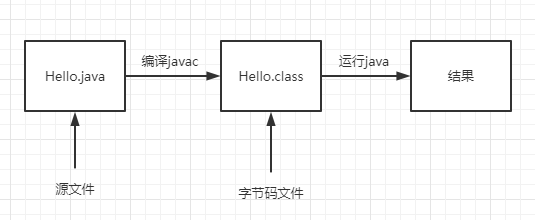
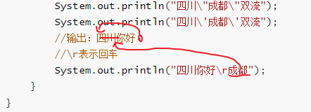
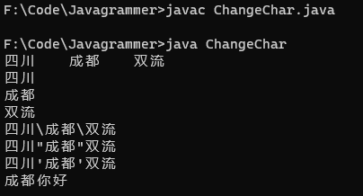
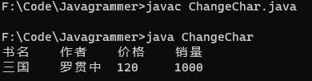
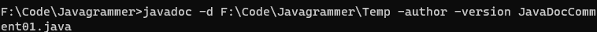
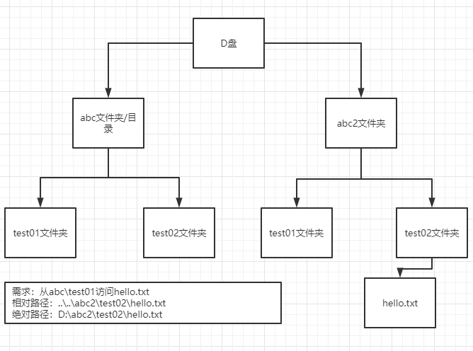
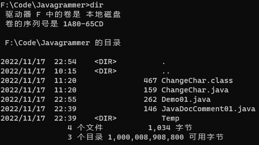
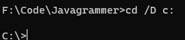
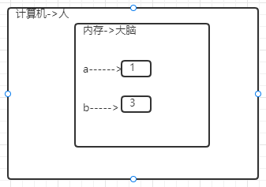

# JAVA基础

## 第1章	基础知识

## 第2章	JAVA概述

### Java运行机制



- 什么是编译

  java Hello.java

- 有了java源文件，通过编译器将其编译成JVM可以识别的字节码文件。

- 在该源文件目录下，通过javac编译工具对Hello.java文件进行编译。

- 如果程序没有错误，没有任何提示，但在当前目录下会出现一个Hello.class文件，该文件称为字节码文件，也是执行的java的程序。

```java
/*
对代码的相关说明
1、public class Hello表示Hello是个类，是一个public公有的类
2、Hello{}表示一个类的开始和结束
3、public static void main(String[] args)表示一个主方法，即我们程序的入口
4、main(){}表示方法的开始和结束
5、System.out.println("Hello,world!!!");表示输出"Hello,world!!!"到屏幕
6、;表示语句结束
*/
public class Hello{
    //编写一个main方法
    public static void main(String[] args){
        System.out.println("Hello,World!!!");
    }
}
//一个源文件中最多只能有一个public类。其他类的个数不限。
//编译后，每一个类，都对应一个.class
//Dog是一个类
class Dog{
    
}
//Tiger是一个类
class Tiger{
    
}
//一个源文件中最多只能有一个public类。其他类的个数不限，也可以将main方法写在非public类中，然后指定运行非public类，这样入口方法就是非public的main方法。
class test{
    public static void main(String[] args){
        System.out.println("Hello test!!");
    }
}
//java test-Hello test!!
```

- 什么是运行

  1、有了可执行的java程序（Hello.class字节码文件)

  2、通过运行工具java.exe对字节码文件进行执行，本质就是.class装载到jvm机执行。

- java程序开发注意事项

  对修改后的Hello.java源文件需要重新编译，生成新的class文件后，再进行执行，才能生效。

环境变量path配置

1、环境变量的作用是为了在dos的任意目录，可以去使用java和javac命令

2、先配置JAVA_HOME = 指向jdk安装的主目录

3、编辑path环境变量，增加%JAVA_HOME%\bin

#### Java开发注意事项和细节说明

1. Java源文件以`.java`为扩展名。源文件的基本组成部分是类（class），如本类中的Hello类。

2. Java应用程序的执行入口是main()方法。它有固定的书写格式：

   `public static void main(String[] args){...}`

3. Java语言严格区分大小写

4. Java方法由一条条语句构成，每个语句以`;`结束。

5. 大括号都是成对出现的，缺一不可。[习惯，先写{}再写代码]

6. 一个源文件中最多只能有一个public类。其他类的个数不限。

7. 如果源文件包含一个public类，则文件名必须按该类名命名！！！

8. 一个源文件中最多只能有一个public类。其他类的个数不限，也可以将main方法写在非public类中，然后指定运行非public类，这样入口方法就是非public的main方法。

### 转义字符

- Java常用的转义字符

  | 符号 | 说明                                         |
  | ---- | -------------------------------------------- |
  | `\t` | 一个制表位，实现对齐的功能                   |
  | `\n` | 换行符                                       |
  | `\\` | 一个\                                        |
  | `\"` | 一个"                                        |
  | `\'` | 一个'                                        |
  | `\r` | 一个回车`System.out.println("hello\rjava");` |

  ```java
  //转移字符
  public class ChangeChar{
  	public static void main(String[] args){
  		System.out.println("四川\t成都\t双流");
  		System.out.println("四川\n成都\n双流");
  		System.out.println("四川\\成都\\双流");
  		System.out.println("四川\"成都\"双流");
  		System.out.println("四川\'成都\'双流");
          //输出：四川你好
          //\r表示回车
  		System.out.println("四川你好\r成都");
  	}
  }
  ```

  



```java
//练习：请使用一句输出语句，达到输入如下图形的效果
```



```java
public class ChangeChar{
	public static void main(String[] args){
		System.out.println("书名\t作者\t价格\t销量\n三国\t罗贯中\t120\t1000");
	}
}
```

### 注释（comment）

- 介绍

  用于注解说明解释程序的文字就是注释，注释提高了代码的阅读性（可读性）；注释是**一个程序员必须具有的良好编程习惯**。将自己的思想通过注释先整理出来，再用代码去体现。

- Java中的注释类型

  1、单行注释

  格式：`//注释文字`

  2、多行注释

  格式：`/*注释文字*/`

  使用细节

  ​	1、被注释的文字，不会被JVM（java虚拟机）解释执行

  ​	2、多行注释里面不允许有多行注释嵌套

  3、文档注释

  注释内容可以被JDK提供的工具javadoc所解析，生成一套以网页文件形式体现的该程序的说明文档，一般写在类

  基本格式

  如何生成对应的文档注释

  应用实例

  ```java
  javadoc -d 文件夹名 -xx -yy Demo03.java
  ```

  `javadoc标签`

  | 标签          | 描述                                                   | 示例                                                         |
  | ------------- | ------------------------------------------------------ | ------------------------------------------------------------ |
  | @author       | 标识一个类的作者，一般用于类注释                       | @author description                                          |
  | @deprecated   | 指名一个过期的类或成员，表明该类或方法不建议使用       | @deprecated description                                      |
  | {@docRoot}    | 指明当前文档根目录的路径                               | Directory Path                                               |
  | @exception    | 可能抛出异常的说明，一般用于方法注释                   | @exception exception-name explanation                        |
  | {@inheritDoc} | 从直接父类继承的注释                                   | Inherits a comment from the immediate surperclass.           |
  | {@link}       | 插入一个到另一个主题的链接                             | {@link name text}                                            |
  | {@linkplain}  | 插入一个到另一个主题的链接，但是该链接显示纯文本字体   | Inserts an in-line link to another topic.                    |
  | @param        | 说明一个方法的参数，一般用于方法注释                   | @param parameter-name explanation                            |
  | @return       | 说明返回值类型，一般用于方法注释，不能出现再构造方法中 | @return explanation                                          |
  | @see          | 指定一个到另一个主题的链接                             | @see anchor                                                  |
  | @serial       | 说明一个序列化属性                                     | @serial description                                          |
  | @serialData   | 说明通过 writeObject() 和 writeExternal() 方法写的数据 | @serialData description                                      |
  | @serialField  | 说明一个 ObjectStreamField 组件                        | @serialField name type description                           |
  | @since        | 说明从哪个版本起开始有了这个函数                       | @since release                                               |
  | @throws       | 和 @exception 标签一样.                                | The @throws tag has the same meaning as the @exception tag.  |
  | {@value}      | 显示常量的值，该常量必须是 static 属性。               | Displays the value of a constant, which must be a static field. |
  | @version      | 指定类的版本，一般用于类注释                           | @version info                                                |



### 代码规范

1. 类、方法的注释，要以javadoc的方式来写
2. 非Java Doc的注释，往往是给代码的维护者看的，着重告诉读者为什么这样写，如何修改，注意什么问题等
3. 使用tab操作，实现缩进，默认整体向右边移动，用shift+tab整体想左移
4. 运算符和`=`两边习惯性各加一个空格。
5. 源文件使用utf-8编码
6. 行宽度不要超过80个字符
7. 代码编写次行风格和行尾风格

### DOS命令

- DOS介绍

  Dos：Disk Operation System磁盘操作系统。

- 相关的知识补充：相对路径，绝对路径

  - 相对路径：从当前目录开始定位，形成的一个路径
  - 绝对路径：从顶级目录D开始定位，形成的路径

  

- 常用dos命令

  - 查看当前目录有什么

    `dir `       `dir d:\abc2\test`

    

  - 切换到其他盘下：盘符号 cd   change directory

    切换到C盘：cd /D c:

    

  - 切换到当前盘的其他目录下

    cd d:\abc2test cd..\..\abc2\test

    

  - 切换到上一级

    cd ..

    

  - 切换到根目录：cd \

    cd \

  - 查看指定的目录下所有的子级目录

    tree D:

  - 清屏

    cls[苍老师]

  - 退出DOS

    exit

  - 说明：(md、rd、copy、del、echo、type、move)

## 第3章	变量

### 变量介绍

- 变量是程序的基本组成单位

  不论是使用哪种高级程序语言编写程序，变量都是其程序的基本组成单位 

  比如：//变量有三个基本要素（类型+名称+值）

  ```java
  class Test{
      public static void main(String[] args){
          int a=1;//定义了一个变量，类型是int整型，名称是a，值是1。
          int b=3;
          b=89;
          System.out.println(a);
          System.out.println(b);
      }
  }
  ```

  

- 概念

  变量相当于内存中一个数据存储空间的表示，可以把变量看做是一个房间的门牌号，通过门牌号可以找到房间，而通过变量名可以访问到变量（值）

- 变量使用的基本步骤

  - 声明变量

    int a;

  - 赋值

    a=60;

  - 使用`System.out.porinln(a);`

    `int a=60;`

```java
//变量使用
//1、定义变量
int age = 20;
double score = 88.6;
char gender = '男';
String name = "johnny";
```

变量使用注意事项

1. 变量表示内存中的一个存储区域[不同的变量、类型不同、占用的空间大小不同；比如：int 4个字节，double 8个字节]
2. 该区域有自己的名称[变量名]和类型[数据类型]
3. 变量必须先声明，后使用，既有顺序
4. 该区域的数据可以在同一类型范围内不断变化。
5. 变量在同一个作用域内不能重名
6. 变量=变量名+值+数据类型；变量三要素

### +号的使用

1. 当左右两边都是数值型时，则做加法运算
2. 当左右两边有一方为字符串，则做拼接运算
3. 运算顺序，从左往右

```java
public class Plus {
    public static void main(String[] args) {
        System.out.println(100+98);//198
        System.out.println("100"+98);//10098
        System.out.println(100+3+"hello");//1003hello
        System.out.println("hello"+100+3);//hello1003
    }
}
```

### 数据类型

每一种数据都定义了明确的数据类型，在内存中分配了不同大小的内存空间（字节）

Java数据类型

- 基本数据类型
  - 数值型
    - 整数类型，存放整数
      - byte[1]
      - short[2]
      - int[4]
      - long[8]
    - 浮点（小数）类型
      - float[4]
      - double[8]
  - 字符型(char[2])，存放单个字符`'a'`
  - 布尔型(boolean[1])，存放true，false

- 引用数据类型
  - 类（class）
  - 接口（interface）
  - 数组[]

#### 整数类型

| 类型          | 占用存储空间 | 范围           |
| ------------- | ------------ | -------------- |
| byte[字节]    | 1字节        | `-128~127`     |
| short[短整型] | 2字节        | `-2^15~2^15-1` |
| int[整型]     | 4字节        | `-2^31~2^31-1` |
| long[长整型]  | 8字节        | `-2^63~2^64-1` |

- 整型的细节

  1、Java各整数类型有固定的范围和字段长度，不受具体OS（操作系统）的影响，以保证java程序的可移植性。

  2、Java的整型常量默认为int型，声明long型常量须后加`'l'`或`'L'`

  3、Java程序中变量常声明为int型，除非不足以表示大数，才用long

  4、bit：计算机中最小存储单位。byte：计算机中基本存储单元，1byte=8bit。

思考：long类型，有多少个bit

（8*8=64bit）

long n =3;//内存中0 0 0 0 0 0 0 00000011 

#### 浮点类型

Java的浮点类型可以表示一个小数，比如：123.4、7.8、0.12。。。

| 类型         | 占用存储空间 | 范围                 |
| ------------ | ------------ | -------------------- |
| 单精度float  | 4字节        | -3.403E38~3.403E38   |
| 双精度double | 8字节        | -1.798E308~1.798E308 |

1、关于浮点数在机器中存放形式的说明：浮点数=符号位+指数位+尾数位

2、尾数部分可能丢失，造成精度损失（小数都是近似值）

浮点型细节

1、与整数类型类似，Java浮点类型也有固定的范围和字段长度，不受具体OS的影响

2、Java的浮点型常量默认为double型，声明float型常量，须后加'f'或'F'

3、浮点型常量有两种表示形式

​	十进制数形式：5.12、512.0f、.512（必须有小数点）

​	科学计数法形式：5.12e2[5.12*10的2次方]、5.12E-2

4、通常情况下，应该使用double型，因为它比float型更精确

```java
double num9 = 2.1234567851;
float num10 = 2.12345678F;
//2.1234567851
//2.1234567
```

5、浮点数使用陷进2.7和8.1/3比较

```java
double num = 2.7;
double num1 =8.1/3;
//2.7
//2.6999999999999997
/*
注意：对运算结果是小数的进行相等判断时，要小心
*/
double num = 2.7;
double num1 =8.1/3;
if (Math.abs(num - num1)<0.0000001) {
   System.out.println("相等");
}else {
   System.out.println("不相等");
}
```

#### Java API文档

1、API(Application Programming Interface，应用程序编程接口)是Java提供的基本编程接口`https://www.matools.com`

#### 字符类型（char）

- 基本介绍

  字符类型可以表示单个字符，字符类型是char，char是两个字节（可以存放汉字），多个字符我们用字符串String。

```java
public class Char01 {
    //演示char的基本使用
    public static void main(String[] args) {
        char c1 = 'a';
        char c2 = '\t';
        char c3 = '夏';
        char c4 = 97;
        //复制快捷键 ctrl+d
        //
        System.out.println(c1);
        System.out.println(c2);
        System.out.println(c3);
        System.out.println(c4);//输出c4时候，会输出97表示的字符
    }
}
```

- 字符类型使用细节

1. 字符常量是用单引号`''`括起来的单个字符。

   `char c1 ='a';char c2 = '中';char c3 = '9';`

2. Java中还允许使用转义字符`\`来将其后的字符转变为特殊字符型常量。

   `char c3 = '\n';//'\n'表示换行符`

3. 在Java中，char的本质是一个整数，在输出时，是unucode码对应的字符。
4. 可以直接给char赋一个整数，然后输出时，会按照对应的unicode字符输出[97]
5. char类型时可以进行运算的，相当于一个整数，因为它都对应有unicode码。


### 编码

### 数据类型转换