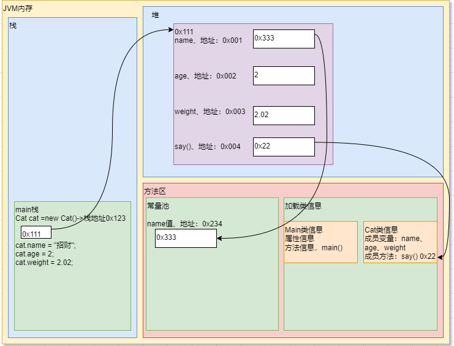
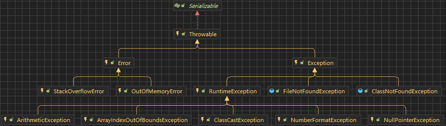
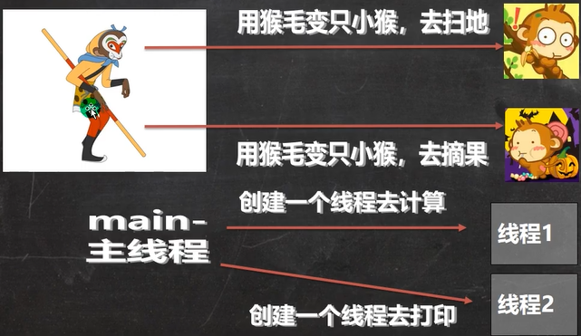
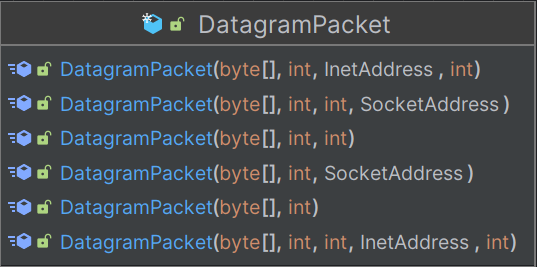
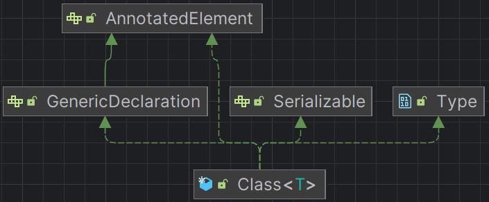

# 第1章	基础知识

# 第2章	JAVA概述

## Java运行机制


### 什么是编译

`java Hello.java`

- 有了`java`源文件，通过编译器将其编译成`JVM`可以识别的字节码文件。

- 在该源文件目录下，通过`javac`编译工具对`Hello.java`文件进行编译。

- 如果程序没有错误，没有任何提示，但在当前目录下会出现一个`Hello.class`文件，该文件称为字节码文件，也是执行的`java`的程序。

```java
/*
对代码的相关说明
1、public class Hello表示Hello是个类，是一个public公有的类
2、Hello{}表示一个类的开始和结束
3、public static void main(String[] args)表示一个主方法，即我们程序的入口
4、main(){}表示方法的开始和结束
5、System.out.println("Hello,world!!!");表示输出"Hello,world!!!"到屏幕
6、;表示语句结束
*/
public class Hello{
    //编写一个main方法
    public static void main(String[] args){
        System.out.println("Hello,World!!!");
    }
}
//一个源文件中最多只能有一个public类。其他类的个数不限。
//编译后，每一个类，都对应一个.class
//Dog是一个类
class Dog{
    
}
//Tiger是一个类
class Tiger{
    
}
//一个源文件中最多只能有一个public类。其他类的个数不限，也可以将main方法写在非public类中，然后指定运行非public类，这样入口方法就是非public的main方法。
class test{
    public static void main(String[] args){
        System.out.println("Hello test!!");
    }
}
//java test-Hello test!!
```

### 什么是运行

1、有了可执行的`java`程序（`Hello.class`字节码文件)

2、通过运行工具`java.exe`对字节码文件进行执行，本质就是`.class`装载到`jvm`机执行。

`java`程序开发注意事项

对修改后的`Hello.java`源文件需要重新编译，生成新的`class`文件后，再进行执行，才能生效。

### 环境变量path配置

1、环境变量的作用是为了在`dos`的任意目录，可以去使用`java`和`javac`命令

2、先配置`JAVA_HOME = `指向`jdk`安装的主目录

3、编辑`path`环境变量，增加`%JAVA_HOME%\bin`

## Java开发注意事项和细节说明

1. `Java`源文件以`.java`为扩展名。源文件的基本组成部分是类（`class`），如本类中的`Hello`类。

2. `Java`应用程序的执行入口是`main()`方法。它有固定的书写格式：

   `public static void main(String[] args){...}`

3. `Java`语言严格区分大小写

4. `Java`方法由一条条语句构成，每个语句以`;`结束。

5. 大括号都是成对出现的，缺一不可。[习惯，先写`{}`再写代码]

6. 一个源文件中最多只能有一个`public`类。其他类的个数不限。

7. 如果源文件包含一个`public`类，则文件名必须按该类名命名！！！

8. 一个源文件中最多只能有一个`public`类。其他类的个数不限，也可以将`main`方法写在非`public`类中，然后指定运行非`public`类，这样入口方法就是非`public`的`main`方法。

## 转义字符

### Java常用的转义字符(反斜杠)

| 符号 | 说明                                         |
| ---- | -------------------------------------------- |
| `\t` | 一个制表位，实现对齐的功能                   |
| `\n` | 换行符                                       |
| `\\` | 一个\                                        |
| `\"` | 一个"                                        |
| `\'` | 一个'                                        |
| `\r` | 一个回车`System.out.println("hello\rjava");` |

```java
//转移字符
public class ChangeChar{
	public static void main(String[] args){
		System.out.println("四川\t成都\t双流");
		System.out.println("四川\n成都\n双流");
		System.out.println("四川\\成都\\双流");
		System.out.println("四川\"成都\"双流");
		System.out.println("四川\'成都\'双流");
        //输出：四川你好
        //\r表示回车
		System.out.println("四川你好\r成都");
	}
}
```


```java
//练习：请使用一句输出语句，达到输入如下图形的效果
```


```java
public class ChangeChar{
	public static void main(String[] args){
		System.out.println("书名\t作者\t价格\t销量\n三国\t罗贯中\t120\t1000");
	}
}
```

## 注释（comment）

### 介绍

用于注解说明解释程序的文字就是注释，注释提高了代码的阅读性（可读性）；注释是**一个程序员必须具有的良好编程习惯**。将自己的思想通过注释先整理出来，再用代码去体现。

### Java中的注释类型

1、单行注释

格式：`//注释文字`

2、多行注释

格式：`/*注释文字*/`

### 使用细节

​	1、被注释的文字，不会被`JVM`（`java`虚拟机）解释执行

​	2、多行注释里面不允许有多行注释嵌套

​	3、文档注释

注释内容可以被`JDK`提供的工具`javadoc`所解析，生成一套以网页文件形式体现的该程序的说明文档，一般写在类

### 基本格式

如何生成对应的文档注释

应用实例

```java
javadoc -d 文件夹名 -xx -yy Demo03.java
```

`javadoc标签`

| 标签          | 描述                                                   | 示例                                                         |
| ------------- | ------------------------------------------------------ | ------------------------------------------------------------ |
| @author       | 标识一个类的作者，一般用于类注释                       | @author description                                          |
| @deprecated   | 指名一个过期的类或成员，表明该类或方法不建议使用       | @deprecated description                                      |
| {@docRoot}    | 指明当前文档根目录的路径                               | Directory Path                                               |
| @exception    | 可能抛出异常的说明，一般用于方法注释                   | @exception exception-name explanation                        |
| {@inheritDoc} | 从直接父类继承的注释                                   | Inherits a comment from the immediate surperclass.           |
| {@link}       | 插入一个到另一个主题的链接                             | {@link name text}                                            |
| {@linkplain}  | 插入一个到另一个主题的链接，但是该链接显示纯文本字体   | Inserts an in-line link to another topic.                    |
| @param        | 说明一个方法的参数，一般用于方法注释                   | @param parameter-name explanation                            |
| @return       | 说明返回值类型，一般用于方法注释，不能出现再构造方法中 | @return explanation                                          |
| @see          | 指定一个到另一个主题的链接                             | @see anchor                                                  |
| @serial       | 说明一个序列化属性                                     | @serial description                                          |
| @serialData   | 说明通过 writeObject() 和 writeExternal() 方法写的数据 | @serialData description                                      |
| @serialField  | 说明一个 ObjectStreamField 组件                        | @serialField name type description                           |
| @since        | 说明从哪个版本起开始有了这个函数                       | @since release                                               |
| @throws       | 和 @exception 标签一样.                                | The @throws tag has the same meaning as the @exception tag.  |
| {@value}      | 显示常量的值，该常量必须是 static 属性。               | Displays the value of a constant, which must be a static field. |
| @version      | 指定类的版本，一般用于类注释                           | @version info                                                |


## 代码规范

1. 类、方法的注释，要以`javadoc`的方式来写
2. 非`Java Doc`的注释，往往是给代码的维护者看的，着重告诉读者为什么这样写，如何修改，注意什么问题等
3. 使用`tab`操作，实现缩进，默认整体向右边移动，用`shift+tab`整体想左移
4. 运算符和`=`两边习惯性各加一个空格。
5. 源文件使用`utf-8`编码
6. 行宽度不要超过`80`个字符
7. 代码编写次行风格和行尾风格

## DOS命令

### DOS介绍

`Dos`：`Disk Operation System`磁盘操作系统。

### 相关的知识补充：相对路径，绝对路径

- 相对路径：从当前目录开始定位，形成的一个路径
- 绝对路径：从顶级目录D开始定位，形成的路径


### 常用dos命令

- 查看当前目录有什么

  `dir `       `dir d:\abc2\test`

  

- 切换到其他盘下：盘符号` cd   change directory`

  切换到`C`盘：`cd /D c:`

  

- 切换到当前盘的其他目录下

  `cd d:\abc2test cd..\..\abc2\test`

  

- 切换到上一级

  `cd ..`

  

- 切换到根目录：`cd \`

  `cd \`

- 查看指定的目录下所有的子级目录

  `tree D:`

- 清屏

  `cls[苍老师]`

- 退出`DOS`

  `exit`

- 说明：`(md、rd、copy、del、echo、type、move)`

# 第3章	变量

## 变量介绍

- 变量是程序的基本组成单位

  不论是使用哪种高级程序语言编写程序，变量都是其程序的基本组成单位 

  比如：//变量有三个基本要素（类型+名称+值）

  ```java
  class Test{
      public static void main(String[] args){
          int a=1;//定义了一个变量，类型是int整型，名称是a，值是1。
          int b=3;
          b=89;
          System.out.println(a);
          System.out.println(b);
      }
  }
  ```

  

- 概念

  变量相当于内存中一个数据存储空间的表示，可以把变量看做是一个房间的门牌号，通过门牌号可以找到房间，而通过变量名可以访问到变量（值）

- 变量使用的基本步骤

  - 声明变量（先指定变量的类型，然后是变量名）

    `int a;`

  - 赋值

    `a=60;`

  - 使用`System.out.porinln(a);`

    `int a=60;`

```java
//变量使用
//1、定义变量
int age = 20;
double score = 88.6;
char gender = '男';
String name = "johnny";
```

### 变量使用注意事项

1. 变量表示**内存中**的一个**存储区域**[不同的变量、类型不同、占用的空间大小不同；比如：`int` 4个字节，`double` 8个字节]。
2. 该区域有自己的名称[变量名]和类型[数据类型]。
3. 变量必须先声明，后使用，既有顺序。
4. 该区域的数据可以在**同一类型范**围内不断变化。
5. 变量在同一个作用域内不能重名。
6. 变量=变量名（字母开头+字母/数字组成）+值+数据类型；变量**三要素。**

## final关键字

`final`（最终的，最后的）可以修饰类、属性、方法和局部变量。

1. 当不希望类被继承时，可以用`final`修饰。
2. 当不希望父类的某个方法被子类覆盖/重写(`override`)时，可以用`final`关键字修饰。
3. 当不希望类的某个属性的值被修改，可以使用`final`修饰。
4. 当不希望某个局部变量被修改，可以使用`final`修饰

```java
public class Final01 {
    public static void main(String[] args) {
        E e = new E();
        //e.TAX_RATE=0.09;
        System.out.println(e.TAX_RATE);
        A a = new A();
    }
}

//如果要求A类不能被其他类继承，
//使用final修饰A类
final class A {
}

/*class B extends A {
}*/
class C {
    //如果我们要求hi不能被子类重写
    //使用final修饰hi方法
    //public final void hi(){}
}

class D extends C {
   /* @Override
    //重写了C类的hi方法
    public void hi() {
        super.hi();
    }*/
}

class E {
    public final double TAX_RATE = 0.08;
}
```

### final注意事项和细节

1. `final`修饰的属性又叫常量，一般用全大写命名。
2. `final`修饰的属性在定义时，必须赋初值，并且以后不能再修改，赋值可以再如下位置之一。
   1. 定义时：如`public final double TAX_RATE=0.08;`
   2. 在构造器中。
   3. 在代码块中。
3. 如果`final`修饰的属性是静态的，则初始化的位置只能是
   1. 定义时
   2. 在静态代码块，不能再构造器中赋值。
4. `final`类不能继承，但是可以实例化对象。
5. 如果类不是`final`类，但是含有`final`方法，则该方法虽然不能重写，但是可以被继承。

```java
public class FinalDetail_ {
    public static void main(String[] args) {
        CC cc = new CC();
        new EE().cal();//cal方法
    }
}

class AA {
    public final double TAX_RATE = 0.08;//定义时
    public final double TAX_RATE02;
    public final double TAX_RATE03;

    public AA() {
        TAX_RATE02 = 1.1;//构造器
    }

    {
        TAX_RATE03 = 9.9;//代码块
    }
}

class BB {
    public static final double B = 9.99;//定义时
    public static final double BBBB;

    static {
        BBBB = 9.98;//静态代码块中
    }
}
//final类不能继承，但是可以实例化对象
final class CC{

}
class DD {
    public final void cal(){
        System.out.println("cal方法");
    }
}
class EE extends DD{

}
```

6. 一般来说，如果一个类已经是`final`类了，就没必要再将方法修饰成`final`方法。
7. `final`不能修饰构造方法（即构造器）
8. `final`和`static`往往搭配使用，效率更高，不会导致类加载。底层编译器做了优化处理。
9. 包装类（`Integer、Double、Float、Boolean`等都是`final`），`String`也是`final`类。

```java
public class FinalDetail02 {
    public static void main(String[] args) {
        System.out.println(BBBB.num);
        //包装类，String是final类，不能被继承

    }
}
//final和static往往搭配使用，效率更高，不会导致类加载。底层编译器做了优化处理。
class BBBB{
    public final static int num =10000;
    static{
        System.out.println("BBB静态代码块被执行");
    }
}
final class AAA{
    public void cry(){}
}
```

### 例题

```java
public class FinalExercise01 {
    public static void main(String[] args) {
        //能够求圆形的面积。要求圆周率为3.14,赋值的位置3个方式都写
        Circle circle = new Circle(5.0);
        System.out.println(circle.getArea());
    }
}

class Circle {
    private double radius;
    private final double PI = 3.14;

    //构造器
    public Circle(double radius) {
        this.radius = radius;
        //PI = 3.14;
    }

    {
        //PI = 3.14;
    }

    public double getArea() {
        return PI * radius * radius;
    }
}
```

## +号的使用

1. 当左右两边**都是数值型**时，则做**加法运算**
2. 当左右两边**有一方为字符串**，则做**拼接运算**
3. 运算顺序，从左往右

```java
public class Plus {
    public static void main(String[] args) {
        System.out.println(100+98);//198
        System.out.println("100"+98);//10098
        System.out.println(100+3+"hello");//1003hello
        System.out.println("hello"+100+3);//hello1003
    }
}
```

## 数据类型

`Java`是一种强类型语言。意味着必须为每一个变量声明一种类型。

每一种数据都定义了明确的数据类型，在内存中分配了不同大小的内存空间（字节）

Java数据类型

- 基本数据类型（8种）
  - 数值型
    - 整数类型，存放整数
      - byte[1]
      - short[2]
      - int[4]
      - long[8]
    - 浮点（小数）类型（用于表示`Unicode`编码的代码单元）
      - float[4]
      - double[8]
  - 字符型(char[2])，存放单个字符`'a'`
  - 布尔型(boolean[1])，存放`true`，`false`

- 引用数据类型
  - 类（`class`）
  - 接口（`interface`）
  - 数组`[]`

### 整型

整形用于表示没有小数部分的数值，允许是负数。

| 类型          | 占用存储空间 | 范围           |
| ------------- | ------------ | -------------- |
| byte[字节]    | 1字节        | `-128~127`     |
| short[短整型] | 2字节        | `-2^15~2^15-1` |
| int[整型]     | 4字节        | `-2^31~2^31-1` |
| long[长整型]  | 8字节        | `-2^63~2^64-1` |

#### 整型的细节

1. `Java`各整数类型有**固定**的**范围**和字段长度，**不受具体OS（操作系统）的影响**，以保证`java`程序的可移植性。
2. `Java`的整型常量默认为`int`型，声明`long`型常量须后加`'l'`或`'L'`。
3. `Java`程序中变量常声明为`int`型，除非不足以表示大数，才用`long`。
4. `bit`：计算机中最小存储单位。`byte`：计算机中基本存储单元，`1byte=8bit`。
5. `java7`开始，还可以为数字加下划线：`1_000_000`表示100万（`0b/0B`表示二进制）。

思考：`long`类型，有多少个`bit`

（`8*8=64bit`）

`long n =3`;//内存中`0 0 0 0 0 0 0 00000011 `

### 浮点类型

`Java`的浮点类型可以表示一个小数，比如：123.4、7.8、0.12。。。

| 类型           | 占用存储空间 | 范围                               |
| -------------- | ------------ | ---------------------------------- |
| 单精度`float`  | 4字节        | `-3.403E38~3.403E38`(有效位6-7位)  |
| 双精度`double` | 8字节        | `-1.798E308~1.798E308`(有效位15位) |

1. 关于浮点数在机器中存放形式的说明：浮点数=符号位+指数位+尾数位
2. 尾数部分可能丢失，造成精度损失（小数都是近似值）

#### 浮点型细节

1. 与整数类型类似，`Java`浮点类型也有固定的范围和字段长度，不受具体`OS`的影响

2. `Java`的**浮点型常量默认**为`double`型，声明`float`型常量，须后加`f`或`F`。

3. 浮点型常量有两种表示形式

   十进制数形式：5.12、512.0f、.512（必须有小数点）

   科学计数法形式：5.12e2[5.12`*`10^2^]、5.12E-2[5.12`*`10^-2^]

4. 通常情况下，应该使用`double`型，因为它比`float`型更精确

```java
double num9 = 2.1234567851;
float num10 = 2.12345678F;
//2.1234567851
//2.1234567
```

5. 浮点数使用陷阱2.7和8.1/3比较

```java
double num = 2.7;
double num1 =8.1/3;
//2.7
//2.6999999999999997
/*
注意：对运算结果是小数的进行相等判断时，要小心
*/
double num = 2.7;
double num1 =8.1/3;
if (Math.abs(num - num1)<0.0000001) {
   System.out.println("相等");
}else {
   System.out.println("不相等");
}
```

6. 三个特殊值：`Double.POSTIVE_INFINITY(正无穷)、Double.NEGATIVE_INFINITY(负无穷)、Double.NaN(非数)`

### Java API文档

1、`API(Application Programming Interface)`，应用程序编程接口)是`Java`提供的基本编程接口https://www.matools.com

### 字符类型（char）

#### 基本介绍

字符类型可以表示单个字符（用单引号括起来），字符类型是`char`，`char`是两个字节（可以存放汉字），多个字符我们用字符串`String`。

```java
public class Char01 {
    //演示char的基本使用
    public static void main(String[] args) {
        char c1 = 'a';
        char c2 = '\t';
        char c3 = '夏';
        char c4 = 97;
        //复制快捷键 ctrl+d
        //
        System.out.println(c1);//a
        System.out.println(c2);//制表位
        System.out.println(c3);//夏
        System.out.println(c4);//输出c4时候，会输出97表示的字符 a
    }
}
```

#### 字符类型使用细节

1. 字符常量是用单引号`''`括起来的单个字符。

   `char c1 ='a';char c2 = '中';char c3 = '9';`

2. `Java`中还允许使用转义字符`\`来将其后的字符转变为特殊字符型常量。

   `char c3 = '\n';//'\n'表示换行符`

3. 在`Java`中，`char`的本质是一个整数，在输出时，是`unicode`码对应的字符。

4. 可以直接给`char`赋一个整数，然后输出时，会按照对应的`unicode`字符输出[97]

5. `char`类型时可以进行运算的，相当于一个整数，因为它都对应有`unicode`码。

6. `char`类的值可以表示位十六进制值，范围从`\u0000~\uFFFF`。转义字符`\u`还可以出现再加引号的字符常量或字符串之外。（而其他转移字符不可以）

```java
public class CharDetail {
    public static void main(String[] args) {
        char c1 = 97;
        System.out.println(c1);//a
        char c2 = 'a';
        System.out.println((int)c2);
        char c3 = '夏';
        System.out.println((int)c3);//22799
        System.out.println((char)(c2 + 10));//107
        char c5 ='b'+1;
        System.out.println((int)c5);//99
        System.out.println(c5);//c
    }

```

#### 字符类型本质探讨

1. 字符型存储到计算机中，需要将字符对应的码值（整数）找出来，比如`'a'`

存储：`'a'==>码值97==>二进制==>存储`

读取：`二进制==>97==>'a'==>显示`

2. 字符和码值的对应关系时通过字符编码表绝对的（规定好的）

### 布尔类型：boolean

#### 基本介绍

1. 布尔类型也叫`boolean`类型，`boolean`类型数据只允许取值`true`和`false`，用来判定逻辑条件，无`null`
2. `boolean`类型占1个字节
3. `boolean`类型试于逻辑运算，一般用于程序流程控制
   - `if`条件控制语句
   - `while`循环控制语句
   - `do-while`循环控制语句
   - `for`循环控制语句

```java
public class Boolean {
    public static void main(String[] args) {
        //定义一个布尔变量
        boolean pass = true;
        if(pass == true){
            System.out.println("考试通过");
        }else {
            System.out.println("考试未通过");
        }
    }
}
```

#### 使用细节说明

1. 不可以用`0`或非`0`的整数代替`false`和`true`，这点和`C`语言不同
2. **整形值和布尔值之间不能相互转换。**

### 字符串

**每个用双引号括起来的字符串都是`String`类的一个实例**。

#### 子串

`String`类的`substring(a,b)`方法可以从一个较大的字符串提取一个子串。

#### 检测字符串是否相等

可以使用`equals`方法检测两个字符串是否相等。

`s.equals(str);`

如果字符串s和字符串str相等，则返回true；否则返回false。

#### 空串与Null串

空串`""`长度为0的字符串。

`if(str.length()==0)`或`if(str.equals(""))`

空串是一个`java`对象，有自己的串长度(0)和内容(空)。

`null`：表示目前没有任何对象与该变量关联。

## 大数

如果基本的整数和浮点数精度不能够满足需求，一下两个类可以满足。

`BigInteger`:实现任意精度的整数运算

 `BigDecimal`:实现任意精度的浮点数运算

使用静态的`valueOf()`方法可以将普通的数值转换为大数。

```java
public class BigInteger_ {
    public static void main(String[] args) {
        //使用静态的valueOf()方法可以将普通的数值转换为大数.
        BigInteger a = BigInteger.valueOf(100);
        System.out.println(a);
        BigInteger b = BigInteger.valueOf(9);//109
        //add=+
        System.out.println(a.add(b));
        //multiply = *
        System.out.println(a.multiply(b));//900
    }
}
```

## 编码

### 介绍一下字符编码表

`ASCII`(`ASCII`编码一个字节表示，一个128个字符，实际上一个字节可以表示256个字符，只用128个)

`Unicode`（`Unicode`编码表固定大小的编码使用两个字节来表示字符，字母和汉字统一都是占用两个字节，这样浪费空间）

`utf-8`（编码表，大小可变的编码字母使用1个字节，汉字使用3个字节）

`gbk`（可以表示汉字，而且范围广，字母使用1个字节，汉字2个字节）

`gb2312`（可以表示汉字，`gb2312<gbk`）

`big5`码（繁体中文，台湾，香港）

- `ASCII`码介绍

1. `ASCII`码：上个设计60年代，美国制定了一套字符编码（使用一个字节），对英语字符与二进制位之间的关系，做了统一规定。这被称为ASCII码。ASCII码一共规定了128个字符的编码，只占用了一个字节的后面7位，最前面的1位统一规定为0。特别提示：一个字节可以表示256字符，ASCII码只用了128个字符。
2. 看完整的`ASCII`码表
3. 缺点：不能表示所有字符

- `Unicode`编码

1. 好处：一种编码，将世界上所有的字符都纳入其中。每一个符号都给予一个独一无二的编码，使用`Unicode`没有乱码的问题。
2. 缺点、：一个英文字母和一个汉字都占用2个字节，这对于存储空间来说时浪费。
3. 2的16次方时65536，所以最多编码时655367个字符
4.  编码0~127的字符是与ASCII的编码一样。比如：`'a'`在ASCII码是0x61，在Unicode码是0x0061，都对应97因此`Unicode`码兼容`ASCII`码。

- `UTF-8`编码

1. `UTF-8`是在互联网上使用最广的一种`Unicode`的实现方式
2. `UTF-8`是一种变长的编码方式。它可以使使用1-6个字符表示一个符号，根据不同的符号变化字节长度。
3. 使用大小可变的编码字母占1个字节，汉字占3个字节。

## 数据类型转换

### 自动类型转换

当java程序在进行赋值或运算时，精度小的类型自动转换为精度达的数据类型，这个就是自动类型转换。

数据类型精度（容量）大小排序为（背，规则）


1. 实线箭头表示无信息丢失的转换。
2. 虚线箭头表示可能有精度损失的转换。

```java
public class AutoConvert {
    public static void main(String[] args) {
        int a = 'c';
        double d= 80;
        System.out.println(a);//99
        System.out.println(d);//80.0
    }
}
```

#### 自动类型转换注意和细节

1. 有多种类型的数据混合运算时，**系统首先自动将所有数据转换成容量最大的那种数据类型**，然后再进行计算。
2. 当我们把精度（容量）大的数据类型赋值给精度（容量）小的数据类型时，就会报错，反之就会进行自动类型转换。
3. （`byte、short`）和`char`之间**不会相互自动转换**。
4. `byte、short、char`他们三者可以计算，在计算时**首先转换为int类型**。
5. `boolean`不参与转换。
6. 自动提升原则：表达式结果的类型自动提升为操作数中最大的类型。

```java
public class AutoConvertDetail {
    public static void main(String[] args) {
        //有多种类型的数据混合运算时，系统首先自动将所有数据转换成容量最大的那种数据类型，然后再进行计算.
        int n1 = 10;
        //float d1 = n1+1.1;//错误 n1+1.1 =>结果是double类型;
        //float d1= n1+1.1F;
        double d1 = n1 + 1.1;
        //（byte、short）和char之间不会相互自动转换.
        //当把具体数赋给byte时，先判断改数是否在byte范围内，如果时就可以
        byte b1 = 10;
        int n2 = 1;//n2是int
        //byte b2 = n2;//错误，如果是变量赋值，判断类型
        //char c1 =b1;//错误，byte不能自动转成char
        //byte、short、char他们三者可以计算，在计算时首先转换为int类型
        byte b2 = 1;
        byte b3 = 2;
        short s1 = 1;
        //short s2 =b2 + s1;//错误，b2 + s1=>int
        int s2 = b2 + s1;
        //byte b4 = b2+b3;//错误，b2+b3=>int
        byte b4 = 1;
        short s3 = 100;
        int num200 = 1;
        float num300 = 1.1F;
        double num500 = b4 + s3 + num200 + num300;
    }
}
```

### 强制类型转换

自动类型转换的逆过程，将容量大的数据类型转换为容量小的数据类型，使用时要加上强制转换符`（）`，但可能照成**精度降低或溢出**，格外注意。

```java
public class ForceConvert {
    public static void main(String[] args) {
        int i = (int) 1.9;//精度损失
        System.out.println("n1=" + i);//1
        int i2 = 2000;
        byte b1 = (byte) i2;//-48 数据溢出
        System.out.println("b1=" + b1);
    }
}
```

#### 强制类型转换细节说明

1. 当进行数据的大小从大->小，就需要使用强制转换

2. 强转符号只针对于最近的操作数有效，往往会使用小括号提升优先级

   ```java
   //int x =(int)10*3.5+6*1.5;//double->int
   int x = (int)(10*3.5+6*1.5);
   System.out.println(x);
   ```

3. `char`类型可以保存`int`的常量值，但不能保存int的变量值，需要强转

   ```java
   char c1 = 100;//ok
   int m =100;//ok
   //char c2 = m;//错误
   char c2 = (char)m;
   System.out.println(c2);
   ```

4. `byte`和`short`,`shar`类型在进行运算时，当作`int`类型处理

### 基本数据类型转换-练习

```java
short s = 12;//ok
s = s - 9;//no int -> short
byte b = 10;//ok
b = b + 11;//no int ->byte
b = (byte) (b + 11);//ok
char c = 'a';//ok
int i = 16;//ok
float d = .314F;//ok
double result = c + i + d;//ok
byte b = 16;//ok
short s 14;//ok
short s +b;//no int->short
```

### 基本数据类型和String类型的转换

在程序开发中，我们进程需要将基本数据类型转成`String`类型。或者将`String`类型转成基本数据类型。

#### 基本类型转`String`类型

`语法：将基本类型的值+""即可`

```java
//基本->String
int n1 = 100;
float f1 = 1.1F;
double d1 = 4.5;
boolean b1 = true;
String s1 = n1 + "";
String s2 = f1 + "";
String s3 = d1 + "";
String s4 = b1 + "";
System.out.println(s1 + "\t" + s2 + "\t" + s3 + "\t" + s4);//100	1.1	4.5	true
```

#### String类型转基本数据类型

`语法：通过基本类型的包装类调用parseXX方法即可`

```java
//String->对应的基本数据类型
//解读 使用基本数据类型对应的包装类，得到基本数据类型（基本类型包装类.parseXX();）
String s5 = "123";
int num1 = Integer.parseInt(s5);//123
double num2 = Double.parseDouble(s5);//123.0
float num3 = Float.parseFloat(s5);//123.0
System.out.println(num1 + "\t" + num2 + "\t" + num3);//123	123.0	123.0
//怎么把字符串转成字符char->含义是指把字符串的第一个字符得到
//解读s5.charAt(0)得到s5字符串的第一个字符'1'
//调用s.charAt(n)将返回位置n的代码单元，n介于0~s.length()-1之间。
System.out.println(s5.charAt(0));//1
```

1. 在将`String`类型转成基本数据类型时，要确保`String`类型能够转成有效的数，比如：我们把`“123”`转成一个整数，但是不能把`“hello”`转成一个整数。
2. 如果格式不正确，就会抛出异常，程序就会终止。

### 本章作业

```java
//1、程序阅读，看看输出什么？HomeWork01.java
public class HomeWork01 {
    public static void main(String[] args) {
        int n1;
        n1 = 13;
        int n2;
        n2 = 17;
        int n3;
        n3 = n1 + n2;
        System.out.println("n3=" + n3);//30
        int n4 = 38;
        int n5 = n4 - n3;
        System.out.println("n5=" + n5);//8
    }
}
```

```java
//2、使用char类型，分别保存\n\t\r\\ 1 2 3 等字符，并打印输出
public class HomeWork02 {
    public static void main(String[] args) {
        char c1 = '\n';//换行
        char c2 = '\t';//制表位
        char c3 = '\r';//回车
        char c4 = '\\';//斜杠
        char c5 = '1';//‘1’
        char c6 = '2';//‘2‘
        char c7 = '3';//’3‘
        System.out.println(c1 + "\t" + c2 + "\t" + c3 + "\t" + c4 + "\t" + c5 + "\t" + c6 + "\t" + c7);
    }
}
```

```java
//3、编程，保存两本书名，用+拼接，看效果。保存两个性别，用+拼接，看效果。
public class HomeWork03 {
    public static void main(String[] args) {
        //保存两本书名，用+拼接
        String book01 = "天龙八部";
        String book02 = "笑傲江湖";
        System.out.println(book01+book02);//天龙八部笑傲江湖
        //保存两个性别
        char sex01='男';
        char sex02='女';
        System.out.println(sex01+sex02);//52906 男 字符码值+女 字符码值
        
    }
}
```

```java
//4、编程实现如下效果
public class HomeWork04 {
    public static void main(String[] args) {
        //4、编程实现如下效果
        //姓名    年龄  成绩  性别  爱好
        /*
        要求：
        1、用变量将姓名、年龄、成绩、性别、爱好存储
        2、使用+
        3、添加适当的注释
        4、添加转义字符，使用一条语句输出
        */
        String name = "范夏源";
        byte age = 24;
        double score = 98.9;
        char gender = '男';
        String like = "篮球";
        System.out.println("姓名：" + name + "\n" +
                "年龄：" + age + "\n" +
                "成绩：" + score + "\n" +
                "性别：" + gender + "\n" +
                 "爱好：" + like + "\n");
    }
}
/*
姓名：范夏源
年龄：24
成绩：98.9
性别：男
爱好：篮球
*/
```

# 第4章	运算符

## 运算符介绍

运算符是一种特殊的符号，用以表示数据的运算、赋值和比较等

## 算数运算符

算数运算符符是对数值类型的变量进行运算的，在Java程序中使用的非常多。

| 运算符 | 运算                                   | 范例                | 结果          |
| ------ | -------------------------------------- | ------------------- | ------------- |
| +      | 正号                                   | +7                  | 7             |
| -      | 负号                                   | b=11;-b             | -11           |
| +      | 加                                     | 9+9                 | 18            |
| =      | 减                                     | 10-8                | 2             |
| *      | 乘                                     | 7*8                 | 56            |
| /      | 除                                     | 9/9                 | 1             |
| %      | 取模（取余）                           | 11%9                | 2             |
| ++     | 自增(前\后)：先运算后取值\先取值后运算 | `a=2;b=++a;\b=a++;` | `a=3;b=3\b=2` |
| --     | 自减(前\后)：先运算后取值\先取值后运算 | `a=2;b=--a;b\=a--;` | `a=1;b=1\b=2` |
| +      | 字符串相加                             | "lsp"+"cjk"         | "lspcjk"      |

### 案例演示

案例限时算符运算符的使用（`ArithmeticOperator`）

```java
public class ArithmeticOperator {
    public static void main(String[] args) {
        //演示算数运算符
        System.out.println(10 / 4);//2
        System.out.println(10.0 / 4);//2.5
        double d = 10 / 4;//java中10/4=2=>2.0
        System.out.println(d);//2.0
        System.out.println("=======================");
        //% 取模、取余数
        //%的本质 看一个公式 a%b=a-a/b*b(余数的符号看除数)
        System.out.println(10 % 3);//1
        System.out.println(-10 % 3);//-1
        System.out.println(10 % -3);//1
        System.out.println(-10 % -3);//-1
        System.out.println("========================");
        //++的使用
        int i = 10;
        i++;//i = i + 1;
        ++i;//i = i + 1;
        System.out.println("i=" + i);
    }
}
```

- `+、-、*、/、%、++、--，重点/、%、++`
- 自增：`++`

作为独立的语句使用：

前`++`和后`++`都完全等价于`i=i+1`；

作为表达式使用

前`++`：`++i`先自增后赋值

后`++`：`i++`先赋值后自增

- `--、+、-、*`是一个道理，完全可以类推。

```java
//面试题
public class ArithmeticOperatorExercise01 {
    public static void main(String[] args) {
        /*int i = 1;
        i = i++;//规则使用临时变量：(1)temp=i;(2)i=i+1;(3)i=temp;
        System.out.println(i);//1*/
        int i = 1;
        i = ++i;//规则使用临时变量：(1)i=i+1;(2)temp=i;(3)i=temp;
        System.out.println(i);

    }
}
//问：结果是多少？
//i=1
2、
int i = 1;
i = ++i;//规则使用临时变量：(1)i=i+1;(2)temp=i;(3)i=temp;
System.out.println(i);
```

```java
public class ArithmeticOperatorExercise02 {
    public static void main(String[] args) {
        int i1 = 10;
        int i2 = 20;
        int i = i1++;
        System.out.println("i=" + i);//10
        System.out.println("i2=" + i2);//20
        i = --i2;
        System.out.println("i=" + i);//19
        System.out.println("i2=" + i2);//19
    }
}
```


```java
public class ArithmeticOperatorExercise03 {
    public static void main(String[] args) {
        /*
         * 1、假如还有59天放假，问：合xx个星期零xx天
         * 2、定义个变量保存华氏温度，华氏温度转换摄氏温度的公式为：5/9*（华氏温度-100），
         * 请求出华氏温度对应的摄氏温度[234.5]*/
        int days = 59;//保存总天数
        System.out.println(days / 7 + "个星期零" + days % 7 + "天");//8个星期零3天
        double a = 234.5;
        System.out.println("转为摄氏度为：" + (5.0 / 9 * (a - 100)) + "摄氏度");//转为摄氏度为：74.72222222222223摄氏度

    }
}
```

## 关系运算符

1. 关系运算符的结果都是`boolean`型，也就是要么是`true`，要么是`false`。
2. 关系表达式经常用在`if`结构的条件中或循环结构的条件中

| 运算符     | 运算               | 范例                   | 结果  |
| ---------- | ------------------ | ---------------------- | ----- |
| ==         | 相等于             | 8==7                   | false |
| !=         | 不等于             | 8!=7                   | true  |
| <          | 小于               | 8<7                    | false |
| >          | 大于               | 8>7                    | true  |
| <=         | 小于等于           | 8<=7                   | fa;se |
| >=         | 大于等于           | 8>=7                   | true  |
| instanceof | 检查是否是类的对象 | "fxy"instanceof String | true  |

### 案例演示

案例演示关系运算符的使用(`RelationalOperator`)

```java
public class RelationalOperator {
    public static void main(String[] args) {
        //演示关系运算符的使用
        int a = 9;//提示：开发中，不可以使用a,b,c之类的变量名
        int b = 8;
        System.out.println(a > b);//true
        System.out.println(a >= b);//true
        System.out.println(a <= b);//false
        System.out.println(a < b);//false
        System.out.println(a == b);//false
        System.out.println(a != b);//true
        boolean flag = a > b;
        System.out.println(flag);//true
    }
}
```

### 细节说明

1. 关系运算符的结果都是`boolean`型，也就是要么`true`，要么是`false`
2. 关系运算符组成的表达式，我们称**关系表达式**。`a>b`
3. 比较运算符`==`不能误写成`=`

## 逻辑运算符

1. 短路与`&&`，短路或`||`，取反`!`
2. 逻辑与`&`，逻辑或`|`，逻辑异或`^`

| a     | b     | a&b   | a&&b  | a\|b  | a\|\|b | !a    | a^b   |
| ----- | ----- | ----- | ----- | ----- | ------ | ----- | ----- |
| true  | true  | true  | true  | true  | true   | false | false |
| true  | false | false | false | true  | true   | false | true  |
| false | true  | false | false | true  | true   | true  | true  |
| false | false | false | false | false | false  | true  | false |

### 说明逻辑运算规则

1. `a&b`：`&`叫逻辑与->当a和b同时为`true`，则结果为`true`，否则为`false`
2. `a&&b`：`&&`叫短路与->当a和b同时为`true`，则结果过为`true`，否则为`false`
3. `a|b`：`|`叫逻辑或->当a和b，有一个为`true`，则结果为`true`，否则为`false`
4. `a||b`：`||`叫短路或->当a和b，有一个为`true`，则结果为`true`，否则为`false`
5. `!a`：叫取反->当a为`true`，则结果为`false`，当`a`为`false`，结果为`true`
6. `a^b`：叫逻辑异或->当a和b不同时，则结果为`true`，否则为`false`

### &&和&基本规则

短路与`&&`：条件1`&&`条件2	两个条件都为`true`，结果为`true`，否则`false`

逻辑与`&`：条件1`&`条件2	两个条件都为`true`，结果为`true`

#### &&和&案例演示

```java
public class LogicOperator01 {
    public static void main(String[] args) {
        /*
         * 演示逻辑运算符
         * &&和&案例演示*/
        int age = 20;
        if (age > 20 && ++age < 90) {
            System.out.println("ok1");
        }
        //&
        if (age > 20 & ++age < 90) {
            System.out.println("ok2");
        }
        System.out.println("age=" + age);//21
        //区别
        int a = 4;
        int b = 9;
        //对于&&短路与而言，如果第一个条件为false，后面的条件不再判断
        //对于&逻辑与而言，如果第一个条件为false，后面的条件仍然会判断
        if (a < 1 & ++b < 50) {
            System.out.println("ok3");
        }
        System.out.println("a=" + a + "b=" + b);//a=4b=10
    }
}
```

#### &&和&使用区别

1. `&&`短路与：如果**第一个条件为false**，则**第二个条件不会判断**，最终及结果`false`，效率高。
2. `&`逻辑与：**不管第一个条件是否为false，第二条件都要判断**，效率低。
3. 开发中，我们使用的基本都是短路与`&&`，效率高。

### ||和|基本规则

短路或`||`		条件1`||`条件2		两个条件只要有一个成立，结果`true`，否则为`false`

`|`逻辑或			条件1`|`条件2		只要有一个条件成立，结果`true`，否则为`false`

#### ||和|案例演示

```java
public class LogicOperator02 {
    public static void main(String[] args) {
        /*
         * ||短路或
         * |逻辑或
         * */
        int age = 50;
        if (age > 20 || ++age < 30) {
            System.out.println("age1="+age);//age1=50
        }
        if (age > 20 | ++age < 30) {
            System.out.println("age2="+age);//age2=51
        }
    }
}
```

#### ||和|使用区别

1. `||`短路或：如果**第一个条件为`true`**，则**第二个条件不会判断**，最终为`true`，效率高
2. `|`逻辑或：不管第一个条件是否为`true`，**第二个条件都要判断**，效率低
3. 开发中，我们基本使用`||`

### ！取反基本规则

`！`非		`！`条件			如果条件本身成立，结果为`false`，否则为`true`

#### ！案例

```java
public class InverseOperator {
    public static void main(String[] args) {
        //！取反，真变假，假变真
        System.out.println(60 > 20);//T
        System.out.println(!(60 > 20));//F
        //a^b：叫逻辑异或，当a和b不同时，则结果为true，否则为false
        boolean b = (10 > 1) ^ (3 < 5);
        System.out.println("b=" + b);//F
    }
}
```

### ^异或基本规则

`a^b`：叫逻辑异或，当**a和b不同时**，则**结果为`true`**，**否则为`false`**。

### 练习题

```java
public class Test01 {
    public static void main(String[] args) {
        int x = 5;
        int y = 5;
        if (x++ == 6 & ++y == 6) {
            x = 11;
        }
        System.out.println("x=" + x + "y=" + y);//x=6y=6
    }
}
```

```java
public class Test02 {
    public static void main(String[] args) {
        int x = 5;
        int y = 5;
        if (x++ == 6 && ++y == 6) {
            x = 11;
        }
        System.out.println("x=" + x + "y=" + y);//x=6y=5
    }
}
```

```java
public class Test03 {
    public static void main(String[] args) {
        int x = 5;
        int y = 5;
        if (x++ == 6 | ++y == 6) {
            x = 11;
        }
        System.out.println("x=" + x + "y=" + y);//x=11y=6
    }
}
```

```java
public class Test04 {
    public static void main(String[] args) {
        int x = 5;
        int y = 5;
        if (x++ == 6 || ++y == 6) {
            x = 11;
        }
        System.out.println("x=" + x + "y=" + y);//x=11y=6
    }
}
```

### 赋值运算符

赋值运算符就是将某个运算后的值，赋给指定的变量。

赋值运算符的分类

1、基本赋值运算符`=`

2、复合赋值运算符`+=`、`-=`、`*=`、`/=`、`%=`等。

a+=b;=>a=a+b;

#### 案例

```java
public class AssignOperator {
    public static void main(String[] args) {
        //1、赋值基本案例 int num1 = 10;
        //2、+=的使用案例
        int num1 = 10;
        num1 += 4;//num1=num1+4;
        System.out.println(num1);//14
        num1 /= 3;
        System.out.println(num1);//4
    }
}
```

#### 赋值运算符特点

1. 运算顺序从右往左`int num = a+b+c;`

2. 赋值运算符的**左边只能是变量**，**右边**可以是**变量**、**表达式**、**常量值**。

   `int num =20;int num2 = 78*34-10;int num3 =a;`

3. 复合赋值运算符等价于下面的效果。

   `a+=3;等价于a=a+3;`

4. 复合赋值运算符会进行类型转换。

   `byte b=2;b+=3;b++;`

```java
byte b=3;
b+=2;//b=(byte)(b+2);
b++;//b=(byte)(b+1);
System.out.println(b);
```

### 三元运算符

#### 基本语法

`条件表达式？表达式1：表达式2;`

运算规则：

1. 如果条件表达式为`true`，运算后的结果是表达式1;
2. 如果条件表达式为`false`，运算后的结果是表达式2;

口诀：[一灯大师：一真大师]

#### 案例

```java
public class TernaryOperator {
    public static void main(String[] args) {
        //三元运算符
        int a = 10;
        int b = 99;
        int result = a > b ? a++ : b--;
        /*
        * 1、a>b为false
        * 2、返回b--，先返回b--的值，b再-1
        * 3、返回的结果是99*/
        System.out.println("result="+result);//99
        System.out.println("a="+a);//10
        System.out.println("b="+b);//98
    }
}
```

#### 使用细节

1. 表达式1和表达式2要为可以赋给接受变量的类型（可以自动转换或强转）

2. 三元运算符可以转成`if-else`语句

   ```java
   int result=a>b?a++:--b;
   if(a>b){
       result=a++;
   }else{
       result=--b;
   }
   ```

```java
public class TernaryOperatorDetail {
    public static void main(String[] args) {
        //表达式1和表达式2要为可以赋给接受变量的类型（可以自动转换)
        int a = 3;
        int b = 8;
        int c = a > b ? (int) 1.1 : (int) 3.4;//可以。强转
        double d = a > b ? a : b + 3;//可以自动转换
        //三元运算符可以转成if-else语句
    }
}
```

```java
//案例：实现三个数的最大值
public class TernaryOperatorExercise {
    public static void main(String[] args) {
        //实现三个数的最大值
        int n1 = 98;
        int n2 = 33;
        int n3 = 95;
        /*
         * 1、先得到n1和n2最大的数，保存到max1
         * 2、再求出max1和n3的最大数，保存max2*/
        /*int max1 = n1 > n2 ? n1 : n2;
        int max2 = max1 > n3 ? max1 : n3;
        System.out.println("最大数是：" + max2);*/
        //使用一条语句实现
        int max=(n1 > n2 ? n1 : n2)> n3 ?
                (n1 > n2 ? n1 : n2) : n3;
        System.out.println("最大数是：" + max);
    }
}
```

### 运算符优先级

1. 运算符有不同的优先级，所谓优先级就是表达式运算中的运算顺序。
2. 只有**单目运算符**、**赋值运算符**是从**右向左**运算的。

| 结合性 | 符号                                                |
| :----: | :-------------------------------------------------- |
|        | `.、()、{}、;、,`                                   |
|  R->L  | `++、--、~、!(data type)`                           |
|  L->R  | `*、/、%`                                           |
|  L->R  | `+、-`                                              |
|  L->R  | `<<、>>、>>>、位移`                                 |
|  L->R  | `<、>、<=、>=、instanceof`                          |
|  L->R  | `==、!=`                                            |
|  L->R  | `&`                                                 |
|  L->R  | `^`                                                 |
|  L->R  | `|`                                                 |
|  L->R  | `&&`                                                |
|  L->R  | `||`                                                |
|  L->R  | `? :`                                               |
|  R->L  | `=、*=、/=、%=、+=、-=、<<=、>>=、>>>=、&=、^=、|=` |

梳理小结：

1. (),{}等
2. 单目运算
3. 算术运算符
4. 位移运算符
5. 关系运算符
6. 逻辑运算符
7. 三目运算符
8. 赋值运算符

### 标识符的命名规则和规范

#### 标识符概念

1. `Java`对各种变量、方法和类等命名时使用的字符序列称为标识符
2. 凡是自己可以起名字的地方都叫标识符`int num1 = 90;`

#### 标识符的命名规则

1. 由26个英文字母大小写，0-9，_或$组成。
2. 数字不可以开头。	`int 3ab = 1;//错误`
3. 不可以使用**关键字**和**保留字**，但**能包含**关键子和保留字。
4. `Java`中严格区分大小写，长度无限制。`int totalNum = 10;int n = 90;`
5. 标识符不能包含空格。`int a b = 90;`

#### 标识符命名规范

1. **包名**：多个单词组成时**所有字母都小写**：`aaa.bbb.ccc`//比如：com.summer.crm
2. **类名、接口名**：多个单词组成时，所有单词的首字母大写：`XxYyZz`//比如：`TankShotGame`[大驼峰]
3. **变量名、方法名**：多个单词组成时，第一个单词首字母小写，第二个单词开始每个单词首字母大写：`xxxYyyZzz`//比如：`tankShotGame`[小驼峰，简称驼峰法]
4. **常量名**：**所有字母都大写**。多个单词时每个单词用**下划线连接**：`XXX_YYY_ZZZ`//比如：定义一个所得税率TAX_RATE

### 关键字

#### 关键字的定义和特点

定义：被`java`语言赋予了特殊含义，用做专门用途的字符串

特点：关键字中所有字母都为小写

#### 保留字

`java`保留字：现在`java`版本尚未使用，但以后版本可能会作为关键字使用。自己命名标识符要避免使用这些保留字

 1).访问修饰符的关键字（共3个）

| 关键字    | 意思     | 备注，常用           |
| --------- | -------- | -------------------- |
| public    | 公有的   | 可跨包，（默认选择） |
| protected | 受保护的 | 当前包内可用         |
| private   | 私有的   | 当前类可用           |

2).定义类、接口、抽象类和实现接口、继承类的关键字、实例化对象（共6个）

| 关键字     | 意思       | 备注，常用                                                   |
| ---------- | ---------- | ------------------------------------------------------------ |
| class      | 类         | public class A(){} 花括号里有已实现方法体，类名需要与文件名相同 |
| interface  | 接口       | public interface B(){} 花括号里有方法体，但没有实现，方法体句子后面是英文分号“:”结尾 |
| abstract   | 声明抽象   | public abstract class C(){} 介于类与接口中间，可以有也可以没有已经实现的方法体 |
| implements | 实现       | 用于类或接口实现接口public class A interface B(){}           |
| extends    | 继承       | 用于类继承类 public class A extends D(){}                    |
| new        | 创建新对象 | A a=new A(); A表示一个类                                     |

 3).包的关键字（共2个）

| 关键字  | 意思           | 备注，常用                                                   |
| ------- | -------------- | ------------------------------------------------------------ |
| import  | 引入包的关键字 | 当使用某个包的一些类时，仅需类名 然后使用ctrl+shift+o或者选定类名（类或属性或方法）按住ctrl+单击 即可自动插入类所在的包。如：JFrame 快捷键之后自动加入**import** javax.swing.JFrame; |
| package | 定义包的关键字 | 将所有有关的类放在一个包类以便查找修改等。如：**package** javake.flycat.draw002; |

 4).数据类型的关键字（共12个）

| 关键字  | 意思   | 备注，常用                                        |
| ------- | ------ | ------------------------------------------------- |
| byte    | 字节型 | 8bit                                              |
| char    | 字符型 | 16bit                                             |
| boolean | 布尔型 | --                                                |
| short   | 短整型 | 16bit                                             |
| int     | 整型   | 32bit                                             |
| float   | 浮点型 | 32bit                                             |
| long    | 长整型 | 64bit                                             |
| double  | 双精度 | 64bit                                             |
| void    | 无返回 | public void A(){}  其他需要返回的经常与return连用 |
| null    | 空值   |                                                   |
| true    | 真     |                                                   |
| false   | 假     |                                                   |

5).条件循环（流程控制）（共12个）

| 关键字     | 意思             | 备注，常用                                                   |
| ---------- | ---------------- | ------------------------------------------------------------ |
| if         | 如果             | if(){} 如果小括号里面怎么怎么样 花括号就怎么怎么样           |
| else       | 否则，或者       | 常与if连用，用法相同                                         |
| while      | 当什么的时候     | while 怎么样就do什么  while(){}                              |
| for        | 满足三个条件时   | for ( ; ; ){}                                                |
| switch     | 开关             | switch(表达式) { case 常量表达式1:语句1; .... case 常量表达式2:语句2; default:语句; } default就是如果没有符合的case就执行它,default并不是必须的. case后的语句可以不用大括号. switch语句的判断条件可以接受int,byte,char,short,不能接受其他类型. |
| case       | 返回开关里的结果 |                                                              |
| default    | 默认             |                                                              |
| do         | 运行             | 长与while连用                                                |
| break      | 跳出循环         |                                                              |
| continue   | 继续             | 中断本次循环，并并开始下一次                                 |
| return     | 返回             | return 一个返回值类型                                        |
| instanceof | 实例             | 一个二元操作符，和==，>，<是同一类的。测试它左边的对象是否是它右边的类的实例，返回boolean类型的数据 |

   6).修饰方法、类、属性和变量（共9个）

| 关键字       | 意思               | 备注，常用                                                   |
| ------------ | ------------------ | ------------------------------------------------------------ |
| static       | 静态的             | 属性和方法都可以用static修饰，直接使用类名.属性和方法名。 只有内部类可以使用static关键字修饰，调用直接使用类名.内部类类名进行调用。  static可以独立存在。静态块 |
| final        | 最终的不可被改变的 | 方法和类都可以用final来修饰  final修饰的类是不能被继承的  final修饰的方法是不能被子类重写。常量的定义：final修饰的属性就是常量。 |
| super        | 调用父类的方法     | 常见**public** **void** paint(Graphics g){**super**.paint(g); ··· } |
| this         | 当前类的父类的对象 | 调用当前类中的方法（表示调用这个方法的对象）this.addActionListener(al):等等 |
| native       | 本地               |                                                              |
| strictfp     | 严格,精准          |                                                              |
| synchronized | 线程,同步          |                                                              |
| transient    | 短暂               |                                                              |
| volatile     | 易失               |                                                              |

 static 例子：

```java
public class Test{
    class A{}   //内部类
    ActionListener al=new ActionListener(···){}   //匿名内部类
}
```

  静态块优先于其他方法/类的执行

   7).错误处理（共5个）

| 关键字  | 意思                   | 备注，常用                                                   |
| ------- | ---------------------- | ------------------------------------------------------------ |
| catch   | 处理异常               | 1.try+catch 程序的流程是：运行到try块中，如果有异常抛出，则转到catch块去处理。然后执行catch块后面的语句  2.try+catch+finally 程序的流程是：运行到try块中，如果有异常抛出，则转到catch块,catch块执行完毕后，执行finally块的代码，再执行finally块后面的代码。 如果没有异常抛出，执行完try块，也要去执行finally块的代码。然后执行finally块后面的语句  3.try+finally 程序的流程是：运行到try块中,如果有异常抛出的话，程序转向执行finally块的代码。那末finally块后面的代码还会被执行吗？不会！因为你没有处理异常，所以遇到异常后，执行完finally后，方法就已抛出异常的方式退出了。 这种方式中要注意的是，由于你没有捕获异常，所以要在方法后面声明抛出异常(来自网上的资料) |
| try     | 捕获异常               |                                                              |
| finally | 有没有异常都执行       |                                                              |
| throw   | 抛出一个异常对象       | 一些可以导致程序出问题的因素,比如书写错误,逻辑错误或者是api的应用错误等等. 为了防止程序的崩溃就要预先检测这些因素,所以java 使用了异常这个机制.在java中异常是靠 "抛出" 也就是英语的"throw" 来使用的,意思是如果发现到什么异常的时候就把错误信息 "抛出" |
| throws  | 声明一个异常可能被抛出 | 把异常交给他的上级管理，自己不进行异常处理                   |

byValue、cast、future、generic、inner、operator、outer、rest、var、goto、const

### 键盘输入语句

在编程中，需要接受用户输入的数据，就可以使用键盘输入语句来获取。

`Input.java`，需要一个扫描器（对象)，就是`Scanner`

`nextLine()`方法：读取到回车停止，在读取输入后将光标放在下一行。

`next()`方法：读取到空白停止，在读取输入后将光标放在同一行中。

#### 步骤

1. 导入该类的所在包，`java.util.*`
2. 创建该类对象（声明变量）
3. 调用里面的功能

#### 案例

```java
//要求：可以从控制台接收用户信息，[姓名、年龄、薪水]
public class Input {
    public static void main(String[] args) {
        //用户的输入
        //Scanner类 表示 简单的文本扫描器,在java.util包
        /*
         * 步骤
         * 1、引用Scanner类所在的包
         * 2、创建Scanner对象,new 创建一个对象
         * 3、接收用户的输入了，使用相关的方法*/
        Scanner myScanner = new Scanner(System.in);
        System.out.println("请输入名字：");
        //当程序执行到 next()方法时，会等待用户输入~~~
        String name = myScanner.next();//接受用户输入字符串
        System.out.println("清输入年龄：");
        int age = myScanner.nextInt();//接受用户输入int
        System.out.println("清输入薪水：");
        double sal = myScanner.nextDouble();
        System.out.println("名字："+name+"\n年龄："+age+"\n薪水："+sal);
        char c1 = myScanner.next().charAt(0);//a//先接受一个字符串，再接受字符串的第一个字符
        System.out.println(c1);//a
    }
    public static void m1() {
        Scanner sn = new Scanner(System.in);
        System.out.println("请输入:");
        String next = sn.next();//qaz wsx
        System.out.println("您输入的是：" + next);//您输入的是：qaz
    }

    public static void m2() {
        Scanner sn = new Scanner(System.in);
        System.out.println("请输入:");
        String next = sn.nextLine();//qaz wsx
        System.out.println("您输入的是：" + next);//您输入的是：qaz wsx
    }
}
```

### 格式化输出

`System.out.println("%8.2f",x);`

会以一个字段宽度打印x：包含8个字符，另外精度为小数点后2个字符。

| 转换符 | 类型           | 示例      | 转换符 | 类型     | 示例  |
| ------ | -------------- | --------- | ------ | -------- | ----- |
| d      | 十进制整数     | 159       | s      | 字符串   | hello |
| x      | 十六进制整数   | 9f        | c      | 字符     | H     |
| o      | 八进制整数     | 237       | b      | 布尔     | true  |
| f      | 浮点数         | 15.9      | h      | 散列码   |       |
| e      | 指数浮点数     | 1.59e+01  | %      | 百分号   | %     |
| g      | 通用浮点数     |           | n      | 行分隔符 |       |
| a      | 十六进制浮点数 | 0x1.fccdp |        |          |       |

### 进制

对于整数，有四种表示方式：

1. 二进制：0，1。满2进1，以`ob/oB`开头表示。
2. 十进制：0~9。满10进1
3. 八进制：0~7。满8进1，以数字0开头表示
4. 十六进制：`0~9，A/a(10)~F/f(15)`。满16进1，以0x/0X开头表示。

#### 进制的转换

### 位运算

#### 二进制在运算中

1. 二进制是逢2进位的进位制，0、1是基本算符。
2. 现代的电子计算机技术全面采用的是二进制，因为它只使用0、1两个数字符号，非常简单方便，易于用电子方式实现。计算机内部处理的信息，都是采用二进制数来表示的。二进制（Binary）数用0、1两个数字机器组合来表示任何数。进位规则"逢二进一"，数字1在不用的位上代表不同的值，按从右至左的次序，这个值以二倍递增。

#### 原码、反码、补码（重点、难点）

1. 二进制的最高位是符号位：0表示正数，1表示负数（口诀：0->0,1->-)
2. 正数的原码，反码，补码都一样（三码合一）
3. 负数的反码=它的原码符号位不变，其它位取反（0->1,1->0)
4. 负数的补码=它的反码+1，负数的反码=负数的补码-1
5. 0的反码，补码都是0
6. `java`没有无符号位，换言之，**java中的数都是有符号的**
7. 在计算机运算的时候，都是以**补码的方式**来运算的
8. 当我们看运算结果的时候，要看他的原码(!!!)

#### 位运算符

按位与`&`、按位或`|`、按位异或`^`、按位取反`~`

| 运算符        | 说明                                       |
| ------------- | ------------------------------------------ |
| 按位与`&`     | 两位全为1，结果为1，否则为0                |
| 按位或`|`     | 两位有一个为1，结果为1，否则为0            |
| 按位异或`^`   | 两位 一个为0，一个为1，结果为1，否则为0    |
| 按位取反`~`   | 0->1、1->0                                 |
| 算数右移`<<`  | 低位溢出，符号位不变，并用符号位溢出的高位 |
| 算数左移`>>`  | 符号位不变，地位补0                        |
| `>>>`逻辑左移 | 低位溢出，高位补0                          |

```java
public class BitOperator01 {
    public static void main(String[] args) {
        //先得到2的补码=> 2的原码
        System.out.println(2&3);//2
        System.out.println(~-2);
        /*
        * 1、得到2的补码 00000000 00000000 00000000 00000010
        * 2、~2的操作   11111111 11111111 11111111 11111101 运算后的补码
        * 3、运算后的反码11111111 11111111 11111111 11111100
        * 4、运算后的原码10000000 00000000 00000000 00000011=>-3*/
        System.out.println(~2);
    }
}
public class BitOperator02 {
    public static void main(String[] args) {
        int a = 1 >> 2;//1/2/2  0
        int c = 1 << 2;//1*2*2  0
        System.out.println(a);
        System.out.println(c);
        System.out.println(15 >> 2);
        System.out.println(-10.5 % 3);
        int i = 66;
        System.out.println(++i + i);//134
    }
}
```

### 本章作业

1、计算下列表达式的结果

`10/3=?;		10%5=?;		-10.5%3 = ?;`

`a%b`当`a`是小数时，公式`=a-(int)a/b*b`

-10.5%3=-10.5-(int)10.5/3*3=10.5+9=1.5

注意：有小数运算，得到结果是近似值

2、试说出下面代码的结果

```java
int i = 66;
System.out.println(++i + i);//134
```

3、在`java`中，以下赋值语句正确的是

```java
A)int num1 =(int)"18";// 错误 应该 Intrger.parseInt("18")
B)int num2=18.0;//错误 double ->int
C)double num3=3d;//ok
D)double num4=8;//ok
E)int i=48;char ch = i+1;//no int->char
F)byte b=19;short s = b+2//错误 int->short
```

4、试写出将`String`转换为`double`类型的语句，以及将`char`类型转换成`String`语句，举例说明

```java
String str ="18.8";
double d1= Double.parseDouble(str);
char c1 = '夏'
String str2 = c1+ "";
```

# 第5章	控制结构

## 程序流程控制介绍

在程序中，程序运行的流程控制决定程序是如何执行的，是我们必须掌握的，主要有三大流程控制语句

## 顺序控制

程序从上到下逐行地执行，中间没有任何判断和跳转。

```java
//java中定义变量时采用合法的前向引用。
public class Test{
    int num1 =12;
    int num2 =num1+2;
}
//错误形式
public class Test{
    int num2=num1+2;//错误
    int num1 = 12;
}
```


## 分支控制（if-else）

- 分支控制`if-else`介绍

让程序有选择的执行，分支控制有三种

### 单分支

#### 基本语法

```java
if(条件表达式){
    执行代码块;(可以有多条语句)
}
```

说明：当条件表达式为`true`时，就会执行`{}`的代码。如果为`false`，就不执行。

特别说明，如果`{}`中只有一条语句，则可以不用`{}`，建议写上`{}`

```java
package com.basic.www.conpter03;
import java.util.Scanner;//导入
//编写一个程序，可以输入人的年龄，如果该同志的年龄大于18岁，则输出"你的年龄大于18，要对自己的行为负责，送入监狱"
public class If01 {
    public static void main(String[] args) {
        //编写一个程序，可以输入人的年龄，如果该同志的年龄大于18岁，
        // 则输出"你的年龄大于18，要对自己的行为负责，送入监狱"
        System.out.println("请输入你的年龄:");
        //接受输入年龄，应该定义一个Scanner对象
        Scanner scanner = new Scanner(System.in);
        //把年龄保存到一个变量 int age
        int age = scanner.nextInt();
        if (age > 18) {
            System.out.println("你年龄大于18，要对自己的行为负责，送入监狱");
        }
    }
}
```


### 双分支

#### 基本语法

```java
if(条件表达式){
	执行代码块1;
}
else{
    执行代码块2;
}
```

说明：当条件表达式成立，即执行代码块1，否则执行代码块2。如果执行代码块只有一条语句，则`{}`可以省略，否则，不能省略。

```java
//编写一个程序，可以输入人的年龄，如果该同志的年龄大于18岁，则输出"你的年龄大于18，要对自己的行为负责，送入监狱"。否则，输出"你的年龄不大这次放过你"。
public class If02 {
    public static void main(String[] args) {
        //编写一个程序，可以输入人的年龄，如果该同志的年龄大于18岁，
        // 则输出"你的年龄大于18，要对自己的行为负责，送入监狱"。
        // 否则，输出"你的年龄不大这次放过你"。
        System.out.println("请出入你的年龄:");
        Scanner scanner = new Scanner(System.in);
        int age = scanner.nextInt();
        if (age > 18) {
            System.out.println("你年龄大于18，要对自己的行为负责，送入监狱");
        } else {
            System.out.println("你的年龄不大于这次放过你");
        }
    }
}
```


#### 分支控制练习

```java
//1、对下列代码，若有输出，指出输出结果
int x = 7;
int y = 4;
if(x>5){
    if(y>5){
        System.out.println(x+y);
    }
    System.out.println("夏源");  
}else{
    System.out.println("x is"+x);
}
//输出的内容是？夏源
```

```java
//2、编写，声明2个double型变量并赋值。判断第一个数大于10.0，且第二个数小于20.0，打印两数之和。
public class IfTest02 {
    public static void main(String[] args) {
        double d1 = 17.24;
        double d2 = 3.2;
        if (d1 > 10.0 && d2 < 20.0) {
            System.out.println(d1 + d2);
        }/*else {
            System.out.println("这两个数不在10.0~20.0之间");
        }*/
    }
}
```

```java
//3、定义两个变量int，判断二者之和，是否能被3又能被5整除，打印提示信息
public class IfTest03 {
    public static void main(String[] args) {
        int a = 10;
        int b = 5;
        int sum = a + b;
        if (sum % 3 == 0 && sum % 5 == 0) {
            System.out.println("ok");
        }
    }
}

```

```java
//4、判断一个年份是否是闰年，闰年的条件是符合下面二者之一：年份能被4整除，但不能被100整除；能被400整除
public class IfTest04 {
    public static void main(String[] args) {
        System.out.println("请输入年份:");
        Scanner scanner = new Scanner(System.in);
        int year = scanner.nextInt();
        if ((year % 4 == 0 && year % 100 != 0) || year % 400 == 0) {
            System.out.println(year + "是闰年");
        } else {
            System.out.println(year + "不是闰年");
        }
    }
}
```

### 多分支

#### 基本语法

```java
if(条件表达式1){
    执行代码块1;
}else if(条件表达式2){
    执行代码块2;
}
...
    else{
        执行代码块n;
    }
```

说明：

1、当条件表达式1成立时，即执行代码块1。

2、当条件表达式1不成立时，才去判断表达式2是否成立。

3、如果表达式2成立，就执行代码块2

4、以此类推，如果所有的表达式都不成立

5、则执行`else`的代码块，注意，只能由一个执行入口。


```java
public class If03 {
    public static void main(String[] args) {
        /*
         *输入夏源的芝麻信用分
         * 1、信用分为100时，输出信用极好；
         * 2、信用分为(80,99]时，输出信用优秀
         * 3、信用分为[60，80)时，输出信用一般
         * 4、其他情况，输出信用不及格
         * 5、请从键盘输入夏源的芝麻信用分，并加以判断*/
        //输入夏源的信用分
        System.out.println("请出入夏源的芝麻信用分:");
        Scanner scan = new Scanner(System.in);
        double d = scan.nextDouble();
        if (d == 100) {
            System.out.println("夏源信用极好");
        } else if (d > 80 && d <= 99) {
            System.out.println("夏源信用优秀");
        } else if (d >= 60 && d <= 80) {
            System.out.println("夏源信用一般");
        } else if (d < 60) {
            System.out.println("信用不及格");
        }
    }
}
```

### 嵌套分支

在一个分支结构中又完整的嵌套了另一个完整的分支结构，里面的分支的结构称为内层分支外面的分支结构称为外层分支。规范：不要超过3层（可读性不好）

基本语法

```java
if(){
    if(){
        //if-else...
    }else{
        //if-else
    }
}
```

```java
/*
参加歌手比赛，如果初赛成绩大于8.0进入决赛，否则提示淘汰。并且根据性别提示进入男子组或女子组。输入成绩和性别，进行判断和输出信息
*/
//接受字符：char c = scanner.next().charAt(0);
public class NestedIf {
    public static void main(String[] args) {
        //输入成绩和性别
        Scanner scan = new Scanner(System.in);
        System.out.println("请输入成绩:");
        double score = scan.nextDouble();
        System.out.println("请输入性别:");
        char gender = scan.next().charAt(0);//先接收一个字符串，再接收字符串的第一个字符
        if(score>8.0){
            if(gender == '男'){
                System.out.println("恭喜进入男子决赛");
            }else if (gender == '女'){
                System.out.println("恭喜进入女子决赛");
            }
        }else {
            System.out.println("非常遗憾未进入决赛");
        }
    }
} 
```

### switch分支结构

#### 基本语法

```java
switch(表达式){
    case 常量1://当...
        语句块1;
        break;
    case 常量2:
        语句块2;
        break;
        。。。
     case 常量n:
        语句块n;
        break;
    default:
        default语句块;
        break;
         
}
```

1. `switch`关键字，表示`switch`分支
2. 表达式对应一个值
3. `case`常量1：当表达式的值等于常量1，就执行语句块1
4. `break`：表示退出`switch`
5. 如果和`case`常量1匹配，就执行语句块1，如果没有匹配，就继续匹配`case`常量2
6. 如果一个都没匹配上，执行`default`


```java
/*
1、请编写一个程序，该程序可以接收一个字符，比如：a，b，c，d，e
2、a表示星期一，b表示星期二
3、根据用户的输入显示相依的信息，要求使用switch语句完成
*/
public class Switch01 {
    public static void main(String[] args) {
        //输入一个字符
        System.out.println("请输入:");
        //接收一个字符
        Scanner scanner = new Scanner(System.in);
        //在java中，只要有值返回，就是一个表达式
        char c = scanner.next().charAt(0);
        switch (c) {
            case 'a':
                System.out.println("星期一");
                break;
            case 'b':
                System.out.println("星期二");
                break;
            case 'c':
                System.out.println("星期三");
                break;
            case 'd':
                System.out.println("星期四");
                break;
            case 'e':
                System.out.println("星期五");
                break;
            case 'f':
                System.out.println("星期六");
                break;
            case 'g':
                System.out.println("星期天");
                break;
            default:
                System.out.println("输入有错，请重新输入！！！");
        }
    }
}
```

#### switch细节

1. 表达式数据类型，应和`case`后的常量**类型一致**，或者是可以**自动转成可**以相互比较的类型，比如输入的是字符，而常量是`int`
2. `switch`(表达式)中表达式的**返回值必须**是：(`byte,short,int,char,enum,String`)

```java
double c =1.1;
switch(c){//错误
    case 1.1://错误
        System.out.println("ok")
            break;
}
```

3. `case`子句中的值必须是**常量**，而不能是变量
4. `default`子句是可选的，当没有匹配的`case`时，执行`default`
5. `break`语句用来在执行完一个`case`分支后使程序跳出`switch`语句块；如果没有写`break`，程序会**顺序执行**到`switch`结尾。

#### switch练习

```java
public class SwitchExercise {
    public static void main(String[] args) {
        //m1();
        //m2();
        m3();
    }

    public static void m1() {
        //小写转换为大写
        //输入字符
        //创建canner对象
        Scanner scan = new Scanner(System.in);
        System.out.println("请出入字符：");
        char c1 = scan.next().charAt(0);
        switch (c1) {
            case 'a':
                System.out.println((char) (c1 - 32));
                break;
            case 'b':
                System.out.println((char) (c1 - 32));
                break;
            case 'c':
                System.out.println((char) (c1 - 32));
                break;
            case 'd':
                System.out.println((char) (c1 - 32));
                break;
            case 'e':
                System.out.println((char) (c1 - 32));
                break;
            default:
                System.out.println("other");
        }
    }

    public static void m2() {
        //2、对学生成绩大于60分的，输出“合格”。低于60分的，输出“不合格”。
        //（注：输入的成绩不能大于100），提示 成绩/60
        /*
         * 思路：
         * 1、如果成绩在[60，100]，(int)(成绩/60)=1
         * 2、如果成绩在[0,60)，(int)(成绩/60)=0*/
        Scanner scan = new Scanner(System.in);
        System.out.println("请输入成绩:");
        int score = scan.nextInt();
        switch ((int) (score / 60)) {
            case 1:
                System.out.println("成绩合格");
                break;
            case 0:
                System.out.println("成绩不合格");
                break;
            default:
                System.out.println("您输入的成绩有误，请重新输入！！！");
                break;
        }
    }

    public static void m3() {
        //根据用于指定月份，打印该月份所属的季节。
        //3，4，5春季6，7，8夏季9，10，11秋季12，1，2冬季
        //创建scanner对象
        Scanner scan = new Scanner(System.in);
        System.out.println("请输入月份:");
        int Month = scan.nextInt();
        switch (Month) {
            case 3:
            case 4:
            case 5:
                System.out.println("这是春季");
                break;
            case 6:
            case 7:
            case 8:
                System.out.println("这是夏季");
                break;
            case 9:
            case 10:
            case 11:
                System.out.println("这是秋季");
            case 12:
            case 1:
            case 2:
                System.out.println("这是冬季");
                break;
            default:
                System.out.println("您输入的月份有误，请检查");
        }
    }
}
```

#### switch和if的比较

1. 如果判断的具体数值不多，而且复合`byte，short，int，char，enum，String`这6中类型。虽然两个语句都可以使用，建议使用`switch`语句
2. 其他情况：对区间判断，对结果为`boolean`类型判断，使用`if`，`if`的使用范围更广

## 循环控制

### for

让代码可以循环的执行

```java
//编写一个程序，可以打印10句“hello,world!!!"
public class For01 {
    public static void main(String[] args) {
        for (int i = 0; i < 10; i++) {
            System.out.println("hello,world!!!" + i);
        }
    }
}
```

#### 基本语法

```java
for(循环变量初始化;循环条件;循环变量迭代){
    循环操作（可以多几条语句）;
}
```

1. `for`关键字，表示循环控制
2. `for`有四要素：
   1. 循环变量初始化
   2. 循环条件
   3. 循环操作
   4. 循环变量迭代
3. 循环操作，这里可以有多条语句，也就是我们要循环执行的代码
4. 如果循环操作（语句）只有一条语句，可以省略{}，建议不省略。


#### 注意事项和细节

1. 循环条件是返回一个布尔值的表达式
2. `for(;循环判断条件;)`中的初始化和变量迭代可以写到其他地方，但是两边的分号不能省略。
3. 循环初始值可以有多条初始化语句，但要求类型一样，并且中间用逗号隔开。
4. 使用内存分析法

```java
public class ForDetail {
    public static void main(String[] args) {
        int count = 3;
        for (int i = 0, j = 0; i < count; i++, j += 2) {
            System.out.println("i=" + i + "j=" + j);
        }
    }
}
```


#### for循环练习题

```java
public class ForExercise01 {
    public static void main(String[] args) {
        //1、打印1~100之间所有是9的倍数的整数，统计个数 及总和
        int count = 0;//统计总和
        int number = 0;//统计个数
        for (int i = 1; i <= 100; i++) {
            if (i % 9 == 0) {
                System.out.println("i=" + i);
                number++;
                count += i;//累计
            }
        }
        System.out.println("9的倍数:" + number + "个" + "总计" + count);
    }
}
//===========================================
public class ForExercise02 {
    public static void main(String[] args) {
        /*
        打印下面的表达式输出
        * 0+5=5
        * 1+4=5
        * 2+3=5
        * 3+2=5
        * 4+1=5
        * 5+0=5*/
        for (int i = 0, j = 5; i <= 5; i++, j--) {
            System.out.println(i + "+" + j + "=" + (i + j));
        }
    }
}
```

### 增强for循环

```java
//使用 增强for循环 的格式是什么？
//增强for循环：
for(集合/数组的数据类型 变量名 : 集合名/数组名){
}
public class PlusFor {
    public static void main(String[] args) {
        int[] arr = {1, 2, 3, 4, 5, 6, 7};
        for (int i : arr) {
            System.out.print(i + "\t");
        }
    }
}
```

### while

#### 基本语法

```java
while(循环条件){
    循环体（语句）;
    循环变量迭代;
}
```

#### 说明

1. `while`循环也有四要素
2. 只有四要素放的位置，不一样


#### 注意事项和细节

1. 循环条件是返回一个布尔值的表达式
2. `while`循环是先判断再执行语句

#### 练习

```java
public class WhileExercise01 {
    public static void main(String[] args) {
        //打印1-100之间所有能被3整除的数
        int i = 1;
        while (i <= 100) {
            if (i % 3 == 0) {
                System.out.println(i);
            }
            i++;
        }
    }
}
//=====================================
public class WhileExercise02 {
    public static void main(String[] args) {
        //打印40-200之间所有的偶数
        int i=40;
        while (i < 200) {
            if(i%2==0){
                System.out.println(i);
            }
            i++;
        }
    }
}
```

### do...while

#### 基本语法

```java
循环变量初始化;
do{
    循环体;
    循环变量迭代;
}while(循环条件)
```

#### 说明

1. `do...while`是关键字
2. 也有循环四要素，只是位置不一样
3. 先执行，再判断，也就是说，一定会执行一次
4. 最后有一个分号`;`
5. `while`和`do...while`区别举例：要账


#### 注意事项和细节说明

1. 循环条件是返回一个布尔值的表达式
2. `do...while`循环是先执行，再判断，因此它至少执行一次

#### 练习

```java
public class DoWhileExercise01 {
    public static void main(String[] args) {
        //统计1-200之间能被5整除但不能被3整除的个数
        int i = 1;
        int num =0;
        do {
            if (i % 5 == 0 && i % 3 != 0) {
                num++;
                System.out.println(i+"\t"+num);
            }
            i++;
        } while (i <= 200);
        System.out.println(num);
    }
}
//=============================================
public class DoWhileExercise02 {
    public static void main(String[] args) {
        //如果李三不还钱，则一直使出五连鞭，直到李三还钱为止。
        Scanner scanner = new Scanner(System.in);
        char answer = ' ';
        do {
            System.out.println("小伙还钱码？y/n");
            answer = scanner.next().charAt(0);
            System.out.println("他的回答是：" + answer);
        } while (answer != 'y');
        System.out.println("他还钱了！！！");
    }
}
```

### 多重循环控制（难点！重点！）

1. 将一个循环放在另一个循环体内，就形成了嵌套循环。其中，`for、while、do...while`均可作为外层循环和内层循环。（建议一般使用两层，最多不要超过3层，否则，代码的可读性很差）
2. 实质上，嵌套循环就是把内层循环当成外层循环的循环体。当只有内层循环的循环条件为`false`时，才会完全跳出内层循环，才可结束外层的当次循环，开始下一次的循环。
3. 设外层循环次数为`m`次，内层为`n`次，则内层循环体实际上需要执行`m*n`次。

```java
for(int i =0;i < 2;i++){
    for(int j = 0;j < 3;j++){
     	System.out.println("i="+i+"j="+j);   
    }
}
```


#### 练习

```java
public class MulForExercise01 {
    public static void main(String[] args) {
        //统计3个班成绩情况，每个班有5名同学，
        // 求出各个班的平均分和所有班级的平均分
        //成绩从键盘输入
        /*
         * 1、先计算一个班，5个学生的成绩，使用for
         * 1.1创建一个Scanner对象，接受用户输入
         * 1.2得到该班级的平均分，定义double count把5个学生成绩累计
         * 2、统计3个班平均分
         * 2.1定义一个变量，double totalScore累计所有学生成绩
         * 2.2当多重循环结束后，totalScore / (3*5)
         * 3、统计三个班及格人数
         * 3.1定义变量int passNum =0 ;当有学生成绩>=60，passNum++
         * 3.2如果>=60 passNum++*/

        Scanner input = new Scanner(System.in);
        double totalScore = 0;//累计所有学生成绩
        int passNum = 0;//累计 及格人数
        for (int i = 1; i <= 3; i++) {//i表示班级
            double count = 0;//当前班的总分
            for (int j = 1; j <= 5; j++) {//j表示学生
                System.out.println("请输入第" + i + "班，第" + j + "个学生的成绩");
                double score = input.nextDouble();
                //如果>=60 passNum++
                if (score >= 60) {
                    passNum++;
                }
                count += score;
                System.out.println("成绩为：" + score);
            }
            System.out.println("count=" + count + "平均分=" + (count / 5));
            //把count累计到totalScore
            totalScore += count;
        }
        System.out.println("三个班总分=" + totalScore + "平均分=" + totalScore / (3 * 5) + "及格人数=" + passNum);

    }
}
//===================================
public class MulForExercise02 {
    public static void main(String[] args) {
        //打印9*9乘法表
        for (int i = 1; i <= 9; i++) {//表示第一列
            for (int j = 1; j <= i; j++) {//表示第二列
                System.out.print(j + "\t" + "*" + "\t" + i + "\t=\t" + (j * i) + "\t\t");
            }
            System.out.println("\n");
        }
    }
}
```

##### 经典的打印金字塔

使用`for`循环完成下面的案例

```java
//请编写一个程序，可以接受一个整数，表示层数（totalLevel），打印出金字塔。(Stars)[化繁为简，先死后活]
public class Stars {
    public static void main(String[] args) {
        /*
         *       *
         *      * *
         *     *   *
         *    *******
         *思路分析
         *化繁为简
         * 1、先打印矩形
         * *****
         * *****
         * *****
         * *****
         * 2、打印半个金字塔
         * *  //第一层
         * **
         * ***
         * ****
         * *****
         *
         * 3、打印整个金字塔
              *         1  2*层数-1  4=（总层数-层数）个空格
             ***        3
            *****       5
           *******      7
          *********     9
          4、打印空心的金字塔
           *        //当前行的第一个位置是*，最后一个位置也是*
          * *
         *   *
        *     *
       *********   //最后一行全是*
        先死后活
        5  层数做成变量  int totalLevel =5


          *
          *
          * */
        int totalLevel = 10;
        for (int i = 1; i <= totalLevel; i++) {//i表示层数
            //在输出*之前，还要输出(总层数-层数)空格
            for(int k=1;k<=totalLevel-i;k++){
                System.out.print(" ");
            }
            //控制打印每层*的个数
            for (int j = 1; j <= 2*i-1; j++) {
                //当前行的第一个位置是*，最后一个位置也是*,最后一层全是*
                if(j == 1 || j == 2*i-1 || i == totalLevel){
                    System.out.print("*");
                }else {//其他情况输出空格
                    System.out.print(" ");
                }

            }
            //每打印完一层*后，就换行 println本身会换行
            System.out.print("\n");
        }
    }
}
```

### break

#### 基本语法

`break`语句用于**终止某个语句块**的执行，一般使用在**`swtich`或者循环中**

```java
{
    ....
        break;
    ....
}
```

#### 以while使用break为例，画出示意图


#### 看下面一个需求

随机生成1-100的一个数，知道生成了97这个数，看看一共用了几次？

`提示使用(int)(Math.random()*100)+1`

```java
//循环，但是循环的次数不知道，break，当某个条件满足时，终止循环通过该需求可以说明其它流程控制数据的必要性，比如break
public class RandomTest {
    public static void main(String[] args) {
        for (int i = 0; i < 10; i++) {
            System.out.println((int)(Math.random() * 100));
            //Math.random(); 返回一个double值为正号，大于等于0.0 ，小于1.0 。 返回的值是从该范围（大约）均匀分布而伪随机选择的。
        }
    }
}
```

```java
for(int i =0;i<10;i++){
    if(i==3){
        break;
    }
    	System.out.println("ok"+i);
}
```

#### 注意事项和细节

1. `break`语句出现出现在多层嵌套的语句块中时，可以通过标签指明要终止的是哪一层语句块
2. 标签的基本使用

```java
lable1:{...
       lable2:{...
              lable3:{...
                     break lable2;
                      ...
                     }
              }
       }
```

```java
public class BreakDetail {
    public static void main(String[] args) {
        lable1:
        for (int j = 0; j < 4; j++) {//外层for
            lable2:
            for (int i = 0; i < 10; i++) {//内层for
                if (i == 2) {
                    break lable1;
                }
                System.out.println("i=" + i);
            }
        }
    }
}
```

1、`break`语句可以指定退出哪层

2、`label1`是标签，由程序员指定。

3、`break`后指定到哪个`label`就退出到哪里

4、在实际的开发中，尽量不要使用标签。

5、如果没有指定`break`，默认**退出最近的循环体**

#### 练习

```java
//1-100内的数求和，求出当和第一次大于20的当前数（for+break）
public class BreakExercise01 {
    public static void main(String[] args) {
        //1-100内的数求和，求出当和第一次大于20的当前数（for+break）
        int sum = 0;
        for (int i = 0; i <= 100; i++) {
            sum+=i;
            if(sum>20){
                System.out.println("当前数为："+i);
                break;//和第一次大于20就跳出当前循环
            }
        }
    }
}
//==========================================================
//实现登录验证，有3次机会，如果用户名为“summer”，密码“66”提示登陆成功，否则作者提示还有几次机会，请使用for+break完成。
public class BreakExercise02 {
    public static void main(String[] args) {
//实现登录验证，有3次机会，如果用户名为“summer”，密码“666”提示登陆成功，
// 否则作者提示还有几次机会，请使用for+break完成。
        //创建Scanner对象接收用户输入
        Scanner scanner = new Scanner(System.in);
        //定义String name String passwd 接收用户名和密码
        String name = "";
        String passwd = "";
        //定义 int chance记录还有几次登录机会  登录一次就少一次
        int chance = 3;
        for (int i = 1; i <= 3; i++) {
            System.out.println("请输入名字：");
            name = scanner.next();
            System.out.println("请输入密码:");
            passwd = scanner.next();
            //比较输入的名字和密码是否正确
            //补充说明字符串 的内容比较方法 equals-将此字符串与指定对象进行比较。
            /*将此字符串与指定对象进行比较。
             其结果是true当且仅当该参数不是null并且是String对象，
            表示相同的字符序列作为该对象。
            String name = "summer";
            System.out.println(name.equals("Summer");
            System.out.println("summer.equals(name);->推荐，可以避险空指针
            */
            if ("summer".equals(name) && "666".equals(passwd)) {
                System.out.println("恭喜你，登录成功");
                break;
            }
            //登录的机会就减少
            chance--;
            System.out.println("你还有" + chance + "次机会登录");
        }
    }
}
```

### continue

#### 基本介绍

1. `continue`语句用于**结束本次循环**，**继续执行下一次循环**
2. `continue`语句出现在多层嵌套的循环语句体中时，可以通过标签指明要跳过的是哪一层循环，这个和前面的标签使用的规则一样。

#### 基本语法

```java
{
    ...
        continue;
    ...
}
```

#### 以while使用continue为例，画出示意图


```java
public class Continue01 {
    public static void main(String[] args) {
        int i = 1;
        while (i <= 4) {
            i++;
            if (i == 2) {
                continue;
            }
            System.out.println("i=" + i);
        }
    }
}
```

#### 细节分析和说明

```java
public class ContinueDetail {
    public static void main(String[] args) {
        label1:
        for (int j = 0; j < 2; j++) {
            label2:
            for (int i = 0; i < 10; i++) {
                if (i == 2) {
                    //continue;//等价于continue label2
                    //continue label2;
                    continue label1;//跳转到外层的for循环
                }
                System.out.println("i=" + i);
            }
        }

    }
}
```

### return

#### 介绍

`return`使用在方法，表示**跳出所在的方法**，在讲解方法的时候，会详细的介绍

**注意**：如果`return`写在`main`方法，退出程序...

```java
public class Return01 {
    public static void main(String[] args) {
        for (int i = 1; i <= 5; i++) {
            if (i == 3) {
                System.out.println("SummerStudy" + i);
                //return;
                //continue;
                break;
            }
            System.out.println("HelloWrold!!!");
        }
        System.out.println("go on...");
    }
}
```


### 章节练习

```java
/*
1、编程实现如下功能
某人有100，00元，每经过一次路口，需要缴费，规则如下：
1.当现金>50000时，每次交5%
2.当现金<=50000时，每次交1000
计算该人可以经过多少次芦沟，要求：使用while break方式完成。
*/
public class HomeWork01 {
    public static void main(String[] args) {
        /*
        某人有100，00元，每经过一次路口，需要缴费，规则如下：
        1.当现金>50000时，每次交5%
        2.当现金<=50000时，每次交1000
        计算该人可以经过多少次芦沟，要求：使用while break方式完成。
        分析：
        1.定义double money保持100_000
        2.money>50_000;money>=1000&&<=50_000;money<1000
        3.多分支
        4.while+break,count记录通过次数
        */
        double money = 100_000;
        int count = 0;//累计通过次数
        while (true) {//无限循环
            if (money > 50_000) {//过路口
                //money=money-money*0.05;
                money *= 0.95;//过了这个路口后还有这么多钱
                count++;
            } else if (money >= 1000) {
                money -= 1000;
                count++;
            } else {
                //钱不够1000
                break;
            }
        }
        System.out.println(money + "可以过" + count);
    }
}
```

```java
//2、实现判断一个整数，属于哪个范围：大于0；小于0；等于0
public class HomeWork02 {
    public static void main(String[] args) {
        //2、实现判断一个整数，属于哪个范围：大于0；小于0；等于0
        Scanner scanner = new Scanner(System.in);
        //输入一个整数
        System.out.println("请输入整数:");
        //接收整数
        int i = scanner.nextInt();
        //判断
        if(i<0){
            System.out.println(i+"该整数小于0");
        } else if (i==0) {
            System.out.println(i+"该整数等于0");
        }else {
            System.out.println(i+"该整数大于0");
        }
    }
}
```

```java
//3、判断一个整数是否是水仙花数，所谓水仙花数是指一个3位数，其各个位上数字立方和等于其本身。例如：153=1*1*1+3*3*3+5*5*5
public class HomeWork03 {
    public static void main(String[] args) {
        //水仙花数
        //判断一个整数是否是水仙花数，所谓水仙花数是指一个3位数，
        //其各个位上数字立方和等于其本身。
        //例如：153=1*1*1+3*3*3+5*5*5
        /*
        * 分析
        * 分别得到百位，十位，个位
        * 百位：i/100
        * 十位：i%100/10
        * 个位：i%10*/
        Scanner scanner = new Scanner(System.in);
        System.out.println("请输入一个三位数：");
        int i = scanner.nextInt();
        if(i==(i/100)*(i/100)*(i/100)+
                (i%100/10)*(i%100/10)*(i%100/10)+
                (i%10)*(i%10)*(i%10)){
            System.out.println(i+"该数是水仙花数");
        }else {
            System.out.println(i+"该数不是水仙花数");
        }
    }
}
```

```java
//4、看看下面代码输出什么？
class Demo{
    public static void main(String[] args){
        int m=0,n=3;
        if(m>0){
            if(n>2){
                Ststem.out.println("ok1");
            }else{
                System.out.println("ok2");
            }
        }
    }
}
```


```java
//5、输出1-100之间的不能被5整除的数，每5个一行
public class HomeWork04 {
    public static void main(String[] args) {
        //5、输出1-100之间的不能被5整除的数，每5个一行
        /*
         * 思路分析：
         * 1、先输出1-100的所有数
         * 2、然后过滤输出，不能被5整除的数 i%5!=0
         * 3、每5个一行，使用 int count 统计输出的个数 当count%5=0
         * 就说明输出了5个，这时，我们输出一个换行即可控制*/
        int count = 0;//统计输出的个数
        for (int i = 1; i <= 100; i++) {
            if (i % 5 != 0) {
                count++;
                System.out.print(i + "\t");
                //判断，每满5个，就输出一个换行符
                if (count % 5 == 0) {
                    System.out.println();
                }
            }
        }
    }
}
```

```java
//6、输出小写的a-z以及大写的A-Z
public class HomeWork05 {
    public static void main(String[] args) {
        //6、输出小写的a-z以及大写的A-Z
        for (char c1 = 'a'; c1 <= 'z'; c1++) {
            System.out.print(c1 + "\t");
        }
        System.out.println("====================");
        for (char c2 = 'A'; c2 <= 'Z'; c2++) {
            System.out.print(c2 + "\t");
        }
    }
}

```

```java
//7、求出1-1/2+1/3-1/4...1/100的和
public class HomeWork06 {
    public static void main(String[] args) {
        //7、求出1-1/2+1/3-1/4...1/100的和
        /*
         * 1、(1/1)-(1/2)+(1/3)-(1/4)...(1/100)
         * 2、从上面的分析我们可以看出
         * a、一共有100数，分子为1，分母从1-100
         * b、分母为奇数时，前面是+，分母是偶数时，前面是-
         * 3、for+判断
         * 4、把结果存放在double sum
         * */
        double sum = 0;
        for (int i = 1; i <= 100; i++) {
            //判断是奇数还是偶数
            if (i % 2 != 0) {//分母奇数
                sum = sum + (1 / i);
            } else {//分母偶数
                sum = sum - (1 / i);
            }
        }
        System.out.println("sum=" + sum);
    }
}
```

# 第6章 数组、排序和查找

## 数组

### 数组介绍

数组可以存放多个**同一类型**的数据。**数组**也**是一种数据结构**，是**引用类型**。

即：数(数据)组(一组)就是一组数据

### 数组的使用

#### 使用方式1-动态初始化

```java
//数组的定义
//数据类型 数组名[]=new 数据类型[大小];<==>数据类型[] 数组名=new 数据类型[大小];
int a[]= new int[5];//创建了一个数组，名字a，存放5个int
//说明：这是定义数组的一种方法。
//数组的引用（使用）
//数组名[下标/索引]比如：你要使用a数组的第3个数 a[2],下标从0开始
```

```java
public class Array02 {
    public static void main(String[] args) {
        //循环输入5个成绩，保持到double数组，并输出
        Scanner scanner = new Scanner(System.in);
        //定义一个接收成绩的数组
        double[] score = new double[5];

        for (int i = 0; i < score.length; i++) {
            System.out.println("请输入第" + (i+1) + "个成绩:");
            double d = scanner.nextDouble();
            score[i] = d;
        }
        for (int i = 0; i < score.length; i++) {
            System.out.println("成绩分别为：" + score[i]);
        }
    }
}
```

#### 使用方式2-动态初始化

```java
//先声明数组
//语法：数据类型 数组名[];
//	   数据类型[] 数组名;
int a[];
int[] a;
//创建数组
new int[n];//创建一个长度为n的数组
//语法：
//数组名=new 数据类型[大小];
a=new int[10];
//=====================================
public class Array03 {
    public static void main(String[] args) {
        //方式2
        //先声明
        double a[];
        //创建数组
        a = new double[4];//分配了内存空间，可以存放数据
        Scanner scanner = new Scanner(System.in);
        for (int i = 0; i < a.length; i++) {
            System.out.println("请输入第" + (i+1) + "个成绩:");
            double d = scanner.nextDouble();
            a[i] = d;
        }
        for (int i = 0; i < a.length; i++) {
            System.out.println("成绩分别为：" + a[i]);

        }
    }
}
```

#### 使用方式3-静态初始化

```java
//初始化数组
//语法：数据类型 名字名[]={元素值，元素值...};
int a[]={2,3,4,5,6,7,87};
//如果知道数组有多少元素，具体值上面的用法相当于：
int a[]=new int[9];
a[0]=2;
a[1]=3;
a[3]=4;
a[4]=5;
a[5]=6;
a[6]=7;
a[7]=87;
//==========================================
public class Array04 {
    public static void main(String[] args) {
        int[] a={1,2};
        for (int i = 0; i < a.length; i++) {
            System.out.print(a[i]);
        }
    }
}
```

#### 数组使用注意事项和细节

1. 数组是多个相同类型数据的组合，实现对这些数据的统一管理

2. 数组中的元素可以是任何数据类型，包括**基本类型**和**引用类型**，但是**不能混用**。

3. 数组创建后，如果没有赋值，有默认值

   | int   | 0    | double  | 0.0    |
   | ----- | ---- | ------- | ------ |
   | short | 0    | char    | \u0000 |
   | byte  | 0    | boolean | false  |
   | long  | 0    | String  | null   |
   | float | 0.0  |         |        |

4. 使用数组的步骤

   1. 声明数组并开辟空间。

   2. 给数字组各个元素赋值3、使用数组。

5. 数组的下标是**从0开始**的。

6. 数组下标必须在指定范围内使用，否则报：下标越界异常，比如

   ```java
   int[]arr=new int[5];
   //则有效下标为0-4
   ```

7. 数组属于**引用类型**，数组型数据是对象（`object`）


```java
public class ArrayDetail {
    public static void main(String[] args) {
        //数组是多个相同类型数据的组合，实现对这些数据的统一管理
        int[] arr1 = {1, 2, 3, 60};//静态初始化
        //int[] arr2 = {1, 2, 3, 60.1.1};//double->int
        //数组中的元素可以是任何数据类型，包括基本类型和引用类型，但是不能混用。
        String[] arr3={"成都","summer","avenger"};
        //数组创建后，如果没有赋值，有默认值
        short[] arr4=new short[3];
        System.out.println("=====数组arr4======");
        for (int i = 0; i < arr4.length; i++) {
            System.out.println(arr4[i]);
        }
        //数组下标必须在指定范围内使用，否则报：下标越界异常
        int[] arr5 = new int[5];
        //System.out.println(arr5[5]);
        //Exception in thread "main"         java.lang.ArrayIndexOutOfBoundsException: 5  数组越界
        //at com.basic.www.conpter04.ArrayDetail.main(ArrayDetail.java:24)
        //数组的下标 最小=0，最大=数组长度-1(4)
    }
}
```

#### 数组应用案例

```java
//1、创建一个char类型的26个元素的数组，分别放置'A'-'Z'。使用for循环访问所有元素并打印出来。
public class ArrayExercise01 {
    public static void main(String[] args) {
        char[] arr1=new char[26];
        char c='A';
        for (int i = 0; i <arr1.length; i++){
            arr1[i]=c;
            c++;
        }
        for (int i = 0; i < arr1.length; i++) {
            System.out.print(arr1[i]);
        }
    }
}
//========================================
//2、请求出一个和数组int[]的最大值{4,-1,9,10,23}，并得到对应的下标
public class ArrayExercise02 {
    public static void main(String[] args) {
        //定义一个数组
        int[] arr = {4, -1, 9, 10, 23};
        //临时存放变量
        int max = arr[0];
        int maxIndex = 0;
        for (int i = 1; i < arr.length; i++) {//遍历
            if (max < arr[i]) {//如果max<当前元素
                max = arr[i];//把max设置成当前元素
                maxIndex = i;
            }
        }
        System.out.println("最大值为：" + max + "最大值的下标为：" + maxIndex);
    }
}
//=========================================
//3、请求出一个数组的和，和平均值
public class ArrayExercise03 {
    public static void main(String[] args) {
        //3、请求出一个数组的和，和平均值
        int[] arr1 = {2, 4, 6, 8, 10, 12};
        //累加
        int sum = 0;
        for (int i = 0; i < arr1.length; i++) {
            sum += arr1[i];
        }
        System.out.println("最大值为：" + sum + "平均值为：" + (sum / arr1.length));
    }
}
```

### 数组赋值机制

1. 基本数据类型**赋值**，这个值就是具体的数据，而且**相互不影响**。

2. `n2`的值只是`n1`复制过来的。相当于`n1`的副本。

   ```java
   int n1=2;
   int n2= n1;
   ```

3. 数组在默认情况下是**引用传递**，赋的值是**地址**。

   ```java
   int[] arr1={1,2,3};
   int[] arr2=arr1;
   //arr1赋值给arr2，所以arr2存放的就是arr1存放的地址，所以他们都指向同一个地址。
   ```


### 数组拷贝

```java
//实现数组拷贝（内容复制）
//将int[] arr1={10,20,30};拷贝到arr2数组，要求空间独立
public class ArrayCopy {
    public static void main(String[] args) {
        int[] arr1 = {10, 20, 30};
        //创建一个新的数组arr2，开辟新的数据空间
        int[] arr2 = new int[arr1.length];
        //遍历arr1，把每个元素拷贝到对应的位置
        for (int i = 0; i < arr1.length; i++) {
            arr2[i] = arr1[i];
        }
        arr2[0] = 100;
        System.out.println("=====arr2======");
        for (int i = 0; i < arr2.length; i++) {
            System.out.print(arr2[i] + "\t");
        }
        System.out.println();
        System.out.println("=====arr1======");
        for (int i = 0; i < arr1.length; i++) {
            System.out.print(arr1[i]+"\t");
        }
        //可以使用Arrays.copyOf(arr1,arr1.length);
        //第二个参数是新数组的长度，可以增加数组的大小。
        //如果长度小于原始数组长度，则只拷贝前面的值。
    }
}
```


### 数组反转

```java
//要求：把数组的元素内容反转。
//arr{11,22,33,44,55,66}->{66,55,44,33,22,11}
public class ArrayReverse01 {
    public static void main(String[] args) {
        //定义一个数组
        int[] arr = {11, 22, 33, 44, 55, 66};
        /*
        * 1、把arr[0]和arr[5]交换{66,22,33,44,55,11}
        * 2、把arr[1]和arr[4]交换{66,55,33,44,22,11}
        * 3、把arr[1]和arr[4]交换{66,55,44,33,22,11}
        * 4、一共交换3次  =arr.length/2
          5、每次交换时，对应的下标是arr[i]和arr[arr.length-1-i]
         */
        int temp = 0;
        int len = arr.length;//计算数组的长度
        for (int i = 0; i < len / 2; i++) {
            temp = arr[len - 1 - i];//保存
            arr[len - 1 - i] = arr[i];
            arr[i] = temp;
        }
        System.out.println("=====反转后的数组=======");
        for (int i = 0; i < len; i++) {
            System.out.print(arr[i]+"\t");//66	55	44	33	22	11
        }
    }
}
//=======================================
public class ArrayReverse02 {
    public static void main(String[] args) {
        //定义一个数组
        int[] arr = {11, 22, 33, 44, 55, 66};
        /*
         * 1、先创建一个新的数组arr2,大小arr.length
         * 2、逆序遍历arr ，将每个元素拷贝到arr2中
         * 3、增加一个循环变量
         */
        int[] arr2 = new int[arr.length];
        //逆序遍历arr
        for (int i = arr.length - 1, j = 0; i >= 0; i--, j++) {
            arr2[j] = arr[i];
        }
        //for循环结束，arr2就是一个逆序的数组
        //让arr指向arr2数据空间，此时arr原来的数据空间就没有变量引用，会被当作垃圾，销毁
        for (int i = 0; i < arr.length; i++) {
            System.out.print(arr2[i] + "\t");//66	55	44	33	22	11
        }
    }
}
```

### 数组添加

```java
/*
要求：实现动态的给数组添加元素效果，实现对数组扩容
1、原始数组使用静态分配int[] arr={1,2,3}
2、增加的元素，直接放在数组的最后arr={1,2,3,4}
arrNew={1,2,3,4}
3、用户可以通过如下方法来决定是否继续添加，添加成功，是否继续？y/n
*/
public class ArrayAdd02 {
    public static void main(String[] args) {
        /*
         * 1、在ArrayAdd01的基础上
         * 2、用户可以通过如下方法来决定是否继续添加，添加成功，是否继续？y/n*/
        //创建一个Scanner接收用户输入
        Scanner scanner = new Scanner(System.in);
        //定义一个数组。有效下标0~2
        int[] arr = {1, 2, 3};
        do {
            //定义一个新的数组
            int[] arrNew = new int[arr.length + 1];
            //遍历arr数组，依次将arr的元素拷贝到arrNew数组
            for (int i = 0; i < arr.length; i++) {
                arrNew[i] = arr[i];
            }
            System.out.print("请输入要添加的元素：");
            int addNum = scanner.nextInt();
            //将4赋值给arrNew[arrNew.lenght-1]
            arrNew[arrNew.length - 1] = addNum;
            //让arr指向arrNew，那么原来的arr数组就被销毁
            arr = arrNew;
            System.out.println("===arr扩容后=====");
            for (int i = 0; i < arr.length; i++) {
                System.out.print(arr[i] + "\t");
            }
            //问用户是否继续
            System.out.print("是否继续添加y/n");
            char key = scanner.next().charAt(0);
            if (key == 'n') {//如果是n就退出
                break;
            }
        } while (true);
        //用户什么时候退出，不确定，使用do-while+break控制
        System.out.println("你退出了添加！！！");
    }
}


//===========================================
/*
有一个数组{1，2，3，4，5}，可以将该数组进行缩减，提示用户是否继续缩减，每次缩减最后那个元素。当只剩下最后一个元素，提示，不能再缩减。
*/
```

## 排序

排序是将多个数据，依指定的顺序进行排列的过程。

排序的分类：

1. 内部排序：

   指将需要处理的所有数据都加载到内部存储器中进行排序。包括（交换式排序法、选择式排序法和插入式排序法）

2. 外部排序：

   数据量过大，无法全部加载到内存中，需要借助外部存储进行排序。包括（合并排序法和直接合并排序法）

### 冒泡排序法

冒泡排序法（Bubble Sorting）的基本思想是：通过对排序序列从后向前（从下标较大的元素开始），依次比较相邻元素的值，若发现逆序则交换，使值较大的元素逐渐从前移向后部，就像水底下的气泡一样逐渐向上冒。

```java
//我们将5个无序：24，69，80，57，13使用冒泡排序法将其排成一个从小到大的有序数列。
/*
总计冒泡排序特点：
1、一共有5个元素
2、一共进行了4轮排序，可以看成外层循环
3、每一轮排序可以确定一个数的位置，比如第1轮排序确定最大数，第2轮，确定第2大的数位置，以此类推
4、当进行比较时，如果前面的数大于后面的数，就交换
5、每轮比较在减少4->3->2->1
*/
public class BubbleSort {
    public static void main(String[] args) {
        //24，69，80，57，13冒泡排序
        //24, 69, 80, 57, 13,110,120,119,12305,-1
        int[] arr = {24, 69, 80, 57, 13,110,120,119,12305,-1};
        int temp = 0;
        //将多轮排序使用外层循环括起来
        for (int i = 0; i < arr.length - 1; i++) {
            
            for (int j = 0; j < arr.length - 1 - i; j++) {//(arr.length - 1)次比较
                //如果前面的数>后面的数，就交换
                if (arr[j] > arr[j + 1]) {
                    temp = arr[j];
                    arr[j] = arr[j + 1];
                    arr[j + 1] = temp;
                }
            }
            System.out.println("\n==第" + (i + 1) + "轮==");
            for (int j = 0; j < arr.length; j++) {
                System.out.print(arr[j] + "\t");
            }
        }
        /*for (int j = 0; j < 3; j++) {//3次比较
            //如果前面的数>后面的数，就交换
            if (arr[j] > arr[j + 1]) {
                temp = arr[j];
                arr[j] = arr[j + 1];
                arr[j + 1] = temp;
            }
        }
        System.out.println("\n==第2轮==");
        for (int j = 0; j < arr.length; j++) {
            System.out.print(arr[j] + "\t");
        }
        for (int j = 0; j < 2; j++) {//2次比较
            //如果前面的数>后面的数，就交换
            if (arr[j] > arr[j + 1]) {
                temp = arr[j];
                arr[j] = arr[j + 1];
                arr[j + 1] = temp;
            }
        }
        System.out.println("\n==第3轮==");
        for (int j = 0; j < arr.length; j++) {
            System.out.print(arr[j] + "\t");
        }
        for (int j = 0; j < 1; j++) {//1次比较
            //如果前面的数>后面的数，就交换
            if (arr[j] > arr[j + 1]) {
                temp = arr[j];
                arr[j] = arr[j + 1];
                arr[j + 1] = temp;
            }
        }
        System.out.println("\n==第4轮==");
        for (int j = 0; j < arr.length; j++) {
            System.out.print(arr[j] + "\t");
        }*/
    }
}
```

## 查找

1. 顺序查找
2. 二分查找[二分法]

```java
//1、有一个数列：白眉鹰王、金毛狮王、紫衫龙王、青翼蝠王猜数游戏：从键盘中任意输入一个名称，判断数列中是否包含此名字[顺序查找]要求：如果找到了，就提示找到了，并给出下标值
public class SeqSearch {
    public static void main(String[] args) {
        //定义一个字符串数组
        String[] names = {"白眉鹰王", "金毛狮王", "紫衫龙王", "青翼蝠王"};
        //接收用户输入
        Scanner scanner = new Scanner(System.in);

        System.out.println("请输入名字:");
        String findName = scanner.next();
        //遍历数组，逐一比较，如果有，就提示
        //编程思想,一个金典的方法
        int index = -1;
        for (int i = 0; i < names.length; i++) {
            //字符串比较equals
            if (findName.equals(names[i])) {
                System.out.println("恭喜您找到：" + findName);
                System.out.println("下标为：" + i);
                //把i保存到index
                index = i;
                break;//退出
            }
        }
        if (index == -1) {//没有找到
            System.out.println("非常遗憾没有找到：" + findName);
        }
    }
}
```

## 多维数组-----二维数组

### 声明

`int[][] arr;`

### 初始化

`arr new intp[4][6];`

#### 使用方式1：动态初始化0

```java
//请用二位数组输出如下图形
/*
0 0 0 0 0 0
0 0 1 0 0 0
0 2 0 3 0 0
0 0 0 0 0 0
*/
/*
语法：类型[][] 数组名=new 类型[大小][大小];
int a[][]=new int[2][3];
二维数组在内存的存在形式
*/
public class TwoDimensionalArray01 {
    public static void main(String[] args) {
        /*
         * 1、从定义形式上看int[][]
         * 2、原来的一维数组的每个元素是一维数组，就构成了二维数组
         */
        int[][] arr = {{0, 0, 0, 0, 0, 0},
                {0, 0, 1, 0, 0, 0},
                {0, 2, 0, 3, 0, 0},
                {0, 0, 0, 0, 0, 0}
                      };
        //关于二维数组的关键概念
        System.out.println("二维数组的元素个数：" + arr.length);//4
        //二维数组的每个元素是一维数组，所以需要得到每个一维数组的值，需要再次遍历
        //如果访问第(i+1)个一维数组第(j+1)个值 arr[i][j];

        //输出二维图形
        for (int i = 0; i < arr.length; i++) {//遍历二维数组的每个元素
            //遍历二维数组的每个元素（数组）
            /*
            arr[i]表示：二维数组的第i+1个元素 比如arr[0]：二维数组的第一个元素
            * 1、arr[i].length得到对应的 每个一维数组的长度*/
            for (int j = 0; j < arr[i].length; j++) {
                System.out.print(arr[i][j] + "\t");
                //输出了一维数组
            }
            System.out.println();//换行
        }
    }
}
```


#### 使用方式2：动态初始化

1. 先声明：`类型 数组名[][];`
2. 再定义（开辟空间）`数组名=new 类型[大小][大小];`
3. 赋值（有默认值，比如int 类型的就是0）

```java
public class TwoDimensionalArray02 {
    public static void main(String[] args) {
        //动态初始化
        int[][] arr = new int[2][3];
        arr[1][1]=8;
        //遍历arr数组
        for (int i = 0; i < arr.length; i++) {
            for (int j = 0; j < arr[i].length; j++) {
                System.out.print(arr[i][j]+" ");
            }
            System.out.println();
        }
    }
}
```

#### 使用方式3：动态初始化----列数不确定

1. 看一个需求：动态创建下面二维数组，并输出

   

2. 完成该案例

3. 画出执行分析示意图


```java
public class TwoDimensionalArray03 {
    public static void main(String[] args) {
        /* i=0:1
         * i=1:2 2
         * i=2:3 3 3
         * */
        //一个有三个一维数组，每一个数组的元素是不一样的
        int[][] arr = new int[3][];//创建 二维数组，但是只是确定一维数组的个数
        for (int i = 0; i < arr.length; i++) {//遍历arr每个一维数组
            //给每个一维数组开空间new
            //如果没有给一维数组new，那么arr[i]就是null
            arr[i] = new int[i + 1];

            //遍历一维数组，并给一维数组的每个元素赋值。
            for (int j = 0; j < arr[i].length; j++) {
                arr[i][j] = i + 1;//赋值
            }
        }

        System.out.println("=====arr的元素情况=======");

        //遍历arr输出
        for (int i = 0; i < arr.length; i++) {
            //输出arr的每个一维数组
            for (int j = 0; j < arr[i].length; j++) {
                System.out.print(arr[i][j]+" ");
            }
            System.out.println();
        }
    }
}
```

#### 使用方式4：静态初始化

1. 定义

```java
类型 数组名[][] = {{值1,值2,...},{值1,值2,...},{值1,值2,...}}
```

```java
int[][] arr = {{1,1,1},{8,8,9},{100}}
/*
解读
1、定义个一个二维数组arr
2、arr有三个元素（每个元素都是一维数组）
3、第一个一维数组有3个元素，第二个一维数组有3个元素，第三个一维数组有1个元素
*/
```

### 二维数组的遍历

```java
//int arr[][]={{4,6},{1,4,5,7},{-2}};遍历该二维数组，并得到和
public class TwoDimensionalArray04 {
    public static void main(String[] args) {
        //int arr[][]={{4,6},{1,4,5,7},{-2}};
        // 遍历该二维数组，并得到和
        int arr[][]={{4,6},{1,4,5,7},{-2}};
        int sum=0;
        for (int i = 0; i < arr.length; i++) {
            for (int j = 0; j < arr[i].length; j++) {
                System.out.print(arr[i][j]);
                sum += arr[i][j];//累加和
            }
            System.out.println();
        }
        System.out.println(sum);
    }
}
```

```java
//1、使用二维数组打印一个10行杨辉三角
public class YangHui {
    public static void main(String[] args) {
    /*
    1
    1 1
    1 2 1
    1 3 3 1
    1 4 6 4 1
    1 5 10 10 5 1
    说明:
    1、第一行有1个元素，第n行有n个元素
    2、每一行的第一个元素和最后一个元素都是1
    3、从第3行开始，对于非第一个元素和最后一个元素的元素的值。arr[i][j]
    arr[i][j] = arr[i-1][j]+arr[i-1][j-1];
    */
        int[][] yangHui = new int[10][];
        for (int i = 0; i < yangHui.length; i++) {//遍历yanghui的每个元素
            //给每个一维数组（行）开空间
            yangHui[i] = new int[i + 1];
            //给每个一维数组赋值
            for (int j = 0; j < yangHui[i].length; j++) {
                if (j == 0 || j == yangHui[i].length - 1) {
                    yangHui[i][j] = 1;
                } else {
                    yangHui[i][j] = yangHui[i - 1][j] + yangHui[i - 1][j - 1];
                }
            }
        }
        //输出杨辉三角
        for (int i = 0; i < yangHui.length; i++) {
            for (int j = 0; j < yangHui[i].length; j++) {//遍历输出该行
                System.out.print(yangHui[i][j]+"\t");
            }
            System.out.println();//换行
        }
    }
}
```

### 二维数组使用细节和注意事项

1、一维数组的声明方式有：

```java
int[] x;
int x[];
```

2、二维数组的声明方式有：

```java
int[][] y;
int[] y[];
int y[][];
```

3、二维数组实际上是由多个一维数组组成的，它的各个**一维数组的长度可以相同**，**也可以不相同**。比如：`map[][]`是一个二维数组

```java
map[][]={{1,2},{3,4,5}};
```

由`map[0]`是一个含有两个元素的一维数组，`map[1]`是一个含有三个元素的一维数组构成，我们也称为列数不等的二维数组。

### 二维数组课堂练习

```java
//声明：int[]x,y[];一下选项可允许通过遍历的是?
a) x[0] = y;//x int[][] ->int
b) y[0] = x;//y int[]->int[]
c) y[0][0] = x;//x int[]->int
d) x[0][0] = y;//x
e) y[0][0] = x[0];//y int->int
f) x = y;//x int[][]->int[]
/*
x是int类型的一维数组，y是int类型的二维数组
*/
```

### 习题

```java
String foo = "blue";
boolean[] bar = new boolean[2];//bar[0]默认false
if(bar[0]){
    foo="green";
}
Ststem.out.println(foo);
```

```java
//已知有升序的数组，要求插入一个元素，该数组顺序依然是升序，比如：[10,12,45,90],添加23后，数组为[10,12,23,45,90]
public class HomeWork01 {
    public static void main(String[] args) {
        //思路：数组扩容+定位
        //先定义原数组
        int[] arr = {10, 12, 45, 90};
        int insertNum = 23;
        int index = -1;//inde就是要插入的位置
        //遍历arr数组，如果发现insertNum<=arr[i]，说明i就是要插入的位置
        //使用index保留index = i;
        //如果遍历完后，没有发现insertNum<=arr[i]，说明index=arr.length
        for (int i = 0; i < arr.length; i++) {
            if (insertNum <= arr[i]) {
                index = i;
                break;//找到位置就退出
            }
        }
        //判断index的值
        if (index == -1) {//说明没有找到位置
            index = arr.length;
        }
        //System.out.println("index=" + index);
        //扩容
        int[] arrNew = new int[arr.length + 1];
        //arr的元素拷贝到arrNew，并且要跳过index位置
        //i
        for (int i = 0, j = 0; i < arrNew.length; i++) {
            if (i != index) {//说明可以把arr的元素拷贝到arrNew
                arrNew[i] = arr[j];
                j++;
            } else {//i这个位置就是要插入的数
                arrNew[i] = insertNum;
            }
        }
        //让arr指向arrNew，原来的数组，就成为垃圾
        arr = arrNew;
        //插入后数组的情况
        for (int i = 0; i < arr.length; i++) {
            System.out.print(arr[i] + "\t");
        }
    }
}
```

# 第7章 面向对象编程(基础部分)

##  类与对象

```java
public class Object01 {
    public static void main(String[] args) {
        /*张老太养了两只猫猫:一只名字叫小白,今年 3 岁,白色。
        还有一只叫小花,今年 100 岁,花色。
        请编写一个程序，当用户输入小猫的名字时，
        就显示该猫的名字，年龄，颜色。如果用户输入的小猫名错误，
        则显示张老太没有这只猫猫。*/
        //单独变量来解决=>不利于数据的管理
        //第一只猫
        String cat1Name = "小白";
        int cat1Age = 3;
        String cat1Color = "白色";

        //第二只猫
        String cat2Name = "小花";
        int cat2Age = 100;
        String cat2Color = "花色";

        //数组=>数据类型无法体现
        //只能通过下标获取信息，造成变量名和内容的对应关系不明确
        //无法体现猫的行为
        String[] cat1 = {"小白", "3", "白色"};
        String[] cat2 = {"小花", "100", "花色"};

        //使用OOP面向对象解决
        //实例化一只猫（创建一只猫对象）
        /*
        * 1、new Cat() 创建一只猫
        * 2、Cat cat01 = new Cat();把创建的猫赋给cat1
        * 3、cat01就是一个对象*/
        Cat cat01 = new Cat();
        cat01.name="小白";
        cat01.age=3;
        cat01.color="白色";
        //cat02也是一个对象
        Cat cat02 = new Cat();
        cat02.name="小花";
        cat02.age=100;
        cat02.color="花色";

        //怎么访问对象的属性呢
        System.out.println("第一只猫信息"+"\t"
                +cat01.name+"\t"
                +cat01.age+"\t"
                +cat01.color);
        System.out.println("第一只猫信息"+"\t"
                +cat02.name+"\t"
                +cat02.age+"\t"
                +cat02.color);
    }
}
//使用面向对象的方式来解决养猫问题
//定义一个猫类Cat->自定义的数据类型
class Cat {
    //属性
    String name;//名字
    int age;//年龄
    String color;//颜色
    //行为
}
```

### 类与对象的关系示意图


注意：从猫类（人类，狗类，鱼类）到对象，目前有几种说法：

1、创建一个对象

2、实例化一个对象

3、把类实例化...

### 类与对象的区别和联系

1. 类是抽象的，概念的，代表一类事物，比如人类，猫类...，即它是**数据类型**。
2. 对象是具体的，实际的，代表一个具体事务，即是**实例**。
3. 类是对象的模板，对象是类的一个个体，对应一个实例。
4. **类是**构造**对象**的**模板**，类想象成制作饼干的摸具，将对象想象为饼干。
5. 由类构造(`construct`)对象的过程称为创建类的实例(`instance`)。

### 对象与变量对象

1. 对象变量并没有实际包含一个对象，它只是引用一个对象。
2. 任何对象变量的值都是对存储在堆中的某个对象的引用。

## 对象在内存中存在形式（重要的）

```java
Cat cat=new Cat();
cat.name="小白";
cat.age=12;
cat.color="白色";
```


## 属性=成员变量=字段

1. 从概念或叫法上看：成员变量=属性=`field`（字段）（即 成员变量是用来表示属性的）

2. 属性是类的一个组成部分，一般是**基本数据类型**，也可以是**引用类型**（对象、数组）。

   比如前面定义猫类的`int age`就是属性

### 注意事项和细节说明

1. 属性的定义语法同变量，示例：`访问修饰符 属性类型 属性名;`

   访问修饰符：控制属性的**访问范围**。

   有**四种访问修饰符**：`public protected 默认 private`

2. 属性的定义类型可以是为任意类型，包含**基本类型**或**引用类型**。

3. 属性如果不赋值，有默认值，规则和数组一致。

   `int 0，short 0, byte 0, long 0, float 0.0,double 0.0，char \u0000，boolean false，String null`

```java
public class PropertiesDetail {
    public static void main(String[] args) {
        //创建Person对象
        //p1是对象名（对象引用）
        //new Person() 创建的对象空间（数据）才是真正的对象
        Person p1 = new Person();
        //对象的属性默认值，遵守数组规则
        System.out.println("当前人的信息:");
        System.out.println("age="+p1.age+" name="+p1.name
                +" sal="+p1.sal+" isPass="+p1.isPass);
    }
}
class Person{
    //四个属性
    int age;
    String name;
    double sal;
    boolean isPass;
}
//当前人的信息:
//age=0 name=null sal=0.0 isPass=false
```

## 如何创建对象

1. 先声明再创建

   ```java
   Cat cat;//声明对象cat
   cat = new Cat();//创建
   ```

2. 直接创建

   ```java
   Cat cat = new Cat();
   ```

## 如何访问属性

### 基本语法

`对象名.属性名;`

## 类和对象内存分配机制（重要）

### Java内存的结构分析

1. 栈：一般存放基本数据类型（局部变量）
2. 堆：存放对象、属性（Cat cat，数组等）
3. 方法区：常量池（常量，比如字符串），类加载信息


```java
public class Object03 {
    public static void main(String[] args) {
        //定义一个人类（Person）（包括：名称、年龄）
        Person01 p1=new Person01();
        p1.age=10;
        p1.name="summer";
        Person01 p2 = p1;//把p1赋给p2，让p2指向p1
        System.out.println(p2.age);//10
    }
}
class Person01{
    String name;
    int age;
}
```


## Java创建对象的流程简单分析

```java
Person p=new Person();
p.name="jack";
p.age=10;
```

1. 先加载`Person`类信息（**属性和方法信息，只会加载一次**）
2. 在堆中分配空间，进行默认初始化。
3. 把堆中的地址赋给`p`，`p`就指向对象
4. 进行指定初始化，比如`p1.name="jack"  p1.age=10;`

```java
Person a=new Person();
a.age=10;
a.name="summer";
Person b;
b=a;
System.out.println(b.name);//summer
b.age=200;
b=null;//b指向的地址为空
System.out.println(a.age);//200
System.out.println(b.age);//出现异常
```

## 类加载时机

类加载的原则：延迟加载，能不加载就不加载。

触发加载的集中情况：

1. 调用静态成员时，会加载静态成员真正所在的类及其父类。

   通过子类调用父类的静态成员，只会加载父类而不会加载子类。

2. 第一次`new`对象的时候加载（第二次再`new` 同一个对象，不需要加载）。

3. 加载子类会先加载父类。（重写父类方法时所抛出的异常不能超过父类定义的范围）

   如果静态属性有`final`修饰时，则不会加载，当成常量使用。

   如果编译时不能确定其值的话，则运行时加载。

## Java类和对象在内存中的表现形式，栈区（stack）、堆区（heap）、方法区（Method Area）、常量池

栈：存放基本数据类型和对象的引用变量的数据，但对象本身不存放在栈中，而是存放在堆中（`new` 出来的对象）。

堆：存放用`new`产生的对象数据，每个对象包含了一个与之对应的`class`类的信息。

方法区（又称为静态区）：存放对象中用`static`定义的静态成员。

常量池：通常用来存放常量数据、静态变量、类的加载信息等。

### 栈区

在方法中定义的一些基本类型的变量或者对象的引用变量在栈内存中分配。

当在一段代码块定义一个变量时，`Java`就在栈中为这个变量分配内存空间，当该变量退出该作用域后，`Java`会自动释放掉为该变量所分配的内存空间，该内存空间可以立即被另作他用。栈中的数据大小和生命周期是可以确定的，当没有引用指向数据时，这个数据就会消失。

每个方法（`Method`）执行时，都会创建一个方法栈区，**用于存储局部变量表、操作数栈、动态链接、方法出口信息等**

栈中所存储的**变量和引用**都是**局部的（即：定义在方法体中的变量或者引用），局部变量和引用都在栈中（包括final的局部变量）**

八种基本数据类型（`byte、short、int、long、float、double、char、boolean`）的**局部变量（定义在方法体中的基本数据类型的变量）在栈中存储的是它们对应的值**

每个线程包含一个栈区，栈中只保存基本数据类型的变量和引用数据类型的变量，每个栈中的数据(基本数据类型和对象的引用)都是私有的，其它栈是无法进行访问的。栈分为3个部分：基本类型变量区、执行环境上下文、操作指令区(存放操作指令)。

栈中还存储**局部的对象的引用（定义在方法体中的引用类型的变量）**，**对象的引用**并不是对象本身，而是对象在**堆中的地址**，换句话说，**局部的对象的引用**所指对象在**堆中的地址**在存储在了栈中。当然，如果对象的引用没有指向具体的对象，**对象的引用**则是`null`

栈的优势是，存取速度比堆要快，仅次于寄存器，栈数据可以共享。但缺点是，存在栈中的数据大小与生存期必须是确定的，缺乏灵活性。

栈有一个很重要的特殊性，就是存在栈中的数据可以共享。

### 堆区

**堆内存用来存放由`new`创建的对象和数组**。在堆中分配的内存，由`Java`虚拟机的自动垃圾回收器来管理。

堆内存是被所有线程共享的一块内存区域，在虚拟机启动时创建。`Java`堆（`Java Heap`）唯一目的就是存放对象实例。**所有的对象实例及数组**都要在**`Java`堆（`Java Heap`）**上分配内存空间。

在堆中产生了一个数组或对象后，在栈中定义一个特殊的变量，让栈中这个变量的取值等于数组或对象在堆内存中的首地址，栈中的这个变量就成了数组或对象的引用变量。引用变量就相当于是为数组或对象起的一个名称，以后就可以在程序中使用栈中的引用变量来访问堆中的数组或对象。引用变量就相当于是为数组或者对象起的一个名称。

引用变量是普通的变量，定义时在栈中分配，引用变量在程序运行到其作用域之外后被释放。而数组和对象本身在堆中分配，即使程序运行到使用`new`产生数组或者对象的语句所在的代码块之外，数组和对象本身占据的内存不会被释放，数组和对象在没有引用变量指向它的时候，才变为垃圾，不能在被使用，但仍然占据内存空间不放，在随后的一个不确定的时间被垃圾回收器收走（释放掉），这也是`Java`比较占内存的原因。

实际上，栈中的变量指向堆内存中的变量，这就是`Java`中的指针！

`Java`的堆是一个运行时数据区,类的对象从中分配空间。对象一般通过`new` 来创建，例如`new Date()`，它们不需要程序代码来显式的释放。堆是由垃圾回收来负责的，堆的优势是可以动态地分配内存大小，生存期也不必事先告诉编译器，因为它是在运行时动态分配内存的，`Java`的垃圾收集器会自动收走这些不再使用的数据。但缺点是，由于要在运行时动态分配内存，存取速度较慢。

### 方法区

**方法区跟堆一样，又被称为静态区，通常存放常量数据。它存储已被`Java`虚拟机加载的类信息、常量、静态变量、即时编译器编译后的代码等,它跟堆一样，被所有的线程共享。**

#### 存储的类信息

对每个加载的类型（类`class`、接口`interface`、枚举`enum`、注解`annotation`），`JVM`必须在方法区中存储以下类型信息：

- 这个类型的完整有效名称（全名=包名.类名）
- 这个类型直接父类的完整有效名称(` java.lang.Object`除外，其他类型若没有声明父类，默认父类是`Object`)
- 这个类型的修饰符(`public`、`abstract`、`final`的某个子集)
- 这个类型直接接口的一个有序列表

**除此之外还方法区（Method Area）存储类信息还有**

- 类型的常量池( `constant pool`)
- 域(`Field`)信息
- 方法(`Method`)信息
- 除了常量外的所有静态(`static`)变量

#### 存储的常量

`static final`修饰的成员变量都存储于 方法区（`Method Area`）中

#### 存储的静态变量

- 静态变量又称为类变量，类中被static修饰的成员变量都是静态变量（类变量）
- 静态变量之所以又称为类变量，是因为静态变量和类关联在一起，随着类的加载而存在于方法区（而不是堆中）
- 八种基本数据类型（`byte、short、int、long、float、double、char、boolean`）的静态变量会在方法区开辟空间，并将对应的值存储在方法方法区，对于引用类型的静态变量如果未用`new`关键字为引用类型的静态变量分配对象（如：`static Object obj;`），那么对象的引用obj会存储在方法区中，并为其指定默认值`null`;若对于引用类型的静态变量如果用`new`关键字为引用类型的静态变量分配对象（如：`static Cat cat = new Cat();`）,那么对象的引用`cat`会存储在方法区中，并且该对象在堆中的地址也会存储在方法区中（**注意此时静态变量只存储了对象的堆地址，而对象本身仍在堆内存中**）;当然这个过程还涉及到静态变量初始化问题。

#### 存储的方法（Method）

程序运行时会加载类编译生成的字节码，这个过程中静态变量（类变量）和静态方法及普通方法对应的字节码加载到方法区。

方法区中没有实例变量，这是因为，类加载先于对应类对象的产生，而实例变量是和对象关联在一起的，没有对象就不存在实例变量，类加载时没有对象，所以方法区中没有实例变量。

静态变量（类变量）和静态方法及普通方法在方法区（`Method Area`）存储方式是有区别的

### 常量池

**常量池指的是在编译期被确定，并被保存在已编译的.class文件中的一些数据。**

除了包含代码中所定义的各种基本类型（如`int、long`等等）和对象型（如`String`及数组）的常量值(`final`)还包含一些以文本形式出现的符号引用，比如：类和接口的全限定名；字段的名称和描述符；方法和名称和描述符。

虚拟机必须为每个被装载的类型维护一个常量池。常量池就是该类型所用到常量的一个有序集和，包括直接常量（`string,integer`和`floating point`常量）和对其他类型，字段和方法的符号引用。对于`String`常量，它的值是在常量池中的。而`JVM`中的常量池在内存当中是以表的形式存在的，对于`String`类型，有一张固定长度的`CONSTANT_String_info`表用来存储文字字符串值，注意：该表只存储文字字符串值，不存储符号引用。说到这里，对常量池中的字符串值的存储位置应该有一个比较明了的理解了。在程序执行的时候,常量池会储存在方法区（`Method Area`）,而不是堆中。

### 画图分析类实例化及操作时在内存中的变化及表现形式

```java
public class Main {
    public static void main(String[] args) {
        //实例化一个Cat对象
        Cat cat = new Cat();
        //给成员变量赋值
        cat.name = "招财";
        cat.age = 2;
        cat.weight = 2.02;
        //打印
        System.out.println("小猫的名字："+cat.name + " 小猫的年龄："+cat.age);
        //调用成员方法
        cat.say();
    }
}
class Cat {
    /**
     * 成员变量 name
     */
    String name;
    /**
     * 成员变量 age
     */
    int age;
    /**
     * 成员变量 weight
     */
    double weight;
 
    public void say()
    {
        System.out.println("喵喵~~");
    }
}
```

在`main()` 函数里实例化对象 `cat`, 内存中在堆区内会给实例化对象 `cat` 分配一个内存地址，然后我们给对象 `cat`进行了赋值并且打印了一些信息，最后调用了成员方法 `say()` ，程序执行完毕。

1. 在程序的执行过程中，首先`Main`类中的成员属性和成员方法会加载到方法区

   

2. 程序执行类`Main`的`main()` 方法时，`main()`函数方法体会进入栈区，这一过程叫做进栈(压栈)。

   

3. 程序执行到 `Cat cat = new Cat();` 时，首先会把`Cat`类的成员属性和成员方法加载到方法区,此时方法的内存空间地址为`0x22`，同时在在堆内存开辟一块内存空间`0x111`，用于存放`Cat`实例对象，并给成员属性及成员方法分配对应的地址空间，比如下图的`0x000001~0x000004`即为对象分配的堆内存地址，但此时成员属性都是默认值,比如`int`类型默认值为`0，String`类型默认值为`null`，成员方法地址值为方法区对应成员方法体的内存地址值；然后在栈内存中会给变量`cat`分配一个栈地址`0x123`，用来存放`Cat`实例对象的引用地址的值`0x111`。

   

4. 接下来对 `cat` 对象进行赋值

   先在栈区找到引用变量`cat`，然后根据地址值找到 `new Cat()` 对象的内存地址，并对里面的属性进行赋值操作。由于成员属性`name`的类型为`String`，为引用数据类型，所以此时会在常量池开辟一块地址空间`0x234`，存放`招财`这个值，而`age`的类型为`int`，`weight`的类型为`double`，都为基本数据类型，所以值直接存放堆中。

   

5. 当程序执行到 `cat.say() ;`方法时，会先到栈区找到`cat`这个引用变量（这个变量存的是对象的引用地址），然后根据该地址值在堆内存中找到 `new Cat()` 对象里面的`say()`方法进行调用，在调用`say()`方法时，会在栈区开辟一块空间进行运行。

   

6. 在方法体`void say()`被调用完成后，就会立刻马上从栈内弹出（出站 )，最后，在`main()`函数完成后，`main()`函数也会出栈

## 成员方法

### 基本介绍

在某些情况下，我们需要定义成员方法（简称方法）。比如人类：除了有一些属性外（年龄、姓名...），我们人类还有一些行为比如：可以说话、跑步...，通过学习，还可以做算术。这时就要用成员方法才能完成。

### 成员方法快速入门

1. 添加`speak`成员方法，输出：我是一个好人
2. 添加`cal01`成员方法，可以计算从1+...+1000的结果
3. 添加`cal02`成员方法，该方法可以接收一个数n，计算从1+...+n的结果
4. 添加`getSum`成员方法，可以计算两个数的和

```java
public class Method01 {
    public static void main(String[] args) {
        //方法使用
        //1、方法写好后，不去调用，不会输出
        //2、先创建一个对象，然后调用其方法
        Person p1 = new Person();//创建对象
        p1.speak();//调用方法
        p1.cal01();//调用方法
        p1.cal02(100);//调用cal02方法，同时给n = 100
        int sum = p1.getSum(1, 2);
        //调用getSum方法，同时a=1，b=2
        //把方法getSum返回的值，赋给变量sum
        System.out.println("getSum方法返回的值="+sum);
    }
}

class Person {
    String name;
    int age;

    //方法（成员方法）
    //添加speak成员方法，输出：我是一个好人
    /*
     * 1、public：表示方法公开
     * 2、void：表示方法没有返回值
     * 3、speak（）：speak是方法名，（）形参列表
     * 4、{}方法体，可以写我们要执行的代码
     * */
    public void speak() {
        System.out.println("我是一个好人");
    }

    //添加cal01成员方法，可以计算从1+...+1000的结果
    public void cal01() {
        int sum = 0;
        for (int i = 1; i <= 1000; i++) {
            sum += i;
        }
        System.out.println("计算结果为：" + sum);
    }

    //添加cal02成员方法，该方法可以接收一个数n，计算从1+...+n的结果
    //(int n)形参列表 ，表示当前有一个形参n，可以接受用户输入
    public void cal02(int n) {
        int sum = 0;
        for (int i = 1; i <= n; i++) {
            sum += n;
        }
        System.out.println("计算结果为：" + sum);
    }

    //添加getSum成员方法，可以计算两个数的和
    /*
     * 1、public表示方法是公开的
     * 2、int：表示方法执行后，返回一个int值
     * 3、getSum方法名
     * 4、(int a, int b)形参列表，2个形参，可以接收用户传入的两个数
     * 5、return sum;表示sum的值返回*/
    public int getSum(int a, int b) {
        int sum = a + b;
        //System.out.println(a+"+"+b+"=" + sum);
        return sum;
    }
```

### 方法的调用机制原理（重要！）


### 值传递和引用传递

值传递：在调用函数时，将实际参数复制一份传递到函数中，这样在函数中对参数进行修改，就不会影响原来的实际参数。

引用传递：在调用函数时，将实际参数的地址直接传递到函数中。这样在函数中对参数进行的修改，就会影响到实际参数；

|          | 值传递                 | 引用传递               |
| -------- | ---------------------- | ---------------------- |
| 根本区别 | 会创建副本             | 不创建副本             |
|          | 函数中无法改变原来对象 | 函数中可以改变原来对象 |

### 方法调用小结

1. 当程序执行到方法时，就会开辟一个独立的空间（栈空间）。
2. 当方法执行完毕，或者执行到`return`语句时，就会返回.
3. 返回到调用方法的地方。
4. 返回后，继续执行方法后面的代码。
5. 当`main`方法（栈）执行完毕，整个程序退出。

### 成员方法的好处

提高代码的复用性

可以将实现的细节封装起来，然后供其他用户来调用即可。

```java
public class Method02 {
    public static void main(String[] args) {
        //遍历一个数组，输出数组的各个元素
        int[][] map = {{0, 0, 1}, {1, 1, 1}, {1, 1, 3}};
        //使用方法完成输出,创建MyTools对象
        MyTools tool = new MyTools();
        tool.printArr(map);
        //new MyTools().printArr(map);


        //============================
        //遍历map数组
        //传统解决方式直接遍历
        /*for (int i = 0; i < map.length; i++) {
            for (int j = 0; j < map[i].length; j++) {
                System.out.print(map[i][j] + "\t");
            }
            System.out.println();
        }*/
        //要求再次遍历map数组

    }
}

//把输出的功能，写到一个类的方法中，调用该方法
class MyTools {
    //方法。接收一个二维数组
    public void printArr(int[][] map) {
        //对传入的map数组遍历
        for (int i = 0; i < map.length; i++) {
            for (int j = 0; j < map[i].length; j++) {
                System.out.print(map[i][j] + "\t");
            }
            System.out.println();
        }
    }
}
```

### 成员方法的定义

```java
public 返回数据类型 方法名(形参列表...){
    //方法体
    语句;
    return 返回值;
}
```

1. 形参列表：表示成员方法输入`cal(int n)`。
2. 返回数据类型（返回类型）：表示成员方法输出，`void`表示没有返回值。
3. 方法主体：表示为了实现某一功能代码块。
4. `return`语句不是必须的。

### 方法的注意事项和细节

### 修饰符（作用是控制方法使用的范围）

如果不写默认访问。（有四种：`public protected 默认 private`）

### 返回类型

1. 一个方法**最多有一个返回值**(如果返回多个结果，返回数组)
2. 返回类型可以是为任意类型，包含**基本类型**或**引用类型**（数组，对象）
3. 如果方法要求有返回数据类型，则方法体中最后的执行语句必须为`return 值`;而且要求返回值类型必须和`return`的值类型一致或兼容。
4. 如果方法是`void`，则方法体中可以没有`return`语句，或者只写`return;`

```java
public class MethodDetail01 {
    public static void main(String[] args) {
        AA a = new AA();
        //int[] res = a.getSumAndSub(1, 4);
        //System.out.println(res[0]);
        //System.out.println(res[1]);
        byte a1=1;
        byte b=4;
        int[] res=a.getSumAndSub(a1,b);
        System.out.println(res[1]);
    }
}

class AA {
    public int[] getSumAndSub(int a, int b) {
        int[] resArr = new int[2];//创建数组
        resArr[0] = a + b;
        resArr[1] = a - b;
        return resArr;
    }

    public double f1() {
        double d1 = 1.1 * 3;
        int n = 100;
        return n;
        //int--->double
    }
    public void f2(){
        System.out.println("hello1");
        System.out.println("hello1");
        System.out.println("hello1");
        System.out.println("hello1");
        return;
    }
}
```

### 方法名

遵循**驼峰命名法**，最好见名知意，表达出该功能的意思即可。

### 形参列表

1. 一个方法可以有0个参数，也可以有多个参数，中间用**逗号隔开**。
2. 参数类型可以为任意类型，包含基本类型或应用类型。
3. 调用带参数的方法时，一定对应着参数列表传入相同类型或兼容类型的参数！！！
4. 方法定义时的参数称为形式参数，简称形参；方法调用时的参数称为实际参数，简称实参，实参和形参的类型要一致或兼容、个数、顺序必须一致！！！

### 方法体

里面写完功能的具体的语句，可以为输入、输出、变量、运算、分支、循环、方法调用，但里面不能再定义方法！！！即：**方法里不能嵌套定义**。

#### 方法调用细节说明

1. **同一个类中**的方法调用：直接调用即可。比如`print(参数);`
2. **跨类中**的方法A类调用B类方法：需要通过对象名调用。比如：`对象名.方法名(参数);`
3. 特别说明：跨类的方法调用和方法的访问修饰符相关。

```java
public class MethodDetail02 {
    public static void main(String[] args) {
        A a = new A();
        //a.sayOk();
        a.m1();
    }
}
class A {
    //同一个类中的方法调用：直接调用即可
    public void print(int n) {
        System.out.println("print()方法被调用 n=" + n);
    }

    public void sayOk() {
        print(10);
        System.out.println("继续执行sayOk()");
    }

    public void m1() {
        //创建B的对象,然后再调用方法
        System.out.println("m1()方法被调用");
        B b = new B();
        b.hi();
        System.out.println("m1()方法继续执行");
    }
}
//跨类调用方法
class B {
    public void hi() {
        System.out.println("B类中的hi()被执行");
    }
}
```

```java
public class MethodExercise01 {
    public static void main(String[] args) {
        AA1 a = new AA1();
        if(a.isOdd(1)){//T
            System.out.println("是奇数");
        }else {
            System.out.println("是偶数");
        }
        AA2 a2 = new AA2();
        a2.print(30,30,'*');
    }
}


class AA1 {
    //编写类AA1,有一个方法：判断一个数是奇数odd还是偶数，返回boolean
    /*
    * 1、方法的返回类型boolean
    * 2、方法的名字isOdd
    * 3、方法的形参(int num)
    * 4、方法体，判断*/
    public boolean isOdd(int num) {
        /*if (num % 2 != 0) {
            System.out.println(num + "是奇数");
            //return true;
        } else {
            System.out.println(num + "是偶数");
            //return false;
        }*/
        //return num % 2 != 0 ? //true : false;
        return num % 2 != 0;
    }
}
class AA2{
    //根据行、列、字符打印 对应行数和列数的字符，
    //比如：行：4，列：4，字符#，则打印相应的效果
    /*
    * ####
    * ####
    * ####
    * */
    /*
     * 1、方法的返回类型void
     * 2、方法的名字print
     * 3、方法的形参(int row,int col,char c)
     * 4、方法体，循环*/
    public void print(int row,int col,char c){
        for (int i = 0; i < row; i++) {
            for (int j = 0; j < col; j++) {
                System.out.print(c);
            }
            System.out.println();
        }
    }
}
```

### 成员方法传参机制！！！

#### 基本数据类型传参机制

方法的传参机制是**非常重要**，一定要搞清楚。

赋值的只是值，互不影响。

```java
public class MethodParameter01 {
    public static void main(String[] args) {
        int a = 10;
        int b = 20;
        //创建对象a3
        AA3 a3 = new AA3();   
        a3.swap(a, b);//调用swap
        System.out.println("a=" + a + "\tb=" + b);
    }
}

class AA3 {
    public void swap(int a, int b) {
        System.out.println("a和b交换前a=" + a + "b=" + b);
        //a和b交换
        int tmp = a;
        a = b;
        b = tmp;
        System.out.println("a=" + a + "\tb=" + b);
    }
}
```


**基本数据结构，传递的是值（值拷贝）**，形参的任何改变不影响实参！！！

#### 引用数据类型传参机制

```java
public class MethodParameter02 {
    public static void main(String[] args) {
        AAA aaa = new AAA();//创建对象
        int[] arr = {1, 2, 3, 4, 5};//创建数组
        aaa.test100(arr);//调用方法
        //遍历数组
        System.out.println("这是main的arr数组");
        for (int i = 0; i < arr.length; i++) {
            System.out.print(arr[i] + "\t");//100 2 3 4 5
        }
        Person03 p03 = new Person03();
        p03.name="summer";
        p03.age=10;
        aaa.test200(p03);
        System.out.println("main的p.age="+p03.age);//1000
    }
}
class Person03{
    String name;
    int age;
}
class AAA {
    //编写一个方法test100,可以接收一个数组，在方法中修改数组，
    // 看看原数组是否变化？
    public void test100(int[] arr) {
        arr[0] = 200;//修改元素
        //遍历数组
        System.out.println("是test100的arr数组");
        for (int i = 0; i < arr.length; i++) {
            System.out.print(arr[i] + "\t");//100 2 3 4 5
        }
        System.out.println();//下一行
    }
    //编写一个方法test200，可以接收一个Person(age.sal)对象
    //在方法中修改对象属性，看看原来的对象是否改变？
    public void test200(Person03 p03){
        p03.age=10000;//修改
    }
}
```


引用类型传递的是**地址**（**传递也是值，但是值是地址**），可以**通过形参影响实参**！

### 方法的递归调用

#### 基本介绍

简单的说：递归就是方法**自己调用自己**，每次调用时传入不同的变量。递归有助于编程者解决复杂问题，同时可以让代码变得简洁。

- 递归能解决什么问题？

1. 各种数学问题：8皇后，汉诺塔，阶乘，迷宫，球和蓝子的问题
2. 各种算法中也会使用到递归，比如快排，归并排序，二分查找，分治算法等。
3. 将用栈解决的问题--->递归代码比较简洁

- 递归举例

```java
public class Recursion01 {
    public static void main(String[] args) {
        T t1 = new T();//创建对象
        //t1.test(4);
        int res = t1.factorial(5);//调用方法
        System.out.println("res="+res);
    }
}
class T {
    public void test(int n) {
        //打印问题
        if (n > 2) {
            test(n - 1);
        } else {
            System.out.println("n=" + n);
        }
        //System.out.println("n=" + n);
    }
    public int factorial(int n) {
        //阶乘问题
        if (n == 1) {
            return 1;
        } else {
            return factorial(n - 1) * n;
        }
    }
}
```


#### 递归重要规则

1. 执行一个方法时，就创建一个新的受保护的独立空间（栈空间）。
2. 方法的局部变量是独立的，不会相互影响，比如`n`变量。
3. 如果方法中使用的是引用类型变量（比如数组、对象），就会共享该引用类型的数据。
4. 递归必须向退出递归的条件逼近，否则就是无限递归，出现`StackOverflowError`，死鬼了）
5. 当一个**方法执行完毕**，或者遇到`return`，就会返回，遵守谁调用，就将结果返回给谁，同时当方法执行完毕或者返回时，该方法也就执行完毕。

#### 递归练习

```java
public class RecursionExercise01 {
    public static void main(String[] args) {
        T01 t01 = new T01();
        //System.out.println("当n=7 对应的斐波那契数=" + t01.fibonacci(7));
        int day = 1;
        int peachNum = t01.peach(day);
        if (peachNum != -1) {
            System.out.println("第" + day + "天有" + peachNum + "个桃子");
        }
    }
}

class T01 {
    //1、请使用递归的方式求出斐波那契数
    //1,1,2,3,5,8,13...给你一个整数n，求出它的值是多少
    /*
     * 分析
     * 1、当n=1 斐波那契数 是1
     * 2、当n=2 斐波那契数 是1
     * 3、当n>=3 斐波那契数 是前两个数的和
     * 4、这里就是一个递归的思想
     * */
    public int fibonacci(int n) {
        if (n >= 1) {
            if (n == 1 || n == 2) {
                return 1;
            } else {
                return fibonacci(n - 1) + fibonacci(n - 2);
            }
        } else {
            System.out.println("要求输入的n>=1的整数");
        }
        return -1;
    }

    //2、猴子吃桃问题：有一堆桃子，猴子第一天吃了其中的一半，
    //并再多吃了一个！以后每天后都吃其中的一半，然后再多吃一个。
    //当到第10天时，想再吃时（即还没吃），发现只有一个桃子了。
    //问题：最初共有多少个桃子？
    /*
     * 1、day=10时，有1个桃子
     * 2、day=9时，有（day10+1）*2=4
     * 3、规律：（后一天桃子+1）*2=前一天*/
    public int peach(int day) {
        if (day == 10) {//第10天只有1个桃子
            return 1;
        } else if (day >= 1 && day <= 9) {
            return (peach(day + 1) + 1) * 2;
        } else {
            System.out.println("day在1-10");
            return -1;
        }
    }
}
```

##### 迷宫问题


```java
public class MiGong {
    public static void main(String[] args) {
        //1、先创建迷宫，用二维数组表示
        int[][] map = new int[8][7];
        //先规定map数组的元素值：0表示可以走，1表示障碍物
        //将最上行最下行全部为1
        for (int i = 0; i < 7; i++) {
            map[0][i] = 1;
            map[7][i] = 1;
        }
        //将第1列和最后一列全部为1
        for (int i = 1; i < 8; i++) {
            map[i][0] = 1;
            map[i][6] = 1;
        }
        map[3][1] = 1;
        map[3][2] = 1;
        //map[2][2] = 1;
        //输出当前迷宫
        //System.out.println("=======当前地图情况=======");
        /*for (int i = 0; i < map.length; i++) {
            for (int j = 0; j < map[0].length; j++) {
                System.out.print(map[i][j] + "\t");
            }
            System.out.println();
        }*/
        //使用findWay找路
        T02 t02 = new T02();
        t02.findWay(map, 1, 1);
        System.out.println("=====找路的情况如下=====");
        for (int i = 0; i < map.length; i++) {
            for (int j = 0; j < map[0].length; j++) {
                System.out.print(map[i][j] + "\t");
            }
            System.out.println();
        }
    }
}

class T02 {
    //使用递归回溯的思想来解决老鼠出迷宫
    /*
     * 1、findWay方法是专门来找出迷宫的路径
     * 2、如果找到就返回true，否则返回false
     * 3、map就是二维数组，即表示迷宫
     * 4、i,j就是老鼠的位置，初始化的位置为(1,1)
     * 5、因为是递归的找路，所以先规定map数组的各个值的含义
     *   0表示可以走，1表示障碍物，2表示可以走的路，3表示走过，但是走不通
     * 6、当map(6,5)=2说明找到通路，否则就继续找。
     * 7、先确定老鼠找路的策略：下->右->上->左*/
    public boolean findWay(int[][] map, int i, int j) {
        if (map[6][5] == 2) {//说明已经找到
            return true;
        } else {
            if (map[i][j] == 0) {//当前这个位置0，说明可以走
                //假定可以走通
                map[i][j] = 2;
                //使用找路的策略，来确定该位置是否真的可以走通
                //下->右->上->左
                if (findWay(map, i + 1, j)) {//走下
                    return true;
                } else if (findWay(map, i, j + 1)) {//右
                    return true;
                } else if (findWay(map, i - 1, j)) {//上
                    return true;
                } else if (findWay(map, i, j - 1)) {//左
                    return true;
                } else {
                    map[i][j] = 3;
                    return false;
                }

            } else {//map[i][j]=1,2,3
                return false;
            }
        }
    }
}
```

### 方法的重载（OverLoad）

#### 基本介绍

`java`中允许**同一个类中**，**多个同名方法**的存在，但要求**形参列表不一致**！

比如：`System.out.println();` `out`是`printStream`类型

#### 重载的好处

1. 减轻了起名的麻烦
2. 减轻了记名的麻烦

#### 快速入门案例

```java
public class OverLoad01 {
    public static void main(String[] args) {
        MyCalculator mc = new MyCalculator();
        System.out.println(mc.calculate(1,2));
        System.out.println(mc.calculate(1.1,3));
        System.out.println(mc.calculate(3,5.3));
        System.out.println(mc.calculate(2,3,4));
    }
}

class MyCalculator {
    //下面的四个，calculate方法构成了重载
    //两个整数的和
    public int calculate(int n1, int n2) {
        return n1 + n2;
    }
    //一个整数，一个double的和
    public double calculate(int n1, double n2) {
        return n1 + n2;
    }
    //一个double，一个整数的和
    public double calculate(double n1, int n2) {
        return n1 + n2;
    }
    //3个int的和
    public int calculate(int n1, int n2, int n3) {
        return n1 + n2 + n3;
    }
}
```

#### 注意事项和细节

1. 方法名：必须相同
2. 形参列表：必须不同（**形参类型**或**个数**或**顺序**，**至少有一样不同**，参数名无要求）
3. 返回类型：无要求

```java
public class OverLoadExercise01 {
    public static void main(String[] args) {
        Methods mt = new Methods();
        mt.m(2);
        mt.m(4, 90);
        mt.m("summer");
        System.out.println("最大值为：" + mt.max(4, 5, 6));
    }
}


class Methods {
    /*
     * 编写程序，类Methods中定义三个重载方法并调用。方法名为m。
     * 三个方法分别接收一个int参数、两个int参数，一个字符串参数。
     * 分别执行平方运算并输出结果，相乘并输出结果，输出字符串信息。
     * 在主类main（）方法中分别用参数区别调用三个方法。*/
    public void m(int n) {
        System.out.println(n + "的平方=" + (n * n));
    }

    public void m(int n1, int n2) {
        System.out.println(n1 + "x" + n2 + "的结果=" + (n1 * n2));
    }

    public void m(String str) {
        System.out.println("传入的字符串为：" + str);
    }

    /*
     * 在Mthods类，定义三个重载方法max（）。
     * 第一个方法，返回两个int值中的最大值
     * 第二个方法，返回两个double值中的最大值。
     * 第三个方法，返回三个double值中的最大值，并分别调用三个方法
     * */
    public int max(int a, int b) {
        /*if (a < b) {
            return a;
        }else {
            return b;
        }*/
        return a > b ? a : b;
    }

    public double max(double a, double b) {
        /*if (a < b) {
            return a;
        }else {
            return b;
        }*/
        return a > b ? a : b;
    }

    public double max(double a, double b, double c) {
        double max = a > b ? a : b;
        return max > c ? max : c;
    }
}
```

## 可变参数

### 基本概念

`java`允许将**同一个类**中**多个同名同功能**但**参数不同**的方法，封装成一个方法。

### 基本语法

```java
访问修饰符 返回类型 方法名(数据类型...形参名){
    
}
```

### 案例

```java
public class VarParameter01 {
    public static void main(String[] args) {
        HepMethod hm = new HepMethod();
        System.out.println(hm.sum(1,2,3,4,5));
    }
}
//看一个案例 类 HspMethod，
// 方法 sum 【可以计算 2 个数的和，3 个数的和 ， 4. 5，。。】
class HepMethod {
    //int...表示接收的是可变参数，类型是int，即可以接收多个int(0-多)
    //使用可变参数时，可以当作数组来使用 即nums可以当作数组
    //遍历nums求和
    public int sum(int... nums) {
        System.out.println("接收的参数个数=" + nums.length);
        int res = 0;
        for (int i = 0; i < nums.length; i++) {
            res += nums[i];
        }
        return res;
    }
}
```

### 注意事项和细节

1. 可变参数的实参可以为**0个**或任意多个。
2. 可变参数的实参可以为数组。
3. 可变参数的本质就是数组。
4. 可变参数可以和普通类型的参数一起放在形参列表，但**必须保证可变参数在最后。**
5. 一个形参列表中**只能出现一个可变参数**。

```java
public class VarParameterDetail {
    public static void main(String[] args) {
        //可变参数的实参可以是数组
        int[] arr = {1,2,3};
        D d = new D();
        d.f1(arr);
        d.f2("summer",1.1,2.2,3.3);
    }
}
class D{
    public void f1(int... nums){
        System.out.println(nums.length);
    }
    //可变参数可以和普通类型的参数一起放在形参列表，但必须保证可变参数在最后
    public void f2(String str,double... nums){}
}

```

### 练习

```java
public class VarParameterExercise {
    public static void main(String[] args) {
        HepMethod01 hm = new HepMethod01();
        System.out.println(hm.showScore("summer" ,98.7,95.2));
    }
}

/*
 * 有三个方法：
 * 分别实现返回姓名和两门课成绩（总分），
 * 返回姓名和三门课成绩（总分）
 * 返回姓名和五门课成绩（总分）。
   封装成一个可变参数的方法
 */
class HepMethod01 {
    //方法名：showScore，形参（String，double...）,返回String
    public String showScore(String name, double... score) {
        double totalScore = 0;
        for (int i = 0; i < score.length; i++) {
            totalScore += score[i];
        }
        return name + "的总分为：" + totalScore;
    }

   /* public void showScore() {

    }

    public void showScore() {

    }*/
}

```

## 作用域

### 基本使用

1. 在`java`编程中，主要的变量就是**属性（成员变量）**和**局部变量**。

2. **局部变量**一般是指在**成员方法中定义的变量**。

3. `java`中作用域的分类

   **全局**变量：也就是属性，**作用域为整个类体**`Cat`类：`cay eat`等方法使用属性

   **局部**变量：也就是除了属性之外的其他变量，作用域定义它的代码块中！

4. **全局变量**（属性）可以不赋值，直接使用，因为**有默认值**，**局部变量必须赋值后，才能使用**，因为没有默认值

```java
public class VarScope {
    public static void main(String[] args) {
        VarScopeCat vsc = new VarScopeCat();
        System.out.println(vsc.weight);
    }
}

class VarScopeCat {
    //全局变量：也就是属性，作用域为整个类体
    int age = 10;
    double weight;//默认值是0.0
    //属性在定义时，可以直接赋值
    {
        int num = 10;
    }

    public void say() {
        //局部变量一般是指在成员方法中定义的变量
        int n = 10;
        //局部变量
        String name = "summer";
        //n name的作用域在say方法中
        System.out.println("在cry中使用属性：" + age);
    }

    public void eat() {
        System.out.println("在eat中使用属性：" + age);

    }
}
```

### 注意事项和细节

1. 属性和局部变量可以重名，**访问时遵循就近原则**。
2. 在同一个作用域中，比如在同一个成员方法中，两个局部变量，不能重名。
3. **属性生命周期较长**，伴随着对象的创建而创建，伴随着对象销毁而销毁。**局部变量，生命周期较短**，伴随着它的代码块的执行创建，伴随着代码块的结束而销毁/即在一次方法调用过程中。

4. 作用域范围不同
   1. 全局变量/属性：可以**被本类使用**，或其他类使用（通过对象调用）
   2. 局部变量：只能在**本类对应的方法中使用**。
5. 修饰符不同
   1. 全局变量/属性**可以加修饰符**。
   2. 局部变量**不可以加修饰符**。

```java
public class VarScopeDetail {
    public static void main(String[] args) {
        PersonVar pv = new PersonVar();
        /*
         * 属性生命周期较长，伴随着对象的创建而创建，伴随着对象销毁而销毁。
         * 局部变量，生命周期较短，伴随着它的代码块的执行创建，
         * 伴随着代码块的结束而销毁/即在一次方法调用过程中。*/
        //pv.say();
        //当执行say（）方法时，say方法的局部变量比如name，会创建，
        //当say执行完毕后name局部变量就销毁，但是属性（全局变量）任然可以使用
        T03 t03 = new T03();
        t03.test01();//summer
        //第1种跨类访问属性的方式
        t03.test02(pv);//summer
        //第2种跨类访问属性的方式
    }
}

class T03 {
    //全局变量/属性：可以被本类使用，或其他类使用（通过对象调用）
    public void test01() {
        PersonVar pv = new PersonVar();
        System.out.println(pv.name);
    }

    public void test02(PersonVar p) {
        System.out.println(p.name);
    }
}


class PersonVar {
    String name = "summer";
    //属性可以加修饰符（public private protected...）
    public int age = 24;

    public void say() {
        //细节  属性和局部变量可以重名，访问时遵循就近原则
        String name = "king";
        System.out.println("say()name=" + name);
    }

    public void hi() {
        String address = "成都";
        String name = "xy";//可以
    }
}
```

## 构造器/构造方法

### 基本语法

```java
[修饰符] 方法名(形参列表){
    方法体;
}
```

#### 说明

1. 构造器的修饰符可以默认，也可以是`public private protected`
2. 构造器**没有返回值**
3. 方法名和类名必须一致
4. 参数列表和成员方法一样的规则
5. 构造器的调用系统完成 

### 基本介绍

构造方法又叫构造器（`constructor`)，是类的一种特殊的方法，它的主要作用是完成对**新对象的初始化**。

1. 方法名和类名相同。
2. 没有返回值。
3. 在创建对象时，系统会自动的调用该类的构造器**完成对象的初始化**。

```java
public class Constructor01 {
    public static void main(String[] args) {
        //当我们new一个对象时，直接通过构造器名称和年龄
        PersonConstructor01 p1 = new PersonConstructor01("summer", 100);
        System.out.println("p1的信息");
        System.out.println("p1对象name=" + p1.name);//summer
        System.out.println("p1对象age=" + p1.age);//100
    }
}

//在创建人类对象时，就直接指定这个对象的年龄和姓名
class PersonConstructor01 {
    String name;
    int age;

    //构造器
    public PersonConstructor01(String pName, int pAge) {
        System.out.println("构造器被调用，完成对象属性的初始化！！");
        name = pName;
        age = pAge;
        /*
         * 1、构造器没有返回值，也不能写void
         * 2、构造器的名称和类名PersonConstructor01必须一致
         * 3、(String pName, int pAge)是构造器形参列表，规则和成员方法一样*/
    }
}
```

### 注意事项和细节

1. 一个类可以定义**多个不同的构造器**，即构造器重载

   比如：我们可以再给`PersonConstructor`类定义一个构造器，用来创建对象的时候，只指定人名，不需要指定年龄。

2. **构造器名和类名一致**。

3. 构造器没有返回值。

4. **构造器是完成对象的初始化**，并不是创建对象。

5. 在创建对象时，系统自动的调用该类的构造方法。

6. 如果没有定义构造方法，**系统会自动给类生成一个默认无参构造器**（也叫默认构造方法），比如`Dog(){}`，使用**`javap`**指定反编译查看。`javap Dog.class`

7. 一旦定义了自己的构造器，默认的构造器就覆盖了，就不能再使用默认的无参构造器，除非显式的定义一下。

```java
public class ConstructorDetail {
    public static void main(String[] args) {
        PersonConstructorDetail p1 = new PersonConstructorDetail("summer", 50);
        //第1个构造器
        PersonConstructorDetail p2 = new PersonConstructorDetail("james");
        //第2个构造器
        System.out.println(p2.name);
        //使用默认无参构造器
        Dog dog01 = new Dog();

    }
}

class PersonConstructorDetail {
    String name;
    int age;//默认0

    //第1个构造器
    public PersonConstructorDetail(String pName, int pAge) {
        name = pName;
        age = pAge;
    }

    //第2个构造器,只指定人名，不需要指定年龄
    public PersonConstructorDetail(String pName) {
        name = pName;
    }
}

class Dog {
    //如果没有定义构造方法，
    //系统会自动给类生成一个默认无参构造器（也叫默认构造方法）
    //使用javap反编译
    /*
     * 默认构造器
     * Dog(){
     *
     * }
     * */
    //一旦定义了自己的构造器，默认的构造器就覆盖了，
    // 就不能再使用默认的无参构造器，除非显式的定义一下
    Dog(String dName) {
        //.....
    }

    //显示定义无参构造
    Dog() {
		System.out.println("Dog的无参构造器被调用");
    }
}
```

### 练习

```java
public class ConstructorExercice {
    public static void main(String[] args) {
        PersonExercise p1 = new PersonExercise();//无参构造器
        System.out.println("p1的信息 name=" + p1.name +
                "\tp1的信息 age=" + p1.age);
        //p1的信息 name=null	p1的信息 age=18
        PersonExercise p2 = new PersonExercise("summer", 25);
        System.out.println("p2的信息 name=" + p2.name +
                "\tp2的信息 age=" + p2.age);
        //p2的信息 name=summer	p2的信息 age=25
    }
}

//第1个无参构造器：利用构造器设置所有人的age属性初始值都为18.
//第2个带pName和pAge两个参数的构造器：
//使用每次创建PersonExercise对象的同时初始化对象的age属性值和name的属性值。
//分别使用不同的构造器，创建对象。
class PersonExercise {
    String name;
    int age;

    //第1个无参构造器：利用构造器设置所有人的age属性初始值都为18.
    public PersonExercise() {
        age = 18;
    }

    //第2个带pName和pAge两个参数的构造器
    public PersonExercise(String pName, int pAge) {
        name = pName;
        age = pAge;
    }
}
```

## 对象创建的流程分析

```java
class Person{
    int age=90;
    String name;
    Person(String n,int a){
        name=n;
        age=a;
    }
}
Person p=new Person("夏源",25);
```

1. 加载`Person`类信息（`Person.class`），只会加载一次
2. 在堆中分配空间（地址）
3. 完成对象属性初始化
   1. 默认初始化`age=0,name=null`
   2. 显示初始化`age90,name=null`
   3. 构造器的初始化`age=20,name=夏源`
4. 对象在堆中的地址，返回给`p`（`p`是对象名，也可以理解成对象的引用）


## this关键字

### 什么是this

`java`虚拟机会给每个对象分配`this`，**代表当前对象**。坦白的讲，要明白`this`不是件容易事情。

```java
public class This01 {
    public static void main(String[] args) {
        Dog01 dog01 = new Dog01("火锅", 2);
        System.out.println("dog01的hashcode为：" + dog01.hashCode());
        //dog01的hashcode为：929338653
        //dog01.info();
        Dog01 dog02 = new Dog01("大黄", 3);
        System.out.println("dog02的hashcode为：" + dog02.hashCode());
        //dog02的hashcode为：1163157884
        //dog02.info();

    }
}

class Dog01 { //类
    public String name;
    public int age;

    /*public Dog01(String dName, int dAge) {//构造器
        name = dName;
        age = dAge;
    }*/
    /*
     * 出现一个问题：根据变量的作用域原则
     * 构造器name就是局部变量，而不是属性
     * 构造器age就是局部变量，而不是属性
     * ====>引出this关键字来解决*/
    /*public Dog01(String name, int age) {//构造器
        name = name;
        age = age;
    }
    //null	0	*/
    public Dog01(String name, int age) {//构造器
        //this.name 就是当前对象的属性name
        this.name = name;
        //this.age 就是当前对象的属性age
        this.age = age;
        System.out.println("this.hashCode()" + this.hashCode());//929338653
    }

    public void info() {//成员方法，输出属性信息
        System.out.println(name + "\t" + age + "\t");
    }
}
//使用hashCode()看对象的情况。
//类别Object定义的hashCode方法确实为不同对象返回不同的整数。 （这通常通过将对象的内部地址转换为整数来实现）
```


### 小结：

**哪个对象调用，`this`就代表哪个对象。**

### 注意事项和细节

1. `this`关键字可以用来访问本类的**属性、方法、构造器**。
2. `this`用于区分当前类的**属性**和**局部变量**。
3. 访问成员方法的语法:`this.方法名(参数列表);`
4. 访问构造器语法:`this(参数列表);`**注意只能在构造器中使用（只能在构造器中访问另外一个构造器，必须放在第一条语句）。**
5. `this`不能在类定义的外部使用，只能在类定义的方法中使用

```java
public class ThisDetail {
    public static void main(String[] args) {
        //T04 t04 = new T04();
        //t04.f2();
        T04 t = new T04();
        t.f3();
    }
}

class T04 {
    String name = "summer";
    int age = 24;

    //访问构造器语法:this(参数列表);
    //注意只能在构造器中使用（只能在构造器中访问另外一个构造器）。
    /*
        * this("summer",24);
        this（参数列表）的调用必须是构造器中的第一个语句
        *
        * */
    public T04() {
        this("summer", 24);
        //this（参数列表）的调用必须是构造器中的第一个语句
        System.out.println("T04构造器");
        //这里访问带参构造器

    }

    public T04(String name, int age) {
        System.out.println("T04(String name,int age)构造器");
    }

    //this关键字可以用来访问本类的属性、方法、构造器
    public void f3() {
        String name="james";
        //传统方式
        System.out.println(name + age);//james
        //this访问属性
        System.out.println(this.name + this.age);//summer
    }

    //访问成员方法的语法:this.方法名(参数列表);
    public void f1() {
        System.out.println("f1()方法....");
    }

    public void f2() {
        System.out.println("f2()方法...");
        //调用本类的f1
        //第1种方式
        f1();
        //第2种方式
        this.f1();
    }
}
```

### 练习

```java
public class TestPerson {
    public static void main(String[] args) {
        PersonT p1 = new PersonT("summer", 24);
        PersonT p2 = new PersonT("james", 37);
        System.out.println("p1和p2比较的结果为：" + p1.compareTo(p2));

    }
}

/*
 * 定义Person类，里面有name、age属性，并提供compareTo比较方法，
 * 用于判断是否和另一个人相等，提供测试类TestPerson用于测试，
 * 名字和年龄完全一样，就返回true，否则返回false*/
class PersonT {
    String name;
    int age;

    //带惨构造器
    public PersonT(String name, int age) {
        this.name = name;
        this.age = age;
    }

    //compareTo方法
    public boolean compareTo(PersonT p) {
        /*if (this.name.equals(p.name) && this.age == p.age) {
            return true;
        }
        return false;*/
        return this.name.equals(p.name) && this.age == p.age;
    }
}
```

## 本章练习

```java
public class HomeWork01 {
    public static void main(String[] args) {
        //编写A01类，定义方法max，实现求某个double数组的最大值，并返回。
        double[] arr = {2.9, 1.3, 0.4, 4.5};
        A01 a01 = new A01();
        System.out.println(a01.max(arr));
    }
}

class A01 {
    public double max(double[] arr) {
        double max = arr[0];
        for (int i = 1; i < arr.length; i++) {
            if (arr[i] > arr[0]) {
                max = arr[i];//数大的给max
            }
        }
        return max;
    }
}
//=====================================
public class HomeWork02 {
    public static void main(String[] args) {
        //编写A02类，定义方法find，
        //实现查找某字符串是否在字符串数组中，并返回索引，
        //如果找不到，返回-1.
        String[] arr = {"summer", "james", "夏源", "火锅", "num"};
        A02 a02 = new A02();
        System.out.println(a02.find(arr));
    }
}

class A02 {
    public int find(String[] arr) {
        int index = -1;
        String str = "nu";
        for (int i = 0; i < arr.length; i++) {
            if (str == arr[i]) {
                index = i;
                //return index;
            }
        }
        return index;
    }
}
//=====================================
public class HomeWork03 {
    public static void main(String[] args) {
        //编写Book类，定义方法updatePrice，
        //实现更改某本数的价格，具体：如果价格>150，则更改为150，
        //如果价格>100，更改为100，否则不变.
        Book book = new Book();
        System.out.println(book.updatePrice(151));
    }
}

class Book {
    public int updatePrice(int price) {
        return price > 150 ? 150 : price > 100 ? 100 : price;
        //从左--->右
    }
}
//=====================================
public class HomeWork04 {
    public static void main(String[] args) {
        //编写A03类，实现数的复制功能copyArr，
        //输入旧数据，返回一个新数组,元素和旧数组一样。
        int arr[] = {1, 2, 3, 4, 5, 6};
        A03 a03 = new A03();
        int[] newArr = a03.copyArr(arr);
        for (int i = 0; i < newArr.length; i++) {
            System.out.print(newArr[i] + "\t");
            //1 2 3 4 5 6
        }
    }
}

class A03 {
    public int[] copyArr(int[] arr) {
        int[] newArr = new int[arr.length];
        for (int i = 0; i < arr.length; i++) {
            newArr[i] = arr[i];
        }
        return newArr;
    }
}
//=====================================
public class HomeWork05 {
    public static void main(String[] args) {
        //定义一个圆类Circle，定义属性：半径，
        //提供显示圆周长功能的方法，
        //提供显示圆面积的方法。
        Circle circle = new Circle();
        circle.setRadius(9.9);
        System.out.println("圆形的周长为=" + circle.getWidth());
        System.out.println("圆形的面积为=" + circle.getArea());
    }
}

class Circle {
    private double radius ;

    public double getRadius() {
        return radius;
    }

    public void setRadius(double radius) {
        this.radius = radius;
    }

    public double getWidth(/*double radius*/) {
        return 2 * Math.PI * radius;
    }

    public double getArea(/*double radius*/) {
        return Math.PI * radius * radius;
    }
}
//=====================================
public class HomeWork06 {
    public static void main(String[] args) {
        //创建Cale计算类，在其中定义2个变量表示两个操作数，
        //定义四个方法实现和、差、乘、积（要求除数为0，要提示）并创建两个对象，分别测试。
        Cale cale = new Cale();
        cale.setN1(2);
        cale.setN2(3);
        System.out.println(cale.add());
    }
}

class Cale {
    private double n1;
    private double n2;

    public double add() {
        return n1 + n2;
    }

    public double sub() {
        return n1 - n2;
    }

    public double mul() {
        return n1 * n2;
    }

    public double div() {
        if (n1 == 0) {
            System.out.println("除数不能为0");
        }
        return n1 / n2;
    }

    public double getN1() {
        return n1;
    }

    public void setN1(double n1) {
        this.n1 = n1;
    }

    public double getN2() {
        return n2;
    }

    public void setN2(double n2) {
        this.n2 = n2;
    }
}
//=====================================
public class HomeWork07 {
    public static void main(String[] args) {
        //设计一个Dog类，有名字、颜色和年龄属性，
        //定义输出方法show()显示其信息。
        //并创建对象，进行测试。
        Dog dog = new Dog("火锅", '白', 2);
        dog.show();
    }
}

class Dog {
    private String name;
    private char color;
    private int age;

    public Dog(String name, char color, int age) {
        this.name = name;
        this.color = color;
        this.age = age;
    }

    public void show() {
        System.out.println("名字：" + name + "\n颜色：" + color + "\n年龄：" + age);
    }

    public String getName() {
        return name;
    }

    public void setName(String name) {
        this.name = name;
    }

    public char getColor() {
        return color;
    }

    public void setColor(char color) {
        this.color = color;
    }

    public int getAge() {
        return age;
    }

    public void setAge(int age) {
        this.age = age;
    }
}
//=====================================
public class HomeWork08 {
    public static void main(String[] args) {
        new Test().count1();//count1=10
        Test t1 = new Test();
        t1.count2();//count1=9
        t1.count2();//count1=10
    }
}

class Test {
    int count = 9;//属性

    public void count1() {
        //成员方法
        count = 10;
        System.out.println("count1=" + count);
    }

    public void count2() {
        System.out.println("count2=" + count++);
    }
}
```

# 第8章面向对象编程（中级部分）

## 包

### 包的三大作用

1. 区分相同名字的类
2. 当类很多时，可以很好的管理类（看`Java API`文档）
3. 控制访问范围

### 包基本语法

`package com.edu`

1. `package`关键字，表示打包
2. `com.edu`：表示包名

### 包的本质分析（原理）

实际上就是创建不同的文件夹来保存类文件。


### 快速入门

```java
package com.basic.www.conpter08.conpter08_1.use;

import com.basic.www.conpter08.conpter08_1.xiaoming.Dog;


/**
 * @version: java version 1.8
 * @Author: Summer Johnny
 * @description:
 * @date: 2023-02-07 14:34
 */
public class Test {
    public static void main(String[] args) {
        Dog dog = new Dog();
        System.out.println(dog);
        //com.basic.www.conpter08.conpter08_1.xiaoming.Dog@1b6d3586
        com.basic.www.conpter08.conpter08_1.xiaoqiang.Dog dog1 = new com.basic.www.conpter08.conpter08_1.xiaoqiang.Dog();

    }
}
```

### 包的命名

#### 命名规则

只能包含**数字、字母、下划线、小圆点**，但不能用数字开头，不能是关键字或保留字

#### 命名规范

一般是小写字母+小圆点

`com.公司名.项目名.业务模块名`

`com.summeredu.oa.model;`

`com.summeredu.oa.controller;`

`com.sina.crm.user`//用户模块

`com.sina.crm.oder`//订单模块

`com.sina.crm.utils`//工具类

#### 常用的包

一个包下，包含很多的类，`java`中常用的包有：

```java
java.lang.*//lang包是基本包，默认引入，不需要再引入
java.util.*//util包，系统提供的工具包，工具类，使用Scanner
java.net.*//网络包，网络开发
java.awt.*//是做java的界面开发，GUI
```

#### 如何导入包

`com.summeredu.pkg:Import01.java`

语法：`import 包;`

引入一个包的主要目的是要使用该包下的类。

比如:`import java util.Scanner;`就只是引入一个类`Scanner`。

`import java.util.*;`表示将`java.util`包所有都引入

```java
package com.basic.www.chapter08.pkg_;
/*
 * 我们需要使用到哪个类，就导入哪个类，不建议使用*导入
 * import java.util.Scanner 表示只会导入java.util包下的Scanner
 * import java.util.* 表示将java.util 包下的所有类都导入
 * */
import java.util.Arrays;

/**
 * @version: java version 1.8
 * @Author: Summer Johnny
 * @description:
 * @date: 2023-02-07 14:58
 */
public class Import01 {
    public static void main(String[] args) {
        //使用系统提供Arrays完成数组排序
        int[] arr = {-1, 20, 2, 13, 3};
        //比如对其排序
        //传统方法，自己编写排序（冒泡）
        //系统是提供了相关的类，可以方便完成
        Arrays.sort(arr);
        //输出排序结果
        for (int i = 0; i < arr.length; i++) {
            System.out.print(arr[i] + "\t");
        }
    }
}
//package的作用是声明当前类所在的包，
//需要放在class的最上面，
//一个类中最多只有一句package
package com.basic.www.chapter08.pkg_;

/**
 * @version: java version 1.8
 * @Author: Summer Johnny
 * @description:
 * @date: 2023-02-07 15:28
 */
public class Pkg {
    public static void main(String[] args) {
        //
    }
}
```

#### 注意事项和细节

1. `package`的作用是声明当前类所在的包，需要放在`class`的最上面，一个类中最多只有一句`package`
2. `import`指令 位置放在`package`的下面，在类定义前面，可以有多句且没有顺序要求。

## 访问修饰符

### 基本介绍

`java`提供四种访问修饰符符号控制**方法**和**属性（成员变量）**的访问权限（范围）。

1. 公开级别：用`public`修饰，对外公开。
2. 受保护级别：用`protected`修饰，对子类和同一个包中的类公开。
3. 默认级别：没有修饰符号，想同一个包的类公开。
4. 私有级别：用`private`修饰，只有类本身可以访问，不对外公开

| 访问级别 | 访问控制修饰符 | 同类 | 同包 | 子类 | 不同包 |
| -------- | -------------- | ---- | ---- | ---- | ------ |
| 公开     | public         | Y    | Y    | Y    | Y      |
| 受保护   | protected      | Y    | Y    | Y    | N      |
| 默认     | 没有修饰符     | Y    | Y    | N    | N      |
| 私有     | private        | Y    | N    | N    | N      |

### 使用的注意事项

1. 修饰符可以用来修饰类中的**属性**，**成员方法**以及**类**。
2. 只有**默认**和`public`才能修饰类，并且遵循以上访问权限的特点。
3. 学完继承再说.....
4. 成员方法的访问规则和属性完全一样。

## 面向对象的三大特征

### 基本介绍

面向对象编程有三大特征：**封装、继承、多态**。

### 封装

#### 封装介绍

封装(**`encapsulation`**)就是把抽象的**数据[属性]**和对数据的**操作[方法]**封装在一起，数据被保护在内部，程序的其他部分只有通过被授权的操作[方法]，才能对数据进行操作。

#### 封装的理解和好处

1. 隐藏实现细节：方法(连接数据库)<--调用(传入参数....)
2. 可以对数据进行验证，保证安全合理

#### 封装的实现步骤（三步）

1. 将属性进行私有化`private`（不能直接修改数据）

2. 提供一个公共的`(public)set`方法，用于对**属性判断并赋值**。

   ```java
   public void setXxx(类型 参数名){Xxx表示某个属性
       //加入数据验证的业务逻辑
       属性=参数名;
   }
   ```

3. 提供一个公共的`(public)get`方法，用于**获取属性的值**。

   ```java
   public 数据类型 getXxx(类型 参数名){
       //权限判断Xxx某个属性
       return xx;
   }
   ```

#### 快速入门

```java
public class Encapsulation01 {
    public static void main(String[] args) {
        /*
         * 不能随便查看人的年龄，工作等隐私，并对设置的年龄进行合理的验证。
         * 年龄合理就设置，否则给默认
         * 年龄必须在1-120，
         * 工资不能直接查看
         * name的长度在2-6字符之间*/
        System.out.println("=======p1的信息=======");
        Person p1 = new Person();//创建对象
        p1.setName("夏源");
        p1.setAge(30);//赋值
        p1.setSalary(30000.0);//赋值
        System.out.println(p1.info());
    }
}
class Person {
    public String name;//名字公开
    private int age;//年龄私有化
    private double salary;//工资私有化
    //无参构造器
    Person() {
    }
    //带参构造器
    public Person(String name, int age, double salary) {
        this.name = name;
        this.age = age;
        this.salary = salary;
    }
    //setXxx和getXxx快捷键----alt+insert(Getter and Setter)
    //根据要求完善代码
    public void setName(String name) {
        //加入对数据的校验
        if (name.length() >= 2 && name.length() <= 6) {
            this.name = name;
            System.out.println("name.length = " + name.length());
        } else {
            System.out.println("名字的长度不对，需要2-6字符");
            this.name = "summer";
        }
    }
    public String getName() {
        return name;
    }
    public int getAge() {
        return age;
    }
    public void setAge(int age) {
        //判断
        if (age >= 1 && age <= 120) {
            this.age = age;
        } else {
            System.out.println("你设置的年龄有误，需要在1-120");
            //给一个默认年龄
            this.age = 18;
        }
    }
    public double getSalary() {
        //可以增加对当前对象权限的判断
        return salary;
    }
    public void setSalary(double salary) {
        this.salary = salary;
    }
    //写一个方法。返回属性信息
    public String info() {
        return "信息为name=" + name + ",age=" + age + ",薪水=" + salary;
    }
}
```

#### 将构造器和setXxx结合

```java
public class Encapsulation01 {
    public static void main(String[] args) {
        /*
         * 不能随便参看人的年龄，工作等隐私，并对设置的年龄进行合理的验证。
         * 年龄合理就设置，否则给默认
         * 年龄必须在1-120，
         * 工资不能直接查看
         * name的长度在2-6字符之间*/
        Person p1 = new Person();
        p1.setName("avenger");
        p1.setAge(30);
        p1.setSalary(30000.0);
        System.out.println(p1.info());
        Person p2 = new Person("james", 231, 24000);
        System.out.println("=======p2的信息=======");
        System.out.println(p2.info());

    }
}

class Person {
    public String name;//名字公开
    private int age;//年龄私有化
    private double salary;//工资私有化

    //无参构造器
    Person(){

    }
    //带参构造器
    public Person(String name, int age, double salary) {
        /*this.name = name;
        this.age = age;
        this.salary = salary;*/
        //可以将set方法写在构造器中，仍然可以验证
        setName(name);
        setAge(age);
        setSalary(salary);
    }

    //setXxx和getXxx快捷键----alt+insert(Getter and Setter)
    //根据要求完善代码
    public void setName(String name) {
        //加入对数据的校验
        if(name.length() >= 2 && name.length() <= 6){
            this.name = name;
        }else {
            System.out.println("名字的长度不对，需要2-6字符");
            this.name="summer";
        }

    }

    public String getName() {
        return name;
    }

    public int getAge() {
        return age;
    }

    public void setAge(int age) {
        //判断
        if (age >=1&&age<=120) {
            this.age = age;
        }else {
            System.out.println("你设置的年龄有误，需要在1-120");
            //给一个默认年龄
            this.age = 18;
        }
    }

    public double getSalary() {
        //可以增加对当前对象权限的判断
        return salary;
    }

    public void setSalary(double salary) {
        this.salary = salary;
    }

    //写一个方法。返回属性信息
    public String info() {
        return "信息为name=" + name + ",age=" + age + ",薪水=" + salary;
    }
}
```

#### 练习

```java
public class AccountTest {
    public static void main(String[] args) {
        //创建Accout
        Account account = new Account();
        account.setName("summ");
        account.setBalance(1000);
        account.setPwd("123456");
        account.showInfo();
        //账号信息name=summ 余额=1000.0 密码=123456
        Account account1 = new Account("夏天",3000.2,"123456");
        account1.showInfo();
        //账号信息name=夏天 余额=3000.2 密码=123456
    }
}
//==========================
class Account {
    /*
     * 1、Account类要求具有属性：姓名（长度为2位3位或4位）、余额（必须>20）
     * 密码（必须是6位），如果不满足，则给出提示信息，并给默认值。
     * 2、通过setXxx的方法给Account的属性赋值
     * 3、在AccountTest中测试*/
    //为了封装将，3个属性设置为private
    private String name;//属性
    private double balance;
    private String pwd;
//提供两个构造器

    public Account() {//无参构造器
    }

    public Account(String name, double balance, String pwd) {//有参构造器
        this.setName(name);
        this.setBalance(balance);
        this.setPwd(pwd);
    }

    public String getName() {
        return name;
    }

    //姓名（长度为2位3位或4位）
    public void setName(String name) {
        if (name.length() >= 2 && name.length() <= 4) {
            this.name = name;
        } else {
            System.out.println("姓名要求（长度为2位3位或4位）");
            this.name = "名字为空";
        }

    }

    public double getBalance() {
        return balance;
    }

    public void setBalance(double balance) {
        if (balance > 20) {
            this.balance = balance;
        } else {
            System.out.println("余额>20 默认为0");
            this.balance = 0;
        }

    }

    public String getPwd() {
        return pwd;
    }

    //密码必须是6位
    public void setPwd(String pwd) {
        if (pwd.length() == 6) {
            this.pwd = pwd;
        } else {
            System.out.println("密码必须是6位");
            this.pwd = "000000";
        }

    }

    //显示账号信息
    public void showInfo() {
        //可以增加权限的校验
        System.out.println("账号信息name=" + this.name + " 余额=" + this.balance + " 密码=" + this.pwd);
    }
}
```

### 继承

#### 继承基本介绍和示意图

继承可以解决代码复用，让我们的编程更加靠近人类思想。当多个类存在相同的属性（变量）和方法时，可以从这些类中抽象出父类，在父类中定义这些相同的属性和方法，所有的子类不需要重新定义这些属性和方法，只需要通过`extends`来声明继承父类即可。


#### 继承的基本语法

```java
class 子类 extends 父类{
    
}
```

1. 子类就会自动拥有父类定义的**属性**和**方法**。
2. 父类又叫超类，基类。
3. 子类又叫派生类。

#### 快速入门

```java
public class Extend01 {
    public static void main(String[] args) {
        com.basic.www.conpter08.extend_.Pupil p1 = new Pupil();//创建对象
        p1.name = "james";
        p1.age = 11;
        p1.testing();
        p1.setScore(70);
        p1.showInfo();
        System.out.println("===========");
        com.basic.www.conpter08.extend_.Graduate g1 = new Graduate();
        g1.name = "summer";
        g1.age=24;
        g1.testing();
        g1.setScore(67);
        g1.showInfo();
    }
}
//父类，是pupil和Graduate的父类
public class Student {
    //共有的属性
    public String name;
    public int age;
    private double score;//成绩

    //共有方法
    public void setScore(double score) {
        this.score = score;
    }
    public void showInfo() {
        System.out.println("学生姓名 " + name + " 年龄 " + age + " 成绩 " + score);
    }
}
//让Pupil继承Student
public class Pupil extends Student {
    public void testing() {
        System.out.println("小学生" + name + "正在考试");
    }
}
//让Graduate继承Student
public class Graduate extends Student{
    public void testing() {
        System.out.println("大学生 " + name + "正在考试");
    }
}
```

#### 继承给编程带来的便利

1. 代码的复用性提高了
2. 代码的扩展性和维护性提高了

#### 继承的细节

1. **子类继承了所有的属性和方法**，**非私有**的属性和方法可以在**子类直接访问**，但是私有属性和方法不能在子类直接访问，要通过父类提供公共的方法去访问。

2. **子类没有继承父类的构造器**，但**必须调用父类的构造器**，完成父类的初始化。

3. 当创建子类对象时，不管使用子类的哪个构造器，**默认**情况下总会去**调用父类的无参构造器**，如果父类没有提供无参构造器，则必须在子类的构造器中用`super`去指定使用父类的哪个构造器完成对父类的初始化工作，否则，编译不会通过。

4. 如果希望指定去调用父类的某个构造器，则显式的调用一下。`super(参数列表)`

5. `super`在使用时，必须放在**构造器第一行**。（`super`只能在构造器中使用）

6. `super()`和`this()`都只能放在构造器第一行，因此这两个方法不能共存在一个构造器。

7. `java`所有类都是`Object`类的子类，`Object`是所有类的基类。

8. 父类构造器的调用不限于直接父类！将一直往上追溯直到`Object`类（顶级父类）。

9. **子类最多只能继承一个父类**（指直接继承），即`java`中是**单继承机制**。

   如何让A类继承B类和C类？

10. 不能滥用继承，子类和父类之间必须满足is-a的逻辑关系。

```java
public class ExtendsDetail {
    public static void main(String[] args) {
        System.out.println("第1个对象");
        Sub sub = new Sub();//创建子类对象sub
        System.out.println("第2个对象");
        Sub sub2 = new Sub("summer");//创建子类对象sub2
        System.out.println("第3个对象");
        Sub sub3 = new Sub("summer",24);//创建子类对象sub3
        //sub.sayOk();
    }
}
public class TopBase {//父类是Objeact
    TopBase() {
        //super();//默认调用
        //Object无参构造器
        System.out.println("TopBase构造器被调用");
    }
}
public class Base extends TopBase {//父类
    //4个属性
    public int n1 = 100;
    protected int n2 = 200;
    int n3 = 300;
    private int n4 = 400;

    public Base() {//无参构造器
        System.out.println("父类Base()构造器被调用");
    }

    public Base(String name, int age) {//带参构造器
        //默认super()构造器
        System.out.println("父类的Base(String name,int age)带参构造器被调用");
    }

    public Base(String name) {//带参构造器
        System.out.println("父类的Base(String name)带参构造器被调用");
    }

    //父类提供一个public方法
    public int getN4() {
        return n4;
    }

    public void test100() {
        System.out.println("test100");
    }

    protected void test200() {
        System.out.println("test200");
    }

    void test300() {
        System.out.println("test300");
    }

    private void test400() {
        System.out.println("test400");
    }

    public void callTest400() {
        test400();
    }
}
//Sub继承Base
//ctrl+h查看类的继承关系
public class Sub extends Base {//子类

    public Sub(String name, int age) {
        //1、想调用父类的无参构造器
        //super();//父类的无参构造器器；或者不写，默认调用super（）
        //2、想调用父类的Base(String name)构造器
        //super("fxy");
        //3、想调用父类的Base(String name, int age)构造器
        super("fxy",25);

        System.out.println("子类Sub(String name, int age) 构造器被调用");
    }

    public Sub() {//无参构造器
        //默认调用父类的无参构造器
        //super();
        super("james", 24);
        System.out.println("子类Sub()构造器被调用");
    }

    //当创建子类对象时，不管使用子类的哪个构造器，默认情况下总会去调用父类的无参构造器
    public Sub(String name) {
        super("tom", 25);
        //do nothing
        System.out.println("子类的带参构造器被调用");

    }

    public void sayOk() {//方法
        //非私有的属性和方法可以在子类直接访问
        //但是私有属性和方法不能在子类直接访问
        System.out.println(n1 + " " + n2 + " " + n3);
        test100();
        test200();
        test300();
        //test400();//错误
        //通过父类提供公共的方法去访问
        System.out.println("n4=" + getN4());
        callTest400();
    }
}
```

#### 继承的本质分析（重要）

当子类对象创建好后，建立查找关系。

```java
public class ExtendsTheory {
    public static void main(String[] args) {
        Son s = new Son();
        //内存的布局
        System.out.println(s.name);//大头儿子
        //要按照查找关系来返回信息！！！
        /*
        * 1、首先看子类是否有该属性
        * 2、如果子类有这个属性，并可以访问，则返回信息
        * 3、如果子类没有这个属性，就看父类有没有（如果有并可以访问，就返回信息）
        * 4、如果父类没有就按照3的规则，找上级父类，直到Object*/
        System.out.println(s.getAge());//37
        //System.out.println(s.age);
        //java: age 在 com.basic.www.conpter08.extend_.Father 中是 private 访问控制
        System.out.println(s.hobby);//玩耍
    }
}
class GrandPa {//爷类
    String name = "大头爷爷";
    String hobby = "玩耍";
    int age =98;
}
class Father extends GrandPa {//父类
    String name = "大头爸爸";
    private int age = 37;
    public int getAge(){
        return age;
    }
}
class Son extends Father {//子类
    String name = "大头儿子";
}
```


#### 练习

```java
public class ExtendsExercise01 {
    public static void main(String[] args) {
        B b = new B();//创建对象
        //会输出什么？
        /*
        a
        b name
        b
        */
    }
}

class A {
    A() {
        System.out.println("a");//1
    }

    A(String name) {
        System.out.println("a name");
    }
}

class B extends A {
    B() {
        this("abc");
        System.out.println("b");//3
    }

    B(String name) {
        //super();默认调用
        System.out.println("b name");//2
    }
}
```

```java
public class ExtendsExercise02 {
    public static void main(String[] args) {
        C02 c02 = new C02();
    }
}

class A02 {
    public A02() {
        System.out.println("我是A类");
    }
}

class B02 extends A02 {
    public B02() {
        System.out.println("我是B类无参构造器");
    }

    public B02(String name) {
        System.out.println(name + "我是B类有参构造器");
    }
}

class C02 extends B02 {
    public C02() {
        this("hello");
        System.out.println("我是C类无参构造器");
    }

    public C02(String name) {
        super("summer");
        System.out.println("我是C类的带参构造器");
    }
}
```

```java
public class ExtendsExercise03 {
    public static void main(String[] args) {
        Pc pc = new Pc("intel", 16, 500, "IBM");
        pc.printInfo();
    }
}

/*
 * 1、编写Computer类，包含CPU、内存、硬盘等属性，getDetails方法返回Computer详细信息
 * 2、编写Pc子类，继承Computer类，添加特有属性（品牌brand）
 * 3、编写NotePad子类，继承Computer类，添加特有属性（演示color）
 * 4、编写Test类，在main方法中创建Pc和NotePad对象，分分别给对象中特有的属性赋值，
 * 以及从Computer类继承的属性赋值，并使用方法打印输出信息。
 * */
class Computer {
    private String cpu;
    private int memory;
    private int disk;

    public Computer(String cpu, int memory, int disk) {
        this.cpu = cpu;
        this.memory = memory;
        this.disk = disk;
    }

    //返回computer相信信息
    public String getDetails() {
        return "CPU: " + cpu + ", 内存: " + memory + ", 硬盘: " + disk;
    }

    public String getCpu() {
        return cpu;
    }

    public void setCpu(String cpu) {
        this.cpu = cpu;
    }

    public int getMemory() {
        return memory;
    }

    public void setMemory(int memory) {
        this.memory = memory;
    }

    public int getDisk() {
        return disk;
    }

    public void setDisk(int disk) {
        this.disk = disk;
    }
}

class Pc extends Computer {
    //编写Pc子类，继承Computer类，添加特有属性（品牌brand）
    private String brand;

    //这里IDEA根据继承的规则，自动把构造器的调用写好
    //这里也体现出：继承设计的基本思想。父类的构造完成父类属性初始化
    //子类的构造器完成子类属性初始化
    public Pc(String cpu, int memory, int disk, String brand) {
        super(cpu, memory, disk);
        this.brand = brand;
    }

    public String getBrand() {
        return brand;
    }

    public void setBrand(String brand) {
        this.brand = brand;
    }

    public void printInfo() {
        System.out.println("PC信息：");
        //System.out.println(getCpu()+getMemory()+getDisk());
        //调用父类的getDetial方法，得到相关属性信息....
        System.out.println(getDetails() + " brand:" + getBrand());
    }
}

class NotePad extends Computer {
    //编写NotePad子类，继承Computer类，添加特有属性（演示color）
    private String color;

    public NotePad(String cpu, int memory, int disk, String color) {
        super(cpu, memory, disk);
        this.color = color;
    }

    public String getColor() {
        return color;
    }

    public void setColor(String color) {
        this.color = color;
    }
}

class Test {
}
```

## super关键字

### 基本介绍

`super`代表父类的引用，用于访问父类的**属性，方法，构造器**。

#### 基本语法

```java
public class super01 {
    public static void main(String[] args) {
        B b = new B();
        //b.sum();
        b.test();
    }
}
class Base {//父类是Object
    //属性
    public int n1 = 888;
    public int age = 111;
	//方法
    public void cal() {
        System.out.println("Base类的cal（）方法");
    }

    public void eat() {
        System.out.println("Base类的eat（）方法");
    }
}
class A extends Base {//父类是Base
    //4个属性
    public int n1 = 100;
    protected int n2 = 200;
    int n3 = 300;
    private int n4 = 400;
	//构造器
    public A() {
    }
    public A(String name) {
    }
    public A(String name, int age) {
    }
	//方法
    public void test100() {
    }
    protected void test200() {
    }
    void test300() {
    }
    private void test400() {
    }
    public void cal() {
        System.out.println("A类的cal（）方法...");
    }
}
class B extends A {
    public int n1 = 999;
    //访问父类的属性，但不能访问父类的private属性
    public void hai() {
        System.out.println(super.n1 + " " + super.n2 + " " + super.n3);
    }
    //访问父类的方法，不能访问父类private方法
    public void ok() {
        super.test100();
        super.test200();
        super.test300();
        //super.test400();
    }
    //访问父类的构造器
    public B() {
        //super();
        //super("summer");
        super("summer", 24);
    }
    public void sum() {
        System.out.println("B类的sum（）方法");
        //希望调用父类A的cal（）方法
        //这时，因为子类B没有cal（）方法，可以使用下面三种方式
        //cal();
        /*
         * 找cal方法时，顺序是，先找本类，如果有，并且可以调用，则调用
         * 如果没有，则找父类（如果有，并可以调用，则调用）
         * 如果父类没有，则继续找父类的父类。直到Object类
         * 提示：如果查找方法的过程种，找到了，但是不能访问，则报错
         *       如果查找方法的过程中，没有找到，则提示方法不存在*/
        //this.cal();
        //等价cal（）；
        super.cal();
        //找cal方法的顺序是直接查找父类，其他规则一样
        //显示访问属性
        System.out.println(n1);
        System.out.println(this.n1);
        System.out.println(super.n1);
    }
    public void cal() {
        System.out.println("B类的cal方法");
    }
    public void test() {
        System.out.println("super.n1=" + super.n1);//super.n1=100
        super.cal();
    }
}
```

1. 访问父类的属性，但不能访问父类的`private`属性

   `super.属性名;`

2. 访问父类的方法，不能访问父类`private`方法

   `super.方法名(参数列表);`

3. 访问父类的构造器

   `super(参数列表);`只能放在构造器的第一句，只能出现一句！！！

### super使用的细节

1. 调用父类的构造器的好处（分工明确，父类属性由父类初始化，子类的属性由子类初始化）。
2. 当子类中有和父类中的成员（属性和方法）重名时，为了访问父类的成员，必须通过`super`。如果没有重名，使用`super`、`this`、直接访问是一样的效果！
3. `super`的访问不限于直接父类，如果爷爷类和本类中有同名的成员，也可也使用`super`去访问爷爷类的成员；如果多个基类（上级类）中都有同名的成员，使用`super`访问遵循就近原则。`A->B->C`，当然也需要遵守访问权限的相关规则。

|      | 区别点     | this                                                 | super                                    |
| ---- | ---------- | ---------------------------------------------------- | ---------------------------------------- |
| 1    | 访问属性   | 访问本类中属性，如果本类没有此属性则从父类中继续查找 | 从父类开始查找属性                       |
| 2    | 调用方法   | 访问本类中的方法，如果本类没有此方法则从父类继续查找 | 从父类开始查找方法                       |
| 3    | 调用构造器 | 调用本类构造器，必须放在构造器的首行                 | 调用父类构造器，必须放在子类构造器的首行 |
| 4    | 特殊       | 表示当前对象                                         | 子类中访问父类对象                       |

## 多态

### 多态基本介绍

方法或对象具有多种形态。多态建立在封装和继承之上。

#### 多态的具体体现

1. 方法多态:重写和重载就体现多态

```java
public class PolyMethod {
    public static void main(String[] args) {
        //方法重载体现多态
        A a = new A();
        //这里我们传入不同的参数，就对调用不同的sum方法
        System.out.println(a.sum(10, 20));//30
        System.out.println(a.sum(10, 20, 30));//60
        //方法的重写体现多态
        B b = new B();
        a.say();//A say()方法被调用
        b.say();//B say()方法被调用
    }
}
class B {//父类
    public void say() {
        System.out.println("B say()方法被调用");
    }
}
class A extends B {//子类
    public int sum(int n1, int n2) {//和下面的sum重载
        return n1 + n2;
    }
    public int sum(int n1, int n2, int n3) {
        return n1 + n2 + n3;
    }
    public void say() {
        System.out.println("A say()方法被调用");
    }
}
```

### 对象的多态

2. 对象的多态（核心）

   1. **一个对象的编译类型和运行类型可以不一致**

      `Animal animal = new Dog();`（`animal`编译类型是`Animal`，运行类型`Dog`）

      **父类的引用指向子类的对象**。

      `animal = new Cat();`（`animal`的运行类型变成了`Cat`，编译类型仍然是`Animal`）

   2. **编译类型在定义对象时，就确定了，不能改变**

   3. **运行类型是可以变化的**

   4. **编译类型看定义时 `=` 号的左边，运行类型看`=`号的右边**

```java
public class PolyObject {
    public static void main(String[] args) {
        //对象多态特点
        //animal编译类型就是Animal，运行类型就Dog
        Animal animal = new Dog();
        //运行时，这时就执行到该行是，animal运行类型是Dog，所以cry就是Dog的cry
        animal.cry();//Dog cry()汪汪汪。。。
        //animal 编译类型 Animal ，运行类型是Cat
        animal = new Cat();
        animal.cry();//Cat cry（）喵喵喵。。。
    }
}
public class Animal {
    public void cry(){
        System.out.println("Animal cry（）动物在交换");
    }
}
public class Cat extends Animal {
    @Override
    public void cry() {
        System.out.println("Cat cry（）喵喵喵。。。");
    }
}
public class Dog extends Animal {
    @Override
    public void cry() {
        System.out.println("Dog cry()汪汪汪。。。");
    }
}
```

### 多态入门

使用多态的机制解决主人喂食问题。

```java
public class Poly01 {
    public static void main(String[] args) {
        Master tom = new Master("summer");
        Dog dog01 = new Dog("火锅~");
        Bone bone = new Bone("大棒骨~");
        tom.feed(dog01, bone);//父类的引用指向子类的对象
		//主人：summer 给 火锅~ 吃 大棒骨~
        Cat tom01 = new Cat("tom~");
        Fish fish01 = new Fish("小黄鱼~");
        tom.feed(tom01, fish01);
        //主人：summer 给 tom~ 吃 小黄鱼~
        //添加 给小猪喂米饭
        Pig pig01 = new Pig("小花猪");
        Rice rice = new Rice("剩饭");
        tom.feed(pig01,rice);
        //主人：summer 给 小花猪 吃 剩饭
    }
}
public class Master {
    private String name;

    public Master(String name) {
        this.name = name;
    }

    public String getName() {
        return name;
    }

    public void setName(String name) {
        this.name = name;
    }

    /*//主人给小狗喂食-骨头
    public void feed(Dog dog, Bone bone) {
        System.out.println("主人：" + name + " 给 " + dog.getName() +
                " 吃 " + bone.getName());
    }

    //主人给猫喂鱼
    public void feed(Cat cat, Fish fish) {
        System.out.println("主人：" + name + " 给 " + cat.getName() +
                " 吃 " + fish.getName());
    }*/

    //如果动物很多，食物很多，不利于维护和管理
    //使用多态机制，统一管理主人喂食的问题
    //animal编译类型是Animal，可以指向（接收）Animal子类的对象
    //food编译类型是Food，可以指向（接收）Food子类的对象
    public void feed(Animal animal, Food food) {
        System.out.println("主人：" + name + " 给 " + animal.getName() +
                " 吃 " + food.getName());
    }
}
public class Rice extends Food {
    public Rice(String name) {
        super(name);
    }
}
public class Pig extends Animal {
    public Pig(String name) {
        super(name);
    }
}
public class Animal {
    private String name;

    public Animal(String name) {
        this.name = name;
    }

    public String getName() {
        return name;
    }

    public void setName(String name) {
        this.name = name;
    }
}
public class Dog extends Animal {
    public Dog(String name) {
        super(name);
    }
}
public class Pig extends Animal {
    public Pig(String name) {
        super(name);
    }
}
public class Cat extends Animal {
    public Cat(String name) {
        super(name);
    }
}
```

### 多态的注意事项和细节

多态的**前提是**：**两个对象（类）存在继承关系**。

#### 多态的向上转型

1. 本质：父类的引用指向了子类的对象
2. 语法：`父类类型 引用名 =  new 子类类型();`
3. 特点：
   1. 编译类型看左边，运行类型看右边。
   2. 可以调用父类中的所有成员（遵守访问权限）**不能调用子类中特有成员**。
   3. 最终运行效果看子类（运行类型）的具体实现，调用方法时，**从子类开始查找方法**！！！


#### 多态的向下转型

1. 语法：`子类类型 引用名 = （子类类型）父类引用;`
2. 只能**强转父类的引用**，不能强转父类的对象。
3. 要求**父类的引用**必须**指向的是当前目标类型的对象**。
4. 当向下转型后，就可以调用子类类型中所有的成员。

```java
public class PolyDetail {
    public static void main(String[] args) {

        // 向上转型：父类的引用指向了子类的对象
        // 语法：父类类型 引用名 =  new 子类类型();
        Animal animal = new Cat();

        // Object obj = new Animal();????
        Object obj = new Animal();

        // 可以调用父类中的所有成员（遵守访问权限）
        // 不能调用子类中特有成员
        // 因为在编译阶段，能调用哪些成员是由编译类型来决定的。
        // 最终运行效果看子类的具体实现,调用方法时，从子类开始查找方法
        animal.eat();//猫吃鱼
        animal.show();//你好!!!
        animal.sleep();//睡觉
        animal.run();//跑

        //可以调用Cat的 catchMouse
        //多态的向下转型
        //子类类型 引用名 = （子类类型）父类引用;
        Cat cat = (Cat) animal;
        //cat的编译类型是Cat，运行类型是Cat
        cat.catchMouse();//猫抓老鼠
        //要求父类的引用必须指向的是当前目标类型的对象。
        //Dog dog = (Dog) animal;
        //ClassCastException
        //错误
    }
}
public class Animal {
    String name = "动物";
    int age = 10;

    public void sleep() {
        System.out.println("睡觉");
    }

    public void run() {
        System.out.println("跑");
    }

    public void eat() {
        System.out.println("吃饭");
    }

    public void show() {
        System.out.println("你好!!!");
    }
}
public class Cat extends Animal {
    @Override
    public void eat() {
        System.out.println("猫吃鱼");
    }

    public void catchMouse() {//猫特有方法
        System.out.println("猫抓老鼠");
    }
}
public class Dog extends Animal {//Dog是Animal子类
}
```

**属性没有重写之说！！属性的值看编译类型**

```java
public class PolyDetail02 {
    public static void main(String[] args) {
        Base base = new Sub();//向上转型
        System.out.println(base.count);//10  直接看编译类型
        Sub sub = new Sub();
        System.out.println(sub.count);//20
    }
}

class Base {//父类
    int count = 10;//属性
}

class Sub extends Base {//子类
    int count = 20;//属性
}
```

`instanceOf`比较操作符，用于判断**对象的运行类型**是否为XX类型或XX类型的子类型。（后面的类型**是否包含**对象的运行类型）

```java
public class PolyDetail03 {
    public static void main(String[] args) {
        //编译类型和运行类型都是BB
        BB bb = new BB();
        System.out.println(bb instanceof BB);//true
        System.out.println(bb instanceof AA);//true

        //aa的编译类型是AA，运行类型是BB
        AA aa = new BB();
        System.out.println(aa instanceof AA);//true
        System.out.println(aa instanceof BB);//true

        Object obj = new Object();
        System.out.println(obj instanceof AA);//false
        String str = "hello";
        System.out.println(str instanceof Object);//true
    }
}

class AA {
}//父类

class BB extends AA {
}//子类
```

#### 练习

```java
public class PolyExercise01 {
    public static void main(String[] args) {
        double d = 13.4;
        long l=(long)d;
        System.out.println(l);//13
        int in =5;
        //boolean b = (boolean)in;//X,boolean->int
        Object obj = "hello";//向上转型
        String objStr = (String)obj;//向下转型
        System.out.println(objStr);//hello

        Object objPri = new Integer(5);//向上转型
        //String str = (String)objPri;//X 指向Integer的父类引用转成String
        //ClasscaseException
        Integer str1 = (Integer)objPri;//向下转型
    }
}
```

### Java动态绑定机制（非常重要）

1. 当调用对象方法的时候，**该方法会和该对象的内存地址/运行类型绑定**
2. 当调用对象属性时，**没有动态绑定机制**，哪里声明，哪里使用。

```java
public class DynamicBinding {
    public static void main(String[] args) {
        //a的编译类型A，运行类型B
        A a = new B();//向上转型
        System.out.println(a.sum());//30
        //40 从B类开始查找sum方法
        //注销子类的sum
        //30
        System.out.println(a.sum1());//20
        //30 从B类开始查找sum方法
        //注销子类sum1
        //20
    }
}

class A {//父类
    public int i = 10;

    /*
     *动态绑定机制
     * 1、当调用对象方法的时候，该方法会和该对象的内存地址/运行类型绑定
     * 2、当调用对象属性时，没有动态绑定机制，哪里声明，哪里使用。
     * */
    public int sum() {
        //当调用对象方法的时候，该方法会和该对象的内存地址/运行类型绑定
        return geti() + 10;//20+10
    }

    public int sum1() {//父类sum1
        //当调用对象属性时，没有动态绑定机制，哪里声明，哪里使用
        return i + 10;
    }

    public int geti() {//父类geti
        return i;
    }
}

class B extends A {//子类
    public int i = 20;

    /*@Override
    public int sum() {
        return i + 20;
    }*/
    @Override
    public int geti() {//子类geti
        return i;
    }

    /*@Override
    public int sum1() {
        return i + 10;
    }*/
}
```

### 多态的应用

#### 多态数组

数组的定义类型为父类类型，里面保持的实际元素类型为子类类型。

```java
public class PolyArray {
    public static void main(String[] args) {
        /*
         * 应用实例：现有一个继承结构如下：要求创建1个Person对象，
         * 2个Student对象和2个Teacher对象，统一放在数组中，并调用say方法。
         * */
        Person[] persons = new Person[5];//创建Person类型的数组
        persons[0] = new Person("summer", 20);
        persons[1] = new Student("lisi", 18, 100);
        persons[2] = new Student("james", 20, 98);
        persons[3] = new Teacher("吉泽明步", 30, 8000);
        persons[4] = new Teacher("king", 45, 80000);

        //循环遍历多态数组 调用say方法
        for (int i = 0; i < persons.length; i++) {
            //提示：persons[i] 编译类型是Person，
            //运行类型是根据实际情况由JVM来判断
            System.out.println(persons[i].say());//动态绑定机制
            //类型判断+向下转型
            if (persons[i] instanceof Student) {
                //判断persons[i]是不是Student
                Student student = (Student) persons[i];//向下转型
                student.study();
                //((Student) persons[i]).study();
            } else if (persons[i] instanceof Teacher) {
                Teacher teacher = (Teacher) persons[i];//向下转型
                teacher.teach();
            } else if (persons[i] instanceof Person) {
                //System.out.println(persons[i].say());
            } else {
                System.out.println("你的类型有误，请自己检查");
            }
        }
    }
}
public class Person {//父类
    private String name;
    private int age;

    public Person(String name, int age) {
        this.name = name;
        this.age = age;
    }

    public String getName() {
        return name;
    }

    public void setName(String name) {
        this.name = name;
    }

    public int getAge() {
        return age;
    }

    public void setAge(int age) {
        this.age = age;
    }

    public String say() {
        //返回名字+年龄
        return name + "\t" + age;
    }
}
public class Student extends Person {
    private double score;

    public Student(String name, int age, double score) {
        super(name, age);
        this.score = score;
    }

    public double getScore() {
        return score;
    }

    public void setScore(double score) {
        this.score = score;
    }

    //重写父类say方法
    @Override
    public String say() {
        return super.say() + " score=" + score;
    }

    public void study() {
        System.out.println("学生：" + getName() + "正在学java");
    }
}
public class Teacher extends Person {
    private double salary;

    public Teacher(String name, int age, double salary) {
        super(name, age);
        this.salary = salary;
    }

    public double getSalary() {
        return salary;
    }

    public void setSalary(double salary) {
        this.salary = salary;
    }

    @Override
    //重写父类say方法
    public String say() {
        return super.say() + " salary=" + salary;
    }

    //特有的方法
    public void teach() {
        System.out.println("老师：" + super.getName() + "正在授课");
    }
}
```

#### 多态参数

方法定义的形参类型为父类类型，实参类型允许为子类类型。

```java
public class Polyparameter {
    public static void main(String[] args) {
        Worker tom = new Worker("tom", 6125.2);
        Manager jack = new Manager("jack", 10000, 20000);
        Polyparameter polyparameter = new Polyparameter();
        polyparameter.showEmpAnnual(tom);//73502.4
        polyparameter.showEmpAnnual(jack);//140000.0

        polyparameter.testWork(tom);//普通员工：tom正在工作
        polyparameter.testWork(jack);//经理：jack正在管理
    }

    //实现获取任何员工对象的年工资，并在main方法中调用该方法
    public void showEmpAnnual(Employee e) {//Employee e = new Worker
        System.out.println(e.getAnnual());
    }

    public void testWork(Employee e) {//Employee e = new Worker
        if (e instanceof Worker) {
            ((Worker) e).work(); //向下转型操作
        } else if (e instanceof Manager) {
            ((Manager) e).manage();//向下转型操作
        } else {
            System.out.println(("不支持的类型"));
        }
    }
}

public class Employee {
    private String name;
    private double salary;

    public Employee(String name, double salary) {
        this.name = name;
        this.salary = salary;
    }

    //得到年工资的方法
    public double getAnnual() {
        return salary * 12;
    }

    public String getName() {
        return name;
    }

    public void setName(String name) {
        this.name = name;
    }

    public double getSalary() {
        return salary;
    }

    public void setSalary(double salary) {
        this.salary = salary;
    }
}
public class Worker extends Employee {
    public Worker(String name, double salary) {
        super(name, salary);
    }

    public void work() {
        System.out.println("普通员工：" + getName() + "正在工作");
    }

    @Override
    public double getAnnual() {
        //因为普通员工没有其他收入，直接调用父类的方法
        return super.getAnnual();
    }
}
public class Manager extends Employee {
    private double bonus;

    public Manager(String name, double salary, double bonus) {
        super(name, salary);
        this.bonus = bonus;
    }

    public void manage() {
        System.out.println("经理：" + getName() + "正在管理");
    }

    @Override
    //重写获取年薪的方法
    public double getAnnual() {
        return super.getAnnual() + bonus;
    }

    public double getBonus() {
        return bonus;
    }

    public void setBonus(double bonus) {
        this.bonus = bonus;
    }
}
```

## 方法重写/覆盖（override）

### 基本介绍

简单的说：方法覆盖（重写）就是子类有一个方法，和父类的某个方法的名称、返回类型、参数一样，那么我们就说子类的这个方法覆盖了父类的那个方法。

#### 快速入门

```java
public class Override01 {
    public static void main(String[] args) {
        //演示方法重写的情况
        Dog dog = new Dog();
        dog.cry();//小狗汪汪叫。。。
    }
}

class Animal {
    public void cry() {
        System.out.println("动物叫唤。。。");
    }
}

class Dog extends Animal {
    //Dog是Animal的子类
    //Dog的cry方法和Animal的cry定义形式一样（名称、返回参数、参数）
    //这时就说Dog的cry方法重写了Animal的cry方法
    public void cry() {
        System.out.println("小狗汪汪叫。。。");
    }
}


public class PolyExercise02 {
    public static void main(String[] args) {
        Sub s = new Sub();
        System.out.println(s.count);//20
        s.display();//20
        Base b = s;
        System.out.println(b == s);//true
        System.out.println(b.count);//20
        b.display();//20

    }
}

class Base {//父类
    int count = 10;

    public void display() {
        System.out.println(this.count);
    }
}

class Sub extends Base {//子类
    int count = 20;

    @Override
    public void display() {
        System.out.println(this.count);
    }
}
```

### 注意事项和使用细节

方法重写也叫方法覆盖，需要满足下面的条件。

1. 子类的方法的**形参列表**，**方法名称**，要和父类方法的**形参列表**，**方法名称**完全一致。

2. 子类方法的返回类型和父类方法返回类型一致，或者是父类返回类型的子类。

   比如：父类返回类型是`Object`，子类方法返回类型是`String`

   `public Object getInfo(){}`

   `public String getInfo(){}`

3. 子类方法不能缩小父类方法的访问权限

   `void sayOk(){}`

   `public void sayOk(){}`

### 重写和重载的比较

| 名称               | 发生范围 | 方法名   | 形参列表                     | 返回类型                                                     | 修饰符                             |
| ------------------ | -------- | -------- | ---------------------------- | ------------------------------------------------------------ | ---------------------------------- |
| 重载（`overload`） | 本类     | 必须一样 | 类型，个数，顺序至少一个不同 | 无要求                                                       | 无要求                             |
| 重写（`override`） | 父子类   | 必须一样 | 必须相同                     | 子类重写的方法，返回的类型和父类返回的类型一致，或者是父类的子类 | 子类方法不能缩小父类方法的访问范围 |

```java
public class OverrideExercise {
    public static void main(String[] args) {
        /*
        *分别创建Person和Student对象，调用say方法输出自我介绍
        */
        Person summer = new Person("summer",24);
        System.out.println(summer.say());//名字=summer 年龄24
        Student student = new Student("summer",25,123,98);
        System.out.println(student.say());//名字=summer 年龄25 id=123 score=98
    }
}
public class Person {
    //包括属性private（name、age），构造器、方法say（返回自我介绍的字符串）
    private String name;
    private int age;

    public Person(String name, int age) {
        this.name = name;
        this.age = age;
    }

    public String getName() {
        return name;
    }

    public void setName(String name) {
        this.name = name;
    }

    public int getAge() {
        return age;
    }

    public void setAge(int age) {
        this.age = age;
    }

    public String say() {
        return "名字=" + name + " 年龄" + age;
    }
}
public class Student extends Person {
    private int id;
    private int score;

    public Student(String name, int age, int id, int score) {
        super(name, age);//自动调用父类构造器
        this.id = id;
        this.score = score;
    }

    public int getId() {
        return id;
    }

    public void setId(int id) {
        this.id = id;
    }

    public int getScore() {
        return score;
    }

    public void setScore(int score) {
        this.score = score;
    }

    //say方法
    public String say() {//体现super的好处
        return super.say() + " id=" + id + " score=" + score;
    }
}
```

## Object类详解

### equals()方法

#### `==`和equals对比

`==`是比较运算符

1. `==`：即可以判断基本类型，又可以判断引用类型

2. `==`：如果**判断基本类型**，判断的是**值是否相等**。

   `int i =10; double b= 10.0;`

3. `==`：如果**判断引用类型**，判断的是**地址是否相等**，即判定**是不是同一个对象**。

`equals`方法

4. `equals`：是`Object`类中的方法，**只能判断引用类型**。

   ```java
   public boolean equals(Object obj) {
           return (this == obj);//判断是否为同一个对象
       }
   ```

5. 如何看`jdk`源码?

   

   

   需要看某个方法源码，将光标放在该方法，输入`ctrl+b`。

   或者在方法上右键->`go to`->`Delaration or Usages`

6. 默认判断的是地址是否相等，子类中往往重写该方法，用于判断内容是否相等。比如：`Integer`,`String`

```java
public class Equals01 {
    public static void main(String[] args) {
        A a = new A();
        A b = a;
        A c = b;
        System.out.println(a == c);//?true
        System.out.println(b == c);//?true
        B bObj = a;
        System.out.println(bObj == c);//?true
        int num1 = 10;
        double num2 = 10.0;
        System.out.println(num1 == num2);//基本数据类型

        //equals方法，源码怎么查看
        //"hello".equals("123");
        /*
        JDK String类的equals方法 源码
        把Object的equals方法重写了，变成了比较两个字符串的值是否相等
        public boolean equals(Object anObject) {
        if (this == anObject) {//如果是同一个对象
            return true;//返回true
        }
        if (anObject instanceof String) {//判断类型
            String anotherString = (String)anObject;//向下转型
            // private final char value[];
            int n = value.length;
            if (n == anotherString.value.length) {//如果长度相同
                char v1[] = value;
                char v2[] = anotherString.value;
                int i = 0;
                while (n-- != 0) {//一个一个比较字符
                    if (v1[i] != v2[i])
                        return false;
                    i++;
                }
                return true;//如果两个字符串都相等，则返回true
            }
        }
        return false;
        }*/
        //Object类的equals方法
        /*
        默认比较对象地址是否相同
        也就是判断两个对象的是不是同一个对象
        public boolean equals(Object obj) {
            return (this == obj);
        }
        */
        /*
        Integer 也重写了equals方法，判断两个值是否相等
        public boolean equals(Object obj) {
            if (obj instanceof Integer) {
                return value == ((Integer)obj).intValue();
            }
            return false;
        }
        */
        Integer i1 = new Integer(5);
        Integer i2 = new Integer(5);
        System.out.println((i1 == i2));//false
        System.out.println(i1.equals(i2));//true 
    }
}
class B {
}
class A extends B {
}
```

##### 如何重写equals方法

```java
public class EqualsExercise01 {
    public static void main(String[] args) {
        //判断两个Person对象的内容是否相等，
        //如果两个Person对象的各个属性值都一样，
        //则返回true，否则false
        Person p1 = new Person("james", 37, '男');
        Person p2 = new Person("kobe", 37, '男');
        System.out.println(p1.equals(p2));//false
    }
}

class Person {  //extends Object
    private String name;
    private int age;
    private char gender;

    //重写Object 的 equals 方法
    public boolean equals(Object obj) {
        //如果比较的两个对象是同一个对象，则直接返回true
        if (this == obj) {
            return true;
        }
        //类型判断
        if (obj instanceof Person) {
            //是Person，我们才比较
            //进行向下转型,需要得到obj的 各个属性
            Person p = (Person) obj;
            return this.name.equals(p.name) && this.age == p.age && this.gender == p.gender;
        }
        //如果不是Person，则直接返回false
        return false;
    }

    public Person(String name, int age, char gender) {
        this.name = name;
        this.age = age;
        this.gender = gender;
    }

    public String getName() {
        return name;
    }

    public void setName(String name) {
        this.name = name;
    }

    public int getAge() {
        return age;
    }

    public void setAge(int age) {
        this.age = age;
    }

    public char getGender() {
        return gender;
    }

    public void setGender(char gender) {
        this.gender = gender;
    }

}
```

```java
public class EqualsExercise02 {
    public static void main(String[] args) {
        Person02 p1 = new Person02();
        p1.name = "zhangsan";
        Person02 p2 = new Person02();
        p2.name = "zhangsan";
        System.out.println(p1 == p2);//false
        System.out.println(p1.name.equals(p2.name));//true
        System.out.println(p1.equals(p2));//false

        String str1 = new String("asdf");
        String str2 = new String("asdf");
        System.out.println(str1.equals(str2));//true
        System.out.println(str1 == str2);//false
    }
}
class Person02 {
    public String name;
}
```

### hashCode()方法

1. 提高具有哈希结构的容器的效率！

2. 两个引用，如果指向的是同一个对象，则哈希值肯定是一样的！

3. 两个引用，如果指向的是不同对象，则哈希值不一样。

4. 哈希值最主要根据地址号来的！不能完全将哈希值等价于地址。

5. `A obj1 = new A();      A obj2 = new A();       A obj3 = obj1;`

   ```java
   public class HashCode_ {
       public static void main(String[] args) {
           AA aa1 = new AA();
           AA aa2 = new AA();
           AA aa3 = aa1;
           System.out.println("aa1.hashCode()" + aa1.hashCode());
           //aa1.hashCode()460141958
           System.out.println("aa2.hashCode()" + aa2.hashCode());
           //aa2.hashCode()1163157884
           System.out.println("aa3.hashCode()" + aa3.hashCode());
           //aa3.hashCode()460141958
       }
   }
   class AA {
   }
   ```

6. `hashCode`的如果需要，会重写。


#### hashcode是什么？

##### 1、hash和hash表是什么？

`hash`是一个函数，该函数中的实现就是一种算法，就是通过一系列的算法来得到一个`hash`值。这个时候，我们就需要知道另一个东西，`hash`表，通过`hash`算法得到的`hash`值就在这张`hash`表中，也就是说，`hash`表就是所有的`hash`值组成的，有很多种`hash`函数，也就代表着有很多种算法得到`hash`值。

#### 2、hashcode

每个对象都有一个`hashcode`，对象的`hashcode`怎么得来的？

首先一个对象肯定有物理地址，对象的物理地址和`hashcode`地址不一样，`hashcode`代表对像的地址说的是对象在`hash`表中的地址，物理地址说的对象存放在内存中的地址。

那么对象如何得到`hashcode`呢？

通过对象的内部地址（也就是物理地址）转换成一个整数，然后该整数通过`hash`函数的算法得到了`hashcode`。

1、如果两个对象的`equals`相等，那么这两个对象的`hashcode`一定相等。

2、如果两个对象的`hashcode`相等，不代表两个对象就相等，只能说明这两个对象在散列存储结构中，存放于同一个位置。

### toString()方法

#### 基本介绍

默认返回：全类名（包名+类名）+@+哈希值的十六进制；子类往往重写 `toString` 方法，用于返回对象的属性信息

重写 `toString` 方法，打印对象或拼接对象时，都会自动调用该对象的 `toString` 形式。

当直接输出一个对象时，`toString` 方法会被默认的调用

`System.out.println(monster)`默认调用`monster.toString();`

```java
public class ToString_ {
    public static void main(String[] args) {

        /*
        Object 的 toString() 方法返回一个字符串，该字符串包含了该对象的类的全限定名，
        getClass() 返回此对象运行时的Class对象
        getClass().getName() 类的全类名(包名+类名）
        Integer.toHexString(hashCode()将对象的hashCode值转成16进制字符串)
        public String toString() {
            return getClass().getName() + "@" + Integer.toHexString(hashCode());
        }
        */

        Monster monster = new Monster("小妖怪", "巡山", 3000);
        System.out.println(monster.toString() + "monster.hashCode()：" + monster.hashCode());
        //com.basic.www.conpter08.object_.Monster@1b6d3586
        System.out.println(monster);
        //等价monster.toString()
        //Monster{name='小妖怪', job='巡山', salary=3000.0}
    }
}

class Monster {
    private String name;
    private String job;
    private double salary;

    public Monster(String name, String job, double salary) {
        this.name = name;
        this.job = job;
        this.salary = salary;
    }
    //重写toString()方法，输出对象的属性

    @Override
    public String toString() {
        //重写后，一般把对象的属性输出，可以自己定制。
        return "Monster{" +
                "name='" + name + '\'' +
                ", job='" + job + '\'' +
                ", salary=" + salary +
                '}';
    }
}
```

### finalize方法

1. 当对象被回收时，系统自动调用该对象的`finalize`方法。子类可以重写该方法，做一些**释放资源**的操作。
2. 什么时候被回收：当某个对象没有任何引用时，则`jvm`就认为这个对象是一个垃圾对象，就会使用垃圾回收机制来销毁该对象，**在销毁该对象时，会先调用**`finalize`方法。
3. 垃圾回收机制的调用，是由系统来决定的(即由自己的`GC`算法)，也可以通过`System.gc()`主动出发垃圾回收机制。

```java
//演示finalize使用
public class Finalize_ {
    public static void main(String[] args) {
        Car bmw = new Car("宝马");
        bmw = null;
        //car对象就是一个垃圾，垃圾回收器就会回收（销毁）。
        //在销毁对象前，会调用该对象的finalize()方法
        //可以在finalize写业务逻辑代码（比如释放资源：数据库连接，打开文件。。。）
        //如果不重写finalize方法，那么就会调用Object类的finalize()方法。即默认处理
        //如果重写了finalize方法，就可以实现自己的逻辑
        System.gc();
        //主动调用垃圾回收器
        System.out.println("程序退出了.....");
    }
}

class Car {
    private String name;

    public Car(String name) {
        this.name = name;
    }

    @Override
    //重写finalize
    protected void finalize() throws Throwable {
        System.out.println("我们销毁汽车" + name);
        System.out.println("释放了某些资源");
    }
}
```

### 断点调试（debug）

断点调试快捷键：

(Step Into)F7(跳入)：跳入方法内

(Step Over)F8(跳过)：逐行执行代码

(Step Out)shift+F8(跳出)：跳出方法

(Run to Corsor)F9(resume，执行到下一个断点)

## 项目-零钱通

### 项目需求

使用`java`开发零钱通项目，可以完成收益入账，消费，查看明细，退出系统等功能。

### 项目页面


### 项目代码实现

```java
package com.basic.www.conpter08.smallchange;

import java.text.SimpleDateFormat;
import java.util.Date;
import java.util.Scanner;

/**
 * @version: java version 1.8
 * @Author: Summer Johnny
 * @description:
 * @date: 2023-02-13 16:58
 */
public class SmallChangeSys {
    public static void main(String[] args) {
        //化繁为简
        //1、先完成显示菜单，并可以选择,给出对应提示
        //定义相关变量
        boolean loop = true;
        //定义输入
        Scanner scanner = new Scanner(System.in);
        String key = "";
        //2、完成零钱通明细
        /*
         * 1、可以把收入和消费，保持到数组
         * 2、可以使用对象
         * 3、使用String拼接*/
        String details = "--------零钱通明细--------";
        //3、完成收益入账
        /*
         * 1、定义新的变量*/
        double money = 0;
        double balance = 0;
        Date date = null;//date是java.util.Date类型,表示日期
        SimpleDateFormat sdf = new SimpleDateFormat("yyyy-MM-dd HH:mm");
        //可以用于日期格式花的
        //4、消费
        /*
         * 1、定义新变量，保持消费的原因
         **/
        String note = "";
        do {
            System.out.println("--------零钱通菜单--------");
            System.out.println("\t\t\t\t1、零钱通明细");
            System.out.println("\t\t\t\t2、收益入账");
            System.out.println("\t\t\t\t3、消费");
            System.out.println("\t\t\t\t4、退\t出");

            System.out.print("请选择(1-4):");
            key = scanner.next();
            //使用switch分支控制
            switch (key) {
                case "1":
                    System.out.println(details);
                    break;
                case "2":
                    System.out.print("收益入账金额：");
                    money = scanner.nextDouble();
                    //money 的值范围应该校验
                    balance += money;
                    //拼接收益入账信息到details
                    date = new Date();//获取当前的日期
                    //System.out.println(sdf.format(date));
                    details += "\n收益入账金额\t："
                            + money + "\t"
                            + sdf.format(date)
                            + "\t" + "余额：" + balance;

                    break;
                case "3":
                    System.out.print("消费金额:");
                    money = scanner.nextDouble();
                    //money 的值范围应该校验
                    System.out.print("消费说明：");
                    note = scanner.next();
                    balance -= money;
                    date = new Date();//获取当前时间
                    //拼接收益入账信息到details
                    details += "\n" + note + "\t：" +
                            "-" + money + "\t" +
                            sdf.format(date) + "\t" +
                            "余额：" + balance;
                    break;
                case "4":
                    System.out.println("\t\t\t\t4、退\t出");
                    loop = false;
                    break;
                default:
                    System.out.println("选择有误！！！，请重现选择");
            }
        } while (loop);
        System.out.println("--------退出了零钱通项目--------");
    }
}
```

### 项目改进

```java
package com.basic.www.conpter08.smallchange;

import java.text.SimpleDateFormat;
import java.util.Date;
import java.util.Scanner;

/**
 * @version: java version 1.8
 * @Author: Summer Johnny
 * @description:
 * @date: 2023-02-13 17:40
 */
/*
 * 该类完成零钱通的各个功能的类
 * 使用OOP
 * 将各个功能对应一个方法*/
public class SmallChangeSysOOP {
    //化繁为简
    //1、先完成显示菜单，并可以选择,给出对应提示
    //定义相关变量
    boolean loop = true;
    //定义输入
    Scanner scanner = new Scanner(System.in);
    String key = "";
    //2、完成零钱通明细
    /*
     * 1、可以把收入和消费，保持到数组
     * 2、可以使用对象
     * 3、使用String拼接*/
    String details = "--------零钱通明细--------";
    //3、完成收益入账
    /*
     * 1、定义新的变量*/
    double money = 0;
    double balance = 0;
    Date date = null;//date是java.util.Date类型,表示日期
    SimpleDateFormat sdf = new SimpleDateFormat("yyyy-MM-dd HH:mm");
    //可以用于日期格式花的
    //4、消费
    /*
     * 1、定义新变量，保持消费的原因
     **/
    String note = "";

    //显示主菜单，并可以选择
    public void mainMenu() {
        do {
            System.out.println("--------零钱通菜单(OOP)--------");
            System.out.println("\t\t\t\t1、零钱通明细");
            System.out.println("\t\t\t\t2、收益入账");
            System.out.println("\t\t\t\t3、消费");
            System.out.println("\t\t\t\t4、退\t出");

            System.out.print("请选择(1-4):");
            key = scanner.next();
            //使用switch分支控制
            switch (key) {
                case "1":
                    this.detail();
                    break;
                case "2":
                    this.income();
                    break;
                case "3":
                    this.pay();
                    break;
                case "4":
                    this.exit();
                    break;
                default:
                    System.out.println("选择有误！！！，请重现选择");
            }
        } while (loop);
    }

    //完成零钱通明细
    public void detail() {
        System.out.println(details);
    }

    //收益入账
    public void income() {
        System.out.print("收益入账金额：");
        money = scanner.nextDouble();
        //money 的值范围应该校验
        //找出不正确的金额条件，然后给出提示即可。就直接break
        if (money <= 0) {
            System.out.println("收益入账金额需要大于0");
            return;//退出方法，不再执行
        }
        balance += money;
        //拼接收益入账信息到details
        date = new Date();//获取当前的日期
        //System.out.println(sdf.format(date));
        details += "\n收益入账金额\t："
                + money + "\t"
                + sdf.format(date)
                + "\t" + "余额：" + balance;
    }

    //消费
    public void pay() {
        System.out.print("消费金额:");
        money = scanner.nextDouble();
        //money 的值范围应该校验
        if (money >= 0 || money > balance) {
            System.out.println("你的消费金额应该在0-" + balance);
            return;
        }
        System.out.print("消费说明：");
        note = scanner.next();
        balance -= money;
        date = new Date();//获取当前时间
        //拼接收益入账信息到details
        details += "\n" + note + "\t：" +
                "-" + money + "\t" +
                sdf.format(date) + "\t" +
                "余额：" + balance;
    }

    //退出
    public void exit() {
        /*
         * 6、用户退出，给出提示”你确定要退出吗？y/b ，必须输入正确的y/n
         * 否则循环输入指令，直到输入y或者n
         * 定义新的变量String choice接收用户的输入
         * 使用while+break 来处理接收的是什么
         * 退出while后，再判断choice是y还是n，就可以决定是否退出*/
        String choice = "";
        while (true) {//要求用户必须输入y或n，否则一直循环
            System.out.println("你确定要退出吗？y/n");
            choice = scanner.next();
            if ("y".equals(choice) || "n".equals(choice)) {
                break;
            }
        }
        //当用户退出循环后
        if (choice.equals("y")) {
            loop = false;
        }
    }
}
package com.basic.www.conpter08.smallchange;

import java.text.SimpleDateFormat;
import java.util.Date;
import java.util.Scanner;

/**
 * @version: java version 1.8
 * @Author: Summer Johnny
 * @description:
 * @date: 2023-02-13 17:40
 */
/*
 * 该类完成零钱通的各个功能的类
 * 使用OOP
 * 将各个功能对应一个方法*/
public class SmallChangeSysOOP {
    //化繁为简
    //1、先完成显示菜单，并可以选择,给出对应提示
    //定义相关变量
    boolean loop = true;
    //定义输入
    Scanner scanner = new Scanner(System.in);
    String key = "";
    //2、完成零钱通明细
    /*
     * 1、可以把收入和消费，保持到数组
     * 2、可以使用对象
     * 3、使用String拼接*/
    String details = "--------零钱通明细--------";
    //3、完成收益入账
    /*
     * 1、定义新的变量*/
    double money = 0;
    double balance = 0;
    Date date = null;//date是java.util.Date类型,表示日期
    SimpleDateFormat sdf = new SimpleDateFormat("yyyy-MM-dd HH:mm");
    //可以用于日期格式花的
    //4、消费
    /*
     * 1、定义新变量，保持消费的原因
     **/
    String note = "";

    //显示主菜单，并可以选择
    public void mainMenu() {
        do {
            System.out.println("--------零钱通菜单(OOP)--------");
            System.out.println("\t\t\t\t1、零钱通明细");
            System.out.println("\t\t\t\t2、收益入账");
            System.out.println("\t\t\t\t3、消费");
            System.out.println("\t\t\t\t4、退\t出");

            System.out.print("请选择(1-4):");
            key = scanner.next();
            //使用switch分支控制
            switch (key) {
                case "1":
                    this.detail();
                    break;
                case "2":
                    this.income();
                    break;
                case "3":
                    this.pay();
                    break;
                case "4":
                    this.exit();
                    break;
                default:
                    System.out.println("选择有误！！！，请重现选择");
            }
        } while (loop);
    }

    //完成零钱通明细
    public void detail() {
        System.out.println(details);
    }

    //收益入账
    public void income() {
        System.out.print("收益入账金额：");
        money = scanner.nextDouble();
        //money 的值范围应该校验
        //找出不正确的金额条件，然后给出提示即可。就直接break
        if (money <= 0) {
            System.out.println("收益入账金额需要大于0");
            return;//退出方法，不再执行
        }
        balance += money;
        //拼接收益入账信息到details
        date = new Date();//获取当前的日期
        //System.out.println(sdf.format(date));
        details += "\n收益入账金额\t："
                + money + "\t"
                + sdf.format(date)
                + "\t" + "余额：" + balance;
    }

    //消费
    public void pay() {
        System.out.print("消费金额:");
        money = scanner.nextDouble();
        //money 的值范围应该校验
        if (money >= 0 || money > balance) {
            System.out.println("你的消费金额应该在0-" + balance);
            return;
        }
        System.out.print("消费说明：");
        note = scanner.next();
        balance -= money;
        date = new Date();//获取当前时间
        //拼接收益入账信息到details
        details += "\n" + note + "\t：" +
                "-" + money + "\t" +
                sdf.format(date) + "\t" +
                "余额：" + balance;
    }

    //退出
    public void exit() {
        /*
         * 6、用户退出，给出提示”你确定要退出吗？y/b ，必须输入正确的y/n
         * 否则循环输入指令，直到输入y或者n
         * 定义新的变量String choice接收用户的输入
         * 使用while+break 来处理接收的是什么
         * 退出while后，再判断choice是y还是n，就可以决定是否退出*/
        String choice = "";
        while (true) {//要求用户必须输入y或n，否则一直循环
            System.out.println("你确定要退出吗？y/n");
            choice = scanner.next();
            if ("y".equals(choice) || "n".equals(choice)) {
                break;
            }
        }
        //当用户退出循环后
        if (choice.equals("y")) {
            loop = false;
        }
    }
}
```

# 第10章 面向对象编程（高级部分）

## 类变量和类方法

### 类变量/静态变量

#### 快速入门

```java
public class ChildGame {
    public static void main(String[] args) {
        //定义一个变量conut ,统计有多少小孩加入游戏
        int count = 0;
        Child child01 = new Child("小明");
        child01.join();
        //count++;
        child01.count++;
        Child child02 = new Child("小红");
        child02.join();
        //count++;
        child02.count++;
        Child child03 = new Child("小南");
        child03.join();
        //count++;
        child03.count++;
        //=====================
        //类变量，可以通过类名访问
        System.out.println("共有：" + Child.count + "小孩加入了游戏");
        System.out.println("child01.count=" + child01.count);
        System.out.println("child01.count=" + child02.count);
        System.out.println("child01.count=" + child03.count);
    }
}

class Child {
    private String name;
    //定义一个变量count。是一个类变量（静态变量）static静态
    //该变量最大的特点就是会被Child类的所有对象实例共享
    public static int count = 0;

    public Child(String name) {
        this.name = name;
    }

    public void join() {
        System.out.println(name + "加入了游戏");
    }
}
```

**`static`变量是同一个类的所有对象共享**，随着类加载而产生。（**不用实例化即可访问**）

#### 什么是类变量

**类变量**也叫**静态变量/静态属性**，是该类的**所有对象共享的变量**，任何一个该类的对象去访问它时，取到的都是相同的值，同样任何一个该类的对象去修改它时，修改的也是同一个变量。

#### 如何定义类变量

`访问修饰符 static 数据类型 变量名;`[推荐]

`static 访问修饰符 数据类型 变量名;`

#### 如何访问类变量

`类名.类变量名`[推荐使用]

`对象名.类变量名`

静态变量的访问修饰符的访问权限和范围和普通性是一样的。

```java
public class VisitStatic {
    public static void main(String[] args) {
        //类名.类变量名
        //类变量是随着类的加载而创建，即使没有创建对象也可以访问
        System.out.println(A.name);
        //对象名.类变量名
        System.out.println(new A().name);
    }
}
class A{
    //类变量
    //必须遵守相关的访问权限
   public static String name ="summer";
}
```

#### 类变量使用注意事项和细节

1. 什么时候需要使用类变量

   当我们需要让某个类的**所有对象都共享**一个变量时，可以考虑使用类变量（静态变量）

2. 类变量与实例变量（普通变量）区别

   **类变量是**该类的**所有对象共享**的，而**实例变量**是**每个对象独享**的。

3. 加上`static`称为类变量或静态变量，否则称为实例变量/普通变量/非静态变量

4. 类变量可以通过`类名.类变量名`或`对象名.类变量名`来访问，满足访问修饰符的访问权限和范围。

5. 实例变量不能通过`类名.类变量名`方式访问。

6. 类变量是在**类加载时就初始化**了，也就是说，即使你没有创建对象，只要类加载了，就可以使用类变量了。

7. 类变量的声明周期是随类的加载开始的，随着类消亡而销毁。

### 类方法

#### 类方法基本介绍

类方法也叫**静态方法**。

形式：

`访问修饰符 static 数据返回类型 方法名(){}`【推荐】

`static 访问修饰符 数据返回类型 方法名(){}`

#### 类方法的调用

使用方式:`类名.类方法名`或者`对象名.方法名`【满足访问修饰符的访问权限和范围】

```java
public class StaticMethod_ {
    public static void main(String[] args) {
        //创建2个学生对象，交学费
        Student tom = new Student("tom");
        //tom.payFee(100);
        Student.payFee(800);//对的
        Student james = new Student("james");
        james.payFee(200);
        //输出当前收到的总学费  类名.类方法名
        Student.showFee();
    }
}

class Student {
    private String name;//普通成员
    //定义一个静态变量，来累计学生的学费
    private static double fee = 0.0;

    public Student(String name) {
        this.name = name;
    }

    //1、当方法使用了static修饰后，该方法就是静态方法
    //2、静态方法就可以访问静态属性
    public static void payFee(double fee) {
        Student.fee += fee;//累计到静态fee
    }

    public static void showFee() {
        System.out.println("总学费有：" + Student.fee);
    }
}
```

#### 类方法经典的使用场景

当方法中不涉及到任何和对象相关的成员，则可以将方法设计成静态方法，提高开发效率。

比如：工具类中的方法`utils`、`Math`类、`Arrarys`类，`Collections`集合类。

#### 类方法使用注意事项和细节

1. 类方法和普通方法都是随着类的加载而加载，将结构信息**存储在方法区**：

   类方法中无`this`的参数

   普通方法中隐含着`this`的参数

2. 类方法可以通过类名调用，也可以通过对象名调用。

3. 普通方法和对象有关，需要通过对象名调用，比如`对象名.方法名(参数)`,不能通过类名调用。

4. 类方法中不允许使用和对象有关的关键字，比如`this`和`super`。普通方法（成员方法）可以。

5. 类方法（静态方法）中，**只能访问静态变量或静态方法**。（**静态方法只能访问静态成员**）

6. **普通成员方法，即可以访问普通变量（方法），也可以访问静态变量（方法）**。

小结：**静态方法：只能访问静态的成员；非静态的方法：可以访问静态成员或非静态成员。（必须遵守访问权限）**

```java
public class StaticMethodDetail {
    public static void main(String[] args) {
        D.hi();
        //非静态方法不能通过类名调用。
        D.hello();
    }
}

class D {
    private int n1 = 100;
    private static int n2 = 200;//静态变量

    public void say() {
        //非静态方法
    }

    public static void hi() {
        //静态方法，类方法
        //类方法中不允许使用和对象有关的关键字，
        //比如this和super。普通方法（成员方法）可以。
        //System.out.println(this.n1);
    }

    //类方法（静态方法）中，只能访问静态变量或静态方法
    //静态方法只能访问静态成员
    public static void hello() {
        System.out.println(n2);
        System.out.println(D.n2);
        hi();
        //say();//错误
    }

    public void ok() {
        //访问非静态成员
        System.out.println(n1);
        say();
        //静态成员
        System.out.println(n2);
        hi();
        hello();
    }
}
```

#### 练习

```java
public class StaticExeecise01 {
    public static void main(String[] args) {
        new Test().count();//count=9
        new Test().count();//count=10
        System.out.println(Test.count);//11
    }
}

class Test {
    static int count = 9;//类变量，共享变量

    public void count() {
        System.out.println("count=" + (count++));
    }
}

public class StaticExeecise02 {
    public static void main(String[] args) {
        System.out.println("Number of total is:" + Person.getTotalPerson());//0
        Person p1 = new Person();//走构造器
        System.out.println("Number of total is:" + Person.getTotalPerson());//1
    }
}

class Person {
    private int id;
    private static int total = 0;//静态变量

    public static int getTotalPerson() {
        //id++;//静态方法无法访问非静态属性
        return total;
    }

    public Person() {//构造器
        total++;//1
        id = total;
    }
}
```

## 理解main方法语法

### 深入理解main方法

解释`main`方法的形式：`public static void main(String[] args){}`

`main`方法是虚拟机调用

1. `java`虚拟机需要调用类的`main()`方法，所以该方法的访问权限必须是`public`
2. `java`虚拟机在执行`main()`方法时不必创建对象，所以该方法必须是`static`
3. 该方法接收`String`类型的数组参数，该数组中保持执行`java`命令时传递给所运行的类的参数。
4. `java`执行的程序参数1 参数2 参数3


### 提示

1. 在`main()`方法中，我们可以直接调用`main`方法所在类的静态方法或静态属性。
2. 但是，不能直接访问该类中的非静态成员，必须创建该类的一个实例对象后，才能通过这个对象去访问类中的非静态成员。

```java
public class Main01 {
    //静态的变量
    private static String name = "summersdu";
    //非静态属性
    private int n1 = 10000;

    //静态方法
    public static void hi() {
        System.out.println("Main01的hi方法");
    }

    //非静态方法
    public void say() {
        System.out.println("非静态方法的say方法");
    }

    public static void main(String[] args) {
        //静态方法可以访问本类的静态成员
        System.out.println("name=" + Main01.name);//name=summersdu
        hi();//Main01的hi方法
        //静态方法mian无法访问本类的非静态
        Main01 main01 = new Main01();
        System.out.println("n1=" + main01.n1);//n1=10000
        main01.say();//非静态方法的say方法
    }
}
```

`idea`如何传递参数如下图

`edit configurations`


## 代码块

### 基本介绍

代码块又称为**初始化块**，属于类中的成员【即是类的一部分】，类似于方法，将逻辑语句封装在方法体中，通过`{}`包围起来。

但和方法不同，没有方法名，没有返回，没有参数，只有方法体，而且不用通过对象或类显式调用，而是**加载类时，或创建对象时隐式调用**。

### 基本语法

```java
[修饰符]{//修饰符只能是static
    //代码
};//;可要可不要
```

注意：

1. 修饰符可选，要写的话，只能写`static`
2. 代码块分为两类，使用`static`修饰的叫静态代码块，没有`static`修饰的，叫普通代码块。
3. 逻辑语句可以为任何逻辑语句（输入、输出、方法调用、循环、判断等）
4. `;`号可以写上，也可以省略。

### 代码块的好处

1. 相当于另外一种形式的构造器（**对构造器的补充机制**），可以**做初始化的操作**。
2. 如果多个构造器都有重复的语句，可以抽取到初始化块中，提高代码的重用性。

```java
public class CodeBlock01 {
    public static void main(String[] args) {
        //Moive moive = new Moive("你好，李焕英");
        Moive moive01 = new Moive("流浪地球2", 101);
    }
}

class Moive {
    private String name;
    private double price;
    private String director;

    //构造器->重载
    /*
     * 1、下面的构造器有相同的语句
     * 2、这样代码比较冗余
     * 3、把相同的语句放在代码块中
     * 4、当我们不管调用哪个构造器，创建对象，都会先调用代码块
     * 5、代码块调用的顺序优先于构造器
     */ 
    {
        System.out.println("电影屏幕打开");
        System.out.println("广告开始");
        System.out.println("电影正式开始");
    }

    public Moive(String name) {
        System.out.println("Moive(String name)构造器被调用");
        this.name = name;
    }

    public Moive(String name, double price) {
        System.out.println("(String name, double price)构造器被调用");
        this.name = name;
        this.price = price;
    }

    public Moive(String name, double price, String director) {
        System.out.println("(String name, double price, String director)构造器被调用");
        this.name = name;
        this.price = price;
        this.director = director;
    }
}
```

### 代码块使用注意事项和细节

1. `static`代码块也叫静态代码块，作用就是对类进行初始化，而且它随着**类的加载**而执行，并且**只会执行一次**。如果是**普通代码块，每创建一个对象，就执行**。
2. 类什么时候被加载[重要]
   1. 创建对象实例时（`new`）。
   2. 创建子类对象实例时，父类也会被加载。
   3. 使用类的静态成员时（静态属性，静态方法），而且父类先被加载，子类后被加载。
3. 普通的代码块，在创建对象实例时，会被隐式的调用。被创建一次，就会调用一次。如果只是使用类的静态成员时，普通代码块并不会执行。
4. 创建一个对象时，在一个类调用顺序是：
   1. 调用静态代码块和静态属性初始化（注意：静态代码块和静态属性初始化调用的优先级一样，如果有多个静态代码块和多个静态变量初始化，则按他们定义的顺序调用）
   2. 调用普通代码块和普通属性的初始化（注意：普通代码块和普通属性初始化调用的优先级一样，如果有多个普通代码块和多个普通初始化，则按定义顺序调用）
   3. 调用构造方法。

```java
public class CodeBlockDetail01 {
    public static void main(String[] args) {
        //创建对象实例时(new)
        AA aa = new AA();//AA静态代码块1被执行
        //创建子类对象实例时，父类也会被加载。而且父类先被加载，子类后被加载
        //BB bb = new BB();
        /*
        AA静态代码块1被执行
        BB静态代码块1被执行
        */
        //使用类的静态成员时（静态属性，静态方法）
        //System.out.println(Cat.n1);
        /*
        Animal静态代码块1被执行
        Cat静态代码块1被执行
        999
        */
        //static代码块，是在类加载时，执行的，只会执行一次。
        //CC cc01 = new CC();//CC静态代码块1被执行
        //普通的代码块，在创建对象实例时，会被隐式的调用。
        //被创建一次，就会调用一次。
        //如果只是使用类的静态成员时，普通代码块并不会执行。
        //DD dd01 = new DD();//DD普通代码块1被执行
        //System.out.println(DD.n2);//100

    }
}

class AA {
    //静态代码块
    static {
        System.out.println("AA静态代码块1被执行");
    }
}

class BB extends AA {
    //静态代码块
    static {
        System.out.println("BB静态代码块1被执行");
    }
}

class CC{
    static {
        System.out.println("CC静态代码块1被执行");
    }
}
class DD{
    public static int n2=100;
    {
        //创建对象时被调用，而且每创建一个对象，则调用一次
        System.out.println("DD普通代码块1被执行");
    }
}
class Animal {
    static {
        System.out.println("Animal静态代码块1被执行");
    }
}

class Cat extends Animal {
    public static int n1 = 999;

    //静态代码块
    static {
        System.out.println("Cat静态代码块1被执行");
    }
}
//============================
public class CodeBlockDetail02 {
    public static void main(String[] args) {
        A a = new A();
        /*getN1被调用
          A 静态代码块01
          getN2被调用
          A 普通代码块01
          A无参构造器被调用
         */
    }
}

class A {
    //普通属性
    private int n2 = getN2();

    //静态属性的初始化
    private static int n1 = getN1();

    static {
        //静态代码块
        System.out.println("A 静态代码块01");
    }

    {
        //普通代码块
        System.out.println("A 普通代码块01");
    }


    public static int getN1() {
        System.out.println("getN1被调用");
        return 100;
    }

    public int getN2() {
        //普通方法
        System.out.println("getN2被调用");
        return 100;
    }

    //无参构造器
    public A() {
        System.out.println("A无参构造器被调用");
    }
}
```

5. 构造器的最前面其实隐含了`super()`和调用普通代码块。静态相关的代码块，属性初始化，在类加载时，就执行完毕，因此是优先于构造器和普通代码块执行的。
6. 我们看一下创建一个子类时（继承关系），他们的静态代码块，静态属性初始化，普通代码块，普通属性初始化，构造方法的调用顺序如下：
   1. 父类的静态代码块和静态属性（优先级一样，按定义顺序执行）
   2. 子类的静态代码块和静态属性（优先级一样，按定义顺序执行）
   3. 父类的普通代码块和普通属性初始化（优先级一样，按定义顺序执行）
   4. 父类的构造方法
   5. 子类的普通代码块和普通属性初始化（优先级一样，按定义顺序执行）
   6. 子类的构造方法
7. **静态代码块只能直接调用静态成员（静态属性和静态方法），普通代码块可以调用任意成员**。

```java
public class CodeBlockDetail03 {
    public static void main(String[] args) {
        new BBB();
        /*
        * AAA的普通代码块
        * AAA()被调用
          BBB的普通代码块
          BBB()被调用
          * */
    }
}

class AAA {
    {
        System.out.println("AAA的普通代码块");
    }

    public AAA() {
        //super();//隐藏
        //调用本类的普通代码块
        System.out.println("AAA()被调用");
    }
}

class BBB extends AAA {
    {
        System.out.println("BBB的普通代码块");
    }

    public BBB() {
        //super();//隐藏
        //调用本类的普通代码块
        System.out.println("BBB()被调用");
    }
}
```

#### 小结

1. `static`代码块时类加载时执行，只会执行一次。
2. 普通代码块是在创建对象时调用的，创建一次，调用一次。
3. 类被加载的3种情况。

```java
public class CodeBlockDetail04 {
    public static void main(String[] args) {
        new B04();//创建对象
        /*
         * 1、类的加载
         * 1.1加载父类A04，1.2再加载B02
         * 2、创建对象
         * 2.1从子类的构造器开始*/
        new C04();
    }
}

class A04 {//父类
    private static int n1 = getN1();

    static {
        System.out.println("A04的第一个静态代码块");//2
    }

    {
        System.out.println("A04的第一个普通代码块");//5
    }

    public int n2 = getN2();

    public static int getN1() {
        System.out.println("getN1");//1
        return 10;
    }

    public int getN2() {
        /*
         * 隐藏
         * supoer()
         * 普通代码块*/
        System.out.println("getN2");//6
        return 20;
    }

    public A04() {
        System.out.println("A04的构造方法");//7
    }
}
class B04 extends A04 {//B04继承了A04
    private static int n3 = getN3();

    static {
        System.out.println("B04的第一个静态代码块");//4
    }

    {
        System.out.println("B04的第一个普通代码块");//8
    }

    public static int getN3() {
        /*
         * 隐藏
         * super()
         * 普通代码块*/
        System.out.println("getN3");//3
        return 30;
    }

    public B04() {
        System.out.println("B04的构造器");//9
    }
}
class C04 {
    private int n1 = 100;
    private static int n2 = 200;

    public void m1() {
    }

    private static void m2() {
    }

    static {
        //静态代码块，只能调用静态成员
        System.out.println(n2);
        m2();
    }

    {
        //普通代码块，可以使用任意成员
        System.out.println(n1);
        System.out.println(n2);
        m1();
        m2();
    }
}
```

```java
public class CodeBlockExercise02 {
    public static void main(String[] args) {
        Test test = new Test();
        /*
        * 静态成员sam初始化
          static块被执行
          sam1成员初始化
          Test默认构造器被调用*/
    }
}

class Sample {
    Sample(String s) {
        System.out.println(s);
    }

    Sample() {
        System.out.println("sample默认构造器被调用");
    }
}

class Test {
    Sample sam1 = new Sample("sam1成员初始化");
    static Sample sam2 = new Sample("静态成员sam初始化");

    static {
        System.out.println("static块被执行");
        if (sam2 == null) {
            System.out.println("sam is null");
        }
    }

    public Test() {
        System.out.println("Test默认构造器被调用");
    }
}
```

## 单例设计模式

### 什么是单例模式

1. 所谓类的单例设计模式，就是采取一定的方法保证在整个的软件系统中，对某个类只能存在一个对象实例，并且该类只提供一个取得其对象实例的方法
2. 单例设计模式有两种方式：
   1. 饿汉式
   2. 懒汉式

### 饿汉式

饿汉式步骤：

1. 构造器私有化===>防止直接`new`对象
2. 类的内部创建对象
3. 向外暴露一个静态的公共方法。`getInstance`

```java
public class SingleTon01 {
    public static void main(String[] args) {
        //饿汉式单例模式
        //通过方法获取对象
        Girlfriend gf01 = Girlfriend.getInstance();
        System.out.println(gf01);//Girlfeiend{name='summer'}
        Girlfriend gf02 = Girlfriend.getInstance();
        System.out.println(gf02);//Girlfeiend{name='summer'}

        System.out.println(gf01 == gf02);//true
        //System.out.println(Girlfriend.n);
    }
}

//有一个类 Girlfeiend，只能有一个女朋友
class Girlfriend {
    private String name;
    public static int n = 100;
    //为了能够在静态方法种，返回gf对象，需要将其修饰改为static
    //通常是重量级对象，饿汉式可能造成创建了对象，但是没有使用。
     //2、类的内部创建。(该对象是static)
    private static Girlfriend gf = new Girlfriend("summer");

    //如何保障我们只能创建一个GirlFriend
    //1、将构造器私有化
    private Girlfriend(String name) {
        System.out.println("构造器被调用");
        this.name = name;
    }
    //3、提供一个公共的静态方法
    public static Girlfriend getInstance() {
        return gf;
    }

    @Override
    public String toString() {
        return "Girlfriend{" +
                "name='" + name + '\'' +
                '}';
    }
}
```

### 懒汉式

```java
public class SingleTon02 {
    public static void main(String[] args) {
        //懒汉式
        //System.out.println(Cat.n1);
        Cat instance01 = Cat.getInstance();
        System.out.println(instance01);//Cat{name='火锅'}
        //再次调用getInstance()方法
        Cat instance02 = Cat.getInstance();
        System.out.println(instance02);//Cat{name='火锅'}
        System.out.println(instance01 == instance02);//true

    }
}

//只能创建一个Cat对象，使用单例模式
class Cat {
    private String name;
    public static int n1 = 999;
    //2、定义一个静态属性
    private static Cat cat;//默认为null

    //1、构造器私有化
    private Cat(String name) {
        System.out.println("构造器被调用");
        this.name = name;
    }

    //3、提供给公共的static方法，可以返回一个Cat对象
    public static Cat getInstance() {
        if (cat == null) {
            //如果还没有创建猫
            cat = new Cat("火锅");
        }
        return cat;
    }

    @Override
    public String toString() {
        return "Cat{" +
                "name='" + name + '\'' +
                '}';
    }
}
```

### 总结

饿汉式VS懒汉式

1. 二者最主要的区别在于创建对象的**时机**不同：饿汉式是在类加载就创建了对象实例，而懒汉式是在使用时才创建。
2. **饿汉式不存在线程安全问题，懒汉式存在线程安全问题**。
3. 饿汉式存在资源浪费的可能。因为如果程序员一个对象实例都没有使用，那么饿汉式创建的对象就浪费了，懒汉式是使用时才创建，就不存在这个问题。
4. 在`javaSE`标准类种，`java.lang.Runtime`就是经典的单例模式。

## 抽象类

当父类的某些方法需要声明，但是又不确定如何实现时，可以将其声明为抽象方法，那么这个类就是抽象类。

当父类的一些方法不能确定时，可以用`abstract`关键字来修饰该方法，这个方法就是抽象方法，用`abstract`来修饰该类就是抽象类。

### 抽象类的介绍

1. 用`abstract`关键字来修饰一个类时，这个类就叫抽象类

   `访问修饰符 abstract 类名{}`

2. 用`abstract`关键字来修饰一个方法时，这个方法就是抽象方法

   `访问修饰符 abstract 返回类型 方法名(参数列表);`//**没有方法体**

3. 抽象类的价值更多作用在于设计，是设计者设计好后，让子类继承并实现抽象类`()`

### 抽象类使用注意和细节

1. **抽象类不能被实例化**。
2. 抽象类不一定要包含`abstract`方法。也就是说，抽象类可以没有`abstract`方法
3. 一旦包含了`abstract`方法，则这个类必须声明为`abstract`。
4. `abstract`**只能修饰类和方法**，不能修饰属性和其他的。
5. 抽象类可以有任意成员[抽象类本质还是类]，比如：非抽象方法、构造器、静态属性等
6. 抽象方法不能有主体，即不能实现。
7. 如果一个类继承了抽象类，则它必须实现抽线类的所有抽象方法，除非它自己也声明为`abstract`类。
8. 抽象方法不能使用`private、final`和`static`来修饰，因为这些关键字都是和重写相违背。

### 练习

```java
public class AbstractExercise01 {
    public static void main(String[] args) {
        Manager m1 = new Manager("summer", 01, 1000.9);
        m1.setBonus(8000);
        m1.work();
        CommonEmployee james = new CommonEmployee("james", 02, 9000);
        james.work();
    }
}
abstract class Employee {//抽象类
    //三个属性
    private String name;
    private int id;
    private double salary;
    //构造器
    public Employee(String name, int id, double salary) {
        this.name = name;
        this.id = id;
        this.salary = salary;
    }
    //抽象方法
    abstract void work();
    //普通方法
    public String getName() {
        return name;
    }
    public void setName(String name) {
        this.name = name;
    }
    public int getId() {
        return id;
    }
    public void setId(int id) {
        this.id = id;
    }
    public double getSalary() {
        return salary;
    }
    public void setSalary(double salary) {
        this.salary = salary;
    }
}
class Manager extends Employee {
    //奖金属性
    private double bonus;
    public double getBonus() {
        return bonus;
    }
    public void setBonus(double bonus) {
        this.bonus = bonus;
    }
    public Manager(String name, int id, double salary) {//构造器
        super(name, id, salary);
        this.bonus = bonus;
    }
    @Override
    void work() {
        System.out.println("经理：" + getName() + "正在工作");
    }
}
class CommonEmployee extends Employee {
    public CommonEmployee(String name, int id, double salary) {
        super(name, id, salary);
    }
    @Override
    void work() {
        System.out.println("普通员工：" + getName() + "正在工作");
    }
}
```

### 抽象类最佳实践-模板设计模式

```java
public class TestTemplate {
    public static void main(String[] args) {
        AA aa = new AA();
        aa.calculateTime();
        BB bb = new BB();
        bb.calculateTime();
    }
}
abstract public class Template {//模板
    public abstract void  job();//抽象方法
    public void calculateTime() {//调用了job方法
        //得到开始时间
        long start = System.currentTimeMillis();
        job();//动态绑定
        //得到结束的时间
        long end = System.currentTimeMillis();
        System.out.println("执行时间=" + (end - start));
    }
}
public class AA extends Template{

    //计算任务
    //1+...+10000
    public void job() {//实现了Template的抽象方法
        long num = 0;
        for (long i = 1; i < 1000000; i++) {
            num += i;
        }
    }
}
public class BB extends Template {

    public void job() {//重写了Template 的job方法
        long num = 0;
        for (long i = 1; i < 1000000; i++) {
            num *= i;
        }
    }
}
```

## 接口

### 接口快速入门

```java
public class Interface01 {
    public static void main(String[] args) {
        //创建手机，相机
        Phone phone = new Phone();
        Camera camera = new Camera();
        //创建计算机
        Computer computer = new Computer();
        computer.work(phone);//把手机接入计算机
        System.out.println("============");
        computer.work(camera);//把手机接入计算机
    }
}
public interface UsbInteface {//接口
    //规定相关方法
    public void start();
    public void stop();
}
public class Computer {
    //编写一个方法
    public void work(UsbInteface usbInteface) {//UsbInteface usbInteface = new Phone();
        //通过接口调用方法
        usbInteface.start();
        usbInteface.stop();
    }
}
public class Phone implements UsbInteface{
    @Override
    public void start() {
        System.out.println("手机开始工作");
    }

    @Override
    public void stop() {
        System.out.println("手机停止工作");
    }
}
public class Camera implements UsbInteface {//实现接口,把接口的方法实现

    @Override
    public void start() {
        System.out.println("相机开始工作");
    }

    @Override
    public void stop() {
        System.out.println("相机停止工作");
    }
}
```

### 基本介绍

接口就是给出一些没有实现的方法，封装到一起，到某个类要使用的时候，再根据具体情况把这些方法写出来。

### 语法

```java
interface 接口名{
    //属性
    //方法1、抽象方法；2、默认实现方法；3、静态方法
}
class 类名 implements 接口{
    //自己属性;
   	//自己方法;
    //必须实现的接口的抽象方法
}
```

### 小结

1. 在`jdk7.0`之前，接口里的所有方法都没有方法体。
2. `jdk8.0`后接口可以有静态方法，默认方法，也就是说接口中可以有方法的具体实现。

```java
public class Interface02 {
    public static void main(String[] args) {
        
    }
}
interface AInterface02{
    //属性
    public int n1=10;
    //写方法
    //在接口中，抽象方法，可以省略abstract关键字
    public void hi();
    //在jdk8后 ，可以有默认实现方法,需要使用default关键字修饰
    default public void ok(){
        System.out.println("ok");
    }
    //也可以静态方法
    public static void say(){
        System.out.println("say hi hello");
    }
}
//1、如果一个类implements实现接口
//2、需要将该接口的所有抽象方法都实现
class A implements AInterface02{
    @Override
    public void hi() {
        System.out.println("hi");
    }
}
```

### 深入讨论

```java
public class Interface03 {
    public static void main(String[] args) {
        MysqlDB mysqlDB = new MysqlDB();
        t(mysqlDB);
    }

    public static void t(DBInterface db) {
        db.connect();
        db.close();
    }
}
public interface DBInterface {//项目经理
    public void connect();
    public void close();
}
public class MysqlDB implements DBInterface {
    //连接Mysql
    @Override
    public void connect() {
        System.out.println("连接Mysql");
    }

    @Override
    public void close() {
        System.out.println("关闭Mysql");
    }
}
public class OracleDB implements DBInterface {
    //连接Oracle
    @Override
    public void connect() {
        System.out.println("连接Oracle");
    }

    @Override
    public void close() {
        System.out.println("关闭Oracle");
    }
}
```

### 注意事项和细节

1. **接口不能被实例化**。

2. 接口中所有的方法是`public`方法，接口中抽象方法，可以不用`abstract`修饰

   `void aaa();<====>abstract void aaa();`

3. 一个普通类实现接口，就必须将该接口的所有方法都实现。（`alt+enter`快速实现）

4. 抽象类实现接口，可以不用实现接口的方法。

5. 一个类同时可以实现多个接口。

6. 接口中的属性，只能是`final`的，而且是`public static final`修饰符。

   `int a = 1;`实际上是`public static final int a = 1;`必须初始化。

7. 接口中属性的访问形式：`接口名.属性名`

8. 一个接口不能继承其他的类，但是可以继承多个别的接口。

   `interface A extends B,C{}`

9. 接口的修饰符只能是`public`和默认，这点和类的修饰符是一样的。

```java
public class InterfaceDetail01 {
    public static void main(String[] args) {
        //IA ia = new IA();
    }
}
interface IA{
    //接口不能被实例化
    //接口中所有的方法是public方法，接口中抽象方法，可以不用abstract修饰
    void say();
    //一个普通类实现接口，就必须将该接口的所有方法都实现。
    void hi();

}
class Cat implements IA{
    @Override
    public void say() {

    }

    @Override
    public void hi() {

    }
}
abstract class Tiger implements IA{}
//===================================
public class InterfaceDetail02 {
    public static void main(String[] args) {
        //接口中属性是public static final
        System.out.println(IB.n1);//说明n1是static
        //IB.n1=1000;
        //说明n1是final
    }
}
interface IB{
    //接口中的属性，只能是final的，而且是public static final修饰符。
    int n1 =100;//等价 public static final int n1 = 100;
    void say();
}
interface IC{
    void hi();
}
//一个接口不能继承其他的类，但是可以继承多个别的接口。
interface ID extends IC,IB{

}
//接口的修饰符只能是public和默认，这点和类的修饰符是一样的.
interface IE{}
class Pig implements IB,IC{
    //一个类同时可以实现多个接口。
    @Override
    public void say() {

    }

    @Override
    public void hi() {

    }
}
```

### 练习

```java
public class InterfaceExercise01 {
    public static void main(String[] args) {
        BB b = new BB();
        System.out.println(b.a);//23
        System.out.println(AA.a);//23
        System.out.println(BB.a);//23
    }
}
interface AA{
    int a =23;//public static final int a = 23;
}
class BB implements AA{
}
```

### 实现接口VS继承类

```java
public class ExtendsVsInterface {
    public static void main(String[] args) {
        LittleMonkey wukong = new LittleMonkey("孙大圣");
        wukong.climbing();
        wukong.swimming();
        wukong.flying();
    }
}

//猴子
class Monkey {
    private String name;

    public void climbing() {
        System.out.println("猴子会爬树");
    }

    public Monkey(String name) {
        this.name = name;
    }

    public String getName() {
        return name;
    }

    public void setName(String name) {
        this.name = name;
    }
}

//接口
interface Fishable {
    void swimming();
}

interface Birdable {
    void flying();
}
/*
* 1、当子类继承了父类，就自动拥有父类的功能
* 2、如果子类需要扩展功能，可以通过实现接口的方式扩展
* 3、实现接口 是对java 单继承机制的补充。*/
//小猴子 继承了猴子
class LittleMonkey extends Monkey implements Fishable, Birdable {
    public LittleMonkey(String name) {
        super(name);
    }

    @Override
    public void swimming() {
        System.out.println(getName() + "通过学习可以游泳");
    }

    @Override
    public void flying() {
        System.out.println(getName() + "通过学习可以飞翔");
    }
}
```

1. 接口和继承解决的问题不同

   1. 继承的价值主要在于：解决代码的**复用性和可维护性**。
   2. 接口的价值主要在于：设计，设计好各种规范（方法），让其他类去实现这些方法

2. 接口比继承更加灵活

   接口比继承更加灵活，继承是满足`is-a`的关系，而接口只需满足`like-a`的关系。

3. 接口在一定程度上实现代码解耦（接口规范性+动态绑定）

### 接口的多态性

#### 多态参数

接口引用可以指向实现了接口的类的对象

#### 多态数组

```java
public class InterfacePolyArr {
    public static void main(String[] args) {
        //多态数组 接口类型数组
        Usb[] usbs = new Usb[2];
        usbs[0] = new Phone_();
        usbs[1] = new Camera_();
        //遍历usbs数组
        for (int i = 0; i < usbs.length; i++) {
            usbs[i].work();//动态绑定
            if (usbs[i] instanceof Phone_) {//判断他的运行类型Phone_
                ((Phone_) usbs[i]).call();
            }
        }
    }
}

interface Usb {//接口
    void work();
}

class Phone_ implements Usb {
    public void call() {
        System.out.println("手机可以打电话");
    }

    @Override
    public void work() {
        System.out.println("手机工作中");
    }
}

class Camera_ implements Usb {
    @Override
    public void work() {
        System.out.println("相机工作中");
    }
}
```

#### 接口存在多态传递现象

```java
public class InterfacePolyPass {
    public static void main(String[] args) {
        //多态传递现象
        //接口类型的变量可以指向，实现了该接口的类的对象的实例
        IG ig = new Teacher();
        /*
        *如IG继承了IH接口，而Teacher类实现了IG接口
        *那么，实际上就相当于Teacher类也实现了IH接口
        * 这就是所谓的接口多态传递现象。 */
        IH ih = new Teacher();
    }
}

interface IH {

}

interface IG extends IH {
}

class Teacher implements IG {
}
```

```java
public class InterfaceExercise02 {
    public static void main(String[] args) {

    }
}

interface AE02 { // 1min 看看
    int x = 0;
} //想到 等价 public static final int x = 0;

class BE02 {
    int x = 1;
} //普通属性

class CE02 extends BE02 implements AE02 {
    public void pX() {
//System.out.println(x); //错误，原因不明确 x
        //可以明确的指定 x
        //访问接口的 x 就使用 AE02.x
        //访问父类的 x 就使用 super.x
        System.out.println(AE02.x + " " + super.x);//0 1
    }

    public static void main(String[] args) {
        new CE02().pX();
    }
}
```

## 内部类

### 基本介绍

一个类的内部又完整的嵌套了另一个类结构。被嵌套的类型称为内部类(`inner class`)，嵌套其他类的类称为外部类(`outer class`)。是我们类的第五大成员（属性、方法、构造器、代码块、内部类），内部类最大的特点就是可以直接访问私有属性，并且可以体现类与类之间的包含关系。

### 基本语法

```java
class Outer{//外部类
    class Inner{//内部类
        
    }
}
class Other{//外部其他类
    
}
```

```java
public class InnerClass01 {//外部其他类

    public static void main(String[] args) {

    }
}

class Outer {//外部类
    //属性
    private int n1 = 10;

    //构造器
    public Outer(int n1) {
        this.n1 = n1;
    }

    //方法
    public void m1() {
        System.out.println("m1()");
    }

    {
        //代码块
        System.out.println("代码块");
    }


    class Inner {//内部类

    }
}
```

### 内部类的分类

定义在外部类**局部**位置上（比如方法内）：

1. 局部内部类（有类名）
2. 匿名内部类（没有类名，重点!!!!!!）

定义在外部类的**成员**位置上

1. 成员内部类（没有`static`修饰）
2. 静态内部类（使用`static`修饰）

#### 局部内部类的使用

说明：局部内部类是定义在外部类的局部位置，比如方法中，并且有类名。

1. 可以直接访问**外部类的所有成员，包含私有的**。

2. 不能添加访问修饰符，因为它的地位就是一个局部变量。局部变量是不能用修饰符的。但是可以使用`final`修饰符，因为局部变量也可以使用`final`。

3. 作用域：仅仅在定义它的方法或代码块中。

4. 局部内部类-------访问------>外部类的成员（访问方式：直接访问）

5. 外部类-----访问----->局部内部类的成员。（访问方式：创建对象，再访问（注意：必须作用域内））

6. 外部其他类---不能访问---->局部内部类（因为 局部内部类地位是一个局部变量）

7. 如果外部类和局部内部类的成员重名时，默认遵循就近原则，如果想访问外部类的成员，则可以使用（`外部类名.this.成员`）去访问。

   `System.out.println("外部类的n2="+外部类名.this.n2);`

```java
public class LocalInnerClass {
    public static void main(String[] args) {
        //局部内部类
        Outer02 outer02 = new Outer02();
        outer02.m1();
        System.out.println("outer02 hashcode()="+outer02.hashCode());//Outer02.this hashCode()=460141958
    }
}

class Outer02 {//外部类
    private int n1 = 100;

    private void m2() {
        System.out.println("Outer02");
    }//私有方法

    public void m1() {//方法
        //局部内部类是定义在外部类的局部位置，通常在方法中。
        //不能添加访问修饰符。但是可以使用final修饰符，
        //作用域：仅仅在定义它的方法或代码块中。
        /* final*/
        class Inner02 {
            //局部内部类（本质仍然是一个类）
            //可以直接访问外部类的所有成员，包含私有的。
            private int n1 = 800;

            public void f1() {
                //局部内部类可以直接访问外部类的成员。
                //如果外部类和局部内部类的成员重名时，默认遵循就近原则，
                //如果想访问外部类的成员，
                //则可以使用（外部类名.this.成员）去访问。
                 System.out.println("局部内部类n1：" + n1+"外部类n1="+Outer02.this.n1);//局部内部类n1：800外部类n1=100
                //Outer02.this外部类的对象，即哪个对象调用了m1，Outer02.this就是哪个对象
                System.out.println("Outer02.this hashCode()="+Outer02.this.hashCode());///Outer02.this hashCode()=460141958
                m2();//Outer02
            }
        }
        //外部类在方法中，可以创建Inner02对象，然后调用方法。
        Inner02 inner02 = new Inner02();
        inner02.f1();
    }

    {
        //代码块
        class Inner03 {

        }
    }
}
```

#### 匿名内部类的使用

说明：匿名内部类是定义在外部类的局部位置，比如方法中，并且没有类名

匿名内部类就好像一个方法的参数一样，用完就没了。它的名字也是由系统自动命名的。

匿名内部类是唯一，一种没有构造方法的类。

匿名内部类的作用主要是用来**继承其他类**或**实现接口**，并不需要增加额外的方法，方便对继承的方法进行实现或者重写。

1、本质是类；2、内部类；3、该类没有名字；4、同时是对象

1. 匿名内部类的基本语法

   `new 类或接口(参数列表){类体};`

   ```java
   public class AnonymousInnerClass {
       public static void main(String[] args) {
           //匿名内部类
           Outer03 outer03 = new Outer03();
           outer03.method();
       }
   }
   
   class Outer03 {//外部类
       private int n1 = 10;//属性
   
       public void method() {//方法
           //基于接口的匿名内部类
           /*
            * 1、想使用接口IA接口，并创建对象
            * 2、写个类，实现该接口，并创建对象
            * 3、需求Tiger类只是使用一次，以后不再使用。
            * 4、使用匿名内部类实现
            * 5、tiger的编译类型是---->IA
            * 6、tiger的运行类型----->就是匿名内部类 XXXX====>Outer03$1
            *
            * 底层会分配类名 Outer03$1
            * class XXXX implements IA{
            *   @Override
               public void cry() {
                   System.out.println("老虎在叫...");
               }
            * }
            * 7、jdk底层会创建匿名内部类Outer03$1，立即马上会创建了Outer03$1实例，
            * 并且把地址返回给tiger
            * 8、匿名内部类使用一次，就不能再使用。
            * */
           /*Tiger tiger = new Tiger();
           tiger.cry();*/
           IA tiger = new IA() {
               @Override
               public void cry() {
                   System.out.println("老虎在叫...");
               }
           };
           System.out.println("tiger的运行类型=" + tiger.getClass());//class com.basic.www.chapter10.innerclass_.Outer03$1
           tiger.cry();
           tiger.cry();
           tiger.cry();
           //基于类的内部类
           /*
           * 1、father编译类型Father
           * 2、father 运行类型 Outer03$2
           * 3、底层会创建匿名内部类
           * class Outer03$2 extends Father{
           *  @Override
               public void test() {
                   System.out.println("匿名内部类重写了test方法");
               }
           * }
           *
           * 4、同时也直接返回了匿名内部类 Outer03$2对象
           * 5、参数列表会传递给构造器*/
           Father father = new Father("summer") {
               @Override
               public void test() {
                   System.out.println("匿名内部类重写了test方法");
               }
           };
           System.out.println("father的运行类型=" + father.getClass());//class com.basic.www.chapter10.innerclass_.Outer03$2
           father.test();//匿名内部类重写了test方法
           /*
            * 基于抽象类的匿名内部类
            * */
           Animal animal = new Animal() {
               @Override
               void eat() {
                   System.out.println("小狗吃骨头");
               }
           };
           animal.eat();
       }
   }
   
   interface IA {//接口
   
       public void cry();
   }
   
   /*class Tiger implements IA {
       @Override
       public void cry() {
           System.out.println("老虎叫唤...");
       }
   }
   
   class Dog implements IA {
       @Override
       public void cry() {
           System.out.println("火锅在叫...");
       }
   }*/
   
   class Father {
       public Father(String name) {//构造器
           System.out.println("接收到name=" + name);
       }
   
       public void test() {//方法
   
       }
   }
   
   abstract class Animal {
       abstract void eat();
   }
   ```

2. 匿名内部类的语法比较奇特，因为匿名内部类即是一个类的定义，同时它本身也是一个对象，因此从语法上看，它既有定义类的特征，也有创建对象的特征，因此可以调用匿名内部类方法。

3. 可以直接访问外部类的所有成员，包含私有的。

4. 不能添加访问修饰符，因为它的地位就是一个局部变量。

5. 作用域：仅仅在定义的方法或代码块中。

6. 匿名内部类---访问---->外部类成员。（访问方式：直接访问）

7. 外部其他类----不能访问---->匿名内部类（因为匿名内部类地位是一个局部变量）

8. 如果外部类和匿名内部类的成员重名时，匿名内部类访问的话，默认遵循就近原则，如果想访问外部类的成员，则可以使用（外部类名.`this`.成员）去访问。

```java
public class AnonymousInnerClassDetail {
    public static void main(String[] args) {
        Outer04 outer04 = new Outer04();
        outer04.f1();
        //外部其他类----不能访问---->匿名内部类
    }
}

class Outer04 {
    private int n1 = 99;

    public void f1() {
        //创建一个基于类的匿名内部类
        //不能添加访问修饰符
        //作用域：仅仅在定义的方法或代码块中。Outer04$1
        //如果外部类和匿名内部类的成员重名时，匿名内部类访问的话，默认遵循就近原则，
        //如果想访问外部类的成员，则可以使用（外部类名.this.成员）去访问。
        Person p = new Person() {
            private int n1 = 88;

            @Override
            public void hi() {
                System.out.println("匿名内部类重写了hi方法 n1=" + n1);//88
                //Outer04.this就是调用 f1的 对象
                System.out.println("外部类的 n1=" + Outer04.this.n1);//99
            }
        };
        p.hi();//动态绑定
        //也可以直接调用，匿名内部类本身也是返回对象
        //class 匿名内部类 extends Person{}
        /*new Person() {
            @Override
            public void hi() {
                System.out.println("匿名内部类重写了hi方法,hahaha");
            }

            @Override
            public void ok(String name, int n) {
                super.ok(name, n);
            }
        }.ok("summer", 25);*/
    }
}

class Person {//类

    public void hi() {
        System.out.println("Person的hi方法");
    }

    public void ok(String name, int n) {
        System.out.println("Person ok()" + name + n);
    }
}
```

#### 匿名内部类的最佳实践

匿名内部类当作实参直接传递。

```java
public class InnerClassExercise01 {
    public static void main(String[] args) {
        //匿名内部类当作实参直接传递。
        f1(new IC(){
            @Override
            public void show() {
                System.out.println("匿名内部类当作实参直接传递");
            }
        });
        //传统方式
        //f1(new ID());
    }

    //静态方法，形参时接口类型
    public static void f1(IC ic) {
        ic.show();
    }
}
//接口
interface IC {
    void show();
}

//类实现IB
class ID implements IC {
    @Override
    public void show() {
        System.out.println("传统方式");
    }
}
```

```java
public class InnerClassExercise02 {
    public static void main(String[] args) {
        //测试手机类的闹钟功能，通过匿名内部类（对象）作为参数，打印：懒猪起床了
        //再传入另外一个匿名内部类（对象），打印：小伙伴出门了
        Cellphone cellphone = new Cellphone();
        /*1、传递的是实现了Bell接口的匿名内部类
        * 2、重写了ring方法
        * 3、Bell bell = new Bell() {
            @Override
            public void ring() {
                System.out.println("懒猪起床了");
            }
        }*/
        cellphone.alarmClock(new Bell() {
            @Override
            public void ring() {
                System.out.println("懒猪起床了");
            }
        });
        cellphone.alarmClock(new Bell() {
            @Override
            public void ring() {
                System.out.println("小伙伴出门了");
            }
        });
    }
}
//铃声接口Bell,里面有个ring方法
interface Bell {//接口
    void ring();
}
//手机类Cellphone，有闹钟功能alarmClock，参数是Bell类型
class Cellphone{//类
    public void alarmClock(Bell bell){//形参是接口类型
        System.out.println(bell.getClass());//InnerClassExercise02$2
        bell.ring();//动态绑定
    }
}
```

#### 成员内部类的使用

说明：成员内部类定义是在外部类的成员位置，并且没有`static`修饰。

1. 可以直接访问外部类的所有成员，包含私有的。
2. 可以添加任意访问修饰符（`public、protected、默认、private`）,因为它的地位就是一个成员。
3. 作用域：和外部类的其他成员一样，为整个类体。在外部类的成员方法中创建成员内部类对象，再调用方法。
4. 成员内部类----访问---->外部类（访问方式：直接访问）
5. 外部类----访问---->内部类（访问方式：创建对象，再访问）
6. 外部其他类-----访问----->成员内部类
7. 如果外部类和内部类的成员重名时，内部类访问的话，默认遵循就近原则，如果想访问外部类的成员，则使用(外部类名.`this`.成员)去访问。

```java
public class MemberInnerClass01 {
    public static void main(String[] args) {
        Outer05 outer05 = new Outer05();
        outer05.t1();
        //外部其他类，使用成员内部类三种方式
        /*
         * 1、outer05.new Inner05() 相当于把new Inner05()当作是outer05的成员*/
        Outer05.Inner05 inner05 = outer05.new Inner05();
        /*2、在外部类中编写一个方法，可以返回 Inner05对象*/
        Outer05.Inner05 inner051 = outer05.getInner05();
        inner051.say();
    }
}

class Outer05 {//外部类
    private int n1 = 10;
    public String name = "summer";

    //成员内部类是定义在外部的成员位置上。
    //可以添加任意访问修饰符（public、protected、默认、private）,
    //因为它的地位就是一个成员。
    /*private*/ class Inner05 {
        private int n1 = 100;
        private int n2 = 20;

        public void say() {
            //可以访问外部类的所有成员
            System.out.println("Outer05 的 n1 =" + n1 + " outer05的name=" + name);
            hi();
            System.out.println("外部成员 n1=" + Outer05.this.n1);
        }
    }

    //方法
    public void t1() {
        //外部类使用内部类，创建内部类的对象，然后调用。
        Inner05 inner05 = new Inner05();
        inner05.say();
        System.out.println(inner05.n2);
    }

    private void hi() {
        System.out.println("hi");
    }

    //返回一个Inner05的实例
    public Inner05 getInner05() {
        return new Inner05();
    }
}
```

#### 静态内部类的使用

说明：静态内部类是定义在外部类的成员位置，并且有`static`修饰

1. 可以直接访问外部类的所有静态方法，包含私有，但不能直接访问非静态成员。
2. 可以添加任意访问修饰符(`public、protected、默认、private`)，因为它的位置就是一个成员。
3. 作用域：同其他的成员，为整个类体。
4. 静态内部类---访问---->外部类（比如：静态属性）（访问方式：直接访问所有静态成员）
5. 外部类----访问---->静态内部类（访问方式：创建对象，再访问）
6. 外部其他类----访问----->静态内部类
7. 如果外部类和静态内部类的成员重名时，静态内部类访问时，默认遵循就近原则，如果想访问外部类的成员，则可以使用(外部类名.成员)去访问。

```java
public class StaticInnerClass01 {
    public static void main(String[] args) {
        Outer06 outer06 = new Outer06();
        //outer06.m1();
        //外部其他类使用静态内部类
        /*1、因为静态内部类，是可以通过类名直接访问（前提是满足访问权限）*/
        Outer06.Inner06 inner06 = new Outer06.Inner06();
        inner06.say();
        /*2、编写一个方法。可以返回静态内部类的实例*/
        Outer06.Inner06 inner061 = outer06.getInner06();
        System.out.println("=========");
        inner061.say();
        Outer06.Inner06 inner06_ = Outer06.getInner06_();
        inner06_.say();
    }
}

class Outer06 {
    private static String name = "summer";
    private int n1 = 10;

    private static void f1() {
        System.out.println("外部类的静态方法f1()");
    }    //Inner06就是一个静态内部类

    //放在外部类的成员位置
    //使用static修饰
    //可以直接访问外部类的所有静态方法，包含私有，但不能直接访问非静态成员。
    //可以添加任意访问修饰符(public、protected、默认、private)，
    //因为它的位置就是一个成员。
    //作用域：同其他的成员，为整个类体。
    static class Inner06 {
        private static String name = "james";

        public void say() {
            System.out.println(name + "外部类的name=" + Outer06.name);
            f1();
        }
    }

    public void m1() {
        Inner06 inner06 = new Inner06();
        inner06.say();
    }

    public Inner06 getInner06() {
        return new Inner06();
    }

    public static Inner06 getInner06_() {
        return new Inner06();
    }
}
```

# 第11章 枚举和注解

## 枚举

1. 枚举对应英文`enumeration`简写`enum`
2. 枚举是一组常量的集合。
3. 枚举属于一种特殊的类，里面只包含一组有限的特定的对象。

### 自定义类实现枚举

1. 不需要提供`setXxx`方法，因为枚举对象值通常为只读。
2. 对枚举对象/属性使用`final+static`共同修饰，实现底层优化。
3. 枚举对象名通常使用全部大写，常量的命名规范。
4. 枚举对象根据需要，也可也有多个属性。

```java
public class Enumration02 {
    public static void main(String[] args) {
        System.out.println(Season02.AUTUMN);
        System.out.println(Season02.SUMMER);
    }
}

//自定义枚举
class Season02 {//类
    private String name;
    private String desc;//描述
    //定义了4个对象
    public static final Season02 SPRING = new Season02("春天", "温暖");
    public static final Season02 WINTER = new Season02("冬天", "寒冷");
    public static final Season02 SUMMER = new Season02("夏天", "炎热");
    public static final Season02 AUTUMN = new Season02("秋天", "凉爽");

    //1、将构造器私有化，防止直接被new
    //2、去掉setXxx方法，只能读取，不能修改。
    //3、在Season02内部，直接创建固定的对象(对外暴露对象)
    //4、可以加final修饰符(通过public static final修饰符)
    private Season02(String name, String desc) {
        this.name = name;
        this.desc = desc;
    }

    public String getName() {
        return name;
    }

    public String getDesc() {
        return desc;
    }

    @Override
    public String toString() {
        return "Season02{" +
                "name='" + name + '\'' +
                ", desc='" + desc + '\'' +
                '}';
    }
}
```

### enum关键字实现枚举

```java
public class Enumration03 {
    public static void main(String[] args) {
        System.out.println(Season03.AUTUMN);
    }
}
//使用enum关键字实现枚举类
enum Season03 {
    //如果使用enum来实现枚举类
    /*
    * 1、使用关键字enum替代class
    * 2、public static final Season02 SPRING = new Season02("春天", "温暖");
    *   SPRING("春天","温暖"); 常量名(实参列表);
    * 3、如果有多个常量(对象，使用逗号间隔。)
    * 4、如果使用enum来实现枚举，要求将定义常量对象写在最前面
    * */
    SPRING("春天","温暖"),
    SUMMER("夏天","白天"),
    AUTUMN("秋天","冬天"),
    WINTER("冬天","晚上");
    private String name;
    private String desc;//描述

    private Season03(String name, String desc) {
        this.name = name;
        this.desc = desc;
    }

    public String getName() {
        return name;
    }

    public String getDesc() {
        return desc;
    }

    @Override
    public String toString() {
        return "Season03{" +
                "name='" + name + '\'' +
                ", desc='" + desc + '\'' +
                '}';
    }
}
```

### 注意事项

1. 当我们使用`enum`关键字来开发一个枚举类时，默认会继承`Enum`类。而且是一个`final`类。
2. 传统的`public static final Season02 SPRING = new Season02("春天", "温暖");`简化成`SPRING("春天","温暖");`，这里必须知道，它调用的是哪个构造器。
3. 如果使用无参构造器创建枚举对象，则实参列表和小括号都可以省略。
4. 当有多个枚举对时，使用`,`间隔，最后有一个分号结尾。
5. 枚举对象必须放在枚举类的首行。


### 练习

```java
enum Gender{
    BOY,GIRL;//这里就是调用Gender类的无参构造器
}
//==========
enum Gender2{
    BOY,GIRL;
}
Gender2 boy=Gender2.BOY;
Gender2 boy2=Gender2.BOY;
System.Out.println(boy);//BOY
//本质就是调用Gender2的父类(enum)的toString()
/*
public String toString() {
        return name;
    }
*/
System.Out.println(boy2==boy);//true
```

### enum常用方法

说明：使用关键字`enum`时，会隐式继承`Enum`类，这样我们就可以使用`Enum`类相关的方法。

```java
public abstract class Enum<E extends Enum<E>>
        implements Comparable<E>, Serializable {
}
```

1. `toString`：`Enum`类已经重写过了，返回的是当前对象名，子类可以重写该方法，用于返回对象的属性信息。
2. `name`：返回当前对象名（常量名），子类中不能重写。
3. `ordinal`：返回当前对象的位置号，默认从0开始。
4. `values`：返回当前枚举类中所有的常量，并作为数组返回。
5. `valueOf`：将字符串转换成枚举对象，要求字符串必须为已有的常量名，否则报异常！
6. `compareTo`：比较两个枚举常量，比较的就是位置号！

```java
public class EnumMethod {
    public static void main(String[] args) {
        //使用Season03枚举类
        Season03 autumn = Season03.AUTUMN;
        //输出枚举对象的名字
        System.out.println(autumn.name());//AUTUMN
        //ordinal()输出的是该枚举对象的次序/编号 ，从0开始编号的。
        System.out.println(autumn.ordinal());//2
        //从javap看出values方法，返回Season03[]
        //含有定义的所有枚举对象
        Season03[] values = Season03.values();
        //增强for循环
        for (Season03 season03 : values) {
            System.out.println(season03);
        }
        //增强for循环
        /*System.out.println("======增强for循环======");
        int[] arrs = {1,2,3,4,5};
        for(int i:arrs){
            //依次从arrs数组中取出数据，赋给i
            System.out.print(i);
        }*/
        //valueOf：将字符串转换成枚举对象，要求字符串必须为已有的常量名，否则报异常！
        /*
         * 1、根据你输入的"AUTUMN"到Season03的枚举对象去查找
         * 2、如果找到了，就返回，如果没有找到，就报错
         * */
        Season03 autumn03 = Season03.valueOf("AUTUMN");
        System.out.println(autumn03);
        System.out.println(autumn == autumn03);//true
        //conpareTo:比较两个枚举常量的位置号。
        System.out.println(Season03.AUTUMN.compareTo(Season03.SPRING));//2
        //AUTUMN的编号-SPRING的编号====>2-0=2

    }
}
```

```java
public class EnumExercise02 {
    public static void main(String[] args) {
        Week[] values = Week.values();
        System.out.println("===所有星期的信息如下===");
        for (Week week : values) {
            System.out.println(week);
        }
    }
}

//声明Week枚举类。其中包含星期一至星期日的定义；
//MONDAY,TUESDAY,WEDNESDAY,THURSDAY,FRIDAY,SATURDAY,SUNDAY
//使用values返回所有的枚举数组，并遍历。
enum Week {
    MONDAY("星期一"),
    TUESDAY("星期二"),
    WEDNESDAY("星期三"),
    THURSDAY("星期四"),
    FRIDAY("星期五"),
    SATURDAY("星期六"),
    SUNDAY("星期天");
    private String name;

    Week(String name) {
        this.name = name;
    }

    public String getName() {
        return name;
    }

    @Override
    public String toString() {
        return name;
        /*"Week{" +
                "name='" + name + '\'' +
                '}';*/
    }
}
```

### enum实现接口

1. 使用`enum`关键字后，就不能再继承其他类了，因为`enum`会隐式继承`Enum`，而`java`是单继承机制。

2. 枚举类和普通类一样，可以实现接口

   `enum 类名 implements 接口1,接口2{}`

## 注解

### 注解的理解

1. 注解(`Annotation`)也被称为元数据(Metadata)，用于修饰解释包、类、方法、属性、构造器、局部变量等数据信息。
2. 和注解一样，注解不影响程序逻辑，但注解可以被编译或运行，相当于嵌入在代码中的补充信息。
3. 在`JavaSE`中，注解的使用目的比较简单，例如标记过时的功能，忽略警告等。在`JavaEE`中注解占据了更重要的角色，例如用来配置应用程序的任何切面，代替`javaEE`旧版中所遗留的繁冗代码和XML配置等。

### 基本的Annotation介绍

使用`Annotaion`时要在其前面添加`@`符号，并把该`Annotation`当成一个修饰符使用，用于修饰它支持的程序元素。

`@Override`：限定某个方法，是重写父类方法，该注解只能用于方法。

`@Deprecated`：用于表示某个程序元素(类、方法等)已过时。

`@SuppressWarnings`：抑制编译器警告。

#### `@Override`

补充说明 ：`@interface`的说明

`@interface`不是`interface`，是注解在`jdk1.5`后加入的

```java
public class Override_ {
    public static void main(String[] args) {

    }
}

class Father {
    public void fly() {
        System.out.println("father   fly()");
    }
}

class Son extends Father {
    @Override
    /*
     * 1、@Override 注解 放在fly方法上，表示子类的fly方法是重写了父类fly方法
     * 2、如果没有写@Override 也是重写。
     * 3、如果写了@Override注解，编译器就会去检查该方法是否真的重写了父类的方法
     * 如果的确重写了，则编译通过，如果没有构成重写，则编译错误。
     *如果发现 @interface 表示一个 注解类
     * @Target(ElementType.METHOD)
        @Retention(RetentionPolicy.SOURCE)
        public @interface Override {
        }
     * */
    public void fly() {
        super.fly();
    }

}
```

##### Override使用说明

1. `@Override`表示指定重写父类的方法（从编译层面），如果父类没有`fly`方法，则会报错。
2. 如果不写`@Override`注解，而父类仍有`public void fly(){}`，仍然构成重写。
3. `@Override`只能修饰方法，不能修饰其他类、包、属性等。
4. 查看`@Override`注解码源为`@Target(ElementType.METHOD)`，说明只能修饰方法
5. `@Target`是修饰注解的注解，称为元注解。

#### @Deprecated

##### 说明

1. 用于表示某个程序元素(类、方法等)已过时。
2. 可以修饰方法、类、字段、参数等等。
3. `@Target(value={CONSTRUCTOR, FIELD, LOCAL_VARIABLE, METHOD, PACKAGE, PARAMETER, TYPE})`
4. @Deprecated的作用可以做到新旧版本的兼容和过度。

#### @SuppressWarnings

```java
public class SuppressWarnings_ {
    /*
     * 1、当我们不希望看到这些警告的时候，可以使用SuppressWarnings注解来抑制警告信息
     * 2、在{""}中，可以写入你希望抑制（不显示）警告信息*/
    /*
    * @SuppressWarning 中的属性介绍以及属性说明

all，抑制所有警告
boxing，抑制与封装/拆装作业相关的警告
cast，抑制与强制转型作业相关的警告
dep-ann，抑制与淘汰注释相关的警告
deprecation，抑制与淘汰的相关警告
fallthrough，抑制与switch陈述式中遗漏break相关的警告
finally，抑制与未传回finally区块相关的警告
hiding，抑制与隐藏变数的区域变数相关的警告
incomplete-switch，抑制与switch陈述式(enum case)中遗漏项目相关的警告
javadoc，抑制与javadoc相关的警告
nls，抑制与非nls字串文字相关的警告
null，抑制与空值分析相关的警告
rawtypes，抑制与使用raw类型相关的警告
resource，抑制与使用Closeable类型的资源相关的警告
restriction，抑制与使用不建议或禁止参照相关的警告
serial，抑制与可序列化的类别遗漏serialVersionUID栏位相关的警告
static-access，抑制与静态存取不正确相关的警告
static-method，抑制与可能宣告为static的方法相关的警告
super，抑制与置换方法相关但不含super呼叫的警告
synthetic-access，抑制与内部类别的存取未最佳化相关的警告
sync-override，抑制因为置换同步方法而遗漏同步化的警告
unchecked，抑制与未检查的作业相关的警告
unqualified-field-access，抑制与栏位存取不合格相关的警告
unused，抑制与未用的程式码及停用的程式码相关的警告
*/
    @SuppressWarnings({"all"})
    public static void main(String[] args) {
        List list = new ArrayList();
        list.add("summer");
        list.add("tom");
        list.add("gigi");
        int i;
        System.out.println(list.get(1));
    }
}
```

# 第12章 异常-Exception

## 基本概念

`java`语言中，将程序执行中发生的不正常的情况称为"异常"。

## 执行过程中所发生的异常时间可分为两大类

1. `Error`（错误）：`java`虚拟机无法解决的严重问题。如：`JVM`系统内部错误、资源耗尽等严重情况。比如：`StackOverflowError[栈溢出]`和`OOM`（`out of memory`），`Error`是严重错误，程序会崩溃。
2. `Exception`：其它因编程错误或偶然的外在因素导致的一般性问题，可以使用针对性的代码进行处理。例如空指针访问，试图读取不存在的文件，网络连接中断等，`Exception`分为两大类：**运行时异常**[程序运行时，发生的异常]和**编译时异常**[编程时，编译器检查出的异常]。



## 异常体系图的小结

1. 异常分为两大类，运行时异常和编译时异常。
2. 运行时异常，编译器无法检测出。编译器不要求强制处置的异常。一般是值编程时的逻辑异常，是程序员应该避免其出现的异常。`java.lang.RuntimeException`类及它的子类都是运行时异常。
3. 对于运行时异常，可以不做处理，因为这类异常很普通，若全处理可能会对程序的可读性和运行时效产生影响。
4. 编译时异常，是编译器要求必须处置的异常。

## 常见的运行时异常

1. `NullPointerException` 空指针异常
2. `ArithmeticException` 数学运算异常
3. `ArrayIndexOutOfBoundsException` 数组下标越界异常
4. `ClassCastException` 类型转换异常
5. `NumberFormatException` 数字格式不正确异常[]

### `NullPoinerException` 空指针异常

当应用程序试图在需要对象的地方使用null时，抛出该异常。

```java
public class NullPointerException_ {
    public static void main(String[] args) {
        String name =null;
        System.out.println(name.length());
    }

```

### `ArithmeticException` 数学运算异常

当出现异常的运算条件时，抛出该异常。

```java
public class ArithmaticException {
    public static void main(String[] args) {
        String name = "summer";
        //将String转换成int
        int i = Integer.parseInt(name);
        //Exception in thread "main" java.lang.NumberFormatException: For input string: "summer"
        System.out.println(i);
    }
}
```

### `ArrayIndexOutOfBoundsException` 数组下标越界异常

用非法索引访问数组时抛出的异常。如果索引为负或大于等于数组大小，则该索引为非法索引。

```java
public class ArrayIndexOutOfBoundsException_ {
    public static void main(String[] args) {
        int[] arr = {1, 2, 3, 4, 5};

        for (int i = 0; i </*=*/ arr.length; i++) {
            System.out.print(arr[i] + "\t");
        }
    }
}
```

### `ClassCastException` 类型转换异常

当试图将对象强制转换为不是实例的子类时，抛出该异常。

```java
public class ClassCastException {
    public static void main(String[] args) {
        A b = new B();//向上转型
        B b1= (B)b;//ok
        C c1 = (C)b;
        //Exception in thread "main" java.lang.ClassCastException
    }
}
class A{}
class B extends A{}
class C extends A{}
```

### `NumberFormatException` 数字格式不正确异常

当应用程序试图将字符串转换成一种数值类型，但该字符串不能转换为适当的格式时，抛出该异常=>使用异常我们可以确保输入的是满足条件数字。

```java
public class NumberFormatException_ {
    public static void main(String[] args) {
        String name ="夏源";
        //将String转换为int
        /*
        * Exception in thread "main" java.lang.NumberFormatException: For input string: "夏源"
	at java.lang.NumberFormatException.forInputString(NumberFormatException.java:65)
	at java.lang.Integer.parseInt(Integer.java:580)
	at java.lang.Integer.parseInt(Integer.java:615)
	at com.basic.www.chapter12.exception_.NumberFormatException_.main(NumberFormatException_.java:12)*/
        int num = Integer.parseInt(name);
        System.out.println(num);
    }
}
```

## 编译异常

### 介绍

编译异常是指在编译期间，就必须处理的异常，否则代码不能通过编译。

### 常见的编译异常

#### SQLException------>操作数据库时，查询表可能发生异常

#### IOException------>操作文件时，发生的异常

#### FileNotFoundException------>当操作一个不存在的文件时，发生异常

#### ClassNotFoundException------>加载类，而该类不存在时，异常

#### EOFException------>操作文件，到文件末尾，发生异常

#### IIIegalArguementException------>参数异常

## 异常处理

### 基本介绍

异常处理就是当异常发生时，对异常处理的方式。

### 异常处理

#### try-catch-finally

程序员在代码中捕获发生的异常，自行处理


1. `Java`提供`try`和`catch`块来处理异常。`try`块用于包含可能出错的代码。`catch`块用于处理`try`块中发生的异常。可以根据需要在程序中有多个`try....catch`块。

##### 基本语法

```java
try{
    //可疑代码
    //将异常发生对应的异常对象，传递给catch块
}catch(异常){
    //对异常的处理
}
//如果没有finally也可以
```

```java
public class Exception01 {
    public static void main(String[] args) {
        int num1 = 10;
        int num2 = 0;
        /*
         * 1、num1 / num2===>10/0
         * 2、当执行到num1 / num2 因为num2 =0 程序就会抛出异常 ArithmeticException
         * 3、当抛出异常，程序就会崩溃。下面的代码就不再执行了*/
        /*int res = num1 / num2;
        System.out.println("程序继续....");*/
        //可以使用try-catch异常处理机制来解决
        //将代码块选中，输入快捷键 ctrl+alt+t->try-catch
        //如果进行了异常处理，即使出现了异常，程序可以继续执行。
        try {
            int res = num1 / num2;
        } catch (Exception e) {
            //e.printStackTrace();
            System.out.println(e.getMessage());//输出异常信息
        }
        System.out.println("程序继续....");
    }
}
```

##### try-catch处理异常注意事项

1. 如果异常发生了，则异常发生后面的代码不会执行，直接进入到`catch`块。

2. 如果异常没有发生，则顺序执行`try`的代码块，不会进入`catch`。

   ```java
   public class TryCatchDetail01 {
       public static void main(String[] args) {
           //如果异常发生了，则异常发生后面的代码不会执行，直接进入到catch块。
           //如果异常没有发生，则顺序执行try的代码块，不会进入catch。
           try {
               //String str = "123";
               String str = "夏源";
               int a = Integer.parseInt(str);
               System.out.println("数字=" + a);
           } catch (NumberFormatException e) {
               System.out.println("异常信息=" + e.getMessage());
           } finally {
               System.out.println("finally块被执行");
           }
           System.out.println("程序继续。。。。");
       }
   }
   ```

3. 如果希望不管是否发生异常，都执行某段代码(比如关闭连接，释放资源等)

   则使用`try{}-catch(){}-finally{}`。

4. 可以有多个`catch`语句,捕获不同的异常(进行不同业务处理)，要求**父类异常在后**，**子类异常在前**，比如(`Exception`在后，`NullpointerException`在前)，如果发生异常，只会匹配一个`catch`。

   ```java
   public class TryCatchDetail02 {
       public static void main(String[] args) {
           /*
           * 1、try代码块有多个异常
           * 2、可以使用多个catch分别捕获不同的异常，相应处理
           * 3、要求子类异常写在前面，父类异常写在后面*/
           try {
               Person person = new Person();
               //person = null;
               System.out.println(person.getName());//NullPointerException
               int n1 = 10;
               int n2 = 0;
               int res = n1 / n2;//ArithmeticException
           } catch (NullPointerException e) {
               System.out.println("空指针异常=" + e.getMessage());
           } catch (ArithmeticException e) {
               System.out.println("算数异常=" + e.getMessage());
           } finally {
           }
       }
   }
   
   class Person {
       private String name = "james";
   
       public String getName() {
           return name;
       }
   
       public void setName(String name) {
           this.name = name;
       }
   }
   ```

5. 可以进行`try-finally`配合使用，这种用法**相当于没有捕获异常**，因此程序会直接崩掉。

   `try{//代码块}finally{//总是执行}`

6. 常用的异常对象对立方式

   1. `e.getMessage()`
   2. `e.printStackTrace()`

7. 如果`finally`里面有`return`那么返回的一定是`finally`里面的。

##### 异常处理练习

```java
public class TryCatchExercise01 {
    public static void main(String[] args) {
        System.out.println(Exception01.method());//4
    }
}

class Exception01 {
    public static int method() {
        try {
            String[] names = new String[3];//创建数组
            //names[1] = "tom";
            if (names[1].equals("tom")) {//空指针异常
                System.out.println(names[1]);
            } else {
                names[3] = "summer";
            }
            //System.out.println(names[3]);
            return 1;
        } catch (ArrayIndexOutOfBoundsException e) {
            return 2;
        } catch (NullPointerException e) {
            return 3;
        } finally {
            return 4;
        }

    }
}
public class TryCatchExercise02 {
    public static void main(String[] args) {
        System.out.println(Exception02.method());//4
    }
}

class Exception02 {
    public static int method() {
        int i = 1;
        try {
            i++;
            String[] names = new String[3];//创建数组
            if (names[1].equals("tom")) {//空指针异常
                System.out.println(names[1]);
            } else {
                names[3] = "summer";
            }
            return 1;
        } catch (ArrayIndexOutOfBoundsException e) {
            return 2;
        } catch (NullPointerException e) {
            return ++i;
        } finally {
            return ++i;
        }
    }
}
public class TryCatchExercise03 {
    public static void main(String[] args) {
        System.out.println(Exception03.method());//i=4 3
    }
}

class Exception03 {
    public static int method() {
        int i = 1;
        try {
            i++;//i=2
            String[] names = new String[3];//创建数组
            if (names[1].equals("tom")) {//空指针异常
                System.out.println(names[1]);
            } else {
                names[3] = "summer";
            }
            return 1;
        } catch (ArrayIndexOutOfBoundsException e) {
            return 2;
        } catch (NullPointerException e) {
            return ++i;//i=3 =>保存临时变量temp=3
        } finally {
            ++i;//i=4
            System.out.println("i=" + i);
        }
    }
}
```

##### `try-catch-finally`执行顺序小结

1. 如果没有出现异常，则执行`try`块中所有语句，不执行`catch`块中语句，如果有`finally`，最后还需要执行`finally`里面的语句。
2. 如果出现异常，则`try`块中异常发生后，`try`块剩下的语句不再执行。将执行`catch`块中的语句，如果有`finally`，最后还需要执行`finally`里面的语句！

##### 练习

```java
public class TryCatchExercise04 {
    public static void main(String[] args) {
//如果用户输入的不是一个整数，就提示他反复输入，直到输入一个整数为止。
        /*
         * 1、创建Scanner对象
         * 2、无限循环，去接收一个输入
         * 3、然后将该输入的值，转成一个int
         * 4、如果在转换时，抛出异常，说明输入的内容不是一个可以转成int的内容
         * 5、如果没有抛出异常，则break*/
        Scanner scanner = new Scanner(System.in);//创建输入对象
        int num = 0;
        String inputStr = "";//定义一个空字符串
        while (true) {
            System.out.println("请输入一个整数:");
            inputStr = scanner.next();
            try {
                num = Integer.parseInt(inputStr);//这里可能抛出异常
                break;
            } catch (NumberFormatException e) {
                System.out.println("你输入不是一个整数！！");
            }
        }
        System.out.println("你输入的值是：" + num);
    }
}
```

#### throws

将发生的异常抛出，交给调用者(方法)来处理，最顶级的处理者时`JVM`。


##### 基本介绍

1. 如果一个方法（中的语句执行时）可能生成某种异常，但是并不能确定如何处理这种异常，则此方法应显示地抛出异常，表明该方法将不对这些异常进行处理，而由该方法的**调用者负责处理**。
2. 在方法声明中用`throws`语句可以声明抛出异常的列表，`throws`后面的异常类型可以是方法中产生的异常类型，也可以是它的父类。

```java
public class Throws01 {
    public static void main(String[] args) {
        //
    }

    public void f1() throws FileNotFoundException,NullPointerException {
        //创建一个文件流对象
        /*
         * 这里的异常是一个FileNotFoundException编译异常
         * 使用try-catch
         * throws，抛出异常,让调用f1方法的调用者（方法）处理
         * throws后面的异常类型可以是方法中产生的异常类型，也可以是它的父类
         * throws关键字后也可以是 异常列表，可以抛出多个异常*/
        FileInputStream fileInputStream = new FileInputStream("dsadsa");
    }
}
```

##### 注意事项和细节

1. 对于编译异常，程序中必须处理，比如`try-catch`或者`throws`。
2. 对于运行时异常，程序中如果没有抛出，默认就是`throws`的方式处理。
3. 子类重写父类的方法时，对抛出异常的规定：子类重写的方法，所抛出的异常类型要么和父类抛出的异常一致，要么为父类抛出的异常的类型的子类型。
4. 在`throws`过程中，如果有方法`try-catch`，就相当于处理异常，就可以不必`throws`。

```java
public class ThrowsDetail {
    public static void main(String[] args) {
        f2();
    }

    public static void f2() /*throws ArithmeticException*/ {
        /*
         * 1、对于编译异常，程序中必须处理，比如try-catch或者throws。
         * 2、对于运行时异常，程序中如果没有抛出，默认就throws的方式处理。
         * 4、在throws过程中，如果有方法try-catch，
         * 就相当于处理异常，就可以不必throws。
         * */
        int n1 = 10;
        int n2 = 0;
        double res = n1 / n2;
    }
    public static void f1() /*throws FileNotFoundException */{
        /*
        * f3()方法抛出的是一个编译异常
        * 这时，f1()必须处理这个编译异常*/
        try {
            f3();
        } catch (FileNotFoundException e) {
            throw new RuntimeException(e);
        }

    }
    public static void f3() throws FileNotFoundException {
        FileInputStream fis = new FileInputStream();
    }
    public static void f4()  {
        /*
        * f4()中调用f5()没问题
        * f5()抛出的是运行异常，有默认处理机制
        * java中并不要求程序员显示处理*/
        f5();
    }
    public static void f5() throws ArithmeticException  {}
}

class Father {
    public void method() throws RuntimeException  {

    }
}

class Son extends Father {
    /*
     * 3、子类重写父类的方法时，对抛出异常的规定：
     * 子类重写的方法，所抛出的异常类型要么和父类抛出的异常一致，
     * 要么为父类抛出的异常的类型的子类型。*/
    @Override
    public void method() throws NullPointerException {

    }
}
```

### 手动抛出异常throw

手动抛出异常：运行时异常，编译时异常。

抛出运行时异常时，可以不用处理抛出的这个异常。

抛出编译时异常时，必须要处理抛出的这个异常。

```java
public class Throw01 {
    public static void main(String[] args) {
        Throw01 throw01 = new Throw01();
        try {
            throw01.f2(-5);
        } catch (FileNotFoundException e) {
            e.printStackTrace();
        }
    }
    public void f1(int age){
        if(age<0){
            //手动抛出运行时异常
            throw new NullPointerException("输入的年龄小于0！！！，请重新输入");
            //运行时异常可以不用处理
        }
    }
    //手动抛出编译时异常
    public void f2(int age) throws FileNotFoundException {
       if(age<0){
           throw new FileNotFoundException("输入的年龄小于0");
           /*
           * 方法手动抛出了编译时异常
           * 编译时异常需要被处理
           * 这里采用了throws这个异常，也就是说方法并没有处理这个异常，而是将异常抛给了调用者
           * 这样调用了这个方法的人必须处理这个异常才可以
           *
           * 注意：
           * 这里并不用自己使用try-catch处理这个异常
           * 自己在方法李抛出异常，方法再给自己处理没有任何作用
           * 所以方法中的异常要抛给调用者去处理。
           * */
       }
    }
}
```

## 自定义异常

### 基本概念

当程序中出现了某些"错误"，但该错误信息并没有正在`Throwable`子类中描述处理，这个时候可以自己设计异常类，用于描述该错误信息。

### 自定义异常的步骤

1. 定义类：自定义异常类名，继承`Exception`或`RuntimeException`。
2. 如果继承`Exception`，属于编译异常。
3. 如果继承`RuntimeException`，属于运行异常（一般来说，继承`RuntimeException`）。

### 应用实例

```java
public class CustomException01 {
    public static void main(String[] args)  /*throws AgeException*/{
        int age =130;
        //要求范围在18-120之间，否则抛出一个自定义异常
        if(!(age>=18 && age<=120)){
            //这里我们可以通过构造，设置信息
            throw new AgeException("年龄需要在18-120之间");
        }
        System.out.println("你的年龄范围正常！！");
    }
}
//自定义异常
/*
* 1、一般情况下自定义异常是继承RuntimeException
* 2、把自定义异常做成运行时异常，好处是，我们可以使用默认的处理机制
* 3、比较方便*/
class AgeException extends RuntimeException{
    public AgeException(String message) {
        //构造器
        super(message);
    }
}
```

## throw和throws区别

|        | 意义                     | 位置       | 后面跟的东西 |
| ------ | ------------------------ | ---------- | ------------ |
| throws | 异常处理的一种方式       | 方法声明处 | 异常类型     |
| throw  | 手动生成异常对象的关键字 | 方法体中   | 异常类型     |

## try、catch、finally、return执行顺序超详解析

1. 不管`try`中是否出现异常，`finally`块中的代码都会执行。
2. 当`try`和`catch`中有`return`时，`finally`依然会执行。
3. `finally`是在`return`语句执行之后，返回值之前执行的（此时并没有返回运算后的值，而是先把要返回的值保存起来，不管`finally`中的代码怎么样，返回的值都不会改变，仍然是之前保存的值），所以如果`finally`中没有`return`，即使对数据有操作也不会影响返回值，即如果`finally`中没有`return`，函数返回值是在`finally`执行前就已经确定了；
4. `finally`中如果包含`return`，那么程序将在这里返回，而不是`try`或`catch`中的`return`返回，返回值就不是`try`或`catch`中保存的返回值了。

注意：

- finally修改的基本类型是不影响返回结果的。
- 修改list，map，自定义类等引用类型时，是影响返回结果的。

### try{} catch(){}finally{} return;

按程序顺序运行，如果`try`中有异常，会执行`catch`中的代码块，有异常与否都会执行`finally`中的代码；最终返回。

### try{ return; }catch(){} finally{} return;

1. 先执行`try`块中`return` 语句（包括`return`语句中的表达式运算），但不返回；
2. 执行`finally`语句中全部代码
3. 最后执行`try`中`return` 返回
4. `finally`块之后的语句`return`不执行，因为程序在`try`中已经`return`。

```java
public class Test01 {
    public static void main(String[] args) {
        Test01 test01 = new Test01();
        System.out.println("a+b=" + test01.add(9, 34));//2
    }
    /*
    * 1、先输出finally语句块
    * 2、执行try中的return
    * 3、最后拼接*/
    public int add(int a, int b) {
        try {
            return a + b;
        } catch (ArithmeticException e) {
            System.out.println("catch语句被执行");
        } finally {
            System.out.println("finally语句被执行");//1
        }
        return 0;
    }
}
```

### try{} catch(){return;} finally{} return;

程序先执行`try`，如果遇到异常执行`catch`块，最终都会执行`finally`中的代码块；

- 有异常：
  - 执行`catch`中的语句和`return`中的表达式运算，但不返回
  - 执行`finally`语句中全部代码，
  - **最后执行`catch`块中`return`返回。 `finally`块后的`return`语句不再执行。**
- 无异常：执行完`try`再`finally`再`return`

```java
public class Test02 {
    public static void main(String[] args) {
        System.out.println("test()=" + test1());//1132
        System.out.println("============");
        System.out.println("test()=" + test2());//122
    }

    //有异常
    /*
     * 1、*/
    public static int test1() {
        int temp = 1;
        try {
            System.out.println("temp=" + temp);//1
            int i = 1 / 0;
        } catch (Exception e) {
            System.out.println("temp=" + temp);//1
            return ++temp;//2
        } finally {
            ++temp;//3
            System.out.println("temp=" + temp);//3
        }
        return temp;
    }

    //无异常
    public static int test2() {
        int temp = 1;
        try {
            System.out.println("temp=" + temp);//temp=1
        } catch (Exception e) {
            System.out.println("temp=" + temp);
            return ++temp;
        } finally {
            ++temp;//2
            System.out.println("temp=" + temp);//temp=2
        }
        return temp;//2
    }
}
```

### try{ return; }catch(){} finally{return;}

- 执行`try`块中的代码，和`return`语句（包括`return`语句中的表达式运算），但不返回（`try`中`return`的表达式运算的结果放在临时栈）；
- 再执行`finally`块
- 执行`finally`块（和`return`中的表达式运算，并更新临时栈中的值），从这里返回。

此时`finally`块的`return`值，就是代码执行完后的值。

```java
public class Test03 {
    public static void main(String[] args) {
        System.out.println(m1());//112
    }

    public static int m1() {
        int i = 1;
        try {
            System.out.println(i);//1
            return i + 1;//2
        } catch (Exception e) {
            throw new RuntimeException(e);
        } finally {
            System.out.println(i);//1
            return ++i;//2
        }
    }
}
```

### try{} catch(){return;}finally{return;}

- 执行`try`中的语句块，
- 有无异常
  - 有异常：程序执行`catch`块中`return`语句（包括`return`语句中的表达式运算,，并将结果保存到临时栈），但不返回；
  - 无异常：直接执行下面的
- 再执行`finally`块，
- 执行`finally`块`return`中的表达式运算，并更新临时栈中的值，并从这里返回。

```java
public class Test04 {
    public static void main(String[] args) {
        System.out.println(m1());//112
        System.out.println("============");
        System.out.println(m2());//1123
    }

    //无异常
    public static int m1() {
        int temp = 1;
        try {
            System.out.println(temp);//1
        } catch (Exception e) {
            System.out.println(temp);
            return ++temp;
        } finally {
            System.out.println(temp);
            return ++temp;
        }
    }

    //有异常
    public static int m2() {
        int temp = 1;
        try {
            System.out.println(temp);//1
            int i = 1 / 0;
        } catch (Exception e) {
            System.out.println(temp);//1
            return ++temp;//2
        } finally {
            System.out.println(temp);//2
            return ++temp;//3
        }
    }
}
```

### try{ return;}catch(){return;} finally{return;}

程序执行`try`块中`return`语句（包括`return`语句中的表达式运算），但不返回；

- 有异常：
  - 执行catch块中的语句和`return`语句中的表达式运算，但不返回，结果保存在临时栈；
  - 再执行`catch`块
  - 执行`finally`块，有`return`，更新临时栈的值，并从这里返回。
- 无异常：
  - 直接执行`finally`块
  - 执行`finally`块，有`return`，更新临时栈的值，并从这里返回。

```java
public class Test05 {
    public static void main(String[] args) {
        System.out.println(m1());//123
        System.out.println("============");
        System.out.println(m2());//1123
    }

    //无异常
    public static int m1() {
        int temp = 1;
        try {
            System.out.println(temp);//1
            return ++temp;//2
        } catch (Exception e) {
            System.out.println(temp);
            return ++temp;
        } finally {
            System.out.println(temp);//2
            return ++temp;//3
        }
    }

    //有异常
    public static int m2() {
        int temp = 1;
        try {
            System.out.println(temp);//1
            int i = 1 / 0;
            return ++temp;
        } catch (Exception e) {
            System.out.println(temp);//1
            return ++temp;//2
        } finally {
            System.out.println(temp);//2
            return ++temp;//3
        }
    }
}
```

### try{ return;}catch(){return;} finally{其他}

程序执行`try`块中`return`语句（包括`return`语句中的表达式运算），但不返回；

- 有异常：
  - 执行`catch`块中`return`语句（包括`return`语句中的表达式运算），但不返回；
  - 再执行`finally`块
- 无异常：
  - 再执行`finally`块
  - 执行`finally`块，有`return`，从这里返回。

```java
public class Test06 {
    public static void main(String[] args) {
        System.out.println(m1());//122
        System.out.println("============");
        System.out.println(m2());//1122
    }

    //无异常
    public static int m1() {
        int temp = 1;
        try {
            System.out.println(temp);//1
            return ++temp;//2
        } catch (Exception e) {
            System.out.println(temp);
            return ++temp;
        } finally {
            System.out.println(temp);//2
        }
    }

    //有异常
    public static int m2() {
        int temp = 1;
        try {
            System.out.println(temp);//1
            int i = 1 / 0;
            return ++temp;
        } catch (Exception e) {
            System.out.println(temp);//1
            return ++temp;//2
        } finally {
            System.out.println(temp);//2
        }
    }
}
```

## 本章作业

```java
```

# 第13章 常用类

## 包装类

### 包装类的分类

1. 针对八种基本数据类型相应的引用类型------>包装类
2. 有了类的特点,就可以调用类中的方法

| 基本数据类型 | 包装类      |
| ------------ | ----------- |
| `boolean`    | `Boolean`   |
| `char`       | `Character` |
| `byte`       | `Byte`      |
| `short`      | `Short`     |
| `int`        | `Integer`   |
| `long`       | `Long`      |
| `float`      | `Float`     |
| `double`     | `Double`    |


### 包装类和基本数据的转换

1. `jdk5`前的手动装箱和拆箱方式装箱:基本类型--->包装类型,反之拆箱
2. `jdk5`以后(包含`jdk5`)的自动装箱和拆箱方法
3. 自动装箱底层调用`valueOf()`方法,比如`Integer.valueOf()`

```java
public class Integer01 {
    public static void main(String[] args) {
        //演示int<-->Integer 的装箱和拆箱
        /*jdk5之前手动装箱int->Integer*/
        int n1 = 100;
        Integer integer = new Integer(n1);
        Integer integer1 = Integer.valueOf(n1);
        //手动拆箱
        //Integer->int
        int i = integer.intValue();
        //jdk5后，就可以自动装箱和自动拆箱
        int n2 = 200;
        //自动装箱 int->Integer
        Integer integer2 = n2;
        //底层使用的是Integer.valueOf(n2)
        //自动拆箱Integer->int
        int n3 = integer2;
        //底层使用的是intValue()方法
    }
}
```

### 装箱和拆箱

装箱就是自动将基本数据类型转换为包装器类型。

拆箱就是自动将包装器类型转换为基本数据类型。

#### 装箱和拆箱的原理

自动装箱就是通过包装类的`valueof()`方法来实现。

自动拆箱就是通过包装类对象的`xxxValue()`来实现的。

#### 练习

```java
public class WrapperExercise01 {
    public static void main(String[] args) {
        Double d = 100d;//自动装箱 Double.valueOf(100d);
        Float f = 1.5f;//自动装箱Float.valueOf(1.5f);
        Object obj1 = true ? new Integer(1) : new Double(2.0);//精度为double(是一个整体)
        System.out.println(obj1);//1.0
        Object obj2;
        if (true) {
            obj1 = new Integer(1);
        } else {
            obj2 = new Double(2.0);
        }
//分别计算,不会提升优先级!!!
    }
}
```

### 包装类型和String类型的相互转换

```java
public class WrapperVsString {
    public static void main(String[] args) {
        //包装类(Integer)-->String
        Integer i = 100;//自动装箱
        //方式1
        String str1 = i + "";
        System.out.println("str1 = "+str1);//str1 = 100
        //方式2
        String str2 = i.toString();
        System.out.println("str2 = "+str2);
        //方式3
        String str3 = String.valueOf(i);
        //String-->Integer
        String str4 = "12345";
        //方式1
        Integer i1 = Integer.parseInt(str4);
        //使用自动装箱
        Integer i2 = new Integer(str4);//构造器
    }
}
```

### 包装类的常用方法

#### Integer类和Character类的常用方法

```java
public class WrapperMethod {
    public static void main(String[] args) {
        System.out.println(Integer.MIN_VALUE); //返回最小值
        System.out.println(Integer.MAX_VALUE);//返回最大值
        System.out.println(Character.isDigit('a'));//判断是不是数字
        System.out.println(Character.isLetter('a'));//判断是不是字母
        System.out.println(Character.isUpperCase('a'));//判断是不是大写
        System.out.println(Character.isLowerCase('a'));//判断是不是小写
        System.out.println(Character.isWhitespace('a'));//判断是不是空格
        System.out.println(Character.toUpperCase('a'));//转成大写
        System.out.println(Character.toLowerCase('A'));//转成小写
    }
}
/*
-2147483648
2147483647
false
true
false
true
false
A
a
*/
```

### Integer面试题

```java
public class WrapperExercise02 {
    public static void main(String[] args) {
        method01();
    }

    public static void method01() {
        Integer i = new Integer(1);
        Integer j = new Integer(1);
        System.out.println(i == j);//false 不是同一个对象
        /*public static Integer valueOf(int i) {
            if (i >= Integer.IntegerCache.low && i <= Integer.IntegerCache.high)
                return Integer.IntegerCache.cache[i + (-Integer.IntegerCache.low)];
            return new Integer(i);
        }*/
        //这里主要看范围-128~127就是直接返回
        //如果不在-128~127就创建数组
        Integer m = 1;//底层 Integer.valueOf(1);--->看源码
        Integer n = 1;//底层 Integer.valueOf(1);
        System.out.println(m == n);//true
        //这里主要看范围-128~127就是直接返回
        //否则就new 一个Integer(xx);
        Integer x = 128;//底层 Integer.valueOf(1);
        Integer y = 128;
        System.out.println(x == y);
    }
}
public class WrapperExercise03 {
    public static void main(String[] args) {
        //1
        Integer i1 = new Integer(127);
        Integer i2 = new Integer(127);
        System.out.println(i1 == i2);//flase
        //2
        Integer i3 = new Integer(128);
        Integer i4 = new Integer(128);
        System.out.println(i3 == i4);//false
        //3
        Integer i5 = 127;//底层Integer.valueOf(127)
        Integer i6 = 127;
        System.out.println(i5 == i6);//true
        //4
        Integer i7 = 128;
        Integer i8 = 128;
        System.out.println(i7 == i8);//false
        //5
        Integer i9 = 127;//底层Integer.valueOf(127) ,数组里面取出来的
        Integer i10 = new Integer(127);
        System.out.println(i9 == i10);//false
        //6
        Integer i11 = 127;
        int i12 = 127;
        //只要有基本数据类型，判断的是值是否相等。
        System.out.println(i11 == i12);//ture
        //7
        Integer i13 = 128;
        int i14 = 128;
        System.out.println(i13 == i14);//true

    }
}
```

## String类

### String类的理解和创建对象


1. `String`对象用于保存字符串，也就是一组字符序列
2. 字符串常量对象使用双引号括起的字符序列。例如："你好"、"12.97"、"boy"等
3. 字符串的字符使用`Unicode`字符编码，一个字符（不区分字母还是汉字）占两个字节
4. `String`类较常用构造器方法
   1. `String s1 = new String();`
   2. `String s2 = new String(String original);`
   3. `String s3= new String(char[] a);`
   4. `String s4 = new String(char[] a,int shartindex,int count);`

```java
public class String01 {
    public static void main(String[] args) {
        //String对象用于保存字符串，也就是一组字符序列
        //"姓名"是字符串常量，双引号括起的字符序列
        /*
        1. String s1 = new String();
        2. String s2 = new String(String original);
        3. String s3= new String(char[] a);
        4. String s4 = new String(char[] a,int shartindex,int count);*/
        //String 是final类，不能被继承。
        //String 有属性  private final char value[];  用于存放字符串
        //value是final类型，不可以修改（地址不能修改）,单个字符的内容可以变化
        String name = "姓名";
        name = "summer";
        final char[] value = {'a', 'b', 'c'};
        char[] v2 = {'a', 'r', 'a'};
        value[1] = 'o';
        //value = v2;
    }
}
```

#### 创建String对象的两种方式

方式一：直接赋值`String s = "xyedu";`

方式二：调用构造器`String s2 = new String("xyedu");`

1. 方式一：先从常量池查看是否有`"xyedu"`数据空间，如果有，直接指向；如果没有则重新创建，然后指向。`s`最终指向的是常量池的空间地址。
2. 方式二：先在堆中创建空间，里面维护了`value`属性，指向常量池的`xyedu`空间。如果常量池没有`"xyedu"`，重新创建，如果有，直接通过`value`指向。**最终指向的是堆中的空间地址**。


```java
public class StringExercise01 {
    public static void main(String[] args) {
        String a = "abc";
        String b = "abc";
        //String equals()方法被重写
        System.out.println(a.equals(b));//true
        System.out.println(a == b);//true
    }
}
public class StringExercise02 {
    public static void main(String[] args) {
        String a = "edu";//指向常量池的"edu"
        String b = new String("edu");//b指向堆中对象
        System.out.println(a.equals(b));//true
        System.out.println(a==b);//false
        //intern()  返回是常量池的地址
        //如果常量池中以存在"edu" ，则返回来自池的字符串。
        //否则，此String对象将添加到池中，并返回对此String对象的引用.
        System.out.println(a==b.intern());//true
        System.out.println(b==b.intern());//false
    }
}
public class StringExercise03 {
    public static void main(String[] args) {
        String s1 = "xyedu";//常量池中
        String s2 = "java";//常量池中
        String s4 = "java";//常量池中
        String s3 = new String("java");//指向堆中的地址
        System.out.println(s2 == s3);//F
        System.out.println(s2 == s4);//T
        System.out.println(s2.equals(s3));//T
        System.out.println(s1 == s2);//F
    }
}
public class StringExercise04 {
    public static void main(String[] args) {
        Person p1 = new Person();
        p1.name = "jack";
        Person p2 = new Person();
        p2.name = "jack";
        System.out.println(p1.name.equals(p2.name));//T
        System.out.println(p1.name == p2.name);//T
        System.out.println(p1.name == "jack");//T
        String s1 = new String("edu");
        String s2 = new String("edu");
        System.out.println(s1 == s2);//F
    }
}
class Person {
    public String name;

}
```

### 字符串的特性

1. `String`是一个`final`类，代表不可变的字符序列。
2. 字符串是不可变的。一个字符串对象一旦被分配，其内容是不可变的。
3. 几乎所有的字符串操作都会返回一个新字符串而不是在原有的基础上进行修改。

```java
String s1 = "hello";
System.out.println("修改前s1的hashcode = " + s1.hashCode());//99162322
s1 = "hhh";
System.out.println("修改后s1的hashcode = " + s1.hashCode());//103272
//创建了2个对象
//==========
String a = "hello" + "abc";//编译器会优化等价于String a = "helloabc";
//只有一个对象
//做一个优化，判断创建的常量池对象，是否有引用指向。
String a = "hello";//常量池创建a对象
String b ="abc";
/*
1、创建一个StringBuilder sb = StringBuilder();
2、执行 sb.append("hello");
3、sb.append("abc");
4、String c = sb.toString()
最后其实是c指向堆中的对象(String)value[]->池中"helloabc"
*/
String c = a+b;
//有三个对象
//小结：String c1 = "ab"+"cd";常量相加，看的是池。
//String c1 = a+b;变量相加，是在堆中。
```

### String类的常见方法

| 修饰符和返回值的类型 |       方法名       | 解释                                              |
| :------------------: | :----------------: | :------------------------------------------------ |
|         char         |      charAt()      | 获取某个位置的字符                                |
|        String        |      concat()      | 字符串的拼接。一般字符串拼接直接相加就好了        |
|       boolean        |     contains()     | 判断原字符串是否含有xxx字符串，常用于子串的判断   |
|       boolean        |     endsWith()     | 判断原字符串是否以xxx字符串结尾                   |
|       boolean        |    startsWith()    | 判断原字符串是否以xxx字符串开头                   |
|       boolean        |      equals()      | 判断两边字符串内容是否相同；==判断地址是否相同    |
|       boolean        | equalsIgnoreCase() | 忽略大小写判断两边字符串的内容是否一样            |
|         int          |     indexOf()      | 计算给出字符串第一个出现的位置                    |
|         int          |   LastindexOf()    | 计算给出字符串最后一个出现的位置                  |
|         int          |      length()      | 计算字符串的长度                                  |
|        String        |     replace()      | 字符串内容的替换                                  |
|       String[]       |      split()       | 字符串切割，最终结果是一个字符串数组              |
|        String        |    substring()     | 字符串截取，左闭右开：[ )                         |
|        String        |       trim()       | 去掉字符串左右两边的空格，中间的不行              |
|    static String     |     valueOf()      | 官方：基本数据类型转为字符串操作；直接：变量 + "" |

```java
public class StringMethod01 {
    public static void main(String[] args) {
        //equalsignorecase() 忽略大小写的判断内容是否相等
        if ("join".equalsIgnoreCase("JOIN")) {
            System.out.println("Success!");
        } else {
            System.out.println("Failure!");
        }
        //length() 获取字符的个数，字符串的长度
        System.out.println("夏源edu".length());//5
        //indexOf()获取字符在字符串对象中第一次出现的索引，索引从0开始，如果找不到，返回-1
        String str1 = "wer@terwe@g";
        int index = str1.indexOf("@");
        System.out.println(index);//3
        //lastIndexOf()获取字符在字符串对象中最后一次出现的索引，索引从0开始，如果找不到，返回-1.
        String str2 = "wer@terwe@g@";
        int index2 = str2.lastIndexOf("@");
        System.out.println(index2);//11
        //substring 截取指定范围的子集
        String str3 = "wer@terwe@g";
        //从索引3开始截取后面所有的字符
        System.out.println(str3.substring(3));//@terwe@g
        //从索引0开始截取，截取到(5-1)个字符
        System.out.println(str3.substring(0, 3));//wer
    }
}
public class StringMethod02 {
    public static void main(String[] args) {
        //toUpperCase()转换成大写
        String s1 = "hello world";
        System.out.println(s1.toUpperCase());
        //toLowerCase()转换成小写
        String s2 = "FXY";
        System.out.println(s2.toLowerCase());
        //concat()拼接字符串
        String s3 = "詹姆斯";
        s3 = s3.concat("历史得分王").concat("4个总冠军");
        System.out.println(s3);
        //replace()替换字符串中的字符
        String s4 = "hello world";
        System.out.println(s4.replace("hello", "hi"));
        //split()分割字符串，返回数组。对于某些分割字符，我们需要转移 比如 | \\等
        String shige = "莫等闲,白了少年头,空悲切";
        String[] split = shige.split(",");
        for(String s : split){
            System.out.println(s);
        }
        //toCharArray()转换成字符数组
        String s6 = "hello world";
        char[] chars = s6.toCharArray();
        for (char c : chars) {
            System.out.print(c + "\t");
        }
        System.out.println();
        //compareTo()比较两个字符串，
        //如果前者大，则返回正数，
        //后者大，则返回负数，
        //如果相等，返回0
        String s7 = "jack";
        String s8 = "jchn";
        System.out.println(s7.compareTo(s8));//返回值'a'-'c'=-2
        //format格式字符串
        /*
        * 占位符有
        * %s字符串 %c字符 %d整数 %.2f浮点数*/
        String name = "john";
        int age =10;
        double score = 98.3/3;
        char gender = '男';
        /*String info=
                "我的名字是："+name+"年龄是："+age+"成绩是"+score+"性别是"+gender;*/
        /*
        * 1、%s、%d、%.2f、%c为占位符
        * 2、这些占位符由后面变量来替换
        * 3、%s表示后面由字符串来替换
        * 4、%.2f表示使用小数来替换，替换后，只会保留小数点两位
        * */
        String info = String.format("我的名字是%s年龄是%d,成绩是%.2f性别是%c",name,age,score,gender);
        System.out.println(info);
    }
}
```

## StringBuffer类

`String`类是保存字符串常量的。每次更新都需要重新开辟空间，效率较低，因此`java`设计者还提供了`StringBuilder`和`StringBuffer`来增强`String`的功能，并提高效率。

### 基本介绍

1. `java.lang.StringBuffer`代表可变的字符序列，可以对字符串内容进行增删。
2. 很多方法与`String`相同，但是`StringBuffer`是可变长度的。
3. `StringBuffer`是一个容器。
4. 线程安全。

```java
public class StringBuffer01 {
    public static void main(String[] args) {
        /*
        * 1、StringBuffer的直接父类是AbstractStringBuilder
        * 2、StringBuffer实现了Serializable ，StringBuffer的对象可以串行化
        * 3、在父类中AbstractStringBuilder有属性 char[] value ，不是final
        * 该value数组存放字符串内容，存放在堆中。
        * 4、StringBuffer是一个final类，不能被继承
        * 5、因为StringBuffer字符内容是存在char[] value ，所有在变化(增加/删除)
        * 不用每次都更换地址（即不是每次创建对象)，所以效率高于String*/
        StringBuffer sb = new StringBuffer();
    }
}
```

### String VS StringBuffer

1. `String`保存的是字符串常量，里面的值不能改变，每次`String`类的更新实际上就是更改地址，效率较低。//`private final char value[];`
2. `StringBuffer`保存的是字符串变量，里面的值可以更改，每次`StringBuffer`的更新实际上可以更改新内容，不用更新地址，效率较高。//`char[] value;`//这个放在堆.

### StringBuffer的构造器

| 构造方法摘要                                 |                                                              |
| -------------------------------------------- | ------------------------------------------------------------ |
| `StringBuffer()`                             | 构造一个其中不带字符的字符串缓冲区，其初始容量为16个字符。   |
| `StringBuffer(CharSequence seq)`             | `public java.lang.StringBuile(CharSequence seq)`构造一个字符串缓冲区，包含与指定的`CharSequence`相同的字符。 |
| `StringBuffer(int capcaity)`//`capacity`容量 | 构造一个不带字符，但具有种子顶初始容量的字符串缓冲区，即对`char[]` 大小进行指定 |
| `StringBuffer(String str)`                   | 构造一个字符串缓冲区，将其内容初始化为指定的字符串内容。     |

```java
public class StringBuffer02 {
    public static void main(String[] args) {
        //构造器使用
        /*
         * 1、 创建一个大小为16的char[] ，用于存放字符内容*/
        StringBuffer sb = new StringBuffer();
        /*
        public StringBuffer() {
            super(16);
        }
        AbstractStringBuilder(int capacity) {
        value = new char[capacity];
        }
        char[] value;
        */
        //通过构造器指定char[] 大小
        StringBuffer sb2 = new StringBuffer(100);
        /*
        public StringBuffer(int capacity) {
            super(capacity);
        }
        AbstractStringBuilder(int capacity) {
            value = new char[capacity];
        }
        char[] value;
        */
        //通过给一个String创建Stringbuffer
        //str.length() + 16 把传入的字符长度加上16传给capacity
        StringBuffer sb3 = new StringBuffer("hello");
        /*
        public StringBuffer(String str) {
            super(str.length() + 16);
            append(str);
        }
        AbstractStringBuilder(int capacity) {
            value = new char[capacity];
        }
        char[] value;
        */
    }
}
```

### String和StringBuffer相互转换

```java
public class StringAndStringBuffer {
    public static void main(String[] args) {
        //String---->StringBuffer
        String str = "tom";
        //方式1
        //注意：返回的才是StringBuffer对象，对Str本身没有影响
        StringBuffer sb = new StringBuffer(str);
        //方式2  使用append方法
        StringBuffer sb2 = new StringBuffer();
        sb2.append(str);
        //StringBuffer---->String
        StringBuffer sb3 = new StringBuffer("xyedu");
        //方式1 使用StringBuffer提供的 toString方法
        String s = sb3.toString();
        //方式2 使用构造器
        String s1 = new String(sb3);
    }
}
```

### StringBuffer类常见方法

1. 增`append`
2. 删`delete(start,end)`
3. 改`replace(start,end,string)`将`start`----`end`间的内容替换掉，不含`end`
4. 查`indexOf`查找子串在字符串第1此出现的索引，如果找不到返回-1.
5. 插`insert`
6. 获取`length`

```java
public class StringBufferMethod {
    public static void main(String[] args) {
        StringBuffer sb = new StringBuffer("java");
        //增 append
        sb.append(",");
        sb.append("hello");
        sb.append("world");
        sb.append("james");
        System.out.println(sb);
        //java,helloworldjames
        //删 delete
        sb.delete(0, 3);
        System.out.println(sb);
        //a,helloworldjames
        //改 replace 替换
        sb.replace(0, 1, "h");
        //h,helloworldjames
        System.out.println(sb);
        //查 indexOf
        System.out.println(sb.indexOf("a"));
        //13
        //插 insert
        sb.insert(0, "xy");
        System.out.println(sb);
        //xyh,helloworldjames
        //获取 length
        System.out.println(sb.length());
        //19
    }
}
```

```java
public class StringBufferExercise01 {
    public static void main(String[] args) {
        String str = null;// ok
        StringBuffer sb = new StringBuffer(); //ok
        sb.append(str);//需要看源码 , 底层调用的是 AbstractStringBuilder 的 appendNull
        /*public AbstractStringBuilder append(String str) {
            if (str == null)
                return appendNull();
            int len = str.length();
            ensureCapacityInternal(count + len);
            str.getChars(0, len, value, count);
            count += len;
            return this;
        }*/
        /*private AbstractStringBuilder appendNull() {
            int c = count;
            ensureCapacityInternal(c + 4);
            final char[] value = this.value;
            value[c++] = 'n';
            value[c++] = 'u';
            value[c++] = 'l';
            value[c++] = 'l';
            count = c;
            return this;
        }*/
        System.out.println(sb.length());//4
        System.out.println(sb);//null
        //下面的构造器，会抛出 NullpointerException
        StringBuffer sb1 = new StringBuffer(str);//看底层源码 super(str.length() + 16);
        System.out.println(sb1);
    }
}

public class StringBufferExercise02 {
    public static void main(String[] args) {
        //输入商品名称和价格，要求打印效果示例；
        //商品名   商品价格
        //手机  123,654.59
        /*
         * 1、定义一个Scanner接收用户输入的价格(String)
         * 使用StringBuffer 的insert，需要将String转成StringBuffer*/
        /*Scanner scanner = new Scanner(System.in);*/
        String price = "897654.59";
        StringBuffer sb = new StringBuffer(price);

        //找到小数点索引，然后在该位置的前3位插入,即可
        /*int j = sb.lastIndexOf(".");
        sb = sb.insert(j - 3, ",");*/
        //循环处理
        for (int i = sb.lastIndexOf(".") - 3; i > 0; i -= 3) {
            sb = sb.insert(i , ",");
        }
        System.out.println(sb);
    }
}
```

## StringBuilder 类

### 基本介绍

1. 一个可变的字符序列。此类提供一个与`StringBuffer`兼容的`API`，但不保证同步(`StringBuilder`不是线程安全)。该类被设计用作`StringBuffer`的一个简易替换，用在**字符串缓冲区被单个线程使用**的时候。
2. 在`StringBuilder`上的主要操作时`append`和`insert`方法，可重载这些方法，以接收任意类型的数据。

```java
public class StringBuilder01 {
    public static void main(String[] args) {
        /*
        * 1、StringBuilder继承了AbstractStringBuilder
        * 2、实现了Serializable,说明StringBuilder对象可以串行化（该对象可以网络传输，保存到文件）。
        * 3、StringBuilder 是final类，不能被继承
        * 4、StringBuilder对象在字符序列仍然存放在其父类 AbstractStringBuilder 的 char[] value;
        * 因此，字符序列是堆中
        * 5、StringBuilder 的方法，没有做互斥的处理,即没有 synchronized 关键字,因此在单线程的情况下使用
        * StringBuilder*/
        StringBuilder sb = new StringBuilder();
    }
}
```

### StringBuilder常用方法

`StringBuilder`和`StringBuffer`均代表可变的字符序列，方法是一样的，所以使用`StringBuffer`一样。

### String、StringBuffer和StringBuilder的比较

1. `StringBuilder`和`StringBuffer`非常类似，均代表可变的字符序列，而且方法也一样。

2. `String`：不可变字符序列，效率低，但是复用率高。

3. `StringBuffer`：可变字符序列，效率较高（增、删）、线程安全。

4. `StringBuilder`：可变字符序列，效率最高，线程不安全。多数情况下使用，除非有线程安全要求使用`StringBuffer`。

5. `String`使用注意：

   `String s = "a";`//创建了一个字符串

   `s += "b";`实际上原来的`"a"`字符串对象以及丢弃了，现在又产生了一个字符串`s+"b"`（也就是ab）。如果多次执行这些改变串内容的操作，会导致大量副本字符串对象存留在内存中，降低效率。如果这样的操作放在循环中，会极大影响程序的性能。

   结论：如果我们对`String`做大量修改，不要使用`String`。

### 效率测试

```java
public class StringVsStringBufferVsStringBuilder {
    public static void main(String[] args) {
        String text = "";
        long starttime = 0L;
        long endtime = 0L;
        StringBuffer buffer = new StringBuffer("");
        StringBuilder builder = new StringBuilder("");
        starttime = System.currentTimeMillis();
        for (int i = 0; i < 20000; i++) {
            buffer.append(String.valueOf(i));
        }
        endtime = System.currentTimeMillis();
        System.out.println("StringBuffer的执行时间: " + (endtime - starttime));
        starttime = System.currentTimeMillis();
        for (int i = 0; i < 20000; i++) {
            builder.append(String.valueOf(i));
        }
        endtime = System.currentTimeMillis();
        System.out.println("StringBuilder的执行时间: " + (endtime - starttime));
        starttime = System.currentTimeMillis();
        for (int i = 0; i < 20000; i++) {
            text += i;
        }
        endtime = System.currentTimeMillis();
        System.out.println("String的执行时间: " + (endtime - starttime));
    }
}
```

### String、StringBuffer 和 StringBuilder 的选择

1. 如果字符串存在大量的修改操作做，一般使用`StringBuffer`或`StringBuilder`。
2. 如果字符串存在大量的修改操作，并在单线程的情况，使用`StringBuilder`。
3. 如果字符串存在大量的修改操作，并在多线程的情况，使用`StringBuffer`。
4. 如果我们字符串很少修改，被多个对象引用，使用`String`，比如配置信息。

## Math类

### 基本介绍

`Math`类包含用于执行基本数学运算的方法，如初等指数、对数、平方根和三角函数。

### 方法

| 方法     | 描述                    |
| -------- | ----------------------- |
| `abs`    | 绝对值                  |
| `pow`    | 求幂                    |
| `ceil`   | 向上取整                |
| `floor`  | 向下取整                |
| `round`  | 四舍五入                |
| `sqrt`   | 求开方                  |
| `random` | 随机数（0.0 <= x <1.0） |
| `max`    | 求两个数的最大值        |
| `min`    | 求两个数的最小值        |

## Arrays类

`Arrays`里面包含了一系列静态方法，用于管理或操作数组

1. `toString`返回数组的字符串形式。

   `Arrays.toString(arr);`

2. `sort`排序（自然排序和定制排序）。

   `Integer arr[] = {1,-1,7,0,89};`

3. `binarySearch` 通过二分搜索法进行查找，要求必须排好序。

   `int index = Arrays.binarySearch(arr,3);`

4. `copyOf`数组元素的复制。

   `Integer[] numArr= Arrays.copyOf(arr,arr.length);;`

5. `fill`数组元素的填充

   `Integer[] num = new Integer[]{9,3,2};`

   `Arrays.fill(num,99);`

6. `equals`比较两个数组元素内容是否完全一致。

   `boolean equals = Arrays.equals(arr,arr2);`

7. `asList`将一组值，转换成`list`。

   `List<Integer> asList = Arrays.asList(2,3,4,5,6,1);`

   `System.out.println("asList="+asList);`

```java
public class ArraysMethod01 {
    public static void main(String[] args) {
        //int[] arr = {1, 2, 3, 4, 5, 6};
        Integer[] integers = {1, 20, 90};
        //遍历
        /*for (int i = 0; i <integers.length ; i++) {
            System.out.println(integers[i]);
        }*/
        //System.out.println(Arrays.toString(integers));
        /*
        public static String toString(Object[] a) {
            if (a == null)
                return "null";

            int iMax = a.length - 1;
            if (iMax == -1)
                return "[]";

            StringBuilder b = new StringBuilder();
            b.append('[');
            for (int i = 0; ; i++) {
                b.append(String.valueOf(a[i]));
                if (i == iMax)
                    return b.append(']').toString();
                b.append(", ");
            }
        }
        */
        //sort方法的使用
        Integer[] arr = {1, -1, 7, 0, 89,};
        /*
         * 因为数组是引用类型，所以通过sort排序后，会影响到实参arr
         * sort重载的，也可以通过传入一个接口Comparator实现定制排序
         * 调用定制排序时，传入两个参数
           1、排序的数组arr
         * 2、实现了Comparator接口的匿名内部类，要求实现Compare方法
         * */
        //Arrays.sort(arr);
        //定制排序
        /*
        * 体现了接口编程的方式
        * 源码分析
        * 1、 Arrays.sort(arr, new Comparator())
        
        public static <T> void sort(T[] a, Comparator<? super T> c) {
        if (c == null) {
            sort(a);
        } else {
            if (LegacyMergeSort.userRequested)
                legacyMergeSort(a, c);
            else
                TimSort.sort(a, 0, a.length, c, null, 0, 0);
        }
    }
    
        * 2、最终到了 TimSort类  private static <T> void binarySort(T[] a, int lo, int hi, int start,
                                       Comparator<? super T> c)
       *执行到  binarySort方法的代码，会根据动态绑定机制c.compare()执行我们
       * 传入到匿名内部类compare方法
       * while (left < right) {
                int mid = (left + right) >>> 1;
                if (c.compare(pivot, a[mid]) < 0)
                    right = mid;
                else
                    left = mid + 1;
            }
            *
        *new Comparator() {
            @Override
            public int compare(Object o1, Object o2) {
                Integer i1 = (Integer) o1;//向下转型
                Integer i2 = (Integer) o2;
                return i2 - i1;
            }
        });
        * public int compare(Object o1, Object o2) 返回的值>0还是<0会影响排序的结果
        * */
        Arrays.sort(arr, new Comparator() {
            @Override
            public int compare(Object o1, Object o2) {
                Integer i1 = (Integer) o1;//向下转型
                Integer i2 = (Integer) o2;
                return i2 - i1;
            }
        });
        System.out.println("排序后");
        System.out.println(Arrays.toString(arr));

    }
}
public class ArraysSortCustom {
    public static void main(String[] args) {
        int[] arr = {1, -1, 8, 0, 20};
        //bubbleSort01(arr);
        bubbleSort02(arr, new Comparator() {
            @Override
            public int compare(Object o1, Object o2) {
                int i1 = (Integer) o1;
                int i2 = (Integer) o2;
                //return i1 - i2;
                return i2 - i1;
            }
        });
        System.out.println("排序后的情况");
        System.out.println(Arrays.toString(arr));

    }

    //使用冒泡完成排序
    public static void bubbleSort01(int[] arr) {
        int temp = 0;
        for (int i = 0; i < arr.length - 1; i++) {
            for (int j = 0; j < arr.length - 1 - i; j++) {
                //从小到大
                if (arr[j] > arr[j + 1]) {
                    temp = arr[j];
                    arr[j] = arr[j + 1];
                    arr[j + 1] = temp;
                }
            }
        }
    }

    //集合冒泡+定制
    public static void bubbleSort02(int[] arr, Comparator c) {
        for (int i = 0; i < arr.length - 1; i++) {
            for (int j = 0; j < arr.length - 1 - i; j++) {
                //数组的排序由c.compare(arr[j], arr[j + 1])返回的值决定
                if (c.compare(arr[j], arr[j + 1]) > 0) {
                    int temp = arr[j];
                    arr[j] = arr[j + 1];
                    arr[j + 1] = temp;
                }
            }
        }
    }
}
```

```java
public class ArraysMethod02 {
    public static void main(String[] args) {
        Integer[] arr = {1, 2, 3, 4, 5, 6};
        //binarySearch通过二分搜索法进行查找
        /*
         * 1、使用binarySearch 二叉查找
         * 2、要求数组时有序的，如果该数组时无序的，不能使用
         * 3、数组中不存在该元素，则返回-1*/
        System.out.println(Arrays.binarySearch(arr, 2));//1
        //copyOf
        /*
         * /1. 从 arr 数组中，拷贝 arr.length 个元素到 newArr 数组中
            2. 如果拷贝的长度 > arr.length 就在新数组的后面 增加 null
            3. 如果拷贝长度 < 0 就抛出异常 NegativeArraySizeException
            4. 该方法的底层使用的是 System.arraycopy(
         * 如果拷贝长度<0就抛出异常  NegativeArraySizeException*/
        Integer[] newArr = Arrays.copyOf(arr, arr.length - 2);
        System.out.println("=====拷贝完后=====");
        System.out.println(Arrays.toString(newArr));
        //fill元素的填充
        Integer[] num = new Integer[]{9, 3, 2};
        /*
         * 1、使用99去填充num数组，可以理解成替换原理*/
        Arrays.fill(num, 99);
        System.out.println("=====填充完后=====");
        System.out.println(Arrays.toString(num));
        //equals  比较两个元素内容是否完全一致
        Integer[] arr1 = {1, 2, 3, 4, 5, 6};
        //如果arr和arr的元素一样，则返回true
        System.out.println(Arrays.equals(arr, arr1));
        //asList 将一组值，转换成list
        /*
        * 1、 asList会将(2, 3, 4, 5, 6, 1)数据转成一个List集合
        * 2、返回的aslist编译类型 List(接口)
        * 3、aslist运行类型 java.util.Arrays$ArrayList
        * 4、是Arrays类的静态内部类
        *  private static class ArrayList<E> extends AbstractList<E>
        implements RandomAccess, java.io.Serializable*/
        List<Integer> aslist = Arrays.asList(2, 3, 4, 5, 6, 1);
        System.out.println("aslist=" + aslist);
        System.out.println("aslist的运行类型"+aslist.getClass());
    }
}
```

## System 类

### System 类常见方法

1. `exit`退出当前程序。

2. `arrarcopy`：复制数组元素，比较适合底层调用，一般使用`Arrays.copyOf`完成数组复制。

   `int[] src={1,2,3};`

   `int[] dest = new int[3];`

   `System.arraycopy(src,0,dest,0,3);` 

3. `currentTimeMillens`：返回当前时间距离1970-1-1的毫秒数

4. `gc`：运行垃圾回收机制`System.gc();`

```java
public class System01 {
    public static void main(String[] args) {
        //exit 退出当前程序
        System.out.println("ok1");
        /*
         * 1、exit（0）表示程序退出
         * 2、0表示一个状态，正常的状态*/
        //System.exit(0);
        System.out.println("ok2");

        int[] src = {1, 2, 3, 4, 5, 6, 7};
        int[] dest = new int[7];//dest 当前是{0,0,0,0,0,0,0}
        /*
         * 1、这5个参数的含义
         * 源数组
         *  @param src the source array.
         *  srcPos： 从源数组的哪个索引位置开始拷贝
         * @param srcPos starting position in the source array.
         *  dest : 目标数组，即把源数组的数据拷贝到哪个数组
         * @param dest the destination array.
         * destPos: 把源数组的数据拷贝到 目标数组的哪个索引
         * @param destPos starting position in the destination data.
         *  length: 从源数组拷贝多少个数据到目标数组
         * @param length the number of array elements to be copie*/
        System.arraycopy(src, 0, dest, 0, src.length);
        System.out.println("dest=" + Arrays.toString(dest));
    }
}
```

## BigInteger 和 BigDecimal 类

`BigInteger`适合保存比较大的**整型**

`BigDecimal`适合保存精度更高的**浮点型(小数)**

```java
public class BigInteger01 {
    public static void main(String[] args) {
        /*
        * 需要处理很大的整数，long不够用
        * 可以使用BigInteger的类来搞定*/
        long l = 12321324253243123L;
        System.out.println(l);
        BigInteger bigInteger1 = new BigInteger("4324325435342653246235");
        BigInteger bigInteger2 = new BigInteger("10");
        System.out.println(bigInteger1);
        /*
        * 在对BigInteger进行加减乘除的时候，需要使用对应的方法，不能直接进行
        * 可以创建一个 要操作的BigInteger然后进行相应操作*/
        BigInteger add = bigInteger1.add(bigInteger2);//加法
        System.out.println(add);
        BigInteger subtract = bigInteger1.subtract(bigInteger2);//减
        System.out.println(subtract);
        BigInteger multiply = bigInteger1.multiply(bigInteger2);//乘
        System.out.println(multiply);
        BigInteger divide = bigInteger1.divide(bigInteger2);//除
        System.out.println(divide);
    }
}
public class BigDecimal01 {
    public static void main(String[] args) {
        double d = 1999.11111124343253245311d;
        System.out.println(d);
        /*
        * 需要保存一个精度很高的数，用BigDecimal*/
        BigDecimal bigDecimal1 = new BigDecimal("1999.11111124343253245312");
        System.out.println(bigDecimal1);
        //运算用相应的方法
        BigDecimal bigDecimal2 = new BigDecimal("1.1");
        System.out.println(bigDecimal1.add(bigDecimal2));//加
        System.out.println(bigDecimal1.subtract(bigDecimal2));//减
        System.out.println(bigDecimal1.multiply(bigDecimal2));//乘
        /*
        * 在调用divide方法时，指定精度
        * 如果有无限循环小数，就会保留分子的精度*/
        System.out.println(bigDecimal1.divide(bigDecimal2,BigDecimal.ROUND_CEILING));//除  除不尽抛出异常  ArithmeticException
    }
}
```

## 日期类

### 第一代日期类

#### Date

精确到毫秒，代表特定的瞬间。

#### SimpleDateFormat

格式和解析日期的类，`SimpleDateFormat`格式化和解析日期的具体类。它允许进行格式化(日期->文本)、解析(文本->日期)和规范化。

```java
public class Date01 {
    public static void main(String[] args) throws ParseException {
        /*这里Date类在java.util包
         * 默认输出日期格式是国外的，因此需要对格式进行转换*/
        Date d1 = new Date();//获取当前系统时间
        System.out.println("当前日期=" + d1);//当前日期=Thu Feb 23 09:47:38 CST 2023
        Date d2 = new Date(9234567);//通过指定毫秒数得到时间
        System.out.println("d2的时间"+d2);//获取某个时间对应的毫秒数
        /*
         * 创建SimpleDateFormat对象，可以指定相应的格式
         * 这里的格式使用的字母是规定好的*/
        SimpleDateFormat sdf = new SimpleDateFormat("yyyy年-MM月-dd日 HH:mm:ss");//格式化
        String format = sdf.format(d1);//format：将日期转换成指定格式的字符串
        System.out.println("当前日期=" + format);
        /*可以包格式化的String转成对应的Date*/
        String s = "1996年01月01日 10:20:30 星期一";
        Date parse = sdf.parse(s);
        System.out.println("parse="+sdf.format(parse));

    }
}
```


### 第二代日期类

#### Calendar

`public abstract class Calendar implements Serializable, Cloneable, Comparable<Calendar>`

`Calendar`类是一个抽象类，它为特定瞬间与一组：`YEAR`、`MONTH`、`DAY_OF_MONTH`、`HOUR`等日历字段之间的转换提供了一些方法，并为操作日历字段(例如获得下星期的日期)提供了一些方法。

```java
public class Calendar01 {
    public static void main(String[] args) {
        /*
         * Calendar是一个抽象类，并且构造器是private
         * 可以通过 getInstance() 来获取实例
         * 提供大量的方法和字段提供给程序员
         *
         * Calendar没有提供对应的格式化类，需要自己组合来输出
         * 如果我们需要按照 24 小时进制来获取时间， Calendar.HOUR ==改成=> Calendar.HOUR_OF_DAY*/
        Calendar c = Calendar.getInstance();//创建日历类对象
        System.out.println("c" + c);
        //获取日历对象的某个日历字段
        System.out.println("年：" + c.get(Calendar.YEAR));
        //Calendar返回月时，是按照0开始编号的
        System.out.println("月：" + c.get(Calendar.MONTH) + 1);
        System.out.println("日：" + c.get(Calendar.DAY_OF_MONTH));
        System.out.println("小时：" + c.get(Calendar.HOUR));
        System.out.println("分钟：" + c.get(Calendar.MINUTE));
        System.out.println("秒：" + c.get(Calendar.SECOND));
        //Calendar没有专门的格式化方法，需要自己组合
        System.out.println(c.get(Calendar.YEAR) + "年" + c.get(Calendar.MONTH) + "月" + c.get(Calendar.DAY_OF_MONTH) + "日" + c.get(Calendar.HOUR) + ":" + c.get(Calendar.MINUTE) + ":" + c.get(Calendar.SECOND));
    }
}
```

### 第三代日期类

`Calendar`存在的问题是：

1. 可变性：像日期和时间这样的类应该是不可变的。
2. 偏移性：`Date`中的年份是从1900开始的，而月份都是从0开始。
3. 格式化：格式化只对`Date`有用，`Calendar`则不行。
4. 此外，它们也不是线程安全；不能处理闰秒等（每隔2天，多出1s）。

`LocalDate`(日期/年月日)、`LocalTime`(时间/时分秒)、`LocalDateTime`(日期时间/年月日时分秒)`JDK8`加入。

`LocalDate`只包含日期，可以获取日期字段。

`LocalTime`只包含时间，可以获取时间字段。

`LocalDateTime`包含日期+时间，可以获取日期和时间字段。

#### DateTimeFormatter 格式日期类

类似于`SimpleDateFormat`

```java
DateTimeFormat dtf = DateTimeFormatter.ofPattern(格式);
String str = dtf.format(日期对象);
```

```java
public class LocalDate01 {
    public static void main(String[] args) {
        /*
         * 使用now()返回当前日期时间的对象*/
        LocalDateTime ldt = LocalDateTime.now();
        //LocalDate.now();
        //LocalTime.now();
        System.out.println(ldt);

        System.out.println("年=" + ldt.getYear());
        System.out.println("月=" + ldt.getMonthValue());
        System.out.println("月=" + ldt.getMonth());
        System.out.println("日=" + ldt.getDayOfMonth());
        System.out.println("小时=" + ldt.getHour());
        System.out.println("分钟=" + ldt.getMinute());
        System.out.println("秒=" + ldt.getSecond());

        LocalDate ld = LocalDate.now();//获取年月日
        LocalTime lt = LocalTime.now();//获取时间


        //DateTimeFormatter对象来进行格式化
        /*
         * 创建DateTimeFormatter 对象*/
        LocalDateTime ldt2 = LocalDateTime.now();
        DateTimeFormatter dtf = DateTimeFormatter.ofPattern("yyyy-MM-dd HH:mm:ss");
        String str = dtf.format(ldt2);
        System.out.println("格式化的日期=" + str);

    }
}
```

#### Instant 时间戳

类似于`Date`

提供了一系列和`Date`类转换的方法

`Instant->Date：`

`Date date = Date.from(instant);`

`Date->Instant`

`Instant instant = date.toInstant();`

```java
public class Instant01 {
    public static void main(String[] args) {
        /*
        * 通过静态方法now()获取当前时间戳的对象*/
        Instant now = Instant.now();
        System.out.println(now);
        /*
         *通过from可以把Instant转成Date */
        Date date = Date.from(now);
        //通过date的toInstant()可以把date转成Instant对象
        Instant instant = date.toInstant();
    }
}
```

# 第14章 集合

## 集合的理解和好处

### 数组

1. 长度开始时必须指定，而且一旦指定，不能更改。
2. 保存的必须为同一类型的元素。
3. 使用数组进行增加/删除元素的示意代码-比较麻烦。

```java
//写出Person数组扩容示意代码
Person[] pers = new Person[1];//大小是1
per[0]=new Person();
//增加新的Person对象
Person[] newper=new Person[pers.length+1];//创建新数组
for(){}//拷贝pers数组的元素到newper
newper[newper.length-1]=new Person();//添加新的对象
```

### 集合

1. 可以**动态保存**任意**多个对象**，使用比较方便！
2. 提供了一系列方便的操作对象的方法：`add`、`remove`、`set`、`get`等。
3. 使用集合添加，删除新的元素示意代码。

## 集合的框架体系

`Java`的集合类很多，主要分为两大类。

集合相关类和接口都在`java.util`中，主要分为3种：`List`(列表)、`Set`(集)、`Map`(映射)

其中`Collection`是集合`List`、`Set`的父接口，它主要两个子接口：

- `List`：存储的元素有序，可重复。
- `Set`：存储的元素无序，不可重复。

`Map`是另外的接口，是键值对映射结构的集合。


```java
public class Collection_ {
    public static void main(String[] args) {
        //Collection
        //Map
        /*
         * 1、集合主要是两组（单列集合，双列集合）
         * 2、Collection接口有两个重要的子接口 list set，他们的实现子类都是单列集合
         * Map接口的实现子类 是双列集合，存放的K-V*/
        ArrayList arraylist = new ArrayList();
        arraylist.add("jack");
        arraylist.add("tom");
        HashMap hashmap = new HashMap();
        hashmap.put("no1","北京");
        hashmap.put("no2","上海");
    }
}
```

## Collection

### 接口和常用方法

#### Collection接口实现类的特点

`public interface Collection<E> extends Iterable<E>`

1. `Collection`实现这种子类可以存放多个元素，每个元素可以是`Object`。
2. 有些`Collection`的实现类，可以存放重复的元素，有些不可以。
3. 有些`Collection`的实现类，有些是有序的(`List`)，有些不是有序的(`Set`)。
4. `Collection`接口没有直接的实现子类，是通过它的子接口`Set`和`List`来实现的。

#### Collection接口常用方法，以实现子类ArratList演示

| 方法          | 描述                   |
| ------------- | ---------------------- |
| `add`         | 添加单个元素           |
| `remove`      | 删除指定元素           |
| `contains`    | 查找元素是否存在       |
| `size`        | 获取元素个数           |
| `isEmpty`     | 判断是否为空           |
| `clear`       | 清空                   |
| `addAll`      | 添加多个元素           |
| `containsAll` | 查找多个元素是否都存在 |
| `removeAll`   | 删除多个元素           |

```java
public class CollectionMethod {
    @SuppressWarnings({"all"})
    public static void main(String[] args) {
        //创建ArrayList
        List list = new ArrayList();
        //add 添加单个元素
        list.add("jack");
        list.add(10);//自动装箱 listadd(new Integer(10))
        list.add(true);
        System.out.println("list=" + list);//list=[jack, 10, true]
        //remove：删除指定元素
        //list.remove(0);//删除第一个元素
        list.remove("jack");//删除指定元素
        System.out.println("list=" + list);//list=[10, true]
        //contains:查找元素是否存在
  		System.out.println(list.contains("jack"));//F
        //size：获取元素个数
        System.out.println(list.size());//2
        //isEmpty：判断是否为空
        System.out.println(list.isEmpty());//F
        //clear：清空
        list.clear();
        //addAll：添加多个元素
        ArrayList list2 = new ArrayList();
        list2.add("红楼梦");
        list2.add("三国演绎");
        list.addAll(list2);
        System.out.println("list=" + list);
        //containsAll：查找多个元素是否都存在
        System.out.println(list.containsAll(list2));//T
        //removeAll：删除多个元素
        list.add("聊斋");
        list.removeAll(list2);
        System.out.println("list=" + list);//list=[聊斋]
    }
}
```

### Collection接口遍历

#### 元素方式1-使用`Iterator`（迭代器）

#### 基本介绍

1. `Iterator`对象称为迭代器，主要用于遍历`Collection`集合中的元素。
2. 所有实现了`Collection`接口的集合类都有一个`iterator()`方法，用于返回一个实现了`Iterator`接口的对象，即可以返回一个迭代器。
3. `Iterator`的结构。
4. `Iterator`仅用与遍历集合，`Iterator`本身并不存放对象。

#### 迭代器的执行原理

`Iterator iterator = coll.iterator();`//得到一个集合的迭代器

`hasNext();`判断是否还有下一个元素

```java
while(iterator.hasNext()){
    //next()：作用：1、指针下移；2、将下移以后集合位置上的元素返回
    System.out.println(iterator.next());
}
```

#### Iterator接口的方法

| 方法           | 描述                                                         |
| -------------- | ------------------------------------------------------------ |
| `boolean`      | `hasNext()`  如果迭代具有更多元素，则返回 `true` 。          |
| `E`            | `next()`  返回迭代中的下一个元素。                           |
| `default void` | `remove()`  从底层集合中删除此迭代器返回的最后一个元素（可选操作）。 |

**提示：**在调用`iterator.next()`方法之前必须要调用`iterator.hasNext()`方法进行检测。若不调用，且下一条记录无效，直接调用`iterator.next()`会抛出`NOSuchElementException`异常。

```java
public class CollectionIterator {
    public static void main(String[] args) {
        Collection col = new ArrayList();
        col.add(new Book("三国演义", "罗贯中", 10.1));
        col.add(new Book("小李飞刀", "古龙", 5.1));
        col.add(new Book("红楼梦", "曹雪芹", 34.6));
        //能够遍历col集合
        Iterator it = col.iterator();
        while (it.hasNext()) {//判断是否还有数据
            //返回下一个元素，类型是Object
            Object obj = it.next();
            System.out.println("obj" + obj);
        }
        //while ===>itit回车
        //显示所有快捷键ctrl+j
        /*
         * 退出while循环后，这时iterator迭代器，指向最后的元素
         * iterator.next();
         * 再次遍历，需要重置迭代器*/
        it = col.iterator();
        System.out.println("再次遍历");
        while (it.hasNext()) {//判断是否还有数据
            //返回下一个元素，类型是Object
            Object obj = it.next();
            System.out.println("obj" + obj);
        }
        //System.out.println("col" + col);
    }
}

class Book {
    private String name;
    private String author;
    private double price;

    public Book(String name, String author, double price) {
        this.name = name;
        this.author = author;
        this.price = price;
    }

    public String getName() {
        return name;
    }

    public void setName(String name) {
        this.name = name;
    }

    public String getAuthor() {
        return author;
    }

    public void setAuthor(String author) {
        this.author = author;
    }

    public double getPrice() {
        return price;
    }

    public void setPrice(double price) {
        this.price = price;
    }

    @Override
    public String toString() {
        return "Book{" +
                "name='" + name + '\'' +
                ", author='" + author + '\'' +
                ", price=" + price +
                '}';
    }
}
```

#### 对象方式2-for循环增强

增强`for`循环，可以代替`iterator`迭代器，特点：增强`for`就是简化版的`iterator`，本质一样。只能用于遍历集合或数组。

#### 基本语法

```java
for(集合/数组类型 名称:集合名或数组名){
    访问元素
}
```

```java
public class CollectionExercise {
    @SuppressWarnings("all")
    public static void main(String[] args) {
        //创建3个Dog{name,age }对象，放入到ArrayList中，赋给List引用
        //用迭代器和增强for循环两种方式来遍历
        //重写Dog的toString方法，输出name和age
        List list = new ArrayList();
        list.add(new Dog("Tom", 2));
        list.add(new Dog("Jerry", 3));
        list.add(new Dog("Jack", 4));
        //iterator遍历
        Iterator iterator = list.iterator();//通过list拿到迭代器
        while (iterator.hasNext()) {
            Object dog = iterator.next();
            System.out.println("dog" + dog);
        }
        //增强for
        for (Object dog : list) {
            System.out.println("dog" + dog);
        }

    }
}

class Dog {
    private String name;
    private int age;

    public Dog(String name, int age) {
        this.name = name;
        this.age = age;
    }

    public String getName() {
        return name;
    }

    public void setName(String name) {
        this.name = name;
    }

    public int getAge() {
        return age;
    }

    public void setAge(int age) {
        this.age = age;
    }

    @Override
    public String toString() {
        return "Dog{" +
                "name='" + name + '\'' +
                ", age=" + age +
                '}';
    }
}
```

## List

### 接口和常用方法

#### List接口基本介绍

`List`接口是`Collection`接口的子接口。

1. `List`集合类中元素**有序**（即添加顺序和取出顺序一致）且**可重复**。
2. `List`集合中的每个元素都有其对应的顺序索引，即支持索引。
3. `List`容器的元素都对应一个整数型的序号记载其在容器中的位置，可以更具序号存取容器中的元素。
4. `JDK API`中`List`接口的实现类有：
   1. 常用的有：`ArrayList`、`LinkedList`和`Vector`

#### List接口的常用方法

1. `void add(int index,Object ele)`：在`index`位置插入`ele`元素。
2. `boolean addAll(int index,Collection eles)`：从`index`位置开始将`eles`中的所有元素添加进来。
3. `Object get(int index)`：获取指定`index`位置的元素。
4. `int indexOf(Object obj)`：返回`obj`在当前集合中首次出现的位置。
5. `int lastIndexOf(Object obj)`：返回`obj`在当前集合中末次出现的位置。
6. `Object remove(int index)`：移除指定`index`位置的元素，并返回此元素。
7. `Object set(int index,Object ele)`：设置指定`index`位置的元素为`ele`，相当于是**替换**。
8. `List subList(int fromIndex,int toIndex)`：返回从`fromIndex`到`toIndex`位置的子集合。

```java
public class ListMethod {
    @SuppressWarnings({"all"})
    public static void main(String[] args) {
        List list = new ArrayList();
        //1. void add(int index,Object ele)：在index位置插入ele元素。
        list.add("张三丰");
        list.add("贾宝玉");
        //在index=1的位置插入一个对象
        list.add(1, "summer");
        System.out.println("list" + list);//list[张三丰, summer, 贾宝玉]
        //2. boolean addAll(int iondex,Collection eles)：从index位置开始将eles中的所有元素添加进来。
        List list2 = new ArrayList();
        list2.add("jack");
        list2.add("james");
        list.addAll(1, list2);
        System.out.println("list" + list);//list[张三丰, jack, james, summer, 贾宝玉]
        //3. Object get(int index)：获取指定index位置的元素。
        //4. int indexOf(Object obj)：返回obj在当前集合中首次出现的位置。
        System.out.println(list.indexOf("jack"));//2
        //5. int lastIndexOf(Object obj)：返回obj在当前集合中末次出现的位置。
        list.add("jack");
        System.out.println(list.lastIndexOf("jack"));//5
        //6. Object remove(int index)：移除指定index位置的元素，并返回此元素。
        System.out.println(list.remove(5));//jack
        System.out.println("list" + list);//list[张三丰, jack, james, summer, 贾宝玉]
        //7. Object set(int index,Object ele)：设置指定index位置的元素为ele，相当于是替换。
        list.set(1, "tom");
        System.out.println("list" + list);//list[张三丰, tom, james, summer, 贾宝玉]
        //8. List subList(int fromIndex,int toIndex)：返回从fromIndex到toIndex位置的子集合。
        List list1 = list.subList(0, 2);
        //返回的子集合 fromIndex<=sublist<toIndex
        System.out.println("list1" + list1);
    }
}
```

### List的三种遍历方式

`[ArrayList,LinkedList,Vector]`

```java
public class ListFor {
    public static void main(String[] args) {
        //List接口的实现子类Vector LinkedList
        //List list = new ArrayList();
        //List list = new Vector();
        List list = new LinkedList();
        list.add("jack");
        list.add("tom");
        list.add("夏源");
        list.add("冒菜");
        //遍历
        //iterator
        System.out.println("====迭代器=====");
        Iterator iterator = list.iterator();//获取迭代器方法
        while (iterator.hasNext()) {
            Object obj = iterator.next();
            System.out.println(obj);
        }
        //增强for
        System.out.println("====增强for=====");
        for (Object o : list) {
            System.out.println("o=" + o);
        }
        //普通for循环
        System.out.println("====普通for循环=====");
        for (int i = 0; i < list.size(); i++) {
            System.out.println("对象=" + list.get(i));
        }
    }
}
```

#### 练习

```java
public class ListExercise {
    @SuppressWarnings({"all"})
    public static void main(String[] args) {
        /*
         * 添加10个以上的元素(比如string "hello")，在2号位插入一个元素"xyedu"
         * ，获取第5个元素，删除第6个元素，修改第7个元素，在使用迭代器遍历集合，
         * 要求：使用List的实现类ArrayList完成*/
        List list = new ArrayList();
        for (int i = 0; i < 12; i++) {
            list.add("hello" + i);
        }
        System.out.println("list=" + list);
        //在2号位(下标为1）插入一个元素
        list.add(1, "xyedu");
        //获取第5个元素
        System.out.println("第5个元素为=" + list.get(5));
        //删除第6个元素
        list.remove(6);
        System.out.println("list=" + list);
        //修改第7个元素
        list.set(7, "have");
        System.out.println("list=" + list);
        Iterator iterator = list.iterator();//获取迭代器对象
        System.out.print("list=[");
        while (iterator.hasNext()) {
            Object obj = iterator.next();
            System.out.print(obj + ",");
        }
        System.out.print("]");

    }
}
public class ListExercise02 {
    public static void main(String[] args) {
        List list = new ArrayList();
        list.add(new Book("红楼梦", "曹雪芹", 100));
        list.add(new Book("西游记", "吴承恩", 10));
        list.add(new Book("水浒传", "施耐庵", 9));
        list.add(new Book("三国演义", "罗贯中", 80));
        //如何对集合进行排序

        //遍历
        for (Object o : list) {
            System.out.println(o);
        }
        //冒泡排序
        sort(list);
        System.out.println("====排序后====");
        for (Object o : list) {
            System.out.println(o);
        }
    }

    public static void sort(List list) {
        //遍历
        //int listsize = list.size();
        //价格从小到大
        for (int i = 0; i < list.size() - 1; i++) {
            for (int j = 0; j < list.size() - 1 - i; j++) {
                //取出对象Book
                Book book1 = (Book) list.get(j);
                Book book2 = (Book) list.get(j + 1);
                if (book1.getPrice() > book2.getPrice()) {//交换
                    list.set(j, book2);
                    list.set(j + 1, book1);
                }
            }
        }
    }
}

class Book {
    private String name;
    private String author;
    private double price;

    public Book(String name, String author, double price) {
        this.name = name;
        this.author = author;
        this.price = price;
    }

    public String getName() {
        return name;
    }

    public void setName(String name) {
        this.name = name;
    }

    public String getAuthor() {
        return author;
    }

    public void setAuthor(String author) {
        this.author = author;
    }

    public double getPrice() {
        return price;
    }

    public void setPrice(double price) {
        this.price = price;
    }

    @Override
    public String toString() {
        return "名称:" + name + "\t\t 价格：" + price + "\t\t 作者：" + author;
    }
}

```

### ArrayList

`ArrayList`基于数组实现。

#### ArrayList底层结构和源码分析

```java
public class ArrayListSource {
    @SuppressWarnings({"all"})
    public static void main(String[] args) {
        //使用无参构造器创建ArrayList对象
        //ArrayList al = new ArrayList();
        /*
        public ArrayList() {
            this.elementData = DEFAULTCAPACITY_EMPTY_ELEMENTDATA;
            //transient Object[] elementData; 创建一个elementData 空数组
        }
        */
        ArrayList al = new ArrayList(8);
        /*
        public ArrayList(int initialCapacity) {
            if (initialCapacity > 0) {
                this.elementData = new Object[initialCapacity];
                //创建一个指定大小的数组
            } else if (initialCapacity == 0) {
                this.elementData = EMPTY_ELEMENTDATA;
            } else {
                throw new IllegalArgumentException("Illegal Capacity: "+
                        initialCapacity);
            }
        }
        */
        //使用for循环给al集合添加1-10数据
        for (int i = 0; i <= 10; i++) {
            al.add(i);
            /*
            public boolean add(E e) {
                ensureCapacityInternal(size + 1);
                //private int size; size = 0
                elementData[size++] = e;
                return true;
            }
            */
            /*
            private void ensureCapacityInternal(int minCapacity) {
                ensureExplicitCapacity(calculateCapacity(elementData, minCapacity));
            }
            private static int calculateCapacity(Object[] elementData, int minCapacity) {
            //该方法确定minCapacity 第一次扩容为10
                if (elementData == DEFAULTCAPACITY_EMPTY_ELEMENTDATA) {
                    return Math.max(DEFAULT_CAPACITY(10), minCapacity);
                }
                return minCapacity;
            }
            private void ensureExplicitCapacity(int minCapacity) {
                modCount++;//记录集合被修改的次数
                if (minCapacity - elementData.length > 0)
                    grow(minCapacity);
                    //如果element数组不够大，就调用grow()去扩容
            }
            private void grow(int minCapacity) {
                int oldCapacity = elementData.length;
                int newCapacity = oldCapacity + (oldCapacity >> 1);
                if (newCapacity - minCapacity < 0)
                    newCapacity = minCapacity;
                if (newCapacity - MAX_ARRAY_SIZE > 0)
                    newCapacity = hugeCapacity(minCapacity);
                elementData = Arrays.copyOf(elementData, newCapacity);
            }
            第一次扩容 newCapacity = 10
            第二次及其以后，按照1.5倍扩容
            扩容使用数组Arrays.CopyOf()
            */
        }
        //使用for循环给al集合添加1-15数据
        for (int i = 0; i <= 15; i++) {
            al.add(i);
        }
        al.add(100);
        al.add(200);
        al.add(null);
        for (Object obj : al) {
            System.out.println(obj);
        }

    }
}
```


1. `permits all elements,including null,ArrayList`可以加入`null`，并且多个
2. `ArrayList`是由数组来实现数组存储的。
3. `ArrayList`基本等同于`Vector`，除了`ArrayList`是线程不安全（执行效率高），在多线程情况下，不建议使用`ArrayList`。

```java
public class ArrayListDetail {
    public static void main(String[] args) {
        //ArrayList 是线程不安全的，没有synchronized
        /*public boolean add(E e) {
            ensureCapacityInternal(size + 1); 
            elementData[size++] = e;
            return true;
        }*/
        ArrayList arrayList = new ArrayList();
        arrayList.add(null);
        arrayList.add("jack");
        arrayList.add(null);
        System.out.println(arrayList);//[null, jack, null]
    }
}
```

#### ArrayList的底层操作机制源码分析

1. `ArrayList`中维护了一个`Object`类型的数组`elementData`。

   `transient Object[] elementData;`//`transient`表瞬间、短暂的，表示该属性不会被序列化。

2. 当创建对象时，如果使用的是无参构造器，则初始`elementData`容量为`0`(`JDK7`是10)。

3. 当添加元素时：先判断是否需要扩容，如果需要扩容，则调用`grow()`方法，否则直接添加元素到合适位置。

4. 如果使用的无参构造器，如果第一次添加，需要  扩容的话，则扩容`elementData`为10，如果需要再次扩容的话，则扩容`elementData`为1.5倍。

5. 如果使用的是指定容量`capacity`的构造器，则初始`elementData`容量为`capacity`。

6. 如果使用的是指定容量`capacity`的构造器，如果需要扩容，则直接扩容`elementData`为1.5倍。

### Vector底层结构和源码解析

#### Vector的基本介绍

1. `Vector`类的定义说明

   ```java
   public class Vector<E>
       extends AbstractList<E>
       implements List<E>, RandomAccess, Cloneable, java.io.Serializable
   ```

2. `Vector`底层也是一个对象数组，`protected Object[] elementData;`

3. `Vector`是线程同步的，即线程安全，`Vector`类的操作方法带有`synchronized`

   ```java
   public synchronized boolean add(E e) {
           modCount++;
           ensureCapacityHelper(elementCount + 1);
           elementData[elementCount++] = e;
           return true;
       }
   ```

4. 在开发中，需要线程同步安全时，考虑使用`Vector`。

```java
public class Vector_ {
    @SuppressWarnings({"all"})
    public static void main(String[] args) {
        //无参构造

        Vector vector = new Vector();
        for (int i = 0; i < 10; i++) {
            vector.add(i);
        }
        vector.add(101);
        /*
         * 1、new Vector()底层
         * public Vector(){
         * this(10);
         * }
         * vector.add(i)
        //下面这个方法就是添加数据到vector集合
        * public synchronized boolean add(E e) {
        modCount++;
        ensureCapacityHelper(elementCount + 1);
        elementData[elementCount++] = e;
        return true;
        }
         //确定是否需要扩容  条件minCapacity - elementData.length > 0
        private void ensureCapacityHelper(int minCapacity) {
        // overflow-conscious code
        if (minCapacity - elementData.length > 0)
        grow(minCapacity);
        }
        //如果 需要的数组大小不够用，就扩容
        int newCapacity = oldCapacity + ((capacityIncrement > 0) ?
                                         capacityIncrement : oldCapacity);
        //就是扩容两倍
        private void grow(int minCapacity) {
        // overflow-conscious code
        int oldCapacity = elementData.length;
        int newCapacity = oldCapacity + ((capacityIncrement > 0) ?
                                         capacityIncrement : oldCapacity);
        if (newCapacity - minCapacity < 0)
            newCapacity = minCapacity;
        if (newCapacity - MAX_ARRAY_SIZE > 0)
            newCapacity = hugeCapacity(minCapacity);
        elementData = Arrays.copyOf(elementData, newCapacity);
        }
    * */
    }
}
```

#### Vector底层结构和ArrayList的比较

|           | 底层结构 | 版本                     | 线程安全（synchronized）效率 | 扩容倍数                                                     |
| --------- | -------- | ------------------------ | ---------------------------- | ------------------------------------------------------------ |
| ArrayList | 可变数组 | jdk1.2                   | 不安全，效率高               | 如果有参构造1.5倍<br />无参构造<br />1、第一次10<br />2、从第二次开始1.5扩容 |
| Vector    | 可变数组 | `jdk1.0`<br />`Object[]` | 安全，效率不高               | 如果是无参，默认10，满后，就按2倍扩容<br />如果指定大小，则每次直接按2倍扩容。 |

### LinkedList

#### 底层结构

1. `LinkedList`实现了双向**链表**和双端**队列**特点。
2. 可以添加任意元素（元素可以重复），包括`null`。
3. 线程不安全，没有实现同步。

#### LinkedList的底层操作机制

1. `LinkedList`底层维护了一个双向链表。
2. `LinkedList`中维护了两个属性`first`和`last`分别指向首节点和尾节点。
3. 每个节点（`node`对象），里面又维护了`prev`、`next`、`item`三个属性，其中通过`prev`指向前一个，通过`next`指向后一个节点。最终实现双向链表。
4. 所以`LinkedList`的元素添加和删除，不是通过数组完成的，相对来说效率较高。


```java
public class LinkedList01 {
    public static void main(String[] args) {
        //模拟双向链表
        Node jack = new Node("jack");
        Node tom = new Node("tom");
        Node summer = new Node("夏天");
        //连接三个节点，形成双向链表
        //jack->tom->summer
        jack.next = tom;
        tom.next = summer;
        //summer->tom->jack
        summer.prev = tom;
        tom.prev = jack;
        //让first引用指向jack，就是双向链表的头节点
        Node first = jack;
        //让last引用指向summer，尾节点
        Node last = summer;

        //从头到尾遍历
        System.out.println("====从头到尾遍历====");
        while (true) {
            if (first == null) {
                break;
            }
            //输出first信息
            System.out.println(first);
            first = first.next;//first.next == jack.next
        }
        //从尾到头的遍历
        System.out.println("====从尾到头的遍历====");
        while (true) {
            if (last == null) {
                break;
            }
            System.out.println(last);
            last = last.prev;
        }
        //双链表添加对象/数据
        //在tom和summer之间添加spring对象
        //1、创建Node节点 name 春天
        Node spring = new Node("春天");
        //spring加入到双向链表
        /*spring.next = summer;
        spring.prev = tom;
        summer.prev = spring;
        tom.next = spring;*/
        spring.next = tom.next;
        spring.prev = summer.prev;
        tom.next = spring;
        summer.prev = spring;
        first = jack;//重置first
        System.out.println("====插入后的遍历====");
        while (true) {
            if (first == null) {
                break;
            }
            System.out.println(first);
            first = first.next;
        }
    }
}
//定义一个Node类，Node对象 表示双向链表的一个节点。
class Node {
    public Object item;//真正存放数据
    public Node next;//指向下一个节点
    public Node prev;//指向上一个节点

    public Node(Object name) {
        this.item = name;
    }

    @Override
    public String toString() {
        return "Node name = " + item;
    }
}
```

#### LinkedList的增删改查

```java
public class LinkedListCRUD {
    public static void main(String[] args) {
        LinkedList ll = new LinkedList();
        ll.add(1);
        ll.add(2);
        ll.add(3);
        System.out.println("ll=" + ll);
        //删除节点
        ll.remove();//默认删除第一个节点
        System.out.println("ll=" + ll);
        //修改某个节点对象
        ll.set(1, 999);
        System.out.println("修改后的ll=" + ll);
        //得到某个节点对象
        System.out.println("得到第一个对象=" + ll.get(1));
        //因为linkedlist 也实现了list ，遍历方式
        System.out.println("迭代器遍历");
        Iterator iterator = ll.iterator();
        while (iterator.hasNext()) {
            Object next = iterator.next();
            System.out.println("next=" + next);

        }
        //增强for
        System.out.println("增强for遍历");
        for (Object obj : ll) {
            System.out.println("next=" + obj);
        }
        //普通for遍历
        System.out.println("普通for遍历");
        for (int i = 0; i < ll.size(); i++) {
            System.out.println("next=" + ll.get(i));
        }
        /*
        1、LinkedList ll = new LinkedList();
        public LinkedList() {}
        2、这时ll的属性first=null last = null
        3、执行
            public boolean add(E e) {
            linkLast(e);
            return true;
            }
        4、将新的节点，加入到双向链表的最后
            void linkLast(E e) {
            final Node<E> l = last;
            final Node<E> newNode = new Node<>(l, e, null);
            last = newNode;
            if (l == null)
                first = newNode;
            else
                l.next = newNode;
            size++;
            modCount++;
        }
        */
        /*
        * ll.remove();
        * 1、执行removeFirst()
        *   public E remove() {
            return removeFirst();
            }
            * 2、执行
            public E removeFirst() {
            final Node<E> f = first;
            if (f == null)
                throw new NoSuchElementException();
            return unlinkFirst(f);
            }
        * 3、执行
        *private E unlinkFirst(Node<E> f) {
        // assert f == first && f != null;
        final E element = f.item;
        final Node<E> next = f.next;
        f.item = null;
        f.next = null; // help GC
        first = next;
        if (next == null)
            last = null;
        else
            next.prev = null;
        size--;
        modCount++;
        return element;
    }
             */
    }
}
```

#### ArrayList和LinkedList的比较

|            | 底层结构 | 增删效率           | 改查的效率 |
| ---------- | -------- | ------------------ | ---------- |
| ArrayList  | 可变数组 | 较低<br />数组扩容 | 较高       |
| LinkedList | 双向链表 | 较高，通过链表追加 | 较低       |

#### 如何选择ArrayList和LinkedList

1. 如果改查的操作多，选择`ArrayList`。
2. 如果增删的操作多，选择`LinkedList`。
3. 一般来说，在程序中，大部分情况下会选择`ArrayList`。

## Set

### 接口和常用方法

#### Set接口基本介绍

1. 无序（添加和取出的顺序不一致），没有索引。
2. 不允许重复元素，所以最多包含一个`null`。
3. `JDK API` 中`Set`接口的实现类有


#### Set接口的常用方法

和`List`接口一样，`Set`接口也是`Collection`的子接口，因此，常用方法和`Collection`接口一样。

#### Set接口的遍历方法

同`Collection`的遍历方式一样，因为`Set`接口是`Collection`接口的子接口。

1. 可以使用迭代器
2. 增强`for`
3. **不能使用索引的方式获取**

```java
public class SetMethod {
    public static void main(String[] args) {
        /*
         * 1、以Set接口的实现类 HashSet来讲解Set接口的方法
         *2、set接口的实现类的对象，不能存放重复的元素，可以添加一个null
         *3、set对象存放数据是无序（即添加的顺序和取出的顺序不一致）
         * 4、注意：取出的顺序是固定的，虽然不是添加的顺序
         * */
        Set set = new HashSet();
        set.add("join");
        set.add("lucy");
        set.add("join");
        set.add("jack");
        set.add(null);
        set.add(null);
        System.out.println("set=" + set);
        //遍历
        //1、迭代器
        System.out.println("===迭代器===");
        Iterator iterator = set.iterator();
        while (iterator.hasNext()) {
            Object obj = iterator.next();
            System.out.println("obj=" + obj);
        }
        //增强for
        System.out.println("===增强for===");
        for (Object obj : set) {
            System.out.println("obj=" + obj);
        }
        //set接口对象不能通过索引遍历
    }
}
```

### HashSet的全面说明

1. `HashSet`实现了`Set`接口

2. `HashSet`实际上是`HashMap`，看源码

   ```java
   public HashSet() {
           map = new HashMap<>();
       }
   ```

3. 可以存放`null`值，但是只能有一个`null`

4. `HashSet`不保证元素是有序的，取决与`hash`后，再确定索引的结果。(不保证存放元素的顺序和取出顺序一致)

5. 不能有重复元素/对象。


```java
public class HashSet01 {
    public static void main(String[] args) {
        HashSet hs = new HashSet();
        /*
         * 1、在执行add方法后，会返回一个boolean值
         * 2、如果添加成功，返回true，否则返回false
         * 3、通过remove指定删除对象
         * */
        System.out.println(hs.add("john"));//T
        System.out.println(hs.add("lucy"));//T
        System.out.println(hs.add("john"));//F
        System.out.println(hs.add("jack"));//T
        System.out.println(hs.add("rose"));//T
        hs.remove("john");
        System.out.println("hs=" + hs);

        hs = new HashSet();
        //System.out.println("hs=" + hs);//hs=[]
        //HashSet不能存放和添加相同的元素/对象
        hs.add("lucy");//添加成功
        hs.add("lucy");//加入不了
        hs.add(new Dog("tom"));//T
        hs.add(new Dog("tom"));//T
        System.out.println("hs=" + hs);

        //再加深，非常经典的面试题
        //看源码
        hs.add(new String("summer"));//T
        hs.add(new String("summer"));//加入不了
        System.out.println("hs=" + hs);

    }
}

class Dog {
    private String name;

    public Dog(String name) {
        this.name = name;
    }

    public String getName() {
        return name;
    }

    public void setName(String name) {
        this.name = name;
    }

    @Override
    public String toString() {
        return "Dog{" +
                "name='" + name + '\'' +
                '}';
    }
}
```

### Set接口实现类

#### HashSet

##### HashSet底层机制说明

分析`HashSet`底层是`HashMap`，`HashMap`底层是（数组+链表+红黑树）


1. 先获取元素的哈希值（`HashCode`方法）。
2. 对哈希值进行运算，得出一个索引值即为要存放在哈希表中的位置号。
3. 如果该位置上没有其他元素，则直接存放。
4. 如果该位置上已经有其他元素，则需要进行`equals`判断，如果相等，则不再添加，如果不相等，则以链表的方式添加。

```java
public class HashSetStrcture {
    public static void main(String[] args) {
        //模拟一个HashSet（HashMap）的底层结构
        /*
         * 1、创建数组，数组的类型是Node[]
         * 2、直接把Node[]数组称为表*/
        Node[] table = new Node[16];
        //System.out.println("table" + table);
        //3、创建结点
        Node john = new Node("john", null);
        table[2] = john;
        Node jack = new Node("jack", null);
        john.next = jack;//将jack节点挂载到john
        Node rose = new Node("rose", null);
        jack.next = rose;//将rose节点挂在到jack
        Node lucy = new Node("lucy", null);
        table[3] = lucy;//把lucy放到table表的索引为3的位置
        System.out.println("table" + table);
    }
}

class Node {//节点，存储数据，可以指向下一个结点，从而形成链表
    Object item;//存放数据
    Node next;//指向下一个结点

    public Node(Object item, Node next) {
        this.item = item;
        this.next = next;
    }
}
```

##### 分析HashSet的添加元素底层是如何实现（hash()+equals())

1. `HashSet`底层是`HashMap`。
2. 添加一个元素时，先得到`hash`值：会转成->索引值。 
3. 找到存储数据表`table`，看这个索引位置是否已经存放的有元素。 
4. 如果没有，直接加入 
5. 如果有，调用`equals`比较，如果相同，就放弃添加，如果不相同，则添加到最后。 
6. 在`java8`中，如果一条链表的元素个数到达`TREEIFY_THRESHOLD`（默认是8），并且`table`的大小>=`MIN_TREEIFY_CAPACITY`(默认64)，就会进行树化（红黑树）。

```java
public class HashSetSource {
    public static void main(String[] args) {

        HashSet sh = new HashSet();
        sh.add("java");
        sh.add("fxy");
        sh.add("java");
        System.out.println("sh=" + sh);
        /*
        * 源码解读
        * 1、执行无参构造器
        public HashSet() {
        map = new HashMap<>();
        }
        public HashMap() {
        this.loadFactor = DEFAULT_LOAD_FACTOR; // 0.75
    	}
        *2、执行add()方法
        public boolean add(E e) {//e="java
        return map.put(e, PRESENT)==null;
        //PRESENT=private static final Object PRESENT = new Object();
        }
        3、执行put()方法  
        
        该方法会执行Hash（key）得到key对应的hash值 
        算法：return (key == null) ? 0 : (h = key.hashCode()) ^ (h >>> 16);
        
        static final int hash(Object key) {
        int h;
        return (key == null) ? 0 : (h = key.hashCode()) ^ (h >>> 16);
    	}
        
        
        public V put(K key, V value) {//key="java" value=PRESENT 共享
        return putVal(hash(key), key, value, false, true);
        }
        
        4、执行putVal()方法
        
        final V putVal(int hash, K key, V value, boolean onlyIfAbsent,
                   boolean evict) {
        Node<K,V>[] tab; Node<K,V> p; int n, i;//定义了辅助变量
        //transient Node<K,V>[] table;  table就是HashMap的一个数组，类型是Node[]
        * if语句表示如果当前table 是null，或者大小=0
        * 就是第一次扩容，到16个空间
        if ((tab = table) == null || (n = tab.length) == 0)
            n = (tab = resize()).length;
            * 根据key，得到hash去计算key应该存放到table表的哪个索引位置
            * 并把这个位置的对象 赋给p
            * 判断p是否为null
            * 如果p为null，表示还没有存放元素，就创建一个Node(Node=“java",value=PRESENT)
            * 就放在该位置tab[i] = newNode(hash, key, value, null);
        if ((p = tab[i = (n - 1) & hash]) == null)
            tab[i] = newNode(hash, key, value, null);
        else {
            Node<K,V> e; K k;
            //如果当前索引位置对应的链表的第一个元素和准备添加的key的hash值一样
            //并且满足
            准备加入的key和p指向的Node结点的key 是同一个对象。
            指向的Node结点的key 的equals()和准备加入的key比较后相同
            就不能加入
            if (p.hash == hash &&
                ((k = p.key) == key || (key != null && key.equals(k))))
                e = p;
            再判断p 是不是一颗红黑树，如果是红黑树，就调用 putTreeVal，来进行添加
            else if (p instanceof TreeNode)
                e = ((TreeNode<K,V>)p).putTreeVal(this, tab, hash, key, value);
            else {
            如果当前table对应索引位置，已经是一个链表，就使用for循环比较
            * 依次和该链表的每个元素比较后，都不相同，则加入到该链表的最后
            *   在把元素添加到链表后，立即判断该链表是否已经达到8个结点
            *   就调用treeifyBin()对当前链表进行树化（转成红黑树）
            *   在转成红黑树时，要进行判断
            * if (tab == null || (n = tab.length) < MIN_TREEIFY_CAPACITY)
                    resize();
            * 如果上面条件成立，对table扩容
            * 只有上面条件不成立时，才进行转成红黑树
            * 比较过程中，有相同的情况，就直接break
                for (int binCount = 0; ; ++binCount) {
                    if ((e = p.next) == null) {
                        p.next = newNode(hash, key, value, null);
                        if (binCount >= TREEIFY_THRESHOLD（9） - 1) // -1 for 1st
                            treeifyBin(tab, hash);
                        break;
                    }
                    if (e.hash == hash &&
                        ((k = e.key) == key || (key != null && key.equals(k))))
                        break;
                    p = e;
                }
            }
            if (e != null) { // existing mapping for key
                V oldValue = e.value;
                if (!onlyIfAbsent || oldValue == null)
                    e.value = value;
                afterNodeAccess(e);
                return oldValue;
            }
        }
        ++modCount;
        if (++size > threshold)
            resize();
        afterNodeInsertion(evict);//让其子类去实现不同的功能
        return null;
        }
        * */
    }
}
```

1. `HashSet`底层时`HashMap`，第一次添加时，`table`数组扩容到16，临界值（`threshold`）是16*加载因子(`loadFactor`)是0.75 =12。
2. 如果`table`数组使用到了临界值12，就会扩容到`16*2=32`,新的临界值就是`32*0.75=24`，依次类推。
3. 在`java8`中，如果一条链表的元素个数到达`TREEIFY_THRESHOLD`（默认是8），并且`table`的大小>=`MIN_TREEIFY_CAPACITY`（默认64），就会进行树化（红黑树）。否则仍然采用数组扩容机制。

```java
public class HashSetIncrement {
    public static void main(String[] args) {
        HashSet hs = new HashSet();
        /*for (int i = 0; i <= 100; i++) {
            hs.add(i);
        }*/
        for (int i = 0; i <= 12; i++) {
            hs.add(new A(i));
        }
        //当向hs增加一个元素->Node->加入table，就算是增加了一个
        System.out.println("hs=" + hs);
    }

}

class A {
    private int n;

    public A(int n) {
        this.n = n;
    }

    @Override
    public int hashCode() {
        return 100;
    }
}
```

```java
public class HashSetExercise {
    public static void main(String[] args) {
        //创建3个Employee放入HashSet中
        HashSet hs = new HashSet();
        hs.add(new Employee("jack", 24));
        hs.add(new Employee("summer", 25));
        hs.add(new Employee("jack", 24));
        //当name和age的值相同时，认为是相同员工，不能添加到HashSet集合中
        System.out.println("hs=" + hs);
    }
}

class Employee {
    //两个私有属性
    private String name;
    private int age;

    public Employee(String name, int age) {
        this.name = name;
        this.age = age;
    }

    public String getName() {
        return name;
    }


    public void setName(String name) {
        this.name = name;
    }

    public int getAge() {
        return age;
    }

    public void setAge(int age) {
        this.age = age;
    }

    @Override
    public String toString() {
        return "Employee{" +
                "name='" + name + '\'' +
                ", age=" + age +
                '}';
    }
    //如果name和age的值相同，则放回相同的hash值

    @Override
    public boolean equals(Object o) {
        if (this == o) return true;
        if (o == null || getClass() != o.getClass()) return false;
        Employee employee = (Employee) o;
        return age == employee.age && Objects.equals(name, employee.name);
    }

    @Override
    public int hashCode() {
        return Objects.hash(name, age);
    }
}
```

#### LinkedHashSet

##### LinkedHashSet的全面说明

1. `LinkedHashSet`是`HashSet`的子类
2. `LinkedHashSet`底层是一个`LinkedHashMap`，底层维护了一个数组+双向链表
3. `LinkedHashSet`根据元素的`hashCode`值来决定元素的存储位置，同时使用链表维护元素的次序（图），这使得元素看起来是插入顺序保存的。
4. `LinkedHashSet`不允许添加重复元素。


```java
public class LinkedHashSetSource {
    public static void main(String[] args) {
        /*
         * 说明：
         * 1、在LinkedHashSet中维护了一个hash表和双向链表（LinkedHashSet有head和tail）
         * 2、每一个结点有pre和next属性，这样可以形成双向链表
         * 3、在添加元素时，先求hash值，在求索引。确定该元素在hashtable的位置，然后将添加的元素
         * 加入到双向链表（如果已经存在，不添加[原则和hashset一样]
         * tail.next= newElement;
         * newElement.pre= tail;
         * tail=newElement;
         * 4、这样的话，我们遍历LinkedHashSet也能确保插入顺序和遍历顺序一致
         * */
        Set set = new LinkedHashSet();
        set.add(new String("AA"));
        set.add(456);
        set.add(456);
        set.add(new Customer("夏", 1001));
        set.add(123);
        set.add("FXY");
        System.out.println("set" + set);
        /*
        * 1、添加顺序和取出顺序一致
        * 2、LinkedHashSet底层维护的是一个LinkedHashMap（是HashMap的子类）
        * 3、底层结构（数组+双向链表）
        * 4、第一次添加时，直接将数组table扩容到16，存放的结点类型是LinkedHashMap$Entry
        * 5、数组是HashMap$Node[]存放的元素/数组是LinkedHashMap$Entry
        *
             static class Entry<K,V> extends HashMap.Node<K,V> {
            Entry<K,V> before, after;
            Entry(int hash, K key, V value, Node<K,V> next) {
                super(hash, key, value, next);
            }
            }
        * */

    }
}

class Customer {
    private String name;
    private int id;

    public Customer(String name, int id) {
        this.name = name;
        this.id = id;
    }

    public String getName() {
        return name;
    }

    public void setName(String name) {
        this.name = name;
    }

    public int getId() {
        return id;
    }

    public void setId(int id) {
        this.id = id;
    }
}

```

```java
public class LinkedHashSetExercise {
    public static void main(String[] args) {
        LinkedHashSet lhs = new LinkedHashSet();
        lhs.add(new Car("BMW", 20000));
        lhs.add(new Car("奥迪", 300000));
        lhs.add(new Car("奔驰", 400000));
        lhs.add(new Car("保时捷", 500000));
        lhs.add(new Car("BMW", 20000));
        System.out.println("lhs = " + lhs);
    }
}

class Car {
    //两个属性
    private String name;
    private double price;

    public Car(String name, double price) {
        this.name = name;
        this.price = price;
    }

    public String getName() {
        return name;
    }

    public void setName(String name) {
        this.name = name;
    }

    public double getPrice() {
        return price;
    }

    public void setPrice(double price) {
        this.price = price;
    }

    @Override
    public String toString() {
        return "\nCar{" +
                "name='" + name + '\'' +
                ", price=" + price +
                '}';
    }
    //重写equals方法，和hashCode
    //当name和price相同时，就返回同的hashcode值，equals返回T

    @Override
    public boolean equals(Object o) {
        if (this == o) return true;
        if (o == null || getClass() != o.getClass()) return false;
        Car car = (Car) o;
        return Double.compare(car.price, price) == 0 && Objects.equals(name, car.name);
    }

    @Override
    public int hashCode() {
        return Objects.hash(name, price);
    }
}
```

#### TreeSet

```java
public class TreeSet_ {
    public static void main(String[] args) {
        /*
         * 1、当使用无参构造器，创建TreeSet时，仍然是无序
         * 2、希望添加的元素，按照字串大小来排序
         * 3、使用TreeSet提供的构造器，可以传入一个比较器（匿名内部类）
         *  并指定排序规则 */
        //TreeSet treeSet = new TreeSet();
        TreeSet treeSet = new TreeSet(new Comparator() {
            @Override
            public int compare(Object o1, Object o2) {
                //调用字符串大小比较方法
                //return ((String) o1).compareTo((String) o2);
                //按照长度大小排序
                return ((String) o1).length() - ((String) o2).length();
            }
        });
        //添加数据
        treeSet.add("jack");
        treeSet.add("tom");
        treeSet.add("james");
        treeSet.add("xy");
        treeSet.add("a");
        System.out.println("treeSet" + treeSet);
        /*
        * 1、构造器把传入的比较对象，赋给TreeSet的底层TreeMap的属性this.comparator
            public TreeMap(Comparator<? super K> comparator) {
            this.comparator = comparator;
            }
         2、在调用treeSet.add("tom"),在底层会执行到
         if (cpr != null) {//cpr就是我们的匿名内部类（对象）
            do {
                parent = t;
                cmp = cpr.compare(key, t.key);//动态绑定到我们的匿名内部类（对象）comparator
                if (cmp < 0)
                    t = t.left;
                else if (cmp > 0)
                    t = t.right;
                else //如果相等，即返回0，这个k就没有加入
                    return t.setValue(value);
            } while (t != null);
        }
    * */
    }
}
```

## Map

### 接口和常用方法

#### Map接口实现类的特点

1. `Map`与`Collection`并列存在。用于保存具有映射关系的数据：`Key-Value`（双列元素)。
2. `Map`中的`Key`和`value`可以是任何引用类型的数据，会封装到`HashMap$Node`对象中。
3. `Map`中的`key`不允许重复(底层`Map`的`keyset()`返回的是`key`的`Set`集合,所有`key`不会重复)。
4. `Map`中的`value`可以重复(`Map`的底层`values()`方法返回类型是`Collection`，可以存储重复元素)。
5. `Map`的`key`可以为`null`，`value`也可以为`null`，注意`key`为`null`，只能有一个，`value`为`null`，可以多个。
6. 常用`String`类作为`Map`的`key`
7. `key`和`value`之间存在单向一对一关系，即通过指定`key`总能找到对应的`value`。
8. `Map`存放数据的`Key-value`示意图，一对`k-v`是放在一个`HashMap$Node`中的，因为`Node`实现了`Entry`接口。


```java
public class MapSource {
    public static void main(String[] args) {
        Map map = new HashMap();
        map.put("no1", "夏源");//k-v
        map.put("no2", "玩耍");
        map.put(new Car(), new Person());
        /*
        * 1、k-v最后是 HashMap$Node node = newNpde(hash,key,value,null)
        * 2、k-v 为了方便程序员的遍历，还会创建EntrySet集合，该集合存放的元素的类型Entry，
        * 而一个Entry对象就有K,V EntrySet<Entry<K,v>> 即 transient Set<Map.Entry<K,V>> entrySet;
        * 3、entrySet 中 定义的类型是Map.Entry,但实际上存放的还是HashMao$Node
        * 这是因为 static class Node<K,V> implements Map.Entry<k,v>
        4、放把HashMap$Node对象存放到entrSet就方便我们的遍历，因为Map.Entry提供了重要方法。
        *  K getKey(); V getValue();*/
        Set set = map.entrySet();
        System.out.println(set.getClass());//class java.util.HashMap$EntrySet
        for (Object obj : set) {

            //System.out.println(obj.getClass());
            //class java.util.HashMap$Node
            //为了从HashMap$Node 取出K-V
            //1、先做一个向下转型
            Map.Entry entry = (Map.Entry) obj;
            System.out.println(entry.getKey() + "-" + entry.getValue());
        }
        Set set1 = map.keySet();
        System.out.println(set1.getClass());//HashMap$KeySet
        Collection values = map.values();
        System.out.println(values.getClass());//HashMap$Values
    }
}

class Car {
}

class Person {
} 
```

`Map`有一个内部类`Entry`，该类封装了`key-value`对，有如下三个方法：

- `K getKey();`：获取`Entry`中的`key`值；
- `V getValue();`：获取`Entry`中的`value`值；
- `V setValue(V value);`：设置`Entry`中的`value`值，并返回新设置的`value`值。

#### Map接口常用方法

- `int size();`：返回`Map`的`key-value`对的长度。
- `boolean isEmpty();`：判断该`Map`是否为空。
- `boolean containsKey(Object key);`：判断该`Map`中是否包含指定的`key`。
- `boolean containsValue(Object value);`：判断该`Map`是否包含一个或多个`value`。
- `V get(Object key);`：获取某个`key`所对应的`value`；若不包含该`key`，则返回`null`。
- `V put(K key, V value);`：向`Map`添加`key-value`对，当`Map`中有一个与该`key`相等的`key-value`对，则新的会去覆盖旧的。
- `V remove(Object key);`：移除指定的`key`所对应的`key-value`对，若成功删除，则返回移除的`value`值。
- `void putAll(Map<? extends K, ? extends V> m);`：将指定的`Map`中的`key-value`对全部复制到该`Map`中。
- `void clear();`：清除`Map`中的所有`key-value`对。
- `Set<K> keySet();`：获取该`Map`中所有`key`组成的`Set`集合。
- `Collection<V> values();`：获取该`Map`中所有`value`组成的`Collection`。
- `Set<Map.Entry<K, V>> entrySet();`：返回该`Map`中`Entry`类的`Set`集合。
- `boolean remove(Object key, Object value)`：删除指定的`key-value`对，若删除成功，则返回`true`；否则，返回`false`。

```java
public class MapMethod {
    public static void main(String[] args) {
        Map map = new HashMap();
        //1.put：添加
        map.put("邓超", new Book("", 100));
        map.put("邓超", "玛丽");
        map.put("王宝强", "pgone");
        map.put("rapper", "pgone");
        map.put(null, "刘亦菲");
        map.put("me", "迪丽热巴");
        System.out.println("map=" + map);//map={邓超=玛丽, null=刘亦菲, 王宝强=pgone, me=迪丽热巴, rapper=pgone}
        //2.remove：根据键删除映射关系
        map.remove("me");
        //3. get：根据键获取值
        System.out.println(map.get("邓超"));//玛丽
        System.out.println(map);//{邓超=玛丽, null=刘亦菲, 王宝强=pgone, rapper=pgone}
        //4. size：获取元素个数
        System.out.println(map.size());//4
        //5. isEmpty：判断个数是否为0
        System.out.println(map.isEmpty());//false
        //6.clear：清除
        //7. containsKey：查找键是否存在
        System.out.println(map.containsKey(null));//true
        System.out.println(map.containsValue("刘亦菲"));//true
    }
}

class Book {
    private String name;
    private double price;

    public Book(String name, double price) {
        this.name = name;
        this.price = price;
    }

    public String getName() {
        return name;
    }

    public void setName(String name) {
        this.name = name;
    }

    public double getPrice() {
        return price;
    }

    public void setPrice(double price) {
        this.price = price;
    }
}
```

#### Map接口遍历方式

1. `containsKey`：查找键是否存在
2. `keySet`：获取所有的键
3. `entrySet`：获取所有关系
4. `values`：获取有的值

```java
public class MapFor {
    public static void main(String[] args) {
        Map map = new HashMap();
        map.put("邓超", new Book("", 100));
        map.put("邓超", "玛丽");
        map.put("王宝强", "pgone");
        map.put("rapper", "pgone");
        map.put(null, "刘亦菲");
        map.put("me", "迪丽热巴");
        //取出所有的key，通过key，取出对应的value
        System.out.println("===第一种方式===");
        Set keyset = map.keySet();
        for (Object key : keyset) {
            System.out.println(key + "-" + map.get(key));
        }
        //迭代器
        System.out.println("===第二种方式===");
        Iterator iterator = keyset.iterator();
        while (iterator.hasNext()) {
            Object key = iterator.next();
            System.out.println(key + "-" + map.get(key));
        }
        //把所有的values取出
        System.out.println("===取出所有的value===");
        Collection values = map.values();
        //这里可以使用所有Collection的遍历方法
        for (Object value : values) {
            System.out.println(value);
        }
        //迭代器
        Iterator iterator1 = values.iterator();
        while (iterator1.hasNext()) {
            Object value = iterator1.next();
            System.out.println(value);
        }
        //通过EntrySet来获取k-v
        System.out.println("===使用entryset===");
        Set entrySet = map.entrySet(); //EntrySert<Map.Entry<K,V>>
        for (Object entry : entrySet) {
            //将entry转成Map.Entry
            Map.Entry m = (Map.Entry) entry;
            System.out.println(m.getKey() + "-" + m.getValue());
        }
        //迭代器
        Iterator iterator2 = entrySet.iterator();
        while (iterator2.hasNext()) {
            Object entry = iterator2.next();
            //System.out.println(next.getClass());
            //向下转型
            Map.Entry m = (Map.Entry) entry;
            System.out.println(m.getKey() + "-" + m.getValue());
        }
    }
}
```

#### HashMap小结

1. `Map`接口的常用实现类：`HashMap`、`Hashtable`和`Properties`。
2. `HashMap`是`Map`接口使用频率最高的实现类。
3. `HashMap`是以`key-value`对的方式来存储数据（`HashMap$Node`类型）。
4. `key`不能重复，但是值可以重复，允许使用`null`键和`null`值。
5. 如果添加相同的`key`，则会覆盖原来的`key-value`，等同于修改。（`key`不会替换，`value`会替换）。
6. 与`HashSet`一样，不保证映射的顺序，因为底层是以`hash`表的方式来存储的。`hashMap`底层 （数组+链表+红黑树）
7. `HashMap`没有实现同步，因此是线程不安全的。方法没有同步互斥的操作，没有`synchronized`。

### HashMap底层机制及源码刨析


1. `(K,V)`是一个`Node`实现了`Map.Entry<K,V>`,查看`HashMap`的源码可以看到。
2. `jdk7`的`hashmap`底层实现[数组+链表]，`jdk8`底层[数组+链表+红黑树]。

#### 扩容机制

1. `HashMap`底层维护了`Node`类型的数组`table`，默认为`null`
2. 当创建对象时，将加载因子（`loadfactor`）初始化为0.75。
3. 当添加`key-value`时，通过`key`的哈希值得到在`table`的索引。然后判断该索引处是否有元素，如果没有元素直接添加。如果该索引处有元素，继续判断该元素的`key`和准备加入的`key`相等，如果相等，则直接替换`value`；如果不相等需要判断是树结构还是链表结构，做出相应的处理。如果添加时发现容量不够，则需要扩容。
4. 第1次添加，则需要扩容`table`容量为16,临界值（`threshold`）为12(16*0.75)。
5. 以后再扩容，则需要扩容`table`容量为原来的2倍(32)，临界值为原来的2倍，即24，依次类推。
6. 在`Java8`种，如果有一条链表的元素个数超过`TREEIFY_THRESHOLD`(默认是8)，并且`table`的大小>=`MIN_TREEIFY_CAPACITY`（默认64），就会进行树化（红黑树）。

```java
public class HashMapSource {
    public static void main(String[] args) {
        HashMap map = new HashMap();
        map.put("java", 10);//ok
        map.put("c++", 10);//ok
        map.put("java", 20);//替换value
        System.out.println("map=" + map);//map={c++=10, java=20}
        //HashMap源码解读
        /*
        * 1、执行构造器   new HashMap()
        *   初始化加载因子 this.loadFactor = DEFAULT_LOAD_FACTOR
        * HashMap$Node[] table =null
        * 2、执行put()  基本数据类型的装箱操作
        * 会调用 计算key的hash值  (h = key.hashCode()) ^ (h >>> 16)
            public V put(K key, V value) {//K="java",V=10
            return putVal(hash(key), key, value, false, true);
            }
        * 3、执行putval()
         final V putVal(int hash, K key, V value, boolean onlyIfAbsent,
                   boolean evict) {
        Node<K,V>[] tab; Node<K,V> p; int n, i;//辅助变量
        * //如果底层的table数组为null，或者length=0 就扩容16
        if ((tab = table) == null || (n = tab.length) == 0)
            n = (tab = resize()).length;
            * //取出hash值对应的table的索引位置的Node，如果为null就直接把加入的k-v创建成一个Node，加入到该位置
        if ((p = tab[i = (n - 1) & hash]) == null)
            tab[i] = newNode(hash, key, value, null);
        else {
            Node<K,V> e; K k;//辅助变量
            if (p.hash == hash &&
            //如果table的索引位置的k的hash值相同和新的k的hash值相同，
            * 并 满足（table现有的结点的k和准备添加的k是同一个对象 || equasl返回真）
            * 就认为不能加入新的k-v
                ((k = p.key) == key || (key != null && key.equals(k))))
                e = p;
            else if (p instanceof TreeNode)
            * //如果当前的table的已有的Node是红黑树，就安装红黑树的方式处理
                e = ((TreeNode<K,V>)p).putTreeVal(this, tab, hash, key, value);
            else {
            * //如果找到的结点，后面是链表后面就循环的比较
                for (int binCount = 0; ; ++binCount) {  死循环
                    if ((e = p.next) == null) {//如果整个链表，没有和他相同，就加到该链表的最后
                        p.next = newNode(hash, key, value, null);
                        * 加入后，判断当前链表的个数，是否已经到8个，到8个后，就调用treeifyBin方法进行红黑树的转换
                        if (binCount >= TREEIFY_THRESHOLD - 1) // -1 for 1st
                            treeifyBin(tab, hash);
                        break;
                    }
                    if (e.hash == hash &&
                    * //在循环比较过程种，发现有相同，就break，就只是替换value
                        ((k = e.key) == key || (key != null && key.equals(k))))
                        break;
                    p = e;
                }
            }
            if (e != null) { // existing mapping for key
                V oldValue = e.value;
                if (!onlyIfAbsent || oldValue == null)
                    e.value = value;//替换 k对应的值
                afterNodeAccess(e);
                return oldValue;
            }
        }
        ++modCount;//每增加一个Node，就size++
        if (++size > threshold)//如果size>临界值，就扩容
            resize();
        afterNodeInsertion(evict);
        return null;
    }
    * 5、关于树化（转成红黑树）
    * 如果table为null 或者大小没到64，暂时不树化，进行扩容，否则才会真正树化 ——>剪枝
    * final void treeifyBin(Node<K,V>[] tab, int hash) {
        int n, index; Node<K,V> e;
        if (tab == null || (n = tab.length) < MIN_TREEIFY_CAPACITY)
            resize();        * */

    }
}
```

#### 模拟HashMap触发扩容，树化情况。

```java
public class HashMapSource02 {
    public static void main(String[] args) {
        HashMap hashMap = new HashMap();
        for (int i = 1; i <= 12; i++) {
            //hashMap.put(new A(i), "hello");
            hashMap.put(i,"hello");
        }
        hashMap.put("aaa", "bbb");
        System.out.println("hashMap = " + hashMap);//12 k-v
    }
}

class A {
    private int num;

    public A(int num) {
        this.num = num;
    }

/*    @Override
    //所有的A对象的hashCode都是100
    public int hashCode() {
        return 100;
    }*/

    @Override
    public String toString() {
        return "\nA{" +
                "num=" + num +
                '}';
    }
}
```

### HashTable的基本介绍

1. 存放的元素是键值对：`K-V`。
2. `hashtable`的键和值都不能为`null`，否则会抛出`NullPointerException`。
3. `hashTable`使用方法基本上和`HashMap`一样。
4. `hashTable`是线程安全的，`hashMap`是线程不安全的。

```java
public class HashTableExercise {
    public static void main(String[] args) {
        Hashtable table = new Hashtable();
        table.put("john", 100);
        //table.put(null, 100);//异常->NullPointerException
        //table.put("john", null);//异常->NullPointerException
        table.put("lucy", 100);
        table.put("james", 100);
        table.put("james", 37);//替换
        table.put("hello1", 1);
        table.put("hello2", 1);
        table.put("hello3", 1);
        table.put("hello4", 1);
        table.put("hello5", 1);
        table.put("hello6", 1);
        table.put("hello7", 1);
        System.out.println(table);
        /*
        * 说明
        * Hashtable底层
        * 1、底层有数组 Hashtable$Entry[]静态内部类  初始化大小为11
        * 2、临界值 threshold 8 = 11*0.75
        * 3、扩容:按照自己的扩容机制
        * 4、执行方法 addEntry(hash, key, value, index); 添加K-V封装到Entry
        * 5、当 if (count >= threshold)满足时，就进行扩容
        * 6、按照 int newCapacity = (oldCapacity << 1) + 1;的大小扩容*/
    }
}
```

### Hashtable和HashMap对比

|           | 版本 | 线程安全（synchronized） | 效率 | 允许null键null值 |
| --------- | ---- | ------------------------ | ---- | ---------------- |
| HashMap   | 1.2  | 不安全                   | 高   | 可以             |
| Hashtable | 1.0  | 安全                     | 较低 | 不可以           |

### Map接口实现类-Properties

#### 基本介绍

1. `Properties`类继承自`Hashtable`类并且实现了`Map`接口，也是使用只用键值对的形式来保存数据。
2. 他的使用特点和`Hashtable`类似。
3. `Properties`还可以用于从`xxx.properties`文件种，加载数据到`Properties`类对象，并进行读取和修改。
4. `xxx.properties`文件通过作为配置文件。

```java
public class Properties_ {
    public static void main(String[] args) {
        /*
         * Properties 继承Hashtable
         * 可以通过k-v存放数据，k-v不能为null*/
        //增加
        Properties properties = new Properties();
        properties.put("john", 100);//K-V
        //properties.put(null,100);//抛出空指针异常
        //properties.put("john",null);//抛出空指针异常
        properties.put("lucy", 100);
        properties.put("james", 100);
        properties.put("james", 37);//替换
        System.out.println("properties" + properties);//properties{james=37, john=100, lucy=100}
        //通过key获取对应的值
        System.out.println(properties.get("james"));//37
        //tring getProperty(String key)：获取指定属性名的属性值，底层是通过Map的get(Object key)来实现
        System.out.println(properties.getProperty("james"));//null
        //删除
        properties.remove("lucy");
        System.out.println("properties" + properties);
        //修改
        properties.put("james", "詹姆斯");
        System.out.println("properties" + properties);

    }
}
```

### TreeMap

```java
public class TreeMap_ {
    public static void main(String[] args) {
        //使用无参构造器，没有排序
        //TreeMap treeMap = new TreeMap();
        TreeMap treeMap = new TreeMap(new Comparator() {
            @Override
            public int compare(Object o1, Object o2) {
                //1、按照传入的k(String)的大小排序
                //return ((String)o1).compareTo((String)o2);
                //按照String的长度来排序
                return ((String) o1).length() - ((String) o2).length();

            }
        });
        treeMap.put("jack", "杰克");
        treeMap.put("tom", "汤姆");
        treeMap.put("kobes", "科比");
        treeMap.put("smiths", "斯密斯");
        treeMap.put("a", "A");
        System.out.println("treeMap = " + treeMap);
        /*
        * 1、构造器，把传入的实现了 Comparator 接口的匿名内部类（对象），传给TreeMap的Comparator
            public TreeMap(Comparator<? super K> comparator) {
            this.comparator = comparator;
            }
        * 2、调用 put方法
        * 第一次添加，把k-v封装到Entry对象，放入root
        Entry<K,V> t = root;
        if (t == null) {
            compare(key, key); // type (and possibly null) check

            root = new Entry<>(key, value, null);
            size = 1;
            modCount++;
            return null;
        }
        *以后添加
        * Comparator<? super K> cpr = comparator;
        if (cpr != null) {
            do {//遍历所有的k，给当前的k找到适当的位置
                parent = t;
                cmp = cpr.compare(key, t.key);//动态绑定到匿名内部类compare
                if (cmp < 0)
                    t = t.left;
                else if (cmp > 0)
                    t = t.right;
                else//如果遍历过程种，发现准备添加k和当前已有的k相等，就不添加
                    return t.setValue(value);
            } while (t != null);
        }
        * */
    }
}
```

## 总结-如何选择集合实现类（记住）

1. 先判断存储的类型（一组对象或一组键值对）
2. 一组对象：`Collection`接口
   1. 允许重复：`List`
      1. 增删多：`LinkedList`[底层维护了一个双向链表]
      2. 改查多：`ArrayList`[底层维护`Object`类型的可变数组]
   2. 不允许重复：`Set`
      1. 无序：`HashSet`[底层`HashMap`，维护了一个哈希表 即（数组+链表+红黑树）]
      2. 排序：`TreeSet`
      3. 插入和取出顺序一致：`LinkedHashSet`，维护数组+双向链表。
3. 一组键值对：`Map`
   1. 键无序：`HashMap`[底层是：哈希表`jdk7`：数组+链表，`jdk8`：数组+链表+红黑树]
   2. 键排序：`TreeMap`
   3. 键插入和取出顺序一致：`LinkedHashMap`
   4. 读取文件：`Properties`

## Collections工具类

### Collections工具类介绍

1. `Collections`是一个操作`Set`、`List`和`Map`等集合的工具类。
2. `Collections`中提供了一系类静态的方法对集合元素进行排序、查询和修改等操作。

### 排序操作：（均为Static方法）

1. `reverse(List)`：反转`List`中元素的排序。
2. `shuffle(List)`：对`List`集合元素进行随机排序。
3. `sort(List)`：根据元素的自然顺序对指定`List`集合元素按升序排序。
4. `sort(List，Comparator)`：根据指定的`Comparator`产生的顺序对`List`集合元素进行排序。
5. `swap(List,int,int)`：将指定`List`集合中的`i`处元素和`j`处元素进行交换。

```java
public class Collections_ {
    public static void main(String[] args) {
        //创建一个ArrayList集合
        List list = new ArrayList();
        list.add("tom");
        list.add("kobe");
        list.add("james");
        list.add("smith");
        //reverse：反转
        Collections.reverse(list);
        System.out.println("list: " + list);//list: [smith, james, kobe, tom]
        //shuffle：随机排序
        Collections.shuffle(list);
        System.out.println("list: " + list);//list: [james, smith, kobe, tom]
        //sort：自然顺序 升序排列（字符串大小排序）
        Collections.sort(list);
        System.out.println("自然排序后：" + list);//自然排序后：[james, kobe, smith, tom]
        //按照字符串长度大小排序
        Collections.sort(list, new Comparator() {
            @Override
            public int compare(Object o1, Object o2) {
                return ((String) o1).length() - ((String) o2).length();
            }
        });
        System.out.println("按照字符串长度排序：" + list);//按照字符串长度排序：[tom, kobe, james, smith]
        //swap 指定位置的元素交换
        Collections.swap(list, 1, 2);
        System.out.println("交换后:" + list);
    }
}
```

### 查找、替换

1. `Object max(Collection)`：根据元素的自然排序，返回给定集合中的最大元素。
2. `Object max(Collection，Comparator)`：根据`Comparator`指定的顺序，返回给定集合中的最大元素。
3. `Object min(Collection)`：
4. `Object min(Collection，Comparator)`：
5. `int frequency(Conllection,Object)`：返回指定集合中指定元素的出现次数。
6. `void copy(List dest,List src)`：将`src`中的内容复制到`dest`中。
7. `boolean replaceAll(List list,Object oldVal,Object newVal)`：使用新值替换`List`对象的所有旧值。

```java
public class Collections02 {
    public static void main(String[] args) {
        List list = new ArrayList();
        list.add("tom");
        list.add("kobe");
        list.add("james");
        list.add("smiths");
        //1. Object max(Collection)：根据元素的自然排序，返回给定集合中的最大元素。
        System.out.println("自然顺序的最大元素=" + Collections.max(list));//自然顺序的最大元素=tom
        //2. Object max(Collection，Comparator)：根据Comparator指定的顺序，返回给定集合中的最大元素。
        //返回长度最大的元素
        Object maxObject = Collections.max(list, new Comparator() {
            @Override
            public int compare(Object o1, Object o2) {
                return ((String) o1).length() - ((String) o2).length();
            }
        });
        System.out.println("长度最大的元素=" + maxObject);//长度最大的元素=smiths
        //3. Object min(Collection)：
        System.out.println("自然顺序的最小元素=" + Collections.min(list));//自然顺序的最小元素=james
        //4. Object min(Collection，Comparator)：
        //5. int frequency(Conllection,Object)：返回指定集合中指定元素的出现次数。
        System.out.println("tom出现的次数=" + Collections.frequency(list, "tom"));//tom出现的次数 = 1
        //6. void copy(List dest,List src)：将src中的内容复制到dest中。
        ArrayList dest = new ArrayList();
        //为了完成一个完整的拷贝，先给dest赋值，大小和list.size()一样
        for (int i = 0; i < list.size(); i++) {
            dest.add("");
        }
        //拷贝
        Collections.copy(dest, list);
        System.out.println("dest=" + dest);
        //7. boolean replaceAll(List list,Object oldVal,Object newVal)：使用新值替换List对象的所有旧值。
        //如果list中有tom就替换成汤姆
        Collections.replaceAll(list, "tom", "汤姆");
        System.out.println("替换后为=" + list);//替换后为=[汤姆, kobe, james, smiths]

    }
}
```

## 本章练习


# 第15章 泛型

## 泛型本质

泛型的本质是**参数化类型**：即给类型指定一个参数，然后在使用时再指定此参数具体的值，那么这个类型就可以使用时决定了。这种参数类型可以用在类、接口和方法中，分别被称为泛型类、泛型接口、泛型方法。

`ArrayList<String> stringValue = new ArrayList<String>();`

给`ArrayList`集合指定为存放`String`类型的数据。

## 泛型的理解和好处

```java
public class Generic01 {
    public static void main(String[] args) {
        List list = new ArrayList();
        //传统的方法
        list.add(new Dog("火锅", 3));
        list.add(new Dog("旺财", 2));
        list.add(new Dog("小黄", 5));

        //假如，添加了一只猫
        list.add(new Cat("招财", 1));//ClassCastException 类型转换异常

        //遍历
        for (Object obj : list) {
            //向下转型Object -->Dog
            Dog dog = (Dog) obj;
            System.out.println("名字：" + dog.getName() + "\t年纪： " + dog.getAge());
        }
    }
}

/*
 * 编写程序，在ArrayList中，添加3个Dog对象
 * Dog对象含有name和age，并输出name，和age（要求使用getXXX（））*/
class Dog {
    private String name;
    private int age;

    public Dog(String name, int age) {
        this.name = name;
        this.age = age;
    }

    public String getName() {
        return name;
    }

    public void setName(String name) {
        this.name = name;
    }

    public int getAge() {
        return age;
    }

    public void setAge(int age) {
        this.age = age;
    }
}

class Cat {//Cat类
    private String name;
    private int age;

    public Cat(String name, int age) {
        this.name = name;
        this.age = age;
    }

    public String getName() {
        return name;
    }

    public void setName(String name) {
        this.name = name;
    }

    public int getAge() {
        return age;
    }

    public void setAge(int age) {
        this.age = age;
    }
}
```

### 使用传统方法的问题分析

1. 不能对加入到集合`ArrayList`中的数据类型进行约束（不安全）。
2. 遍历的时候，需要进行类型转换，如果集合中的数据类型较大，对效率有影响。

### 泛型快速体验

```java
public class Generic02 {
    public static void main(String[] args) {
        //泛型解决
        /*
         *1、当我们 ArrayList<Dog> 表示存放ArrayList集合中的元素是Dog类型
         * 2、如果编译器发现添加的类型，不满足要求，就会报错
         * 3、在遍历的时候，可以直接取出Dog类型而不是Object
         * 4、public class ArrayList<E>{} E称为泛型，那么Dog->E */
        ArrayList<Dog> list = new ArrayList<Dog>();
        list.add(new Dog("火锅", 3));
        list.add(new Dog("旺财", 2));
        list.add(new Dog("小黄", 5));

        //假如，添加了一只猫
        //list.add(new Cat("招财", 1));//ClassCastException 类型转换异常
        //遍历
        System.out.println("===使用泛型===");
        for (Dog dog : list) {
            System.out.println("名字：" + dog.getName() + "\t年纪： " + dog.getAge());
        }
    }
}

//泛型
class Dog {
    private String name;
    private int age;

    public Dog(String name, int age) {
        this.name = name;
        this.age = age;
    }

    public String getName() {
        return name;
    }

    public void setName(String name) {
        this.name = name;
    }

    public int getAge() {
        return age;
    }

    public void setAge(int age) {
        this.age = age;
    }
}

class Cat {//Cat类
    private String name;
    private int age;

    public Cat(String name, int age) {
        this.name = name;
        this.age = age;
    }

    public String getName() {
        return name;
    }

    public void setName(String name) {
        this.name = name;
    }

    public int getAge() {
        return age;
    }

    public void setAge(int age) {
        this.age = age;
    }
}
```

### 泛型的好处

1. 编译时，检测添加元素的类型，提高了安全性。
2. 减少了类型转换的次数，提高效率。
   1. 不使用泛型：`Dog加入->Object取出->Dog`//放入到`ArrayList`会先转成`Object`，在取出时，还需要转换成`Dog`。
   2. 使用泛型：`Dog->Dog->Dog`//放入时，和取出时，不需要类型转换，提高效率。
3. 消除强制转换。
4. 不再提示编译警告。

## 泛型介绍

泛型有三种使用方式：泛型类、泛型接口和泛型方法。

`int a = 10;`

泛型(广泛的类型)=>`Integer,String,Dog`

1. 泛型又称**参数化类型**，是`jdk5.0`出现的新特性，解决数据类型的安全性问题。
2. 在类声明或实例化时只要指定好需要的具体的类型即可。
3. `Java`泛型可以保证如果程序在编译时没有发出警告，运行时就不会产生`ClasscastException`异常。同时，代码更改简洁、健壮。
4. 泛型的作用是：可以在类声明时通过一个标识表示类中某个属性的类型，或者是某个方法返回值的类型，或者是参数类型。

```java
public class Generic03 {
    public static void main(String[] args) {
        //注意：E该数据类型在定义Person对象的时候指定,在编译期间，就确定E是什么类型
        Person<String> person = new Person<String>("夏天");
        person.show();//class java.lang.String
        /*
        * 1、上面的Person类
         class Person {
            String s;
            public Person(String s) {//E也可以是参数类型
                this.s = s;
            }
            public String f(){//返回类型使用E
                return s;
            }
            }
* */
        Person<Integer> person01 = new Person<Integer>(100);
        person01.show();//class java.lang.Integer
        /*class Person<Integer> {
            Integer s;

            public Person(Integer s) {//E也可以是参数类型
                this.s = s;
            }
            public Integer f(){//返回类型使用E
                return s;
            }
        }*/
    }
}

//泛型的作用是：可以在类声明时通过一个标识表示类中某个属性的类型，
//或者是某个方法返回值的类型，或者是参数类型.
class Person<E> {
    E s;//E表示s的数据类型，该数据类型在定义Person对象的时候指定,在编译期间，就确定E是什么类型

    public Person(E s) {//E也可以是参数类型
        this.s = s;
    }
    public E f(){//返回类型使用E
        return s;
    }
    public void show(){
        System.out.println(s.getClass());//显示s的允许类型
    }
}
```

## 泛型的语法

### 泛型的声明

`interface 接口<T>{}和class 类<K,V>{}`

比如：`List、ArrayList`

1. 其中，`T,K,V`不代表值，而是表示类型。
2. 任何字母都可以。常用`T`表示是`Type`的缩写。

### 泛型实例化

要在类名后面指定类型参数的值（类型）。如：

1. `List<String> strList = new ArrayList<String>();`
2. `Iterator<Customer> iterator = customers.iterator();`

### 泛型语法的使用

```java
public class GenericExercise {
    public static void main(String[] args) {
        //使用泛型方式给HashSet放入3个学生对象
        HashSet<Student> students = new HashSet<Student>();
        students.add(new Student("jack", 18));
        students.add(new Student("summer", 24));
        students.add(new Student("luka", 26));
        for (Student sdt : students) {
            //System.out.println(sdt);
        }
        //使用泛型方式给HashMap放入3个学生对象
        HashMap<String, Student> hm = new HashMap<String, Student>();
        /*
        public class HashMap<K,V>{}
        */
        hm.put("1", new Student("jack", 18));
        hm.put("2", new Student("summer", 24));
        hm.put("3", new Student("luka", 26));
        //迭代器遍历  EntrySet
        /*public Set<Map.Entry<K,V>> entrySet() {
            Set<Map.Entry<K,V>> es;
            return (es = entrySet) == null ? (entrySet = new HashMap.EntrySet()) : es;
        }*/
        Set<Map.Entry<String, Student>> entries = hm.entrySet();
        /*public final Iterator<Map.Entry<K,V>> iterator() {
            return new HashMap.EntryIterator();
        }*/
        Iterator<Map.Entry<String, Student>> iterator = entries.iterator();
        while (iterator.hasNext()) {
            Map.Entry<String, Student> student = iterator.next();
            System.out.println(student.getKey() + "-" + student.getValue());
        }
    }
}

/*
 * 1、创建3个学生对象
 * 2、放入到HashSet中学生对象
 * 3、放入到HashMap中，要求K是String name，V是学生对象
 * 4、使用两种方式遍历*/
class Student {
    private String name;
    private int age;

    public Student(String name, int age) {
        this.name = name;
        this.age = age;
    }

    public String getName() {
        return name;
    }

    public void setName(String name) {
        this.name = name;
    }

    public int getAge() {
        return age;
    }

    public void setAge(int age) {
        this.age = age;
    }

    @Override
    public String toString() {
        return "Student{" +
                "name='" + name + '\'' +
                ", age=" + age +
                '}';
    }
}
```

### 泛型使用的注意实现和细节

1. `interface List<T> {}` ,`public class HashSet<E>{}`等等。

   说明：T，E只能是**引用类型**

2. 在给泛型指定泛型具体类型后，可以传入该类型或者子类类型。

3. 泛型使用格式

   `List<Integer> list1 = new ArrayList<Integer>();`

   `List<Integer> list2 =new ArrayList<>();`

4. 如果我们这样写 `List list3 = new ArrayList();`默认给它的泛型是`[<E> E就是Object]`

## 泛型练习

```java
public class GenericExercise02 {
    public static void main(String[] args) {
        ArrayList<Employee> employees = new ArrayList<>();
        //创建3个对象
        employees.add(new Employee("tom", 10000, new MyDate(2020, 6, 10)));
        employees.add(new Employee("jack", 12000, new MyDate(2001, 12, 12)));
        employees.add(new Employee("tom", 10000, new MyDate(2020, 10, 10)));
        System.out.println(employees);
        //排序方式：调用AyyayList的sort方法，传入Comparator对象（使用泛型），
        System.out.println("===对员工进行排序===");
        employees.sort(new Comparator<Employee>() {
            @Override
            public int compare(Employee emp01, Employee emp02) {
                //先按照name排序，如果name相同，则按照生日日期的先后排序
                //先对传入的参数验证
                if (!(emp01 instanceof Employee && emp02 instanceof Employee)) {
                    System.out.println("类型不匹配");
                    return 0;
                }
                //比较name
                int i = emp01.getName().compareTo(emp02.getName());
                if (i != 0) {
                    return i;
                }
                //下面是在borthday比较
                //如果name相同，就比较birthday----year
                /*int yearMinus = emp01.getBirthday().getYear() - emp02.getBirthday().getYear();
                if (yearMinus != 0) {
                    return yearMinus;
                }
                //如果year相同，就比较---month
                int monthMinus = emp01.getBirthday().getMonth() - emp02.getBirthday().getMonth();
                if(monthMinus!= 0){
                    return monthMinus;
                }
                //如果month相同，就比较---day
                return emp01.getBirthday().getDay() - emp02.getBirthday().getDay();*/
                return emp01.getBirthday().compareTo(emp02.getBirthday());
            }
        });
        System.out.println("===排序后的结果===");
        System.out.println(employees);
    }
}

//定义Employee类
class Employee {
    //private 成员变量name sal，birthday，其中birthday为MyDate类的对象
    private String name;
    private double sal;
    private MyDate birthday;

    public Employee(String name, double sal, MyDate birthday) {
        this.name = name;
        this.sal = sal;
        this.birthday = birthday;
    }

    //为每个属性定义getter setter方法
    public String getName() {
        return name;
    }

    public void setName(String name) {
        this.name = name;
    }

    public double getSal() {
        return sal;
    }

    public void setSal(double sal) {
        this.sal = sal;
    }

    public MyDate getBirthday() {
        return birthday;
    }

    public void setBirthday(MyDate birthday) {
        this.birthday = birthday;
    }

    //重写toString方法，输出name，sal，birthday

    @Override
    public String toString() {
        return "\nEmployee{" +
                "name='" + name + '\'' +
                ", sal=" + sal +
                ", birthday=" + birthday +
                '}';
    }
}

class MyDate implements Comparable<MyDate> {
    //private 成员变量 month，day，year
    private int year;
    private int month;
    private int day;

    //为每个属性定义getter setter方法


    public MyDate(int year, int month, int day) {
        this.year = year;
        this.month = month;
        this.day = day;
    }

    public int getMonth() {
        return month;
    }

    public void setMonth(int month) {
        this.month = month;
    }

    public int getDay() {
        return day;
    }

    public void setDay(int day) {
        this.day = day;
    }

    public int getYear() {
        return year;
    }

    public void setYear(int year) {
        this.year = year;
    }

    @Override
    public String toString() {
        return "MyDate{" +
                "year=" + year +
                ", month=" + month +
                ", day=" + day +
                '}';
    }

    @Override
    public int compareTo(MyDate o) {//把对year-month-day比较放这里
        int yearMinus = year - o.getYear();
        if (yearMinus != 0) {
            return yearMinus;
        }
        //如果year相同，就比较---month
        int monthMinus = month - o.getMonth();
        if (monthMinus != 0) {
            return monthMinus;
        }
        //如果month相同，就比较---day
        return day - o.getDay();
    }
}
```

## 自定义泛型

### 自定义泛型类

#### 基本语法

```java
class 类名<T,R...>{//也可以是接口
    //...表示可以多个泛型
    成员
}
```

#### 注意细节

1. 普通成员可以使用泛型（属性、方法）。
2. 使用泛型的数组，不能初始化。
3. 静态方法中不能使用类的泛型。
4. 泛型类的类型，是在创建对象时确定的（因为创建对象时，需要指定确定类型）。
5. 如果在创建对象时，没有指定类型，默认`Object`。

#### 练习

```java
public class CoustomGeneric {
    public static void main(String[] args) {
        //T=Double R=String M=Integer
        Tiger<Double, String, Integer> g = new Tiger("john");
        g.setT(10.9);//T
        //g.getT("yy");//F
        System.out.println(g);
        Tiger g2 = new Tiger("john~~");//默认给的Object
        g2.setT("yy");//T  T是Objcet “yy”是String 是Objcet的子类
        System.out.println("g2="+g2);
    }
}

//定义泛型类
/*
 * 1、Tiget后面泛型，所有把Tiger称为自定义泛型类
 * 2、T，R，M泛型标识符，一般是大写字母。
 * 3、泛型的标识符可以多个*/
class Tiger<T, R, M> {
    //普通成员可以使用泛型（属性、方法）
    String name;//属性使用到泛型
    R r;
    M m;
    T t;
    //使用泛型的数组，不能初始化
    //T[] ts = new T[8];
    //数组在new，不能确定T的类型，就无法在内存开空间
    T[] ts;//可以定义

    public Tiger(String name) {
        this.name = name;
    }

    public Tiger(R r, M m, T t) {//构造器使用泛型
        this.r = r;
        this.m = m;
        this.t = t;
    }
    //静态方法不能使用泛型
    //public static void f(M m){}
    //静态是和类相关的，在类加载时，对象还没创建。所以，静态方法和静态属性使用了泛型，JVM就无法完成初始化。

    //方法使用泛型

    public String getName() {
        return name;
    }

    public void setName(String name) {
        this.name = name;
    }

    public R getR() {
        return r;
    }

    public void setR(R r) {
        this.r = r;
    }

    public M getM() {
        return m;
    }

    public void setM(M m) {
        this.m = m;
    }

    public T getT() {
        return t;
    }

    public void setT(T t) {
        this.t = t;
    }

    @Override
    public String toString() {
        return "Tiger{" +
                "name='" + name + '\'' +
                ", r=" + r +
                ", m=" + m +
                ", t=" + t +
                ", ts=" + Arrays.toString(ts) +
                '}';
    }
}
```

### 自定义泛型接口

#### 基本语法

```java
interface 接口名<T,R...>{
    
}
```

#### 注意细节

1. 接口中，静态成员也不能使用泛型（这个和泛型类规定一样）。
2. 泛型接口的类型，在**继承接口**或者**实现接口**的确定。
3. 没有指定类型，默认Object。

#### 案例

```java
public class CoustomInterfaceGeneric {
    public static void main(String[] args) {

    }
}

//自定义泛型接口
interface IUsb<U, R> {
    int n = 10;

    //U name;//不能这样使用
    //普通方法中，可以使用接口泛型
    R get(U u);

    void hi(R r);

    void run(R r1, R r2, U u1, U u2);

    //在jdk8中，可以在接口中，使用默认方法
    default R method(U u) {
        return null;
    }
}

//在继承接口时， 指定泛型接口的类型
//当我们去实现IA接口时，IA在继承IUsb接口时，指定了U为String，R为Double
//在实现IUsb方法时，使用String替换U，Double替换R
interface IA extends IUsb<String, Double> {

}

class AA implements IA {

    @Override
    public Double get(String s) {
        return null;
    }

    @Override
    public void hi(Double aDouble) {

    }

    @Override
    public void run(Double r1, Double r2, String u1, String u2) {

    }
}

//实现接口时，直接指定泛型接口的类型
//给U 指定了Integer，R指定了Float
//当我们实现IUsb方法时，使用Integer替换U，Float替换R
class BB implements IUsb<Integer, Float> {

    @Override
    public Float get(Integer integer) {
        return null;
    }

    @Override
    public void hi(Float aFloat) {

    }

    @Override
    public void run(Float r1, Float r2, Integer u1, Integer u2) {

    }
}

//没有指定类型，默认为Object
class CC implements IUsb {//等价 class CC implements IUsb<Object,Object>{}

    @Override
    public Object get(Object o) {
        return null;
    }

    @Override
    public void hi(Object o) {

    }

    @Override
    public void run(Object r1, Object r2, Object u1, Object u2) {

    }
}
```

### 自定义泛型方法

#### 基本语法

```java
修饰符<T,R...>返回类型 方法名(参数列表){
    
}
```

#### 注意细节

1. 泛型方法，可以定义在普通类中，也可以定义在泛型类中。
2. 当泛型方法被调用时，类型会确定。
3. `public void eat(E e){}`，修饰符后没有`<T,R...>eat`方法不是泛型方法，而是使用了泛型。

```java
public class CoustomMethodGeneric {
    public static void main(String[] args) {
        Car car = new Car();
        car.fly("宝马", 100);
        System.out.println("================================");
        car.fly(1, 1.1);//当调用方法时，传入参数，编译器，就会确定类型
        System.out.println("================================");
        //T--->String R--->ArrayList
        Fish<String, ArrayList> fish = new Fish<>();
        fish.hello(new ArrayList(),11.11F);

    }
}

//泛型方法，可以定义在普通类中，也可以定义在泛型类中。
class Car {//普通类

    public void run() {
        //普通方法
    }

    /*
     *1、<T,R>就是泛型
     * 2、是提供fly使用的
     * */
    public <T, R> void fly(T t, R r) {
        //泛型方法
        System.out.println(t.getClass());//class java.lang.String
        System.out.println(r.getClass());//class java.lang.Integer
    }
}

class Fish<T, R> {
    //泛型类
    public void run() {
        //普通方法
    }

    public <U, M> void eat(U u, M m) {
        //泛型方法
    }
    //hi（）不是泛型方法，hi方法使用了类声明的泛型
    public void hi(T t){

    }
    //泛型方法可以使用类声明的泛型，也可以使用自己声明的泛型
    public<K> void hello(R r,K k){
        System.out.println(r.getClass());//class java.util.ArrayList
        System.out.println(k.getClass());//class java.lang.Float
    }
}
```

## 泛型的继承和通配符

### 泛型的继承和通配符说明

#### 泛型不具备继承性

1. `List<Object> list = new ArrayList<String>();`   //错误！！！
2. `<?>`：支持任意泛型类型。
3. `<? extends A>`：支持`A`类以及`A`类的子类，规定了泛型的上限。
4. `<? super A>`：支持`A`类以及`A`类的父类，不限于直接父类，规定了泛型的下限。

```java
public class GenericExtends {
    public static void main(String[] args) {
        Object o = new String("hello");
        //泛型没有继承性
        //List<Object> list = new ArrayList<String>();
        //说明
        List<Object> list01 = new ArrayList<>();
        List<String> list02 = new ArrayList<>();
        List<AA> list03 = new ArrayList<>();
        List<BB> list04 = new ArrayList<>();
        List<CC> list05 = new ArrayList<>();
        //如果是 List<?> c 可以接收任意的泛型类型
        printCollection1(list01);
        printCollection1(list02);
        printCollection1(list03);
        printCollection1(list04);
        printCollection1(list05);
        //List<? extends AA> c
        //printCollection2(list01);//F
        //printCollection2(list02);//F
        printCollection2(list03);//T
        printCollection2(list04);//T
        printCollection2(list05);//T
        //List<? super AA> c
        printCollection3(list01);//T
        //printCollection3(list02);//F
        printCollection3(list03);//T
        //printCollection3(list04);//F
        //printCollection3(list05);//F
    }

    //编写方法
    //List<?>任意泛型类型都可以接收
    public static void printCollection1(List<?> c) {
        for (Object object : c) {
            //通配符，取出时，就是Object
            System.out.println(object);
        }
    }

    //? extends AA表示上限，可以接收AA或者AA子类
    public static void printCollection2(List<? extends AA> c) {
        for (Object object : c) {
            System.out.println(object);
        }
    }

    //? super 子类类名AA :支持AA类以及AA类的父类，不限于直接父类，规定了泛型的下限
    public static void printCollection3(List<? super AA> c) {
        for (Object object : c) {
            System.out.println(object);
        }
    }

}

class AA {

}

class BB extends AA {

}

class CC extends BB {

}
```

## JUnit

1. 一个类有很多功能代码需要测试，为了测试，就需要写入到`main`方法中。
2. 如果有多个功能代码测试，就需要来回注销，切换麻烦。
3. 如果可以直接运行一个方法，就方便很多，并且可以给出相关信息。

### 基本介绍

1. `JUnit`是一个`Java`语言的单元测试框架。
2. 多数`Java`的开发环境都已经继承了`JUnit`作为单元测试的工具

```java
public class JUnit_ {
    public static void main(String[] args) {

    }
    @Test
    public void m1(){
        System.out.println("m1方法被调用");
    }
    @Test
    public void m2(){
        System.out.println("m2方法被调用");
    }
}
```

## 本章练习

```java
public class Homework01 {
    public static void main(String[] args) {

    }

    @Test
    public void testList() {
        //给T指定的类型是 User
        Dao<User> dao = new Dao<>();
        dao.save("001", new User(1, 10, "jack"));
        dao.save("002", new User(2, 18, "king"));
        dao.save("003", new User(3, 24, "harden"));

        List<User> list = dao.list();
        System.out.println(list);
        dao.update("003",new User(3, 24, "kiven"));
        System.out.println("====修改后====");
        list= dao.list();
        System.out.println(list);
    }

}

class Dao<T> {
    //定义个泛型类Dao<T>，在其中定义一个Map成员变量，Map的键为String类型，值为T类型/
    private Map<String, T> map = new HashMap<>();

    public void save(String id, T entity) {
        //保存T类型的对象到Map成员变量中
        map.put(id, entity);
    }

    public T get(String id) {
        //从map中获取id对应的对象
        return map.get(id);
    }

    public void update(String id, T entity) {
        //替换map中key为id的内容，改为entity对象
        map.put(id, entity);
    }

    public List<T> list() {
        //返回map中存放的所以T对象
        //遍历map,将map所有的value(T entity)，封装到ArrayList返回
        //创建ArrayList
        List<T> list = new ArrayList<>();
        //遍历map
        Set<String> keySet = map.keySet();
        for (String key : keySet) {
            //list.add(map.get(key));
            //mao.get(key 返回就是User对象---->ArrayList
            list.add(get(key));//可以直接使用本类的get方法
        }
        return list;
    }

    public void delete(String id) {
        //删除指定id对象
        map.remove(id);
    }
}

class User {
    //定义User类
    //定义三个属性
    private int id;
    private int age;
    private String name;

    public User(int id, int age, String name) {
        this.id = id;
        this.age = age;
        this.name = name;
    }

    public int getId() {
        return id;
    }

    public void setId(int id) {
        this.id = id;
    }

    public int getAge() {
        return age;
    }

    public void setAge(int age) {
        this.age = age;
    }

    public String getName() {
        return name;
    }

    public void setName(String name) {
        this.name = name;
    }

    @Override
    public String toString() {
        return "\nUser{" +
                "id=" + id +
                ", age=" + age +
                ", name='" + name + '\'' +
                '}';
    }
}
```

# 第17章 多线程基础

## 线程相关概念

### 程序（Program）

是为完成特定任务、用某种语言编写的一组指令的集合。（就是我们写的代码）

### 进程

1. **进程**是指**运行中的程序**，比如我们使用`QQ`，就启动了一个程序，操作系统就会为该进程分配内存空间。当我们使用迅雷，又启动了一个进程，操作系统将为迅雷分配新的内存空间。
2. 进程是程序的一次执行过程，或是正在运行的一个进程。是动态过程：有它自身的产生、存在和消亡的过程。

### 什么是线程

1. 线程由进程创建的，是进程的一个实体。
2. 一个进程可以拥有多个线程。
3. 是进程的子任务，是`CPU`调度和分派的基本单位，实现了进程内部的并发。

### 其他相关概念

1. 单线程：同一个时刻，只允许执行一个线程。

2. 多线程：同一个时刻，可以执行多个线程，比如：一个`qq`进程，可以同时打开多个聊天窗口，一个迅雷进程，可以同时下载多个文件。

3. 并发：同一个时刻，**多个任务交替执行**，造成一种“貌似同时”的错觉，简单的说，单核`cpu`实现的多任务就是并发。

   

4. 并行：同一个时刻，**多个任务同时执行**。多核`cpu`可以实现并行。并发和并行

   

## 线程基本使用

### 创建线程的两种方式

在`java`中线程来使用有两种方法：

1. 继承`Thread`类，重写`run`方法。
2. 实现`Runnable`接口，重写`run`方法。


#### 线程应用案例1-继承Thread类

使用`Jconsole`监控线程执行情况。


```java
public class Thread01 {
    public static void main(String[] args) throws InterruptedException {
        //通过继承Tread类创建线程
        //创建Cat对象，可以当作线程使用
        Cat cat = new Cat();
        /*
        * 1、
        public synchronized void start() {
            start0();
        }
        2、
        * start0();是本地方法，是JVM调用，底层是C/C++实现
        * 真正实现多线程的效果，是start0（），而不是run()方法
        private native void start0();
         */
        cat.start();//启动线程---->最终会执行Cat的run方法

        //cat.run();//run方法就是一个普通方法，并没有真正的启动一个线程，就会把run方法执行完毕才向下执行
        //当main线程启动一个子线程 Thread-0，主线程不会阻塞，会继续执行。
        //这时，主线程和子线程是交替执行。
        System.out.println("主线程继续执行" + Thread.currentThread().getName());//名字main
        for (int i = 0; i < 60; i++) {
            System.out.println("主线程 i" + i);
            //让主线程休眠
            Thread.sleep(1000);
        }

    }
}
/*
* 1、当一个类继承了Thread类，该类就可以当作线程使用
* 2、会重写run方法，写上自己的业务代码
* 3、Thread类实现了Runnable接口的run方法
    @Override
    public void run() {
        if (target != null) {
            target.run();
        }
    }
*/

class Cat extends Thread {
    @Override
    public void run() {//重写Thread的run方法，写上自己的业务逻辑

        int times = 0;
        while (true) {
            //开启一个线程，该线程每隔1秒。在控制台输出“喵喵，我是小猫咪”
            System.out.println("喵喵，我是小猫咪" + (++times) + "\t线程名=" + Thread.currentThread().getName());
            //让该线程休眠1秒
            try {
                Thread.sleep(1000);
            } catch (InterruptedException e) {
                e.printStackTrace();
            }
            if (times == 80) {
                //当times 到80 就退出while循环，线程也就退出
                break;
            }
        }
    }
}
```


`start()`方法调用`start0()`方法后，该线程并不一定会立马执行，只是将线程变成了可允许状态。具体什么时候执行，取决于`cpu`，由`cpu`统一调度。

1. 为什么要重写`run()`方法？

   因为`run()`方法是用来封装被线程执行的代码。

2. `run()`方法和`start()`方法有什么区别？

   `run()`：封装线程执行的代码，直接调用相当于调用普通方法。

   `start()`：启动线程，然后由`JVM`调用此线程`run()`方法

#### 线程应用-实现Runnable接口

1. `java`是单继承的，在某些情况下一个类可能已经继承了某个父类，这时再用继承`Thread`类方法来创建线程显然不可能了。
2. `java`设计者们提供了另外一个方式创建线程，就是通过实现`Runnable`接口来创建线程。
3. 这里底层使用了设计模式（代理模式）。

```java
public class Thread02 {
    public static void main(String[] args) {
        Dog dog = new Dog();
        //dog.start();
        //这里不能调用start
        //创建Thread对象，把dog对象（实现Runnable），放入Thread
        Thread thread = new Thread(dog);
        thread.start();


        Tiger tiget = new Tiger();
        ThreadProxy threadProxy = new ThreadProxy(tiger);
        threadProxy.start();

    }
}


class Animal {
}

class Tiger extends Animal implements Runnable {

    @Override
    public void run() {
        System.out.println("老虎叫。。。");
    }
}

//线程代理类，模拟了一个极简的Thread类
class ThreadProxy implements Runnable {//可以把Proxy类当作ThreadProxy
    private Runnable target = null;//属性，类型是Runnable

    @Override
    public void run() {
        if (target != null) {
            target.run();//动态绑定（运行乐星Tiger）
        }
    }

    public ThreadProxy(Runnable target) {
        this.target = target;
    }

    public void start() {
        start0();//这个方法是真正实现多线程的方法
    }

    public void start0() {
        run();
    }
}

//通过实现接口Runnable来开发线程
class Dog implements Runnable {
    int count = 0;

    @Override
    public void run() {
        while (true) {
            System.out.println("火锅在叫。。。" + (++count) + Thread.currentThread().getName());

            //休眠1秒
            try {
                Thread.sleep(1000);
            } catch (InterruptedException e) {
                throw new RuntimeException(e);
            }
            if (count == 10) {
                break;
            }
        }
    }
}
```

### 线程使用——多线程执行

```java
public class Thread03 {
    public static void main(String[] args) {
        //main线程启动两个子线程
        T1 t1 = new T1();
        T2 t2 = new T2();
        Thread thread1 = new Thread(t1);//第一个线程
        Thread thread2 = new Thread(t2);//第二个线程
        thread1.start();//线程启动
        thread2.start();//线程启动
    }
}

class T1 implements Runnable {
    int count = 0;

    @Override
    public void run() {
        while (true) {
            //每隔1秒钟输出“hello world”，输出10次
            System.out.println("hello world" + (++count) + "\t" + Thread.currentThread().getName());
            try {
                Thread.sleep(1000);
            } catch (InterruptedException e) {
                throw new RuntimeException(e);
            }
            if (count == 10) {
                break;
            }
        }
    }
}

class T2 implements Runnable {
    int count = 0;

    @Override
    public void run() {
        while (true) {
            //每隔1秒钟输出“hi”，输出5次
            System.out.println("hi" + (++count) + "\t" + Thread.currentThread().getName());
            try {
                Thread.sleep(1000);
            } catch (InterruptedException e) {
                throw new RuntimeException(e);
            }
            if (count == 5) {
                break;
            }
        }
    }
}
```

### 线程如何理解




### 继承Thread VS 实现Runnable的区别

1. 从`java`的设计来看，通过继承`Thread`或者实现`Runnable`接口来创建线程本质上没有区别，从`jdk`帮助文档我们可以看到`Thread`类本身就实现了`Runnable`接口。`start()---->start0()`
2. 实现`Runnable`接口方式更加适合多个线程共享一个资源的情况，并且避免了单继承的限制。
3. 推荐实现`Runnable`接口
   1. 避免了`java`的单继承局限性
   2. 适合多个相同的程序代码去处理同一资源的情况，把线程、代码和数据有效的分离，更复合面向对象的设计思想。


```java
public class SellTicket {
    public static void main(String[] args) {
        //测试
        /*SellTicket01 sellTicket01 = new SellTicket01();
        SellTicket01 sellTicket02 = new SellTicket01();
        SellTicket01 sellTicket03 = new SellTicket01();
        sellTicket01.start();//启动售票线程
        sellTicket02.start();
        sellTicket03.start();*/
        System.out.println("===使用接口的方式来售票===");
        SellTicket02 sellTicket02 = new SellTicket02();
        new Thread(sellTicket02).start();//第1个线程
        new Thread(sellTicket02).start();//第2个线程
        new Thread(sellTicket02).start();//第3个线程


    }
}

//使用Thread方式
class SellTicket01 extends Thread {
    //模拟三个售票窗口100，分别使用Thread和实现Runnable方式
    //使用多线程，模拟三个窗口同时售票100张
    private static int ticketNum = 100;//让多个线程共享ticketNum

    @Override
    public void run() {
        while (true) {
            //三个线程同时进入就会出现超卖
            if (ticketNum <= 0) {
                System.out.println("票已售罄");
                break;
            }
            //休眠50毫秒,模拟
            try {
                Thread.sleep(50);
            } catch (InterruptedException e) {
                throw new RuntimeException(e);
            }
            System.out.println("窗口\t" + Thread.currentThread().getName() + "售出一张票" + "\t剩余票数" + (--ticketNum));
        }
    }
}
//实现接口的方式
class SellTicket02 implements Runnable {
    private int ticketNum = 100;//让多个线程共享ticketNum
    @Override
    public void run() {
        while(true){
            if(ticketNum <= 0){
                System.out.println("票已售罄,欢迎下次再来！！！");
                break;
            }
            //休眠50毫秒
            try {
                Thread.sleep(10);
            } catch (InterruptedException e) {
                throw new RuntimeException(e);
            }
            System.out.println("窗口\t" + Thread.currentThread().getName() + "售出一张票" + "\t剩余票数" + (--ticketNum));
        }
    }
}
```

## 线程终止

### 基本说明

1. 当线程完成任务时，会自动退出。
2. 还可以通过**使用变量**来控制`run`方法退出的方式停止线程，即通知方式。

```java
public class ThreadExit {
    public static void main(String[] args) {
        //启动一个线程t，要求在main线程中去停止线程t。
        T t1 = new T();
        t1.start();
        //希望mian线程去控制t1线程的终止，必须可以修改loop变量
        //让t1退出run方法，从而终止t1线程->通知方式
        //让main线程休眠10秒，再通知t1线程退出
        System.out.println("main线程休眠5秒");
        try {
            Thread.sleep(5000);
        } catch (InterruptedException e) {
            throw new RuntimeException(e);
        }
        t1.setLoop(false);
        System.out.println(Thread.currentThread().getName() + "线程退出");
    }
}

class T extends Thread {
    int count = 0;
    //设置一个控制变量
    private boolean loop = true;

    @Override
    public void run() {
        while (loop) {
            try {
                Thread.sleep(50);//让线程休眠50毫秒
            } catch (InterruptedException e) {
                throw new RuntimeException(e);
            }
            System.out.println(Thread.currentThread().getName() + "\t线程运行中" + (++count));
        }
    }

    public void setLoop(boolean loop) {
        this.loop = loop;
    }
}
```

## 线程常用方法

| 方法          | 描述                                                         |
| ------------- | ------------------------------------------------------------ |
| `setName`     | 设置线程名称，使之与参数`name`相同                           |
| `getName`     | 返回该线程的名称                                             |
| `start`       | 使该线程开始执行；`Java`虚拟机底层调用该线程的`start()`方法  |
| `run`         | 调用线程对象`run`方法                                        |
| `setPriority` | 更改线程的优先级                                             |
| `getPriority` | 获取线程的优先级                                             |
| `sleep`       | 在指定的毫秒数内让当前正在执行的线程休眠（暂停执行）         |
| `interrupt`   | 中断线程休眠                                                 |
| `yield`       | 线程的礼让。让出`cpu`，让其他线程执行，但礼让的时间不确定，所以也不一定礼让成功。 |
| `join`        | 线程的插队。插队的线程一旦插队成功，则肯定先执行完插入的线程所有的任务。 |


### 注意事项和细节

1. `start`底层会创建新的线程，调用`run`，`run`就是一个简单的方法调用，不会启动新线程。

2. 线程优先级的范围。

   | 类型         | 描述                                            |
   | ------------ | ----------------------------------------------- |
   | `static int` | ``MAX_PRIORITY` `线程可以拥有的最大优先级。  10 |
   | `static int` | ``MIN_PRIORITY` `线程可以拥有的最小优先级。 1   |
   | `static int` | ``NORM_PRIORITY` `分配给线程的默认优先级。  5   |

3. `Interrupt`中断线程，但并没有真正的结束线程。所以一般**用于中断正在休眠线程**。

4. `sleep`：线程的静态方法，使当前线程休眠。


```java
public class ThreadMethod01 {
    public static void main(String[] args) {
        //测试相关方法
        T t = new T();
        t.setName("summer");
        t.setPriority(Thread.MIN_PRIORITY);
        t.start();//启动子线程

        //main线程打印5个hi，然后就中断子线程的休眠
        for (int i = 0; i < 5; i++) {
            try {
                Thread.sleep(1000);//休眠1秒
                System.out.println("hi" + i);
            } catch (InterruptedException e) {
                throw new RuntimeException(e);
            }
        }
        System.out.println(t.getName() + "\t线程优先级=" + t.getPriority());//summer	线程优先级=1
        t.interrupt();//当执行到这里时就会中断t线程的休眠
    }
}

class T extends Thread {//自定义的线程类 继承了Thread

    @Override
    public void run() {
        while (true) {
            for (int i = 0; i < 100; i++) {
                //Thread.currentThread().getName()获取当前线程的名称
                System.out.println(Thread.currentThread().getName() + "吃包子~~~~" + i);
            }
            try {
                System.out.println(Thread.currentThread().getName() + "休眠中~~~~");
                Thread.sleep(20000);//休眠20秒
            } catch (InterruptedException e) {
                //当线程执行到一个interrupt方法时，就会catch一个异常，可以加入自己的业务代码
                //InterruptedException是铺货一个中断异常
                System.out.println(Thread.currentThread().getName() + "被interrupt了");
            }
        }
    }
}
```

```java
public class ThreadMethod02 {
    public static void main(String[] args) {
        /*
         * mian线程创建一个子线程，每隔1秒输出hello，输出20次，主线程每隔1秒，输出hi，输出20次。
         * 要求：两个线程同时执行，当主线程输出5次后，就让子线程运行完毕，主线再执行*/
        T2 t2 = new T2();
        t2.start();
        for (int i = 0; i < 20; i++) {
            try {
                Thread.sleep(1000);
                System.out.println(Thread.currentThread().getName() + "线程输出第" + i + "个\thi");
                if (i == 5) {
                    System.out.println("主线程让子线程先输出");
                    //join线程插队，一定成功
                    //t2.join();//相当于让t2线程先执行
                    Thread.yield(); //yield礼让，不一定成功
                    System.out.println("子线程输出完毕，主线程接着输出");
                }
            } catch (InterruptedException e) {
                throw new RuntimeException(e);
            }
        }
    }
}

class T2 extends Thread {
    @Override
    public void run() {
        for (int i = 0; i < 20; i++) {
            try {
                Thread.sleep(1000);//休眠1秒
            } catch (InterruptedException e) {
                throw new RuntimeException(e);
            }
            System.out.println(Thread.currentThread().getName() + "线程输出第" + i + "个\thello");
        }
    }
}
```

### 练习

```java
public class ThreadMethodExercise {
    public static void main(String[] args) throws InterruptedException {
        /*
         * 1、主线程每隔1秒，输出hi，一共10次
         * 2、当输出到hi 5时，启动子线程（要求实现Runnable），每隔1秒输出hello，等该线程输出10次hello后，退出
         * 3、主线程继续输出hi，直到主线程退出
         */
        //创建子线程
        Thread t3 = new Thread(new T3());
        for (int i = 0; i < 10; i++) {
            System.out.println(Thread.currentThread().getName() + i + "\t次hi");
            Thread.sleep(1000);
            if (i == 5) {
                //主线程输出了5次hi，让子线程输出
                System.out.println("主线程让子线程输出");
                t3.start();//启动子线程 输出hello
                t3.join();//立即t3子线程插入到主线程，让t3先执行
                System.out.println("子线程输出完毕");
            }
        }
    }
}

class T3 implements Runnable {
    @Override
    public void run() {
        //子线程输出10次hello
        for (int i = 0; i < 10; i++) {
            System.out.println(Thread.currentThread().getName() + i + "\t次hello");
            //休眠1秒
            try {
                Thread.sleep(1000);
            } catch (InterruptedException e) {
                throw new RuntimeException(e);
            }
        }
    }
}
```

### 用户线程和守护线程

1. 用户线程：也叫工作线程，当线程的任务执行完或通知方式结束。
2. 守护线程：一般是为工作线程服务的，当所有的用户线程结束，守护线程自动结束。
3. 常见的守护线程：垃圾回收机制。

```java
public class ThreadMethod03 {
    public static void main(String[] args) {
        MyDaemonTread myDaemonTread = new MyDaemonTread();
        //希望当主线程结束后，子线程可以自动退出
        //把子线程设为守护线程
        //先设置为守护线程，再启动
        myDaemonTread.setDaemon(true);
        myDaemonTread.start();
        for (int i = 0; i < 10; i++) {//main主线程
            System.out.println("宝强不知青" + i);
            try {
                Thread.sleep(1000);
            } catch (InterruptedException e) {
                throw new RuntimeException(e);
            }
        }
    }
}

class MyDaemonTread extends Thread {
    @Override
    public void run() {
        for (; ; ) {//无限循环
            try {
                Thread.sleep(50);//休眠50毫秒
            } catch (InterruptedException e) {
                throw new RuntimeException(e);
            }
            System.out.println("pgone&马蓉在开房");
        }
    }
}
```

## 线程的生命周期

操作系统线程主要由以下三个状态：

- 就绪状态(`Ready`)：线程正在等待使用`CPU`，经调度程序调用之后可进入`Running`状态。
- 执行状态(`Running`)：线程正在使用`CPU`。
- 等待状态(`Waiting`)：线程经过等待事件的调用或正在等待其他资源(如`I/O`)。

### JDK中用Thread.State枚举表示了线程的几种状态

```java
public enum State{
    NEW,
    RUNNABLE,
    BLOCKED,
    WAITING,
    TIMED_WAITING,
    TERMINATED;
}
```

| 状态            | 描述                                                         |
| --------------- | ------------------------------------------------------------ |
| `NEW`           | 尚未启动的线程处于此状态。                                   |
| `RUNNABLE`      | 在`Java`虚拟机中执行的线程处于此状态。                       |
| `BLOCKED`       | 被阻塞等待监视器锁定的线程处于此状态。                       |
| `WAITNG`        | 正在等待另一个线程执行特定动作的线程处于此状态。（等待状态。处于等待状态的线程变成RUNNABLE状态需要其他线程唤醒） |
| `TIMED_WAITING` | 正在等待另一个线程执行动作达到指定等待时间的线程处于此状态。(超时等待状态。线程等待一个具体的时间，时间到后会被自动唤醒) |
| `TERMINATED`    | 已退出的线程处于此状态。(终止状态。此时线程已执行完毕)       |


#### NEW

处于`new`状态的线程此时尚未启动。指的是没有调用`Tread`实例的`start()`方法。

#### RANNABLE

表示当前线程正在运行中。处于RUNNABLE状态的线程在java虚拟机中运行，也有可能在等待CPU分配资源。

#### BLOCKED

阻塞状态。处于Blocked状态的线程正等待锁的释放进入同步区。

#### WAITING

等待状态。处于等待状态的线程变成RUNNABLE状态需要其他线程唤醒。

#### TIMED_TAITING

超时等待状态。线程等待一个具体的时间，时间到后会被自动唤醒。

#### TERMINATED

终止状态。此时线程已执行完毕。

```java
public class ThreadState_ {
    public static void main(String[] args) {
        T t = new T();
        System.out.println(t.getName() + "\t状态\t" + t.getState());
        t.start();
        while (Thread.State.TERMINATED != t.getState()) {//t线程没有终止就打印
            System.out.println(t.getName() + "\t状态\t" + t.getState());
            try {
                Thread.sleep(500);
            } catch (InterruptedException e) {
                throw new RuntimeException(e);
            }
        }
        System.out.println(t.getName() + "\t状态\t" + t.getState());
    }
}

//线程状态
class T extends Thread {
    @Override
    public void run() {
        while (true) {
            for (int i = 0; i < 10; i++) {
                System.out.println("hi" + i);
                try {
                    Thread.sleep(1000);
                } catch (InterruptedException e) {
                    throw new RuntimeException(e);
                }
            }
            break;
        }
    }
}
```

### BLOCKED与RUNNABLE状态的转换

处于BLOCKED状态的线程是因为在等待锁的释放。

## 线程同步

## Synchronized

### 线程同步机制

1. 在多线程编程，一些敏感数据不允许被多个线程同时访问，此时就是用同步访问技术，保证数据在任何同一时刻，最多有一个线程访问，以保证数据的完整性。
2. 线程同步，即当有一个线程在对内存进行操作时，其他线程都不可以对这个内存地址进行操作，知道该线程完成操作，其他线程才能对该内存地址进行操作。

### 同步具体方法-Synchronized

1. 同步代码块

   ```java
   synchronized(对象){//得到对象的锁，才能操作同步代码
       //需要被同步代码;
   }
   ```

2. `synchronized`还可以放在方法声明中，表示整个方法-为同步方法

   ```java
   public synchronized void m(String name){
       //需要被同步的代码
   }
   ```

```java
public class SellTicket {
    public static void main(String[] args) {
        //测试
        /*SellTicket01 sellTicket01 = new SellTicket01();
        SellTicket01 sellTicket02 = new SellTicket01();
        SellTicket01 sellTicket03 = new SellTicket01();
        sellTicket01.start();//启动售票线程
        sellTicket02.start();
        sellTicket03.start();*/
        System.out.println("===使用接口的方式来售票===");
        /*SellTicket02 sellTicket02 = new SellTicket02();
        new Thread(sellTicket02).start();//第1个线程
        new Thread(sellTicket02).start();//第2个线程
        new Thread(sellTicket02).start();//第3个线程*/
        SellTicket03 sellTicket03 = new SellTicket03();
        new Thread(sellTicket03).start();//第1个线程
        new Thread(sellTicket03).start();//第2个线程
        new Thread(sellTicket03).start();//第3个线程
    }
}

//实现接口的方式,使用synchronized实现线程同步
class SellTicket03 implements Runnable {
    private int ticketNum = 100;//让多个线程共享ticketNum
    private boolean loop = true;//控制run方法变量

    public synchronized void sell() {//同步方法，在同一个时刻只能一个线程来执行sell方法
        if (ticketNum <= 0) {
            System.out.println("票已售罄,欢迎下次再来！！！");
            loop = false;
            return;
        }
        //休眠50毫秒
        try {
            Thread.sleep(10);
        } catch (InterruptedException e) {
            throw new RuntimeException(e);
        }
        System.out.println("窗口\t" + Thread.currentThread().getName() + "售出一张票" + "\t剩余票数" + (--ticketNum));
    }

    @Override
    public void run() {
        while (loop) {
            sell();//sell方法是一个同步方法
        }
    }
}

//使用Thread方式
class SellTicket01 extends Thread {
    //模拟三个售票窗口100，分别使用Thread和实现Runnable方式
    //使用多线程，模拟三个窗口同时售票100张
    private static int ticketNum = 100;//让多个线程共享ticketNum

    @Override
    public void run() {
        while (true) {
            //三个线程同时进入就会出现超卖
            if (ticketNum <= 0) {
                System.out.println("票已售罄");
                break;
            }
            //休眠50毫秒,模拟
            try {
                Thread.sleep(50);
            } catch (InterruptedException e) {
                throw new RuntimeException(e);
            }
            System.out.println("窗口\t" + Thread.currentThread().getName() + "售出一张票" + "\t剩余票数" + (--ticketNum));
        }
    }
}

//实现接口的方式
class SellTicket02 implements Runnable {
    private int ticketNum = 100;//让多个线程共享ticketNum

    @Override
    public void run() {
        while (true) {
            if (ticketNum <= 0) {
                System.out.println("票已售罄,欢迎下次再来！！！");
                break;
            }
            //休眠50毫秒
            try {
                Thread.sleep(10);
            } catch (InterruptedException e) {
                throw new RuntimeException(e);
            }
            System.out.println("窗口\t" + Thread.currentThread().getName() + "售出一张票" + "\t剩余票数" + (--ticketNum));
        }
    }
}
```

## 同步原理分析


## 互斥锁

### 基本介绍

1. `Java`在`Java`语言中，引入了对象互斥锁的概念，来保证共享数据操作的完整性。
2. 每个对象都对应于一个可称为“互斥锁”的标记，这个标记用来**保证在任一时刻，只能有一个线程访问该对象**。
3. 关键字`synchronized`来与对象的互斥锁联系。当某个对象用`synchronized`修饰时，表明该对象在任一时刻只能由一个线程访问。
4. 同步的局限性：导致程序的执行效率要降低。
5. 同步方法（非静态的）的锁可以是`this`，也可以是其他对象（要求是同一个对象）。
6. 同步方法（静态的）的锁为当前类本身。(`类.class`)

```java
public class SellTicket {
    public static void main(String[] args) {
        SellTicket03 sellTicket03 = new SellTicket03();
        new Thread(sellTicket03).start();//第1个线程
        new Thread(sellTicket03).start();//第2个线程
        new Thread(sellTicket03).start();//第3个线程
    }
}

//实现接口的方式,使用synchronized实现线程同步
class SellTicket03 implements Runnable {
    private int ticketNum = 100;//让多个线程共享ticketNum
    private boolean loop = true;//控制run方法变量
    Object obj = new Object();

    //同步方法是静态的
    /*
    * 1、public synchronized static void m(){} 锁是加在SellTicket03.class
    * 2、如果在静态方法中，实现一个同步代码块*/
    public synchronized static void m(){

    }
    public static void m2(){
        synchronized (SellTicket03.class){}
    }
    /*
     * 1、public synchronized void sell() {}就是一个同步方法
     * 2、这时锁在this对象
     * 3、也可以在代码块上写synchronized 同步代码块，互斥锁还是在this对象*/
    public /*synchronized*/ void sell() {//同步方法，在同一个时刻只能一个线程来执行sell方法
        synchronized (/*this*/obj) {
            if (ticketNum <= 0) {
                System.out.println("票已售罄,欢迎下次再来！！！");
                loop = false;
                return;
            }
            //休眠50毫秒
            try {
                Thread.sleep(10);
            } catch (InterruptedException e) {
                throw new RuntimeException(e);
            }
            System.out.println("窗口\t" + Thread.currentThread().getName() + "售出一张票" + "\t剩余票数" + (--ticketNum));
        }
    }

    @Override
    public void run() {
        while (loop) {
            sell();//sell方法是一个同步方法
        }
    }
}
```

### 注意事项和细节

1. 同步方法如果没有使用`static`修饰：默认锁对象为`this`。
2. 如果方法使用`static`修饰，默认锁对象：当前`类.class`。
3. 实现的落地步骤：
   1. 需要分析上锁的代码。
   2. 选择**同步代码块**或同步方法。
   3. 要求多个线程的锁对象为同一个即可！

## 线程死锁

### 基本介绍

多个线程都占用了对方的资源锁，但不肯相让，导致了死锁，在编程是一定要避免死锁的发生。

```java
public class DeadLock_ {
    public static void main(String[] args) {
        //死锁
        DeadLockDemo A = new DeadLockDemo(true);
        A.setName("A线程");
        DeadLockDemo B = new DeadLockDemo(false);
        B.setName("B线程");
        A.start();
        B.start();
    }
}

class DeadLockDemo extends Thread {
    static Object o1 = new Object();//保证多线程，共享一个对象，这里使用static
    static Object o2 = new Object();
    boolean flag;

    public DeadLockDemo(boolean flag) {//构造器
        this.flag = flag;
    }

    @Override
    /*
     * 1、如果flag为T，线程A就会先得到o1对象锁，然后尝试获取o2对象锁
     * 2、如果线程A得不到o2对象锁，就会Bloacked
     * 3、如果flag为F，线程B 就会得到o2对象锁，然后尝试获取o1对象锁
     * 4、如果线程B得不到o1对象锁，就会Bloacked*/
    public void run() {
        if (flag) {
            synchronized (o1) {//对象互斥锁，下面就是同步代码
                System.out.println(Thread.currentThread().getName() + "\t进入1");
            }
            synchronized (o2) {//这里获得li对象的监视权
                System.out.println(Thread.currentThread().getName() + "\t进入2");
            }
        } else {
            synchronized (o2) {
                System.out.println(Thread.currentThread().getName() + "\t进入3");
            }
            synchronized (o1) {//这里获得li对象的监视权
                System.out.println(Thread.currentThread().getName() + "\t进入4");
            }
        }
    }
}
```

## 释放锁

### 下面的操作会释放锁

1. 当前线程的同步方法、同步代码块执行结束。

   案例：上厕所，完事出来。

2. 当前线程在同步代码块、同步方法中遇到`break`、`return`。

   案例：没有正常的完事，经理叫他出来该`bug`，不得已出来。

3. 当前线程在同步代码块、同步方法中出现了未处理的`Error`或`Exception`，导致异常结束。

   案例：没有正常的完事，发现忘带纸，不得已出来。

4. 当前线程在同步代码块、同步方法中执行了线程对象的`wait()`方法，当前线程暂停，并释放锁。

   案例：没有正常完事，觉得需要酝酿下，所以出来等会再进去。

### 下面的操作不会释放锁

1. 线程执行同步代码块或同步方法时，程序调用`Thread.sleep()`、`Thread.yield()`方法暂停当前线程的执行，不会释放锁。

   案例：上厕所，太困了，在坑位上睡一觉。

2. 线程执行同步代码块时，其他线程调用了该线程的`suspend()`方法将该线程挂起，该线程不会释放锁。

   提示：尽量避免使用`suspend()`和`resume()`来控制线程，方法不推荐使用。

##  本章练习


```java
public class HomeWork01 {
    public static void main(String[] args) {
        /*
        1、在main方法中启动两个线程
        2、第一个线程循环打印100以内的整数
        3、直到第2个线程从键盘读取了"Q"命令
        */
        A01 a01 = new A01();
        B01 b01 = new B01(a01);//一定要注意
        a01.start();
        b01.start();

    }
}

class A01 extends Thread {
    //通知方式停止线程
    private boolean loop = true;

    public void setLoop(boolean loop) {
        this.loop = loop;
    }

    @Override
    public void run() {
        while (loop) {
            //1-100整数
            System.out.println(Thread.currentThread().getName() + "\t" + (int) (Math.random() * 100 + 1));
            try {
                Thread.sleep(1000);
            } catch (InterruptedException e) {
                throw new RuntimeException(e);
            }
        }
        System.out.println("A线程退出");
    }
}

class B01 extends Thread {
    private A01 a01;
    Scanner scanner = new Scanner(System.in);

    public B01(A01 a01) {
        this.a01 = a01;
    }

    @Override
    public void run() {

        while (true) {
            //接收到用户输入
            System.out.println("请输入你指令(Q)表示退出:");
            char key = scanner.next().toUpperCase().charAt(0);
            if (key == 'Q') {
                //以通知的方式结束A线程
                a01.setLoop(false);
                System.out.println("B线程退出");
                break;
            }
        }
    }
}
```

# 第19章 IO流

## 文件

### 什么是文件

文件是**保存数据的地方**，比如大家经常使用`word`文档，`txt`文件，`excel`文件...都是文件。它既可以保存一张图片，也可以保存视频，声音。

### 文件流

文件在程序中是以流的形式来操作的。


流：数据在数据源（文件）和程序（内存）之间经历的路径。

输入流：数据从数据源（文件）到程序（内存）的路径。

输出流：数据从程序（内存）到数据源（文件）的路径。

## 常用的文件操作

### 创建文件对象相关构造器和方法

```java
new File(String pathname)//根据路径创建一个File对象，通过将给定的路径名字符串转换为抽象路径名来创建新的 File实例。 
new File(File parent,String child)//根据父目录文件+子路径构建，从父抽象路径名和子路径名字符串创建新的 File实例。
new File(String parent,String child)//根据父目录+子路径构建，从父路径名字符串和子路径名字符串创建新的 File实例。 
createNewFile()  创建新文件
    
public class FileCreate {
    public static void main(String[] args) {

    }
    //创建文件
    //方式1：new File(String pathname)//根据路径创建一个File对象
    @Test
    public void create01(){
        String filePath = "G:\\Notes\\Java\\JavaNotes\\file_\\news01.txt";//设置绝对路径
        File file = new File(filePath);//创建File对象
        try {
            file.createNewFile();
            System.out.println("文件创建成功");
        } catch (IOException e) {
            e.printStackTrace();
        }
    }
    //方式2：new File(File parent,String child)//根据父目录文件+子路径构建
    //G:\\Notes\\Java\\JavaNotes\\file_\\news02.txt
    @Test
    public void create02(){
        File parentFile = new File("G:\\Notes\\Java\\JavaNotes\\file_\\");
        String fileName = "news02.txt";
        //这里file对象，在java程序中，只是一个对象
        //只有执行了createNewFile方法，才会真正在磁盘创建该文件
        File file = new File(parentFile, fileName);
        try {
            file.createNewFile();
            System.out.println("创建成功");
        } catch (IOException e) {
            e.printStackTrace();
        }
    }
    //方式3：new File(String parent,String child)//根据父目录+子路径构建
    @Test
    public void create03(){
        String filePath = "news03.txt";
        File file = new File("G:\\Notes\\Java\\JavaNotes\\file_\\", filePath);
        try {
            file.createNewFile();
            System.out.println("创建成功");
        } catch (IOException e) {
            throw new RuntimeException(e);
        }
    }
}
```

### 获取文件的相关信息

| 方法                | 描述                                       |
| ------------------- | ------------------------------------------ |
| `getName()`         | 返回由此抽象路径名表示的文件或目录的名称。 |
| `getAbsolutePath()` | 返回此抽象路径名的绝对路径名字符串。       |
| `getParent()`       | 返回文件的父级目录。如果没有则为`null`     |
| `length()`          | 返回由此抽象路径名表示的文件的长度。       |
| `exists()`          | 表示的文件或目录是否存在。                 |
| `isFile()`          | 表示的文件是否为普通文件。                 |
| `isDirectory()`     | 表示的文件是否为目录。                     |

```java
public class FileInformation {
    public static void main(String[] args) {

    }
    @Test
    //获取文件的信息
    public void info(){
        //创建文件对象
        File file = new File("G:\\Notes\\Java\\JavaNotes\\file_\\news01.txt");

        //调用相应的方法，得到对于信息
        //得到文件名
        System.out.println("文件名="+file.getName());//文件名=news01.txt
        //文件的绝对路径名
        System.out.println("文件绝对路径="+file.getAbsolutePath());//文件绝对路径名=G:\Notes\Java\JavaNotes\file_\news01.txt
        //得到文件父级目录
        System.out.println("文件父级目录="+file.getParent());//文件父级目录=G:\Notes\Java\JavaNotes\file_
        System.out.println("文件的大小（字节）="+file.length());//文件的大小（字节）=0  utf-8 一个汉字三个字节
        System.out.println("是否为文件="+file.isFile());//是否为文件=true
        System.out.println("是否问目录="+file.isDirectory());//是否问目录=false

    }
}
```

### 目录的操作和文件删除

`mkdir`创建一级目录、`mkdirs`创建多级目录、`delete`删除空目录或文件。

```java
public class Directory_ {
    public static void main(String[] args) {
        //
    }

    //判断G:\Notes\Java\JavaNotes\file_\news01.txt是否存在，如果存在就删除
    @Test
    public void m1() {
        String filePath = "G:\\Notes\\Java\\JavaNotes\\file_\\news01.txt";
        File file = new File(filePath);
        if (file.exists()) {
            if (file.delete()) {
                System.out.println(filePath + "删除成功");
            } else {
                System.out.println(filePath + "删除失败");
            }
        } else {
            System.out.println("该文件不存在");
        }
    }

    //判断G:\Notes\Java\JavaNotes\file_\demo01目录是否存在，存在就删除，否则就提示
    //在java中，目录也被当作文件
    @Test
    public void m2() {
        String filePath = "G:\\Notes\\Java\\JavaNotes\\file_\\demo01";
        File file = new File(filePath);
        if (file.exists()) {
            if (file.delete()) {
                System.out.println(filePath + "删除成功");
            } else {
                System.out.println(filePath + "删除失败");
            }
        } else {
            System.out.println("该目录不存在");
        }
    }

    //判断G:\Notes\Java\JavaNotes\file_\demo02目录是否存在，如果存在就提示已经存在，否则就创建
    @Test
    public void m3() {
        String directoryPath = "G:\\Notes\\Java\\JavaNotes\\file_\\demo01\\demo02\\demo03";
        ;
        File file = new File(directoryPath);
        if (file.exists()) {
            System.out.println(directoryPath + "目录已存在");
        } else {
            if (file.mkdirs()){//创建1级目录使用mkdir
                System.out.println(directoryPath + "目录创建成功");
            }else{
                System.out.println(directoryPath + "创建失败");
            }
        }
    }
}
```

## IO流原理及流的分类

### Java IO流原理

1. `I/O`是`Input/Output`的缩写，`I/O`技术是非常实用的技术，用于处理数据传输。如读/写文件，网络通讯等。
2. `Java`程序中，对于数据的输入/输出操作以“流(`stream`)”的方式进行。
3. `Java.io`包下提供各种“流”类和接口，用于获取不同种类的数据，并通过方法输入或输出数据。
4. 输入`input`：读取外部数据（磁盘、光盘等存储设备的数据）到程序（内存）中。
5. 输出`output`：将程序（内存）数据输出到磁盘、光盘等存储设备中。


### 流的分类

1. 按照**流的方向**分类：
   1. 以内存作为参照物：
      1. 往内存(胃)中去：叫做输入(`Input`)。或者叫读(`Read`)。
      2. 从内存(胃)中出来：叫做输出(`Output`)。或者叫写(`Write`)。
2. 按操作数据单位不同分为：
   1. 字节流（`8bit`）（二进制文件，无损操作）。
   2. 字符流（按字符，对应几个字节？跟文件编码有关）（文本文件）。

按照字节的方式读取数据，一次读取1个字节`byte`，等同于一次读取8个二进制位。

按数据流的流向不同分为：输入流、输出流。

按流的角色的不同分为：节点流、处理流/包装流。

| （抽象基类） | 字节流         | 字符流   |
| ------------ | -------------- | -------- |
| **输入流**   | `InputStream`  | `Reader` |
| **输出流**   | `OutputStream` | `writer` |

1. 以上4个都是抽象类
2. `Java`的`IO`流共涉及40多个类，实际上非常规则，都是从以上4个抽象基类派生的。
3. 由这4个类派生出来的子类名都是以其父类名作为子类名后缀。
4. 所有的流都实现了：`java.io.Closeable`接口，都是可关闭的。都有`close()`方法。
5. 所有的**输出流**都实现了：`java.io.Flushable`都是可刷新的，都有`flush()`方法。
   1. 刷新表示将管道中剩余未输出的数据强行输出完毕。
   2. 刷新的作用就是清空管道。
   3. 如果没有`flush()`可能对导致丢失数据。

6. 在`java`中只要类名以`Stream`结尾的都是字节流，以`Reader/writer`结尾的都是字符流。


### InputStream：字节输入流

`InputStream`抽象类是所有类字节输入的超类。

`InputStream`常用的子类

1. `FileInputStream`：文件输入流
2. `BufferedInputStream`：缓冲字节输入流
3. `ObjectInputStream`：对象字节输入流


#### FileInputStream

| 构造器                                  | 描述                                                         |
| --------------------------------------- | ------------------------------------------------------------ |
| `FileInputStream(File file)`            | 通过打开与实际文件的连接创建一个 `FileInputStream` ，该文件由文件系统中的 `File`对象  `file`命名。 |
| `FileInputStream(FileDescriptor fdObj)` | 创建 `FileInputStream`通过使用文件描述符 `fdObj`  ，其表示在文件系统中的现有连接到一个实际的文件。 |
| `FileInputStream(String name)`          | 通过打开与实际文件的连接来创建一个 `FileInputStream` ，该文件由文件系统中的路径名  `name`命名。 |

| 方法                                | 描述                                                         |
| ----------------------------------- | ------------------------------------------------------------ |
| `close()`                           | 关闭此文件输入流并释放与流相关联的任何系统资源。             |
| `finalize()`                        | 确保当这个文件输入流的 `close`方法没有更多的引用时被调用     |
| `read()`                            | 从该输入流读取一个字节的数据。读到文件末尾返回-1             |
| `read(byte[] b)`                    | 从该输入流读取最多 `b.length`个字节的数据为字节数组。读到文件末尾返回-1 |
| `read(byte[] b,  int off, int len)` | 从该输入流读取最多 `len`字节的数据为字节数组。读到文件末尾返回-1 |

```java
public class FileInputStream_ {
    public static void main(String[] args) {
        //字节输入流，文件---->程序
    }
    /*
    * read（）单个字节的读取，效率比较低
    * 使用read(byte[] b)优化
    * */
    @Test
    public void readFile01() {
        String FilePath = "G:\\Notes\\Java\\JavaNotes\\file_\\hello.txt";//读取文件的路径
        int readData = 0;
        //扩大字符流的作用域
        FileInputStream fileInputStream = null;
        try {
            //创建FileInputStream对象，读取文件
            fileInputStream = new FileInputStream(FilePath);
            //从该输入流读取一个字节的数据。 如果没有输入可用，此方法将阻止
            //如果返回-1 表示读取完毕
            while ((readData = fileInputStream.read()) != -1) {
                System.out.print((char)readData);//转成char类型
            }
        } catch (IOException e) {
            throw new RuntimeException(e);
        } finally {
            //关闭文件流，释放资源
            try {
                fileInputStream.close();//捕获异常
            } catch (IOException e) {
                throw new RuntimeException(e);
            }
        }
    }
    //使用read(byte[] b)优化
    @Test
    public void readFile02() {
        String FilePath = "G:\\Notes\\Java\\JavaNotes\\file_\\hello.txt";//要读取文件的路径
        int readData = 0;
        //定义字节数组
        byte[] buf = new byte[8];//一次读取8个字节
        int readLengh = 0;
        //扩大字符流的作用域
        FileInputStream fileInputStream = null;
        try {
            //创建FileInputStream对象，读取文件
            fileInputStream = new FileInputStream(FilePath);
            //从该输入流读取最多b.length字节的数据到字节数组。 此方法将阻塞，直到某些输入可用。
            //如果返回-1，表示读取完毕
            //如果读取正常，返回实际读取的字节数
            while ((readLengh=fileInputStream.read(buf)) != -1) {
                //读了多少个字节，转换多少个
                System.out.print(new String(buf,0,readLengh));//显示
            }
        } catch (IOException e) {
            throw new RuntimeException(e);
        } finally {
            //关闭文件流，释放资源
            try {
                fileInputStream.close();//捕获异常
            } catch (IOException e) {
                throw new RuntimeException(e);
            }
        }
    }
}
```

#### FileOutputStream


| 构造器                                           | 描述                                                         |
| ------------------------------------------------ | ------------------------------------------------------------ |
| `FileOutputStream(File file)`                    | 创建文件输出流以写入由指定的 `File`对象表示的文件。          |
| `FileOutputStream(File file,  boolean append)`   | 创建文件输出流以写入由指定的 `File`对象表示的文件，追加不是覆盖。 |
| `FileOutputStream(FileDescriptor fdObj)`         | 创建文件输出流以写入指定的文件描述符，表示与文件系统中实际文件的现有连接。 |
| `FileOutputStream(String name)`                  | 创建文件输出流以指定的名称写入文件。                         |
| `FileOutputStream(String name,  boolean append)` | 创建文件输出流以指定的名称写入文件。                         |

| 方法                                 | 描述                                                         |
| ------------------------------------ | ------------------------------------------------------------ |
| `close()`                            | 关闭此文件输出流并释放与此流相关联的任何系统资源。           |
| `write(byte[] b)`                    | 将 `b.length`个字节从指定的字节数组写入此文件输出流。        |
| `write(byte[] b,  int off, int len)` | 将 `len`字节从位于偏移量 `off`的指定字节数组写入此文件输出流。 |
| `write(int b)`                       | 将指定的字节写入此文件输出流。                               |

```java
public class FileOutputStream_ {
    public static void main(String[] args) {

    }
    @Test
    /*
    * 使用FileOutputStream将数据写到文件中
    * 如果文件不存在，则创建该文件*/
    public void writeFile(){
        //创建FileOutputStream对象
        String filePath = "G:\\Notes\\Java\\JavaNotes\\file_\\a.txt";
        FileOutputStream fileOutputStream = null;
        try {
            //得到FileOutputStream对象
            /*
            * 1、new FileOutputStream(filePath)创建方式，写入内容是覆盖
            * 2、new FileOutputStream(filePath,true)创建方式，当写入内容是追加，不是覆盖*/
            fileOutputStream = new FileOutputStream(filePath,true);
            //写入一个字节
            //fileOutputStream.write('F');//char自动转成int
            //写入字符串
            String str = "hello,word!";
            //str.getBytes()可以把 字符串--->字节数组
            //fileOutputStream.write(str.getBytes());
            //write(byte[] b,  int off, int len) 将 len字节从位于偏移量 off的指定字节数组写入此文件输出流。
            fileOutputStream.write(str.getBytes(),0,3);


        } catch (IOException e) {
            throw new RuntimeException(e);
        } finally {
            try {
                fileOutputStream.close();
            } catch (IOException e) {
                throw new RuntimeException(e);
            }
        }
    }
}
```

```java
public class FileCopy_ {
    public static void main(String[] args) {
        //文件拷贝
        //G:\Notes\Java\JavaNotes\file_\demo01\a.jpg  拷贝到 G:\Notes\Java\JavaNotes\file_\demo02
        /*
         * 分析
         * 1、创建文件的输入流，将文件读入到程序
         * 2、创建文件的输出流，将读取到的文件数据，写入到指定的文件。
         * 3、读取部分数据，就写入到只当文件，这里使用循环
         * */
        String srcFilePath = "G:\\Notes\\Java\\JavaNotes\\file_\\demo01\\a.jpg";//创建源文件路径
        String destFilePath = "G:\\Notes\\Java\\JavaNotes\\file_\\demo02\\b.jpg";//创建目标文件路径
        FileInputStream fileInputStream = null;
        FileOutputStream fileOutputStream = null;
        try {
            fileInputStream = new FileInputStream(srcFilePath);
            fileOutputStream = new FileOutputStream(destFilePath);
            //定义一个字节数组，提高读取效率
            byte[] buf = new byte[1024];
            int readlen = 0;
            while ((readlen = fileInputStream.read(buf)) != -1) {
                //读取到后，就写入到文件，通过fileOutputStream
                //一边读，一边写
                fileOutputStream.write(buf, 0, readlen);//一定要使用这个方法
            }
            System.out.println("拷贝成功");
        } catch (IOException e) {
            throw new RuntimeException(e);
        } finally {
            try {
                //关闭输出、输入流
                if (fileInputStream != null) {
                    fileInputStream.close();
                }
                if (fileOutputStream != null) {
                    fileOutputStream.close();
                }
            } catch (IOException e) {
                throw new RuntimeException(e);
            }
        }
    }
}
```

### FileReader和FileWriter介绍

`FileReader`和`FileWriter`是字符流，即按照字符来操作`io`

#### FileReader相关方法


| 构造器                        | 描述                                                 |
| ----------------------------- | ---------------------------------------------------- |
| `FileReader(File file)`       | 创建一个新的 `FileReader` ，给出 `File`读取。        |
| `FileReader(String fileName)` | 创建一个新的 `FileReader` ，给定要读取的文件的名称。 |

| 方法                         | 描述                                                         |
| ---------------------------- | ------------------------------------------------------------ |
| `read`                       | 每次读取单个字符，返回该字符，如果到文件末尾返回`-1`。       |
| `read(char[])`               | 批量读取多个字符到数组，返回读取到的字符数，如果到文件末尾返回`-1`。 |
| `new String(char[])`         | 将`char[]`转换成`String`                                     |
| `new String(char[],off,len)` | 将`char[]`的指定部分转换成`String`                           |

```java
public class FileReader_ {
    public static void main(String[] args) {

    }
    @Test
    //单个字符读取文件
    public void readerFile01(){
        //文件路径
        String filePath = "G:\\Notes\\Java\\JavaNotes\\file_\\story.txt";
        FileReader fileReader = null;
        int data = ' ';
        //1、创建一个FileReader对象
        try {
            fileReader = new FileReader(filePath);
            //循环读取 单个字符读取read
            while ((data = fileReader.read()) != -1) {
                System.out.print((char)data);
            }
        } catch (IOException e) {
            throw new RuntimeException(e);
        } finally {
            if(fileReader != null){
                try {
                    fileReader.close();
                } catch (IOException e) {
                    throw new RuntimeException(e);
                }
            }
        }
    }
    @Test
    //字符数组读取文件
    public void readerFile02(){
        //文件路径
        String filePath = "G:\\Notes\\Java\\JavaNotes\\file_\\story.txt";
        FileReader fileReader = null;
        int readlen = 0;
        char[] buf = new char[8];
        //1、创建一个FileReader对象
        try {
            fileReader = new FileReader(filePath);
            //循环读取 read(buf),返回的是实际读取到的字符数。
            //如果返回-1，说明文件读完
            while ((readlen = fileReader.read(buf)) != -1) {
                System.out.print(new String(buf,0,readlen));
            }
        } catch (IOException e) {
            throw new RuntimeException(e);
        } finally {
            if(fileReader != null){
                try {
                    fileReader.close();
                } catch (IOException e) {
                    throw new RuntimeException(e);
                }
            }
        }
    }
}
```

#### FiileWriter常用方法


| 方法                               | 描述                             |
| ---------------------------------- | -------------------------------- |
| `new FileWriter(File/String)`      | 覆盖模式，相当于流的指针在首端。 |
| `new FileWriter(File/String,true)` | 追加模式，相当于流的指针在尾端。 |
| `write(int)`                       | 写入单个字符。                   |
| `write(char[])`                    | 写入指定数组。                   |
| `write(char[],off,len)`            | 写入只当数组的指定部分。         |
| `write(string)`                    | 写入整个字符串。                 |
| `write(string,off,len)`            | 写入字符串的指定部分。           |

相关`API`：`String`类，`toCharArray`：将`String`转换成`char[]`。

**注意**：`FileWriter`使用后，必须要关闭(`close`)或刷新(`flush`)，否则写入不到指定的文件！

```java
public class FileWriter_ {
    public static void main(String[] args) {

    }

    @Test
    public void writeFile() {
        //文件路径
        String filePath = "G:\\Notes\\Java\\JavaNotes\\file_\\note.txt";
        //创建FileWriter对象
        FileWriter fileWriter = null;
        char[] chars = {'a', 'b', 'c'};
        try {
            fileWriter = new FileWriter(filePath);//默认覆盖写入
            //write(int)：写入单个字符
            fileWriter.write('F');
            //write(char[])：写入指定数组
            fileWriter.write(chars);
            //write(char[],off,len)：写入整个字符串
            fileWriter.write("summerEdu".toCharArray(), 0, 3);
            //write(string)：写入整个字符串
            fileWriter.write("你好成都！！！");
            //write(string,off,len)：写入字符串的指定部分。
            fileWriter.write("你好世界", 0, 2);
        } catch (IOException e) {
            throw new RuntimeException(e);
        } finally {
            //对应FileWriter，一定要关闭流，或者flush才能真正的把数据写入到文件
            try {
                //fileWriter.close();
                //关闭文件流，等价flush()+close()
                fileWriter.flush();
                /*
                追源码！！！StreamEncode

                */
            } catch (IOException e) {
                throw new RuntimeException(e);
            }
        }
        System.out.println("程序结束");
    }
}
```

## 节点流和处理流

### 基本介绍

1. 节点流可以从一个特定的数据源**读写数据**，如`FileReader`、`FileWriter`。

   

   

2. 处理流（也叫**包装流**）是“连接”在以存在的流（节点流或处理流）之上，为程序提供更为强大的读写功能，也更加灵活。如`BufferedReader`、`BufferedWriter`。

   

### 节点流和处理流图


### 节点流和处理流的区别和联系

1. 节点流是底层流/低级流，直接跟数据源相接。
2. 处理流包装节点流，既可以消除不同节点流的实现差异，也可以提供更方便的方法来完成输入输出。
3. 处理流（也叫包装流）对节点流进行包装，使用了修饰器设计模式，不会直接与数据源相连。

```java
public abstract class Reader_ {//抽象类

    public void readFile() {};
    public void readString() {};
}

//节点流
class FileReader_ extends Reader_ {
    public void readFile() {
        System.out.println("对文件进行读取....");
    }
}

//节点流
class StringReader_ extends Reader_ {
    public void readString() {
        System.out.println("对字符串读取...");
    }
}

//处理流/包装流
class BufferedReader_ extends Reader_ {
    private Reader_ reader;
    //接受Reader_子类对象
    public BufferedReader_(Reader_ reader) {
        this.reader = reader;
    }
    public void readFile(){
        reader.readFile();
    }
    //让方法更加灵活，多次读取文件
    public void readFiles(int num) {
        for (int i = 0; i < num; i++) {
            reader.readFile();
        }
    }
    //扩展readString 批量处理字符串数据
    public void readStrings(int num){
        for (int i = 0; i < num; i++) {
            reader.readString();
        }
    }
}
class Test_{
    public static void main(String[] args) {
        BufferedReader_ bufferedReader1 = new BufferedReader_(new FileReader_());
        bufferedReader1.readFiles(10);
        bufferedReader1.readFile();
        //对字符串操作
        BufferedReader_ bufferedReader2 = new BufferedReader_(new StringReader_());
        bufferedReader2.readStrings(5);

    }
}
```

### 处理流的功能主要体现在以下两个方面

1. 性能的提高：主要以增加缓冲的方式来提高输入输出的效率。
2. 操作的便捷：处理流可能提供了一系列边界的方法来一次输入输出大批量的数据，使用更加灵活方便。 

### 处理流---BufferedReader和BufferedWriter

`BufferedReader`和`BufferedWriter`属于字符流，是按照字符来读取数据的

关闭处理流时，只需要关闭外层流即可。

```java
//使用BufferedReader读取文本文件，并显示在控制台
public class BufferedReader_ {
    public static void main(String[] args) {
        //使用BufferedReader读取文本文件，并显示在控制台
        //文件路径
        String filePath = "G:\\Notes\\Java\\JavaNotes\\file_\\b.txt";
        BufferedReader bufferedReader = null;
        //创建BufferedReader对象
        try {
            bufferedReader = new BufferedReader(new FileReader(filePath));
            //读取
            String line;//按行读取
            while ((line = bufferedReader.readLine()) != null) {
                System.out.println(line);
            }
            /*
             * 1、bufferedReader.readLine();按行读取文件
             * 2、当返回null时，表示文件读取完毕*/
        } catch (IOException e) {
            throw new RuntimeException(e);
        } finally {
            //关闭流,只需要关闭BufferedReader，因为底层会自动去关闭  节点流
            try {
                bufferedReader.close();
               /* public void close() throws IOException {
                    synchronized (lock) {
                        if (in == null)
                            return;
                        try {
                            in.close();//in就是传入的new FileReader(filePath)，关闭了
                        } finally {
                            in = null;
                            cb = null;
                        }
                    }
                }*/
            } catch (IOException e) {
                throw new RuntimeException(e);
            }
        }


    }
}
```

```java
//使用BufferedWriter将“hell，world”，写入到文件中。
public class BuffereadWriter_ {
    public static void main(String[] args) {
        //文件地址
        String filePath = "G:\\Notes\\Java\\JavaNotes\\file_\\hello01.txt";
        BufferedWriter bufferedWriter = null;
        //创建一个BufferedWriter对象
        try {
            /*
             * 1、new FileWriter(filePath,true)以追加的方式写入
             * 2、new FileWriter(filePath)表示覆盖的方式写入*/
            bufferedWriter = new BufferedWriter(new FileWriter(filePath));
            //写文件
            String line;
            bufferedWriter.write("hello,world!!!");
            //插入一个和系统相关的换行
            bufferedWriter.newLine();
            bufferedWriter.write("hello1,world!!!");
            bufferedWriter.newLine();
            bufferedWriter.write("hello2,world!!!");

        } catch (IOException e) {
            throw new RuntimeException(e);
        } finally {
            try {
                //关闭流
                bufferedWriter.close();
            } catch (IOException e) {
                throw new RuntimeException(e);
            }
        }

    }
}
```

```java
//使用BufferedReader和BufferedWriter完成文本文件的拷贝，注意文件编码
public class BufferedCopy_ {
    public static void main(String[] args) {
        /*
        * 1、BufferedReader和BufferedWriter是按照字符操作
        * 2、不要操作二进制文件，可能会造成文件损坏*/
        //源文件地址
        String srcFilePath = "G:\\Notes\\Java\\JavaNotes\\file_\\demo01\\b.txt";
        //目的文件地址
        String destFilePath = "G:\\Notes\\Java\\JavaNotes\\file_\\demo02\\b.txt";
        BufferedReader br = null;
        BufferedWriter bw = null;
        String line;
        try {
            br = new BufferedReader(new FileReader(srcFilePath));
            bw = new BufferedWriter(new FileWriter(destFilePath));
            //读取，readline 读取一行内容，没有换行
            while ((line = br.readLine()) != null) {
                //每读取一行就写入
                bw.write(line);
                //插入换行
                bw.newLine();
            }
        } catch (IOException e) {
            throw new RuntimeException(e);
        } finally {
            //关闭流
            try {
                br.close();
                bw.close();
            } catch (IOException e) {
                throw new RuntimeException(e);
            }
        }
    }
}
```

### 处理流---BufferedInputStream和BufferedOutputStream

#### BufferedInputStream


#### BufferedOutputStream


```java
//完成图片/音乐的拷贝
public class BufferedCopyByte_ {
    public static void main(String[] args) {
        //可以完成二进制文件拷贝
        //源地址
        //String srcFilePath = "G:\\Notes\\Java\\JavaNotes\\file_\\demo01\\b.jpg";
        //String srcFilePath = "G:\\Notes\\Java\\JavaNotes\\file_\\demo01\\c.flv"";
        String srcFilePath = "G:\\Notes\\Java\\JavaNotes\\file_\\demo01\\b.txt";
        //目的地址
        //String destFilePath = "G:\\Notes\\Java\\JavaNotes\\file_\\demo02\\b.jpg";
        //String destFilePath = "G:\\Notes\\Java\\JavaNotes\\file_\\demo02\\c.flv";
        String destFilePath = "G:\\Notes\\Java\\JavaNotes\\file_\\demo02\\d.txt";
        BufferedInputStream bis = null;
        BufferedOutputStream bos = null;
        //创建BufferedInputStream/BufferedOutputStream对象
        try {
            //FileInputStream是InputStream的子类
            bis = new BufferedInputStream(new FileInputStream(srcFilePath));
            bos = new BufferedOutputStream(new FileOutputStream(destFilePath));
            //读文件并写入
            byte[] buff = new byte[1024];
            int readLen = 0;
            //当返回-1，就表示文件读取完成
            while ((readLen = bis.read(buff)) != -1) {
                bos.write(buff, 0, readLen);
            }
            System.out.println("文件拷贝完成");
        } catch (IOException e) {
            throw new RuntimeException(e);
        } finally {
            //关闭流
            try {
                if (bis != null) {
                    bis.close();
                }
                if (bos != null) {
                    bos.close();
                }
            } catch (IOException e) {
                throw new RuntimeException(e);
            }
        }

    }
}
```

### 对象流---ObjectInputStream和ObjectOutputStream

#### 序列化和反序列化

就是能够将基本数据类型或者对象进行序列化和反序列化

1. 序列化就是在保存数据时，保存**数据的值**和**数据类型**。
2. 反序列化就是在恢复数据时，恢复**数据的值**和**数据类型**。
3. 需要让某个对象支持序列化机制，则必须让其类是可序列化，为了让某个类是可序列化，该类必须实现如下两个接口之一。
   1. `Serializable`//这是一个标记接口，一般实现这个接口
   2. `Externalizable`//该接口有方法需要实现

#### 基本介绍

1. 功能：提供了对基本类型或对象类型的序列化和反序列化的方法
2. `ObjectOutputStream`体统序列化功能。
3. `ObjectInputStream`提供反序列化功能。


```java
//序列化
public class ObjectOutputStream_ {
    public static void main(String[] args) {
        //序列化后，保存的文件格式，不是存文本，而是按照他的格式来保存
        String filePath = "G:\\Notes\\Java\\JavaNotes\\file_\\data.txt";
        ObjectOutputStream oos = null;
        try {
            oos = new ObjectOutputStream(new FileOutputStream(filePath));
            //序列化数据到文件中
            oos.write(100);//int  ->  Ingter(实现了 Serilizable接口
            oos.writeBoolean(true);
            oos.writeChar('a');
            oos.writeDouble(9.5);
            oos.writeUTF("summer");
            //保存一个Dog
            oos.writeObject(new Dog("旺财", 2));
            System.out.println("数据保存完毕（系列化形式)");
        } catch (IOException e) {
            throw new RuntimeException(e);
        } finally {
            try {
                oos.close();
            } catch (IOException e) {
                throw new RuntimeException(e);
            }
        }
    }
}

public class Dog implements Serializable {
    //如果需要系列化某个类的对象，实现Serializable
    private String name;
    private int age;

    public Dog(String name, int age) {
        this.name = name;
        this.age = age;
    }

    @Override
    public String toString() {
        return "Dog{" +
                "name='" + name + '\'' +
                ", age=" + age +
                '}';
    }

    public String getName() {
        return name;
    }

    public void setName(String name) {
        this.name = name;
    }

    public int getAge() {
        return age;
    }

    public void setAge(int age) {
        this.age = age;
    }
}
//反序列化
public class ObjectInputStream_ {
    public static void main(String[] args) throws IOException, ClassNotFoundException {
        //指定反序列化的文件地址
        String filePath = "G:\\Notes\\Java\\JavaNotes\\file_\\data.txt";
        ObjectInputStream ois = new ObjectInputStream(new FileInputStream(filePath));
        //读取
        /*
         * 1、读取（反序列化）顺序需要和你保存数据（序列化）的顺序一致。
         * 2、否则会出现异常
         * */
        System.out.println(ois.readInt());
        System.out.println(ois.readBoolean());
        System.out.println(ois.readChar());
        System.out.println(ois.readDouble());
        System.out.println(ois.readUTF());
        //Dog的编译类型是Object，dog的运行类型是Dog
        Object dog = ois.readObject();
        System.out.println("运行类型" + dog.getClass());
        System.out.println("dog信息：" + dog);//底层 Object--->Dog
        /*
         * 重要的细节
         * 1、希望调用Dog的方法，需要向下转型
         * 2、需要将Dog类的定义放在到可以引用的位置*/
        Dog huoguo = (Dog) dog;
        System.out.println(huoguo.getName());
        //关闭流,关闭外层流即可 FileInputStream
        ois.close();
    }
}
```

#### 注意事项和细节说明

1. 读写顺序要一致。
2. 要求序列化或反序列化对象，需要实现`Serializable`。
3. 序列化的类中建议添加`SerialVersionUID`，为了提高版本的兼容性。
4. 序列化对象时，默认将里面所有属性都进行序列化，但除了`static`或`transient`修饰的成员。
5. 序列化对象时，要求里面属性的类型也需要实现序列化接口。
6. 序列化具备可继承性，也就是如果某类已经实现了序列化，则它的所有子类也已经默认实现了序列化。

```java
//serialVersionUID序列化的版本号，可以提高兼容性
private static final long serialVersionUID = 1L;
```

### 标准输入输出流

|                      | 类型          | 默认设备 |
| -------------------- | ------------- | -------- |
| `System.in`标准输入  | `InputStream` | 键盘     |
| `System.out`标准输出 | `PrintStream` | 显示器   |

```java
public class InputAndOutput {
    public static void main(String[] args) {
        //System类的 public final static InputStream in = null;
        //System.in编译类型InputStream
        //System.in运行类型BufferedInputStream
        //标准输入  键盘
        System.out.println(System.in);//java.io.BufferedInputStream@d716361
        //public final static PrintStream out = null;
        //System.out 编译类型  PrintStream
        //System.out 运行类型  PrintStream
        //标准输出 显示器
        System.out.println(System.out);//java.io.PrintStream@6ff3c5b5


        Scanner scanner = new Scanner(System.in);
        System.out.println("输入内容：");
        String next = scanner.next();
        System.out.println("next：" + next);

    }
}
```

### 转换流-`InputStreamReader`和`OutputStreamWriter`


1. `InputStreamReader`:`Reader`的子类，可以将`InputStream`（字节流）包装(转换)成`Reader`（字符流）
2. `OutputStreamWriter`：`Writer`的子类，将`OutputStream`（字节流）包装成`Writer`（字符流）
3. 当处理纯文本数据时，如果使用字符流效率更高，并且可以有效解决中文问题，所以建议将字节流转换成字符流。
4. 可以在使用时指定编码格式（比如 `UTF-8、GBK、GB2312、ISO8859-1`等）

```java
public class InputStreamReader_ {
    public static void main(String[] args) throws IOException {
        //将字节流转成字符流
        String filePath = "G:\\Notes\\Java\\JavaNotes\\file_\\a.txt";
        /*
         * 1、把FileInputStream转成InputStreamReader
         * 2、指定编码gbk*/
        InputStreamReader isr = new InputStreamReader(new FileInputStream(filePath), "gbk");
        //把InputStreamReader传入BufferReader
        BufferedReader br = new BufferedReader(isr);
        //上面两句合并
        /*BufferedReader br = new BufferedReader(new InputStreamReader(
                new FileInputStream(filePath),"gbk"));*/
        //读取
        String s = br.readLine();
        System.out.println("读取内容：" + s);
        //关闭外层流
        br.close();
    }
}
```

```java
public class OutputStreamWriter_ {
    public static void main(String[] args) throws IOException {
        //FileOutputStream  字节流转成字符流 OutputStreamWriter
        String filePath = "G:\\Notes\\Java\\JavaNotes\\file_\\edu.txt";
        String charSet = "utf8";
        OutputStreamWriter osw = new OutputStreamWriter(new FileOutputStream(filePath), charSet);
        osw.write("hi，夏天");
        osw.close();
        System.out.println("按照" + charSet + "保存文件成功！！");
    }
}
```

### 打印流-`PrintStream`和`PrintWriter`

打印流只有输出流，没有输入流。


```java
public class PrintStream_ {
    public static void main(String[] args) throws IOException {
        //字节打印流
        PrintStream out = System.out;
        //在默认情况下，PrintStream输出数据的位置是标准输出，即显示器
        out.print("join,hello");
        /*public void print(String s) {
            if (s == null) {
                s = "null";
            }
            write(s);
        }*/
        //因为print底层是write，所有可以直接调用write进行输出
        out.write("夏天来了".getBytes());
        out.close();
        //修改打印流输出的位置
        //修改到文件中G:\Notes\Java\JavaNotes\file_\test.txt
        System.setOut(new PrintStream("G:\\Notes\\Java\\JavaNotes\\file_\\test.txt"));
        System.out.println("夏天天气开始热了");

    }
}
```

```java
public class PrintWriter_ {
    public static void main(String[] args) throws IOException {
        //PrintWriter printWriter = new PrintWriter(System.out);
        PrintWriter printWriter = new PrintWriter(new FileWriter("G:\\Notes\\Java\\JavaNotes\\file_\\f1.txt"));
        printWriter.print("hi,成都");
        printWriter.close();//flush+关闭流，才会将数据写入到文件
    }
}
```

## Properties类


### 基本介绍

1. 专门用于读取配置文件的集合类
   1. 配置文件的格式：
   2. 键=值
   3. 键=值
2. 注意：键值对不需要有空格，值不需要用引号起来。默认类型是`String`

### Properties的常见方法

| 方法                     | 描述                                                         |
| ------------------------ | ------------------------------------------------------------ |
| `load`                   | 加载配置文件的键值对到`Properties`对象                       |
| `list`                   | 将数据显示到指定设备                                         |
| `getProperty(key)`       | 根据键获取值                                                 |
| `setProperty(key,value)` | 设置键值对到`Properties`对象                                 |
| `store`                  | 将`Properties`中的键值对存储到配置文件，在`idea`中，保存信息到配置文件，如果含有中文，会存储为`unicode`码 |

### 应用

```java
public class Properties01 {
    public static void main(String[] args) throws IOException {
        //读取mysql.properties文件，并得到相应数据
        BufferedReader br = new BufferedReader(new FileReader("G:\\IDEA\\JavaStudy\\JavaSE\\JavaBasic\\src\\mysql.properties"));
        String line = "";
        while ((line = br.readLine()) != null) {
            //System.out.println(line);
            String[] split = line.split("=");//split 字符串切割
            System.out.println(split[0] + "值是：" + split[1]);
        }
        br.close();
    }
}
//使用Properties类完成对mysql.properties的读取
public class Properties02 {
    public static void main(String[] args) throws IOException {
        //创建Properties对象
        Properties properties = new Properties();
        //加载配置文件
        properties.load(new FileReader("G:\\IDEA\\JavaStudy\\JavaSE\\JavaBasic\\src\\mysql.properties"));
        //把键值对显示到控制台
        properties.list(System.out);
        //根据key获取val
        String user = properties.getProperty("user");
        String pwd = properties.getProperty("pwd");
        System.out.println("用户名=" + user);
        System.out.println("密码是=" + pwd);
        String ip = properties.getProperty("ip");
    }
}
//使用Properties类添加key-value到新文件mysql2,properties中
public class Properties03 {
    public static void main(String[] args) throws IOException {
        //创建对象
        Properties properties = new Properties();
        //创建
        properties.setProperty("charSet", "utf8");
        properties.setProperty("user", "火锅");//中文是unicode码存储
        properties.setProperty("pwd", "abc123");
        //修改k-v，如果该文件没有k，就是创建，有了就是修改
        properties.setProperty("pwd","88888");
        //将k-v存储到文件中
        properties.store(new FileOutputStream
                ("G:\\IDEA\\JavaStudy\\JavaSE\\JavaBasic\\src\\mysql02.properties"), "mysql");//comments 注释
        System.out.println("配置文件保存成功");
        //修改k-v，如果该文件没有k，就是创建，有了就是修改
        properties.setProperty("pwd","88888");
    }
}
public class Properties04 {
    public static void main(String[] args) {

    }

    @Test
    public void m1() throws IOException {
        //使用Properties类完成mysql.properties的读取，并修改某个key-value
        //创建Proterties对象
        Properties properties = new Properties();
        //加载配置文件
        properties.load(new FileReader("G:\\IDEA\\JavaStudy\\JavaSE\\JavaBasic\\src\\mysql.properties"));
        //将数据显示
        properties.list(System.out);
        //修改键值对
        properties.setProperty("user", "summer");
        System.out.println("用户名=" + properties.getProperty("user"));
    }
}
```

# 第21章 网络编程

## 网络通信

1. 概念：两台设备之间通过网络实现数据传输。
2. 网络通信：将数据通过网络从一台设备传输到另一台设备。
3. `java.net`包下提供了一系列的类或接口，供程序员使用，完成网络通信。


## 网络

1. 概念：两台或多台设备通过一定物理设备连接起来构成了网络。
2. 根据网络的覆盖范围不同，对网络进行分类：
   1. 局域网（`LAN`）：覆盖范围最小，仅仅覆盖一个教室或一个机房。
   2. 城域网（`MAN`）：覆盖范围较大，可以覆盖一个城市。
   3. 广域网（`WAN`）：覆盖范围最大，可以覆盖全国，甚至全球，万维网是广域网的代表。

### IP地址

1. 概念：用于唯一表示网络中的每台计算机/主机。
2. 查看`ip`地址：`ipconfig`。
3. `ip`地址的表示形式：点分十进制 `xx.xx.xx.xx`。
4. 每一个十进制数的范围：`0~255`。
   1. `IPV4`表示：4个字节（32位）表示，一个字节的范围是0~255。
   2. `IPV6`表示：128位表示一个地址，16个字节。
5. `ip`地址的组成=网络地址+主机地址，比如:`192.168.161.69`。
6. `ipv6`是互联网工程任务组设计的用于替代`ipv4`的下一代`ip`协议，其地址数量号称可以为全世界的每一粒沙子编上一个地址。
7. 由于`ipv4`最大的问题在于网络地址资源有限，严重制约了互联网的应用和发展。`ipv6`的使用，不仅能解决网络地址资源数量的问题，而且也解决了多种接入设备连入互联网的障碍。

### ipv4地址分类

特殊的：`127.0.0.1`表示本机地址。


### 域名

1. `www.google.com`
2. 好处：为了方便记忆，解决记`ip`的困难。
3. 概念：将`ip`地址映射成域名。`HTTP`协议

### 端口号

1. 概念：用于表示计算机上某个特定的网络程序。
2. 表示形式：以整数形式，范围`0~65535`2个字节表示端口[0~2^16-1^]。
3. `0~1024`已经被占用(不要使用)，比如`ssh 22`,`ftp 21`,`smtp 25`,`http 80`
4. 常见的网络程序端口号：
   1. tomcat:8080
   2. mysql:3306
   3. oracle:1521
   4. sqlserver:1433


### 网路通讯协议

#### 协议(TCP/IP)

`TCP/IP(Transmission Control Protocal/Internet Protocal)`的简写。

中文为：传输控制协议/因特网互联协议，又叫网络通讯协议，这个协议是`Internet`最基本的协议、`Internet`国际互联网的基础，简单的说，就是由网络层的`IP`协议和传输层的`TCP`协议组成的。


### TCP和UDP

#### TCP协议：传输控制协议

1. 使用`TCP`协议前，须先建立`TCP`连接，形成传输数据通道。
2. 传输前，采用”三次握手“方式，是**可靠的**。
3. `TCP`协议进行通信的两个应用进程：客户端、服务端。
4. 在连接中可进行大数据量的传输。
5. 传输完毕，需释放已建立的连接，**效率低**。

#### UDP协议：用户数据协议

1. 将数据、源、目的封装成数据包，不需要建立连接。
2. 每个数据报的大小限制在`64K`内。不适合传输大量数据。
3. 因无需连接，故是不可靠的。
4. 发送数据结束时，无需释放资源（因为不是面向连接的），速度块。

## InetAddress类

### 相关方法

| 方法                                        | 描述                                                         |
| ------------------------------------------- | ------------------------------------------------------------ |
| `static InetAddress getLocalHost()`         | 返回本地主机的地址。                                         |
| `static InetAddress getByName(String host)` | 确定主机名称的IP地址。主机名可以是及其名称，也可以时ip地址和域名。 |
| `static InetAddress getHostName()`          | 获取此IP地址的主机名。                                       |
| `String getHostAddress()`                   | 返回本文显示中的IP地址字符串。                               |

```java
public class InetAddress_ {
    public static void main(String[] args) throws UnknownHostException {
        //InetAdress使用
        //获取本机的InetAddress对象
        InetAddress localHost = InetAddress.getLocalHost();
        System.out.println(localHost);//DC-Home/192.168.31.215  主机名+ip地址
        //根据指定的主机名获取InetAddress对象
        InetAddress host01 = InetAddress.getByName("DC-Home");
        System.out.println("host01=" + host01);//host01=DC-Home/192.168.31.215
        //根据域名返回InetAddress对象，比如www.baidu.com 对应
        InetAddress host02 = InetAddress.getByName("www.baidu.com");
        System.out.println("host02=" + host02);//host02=www.baidu.com/14.119.104.189
        //通过InetAddress对象，获取对应的地址
        String hostAddress = host02.getHostAddress();
        System.out.println("host02对应的ip地址=" + hostAddress);//host02对应的ip地址=14.119.104.189
        //通过InetAddress对象，获取主机名
        String hostName = host01.getHostName();
        System.out.println("host01的主机名=" + hostName);//host01的主机名=DC-Home
    }
}
```

## Socket

### 基本介绍


1. 套接字（`Socket`）开发网络应用程序被广泛采用，以至于称为事实上的标准。
2. 通信的两端都有`Socket`，是两台机器通信的端点。
3. 网络通信其实就是`Socket`间的通信。
4. `Socket`允许程序把网络连接当成一个流，数据在两个`Socket`间通过`IO`传输。
5. 一般主动发起通信的应用程序属客户端，等待通信请求的为服务端。


## TCP网络通信编程

### 基本介绍

1. 基于客户端——服务端的网络通信。
2. 底层使用的是`TCP/IP`协议。
3. 应用场景：客户端发送数据，服务端接受并显示到控制台。
4. 基于`Socket`的`TCP`编程。


```java
/*
* 1、编写一个服务器端，和一个客户端
* 2、服务器端在9999端口监听
* 3、客户端连接到服务器端，发送”hello,server"，然后退出
* 4、服务器端接收到客户端发送的信息，输出，并退出。
* 字节读取
*/
public class SocketTCP01Server {
    public static void main(String[] args) throws IOException {
        //服务端
        //在本机的9999端口监听，等待连接，要求在本机没有其他服务在监听9999
        //这个ServerSocket可以通过accept()返回多个Socket[多个客户端连接服务器]
        ServerSocket serverSocket = new ServerSocket(9999);
        System.out.println("服务端，在9999端口监听，等待连接");
        //当没有客户端连接9999端口是，程序会阻塞，等待连接
        //如果有客户端连接，则会返回Socket对象，程序继续
        Socket socket = serverSocket.accept();
        System.out.println("服务器端socket=" + socket.getClass());
        //通过socket.getInputStream()读取
        InputStream ips = socket.getInputStream();
        //客户端写入到数据通道的数据，显示IO读取
        byte[] buf = new byte[1024];//设置缓冲，一次最多读取1024个
        int readlen = 0;
        while ((readlen = ips.read(buf)) != -1) {
            System.out.println(new String(buf, 0, readlen));//根据读取到的实际长度，显示内容
        }
        //关闭流
        ips.close();
        socket.close();
        serverSocket.close();

    }
}
public class SocketTCP01Client {
    public static void main(String[] args) throws IOException {
        //客户端
        //连接服务器（ip，端口）
        //连接本机的9999端口，如果连接成功，返回Socket对象
        Socket socket = new Socket(InetAddress.getLocalHost(), 9999);
        System.out.println("客户端socket返回="+socket.getClass());
        //连接上后，生成socket，通过socket.getOutputStream()
        //客户端发送hello，server发给服务端
        //得到和socket对象关联的输出流对象
        OutputStream ops = socket.getOutputStream();
        //通过输出流，写入数据到数据通道
        ops.write("hello,server".getBytes());
        //关闭流和socket，必须关闭
        ops.close();
        socket.close();
        System.out.println("客户端退出。。。。");
    }
}
```


```java
/*
* 1、编写一个服务器端，和一个客户端
* 2、服务端在9999端口监听
* 3、客户端连接到服务器端，发送"hello.server“，并接收服务器端回发的"hello,client"，再退出
* 4、服务器端接收到客户端发送的信息，输出，并发送”hello,client"再退出。
* */
public class SocketTCP02Server {
    public static void main(String[] args) throws IOException {
        //监听9999端口
        ServerSocket serverSocket = new ServerSocket(9999);
        System.out.println("服务器端9999端口监听，等待连接");
        //监听来自客户端的连接,并返回socket对象
        Socket socket = serverSocket.accept();
        System.out.println("服务器端socket=" + socket.getClass());
        //通过socket.getInputStream()读取
        InputStream ips = socket.getInputStream();
        //建立缓冲
        byte[] buf = new byte[1024];
        //读取长度
        int readlen = 0;
        //循环读取
        while ((readlen = ips.read(buf)) != -1) {
            System.out.println(new String(buf, 0, readlen));
        }
        //获取socket相关联的输出流
        OutputStream ops = socket.getOutputStream();
        ops.write("hello,client".getBytes());
        //设置结束标记
        socket.shutdownOutput();
        //关闭流
        ips.close();
        ops.close();
        socket.close();
        serverSocket.close();
        System.out.println("服务器端关闭");
    }
}
public class SocketTCP02Client {
    public static void main(String[] args) throws IOException {
        //连接服务器端
        Socket socket = new Socket(InetAddress.getLocalHost(), 9999);
        System.out.println("客户端socket返回=" + socket.getClass());
        OutputStream ops = socket.getOutputStream();
        ops.write("hello,server".getBytes());
        //设置结束标记
        socket.shutdownOutput();
        //获取和socket关联的输入流，读取数据（字节），并显示
        InputStream ips = socket.getInputStream();
        byte[] buf = new byte[1024];
        int readlen = 0;
        while ((readlen = ips.read(buf)) != -1) {
            System.out.println(new String(buf, 0, readlen));
        }
        ips.close();
        ops.close();
        socket.close();
        System.out.println("客户端退出");
    }
}
```


```java
/*
使用字符流
1、编写一个服务端和一个客户端
2、服务端再9999端口监听
3、客户端连接到服务端，发送"hello,word"，并接收服务端回发的“hello，client”，再退出。
4、服务端接收到客户端发送的信息，输出，并发送“hello，client”再退出
*/
public class SocketTCP03Server {
    public static void main(String[] args) throws IOException {
        //监听9999端口
        ServerSocket serverSocket = new ServerSocket(9999);
        System.out.println("服务器端9999端口监听，等待连接");
        //监听来自客户端的连接,并返回socket对象
        Socket socket = serverSocket.accept();
        System.out.println("服务器端socket=" + socket.getClass());
        //使用InputStreamReader将inputStream转换为字符流
        InputStream ips = socket.getInputStream();
        BufferedReader br = new BufferedReader(new InputStreamReader(ips));
        String s = br.readLine();
        System.out.println(s);//输出

        //获取socket相关联的输出流
        OutputStream ops = socket.getOutputStream();
        //使用字符输出流的方式回复
        BufferedWriter bw = new BufferedWriter(new OutputStreamWriter(ops));
        bw.write("hello,client 字符流");
        bw.newLine();//插入换行符。表示回复内容的结束
        bw.flush();//刷新，将数据通道清空

        //关闭流
        bw.close();//关闭外层流
        br.close();
        socket.close();
        serverSocket.close();
        System.out.println("服务器端关闭");

    }
}
public class SocketTCP03Client {
    public static void main(String[] args) throws IOException {
        //连接服务器端
        Socket socket = new Socket(InetAddress.getLocalHost(), 9999);
        System.out.println("客户端socket返回=" + socket.getClass());
        OutputStream ops = socket.getOutputStream();
        //要求使用字符流
        BufferedWriter bw = new BufferedWriter(new OutputStreamWriter(ops));
        bw.write("hello,server 字符流");
        bw.newLine();//插入一个换行符，表示写入的内容结束,注意，要求对方使用readLine()读取！！！
        bw.flush();//使用字符流，需要刷新，否则数据不会写入数据通道
        //获取和socket关联的输入流，读取数据（字节），并显示
        InputStream ips = socket.getInputStream();
        BufferedReader br = new BufferedReader(new InputStreamReader(ips));
        System.out.println(br.readLine());
        //关闭外层流
        br.close();
        bw.close();
        socket.close();
        System.out.println("客户端退出");
    }
}

```


```java
/*
1、编写一个服务端，和一个客户端
2、服务端在9999端口监听
3、客户端连接到服务端，发送一张图片G:\Notes\Java\JavaNotes\file_\demo01\a.jpg
4、服务端接收到客户端发送的图片，保存到G:\Notes\Java\JavaNotes\file_\demo02\a.jpg，发送“收到图片”再退出
5、客户端接收到服务端发送的“收到图片”，再退出
6、要求使用StreamUtils.java
*/
public class TCPFileUploadServer {
    public static void main(String[] args) throws Exception {
        //文件上传的服务端
        //服务端在本机监听9999端口
        ServerSocket serverSocket = new ServerSocket(9999);
        System.out.println("服务端在9999端口监听");
        //等待客户端连接
        Socket socket = serverSocket.accept();
        //通过socket得到输入流
        BufferedInputStream bis = new BufferedInputStream(socket.getInputStream());
        byte[] bytes = StreamUtils.streamToByteArray(bis);
        //将得到的bytes数组，写入到指定的路径，得到一个文件
        BufferedOutputStream bos = new BufferedOutputStream(new FileOutputStream("G:\\Notes\\Java\\JavaNotes\\file_\\demo02\\a.jpg"));
        bos.write(bytes);
        bos.close();
        //想客户端回复“收到图片“
        //通过socket获取到输出流(字符)
        BufferedWriter bw = new BufferedWriter(new OutputStreamWriter(socket.getOutputStream()));
        bw.write("收到图片");
        bw.newLine();
        bw.flush();//把内容刷新到数据通道
        socket.shutdownOutput();//设置结束标记
        //关闭流
        bw.close();
        bis.close();
        socket.close();
        serverSocket.close();
    }
}
public class TCPFileUploadClient {
    public static void main(String[] args) throws Exception {
        //文件上传的客户端
        //客户端连接服务端，得到Socket对象
        Socket socket = new Socket(InetAddress.getLocalHost(), 9999);
        //文件路径
        String filePath = "G:\\Notes\\Java\\JavaNotes\\file_\\demo01\\a.jpg";
        //创建读取磁盘文件的输入流
        BufferedInputStream bis = new BufferedInputStream(new FileInputStream(filePath));
        //bytes就是filePath对应的字节数组
        byte[] bytes = StreamUtils.streamToByteArray(bis);
        //通过socket获取到输出流，将bytes发送给服务端
        BufferedOutputStream bos = new BufferedOutputStream(socket.getOutputStream());
        bos.write(bytes);//将文件对应的字节数组的内容，写入到字节通道
        bis.close();//管流
        socket.shutdownOutput();//设置写入数据的结束标记
        //接收从服务端回复的消息
        BufferedReader br = new BufferedReader(new InputStreamReader(socket.getInputStream()));
        System.out.println(br.readLine());

        //关闭流
        br.close();
        bos.close();
        socket.close();
    }
}
```

### netstat指令

1. `netstat-an`可以查看当前主机网络情况，包括**端口监听**情况和**网络连接**情况。
2. `netstat-an|more` 可以分页显示。
3. 要求在`doc`控制台下执行。
4. 说明：
   1. `Listening`表示某个端口在监听
   2. 如果有一个外部程序（客户端）连接到该端口，就会显示一条连接信息。


### TCP网络通讯不为人知的秘密

1. 当客户端连接到服务端后，实际上客户端也是通过一个端口和服务端进行通讯的，这个端口是`TCP/IP`来分配的。

2. 示意图

   

## UDP网络通讯编程

1. 类`DatagramSocket`和`DatagramPacnket`【数据报/数据包】实现了基于`UDP`协议网络程序。
2. `UDP`数据报通过数据报套接字`DatagramSocket`发送和接收，系统不保证`UDP`数据包一定能够安全送到目的地，也不能确定什么可以抵达。
3. `DatagramPacket`对象封装了`UDP`数据报，在数据报中包含了发送端的`IP`地址和端口号以及接收端的`IP`地址和端口号。
4. `UDP`协议中每个数据报都给出了完整的地址信息，因此无需建立发送方和接收方的连接。


### 基本流程

1. 核心的连个类/对象`DatagramSocket`和`DatagramPacket`。
2. 建立发送端，接收端。
3. 建立数据包。
4. 调用`DatagramSocket`的发送、接收方法。
5. 关闭`DatagramSocket`。



```java
/*
1、编写一个接收端A，和一个发送端B
2、接收端A在9999端口等待接收数据(receive)
3、发送端B向接收端B发送数据”hello，明天恰火锅！！！“
4、接收端A接收到发送端B发送的数据，回复”好的，明天见“再退出。
5、发送端接收回复的数据，再退出。
*/
public class UDPReceiveA {
    public static void main(String[] args) throws IOException {
        //接收端
        //创建一个DatagramSocket对象，准备在9999接收数据
        DatagramSocket socket = new DatagramSocket(9999);
        //构建一个DatagramPacket对象，准备接收数据
        //UDP协议数据报最大64K
        byte[] buf = new byte[64 * 1024];
        DatagramPacket packet = new DatagramPacket(buf, buf.length);
        //调用接收方法,将通过网络传输的packet对象填充到oacket对象中
        //当有数据包发送到本机的9999端口时，就会接收到数据
        //如果没有数据报发送到本机的9999端口，就睡阻塞等待。
        System.out.println("接收端A等待接收数据。。。");
        socket.receive(packet);
        //可以把packet进行拆包，取出数据并显示
        int length = packet.getLength();//实际接收到的数据字节长度
        byte[] data = packet.getData();//接收到数据
        String s = new String(data, 0, length);
        System.out.println(s);
        byte[] bytes = "好的，明天见".getBytes();
        DatagramPacket packet1 =
                new DatagramPacket(bytes, bytes.length, InetAddress.getByName("DC-Home"), 9998);
        socket.send(packet1);
        //关闭流
        socket.close();
        System.out.println("A端退出");
    }
}
public class UDPSenderB {
    public static void main(String[] args) throws IOException {
        //发送端
        //创建DatagramSocket对象，准备发送和(9998端口)接收数据
        DatagramSocket socket = new DatagramSocket(9998);
        //将需要发送的数据，封装到DatagreamPacket对象中
        byte[] bytes = "hello,明天吃火锅".getBytes();
        //封装的DatagreamPacket对象  data内容字节数组，长度，主机ip，端口号
        DatagramPacket packet =
                new DatagramPacket(bytes, bytes.length, InetAddress.getByName("DC-Home"), 9999);
        socket.send(packet);
        //接收
        byte[] buf = new byte[64 * 1024];
        DatagramPacket packet1 = new DatagramPacket(buf, buf.length);
        System.out.println("接收端B等到接收数据");
        socket.receive(packet1);
        int length = packet1.getLength();
        byte[] data = packet1.getData();
        String s = new String(data, 0, length);
        System.out.println(s);
        socket.close();
        System.out.println("B端退出");
    }
}
```

# 第23章 反射（reflection）

正射：一般情况下，在使用某个类之前已经确定它是什么类了，直接用`new`关键字调用构造方法进行初始化，之后使用这个类的对象来进行操作。

```java
Car car = new Car();
car.SetName("奔驰");
```

## 反射机制

1. 反射机制允许程序在执行期间借助于`ReflectionAPI`取得任何类的内部信息（比如成员变量，构造器，成员方法等），并能操作对象的属性及方法。反射在设计模式和框架底层都会用到。
2. 加载完类之后，在堆中就产生了一个`Class`类型的对象（**一个类只有一个`Class`对象**），这个对象包含了类的完整结构信息。通过这个对象得到类的结构。这个对象就像一面镜子，透过这个镜子看到类的结构，所以，形象的称之为：反射。
3. 通过`java`语言中的反射机制可以操作字节码文件(可以读和修改字节码文件)

```java
public class ReflectionQuestion {
    public static void main(String[] args) throws IOException, ClassNotFoundException, InstantiationException, IllegalAccessException, NoSuchMethodException, InvocationTargetException {
        //使用Propeties类，读写配置文件
        Properties properties = new Properties();
        //加载配置文件键值对
        properties.load(new FileInputStream("G:\\IDEA\\JavaStudy\\JavaSE\\JavaBasic\\src\\re.properties"));
        String classfullpath = properties.getProperty("classfullpath");
        String method = properties.getProperty("method");
        //System.out.println(classfullpath);
        System.out.println("classfullpath=" + classfullpath);
        //classfullpath=com.basic.www.chapter23.reflection_.question.Cat
        System.out.println("method=" + method);
        //method=cry

        //反射机制
        //加载类，返回Class类型的对象cls
        Class cls = Class.forName(classfullpath);
        //通过cls得到你加载的类 com.basic.www.chapter23.reflection_.question.Cat 的对象实例
        Object o = cls.newInstance();
        System.out.println("o的运行类型是=" + o.getClass());
        //o的运行类型是=class com.basic.www.chapter23.reflection_.question.Cat
        
        //通过cls得到加载的类com.basic.www.chapter23.reflection_.question.Cat的methodName"hi"的方法对象
        //即：在反射中，可以把方法视为对象（万物皆对象）
        Method method1 = cls.getMethod(method);
        //通过method1调用方法,即通过方法对象调用方法
        method1.invoke(o);//invoke---调用
        //传统调用方法对象.方法(),反射机制调用 方法.invoke(对象);
    }
}

//======================re.properties
classfullpath=com.basic.www.chapter23.reflection_.question.Cat
method=cry
//==========Cat
    public class Cat {
    private String name = "汤姆";

    public void hi() {
        System.out.println("hi=" + name);
    }

    public void cry() {
        System.out.println(name + ":喵喵叫");
    }
}
```


### Java反射机制可以完成

1. 在运行时判断任意一个对象所属的类。
2. 在运行时构造任意一个类的对象。
3. 在运行时得到任意一个类的所有具有的成员变量和方法。
4. 在运行时调用任意个一个对象的成员变量和方法。
5. 生成动态代理。

### 反射相关的主要类

这些类在`java.lang.reflection`

| 类                              | 描述                                                         |
| ------------------------------- | ------------------------------------------------------------ |
| `java.lang.Class`               | 代表一个类，`Class`对象表示某个类加载后在堆中的对象。(代表整个字节码。代表一个类型，代表整个类。) |
| `java.lang.reflect.Method`      | 代表类的方法,`Method`对象表示某个类的方法(代表字节码中的方法字节码。代表类中的方法。) |
| `java.lang.reflect.Field`       | 代表类的成员变量，`Field`对象表示某个类的成员变量(代表字节码中的属性字节码。代表类中的成员变量（静态变量+实例变量）。) |
| `java.lang.reflect.Constructor` | 代表类的构造方法，`Constructor`对象表示构造器(代表字节码中的构造方法字节码。代表类中的构造方法。) |

注：必须先获得`Class`才能获取`Method`、`Constructor`、`Field`。

```java
public class Reflection01 {
    public static void main(String[] args) throws IOException, InstantiationException, IllegalAccessException, ClassNotFoundException, NoSuchMethodException, InvocationTargetException, NoSuchFieldException {
        //使用Propeties类，读写配置文件
        Properties properties = new Properties();
        properties.load(new FileInputStream("G:\\IDEA\\JavaStudy\\JavaSE\\JavaBasic\\src\\re.properties"));
        String classfullpath = properties.getProperty("classfullpath");
        String method = properties.getProperty("method");
        //System.out.println(classfullpath);
        System.out.println("classfullpath=" + classfullpath);
        System.out.println("method=" + method);
        //反射机制
        //加载类，返回Class类型的对象cls
        //获取反射类的Class对象
        //Class.forName("完整类名带包名")
        Class cls = Class.forName(classfullpath);
        //通过cls得到你加载的类 com.basic.www.chapter23.reflection_.question.Cat 的对象实例
        Object o = cls.newInstance();
        //注：newInstance()方法内部实际上调用了无参构造器，必须无参构造器的存在才可以。
        System.out.println("o的运行类型是=" + o.getClass());
        //通过cls得到加载的类com.basic.www.chapter23.reflection_.question.Cat的methodName"hi"的方法对象
        //即：在反射中，可以把方法视为对象（万物皆对象）
        //获取要调用的方法的Method对象
        Method method1 = cls.getMethod(method);
        //通过method1调用方法,即通过方法对象调用方法
        method1.invoke(o);//invoke---调用
        //传统方法对象.方法(),反射机制 方法.invoke(对象);
        //Field，得到Name字段
        //getField不能得到私有的属性
        Field name = cls.getField("age");
        System.out.println(name.get(o));//反射成员变量对象.get(对象)
        Constructor constructor = cls.getConstructor();//()中可以指定构造器参数类型，返回的是无参构造器
        System.out.println(constructor);//public com.basic.www.chapter23.reflection_.question.Cat()
        Constructor constructor1 = cls.getConstructor(String.class);//传入的是String.class就是String的class对象
        System.out.println(constructor1);//public com.basic.www.chapter23.reflection_.question.Cat(java.lang.String)
        
    }
}
```

### 反射优点和缺点

1. 优点：可以动态的创建和使用对象（也是框架底层核心），使用灵活，没有反射机制，框架技术就是去底层支撑。
2. 缺点：使用反射基本就是解释执行，对执行速度有影响。

### 反射调用优化-关闭访问检查

1. `Method`和`Field`、`Constructor`对象都有`setAccessible()`方法
2. `setAccessible`作用是启动和禁用安全检查的开关。
3. 参数值为`true`表示反射的对象在使用时取消访问检查，提高反射的效率。参数值为`false`则表示反射的对象执行访问检查。

```java
public class Reflection02 {
    public static void main(String[] args) throws ClassNotFoundException, InvocationTargetException, InstantiationException, IllegalAccessException, NoSuchMethodException {
        //测试反射调用的性能，和优化方案
        m1();
        m2();
        m3();
    }

    //传统方法调用hi方法
    public static void m1() {
        Cat cat = new Cat();
        long start = System.currentTimeMillis();
        for (int i = 0; i < 9999999; i++) {
            cat.hi();
        }
        long end = System.currentTimeMillis();
        System.out.println("传统方法调用hi方法消耗时间为=" + (end - start));//传统方法调用hi方法消耗时间为=2
    }

    //反射机制调用hi方法
    public static void m2() throws ClassNotFoundException, InstantiationException, IllegalAccessException, NoSuchMethodException, InvocationTargetException {
        Class cls = Class.forName("com.basic.www.chapter23.reflection_.question.Cat");
        Object o = cls.newInstance();
        Method hi = cls.getMethod("hi");
        long start = System.currentTimeMillis();
        for (int i = 0; i < 9999999; i++) {
            hi.invoke(o);
        }
        long end = System.currentTimeMillis();
        System.out.println("映射调用hi方法消耗时间为=" + (end - start));//映射调用hi方法消耗时间为=14
    }

    //反射调用优化+关闭检查
    public static void m3() throws ClassNotFoundException, InstantiationException, IllegalAccessException, NoSuchMethodException, InvocationTargetException {
        Class cls = Class.forName("com.basic.www.chapter23.reflection_.question.Cat");
        Object o = cls.newInstance();
        Method hi = cls.getMethod("hi");
        hi.setAccessible(true);//反射调用方法时，取消检查
        long start = System.currentTimeMillis();
        for (int i = 0; i < 9999999; i++) {
            hi.invoke(o);
        }
        long end = System.currentTimeMillis();
        System.out.println("映射优化后调用hi方法消耗时间为=" + (end - start));//映射调用hi方法消耗时间为=14
    }

}	
```

## Class类

### 基本介绍



1. `Class`也是类，因此也继承`Object`类。
2. `Class`类对象不是`new`出来的，而是系统创建的。
3. 对于某个类的`Class`类对象，在内存中只有一份，因为类只加载一次。
4. 每个类的实例都会记得自己是由哪个`Class`实例所生成。
5. 通过`Class`对象可以完整地得到一个类的完整结构，通过一系列`API`。
6. `Class`对象是存放在堆的。
7. 类的字节码二进制数据，是放在方法区，有的地方称为类的元数据（包括方法代码、变量名、方法名、访问权限等）

```java
public class Class01 {
    public static void main(String[] args) throws ClassNotFoundException {
    //Class类对象不是new出来的，是系统创建的
        //传统new对象
        /*ClassLoader类
        public Class<?> loadClass(String name) throws ClassNotFoundException {
            return loadClass(name, false);
        }*/
        //Cat cat = new Cat();
        //反射方式
        /*ClassLoader类，仍然是通过ClassLoader类加载Cat类的Class对象
        public Class<?> loadClass(String name) throws ClassNotFoundException {
            return loadClass(name, false);
        }*/
        Class cls01 = Class.forName("com.basic.www.chapter23.reflection_.question.Cat");
        Class cls02 = Class.forName("com.basic.www.chapter23.reflection_.question.Cat");
        System.out.println(cls01.hashCode());//225534817
        System.out.println(cls02.hashCode());//225534817
        Class cls03 = Class.forName("com.basic.www.chapter23.class_.Dog");
        System.out.println(cls03.hashCode());//1878246837

    }
}
```

### Class类方法

| 方法名                                                       | 备注                                                         |
| ------------------------------------------------------------ | ------------------------------------------------------------ |
| public T **newInstance**()                                   | 创建对象                                                     |
| public String **getName**()                                  | 返回完整类名带包名                                           |
| public String **getSimpleName**()                            | 返回简单类名                                                 |
| public Field[] **getFields**()                               | 返回类中`public`修饰的属性，包含奔雷以及父类的               |
| public Field[] **getDeclaredFields**()                       | 返回类中所有的属性                                           |
| public Field **getDeclaredField**(String name)               | 根据属性名`name`获取指定的属性                               |
| public native int **getModifiers**()                         | 获取属性的修饰符列表,返回的修饰符是一个数字，每个数字是修饰符的代号【一般配合`Modifier`类的`toString(int x)`方法使用】 |
| public Method[] **getDeclaredMethods**()                     | 返回类中所有的实例方法                                       |
| public Method **getDeclaredMethod**(String name, Class<?>… parameterTypes) | 根据方法名name和方法形参获取指定方法                         |
| public Constructor<?>[] **getDeclaredConstructors**()        | 返回类中所有的构造方法                                       |
| public Constructor **getDeclaredConstructor**(Class<?>… parameterTypes) | 根据方法形参获取指定的构造方法                               |
| public native Class<? super T> **getSuperclass**()           | 返回调用类的父类                                             |
| public Class<?>[] **getInterfaces**()                        | 返回调用类实现的接口集合                                     |

```java
public class Class02 {
    public static void main(String[] args) throws ClassNotFoundException, InstantiationException, IllegalAccessException, NoSuchFieldException {
        //Car类的全路径
        String classAllPath = "com.basic.www.chapter23.class_.Car";
        //获取到Car类的Class对象
        //<?>表示不确定的Java类型
        Class<?> cls = Class.forName(classAllPath);
        //输出cls
        System.out.println(cls);//显示cls，是哪个类的Class对象 com.basic.www.chapter23.class_.Car
        System.out.println(cls.getClass());//输出cls运行类型 java.lang.Class
        //得到包名
        System.out.println(cls.getPackage().getName());//com.basic.www.chapter23.class_
        //得到类名
        System.out.println(cls.getName());//com.basic.www.chapter23.class_.Car
        //通过cls创建对象实例
        Object o = cls.newInstance();
        Car car = (Car)o;
        System.out.println(car);//Car{brand='宝马', price=5500000, color='黑色'}
        //通过反射获取属性
        Field brand = cls.getField("brand");
        System.out.println(brand.get(car));//宝马
        //通过反射给属性赋值
        brand.set(car,"奔驰");
        System.out.println(brand.get(car));
        //遍历得到所有的属性
        Field[] fields = cls.getFields();
        for(Field f :fields){
            System.out.println(f.getName());//名称
        }
    }
}
```

### 获取Class类对象

1. 前提：已知一个类的全类名，且该类在类路径下，可通过`Class`类的**静态方法**`forName()`获取，可能抛出`ClassNotFoundException`；

   应用场景：多用于配置文件，读取类全路径，加载类。

2. 前提：若**已知具体的类**，通过类的`class`获取，该方式最为安全可靠，程序性能最高。

   应用场景：多用于参数传递，比如通过反射得到对应构造器对象。

3. 前提：**已知某个类的实例**，调用该实例的`getClass()`方法获取`Class`对象。

   应用场景：通过创建好的对象，获取`Class`对象

4. 其他方式

   `ClassLoader cl = 对象.getClass().getClassLoader();`

   `Class class4 = cl.loaderClass("类的全类名");`

5. 基本数据(`int,char,boolean,float,double,byte,long,short`)按如下方式得到`Class`类对象

   `Class cls = 基本数据类型.class;`

6. 基本数据类型对应的包装类，可以通过`包装类.type`得到`Class`类对象

   `Class cls = 包装类.TYPE;`

```java
public class GetClass_ {
    public static void main(String[] args) throws ClassNotFoundException {
        //演示得到Class对象的各种方式
        //Class.forName()
        String classfullPath = "com.basic.www.chapter23.class_.Car";//通过读取配置文件获取
        Class cls = Class.forName(classfullPath);
        System.out.println(cls);
        //类名.class  多用与参数传递
        Class cls2 = Car.class;
        System.out.println(cls2);
        //对象.getClass()
        Car car = new Car();
        Class cls3 = car.getClass();
        System.out.println(cls3);
        //通过类加载器获取类的Class对象

        //通过类加载器（4种）来获取到类Class对象
        //1、先得到类加载器Car
        ClassLoader classLoader = car.getClass().getClassLoader();
        //2、通过类加载器得到Class对象
        Class cls4 = classLoader.loadClass(classfullPath);
        System.out.println(cls4);
        //cls1-4是同一个对象

        //基本数据类型得到Class类对象
        Class<Integer> integerClass = int.class;
        System.out.println(integerClass);//int
        //基本数据类型的包装类
        Class<Integer> type = Integer.TYPE;
        System.out.println(type);//int

        System.out.println(integerClass.hashCode());//225534817
        System.out.println(type.hashCode());//225534817
    }
}
```


### 哪些类型有Class对象

#### 如下类型有Class对象

1. 外部类，成员内部类，静态内部类，局部内部类，匿名内部类。
2. `interface`：接口。
3. 数组
4. `enum`：枚举
5. `annotation`：注解
6. 基本数据类型
7. `void`

```java
public class AllTypeClass {
    public static void main(String[] args) {
        Class<String> cls01 = String.class;//外部类
        Class<Serializable> cls02 = Serializable.class;//接口
        Class<Integer[]> cls03 = Integer[].class;
        Class<float[][]> cls04 = float[][].class;
        Class<Deprecated> cls05 = Deprecated.class;
        Class<Thread.State> cls06 = Thread.State.class;
        Class<Void> cls07 = void.class;
        Class<Class> cls08 = Class.class;

        System.out.println(cls01);
        System.out.println(cls02);
        System.out.println(cls03);
        System.out.println(cls04);
        System.out.println(cls05);
        System.out.println(cls06);
        System.out.println(cls07);
        System.out.println(cls08);
    }
}
```

## 类加载

### 基本说明

反射机制是`java`实现动态语言的关键，也就是通过反射实现类动态加载。

1. 静态加载：编译时加载相关的类，如果没有则报错，依赖性太强。
2. 动态加载：运行时加载需要的类，如果运行时不用该类，即使不存在该类，则不报错，降低了依赖性。

### 类加载时机

1. 当创建对象时(`new`)
2. 当子类被加载时，父类也加载。
3. 调用类中的静态成员时
4. 通过反射//动态加载

### 类加载三个阶段

#### 加载(Loading)

`JVM`在该阶段的主要目的是将字节码从不同的数据源（可能时`class`文件、也可能时`jar`包、甚至网络）转换为**二进制字节流**加载到内存中，并生成一个代表该类的`java.lang.Class`对象

#### 连接(Linking)

##### 验证verification

1. 目的时为了确保`Class`文件的字节流中包含的信息符合当前虚拟机的要求，并且不会危害虚拟机自身的安全。
2. 包括：文件格式验证（是否以魔数`oxcafebabe`开头）元数据验证、字节码验证和符号引用验证。
3. 可以考虑使用`-Xverify:none`参数来关闭大部分的验证措施，缩短虚拟机类加载的时间。

##### 准备Proparation

1. `JVM`会在该阶段对静态变量，分配内存并默认初始化（对应数据类型的默认初始值，如0、0L、null、false等）。这些变量所使用的内存都将在方法却中进行分配。

```java
class A{
    //属性-成员变量-字段
    /*
    * 属性是如何出来
    * 1、n1是实例属性，不是静态属性，因此在准备阶段不会分配内存
    * 2、n2是静态变量，分配内存 n2 是默认初始化0，而不是20
    * 3、n3是static final是常量，和类变量不一样，因为赋值就不变了，n3=30
    * */
    public int n1 =10;
    public static int n2 =20;
    public static final int n3 = 30;
}
```

##### 解析Resolution

1. 虚拟机将常量池内的符号引用替换为直接引用的过程。

#### Initialization(初始化)

1. 到初始化阶段，才真正开始执行类中定义的Java程序代码，此阶段是执行`<clinet>()`方法的过程。
2. `<clinit>()`方法是由编译器按语句在源文件中出现的顺序，依次自动收集类中的所有**静态变量**的赋值动作和**静态代码块**中的语句，并进行合并。
3. 虚拟机会保证一个类的`<clinit>()`方法在多线程环境中被正确地枷锁、同步，如果多个线程同时去初始化一个类，那么只会有一个线程去执行这个类的`<clinit>()`方法，其他线程都需要阻塞等待，值到活动线程执行`<clinit>()`方法完毕。

```java
public class ClassLoad02 {
    public static void main(String[] args) throws ClassNotFoundException {
        //类加载的初始化阶段
        /*
        * 1、加载B类，并生成B的class对象
        * 2、连接 num=0
        * 3、初始化
        * clinit(){
        * System.out.println("B的静态代码块被执行");
          //num=300;
        * num =100;
        * }  合并
        *
        * 4、输出构造器*/
        //new B();//类加载
        System.out.println(B.num);//10，如果直接使用类的静态属性，也会导致类的加载
        //加载类的时候，是有同步机制控制
        Class<?> b = Class.forName("com.basic.www.chapter23.classload.B");
    }
}
class B{
    static{
        System.out.println("B的静态代码块被执行");
        num=300;
    }
    static int num =100;
    public B(){
        System.out.println("B的无参构造器被执行");
    }
}
```

## 通过反射获取类的结构信息

### java.lang.Class类

| 方法名                      | 描述                                            |
| --------------------------- | ----------------------------------------------- |
| `getName()`                 | 获取全类名                                      |
| `getSimpleName()`           | 获取简单类名                                    |
| `getFields()`               | 后去所有`publice`修饰的属性，包含本类以及父类的 |
| `getDeclaredFields()`       | 获取本类中所有属性                              |
| `getMethods()`              | 获取所有`public`修饰的方法，包含本类以及父类的  |
| `getDeclaredMethods()`      | 获取本类中所有方法                              |
| `getConstructors()`         | 获取所有`public`修饰的构造器                    |
| `getDeclaredConstructors()` | 获取本类中所有构造器                            |
| `getPackage()`              | 以`Package`形式返回包信息                       |
| `getSuperClass()`           | 以`Class`形式返回父类信息                       |
| `getInterfaces()`           | 以`Class[]`形式返回接口信息                     |
| `getAnnotations()`          | 以`Annotation[]`形式返回注解信息                |

### java.lang.reflect.Field类

| 方法名           | 描述                                                         |
| ---------------- | ------------------------------------------------------------ |
| `getModifiers()` | 以`int`形式返回修饰符<br />说明：默认修饰符是0，`public`是1，`private`是2，`protected`是4，`static`是8，`final`是16 |
| `getType()`      | 以`Class`形式返回类型                                        |
| `getName()`      | 返回属性名                                                   |

### java.lang.reflect.Method类

| 方法                  | 描述                                                         |
| --------------------- | ------------------------------------------------------------ |
| `getModifiers()`      | 以`int`形式返回修饰符<br />说明：默认修饰符是0，`public`是1，`private`是2，`protected`是4，`static`是8，`final`是16 |
| `getReturnType()`     | 以`Class`形式获取返回类型                                    |
| `getName()`           | 返回方法名                                                   |
| `getParameterTypes()` | 以`Class[]`返回参数类型数组                                  |

### Java.lang.reflect.Constructor类

| 方法                  | 描述                        |
| --------------------- | --------------------------- |
| `getModifiers()`      | 以`int`形式返回修饰符       |
| `getName()`           | 返回构造器名（全类名）      |
| `getParameterTypes()` | 以`Class[]`返回参数类型数组 |

## 通过反射创建对象

1. 方式一：调用类中的`public`修饰的无参构造器。
2. 方式二：调用类中指定构造器。
3. `Class`类相关方法
   1. `newInstance()`：调用类中的无参构造器，获取对应类的对象。
   2. `getConstructor(Class...class)`：根据参数列表，获取对应的`public`构造器对象。
   3. `getDecalaredConstructor(Class...class)`：根据参数列表，获取对应的所有构造器对象。
4. `Constructor`类相关方法
   1. `setAccessible`：爆破
   2. `newInstance(Object..obj)`：调用构造器

```java
public class ReflectCreateInstance {
    public static void main(String[] args) throws ClassNotFoundException, InstantiationException, IllegalAccessException, NoSuchMethodException, InvocationTargetException {
     //通过反射创建某类的对象，要求该类中必须有public的无参构造
        //1、获取User类的Class对象
        Class<?> usercls = Class.forName("com.basic.www.chapter23.reflection_.User");
        //2、通过public的无参构造器创建实例
        Object o = usercls.newInstance();
        System.out.println(o);//User{age=10, name='summer'}
        //3、通过public的有参构造器创建实例
        /*
        constructor对象就是
        public User(String name){//public 有参构造器
            this.name = name;
        }*/
        /*
        * 1、先得到对应的构造器
        * 2、创建实例，并传入形参*/
        Constructor<?> constructor = usercls.getConstructor(String.class);
        Object o1 = constructor.newInstance("jack");
        System.out.println(o1);//User{age=10, name='jack'}
        //4、通过private的有参构造器创建实例
        //得到private的构造器对象
        Constructor<?> constructor01 = usercls.getDeclaredConstructor(int.class, String.class);
        //创建实例
        constructor01.setAccessible(true);//爆破(暴力破解)，使用反射可以访问private构造器。
        Object o2 = constructor01.newInstance(99, "张三");
        System.out.println(o2);//User{age=99, name='张三'}

    }
}
class User{//User类
    private int age =10;
    private String name= "summer";
    public User(){
        //无参构造器
    }
    public User(String name){//public 有参构造器
        this.name = name;
    }
    private User(int age, String name) {//private 有参构造器
        this.age = age;
        this.name = name;
    }

    @Override
    public String toString() {
        return "User{" +
                "age=" + age +
                ", name='" + name + '\'' +
                '}';
    }
}
```

## 通过反射访问类中的成员

### 访问属性

1. 根据属性名获取`Field`对象

   `Field f = class对象.getDeclaredField(属性名);` 

2. 爆破：`s.setAccessible(true);//f是Field`

3. 访问

   `f.set(o,值);//o表示对象`

   `syso(f,get(o));//o表示对象`

4. **注意：**如果是静态属性，则`set`和`get`中的参数`o`，可以写成`null`。

```java
public class ReflectAccessProperty {
    public static void main(String[] args) throws ClassNotFoundException, InstantiationException, IllegalAccessException, NoSuchFieldException {
        //1、得到Student类的Class对象
        Class<?> stucls = Class.forName("com.basic.www.chapter23.reflection_.Student");
        //2、创建对象
        Object o = stucls.newInstance();//o的运行类型是Student
        System.out.println(o.getClass());//Student
        //3、使用反射得到age属性对象
        Field age = stucls.getField("age");
        age.set(o, 88);//通过反射来操作属性
        System.out.println(o);
        System.out.println(age.get(o));//返回age属性的值
        //4、使用反射操作name属性

        Field name = stucls.getDeclaredField("name");
        //对name进行爆破,可以操作private属性
        name.setAccessible(true);
        name.set(o, "夏天");
        //name.set(null, "夏天");//name是static属性，因此o可以写成null
        System.out.println(o);
        System.out.println(name.get(o));//获取属性值
        System.out.println(name.get(null));//要求name是static
    }
}

class Student {
    public int age;
    private static String name;

    public Student() {
    }

    @Override
    public String toString() {
        return "Student{" +
                "age=" + age +
                "\tname=" + name +
                '}';
    }
}
```

### 访问方法

1. 根据方法名和参数列表获取`Method`方法对象：`Method m = class.getDeclaredMehod(方法名,XX.class);`
2. 获取对象：`Object o = class.newInstance();`
3. 爆破：`m.setAccessible(true);`
4. 访问：`Object returnValue = n.invoke(o,实参列表);`
5. 注意：如果是静态方法，则`invoke`的参数`o`，可以写成`null`！

## 章节练习


# 第24章 MySQL

安装教程看`mysql_installer.md`文档


```mysql
/*
连接到mysql服务（mysql）的指令：mysql -h 主机IP -P 端口 -u 用户名 -p密码
注意：
1、-p密码不要有密码
2、-p后面没有写密码，回车后要求输入密码
3、登录前，保证服务启动
4、如果没有写-h 主机 默认本机
5、没有写-p 端口 默认就是3306，工作中一般会修改
*/
```


## Navicat安装和使用

使用`Navicat`创建一个数据库`db01`，在`db01`创建一张表`users`，保存3个用户


## 初识数据库

### 什么是数据库

数据库：`DB(DataBase)`

概念：数据仓库，软件，安装在操作系统之上。

作用：存储数据，管理数据。

### 数据库分类

#### 关系型数据库

SQL(Structured Query Language)

- MySQL、Oracle、sql sever、DB2
- 通过表和表之间，行和列之间的关系进行数据的存储。
- 通过外键关联来建立表与表之间的关系。

#### 非关系型数据库

No SQL(Not Only SQL)

- Redis、MongoDB
- 指数据以对象的形式存储在数据库中，而对象之间的关系通过每个对象自身的属性来决定。

## 数据库三层结构

1. 所谓安装`Mysql`数据库，就是在主机安装一个**数据管理系统**(`DBMS`)，这个管理程序可以管理多个数据库。`DBMS`（`Database Manage System`)
2. 一个数据库中可以创建多个表，以保存数据（信息）
3. 数据库管理系统(`DBMS`)、数据库和表的关系如图：


## 数据在数据库中的存储方式


表的一行称之为一条记录----->在`java`中，一行记录往往使用对象表示

## SQL语句分类

`DDL`：数据定义语句（创建表、库）

`DML`：数据操作语句（增加`insert`、修改`update`、删除`delete`）

`DQL`：数据查询语句（`select`）

`DCL`：数据控制语句（管理数据库：用户权限 `grant`【授予】 `revoke`【撤回】）

## 操作数据库

### 创建数据库

```mysql
CREATE DATABASE [IF NOT EXISTS] db_name
		[create_specification[,create_specification]...]
create_specification:
	[DEFAULT]CHARACTER SET charset_name
	[DEFAULT]COLLATE collation_name
```

1. `CHARACTER SET`：指定数据库采用的字符集，如果不指定字符集，默认`utf8`
2. `COLLATE`：指定数据库字符集的校对规则(常用`utf8_bin`[区分大小写]、`utf8_general_ci`[不区分大小写]注意默认是`utf8_general_ci`)

```mysql
#练习
#创建一个名称为fxy_db01的数据库
#使用命令行创建数据库
CREATE DATABASE [if not exists] fxy_db01;
#删除数据库
DROP DATABASE 数据库名;
#创建一个使用utf8字符集的fxy_db02数据库
CREATE DATABASE fxy_db02 CHARACTER SET utf8;
#创建一个使用utf8字符集，并带校对规则的fxy_db03数据库
CREATE DATABASE fxy_db03 CHARACTER SET utf8 COLLATE utf8_bin;
#校对规则：
#uft8_bin：区分大小写;
#utf8_general_ci：不区分大小写；
```

### 查看数据库

```mysql
#查看当前所有的数据库
SHOW DATABASES;
#查看创建数据库的语句
SHOW CREATE DATABASE 数据库名;
```

### 删除数据库

```mysql
#数据库删除语句(一定要慎用)
DROP DATABASE [IF_EXISTS]db_name;
```

```mysql
#演示删除和查询数据库
#查看当前数据库服务器中的所有数据库
SHOW DATABASES;
#查看前面创建的fxy_db01数据库的定义信息
SHOW CREATE DATABASE fxy_db01;
#说明
#在创建数据库、表的时候，为了规避关键字，使用反引号[``]解决
#CREATE DATABASE `CREATE`;
#删除前面创建的fxy_db01数据库
DROP DATABASE fxy_db01;
describe/desc 表名; -- 显示表的结构信息
```

### 使用数据库

```mysql
use 数据库名;-- 打开指定的数据库
```

## 备份恢复数据库

- 备份数据库(注意：在`DOS`执行)命令行

  `mysqldump -u 用户名 -p -B 数据库1 数据库2 数据库n > 文件名.sql;`

- 恢复数据库(注意：进入`Mysql`命令行再执行)

  `source 文件名.sql`


### 备份恢复数据库的表

- 备份库的表

  `mysqldump -u 用户名 -p密码 数据库 表1 表2 表n > g:\\sql\\navicatdata\\bak.sql`

## Mysql常用数据类型（列类型）

### 数值类型

|           |                                      |         |
| --------- | ------------------------------------ | ------- |
| 数据类型  | 描述                                 | 大小    |
| tinyint   | 十分小的数据                         | 1个字节 |
| smallint  | 较小的数据                           | 2个字节 |
| mediumint | 中等大小的数据                       | 3个字节 |
| int       | 标准的整数                           | 4个字节 |
| bigint    | 较大的数据                           | 8个字节 |
| float     | 浮点数                               | 4个字节 |
| double    | 浮点数                               | 8个字节 |
| decimal   | 字符串形式的浮点数，一般用于金融计算 |         |

### 日期和时间类型

| 数据类型  | 描述                                                         | 格式                  |
| --------- | ------------------------------------------------------------ | --------------------- |
| date      | 日期格式                                                     | YYYY-MM-DD            |
| time      | 时间格式                                                     | HH：mm：ss            |
| datetime  | 最常用的时间格式                                             | YYYY-MM-DD HH：mm：ss |
| timestamp | 时间戳，1970.1.1到现在的毫秒数，可用于自动记录insert、update操作的时间。 |                       |
| year      | 年份表示                                                     |                       |

### 字符串类型

| 数据类型 | 描述           | 大小             |
| -------- | -------------- | ---------------- |
| char     | 字符串固定大小 | 0~255            |
| varchar  | 可变字符串     | 0~65535[2^16^-1] |
| tinytext | 微型文本       | 2^8^-1           |
| text     | 文本串         | 2^16^-1          |

## 数值型

### （整型）的基本使用

1. 说明：在能够满足需求的情况下，尽量选择占用空间小的类型

```mysql
#演示整型:用tinyint
#表的字符集和校验规则存储引擎使用默认，和数据库有关
#如果没有指定unsigned，则TINYINT就是有符号
#如果指定unsigned 则TINYINT就是无符号0-255
CREATE TABLE t2 ( 
	id TINYINT 
);

CREATE TABLE t3 (
	id TINYINT UNSIGNED
);
INSERT INTO t2
VALUES
	( 127 );#添加语句
	
INSERT INTO t3 VALUES(255);
SELECT
	* 
FROM
	t2;
SELECT * FROM t3;
```

### (bit)的使用

#### 基本使用

```mysql
-- bit 使用
CREATE TABLE t01(
	num bit(8)
);
INSERT INTO t01 
VALUES
(1),  -- 00000001
(2);  -- 00000010
INSERT INTO t01 VALUES(65); -- 01000001
SELECT * FROM t01;
-- 查询的时候仍然可以使用数值
SELECT * FROM t01 
	WHERE num = 65;
```

#### 细节说明

1. `bit`字段显示时，按照位的方式显示。
2. 查询的时候仍然可以使用添加的数值。
3. 如果一个值只有0，1可以考虑使用`bit`（1），可以节约空间。
4. 位类型，M指定位数，默认值1，范围1-64

```mysql
#演示bit类型使用
#1、bit(m) m在1-64
#2、添加数据 范围 按照你给的位数来确定
#3、显示按照bit 
#4、查询时，仍然可以按照数来查询
CREATE TABLE t4 (num BIT(8));
INSERT INTO t4 VALUES(1);
INSERT INTO t4 VALUES(3);
INSERT INTO t4 VALUES(255);
SELECT * FROM t4;
SELECT *FROM t4 WHERE num = 1;
```

### （小数）的基本使用

1. `FLOAT/DOUBLE[UNSIGNED]`float单精度，double双精度。
2. `DECIMAL[M,D][UNSIGNED]`
   1. 可以支持更加精确的小数位。M是小数位数（精度）的总数，D是小数点（标度）后面的位数。
   2. 如果D是0，则值没有小数点或分数部分。M最大65。D最大是30。如果D被省略，默认是0。如果M被省略，默认是10。
   3. 如果希望小数的精度高，推荐使用`decimal`

```mysql
#显示decimal类型、FLOAT、DOUBLE使用
#创建表
CREATE TABLE t5 (
	num1 FLOAT,
	num2 DOUBLE,
	num3 DECIMAL(30,20)
);
#添加数据
INSERT INTO t5 VALUES(88.12345678912345,88.12345678912345,88.12345678912345);
#查询
SELECT * FROM t5;
#DECIMAL可以存放很大的数
```

## 字符串的基本使用

`CHAR(size)`：固定长度字符串最大255字符。

`VARCHAR(size)`：可变长度字符串 最大65532字节。

`utf8`编码最大21844字符1-3个字节用于记录大小。

```mysql
#字符串类型 使用char VARCHAR
#注释快捷键shift+ctrl+c
CREATE TABLE t6(
	`name` CHAR(255)
);
# 如果表的编码是utf8 VARCHAR(size) size = (65535-3)/3=21844
-- 如果表的编码是gbk varchar(size) size = (65535-3)/2 = 32766
CREATE TABLE t7(
	`name` VARCHAR(21844)
);
CREATE TABLE t8(
	`name` VARCHAR(32766) CHARSET gbk
);
```

### 字符串使用细节

1. `char(4)`：这个4表示字符数（最大255），不是字节数，不管是中文还是字母都是放4个，按字符计算。
2. `varchar(4)`：这个4表示字符数，不管是字母还是中文都以定好的编码来存放数据。
3. 不管是中文还是英文字母，都是最多存放4个，是按照字符来存放的。
4. `char(4)`：是定长（固定大小），即使插入'aa'，也会占用分配的4个字符。
5. `varchar(4)`：是变长（**变化大小**），如果插入'aa'，实际占用空间大小并不是4个字符，而是按照实际占用的空间来分配。（`varchar`本身还需要占用1-3个字节来记录存放内容长度）L（实际数据大小）+(1-3)字节。
6. 如果数据是定长，推荐使用`char`，比如`md5`的密码，邮编，手机号，身份证号码等。`char(32)`
7. 如果一个字段的长度是不确定，我们是用`varchar`，比如留言，文章。
8. 查询速度：`char>varchar`
9. 在存放文本时，也可以使用`Text`数据类型，可以将`text`列视为`varchar`列，注意`text`不能有默认值。大小0~2^16^字节。如果希望存放更多字符，可以选择`MEDIUMTEXT`  0~2^24^或者  `LONGTEXT`  0~2^32^

```mysql
#字符串的使用细节
CREATE TABLE t9(
	`name` CHAR(4)
);
INSERT INTO t9 VALUES('abcd');
INSERT INTO t9 VALUES('夏天来了');
SELECT * FROM t9;
CREATE TABLE t10(
	`name` VARCHAR(4)
);
INSERT INTO t10 VALUES('春天走了');
SELECT * FROM t10;
#如果char  VARCHAR 不够用  可以使用mediumtext 或者 LONGTEXT
CREATE TABLE t11(
	content TEXT,
	content2 MEDIUMTEXT,
	content3 LONGTEXT
);
INSERT INTO t11 VALUES('教育','100','2000');
SELECT * FROM t11;
```

## 日期类型的基本使用

```mysql
CREATE TABLE birthday(
	t1 DATA,
    t2 DATATIME,
    t3 TIMESTAMP NOT NULL DEFAULT
    CURRENT_TIMESTAMP ON UPDATE
    CURRENT_TIMESTAMP
);
-- timestamp时间戳
```

### 日期类型的细节

`TimeStamp`在`insert`和`update`时，自动更新。

```mysql
#演示时间
CREATE TABLE t12 ( 
		birthday DATE, -- 生日
		job_time DATETIME, -- 记录年月日  时分秒
		-- 登录时间，如果希望login_time自动更新
		login_time TIMESTAMP 
					NOT NULL DEFAULT CURRENT_TIMESTAMP 
					ON UPDATE CURRENT_TIMESTAMP 
					);
INSERT INTO t12(birthday,job_time) VALUES('2023-04-19','2023-04-20 10:39:59');
-- 如果更新t12表的某条记录，login_time 列会自动以当前时间进行更新
SELECT * FROM t12;
```

## 字段属性

### unsigned

1. 无符号的
2. 声明了该列不能为负数。

### ZeroFILL

1. 0填充的
2. 不足位数的用0来填充。

### Auto_Increment

1. 通常理解为自增，自动在上一条记录的基础上默认+1。
2. 通常用来设计唯一的主键，必须是整数类型。
3. 可定义起始值和步长
   1. 当前表设置步长(Auto_increment =100);只影响当前表。
   2. set @@auto_increment=5; 影响所有使用自增的表（全局）。

### NULL和NOT NULL

1. 默认为NULL，即没有插入该列的数值。
2. 如果设置为NOT NULL，则该列必须有值。

### DEFAULT

1. 默认的
2. 用于设置默认值

## 表

### 创建表

```mysql
CREATE TABLE table_name
(
	'字段名' 列类型 [属性] [索引] [注释],
    '字段名' 列类型 [属性] [索引] [注释],
    ......
    '字段名' 列类型 [属性] [索引] [注释]
)character set 字符集 collate 校对规则 engine 存储引擎;
#field：指定列名 datatype：指定列类型（字段类型）
#character set：如不指定则为数据库字符集
#collate：如不指定则为数据库校对规则
#engine：引擎
SHOW CREATE TABLE 表名;-- 查看表的定义语句
DESC 表名;-- 显示表的具体结构
```

#### 注意

1. 表名和字段尽量用``括起来。
2. 所有的语句后面加都好，最后一个不加。
3. 字符串使用单引号括起来。
4. 主键声明一般放在最后。

注意：`fxy_db02`创建表时，要根据需保存的数据创建相应的列，并根据数据的类型定义相应的列类型。如：` user`表

```mysql
id 			整形	
name		字符串
password	字符串
birthday	日期
```

#### 图形化创建


```mysql
#创建表
CREATE TABLE `user`
(
		id INT,
		`name` VARCHAR(255),
		`password` VARCHAR(32),
		`birthday` DATE
)CHARACTER SET utf8 COLLATE utf8_bin ENGINE INNODB;
```

#### 创建表的练习

创建一个员工表`emp`,选用适当的数据类型

```mysql
-- 员工表emp
CREATE TABLE `emp`(
		id INT,      -- id
		`name` VARCHAR(32),  -- 名字
		sex CHAR(1), -- 性别
		brithday DATE, -- 生日
		entry_data DATETIME, -- 入职时间
		job VARCHAR(32),  -- 职位
		salary DOUBLE,  -- 薪资
		`resume` TEXT  
)CHARSET utf8 COLLATE utf8_bin engine INNODB;
-- 添加信息
INSERT INTO `emp` VALUES(1,
										'夏天',
										'男',
										'1997-10-17',
										'2022-05-18 10:00:01',
										'java开发工程师',
										16500,
										'摸鱼的');
SELECT * FROM `emp`;
```

### 修改表

使用`ALTER TABLE`语句追加、修改、或删除列的语法

```mysql
ALTER TABLE tablename
ADD(	-- 增加列
    column datatype[DEFAULT expr],
    [column datatype]
    ...
);
```

```mysql
ALTER TABLE tablename
MODIFY(	 -- 修改列
    column datatype[DEFAULT expr],
    [,column datatype]
    ...
);
```

```mysql
ALTER TABLE tablename
DROP( -- 删除列
	column
);
-- 查看表的结构：desc 表名;
-- 修改表名： rename table 表名 to 新表名
-- 修改表字符集：alter table 表名 character set 字符集;
```

```mysql
-- 员工表emp的上增加一个image列，VARCHAR类型（要求在resume后面）
-- 增加表的字段
ALTER TABLE emp -- 修改emp表
					ADD image VARCHAR(32) NOT NULL DEFAULT '' -- 添加一个列 列明image 类型varchar 默认为空
					AFTER RESUME;-- 在resume列之后
DESC employee; -- 显示表的结构，查看表的所有列
-- 修改job列，使其长度为60
-- 修改表的字段(重命名，修改约束)
ALTER TABLE emp
					MODIFY job VARCHAR(60) NOT NULL DEFAULT ''; -- 修改约束
-- 删除sex列
ALTER TABLE emp
					DROP sex ;
-- 表名修改为employee
RENAME TABLE emp TO employee;
-- 修改表的字符集为utf8
ALTER TABLE employee
						CHARACTER SET utf8;
-- 列名name修改为user_name
ALTER TABLE employee 
					CHANGE `name` `user_name` VARCHAR(32) NOT NULL DEFAULT '';  -- 不能为null 默认为空串，字段重命名
```

## 数据库CRUD语句

CRUD-----(create read update delete)

1. insert语句-----------------添加数据
2. update语句---------------更新数据
3. delete语句----------------删除数据
4. select语句-----------------查找数据

### insert语句

使用`insert`语句向表中插入数据。

```mysql
INSERT INTO 表名([字段1,字段2..])VALUES('值1','值2'..),[('值1','值2'..)..];
```

```mysql
# 创建一张商品表goods  id int,goods_name varchar(10),prive DOUBLE
CREATE TABLE `goods`(
		id INT,
		goods_name VARCHAR(10),
		price DOUBLE
);
-- 添加数据
INSERT INTO `goods` (id,goods_name,price)
		VALUES(10,'apple',10000);
INSERT INTO `goods` (id,goods_name,price)
		VALUES(20,'华为',7000);
select * FROM `goods`;
```

```mysql
# 创建一张商品表goods  id int,goods_name varchar(10),prive DOUBLE
CREATE TABLE `goods`(
		id INT,
		goods_name VARCHAR(10),
		price DOUBLE
);
-- 添加数据
INSERT INTO `goods` (id,goods_name,price)
		VALUES(10,'apple',10000);
INSERT INTO `goods` (id,goods_name,price)
		VALUES(20,'华为',7000);
select * FROM `goods`;

# 使用insert 语句向employee 中插入2个员工的信息
INSERT INTO employee(id,user_name,brithday,entry_data,job,salary,resume,image)
				VALUES(1,'summer','1997-09-16','2000-10-1 10:00:00','算法工程师',100000,'打鱼','123');

DESC employee;
SELECT * FROM employee;
```

#### 细节

1. 插入的数据应与字段的数据类型相同。

   比如 把`'abc'`添加到`int`类型会错误。

2. 数据的长度应在列的规定范围内，例如：不能将一个长度为80的字符串加入到长度为40的列中。

3. 在`values`中列出的数据位置必须与被加入的列的排列位置相对应。

4. 字符和日期型数据包含在单引号中。

5. 列可以插入空值[前提是该字段允许为空]，`insert into table value(null)`。

6. `insert into table_name(列名..) values(),(),();`形式添加多条记录。

7. 如果是给表中的所有字段添加数据，可以不写前面的字段名称，但是字段与值必须`一一`对应。

8. 默认值的使用，当不给某个字段值时，如果有默认值就会添加默认值，否则报错。

   如果某个列，没有指定`not null`，那么当添加数据时，没有给定值，则会默认给`null`

   如果我们希望指定某个列的默认值，可以在创建表时指定。

### update语句

使用`update`语句修改表中的数据

```mysql
UPDATE 表名 SET 字段1=值1,[字段2=值2...] WHERE 条件[];
```

#### 基本使用

```mysql
-- 将所有员工薪水修改为5000元,如果没有where条件，会修改所有的记录。
UPDATE employee SET salary = 5000;
-- 将姓名为summer的员工薪水修改为3000元
UPDATE employee 
				SET salary =3000 
						WHERE user_name = 'summer';
-- 将夏天的薪水在原有的基础上增加1000元
INSERT INTO employee
			VALUES(3,'老妖精','1900-10-01','2000-11-11  10:10:01','打锤子',5000,'打架','adasd');

UPDATE employee 
			SET salary = salary+1000
			WHERE user_name = '老妖精';

SELECT * FROM employee;


-- 细节

-- 修改多个列
UPDATE employee 
			SET salary = salary+1000,job = '闹事'
			WHERE user_name = '老妖精';
```

#### 细节

1. `update`语法可以用新值更新原有表行中的各列。
2. `set`子句指示要修改的哪些列和要给予哪些值。
3. `where`子句指定应更新哪些行。如没有`where`子句，则更新所有行。
4. 如果需要修改多个字段，可以通过set 字段1=值1，字段2=值2....

### delete语句

使用delete语句删除表中的数据。

```msyql
DELETE FROM 表名 [WHERE 条件];
```

```mysql
-- 删除delete
-- 删除表中名称为'老妖精'的记录
DELETE FROM employee 
			WHERE user_name = '老妖精';
-- 删除表中所有记录
DELETE FROM employee;

SELECT * FROM employee;

-- 细节

UPDATE employee SET job = '' WHERE user_name = '老妖精';


DROP TABLE t1; -- 删除表
```

#### 使用细节

1. 如果不适用`where`子句，将删除表中所有数据。
2. `delete`语句不能删除某一列的值（可使用`update`设为`null`或`''`）
3. 使用`delete`语句仅删除记录，不删除表本身。如要删除表，使用`drop table` 语句。`drop table 表名;`
4. 完全清空表，表的结构和索引约束不会变！
5. 支持事务回滚。

### select语句

#### 基本语法

```mysql
SELECT [ALL | DISTINCT]
{* | table.* | [table.field1[as alias1][,table.field2[as alias2]][,...]]}
FROM table_name [as table_alias]
  [left | right | inner join table_name2]  -- 联合查询
  [WHERE ...]  -- 指定结果需满足的条件
  [GROUP BY ...]  -- 指定结果按照哪几个字段来分组
  [HAVING]  -- 过滤分组的记录必须满足的次要条件
  [ORDER BY ...]  -- 指定查询记录按一个或多个条件排序
  [LIMIT {[offset,]row_count | row_countOFFSET offset}]; -- 指定查询的记录从哪条至哪条
```

- 查询数据库数据 , 如**SELECT**语句
- 简单的单表查询或多表的复杂查询和嵌套查询
- 是数据库语言中最核心,最重要的语句
- 使用频率最高的语句

#### 注意事项

1. `select`指定查询哪些列的数据。
2. `column`指定列名。
3. `*`号代表查询所有列。
4. `from`指定查询哪张表。
5. `distinct`可选，值显示结果时，是否去掉重复数据。

```mysql
# 创建student表
CREATE TABLE `student` (
	id INT NOT NULL DEFAULT 1,
	`name` VARCHAR ( 20 ) NOT NULL DEFAULT '',
	chinese FLOAT NOT NULL DEFAULT 0.0,
	english FLOAT NOT NULL DEFAULT 0.0,
	math FLOAT NOT NULL DEFAULT 0.0 
);
INSERT INTO student ( id, `name`, chinese, english, math )
VALUES
	( 1, '张三', 89, 78, 90 ),
	( 2, '李四', 67, 98, 56 ),
	( 3, '王麻子', 89, 78, 77 ),
	( 4, '宋江', 88, 98, 90 ),
	( 5, '赵云', 82, 84, 67 ),
	( 6, '貂蝉', 55, 85, 45 ),
	( 7, '韩信', 75, 65, 30 );
SELECT
	* 
FROM
	student;
	
-- 查询表中所有学生的信息
SELECT * FROM student;
-- 查询表中所有学生的姓名和对应的英语成绩
select `name`,english FROM student;
-- 过滤表中重复数据distinct
SELECT DISTINCT english  FROM student;
-- 查询的记录，每个字段都相同，才会去重
SELECT DISTINCT `name`,english FROM student;
```

#### 使用表达式对查询的列进行运算

```mysql
SELECT *|{column1 | expression,column2 | expression,...}
		FROM tablename;
```

#### 在`select`语句中可使用`as`语句

```mysql
SELECT column_name as 别名 from 表名;
```

```mysql
# 统计每个学生的总分
SELECT `name`,(chinese+english+math) FROM student;
# 在所有学生总分加10的情况
SELECT `name`,(chinese + english + math +10 ) FROM student;
# 使用别名表示学生分数
SELECT `name` AS '名字',(chinese + english + math +10 ) AS '总分' 
       FROM student;
```

#### 在`where`子句中经常使用的运算符

| 比较运算符 | 符号                               | 说明                                    |
| ---------- | ---------------------------------- | --------------------------------------- |
|            | `> < <= >= = <>!=`                 | 大于、小于、小（大）于等于、不等于      |
|            | `BETWEEN...AND`                    | 显示在某一区间(闭区间)的值              |
|            | `IN(set)`                          | 显示在`in`列表中的值，例：`in(100,200)` |
|            | `LIKE  张pattern`<br />`NOT LIKE ` | 模糊查询                                |
|            | `IS NULL`                          | 判断是否为空                            |
| 逻辑运算符 | `and`                              | 多个条件同时成立                        |
|            | `or`                               | 多个条件任一成立                        |
|            | `not`                              | 不成立，例：`where not(salary>100);`    |

```mysql
# 查询姓名为赵云的学生成绩
SELECT * FROM student
		WHERE `name` = '赵云';
# 查询英语成绩大于90分的同学
SELECT * FROM student
			WHERE english>90 ;
# 查询总分大于200分的所有同学
SELECT* FROM student
			WHERE (chinese+english+math)>200;
# 查询math大于60并且id大于4的学生成绩
SELECT * FROM student
		WHERE math>60 AND id>4;
# 查询英语成绩大于语文成绩的同学
SELECT * FROM student
			WHERE english > chinese;
# 查询总分大于200分，并且数学成绩小于语文成绩
# 李%表示 名字以李开头的就可以
SELECT * FROM  student
			WHERE (chinese + english + math)>200 
			AND math<chinese
			AND `name` LIKE '李%'; 
```

#### 使用`order by`子句排序查询结果

```mysql
SELECT column1,column2,column3...
			FROM table
			order by column asc|desc,....
```

1. `order by`指定排序的列，排序的列既可以是表中的列名，也可以是`select`语句后指定的列名。
2. `asc`升序[默认]，`desc` 降序
3. `order by` 子句应位于`select`语句的结尾。

```mysql
# 对数学成绩排序后输出[升序]
SELECT * FROM student
		ORDER BY math;
# 对总分按从高到低的顺序输出[降序]
SELECT * FROM student
		ORDER BY (chinese + english + math) DESC;
		
SELECT `name`,(chinese + english + math) AS '总分' FROM student
		ORDER BY '总分' DESC;
# 对姓李的学生成绩排序输出[升序]
SELECT `name`,(chinese + english + math) AS '总分' FROM student
				WHERE `name` LIKE '李%'
				ORDER BY '总分'; 
```

#### group by

使用`group by`子句对列(字段)进行分组。

```mysql
select column1,column2,column3...
		from table
		group by column;
```

使用`having`子句对分组后的结果进行过滤。

```mysql
select coulumn1,column2,column3...
		from table
		group by column having...;
```

`group by`用于对查询结果分组统计。

`having`子句用于限制分组显示结果。

```mysql
# group_by+having
CREATE TABLE dept( /*部门表*/
deptno MEDIUMINT   UNSIGNED  NOT NULL  DEFAULT 0, 
dname VARCHAR(20)  NOT NULL  DEFAULT "",
loc VARCHAR(13) NOT NULL DEFAULT ""
);
INSERT INTO dept VALUES(10, 'ACCOUNTING', 'NEW YORK'), (20, 'RESEARCH', 'DALLAS'), (30, 'SALES', 'CHICAGO'), (40, 'OPERATIONS', 'BOSTON');

SELECT * FROM dept;

#创建表EMP雇员
CREATE TABLE emp(
empno  MEDIUMINT UNSIGNED  NOT NULL  DEFAULT 0, /*编号*/
ename VARCHAR(20) NOT NULL DEFAULT "", /*名字*/
job VARCHAR(9) NOT NULL DEFAULT "",/*工作*/
mgr MEDIUMINT UNSIGNED ,/*上级编号*/
hiredate DATE NOT NULL,/*入职时间*/
sal DECIMAL(7,2)  NOT NULL,/*薪水*/
comm DECIMAL(7,2) ,/*红利*/
deptno MEDIUMINT UNSIGNED NOT NULL DEFAULT 0 /*部门编号*/
);

# 添加测试数据
INSERT INTO emp 
		VALUES
(7369, 'SMITH', 'CLERK', 7902, '1990-12-17', 800.00,NULL , 20), 
(7499, 'ALLEN', 'SALESMAN', 7698, '1991-2-20', 1600.00, 300.00, 30),  
(7521, 'WARD', 'SALESMAN', 7698, '1991-2-22', 1250.00, 500.00, 30),  
(7566, 'JONES', 'MANAGER', 7839, '1991-4-2', 2975.00,NULL,20),  
(7654, 'MARTIN', 'SALESMAN', 7698, '1991-9-28',1250.00,1400.00,30),  
(7698, 'BLAKE','MANAGER', 7839,'1991-5-1', 2850.00,NULL,30),  
(7782, 'CLARK','MANAGER', 7839, '1991-6-9',2450.00,NULL,10),  
(7788, 'SCOTT','ANALYST',7566, '1997-4-19',3000.00,NULL,20),  
(7839, 'KING','PRESIDENT',NULL,'1991-11-17',5000.00,NULL,10),  
(7844, 'TURNER', 'SALESMAN',7698, '1991-9-8', 1500.00, NULL,30),  
(7900, 'JAMES','CLERK',7698, '1991-12-3',950.00,NULL,30),  
(7902, 'FORD', 'ANALYST',7566,'1991-12-3',3000.00, NULL,20),  
(7934,'MILLER','CLERK',7782,'1992-1-23', 1300.00, NULL,10);

SELECT * FROM emp;

#工资级别表
CREATE TABLE salgrade
(
grade MEDIUMINT UNSIGNED NOT NULL DEFAULT 0, # 工资级别
losal DECIMAL(17,2)  NOT NULL,  # 该级别的最低工资
hisal DECIMAL(17,2)  NOT NULL #该级别的最高工资
);

INSERT INTO salgrade 
VALUES 
(1,700,1200),
(2,1201,1400),
(3,1401,2000),
(4,2001,3000),
(5,3001,9999);

SELECT * FROM salgrade;

# 显示每个部门的平均工资和最高工资
# avg(sal)  max(sal)
SELECT
	AVG( sal ),
	MAX( sal ),
	deptno 
FROM
	emp 
GROUP BY
	deptno;


# 显示每个部门的每种岗位的平均工资和最低工资。
# 1、显示每个部门的平均工资和最低工资
# 2、每个岗位的平均工资和最低工资
SELECT AVG(sal),MIN(sal),deptno , job
			FROM emp GROUP BY deptno , job;

# 显示平均工资低于2000的部门号和它的平均工资  别名
# 1、显示各个部门的平均工资和部门号
# 2、在1的结果基础上过滤，保留平均工资小于2000
# 3、使用别名过滤
SELECT AVG(sal),deptno
	FROM emp GROUP BY deptno
		HAVING AVG(sal)<2000;
		
SELECT AVG(sal) AS avg_sal,deptno
	FROM emp GROUP BY deptno
		HAVING avg_sal<2000;  #  使用别名，过滤的时候用别名
```

## 函数

### count

`count`返回行的总数

```mysql
select count(*)|count(列名) from tablename
			[WHERE where_definition]
```

```mysql
-- mysql的统计函数对的使用
# 统计一个班级共有多少学生
SELECT COUNT(*) FROM student ;
# 统计数学成绩大于80的学生有多少个？
SELECT COUNT(*)  FROM student
			WHERE math> 80;
# 统计总分大于250的人数有多少
SELECT COUNT(*) FROM student
				WHERE (chinese+english+math)>250;
# count(*) 和 count(列)区别
# count(*)  返回满足条件的记录的行数
# count(列)：统计满足条件的某列有多少个，但是会排除null
CREATE TABLE t13(
			`name` VARCHAR(20)
);
INSERT INTO t13 
		VALUES('tom'),
		('jack'),
		('mary'),
		(NULL);
SELECT * FROM t13;
SELECT COUNT(*) FROM t13;  -- 4
SELECT COUNT(`name`) FROM t13; --3
```

### sum

`sum`函数返回满足`where`条件的行的和。一般使用在数值列。

```mysql
select sum(列名){,sum(列名)...} from tablename
			[WHERE where_definition]
```

**注意：**

**sum仅对数值起作用，否则会报错。**

**对多列求和，“，”号不能少。**

```mysql
# 统计一个班级数学总成绩。
SELECT SUM(math) FROM student;
# 统计一个班级语文、英语、数学的总成绩。
SELECT SUM(chinese) AS '语文', SUM(math) AS '数学' ,SUM(english) AS '英语' FROM student;
# 统计一个班级语文、英语、数学的成绩总和。
SELECT SUM(chinese+math+english) AS '成绩总和'  FROM student;
# 统计一个班级语文成绩平局分
SELECT SUM(chinese)/COUNT(*) FROM student;
```

### avg

`AVG`函数返回满足`where`条件的一列的平均值。

```mysql
select avg(列){,avg(列)...} 
		from tablename
		[WHERE where_definition]
```

```mysql
# 求一个班级数学平均分
SELECT AVG(math) AS '数学平均分' FROM student;
# 求一个班级总分平均分
SELECT AVG(chinese+math+english) AS '总分平均分' FROM student;
```

### max/min

`man/min`函数返回满足`where`条件的一列的最大/最小。

```mysql
select max(列名) from tablename
		[WHERE where_definition]
```

```mysql
# 求一个班级数学最高分和最低分
SELECT MAX(math) FROM student;
SELECT MIN(math) FROM student;
```

### 字符串相关函数

| 函数                                  | 说明                                                   |
| ------------------------------------- | ------------------------------------------------------ |
| `CHARSET(str)`                        | 返回字符串字符集                                       |
| `CONCAT(string2[,...])`               | 连接字符串                                             |
| `INSTR(string,substring)`             | 返回`substring`在`string`中出现的位置，没有返回0       |
| `UCASE(string2)`                      | 转换成大写                                             |
| `LCASE(string2)`                      | 转换成小写                                             |
| `LEFT(string2,length)`                | 从`string2`中的左边起取`length`个字符                  |
| `LENGTH(string)`                      | `string`长度[按照字节]                                 |
| `REPLACE(str,search_str,replace_str)` | 在`str`中用`relace_str`替换`search_str`                |
| `STRCMP(string1,string2)`             | 逐字符比较两个字符串大小                               |
| `SUBSTRING(str,position[,length])`    | 从`str`的`position`开始[从1开始计算]，取`length`个字符 |
| `LTRIM(string2)RTRIM(string2)`        | 去除前端空格或后端空格                                 |

```mysql
# 字符串相关函数的使用,使用emp表
# CHARSET(str) 返回字符串字符集 
SELECT CHARSET(ename) FROM emp;
# CONCAT(string2[,...])连接字符串，将多个列拼接成一列
SELECT CONCAT(ename,' 工作是 ',job) FROM emp;
# INSTR(string,substring) 返回substring在string中出现的位置，没有返回0     
SELECT INSTR('fxy','xy') FROM DUAL; # DUAL亚元表，系统表，作为测试表使用。
# UCASE(string2)转换成大写            
SELECT UCASE(ename) FROM emp;
# LCASE(string2)转换成小写                         
SELECT LCASE(ename) FROM emp;
# LEFT(RIGHT)(string2,length)从string2中的左(右边)边起取length个字符 
SELECT LEFT(ename,2) FROM	emp;
SELECT RIGHT(ename,2) FROM emp;
# LENGTH(string)string长度[按照字节]   
SELECT LENGTH(ename) FROM emp;
SELECT LENGTH('范夏源') FROM emp; -- 按字节返回大小
# REPLACE(str,search_str,replace_str)在str中用relace_str替换search_str 
SELECT * FROM emp;
-- 如果是manager 就替换成经理
SELECT ename, REPLACE(job,'MANAGER','经理') FROM emp;
# STRCMP(string1,string2)逐字符比较两个字符串大小   
SELECT STRCMP('fxy','axy') FROM emp;
# SUBSTRING(str,position[,length])从str的position开始[从1开始计算]，取length个字符 
-- 从ename列的第一个位置卡死hi取出两个字符
SELECT SUBSTRING(ename,1,2) FROM emp;
# LTRIM(string2)RTRIM(string2)  TRIM(string)[去除两边的空格] 去除前端空格或后端空格
SELECT LTRIM('    教育') FROM DUAL;
SELECT RTRIM('教育     ') FROM DUAL;
SELECT TRIM('    教育      ') FROM DUAL;

-- 以首字母小写的方式显示所有员工emp表的姓名
-- 方法1
-- 先取出ename的第一个字符，转成小写
-- 与后面的字符串拼接输出
SELECT CONCAT( -- 拼接函数
					LCASE(
						SUBSTRING(ename,1,1)
					), -- 取出第一个字符并转成小写
						SUBSTRING(ename,2) -- 取出从第二个字符开始
					) AS new_name
FROM emp;
```

### 数学相关函数

| 函数                              | 说明                               |
| --------------------------------- | ---------------------------------- |
| `ABS(num)`                        | 绝对值                             |
| `BIN(decimal_numbel)`             | 十进制转二进制                     |
| `CEILING(number2)`                | 向上取整，得到比`num2`大的最小整数 |
| `CONV(number2,from_base,to_base)` | 进制转换                           |
| `FLOOR(number2)`                  | 向下取整，得到比`num2`小的最大整数 |
| `FORMAT(number,decimal_places)`   | 保留小数位数                       |
| `HEX(decimalnumber)`              | 转十六进制                         |
| `LEAST(number,number2...)`        | 求最小值                           |
| `MOD(numerator,denomingator)`     | 求余                               |
| `RAND([seed])`                    | 返回随机数[其范围为`0<=v<=1.0`]    |

```mysql
-- | `ABS(num)`                        | 绝对值                           |
SELECT ABS(-10) FROM DUAL;
-- | `BIN(decimal_numbel)`             | 十进制转二进制                   |
SELECT BIN(10) FROM DUAL;
-- | `CEILING(number2)`                | 向上取整，得到比num2大的最小整数 |
SELECT CEILING(-1.1) FROM DUAL;
-- | `CONV(number2,from_base,to_base)` | 进制转换                         |
-- 10 是十进制的 10 转成2进制输出
SELECT CONV(10,10,2) FROM DUAL;
-- | `FLOOR(number2)`                  | 向下取整，得到比num2小的最大整数 |
SELECT FLOOR(-1.1) FROM DUAL;
-- | `FORMAT(number,decimal_places)`   | 保留小数位数                     |
SELECT FORMAT(1.1232,2) FROM DUAL;
-- | `HEX(decimalnumber)`              | 转十六进制                       |
SELECT HEX(15);
-- | `LEAST(number,number2...)`        | 求最小值                         |
SELECT LEAST(0,2,6,-10) FROM DUAL;
-- | `MOD(numerator,denomingator)`     | 求余                             |
SELECT MOD( 0,3) FROM DUAL; -- 10%3--1
-- | `RAND([seed])`                    |  返回随机数  其范围为`0<=v<=1.0`              |
-- 1、如果使用rand()每次返回不同的随机数
-- 2、如果使用rand(2)每次返回随机数，如果seed不变，随机数不变化。
SELECT RAND(2) FROM DUAL;
SELECT RAND() FROM DUAL;
```

### 时间日期相关函数

| 函数                                       | 说明                                                   |
| ------------------------------------------ | ------------------------------------------------------ |
| `CURRENT_DATE();`                          | 获取当前日期                                           |
| `CURRENT_TIME();`                          | 当前时间                                               |
| `CURRENT_TIMESTAMP();`                     | 当前时间戳                                             |
| `DATE(datetime);`                          | 返回datetime的日期部分                                 |
| `DATE_ADD(date2,INTERVAL d_value d_type);` | 在date2中加上日期或时间                                |
| `DATE_SUB(date2,INTERVAL d_value d_type);` | 在date2上减去一个时间                                  |
| `DATEDIFF(date1,date2);`                   | 两个日期差（结果是天）                                 |
| `TIMEDIFF(date1,date2);`                   | 两个时间差（多少小时多少分钟多少秒）                   |
| `NOW();`                                   | 当前时间                                               |
| `YEAR\|Month\|DATE(datetime)`              | 年月日                                                 |
| `UNIX_TIMESTAMP();`                        | 返回的是1970-1-1到限制的秒数                           |
| `FROM_UNIXTIME();`                         | 把一个`unix_timestamp`秒数[时间戳]，转成指定格式的日期 |

### 细节

1. `DATE_ADD()`中的interval后面可以是`year、minute、second、day`等。
2. `DATE_SUB()`中的interval后面可以是`year、minute、second、day`等。
3. `DATEDIFF(date1,date2)`得到的是天数，而且是`date1-date2`的天数，因此可是取负数
4. 日期函数类型可以是`date`、`datetime`或者`timestamp`
5. 经常使用`int`来保存一个`unix`时间戳，然后使用`from_unixtime()`进行转换。

```mysql
-- | CURRENT_DATE();                             | 获取当前日期                         |
SELECT CURRENT_DATE() FROM DUAL;
-- | CURRENT_TIME();                             | 当前时间                             |
SELECT CURRENT_TIME() FROM DUAL;
-- | CURRENT_TIMESTAMP();                        | 当前时间戳                           |
SELECT CURRENT_TIMESTAMP() FROM DUAL;
-- | DATE(datetime);                             | 返回datetime的日期部分               |

-- | DATE_ADD(date2,INTERVAL d_value d_type);    | 在date2中加上日期或时间              |

-- | DATE_SUB(date2,INTERVAL d_value d_type);    | 在date2上减去一个时间                |

-- | DATEDIFF(date1,date2);                      | 两个日期差（结果是天）               |

-- | TIMEDIFF(date2,date2);                      | 两个时间差（多少小时多少分钟多少秒） |

-- | NOW();                                      | 当前时间                             |
SELECT NOW() FROM DUAL; -- 2023-05-10 23:01:49
-- | YEAR\|Month\|DATE(datetime); | 年月日                               |
SELECT YEAR(NOW()) FROM DUAL;
-- UNIX_TIMESTAMP()； 返回的是1970-1-1到限制的秒数
SELECT UNIX_TIMESTAMP()/(24*3600*365) FROM DUAL;
-- FROM_UNIXTIME(); 
-- %Y-%m-%d %H:%i:%s格式是规定好的，表示年月日时分秒
SELECT FROM_UNIXTIME(1618483484,'%Y-%m-%d %H:%i:%s') FROM DUAL;
-- 创建测试表
CREATE TABLE mes(  -- 存放信息表
		id INT,
		content VARCHAR(30),
		sendtime DATETIME
);
-- 添加记录  
INSERT INTO mes 
			VALUES
			(1,'北京新闻',CURRENT_TIMESTAMP()),
			(2,'上海新闻',NOW()),
			(3,'成都新闻',NOW());
			
SELECT * FROM mes;
-- 显示所有新闻信息，发布日期只显示日期，不用显示时间
SELECT id,content, DATE(sendtime) FROM mes;
-- 查询在10分组内发布的帖子
SELECT *  
			FROM mes
			WHERE DATE_ADD(sendtime,INTERVAL 2 MINUTE) >= now();
-- 在mysql的sql语句中求出2011-11-11和1990-1-1相差多少天
SELECT DATEDIFF('2011-11-11','1990-1-1')/365 FROM DUAL;
--  求出你活了多少天？
SELECT DATEDIFF(NOW(),'1997-10-17')/365 FROM DUAL;
-- 如果能活到80岁，求出还能活多少天？
SELECT 80-(DATEDIFF(NOW(),'1997-10-17')/365) FROM DUAL;
-- 先求出活80岁时是什么日期 x
-- 然后再使用datediff(x,now())
SELECT DATEDIFF(DATE_ADD('1997-10-17',INTERVAL 80 YEAR),NOW()) FROM DUAL;
```

### 加密和系统函数

| 函数            | 说明                                                         |
| --------------- | ------------------------------------------------------------ |
| `USER()`        | 查询用户                                                     |
| `DATABASE()`    | 查询当前使用数据库名称                                       |
| `MD5()`         | 为字符串算出一个`MD5 32`的字符串，(用户密码)加密             |
| `PASSWORD(str)` | 从原文密码str计算并返回密码字符串，通常用于对mysql数据库的用户密码加密。 |

```mysql
-- 演示加密函数和系统函数
-- 创建一个表
CREATE TABLE users(
	id INT,
	`name` VARCHAR(32) NOT NULL DEFAULT '',
	pwd CHAR(32) NOT NULL DEFAULT ''
);
-- user() 查询用户
-- 查看登录mysql的有哪些用户，以及登录的ip
SELECT USER() FROM DUAL; -- root@localhost  用户@ip地址
-- database()  查询当前使用数据库名称
SELECT DATABASE() FROM DUAL;  -- fxy_db02
-- MD5(str)  为字符串算出一个MD5 32的字符串，(用户密码)加密
-- 123456   -> 加密md5 -> 在数据库中存放的是加密后的密码
SELECT MD5('123456') FROM DUAL;  -- e10adc3949ba59abbe56e057f20f883e

SELECT LENGTH(MD5('1234456')) FROM DUAL;

--  演示用户表，在存放密码时，是MD5
INSERT INTO users
			VALUES(1,'范夏源',MD5('fxy'));
SELECT * FROM users;
SELECT * FROM users  -- SQL注入问题
		WHERE `name`='范夏源' 
		AND
		pwd = MD5('fxy'); 
-- PASSWORD(str) 加密函数,mysql数据库的用户密码是password函数加密
SELECT PASSWORD('123456') FROM DUAL;
-- select * from mysql.user \G  从原文密码str计算并返回密码字符串
-- 通常用于对mysql数据库的用户密码加密
-- mysql.user 表示数据库.表
SELECT * FROM mysql.user   -- *6BB4837EB74329105EE4568DDA7DC67ED2CA2AD9
```

### 流程控制函数

| 函数                                                         | 说明                                                         |
| ------------------------------------------------------------ | ------------------------------------------------------------ |
| `IF(expr1,expr2,expr3)`                                      | 如果表达式1为true，则返回表达式2，否则返回表达式3            |
| `IFNULL(expr1,exp2)`                                         | 如果表达式1不为NULL，则返回表达式1，否则返回表达式2          |
| `SELECT CASE WHERE expr1 THEN expr2 WHERE expr3 THEN expr4 ELSE expr5 END;`[多重分支] | 如果表达式1为true，则返回expr2，如果表达式3为t，返回表达式4，否则返回表达式5 |

```mysql
-- 1、查询emp表，如果comm是null，则显示0.0
-- 2、如果emp表的job是CLERK则显示 职员，如果是MANAGER 则显示经理，如果是SALESMAN则显示销售人员，其他正常显示
-- IF(expr1,expr2,expr3)

SELECT IF(TRUE,'成都','重庆') FROM DUAL;
-- IFNULL(expr1,expr2)
SELECT IFNULL(NULL,'学习') FROM DUAL;
SELECT IFNULL('1','学习') FROM DUAL;

-- SELECT CASE 
	-- WHEN expr1 THEN expr2 
	-- WHEN expr3 THEN expr4 ELSE expr5 END;
	
SELECT CASE 
	WHEN FALSE THEN 'jack'
	WHEN FALSE THEN 'TOM'
	ELSE 'mary' END;
-- 1、查询emp表，如果comm是null，则显示0.0
-- 判断null 使用is null ，判断不为空， is not NULL
SELECT ename,IF(comm IS NULL,0.0,comm)	
				FROM emp;
				
SELECT ename , IFNULL(comm,0.0) 
				FROM emp;

-- 2、如果emp表的job是CLERK则显示 职员，如果是MANAGER 则显示经理，如果是SALESMAN则显示销售人员，其他正常显示

SELECT
	ename,(
	SELECT
	CASE
			
		WHEN
			( job = 'CLERK' ) THEN
				'职员' 
				WHEN ( job = 'MANAGRE' ) THEN
				'经理' 
				WHEN ( job = 'SALESMAN' ) THEN
				'销售人员' ELSE job
			END 
			)  AS 'job'
		FROM
		emp;

```

## mysql表查询-加强

### 使用where子句

```mysql
-- 查找1992.1.1后入职的员工
-- 在mysql中日期类型可以直接比较,需要注意格式
select * FROM emp
		WHERE hiredate > '1992-01-01';
```

### 使用like操作符(模糊查询)

`%`：表示0到多个任意字符

`_`：表示单个任意字符

```mysql
-- 显示首个字符为S的员工姓名和工资
SELECT ename,sal FROM emp
		WHERE ename LIKE 'S%';
-- 显示第三个字符为大写O的所有员工姓名和工资
SELECT ename,sal FROM emp
		WHERE ename like '__O%';
-- 显示没有上级的雇员的情况
SELECT * FROM emp 
  WHERE mgr IS NULL;
-- 查询表结构
desc emp;
```

### 使用order by子句

```mysql
-- 按照工资的从低到高的顺序，显示雇员的信息
SELECT * FROM emp
	ORDER BY sal ASC;  -- ASC 默认升序
-- 按照部门号升序而雇员的工资降序排序，显示雇员信息
SELECT * FROM emp
		ORDER BY deptno ASC,sal DESC;  -- DESC 降序
```

### 分页查询

基本语法：`select ...limit start,rows `

表示从`start+1`行开始取，取出`rows`行，`start`从0开始计算

```mysql
-- 1、按雇员的id号升序取出，每页显示3条记录，请分别显示第一页，第二页，第三页
-- 第一页
SELECT * FROM emp
	ORDER BY empno
	LIMIT 0,3;
-- 第二页
SELECT * FROM emp
	ORDER BY empno
	LIMIT 3,3;
-- 第三页SELECT * FROM emp
SELECT * FROM emp
	ORDER BY empno
	LIMIT 6,3;
-- 公式
/*select * FROM emp
	ORDER BY empno
	LIMIT 每页显示记录数 * (第几页-1)，每页显示记录数*/
```

### 使用分组函数和分组子句group by

```mysql
-- 显示每种岗位的雇员总数、平均工资
SELECT COUNT(*) ,job,AVG(sal)
		FROM emp
		GROUP BY job;
-- 显示雇员总数，以及获得补助的雇员数
-- 获得补助的是comm为非null
-- count(列) 如果该列是null，不会统计。
SELECT COUNT(*) ,COUNT(comm)
		FROM emp;
-- 统计没有获得补助的人数
SELECT COUNT(*) ,COUNT(IF(comm IS NULL,1,NULL))
		FROM emp;
-- 显示管理者的总人数
SELECT COUNT(DISTINCT mgr) 
		FROM emp;
-- 显示雇员工资的最大差额
SELECT MAX(sal)-MIN(sal)
		FROM emp;
```

### 数据分组的总结

如果select语句同时包含有`group by、having、limit、order by`，他们的顺序为：`group by,having,order by,limit`

``` mysql
select column1,column2,column3... from table
			group by column
			having condition
			order by column
			limit start,rows;
```

```mysql
-- 统计各个部门(group by)的平均工资 avg
-- 并且是大于1000的(having)，并且按照平均工资从高到低排序（降序）order by
-- 取出前两行记录 limit 
select deptno,AVG(sal) AS avg_sal
		from emp
		GROUP BY deptno
		HAVING avg_sal>1000
		ORDER BY avg_sal DESC
		limit 0,2;
```

## mysql多表查询

### 说明

多表查询是指基于两个和两个以上的表查询。

```mysql
-- 多表查询
-- 显示雇员名，雇员工资以及所在部门的名字
-- 1、雇员名和雇员工资来自emp表
-- 2、部门的名字 来自dept表
-- 3、对emp和dept查询
-- 4、当需要指定显示某个表的列时，需要====>表名.列名
-- 5、多表查询的条件不能少于表的个数-1.否则会出现笛卡尔积
SELECT ename,sal,dname
			FROM emp,dept
			WHERE emp.deptno = dept.deptno;
-- 在默认情况下：当两个表查询，规则
-- 1、从第一张表中取出一行，与第二章表的每一行进行组合，返回结果[含有两张表的所有列]
-- 2、一共返回的记录数第一张表*第二张表的行数。
-- 3、这样多表查询默认处理返回的结果，称为笛卡尔积。
-- 4、关键就是写出正确的过滤条件where，需要进行分析

-- 显示部门号为10的部门名、员工名和工资
SELECT ename,dname,sal,emp.deptno
			FROM emp,dept
			WHERE emp.deptno = dept.deptno AND 	emp.deptno = 10;		
-- 显示各个员工的姓名、工资、及其工资的级别
-- 姓名、工资emp表
-- 工资的级别 salgrede表
SELECT ename AS '姓名',sal AS '工资',salgrade.grade AS '工资级别'
				FROM emp,salgrade
				WHERE emp.sal BETWEEN losal AND hisal;
```

### 自连接

自连接是指在同一张表的连接查询。[将同一张表看作两张表使用]

```mysql
-- 显示员工名字和上级名字
-- 特点
-- 1、一张表当两张表使用
-- 2、需要给表取别名：表明 表别名
-- 3、如果列名不明确可以指定列的别名。列名 as 列的别名
SELECT worker.ename AS '职员名' , boss.ename  AS '上级名'
		FROM emp worker ,emp boss
		WHERE worker.mgr = boss.empno; 
```

## mysql表子查询

子查询是嵌入到其他`sql`语句中的`select`语句，也叫嵌套查询。

### 单行子查询

单行子查询是指只返回一行数据的子查询语句。

```mysql
-- 子查询
-- 显示与SMITH同一部门的所有员工。
-- 1、先得到SMITH的部门编号
-- 2、把上面的select语句当子查询来使用
SELECT deptno
	FROM emp
	WHERE ename = 'SMITH';
	
SELECT * 
			FROM emp
			WHERE deptno = (
				SELECT deptno
						FROM emp
						WHERE ename = 'SMITH'
			);
```

### 多行子查询

多行子查询指返回多行数据的子查询 **使用关键`in`**

```mysql
-- 查询和部门10的工作相同的员工的名字、岗位、工资、部门号。但不含10号部门自己的的员工
-- 1、查询到10号部门有哪些工作
SELECT  DISTINCT job	
		FROM emp
			WHERE deptno =10;
-- 2、把上面查询的结果当作子查询
SELECT ename,job,sal,deptno
	FROM emp
		WHERE job IN (
				SELECT  DISTINCT job	
					FROM emp
						WHERE deptno = 10
		)
		AND 
		deptno != 10;  -- 不等号 !=  <>
```

### 子查询当作临时表使用

```mysql
-- 查询ecshop中各个类别中，价格最高的商品
-- 查询 商品表
-- 得到各个类别中，价格最高的商品 max + GROUP BY cat_id当作临时表
SELECT cat_id,MAX(shop_price)
				FROM ecs_goods
				GROUP BY cat_id;
				
				
							
				
SELECT goods_id,ecs_goods.cat_id,goods_name,shop_price
			FROM (
			
				SELECT cat_id, MAX(shop_price) AS max_price  
				FROM ecs_goods
				GROUP BY cat_id
				
			) temp , ecs_goods
			WHERE temp.cat_id = ecs_goods.cat_id
			AND temp.max_price = ecs_goods.shop_price;
			
			
			
			
			
			
SELECT goods_id,cat_id,goods_name,shop_price
				FROM ecs_goods;
```

### 在多行子查询中使用`all\any`操作符号

```mysql
-- all 和 any 使用
-- 显示工资比部门30的所有员工的工资高的员工的姓名、工资和部门号
SELECT ename,sal,deptno
		FROM emp
			WHERE sal > ALL( -- 比他所有人都高
			SELECT sal 
				FROM emp
					WHERE deptno=30
			);
-- 改写
SELECT ename,sal,deptno
		FROM emp
			WHERE sal > (
			SELECT MAX(sal) -- 30部门最高工资
				FROM emp
					WHERE deptno=30
			);
-- 比30号部门其中一个薪水高
SELECT ename,sal,deptno
		FROM emp
			WHERE sal > ANY(  -- 比其中一个高都可以
			SELECT sal 
				FROM emp
					WHERE deptno=30
			);
SELECT ename,sal,deptno
		FROM emp
			WHERE sal > (
			SELECT MIN(sal) 
				FROM emp
					WHERE deptno=30
			);
```

### 多列子查询

多列子查询则是指查询返回多个列数据的子查询语句。

```mysql
-- 多列子查询
-- 查询与smith的部门和岗位完全相同的所有员工
-- 1、得到smith的部门和岗位
SELECT deptno,job
		FROM emp
			WHERE ename = 'SMITH';
-- 2、把上面的查询当作一个子查询，并且使用多列子查询的语法进行匹配
SELECT
	* 
FROM
	emp 
WHERE
	( deptno, job ) = ( SELECT deptno, job FROM emp WHERE ename = 'SMITH' ) 
	AND ename != 'SMITH';
SELECT * FROM student;
-- 查询和松江数学、语文、英语完全相同的
SELECT *
		FROM student
			WHERE (chinese,math,english)=(
					SELECT chinese,math,english
							FROM student
							WHERE name = '宋江'
					)
				AND name != '宋江';
```

## 表复制

### 自我复制数据(蠕虫复制)

为了对某个sql语句进行效率测试，需要海量数据时，可以使用此法为表创建海量数据。

```mysql
-- 自我复制（蠕虫复制）

-- 海量复制数据
CREATE table my_tabl01(
		id INT,
		`name` VARCHAR(32),
		sal DOUBLE,
		job VARCHAR(32),
		deptno INT
);
DESC my_tabl01;
SELECT * FROM my_tabl01;


-- 自我复制
-- 1、先把emp表的记录复制到my_tabl01
INSERT INTO	my_tabl01
			(
			id,
			`name`,
			sal,
			job,
			deptno
			)
			SELECT empno,ename,sal,job,deptno
				FROM emp;
-- 自我复制
INSERT INTO	my_tabl01
			SELECT * FROM my_tabl01; -- 查询到的结果插入到上面的表
SELECT COUNT(*) FROM my_tabl01;
```

## 合并查询

### 介绍

在实际开发中，为了合并多个select语句的记过，可以使用集合操作符号`union,union all`

### union all

该操作符用于取得两个结果集的并集。当使用该操作符时，**不会取消重复行**。

```mysql
-- 合并查询
SELECT
	ename,
	sal,
	job 
FROM
	emp 
WHERE
	sal > 2500 ; -- 5


SELECT
	ename,
	sal,
	job
FROM
	emp
WHERE
	job = 'MANAGER'; -- 3
-- union ALL 将两个查询结果合并，不会去重
SELECT ename,sal,job FROM emp WHERE sal > 2500
UNION ALL
SELECT ename,sal,job FROM emp WHERE ename = 'MANAGER';

SELECT ename,sal,job FROM emp WHERE sal > 2500
UNION
SELECT ename,sal,job FROM emp WHERE ename = 'MANAGER';
```

### union

该操作符与union all相似，但是**会自动去掉结果重复行**

## mysql表的外连接

利用`where`子句对两张表或者多张表，形成的笛卡尔积进行筛选，根据**关联条件**，显示所有匹配的记录，匹配不上的，不显示。

### 外连接

1. 左外连接（如果**左侧的表完全显**示我们就说是左外连接）

2. 右外连接（如果**右侧的表完全显**示我们就说是右外连接）

3. 使用左外连接（显示所有人的成绩，如果没有成绩，也要显示该人的姓名和id号，成绩显示为空）

   `select ... from  表1  left join 表2 on 条件[表1就是左表，表2就是右边]`

4. 使用右外连接（显示所有成绩，如果没有名字匹配，显示空）

   `select ... from  表1   join 表2 on 条件[表1就是左表，表2就是右边]`

```mysql
-- 使用左外连接（显示所有人的成绩，如果没有成绩，也要显示该人的姓名和id号，成绩显示为空）
SELECT `name`,stu.id,grade
	FROM stu,exam
		WHERE stu.id=exam.id;
-- 改成左外连接
SELECT `name`,stu.id,grade
	FROM stu LEFT JOIN exam
		ON stu.id=exam.id;
-- 使用右外连接（显示所有成绩，如果没有名字匹配，显示空）
-- 右边的表和左边的表没有匹配的记录，也会把右表的记录显示出来。
SELECT `name`,exam.id,grade
	FROM stu RIGHT JOIN exam
		ON stu.id= exam.id;
```

## mysql约束

### 基本介绍

约束用于确保数据库的数据满足特定的商业规划。

在`mysql`中，约束包括：`not null、unique、primary key、foreign key`和`check`五种。

### `primary key`（主键）-基本使用

`字段 字段类型 primary key`

用于唯一的表示表行的数据，当定义主键约束后，**该列不能重复**。

```mysql
-- 主键的使用
 -- id   name    email 
 
 CREATE TABLE t14(
			id INT PRIMARY KEY,  --  表示id列是主键
			`name` VARCHAR(32),
			email VARCHAR(32)
);
-- 主键列的值是不可以重复
INSERT INTO t14 VALUES
		(1,'jack','jack@gmail,com'),
		(2,'tom','tom@gmail,com');
```

#### primary key的细节

1. `primary key`不能重复而且不能为`null`
2. 一张表最多只能有一个主键，但可以是复合组键。
3. 主键的指定方式有两种
   1. 直接在字段名后指定：`字段名 primary key`
   2. 在表定义最后写`primary key(列名)`
4. 使用`desc`表名，可以看到`primary key`的情况

```mysql
-- 主键的使用
 -- id   name    email 
 
 CREATE TABLE t14(
			id INT PRIMARY KEY,  --  表示id列是主键 默认不能为null
			`name` VARCHAR(32),
			email VARCHAR(32)
);
-- 主键列的值是不可以重复
INSERT INTO t14 VALUES
		(1,'jack','jack@gmail,com'),
		(2,'tom','tom@gmail,com');
DESC t14;
-- 主键使用细节
-- 主键不能为空
/*
INSERT INTO t14 
			VALUES(NULL,'summer','summer@qq.co1'); -- Column 'id' cannot be null
*/
-- 复合主键（id 和  name复合主键）
CREATE TABLE t15(
	id INT,
	`name` VARCHAR(32),
	email VARCHAR(32),
	PRIMARY KEY (id,`name`) -- 复合主键
);
INSERT INTO t15
	VALUES
	(1,'tom','tom@qq.com');
INSERT INTO t15 
	VALUES
	(1,'jack','jack@qq.com');
SELECT * FROM t15;
DESC t15;
```

### not null（非空）

如果在列上定义了`not null`，那么当插入数据时，必须为列提供数据。

```mysql
字段名	字段类型 not null;
```

### unique（唯一）

当定义了唯一的约束后，该列值是不能重复的

```mysql
字段名 字段类型 unique;
```

#### unique细节

1. 如果没有指定`not null`，则`unique`字段可以有多个`null`。
2. 一张表可以有多个`unique`字段

```mysql
-- UNIQUE
-- 创建表
CREATE TABLE t16(
	id INT UNIQUE, -- 表示id列是不可以重复的
	`name` VARCHAR(32),
	email VARCHAR(32)
	);
INSERT INTO t16
	VALUES
	(1,'jack','jack@could.com');
INSERT INTO t16
	VALUES
	(1,'tom','jack@could.com');
SELECT * FROM t16;
-- 使用细节
-- 如果没有指定not null，则unique字段可以有多个null。
-- 如果一个列，unique not NULL  等价于 PRIMARY KEY
INSERT INTO t16
	VALUES
	(NULL,'jack','jack@could.com');
-- 一张表可以有多个unique字段
CREATE TABLE t17(
	id INT UNIQUE, -- 表示id列是不可以重复的
	`name` VARCHAR(32) UNIQUE,-- 表示name不可以重复
	email VARCHAR(32)
	);
DESC t17;
```

### foreign key(外键)

用于定义主表与从表之间的关系：外键约束要定义在从表上，主键则必须具有主键约束或是`unique`约束，当定义外键约束后，要求外键列数据必须在主表的主键列存在或是为`null`。

```mysql
FOREIGN KEY(本表字段名) REFERENCES
主表名(主键名或unique字段名)
```

```mysql
-- 外键
-- 先创建主表 my_class
CREATE TABLE my_class(
	id INT PRIMARY KEY, -- 班级编号
	`name` VARCHAR(32) NOT NULL DEFAULT ''

);
-- 创建从表 my_stu
CREATE TABLE my_stu(
		id INT PRIMARY KEY, -- 学生编号
		`name` VARCHAR(32) not NULL DEFAULT '',
		class_id INT, -- 学生所在班级的编号
		-- 下面指定外键关系
		FOREIGN KEY(class_id) REFERENCES my_class(id)
);
-- 测试数据
INSERT INTO my_class
	VALUES
	(100,'java'), 
	(200,'web');
SELECT * FROM my_stu;
INSERT INTO my_stu
	VALUES
	(1,'tom',100),
	(2,'jack',200);
```

#### foreign key（外键）细节

1. 外键指向的表的字段，要求是`primary key`或者是`unique`。
2. 表的类型是`innodb`，这样的表才支持外键。
3. 外键字段的类型要和主键字段的类型一致（长度可以不同）
4. 外键字段的值，必须在主键字段中出现过，或者为`null`[前提是外键字段允许为`null`]
5. 一旦建立主外键的关系，数据不能随意删除了。

### check

用于强制行数据必须满足的条件，假定在`sal`列上定义了`check`约束，并要求`sal`列值在1000~2000之间如果不在这个区间就会提示出错。

`oracle`和`sql server` 均支持`check`，但是`mysql5.7`不支持`check`，只做语句校验，但不会生效。

```mysql
列名	类型	check(check条件)
```

```mysql
-- CHECK 使用
CREATE TABLE t18(
	id INT PRIMARY KEY,
	`name` VARCHAR(32),
	sex VARCHAR(6) CHECK (sex IN('man','woman')),
	sal DOUBLE CHECK (sal >1000 AND sal <2000)
);
INSERT INTO t18
VALUES
(1,'jack','m',1);
SELECT * FROM t18;
```

### 练习

```mysql
-- 现有一个商店的数据库shop_db,记录客户及其购物情况，由下面三个表组成：
-- 商品goods(商品号good_id，商品名goods_name,单价unitprice，商品类别category,供货商provider)；
-- 客户customer（客户号customer_id,姓名name，住址address，邮箱email，性别sex，身份证card_id）;
-- 购买purchase(购买订单号order_id,客户号customer_id,商品号goods_id，购买数量nums)；
/*
建表，在定义中要求声明
1、每个表的主外键。
2、客户的姓名不能为空值。
3、邮箱不能重复
4、客户的性别[m,wom]
5、单价unitprice在1.0~9999.99之间check
*/
```

## 自增长

在某张表中，存在一个id列(整数)，我们希望在添加记录时，该列从1开始，自动的增长。

```mysql
字段名 整形 primary key auto_increment
```

```mysql
-- auto_increment
CREATE TABLE t19(
	id INT PRIMARY KEY AUTO_INCREMENT,
	email VARCHAR(32) NOT NULL DEFAULT '',
	`name` VARCHAR(32) NOT NULL DEFAULT ''
);
DESC t19;
-- 自增涨
INSERT INTO t19
	VALUES(null,'tom@qq.com','tom'); 
INSERT INTO t19 (email,`name`)
	VALUES('summer@qq.com','summer');
SELECT *FROM t19;
```

### 细节

1. 一般来说自增长是和`primart key`配合使用的。
2. 自增长也可以单独使用[但需要配合一个`unique`]
3. 自增长修饰的字段为整数型的（虽然小数也可以但是非常少这样用）
4. 自增长默认从1开始，可以通过命令修改`alter table 表名 auto_increment = 新的值;`
5. 如果添加数据时，给自增长字段指定的有值，则以指定的值为准。如果指定了自增长，一般来说：就按照自增长的规则来添加数据。

## mysql索引

提高数据库性能，索引是最物美价廉的东西。不用加内存，不用改程序，不用调sql，查询速度就可能提高百倍千倍。   

```mysql
SELECT COUNT(*) FROM emp;

-- 在没有创建索引时，我们的查询一条记录

SELECT * FROM emp
	WHERE empno = 1234567;
-- 使用索引优化
-- 没有创建索引前 emp.ibd 文件大小 是 524m
-- 创建索引后，emp.ibd 文件大小 是 640m[索引本身占用空间]
-- empno_index 索引名称
-- on emp(empno) ：表示在emp表的empno列创建索引
CREATE INDEX empno_index on emp(empno);
-- 创建索引后，查询的速度
SELECT * FROM emp
	WHERE empno = 1234568;
-- 创建索引后，只对创建索引的列有效

SELECT * FROM emp
	WHERE ename = 'oqPYzA'; -- 没有在ename创建索引时，查询时间很慢
CREATE INDEX ename_index ON emp(ename);
```

### 索引原理


### 索引的类型

1. 主键索引，主键自动的为主索引（类型`primary key`）
2. 唯一索引（`UNIQUE`）
3. 普通索引（`INDEX`）
4. 全文索引（`FULLTEXT`）[适用于`MyISAM`1]

一般开发，不使用mysql自带的全文索引，而是使用：全文索引`Solr和ElasticSearch(ES)`

```mysql
create table t1(
	id int primary key, -- 主键，同时也是索引，称为主键索引
    name varchar(32)
);
create table t2(
	id int unique, -- id是唯一的，同时也是索引，称为unique索引
    name varchar(32)
);
```

### 索引使用

#### 添加索引

```mysql
create [unique] index index_name on table_name(col_name[(length)][ASC|DESC],....);

create table table_name ADD index[index_name] (index_col_name,...)
```

#### 添加主键（索引）

```mysql
alter table 表名 ADD primary key(列名,...);
```

#### 删除索引

```mysql
drop index index_name on table_name;

alter table table_name drop index index_name;
```

#### 删除主键索引

```mysql
alter table table_name drop primary key;
```

```mysql
-- 演示mysql的索引的使用
-- 创建索引
CREATE TABLE t20 (
	id INT,
	`name` VARCHAR(32)
);
-- 查询表是否有索引
SHOW INDEXES FROM t20;
-- 添加索引
-- 添加唯一索引
CREATE UNIQUE INDEX id_index ON t20 (id);
-- 添加普通索引
CREATE INDEX id_index ON t20(id);
-- 如果选择
-- 1、如果某列的值是不会重复，优先考虑unique索引，否则使用普通索引。
-- 添加普通索引方式2
ALTER TABLE t20 ADD INDEX id_index(id);
-- 添加主键索引
ALTER TABLE t21 ADD PRIMARY KEY(id);

CREATE TABLE t21 (
	id INT, -- PRIMARY KEY
	`name` VARCHAR(32)
);
SHOW INDEX FROM t21;


-- 删除索引
DROP INDEX id_index on t20;
-- 删除主键索引
 ALTER TABLE t21 DROP PRIMARY KEY;
-- 修改索引，先删除，再添加新的索引

-- 查询索引

-- 1、方式1
SHOW INDEX FROM t21;
-- 2、方式2
SHOW indexes FROM t21;
-- 3、方式3
SHOW KEYS	FROM t21;
-- 4、方式4
DESC t21;
```

#### 小结：哪些列上适合使用索引

1. 较频繁的作为查询条件字段应该创建索引。

   `select * from	emp where empno =1;`

2. 唯一性太差的字段不适合单独创建索引，即使频繁作为查询条件

   `select * from	emp where sex = 'm';`

3. 更新非常频繁的字段不适合创建索引。

   `select * from	emp where logincount = 1;`

4. 不会出现where子句中字段不该创建索引。

## mysql事务

### 什么是事务

事务用于保证数据的一致性，它由一组相关的`dml`(`update、insert、delete`)语句组成，该组的`dml`语句要么全部成功，要么全部失败。

如：转账就要事务来处理，用以保证数据的一致性。

### 事务和锁

当执行事务操作时（`dml`语句），`mysql`会在表上加锁，防止其他用户改表的数据，这对用户来讲是非常重要的。

### mysql数据库控制台事务的几个重要操作

| 命令                | 说明                               |
| ------------------- | ---------------------------------- |
| `start transaction` | 开始一个事务                       |
| `savepoint`         | 保存点名----设置保存点             |
| `rollback to`       | 保存点名----回退事务               |
| `rollback`          | 回退全部事务                       |
| `commit`            | 提交事务，所有的操作生效，不能回退 |

#### 细节

1. 没有设置保存点
2. 多个保存点
3. 存储引擎
4. 开始事务方式

### 回退事务

在介绍回退事务前，先介绍一下保存点(`savepoint`)。保存点是事务中的点，用于取消部分事务，当结束事务时(`commit`)，会自动的删除该事务所定义的保存点。

当执行回退事务时，通过指定保存点可以回退到指定的点。

### 提交事务

使用`commit`语句可以提交事务。当执行了`commit`语句后，会确认事务的变化、结束事务、删除保存点、释放锁，数据生效。当使用`commit`语句结束事务后，其它会话[**其他连接**]将可以查看到事务变化后的新数据(所有数据正式生效)。

### 事务的细节

1. 如果**不开始事务**，**默认**情况下，`dml`操作是**自动提交**的，不能回滚。

2. 如果开始一个事务，没有创建保存点。你可以执行`rollback`，默认就是回退到你事务开始的状态。

3. 你也可以在这个事务中（还没有提交时），创建多个保存点。

   比如：`savepoint aaa;`

   执行 `dml` , `savepoint bbb;`

4. 你也可以在事务没有提交时前，选择回退到哪个保存点。

5. `mysql`的事务机制需要`innodb`的存储引擎可以使用，`myisam`不好使。

6. 开始一个事务`start transaction`，`set autocommit = off;`

### 事务隔离级别

`mysql`隔离级别定义了**事务和事务之间的隔离程度**。

#### 事务隔离级别介绍

1. 多个连接开启各自事务操作数据库中数据时，数据库系统要负责隔离操作，以保证各个连接在获取数据时的准确性。
2. 如果不考虑隔离级别，可能会引发如下问题：
   1. 脏读
   2. 不可重复读
   3. 幻读

#### 查看事务隔离级别

##### 脏读(dirty read)

当一个事务读取另一个事务尚未提交的改变(增删改)时，产生脏读。

##### 不可重复读(nonrepeatable read)

同一查询在同一事务中多次进行，由于其它提交事务所左的修改或删除，每次返回不同的结果集，此时发生不可重复读。

##### 幻读(phantom read)

同一查询在同一事务多次进行，由于其它提交事务所做的插入操作，每次返回不同的 结果集，此时发生幻读，

| mysql隔离级别                | 脏读 | 不可重复读 | 幻读 | 加锁读 |
| ---------------------------- | ---- | ---------- | ---- | ------ |
| 读未提交(`Read uncommitted`) | Y    | Y          | Y    | 不加锁 |
| 读已提交(`Read committed`)   | N    | Y          | Y    | 不加锁 |
| 可重复读(`Repeatable read`)  | N    | N          | N    | 不加锁 |
| 可串行化(`Serializable`)     | N    | N          | N    | 加锁   |

#### 操作命令

| 命令                                                       | 说明                 |
| ---------------------------------------------------------- | -------------------- |
| `select @@tx_isolation;`                                   | 查看当前会话隔离级别 |
| `select @@global.tx_isolation;`                            | 查看系统当前隔离级别 |
| `set session transaction isolation level repeatable read;` | 设置当前会话隔离级别 |
| `set global transaction isolation level repeatable read;`  | 设置系统当前隔离级别 |

`mysql`默认的事务隔离级别时`repeatable read`，一般情况下，没有特殊要求，没有必须修改（因为该级别可以满绝大部分项目需求）

全局修改，修改`mysql.ini`配置文件，在最后加上

```mysql
# 可选参数有：
read-uncommitted
read-committed
repeatable-read
serializable
[mysqld]
transaction-isolation = repeatable-read
```

### 事务ACID

#### 事务ACID特性

##### 原子性(`atomicity`)

原子性是指事务一个不可分割的工作单位，事务中的操作要么都发生，要么都不发生。

##### 一致性(`consistency`)

事务必须使数据库从一个一致性状态变换到另一个一致性状态。

##### 隔离性(`isolation`)

事务的隔离性是多个用户并发访问数据库时，数据库为每一个用户开启的事务，不能被其他事务的操作数据所干扰，多个并发事务之间要相互隔离。

##### 持久性(`durablility`)

持久性是指一个事务一旦被提交，它对数据库中数据的改变就是永久性的，接下来即使数据库发生故障也不应该对其有任何影响。

## 表类型和存储引擎

### 基本介绍

1. `mysql`的表类型由存储引擎（`storage Engines`）决定，主要包括`myisam`、`innodb`、`memory`等。
2. `mysql`数据表主要支持六种类型，分别为：`CSV`、`Memory`、`ARCHIVE`、`MRG_MYISAM`、`MYISAM`、`InnoDB`。
3. 这六种又分为两类：
   1. 一类是"**事务安全型**"(`transaction-safe`)，比如：`innodb`；
   2. 其余属于第二类，称为"非事务安全型"(`non-transaction-safe`)[`myisam``和`memory`]

### 主要的存储存储引擎/表类型特点

| 特点           | Myisam | InnoDB | Memory | Archive |
| -------------- | ------ | ------ | ------ | ------- |
| 批量插入的速度 | 高     | 低     | 高     | 非常高  |
| 事务安全       |        | 支持   |        |         |
| 全文索引       | 支持   |        |        |         |
| 锁机制         | 表锁   | 行锁   | 表锁   | 行锁    |
| 存储限制       | 没有   | 64TB   | 有     | 没有    |
| B树索引        | 支持   | 支持   | 支持   |         |
| 哈希索引       |        | 支持   | 支持   |         |
| 集群索引       |        | 支持   |        |         |
| 数据缓存       |        | 支持   | 支持   |         |
| 索引缓存       |        | 支持   | 支持   |         |
| 数据可压缩     | 支持   |        |        | 支持    |
| 空间使用       | 低     | 高     | N/A    | 非常低  |
| 内存使用       | 低     | 高     | 中等   | 低      |
| 支持外键       |        | 支持   |        |         |

### 细节说明

重点介绍三种：`myisam`、`innodb`、`memory`

1. `myisam`不支持事务，也不支持外键，但其访问速度块，对事物完整性没有要求。
2. `innodb`存储引擎提供了具有提交、回滚和崩溃恢复能力的事务安全。但是比起`myisam`存储引擎，`innodb`写的处理效率差一些并且会占用更多的磁盘空间以保存数据和索引。
3. `memory`存储引擎使用在内存中的内容来创建表。每个`memory`表只实际对应一个磁盘文件。`memory`类型的表访问非常的快，因为它的数据是放在内存中的，并且默认使用`hash`索引。但是一旦服务关闭，表中的数据就会丢失掉，表的结构还在。

### 三种存储引擎表使用案例

#### 如何选择表的存储引擎

1. 如果你的应用不需要事务，处理的只是基本的`CRUD`操作，那么`myisam`是不二选择，速度快。
2. 入股需要支持事务，选择`InnoDB`
3. `Memory`存储引擎就是将数据存储在内存中，由于没有磁盘`I/O`的等待，速度极快。但由于是内存存储引擎，所做的任何修改在服务器重启后都将消失。

### 修改存储引擎

`ALTER table 表名 ENGINE = 存储引擎;`

```mysql
-- 表类型和存储引擎
-- 查看所有的存储引擎
SHOW ENGINES;

-- INNODB 存储引擎
-- 1、支持事务 2、支持外键 3、支持行级锁
-- myisam 存储引擎
CREATE TABLE t23(
		id INT,
		`name` VARCHAR(32)
) ENGINE myisam;
-- 1、添加速度块 2、不支持外键和事务 3、支持表级锁


START TRANSACTION;
SAVEPOINT t1;
INSERT INTO t23 VALUES (1,'jeams');
SELECT * FROM t23;
ROLLBACK TO t1;
-- memory 存储引擎
-- 1、数据存储在内存中[关闭mysal服务，数据丢失，表结构存在] 2、执行速度很快（没有IO读写） 3、默认支持索引（hash表）
CREATE TABLE t24(
		id INT,
		`name` VARCHAR(32)
) ENGINE memory;

INSERT INTO t24 
VALUES
(1,'tom'),(2,'jeams'),(3,'summer');
SELECT * FROM t24;

-- 指令修改存储引擎
ALTER table t24 ENGINE = INNODB;
```

## 视图(view)

### 基本概念

1. 视图是一个虚拟表，其内容由查询定义。同真实的表一样，视图包含列，**其数据来自对应的真实表**(基表)
2. 视图和基表关系的提示图


### 视图的基本使用

1. `create view 视图名 as select 语句;`
2. `alter view 视图名 as select 语句;`
3. `show create view 视图名;`
4. `drop view 视图名1，视图名2;`

```mysql
-- 视图的使用
-- 创建一个视图emp_view01,只能查询emp表的(empno,ename,job,deptno) 信息
-- 创建视图
CREATE VIEW emp_view01 
	AS
	SELECT empno,ename,job,deptno FROM emp;
-- 查看视图
DESC emp_view01;

SELECT * FROM emp_view01;
SELECT empno,job FROM emp_view01;
-- 查看创建视图的指令
SHOW CREATE VIEW emp_view01;
-- 删除视图
DROP view emp_view01;

```

### 视图细节

1. 创建视图后，到数据库去看，对应视图只有一个视图结构文件(形式：视图名.frm)
2. 视图的数据变化会影响到基表，基表的数据变化也会影响到视图(insert undate delete)
3. 视图中可以再使用视图

### 视图最佳实践

1. **安全**。一些数据表有着重要的信息。有些字段是保密的，不能让用户直接看到。这时就可以创建一个视图，在这张视图中保留一部分字段。这样，用户就可以查询自己需要的字段，不能查看保密的字段。
2. 性能。关系数据库的数据常常会分表存储，使用外键建立这些表的之间关系。这时数据库查询通常会用到连接`(join`)。这样做不但会麻烦，效率相对也比较低。如果建立一个视图，将相关的表和字段组合在一起，就可以避免使用`join`查询数据。
3. **灵活**。如果系统中有一张旧表，这张表由于设计的问题，即将被废弃。然而，很多应用都是基于这张表，不易修改。这是就可以创建一张视图，视图中的护具直接映射到新表的表。这样，就可以少做很多改动，也到了升级数据表的目的。

### 视图练习

```mysql
-- 针对emp、dept和salgrade 三张表，创建一个视图emp_view02，可以显示雇员编号、雇员名、雇员部门名称和薪水级别

CREATE VIEW emp_view02
	AS
	SELECT empno,ename,dname
		FROM emp,dept,salgrade
			WHERE emp.deptno = dept.deptno AND
			(sal BETWEEN losal AND hisal)
SELECT * FROM emp_view02;

```

## Mysql管理

### Mysql用户

`mysql`中的用户，都存储子系统数据库`mysql`中`user`表中。


其中user表的重要字段说明：

1. `host`：允许登录的位置，`localhost`表示该用户只允许本机登录，也可以指定`ip`地址，比如：192.168.1.100
2. `user`：用户名;
3. `authentication_string`：密码，是用过mysql的password()函数加密之后的密码

### 创建用户

```mysql
create user '用户名'@'允许登录位置' identified by '密码';
-- 说明：创建用户，同时指定密码
```

### 删除用户

```mysql
drop user '用户名' @ '允许登录位置';
```

### 用户修改密码

```mysql
-- 修改自己的密码
set password = password('密码');
-- 修改他人的密码（需要有修改用户密码权限）
set password for '用户名'@'允许登录位置' = password('密码');
```

### mysql中的权限

| 权限              | 意义 | 权限 | 意义 |
| ----------------- | ---- | ---- | ---- |
| `ALL[PRIVILEGES]` |      | ``   |      |
| `ALTER`           |      | ``   |      |
| `ALTER ROUIINE`   |      | ``   |      |
| ``                |      | ``   |      |
| ``                |      | ``   |      |
| ``                |      | ``   |      |
| ``                |      | ``   |      |
| ``                |      | ``   |      |
| ``                |      | ``   |      |
| ``                |      | ``   |      |
| ``                |      | ``   |      |
| ``                |      | ``   |      |
| ``                |      | ``   |      |
| ``                |      | ``   |      |

### 给用户授权

#### 基本语法

```mysql
grant 权限列表 on 库.对象名 to '用户名'@'允许登录位置' [identified by '密码']
```

#### 说明

1. 权限列表，多个权限用逗号分开

   ```mysql
   grant select on...
   grant select,delete,create on...
   grant all[privileges] on...   -- 表示赋予该用户在该对象上的所有权限
   ```

2. 特别说明

   1. `*.*`：代表本系统中的所有数据库的所有对象（表、视图、存储过程）
   2. `库.*`：表示某个数据库中的所有数据对象（表、视图、存储过程）

3. `identified by` 可以省略，也可以写出

   1. 如果用户存在，就是修改该用户的密码。
   2. 如果该用户不存在，就是创建该用户！！！

### 回收用户权限

#### 基本语法

```mysql
revoke 权限泪飙 on 库.对象名 from '用户名'@'允许登录位置';
```

### 权限生效指令

#### 基本语法

```mysql
flush privileges;
```

```mysql
-- 用户权限的管理
-- 创建用户summer 密码123 从本地登录
CREATE USER 'summer'@'localhost' IDENTIFIED by '123';
-- 使用root用户创建testdb 表news
CREATE DATABASE testdb;

CREATE TABLE news(
id INT,
content VARCHAR(32)
);
-- 添加数据
INSERT INTO news VALUES(1,'成都新闻');
SELECT * FROM news;

-- 给summer用户分配查看 和 添加权限
GRANT SELECT ,INSERT 
			ON testdb.news
			TO 'summer'@'localhost';
-- 增加update权限
GRANT UPDATE
		ON testdb.news
		TO 'summer'@'localhost';
-- 修改summer用户的密码
SET PASSWORD FOR 'summer'@'localhost' = PASSWORD('abc');

-- 回收summer用户的权限
REVOKE SELECT ,UPDATE,INSERT ON testdb.news FROM 'summer'@'localhost';

-- 删除用户
DROP USER 'summer_edu'@'localhost';
```

### 细节

1. 在创建用户的时候，如果不指定`host`，则为`%`，`%`表示所有`ip`都有连接权限`create user xxx;`。

2. 也可以这样连接

   ```mysql
   create user 'xxx'@'192.168.1.%' -- 表示xxx用户在192.168.1.*的ip可以登录mysql
   ```

3. 在删除用户的时候，如果host不是%，需要明确指定`'用户'@'host值'`。

```mysql
-- 用户管理细节
-- 创建用户
CREATE USER testuser;
SELECT `host`,`user` FROM mysql.user;
-- 
CREATE USER 'testuser01'@'192.168.1.%';

-- 删除用户
DROP USER testuser;  -- 默认就是drop user 'testuser'@'%'

DROP USER 'testuser01'@'192.168.1.%';
```


# 第25章 JDBC和数据库连接池

## JDBC概述

### 基本介绍

1. `JDBC`为访问不同的数据库提供了统一的接口，为使用者屏蔽了细节问题。
2. `Java`程序员使用`JDBC`，可以连接任何提供了`JDBC`驱动程序的数据库系统，从而完成对数据库的各种操作。
3. `JDBC`的基本原理。
4. 模拟`JDBC`
5. 说明：`JDBC`是`Java`提供一套用于数据库操作接口`API`，**`Java`程序只需要面向这套接口编程即可**。不同的数据库厂商，需要针对这套接口，提供不同实现。


### JDBC API 

`JDBC API`是一系列的接口，它统一和规范了应用程序与数据库的连接，执行`sql`语句，并得到返回结果等各类操作，相关类和接口在`java.sql`和`javax.sql`包中。

### JDBC程序编写步骤

1. 注册驱动 ---- 加载`Driver`类
2. 获取连接 ---- 得到`Connection`
3. 执行增删改查 ---- 发送`SQL`命令给`Mysql`
4. 释放资源 ---- 关闭相关的连接

```mysql
public class Jdbc01 {
    public static void main(String[] args) throws SQLException {
        //完成简单操作
        //在项目中创建一个libs文件夹，把mysql.jar的驱动文件复制过去。记住还需要Add as Library
        //1、注册驱
        //new com.mysql.jdbc.Driver()
        Driver driver = new Driver(); //创建driver对象
        //2、得到连接
        /*
         * 1、jdbc:mysql  规定好的，表示协议，通过jdbc的方式连接mysql
         * 2、localhost 主机，可以是ip地址
         * 3、3306  表示mysql监听的端口
         * 4、fxy_db02 连接mysql dbms 的哪个数据库*/
        String url = "jdbc:mysql://localhost:3306/fxy_db02";
        //将用户名和密码放入到Properties() 对象
        Properties properties = new Properties();
        /*
         * suer 和 password 是规定好的，后面的值根据实际填写
         * */
        properties.setProperty("user", "root");//用户
        properties.setProperty("password", "123456");//密码

        Connection connect = driver.connect(url, properties);

        //3、执行sql
        //String sql = "insert into actor values(null,'刘德华','男','1970-11-11','123456789123')";
        // String sql = "update actor set name = '周星驰' where id = 1";
        String sql = "delete  from  actor where id = 1";
        //用于执行静态SQL语句并返回其生成的结果的对象。
        Statement statement = connect.createStatement();
        int rows = statement.executeUpdate(sql);//如果是dml语句，返回的就是影响的行数

        System.out.println(rows > 0 ? "成功" : "失败");

        //4、关闭连接
        statement.close();
        connect.close();
    }
}
```

### 获取数据连接5种方式

```java
public class JdbcConn {
    //连接mysql的5种方式
    @Test
    //方式1
    public void connect01() throws SQLException {
        //创建driver对象
        Driver driver = new Driver();
        //
        String url = "jdbc:mysql://localhost:3306/fxy_db02";
        //将用户名和密码放到配置文件种Properties对象
        Properties properties = new Properties();
        //user 和 password 是写好了，后的值根据实际情况写
        properties.setProperty("user", "root");//用户名
        properties.setProperty("password", "123456");//密码
        Connection connect = driver.connect(url, properties);
        System.out.println(connect);
    }

    @Test
    //方式2
    public void connect02() throws ClassNotFoundException, InstantiationException, IllegalAccessException, SQLException {
        //使用反射加载Driver类,动态加载，更加灵活，减少依赖性
        Class<?> aClass = Class.forName("com.mysql.jdbc.Driver");
        //创建Driver对象
        Driver driver = (Driver) aClass.newInstance();
        String url = "jdbc:mysql://localhost:3306/fxy_db02";
        //将用户名和密码放到配置文件种Properties对象
        Properties properties = new Properties();
        //user 和 password 是写好了，后的值根据实际情况写
        properties.setProperty("user", "root");//用户名
        properties.setProperty("password", "123456");//密码
        Connection connect = driver.connect(url, properties);
        System.out.println("方式2=" + connect);
    }

    @Test
    //方式3 DriverManager 替代 Driver
    public void connect03() throws ClassNotFoundException, InstantiationException, IllegalAccessException, SQLException {
        //使用反射加载Driver类
        Class<?> aClass = Class.forName("com.mysql.jdbc.Driver");
        //创建Driver对象
        Driver driver = (Driver) aClass.newInstance();
        //创建url  user password
        String url = "jdbc:mysql://localhost:3306/fxy_db02";
        String user = "root";
        String password = "123456";
        //注册Driver驱动
        DriverManager.registerDriver(driver);
        Connection connection = DriverManager.getConnection(url, user, password);
        System.out.println("方式3 = " + connection);

    }

    @Test
    //方式4 Class.forName()自动完成注册驱动
    //这种方式推荐使用
    public void connect04() throws InstantiationException, IllegalAccessException, ClassNotFoundException, SQLException {
        //使用反射得到Driver类
        //在加载Driver类时，完成注册
        /*
        源码
        static {  静态代码块，在类加载时，会执行一次
            try {
                DriverManager.registerDriver(new com.mysql.cj.jdbc.Driver());
                //注册driver工作已经完成
            } catch (SQLException var1) {
                throw new RuntimeException("Can't register driver!");
            }
        }
        */
        Class<?> aClass = Class.forName("com.mysql.cj.jdbc.Driver");
        //创建url  user password
        String url = "jdbc:mysql://localhost:3306/fxy_db02";
        String user = "root";
        String password = "123456";
        Connection connection = DriverManager.getConnection(url, user, password);
        System.out.println("方式4 = " + connection);
        /*
         * 1、mysql驱动5.1.6可以无需Class.forName("com.mysq;.jdbc.Driver");
         * 2、从jdk1.5以后使用jdbc4，不再需要显示调用class.forName()注册而是自动调用驱动
         * jar包下META-INF\services\java.sql.Driver文本种的类名称去注册*/
    }

    @Test
    //方式5:在方式4的基础上优化，增加配置文件，让连接mysql更加灵活
    public void connect05() throws ClassNotFoundException, IOException, SQLException {
        //通过Properties对象获取配置文件的信息
        Properties properties = new Properties();
        properties.load(new FileInputStream("G:\\IDEA\\JavaStudy\\JavaSE\\JavaBasic\\src\\com\\basic\\www\\chapter25\\jdbc\\myjdbc\\mysql.Properties"));
        // 获取URL user password
        String user = properties.getProperty("user");
        String password = properties.getProperty("password");
        String driver = properties.getProperty("driver");
        String url = properties.getProperty("url");

        //Class.forName(driver);

        Connection connection = DriverManager.getConnection(url, user, password);
        System.out.println("方式5=" + connection);

    }

}
```

## ResultSet[结果集]

### 基本介绍

1. 表示数据库结果集的数据表，通常通过执行查询数据库的语句生成。
2. `ResultSet`对象保持一个光标指向其当前的数据行。最初，光标位于第一行之前。
3. `next`方法将光标移动到下一行，并且由于在`ResultSet`对象种没有更多行时返回`false`，因此可以在`while`循环种使用循环遍历结果集。
4. 表示数据库结果集的数据表，通常通过执行查询数据库的语句生成。

```java
public class ResultSet_ {
    //演示select语句返回Resultset
    public static void main(String[] args) throws IOException, SQLException {
        //通过Properties获取配置文件信息
        Properties properties = new Properties();
        properties.load(new FileInputStream("G:\\IDEA\\JavaStudy\\JavaSE\\JavaBasic\\src\\com\\basic\\www\\chapter25\\jdbc\\myjdbc\\mysql.Properties"));
        // 获取URL user password
        String user = properties.getProperty("user");
        String password = properties.getProperty("password");
        String driver = properties.getProperty("driver");
        String url = properties.getProperty("url");
        //注册驱动
        //Class.forName(driver);
        //得到连接
        Connection connection = DriverManager.getConnection(url, user, password);

        //得到statement
        Statement statement = connection.createStatement();
        //写sql语句
        String sql = "select id,name,sex,borndate from actor";
        //执行给定的SQL语句，该语句返回单个 ResultSet对象
        /*
        +----+-----------+-----+---------------------+--------------+
        | id | name      | sex | borndate            | phone        |
        +----+-----------+-----+---------------------+--------------+
        |  1 | mary      | 女  | 1970-11-11 00:00:00 | 123456789123 |
        |  2 | 刘德华    | 男  | 1970-12-12 00:00:00 | 11111        |
        |  3 | jack      | 男  | 1990-11-11 00:00:00 | 22222        |
        +----+-----------+-----+---------------------+--------------+
        */
        ResultSet resultSet = statement.executeQuery(sql);
        //使用while循环取出数据
        while (resultSet.next()) {//让光标向后移动，如果没有，则返回false
            int id = resultSet.getInt(1);//获取该行的第1列数据
            String name = resultSet.getString(2);
            String sex = resultSet.getString(3);
            Date date = resultSet.getDate(4);
            System.out.println(id + "\t" + name + "\t" + sex + "\t" + date);
        }


        //关闭连接
        resultSet.close();
        statement.close();
        connection.close();
    }
}
```


## Statement

### 基本介绍

1. `Statement`对象用于执行静态`SQL`语句并返回其生成的结果的对象。

2. 在连接建立后，需要对数据库进行访问，执行命名或是`SQL`语句，可以通过`Statement`[存在SQL注入]、`PreparedStatement`[预处理]、`CallableStatement`[存储过程]。

3. `Statement`对象执行`SQL`语句，存在**`SQL`注入风险**。

4. `SQL`注入是利用某些系统没有对用户输入的数据进行充分的检查，而在用户输入数据种注入非法的`SQL`语句段或命令，恶意攻击数据库。

   ```sql
   -- SQL 注入
   -- 创建一张表
   CREATE table `admin`(
   	`name` VARCHAR(32) not NULL UNIQUE,
   	`pwd`  VARCHAR(32) not NULL DEFAULT ""
   ) CHARACTER set utf8;
   INSERT INTO `admin` 
   VALUES
   ('tom','123');
   -- 查寻
   SELECT * FROM `admin`
   WHERE `name` = 'tom' and pwd = '123'
   -- 输入用户名 为 1'OR
   -- 输入密码为 or '1' = '1'
   SELECT * FROM `admin`
   WHERE `name` = '1' OR'  and pwd = 'OR '1' ='1'
   ```

   ```java
   public class Statement_ {
       public static void main(String[] args) throws SQLException, IOException {
   
           Scanner scanner = new Scanner(System.in);
           //用户输入
           System.out.println("请输入管理名的名字：");
           //让用户输入管理员名和密码
           String admin_name = scanner.nextLine();//希望看到sql注入，使用nextline()  next() 接收到空额或''表示接收
           //1' or
           System.out.println("请输入管理员密码：");
           String admin_pwd = scanner.nextLine();
           //or '1' = '1 万能密码
   
   
           //statement注入问题
           //通过Properties获取配置文件信息
           Properties properties = new Properties();
           properties.load(new FileInputStream("G:\\IDEA\\JavaStudy\\JavaSE\\JavaBasic\\src\\com\\basic\\www\\chapter25\\jdbc\\myjdbc\\mysql.Properties"));
           // 获取URL user password
           String user = properties.getProperty("user");
           String password = properties.getProperty("password");
           String driver = properties.getProperty("driver");
           String url = properties.getProperty("url");
           //注册驱动
           //Class.forName(driver);
           //得到连接
           Connection connection = DriverManager.getConnection(url, user, password);
   
           //得到statement
           Statement statement = connection.createStatement();
           //写sql语句
           String sql = "select name,pwd from admin where name ='"
                   + admin_name + "'  and pwd = '" + admin_pwd + "' ";
           ResultSet resultSet = statement.executeQuery(sql);
           if (resultSet.next()) {
               //如果查询到一条记录，则说明该管理员存储
               System.out.println("恭喜，登录成功");
           } else {
               System.out.println("登录失败！！！");
           }
           //关闭连接
           resultSet.close();
           statement.close();
           connection.close();
       }
   }
   ```

5. 要防范`SQL`注入，只要用`PreparedStatement`(从`Statement`扩展而来)取代`Statement`就可以了。

## PreparedStatement

### 基本介绍

1. ``PreparedStatement`执行的`SQL`语句中的参数用问号(?)来表示，调用`PreparedStatement`对象的`setXxxx()`方法来设置这些参数`.setXxx()`方法有两个参数，第一个参数是要设置的`SQL`语句中的参数的索引(从1开始)，第二个是设置`SQL`语句中的参数的值。
2. 调用`executeQuery()`,返回`ResultSet`对象
3. 调用`executeUpdate()`：执行更新，包括增、删、改，返回受影响行数

### 预处理好处

1. 不再使用`+`拼接`sql`语句，减少语法错误 。
2. 有效的解决了`sql`注入问题。
3. 大大减少了编译次数，效率较高。

## 封装JDBCUtils

在`jdbc`操作中，获取连接和释放资源是经常使用到，可以将其封装`JDBC`连接的工具类`JDBCUtils`

```java
public class JDBC_Utils {
    //定义相关的属性，因为只需要一份
    private static String user;//用户名
    private static String pwd;//密码
    private static String url;//url
    private static String driver;//driver

    //在static代码块去初始化
    static {
        try {
            Properties properties = new Properties();
            properties.load(new FileInputStream("G:\\IDEA\\JavaStudy\\JavaSE\\JavaBasic\\src\\com\\basic\\www\\chapter25\\jdbc\\myjdbc\\mysql.Properties"));
            //读取相关的属性值
            user = properties.getProperty("user");
            pwd = properties.getProperty("password");
            url = properties.getProperty("url");
            driver = properties.getProperty("driver");
        } catch (IOException e) {
            //在实际开发中,将编译异常转成运行异常
            //调用者可以捕获该异常，也可以选择默认处理该异常。
            throw new RuntimeException(e);
        }
    }

    //连接数据库，返回connection
    public static Connection getConnection() {
        try {
            return DriverManager.getConnection(url, user, pwd);
        } catch (SQLException e) {
            //将编译异常转成运行异常
            throw new RuntimeException(e);
        }
    }

    //关闭相关资源
    //1、ResultSet结果集
    //2、Statement 或者 ProparedStatement
    //3、connection
    public static void close(ResultSet set, Statement statement, Connection connection) {
        //判断是否为空
        try {
            if (set != null) {
                set.close();
            }
            if (statement != null) {
                statement.close();
            }
            if (connection != null) {
                connection.close();
            }
        } catch (SQLException e) {
            throw new RuntimeException(e);
        }
    }
}
```

## 事务

### 基本介绍

1. `JDBC`程序中当一个`Connection`对象创建时，默认情况下是自动提交事务：每次执行一个`SQL`语句时，如果执行成功，就会向数据库自动提交，而不能回滚。
2. `JDBC`程序中为了让多个和`SQL`语句作为一个整体执行，需要使用事务。
3. 调用`Connection`的`setAutoCommit(false)`可以取消自动提交事务。
4. 在所有的`SQL`语句都成功执行后，调用`commit(); `方法提交事务。
5. 在其中某个操作失败或出现异常时，调用`rollback();` 方法回滚事务。

### 应用

经典的转账业务

```java
 public class Transaction_ {
    @Test
    //没使用事务
    public void noTransaction() {
        //操作转账
        //得到连接
        Connection connection = null;
        //组织一个sql
        String sql01 = "update account set balance= balance-100 where id = 1 ";
        String sql02 = "update account set balance= balance+100 where id = 2 ";
        PreparedStatement preparedStatement = null;
        //创建ProparedStatement
        try {
            connection = JDBC_Utils.getConnection();//在默认情况下，connection对象默认自动提交
            preparedStatement = connection.prepareStatement(sql01);
            //执行
            preparedStatement.executeUpdate();

            int i = 1 / 0;//抛出异常
            preparedStatement = connection.prepareStatement(sql02);
            preparedStatement.executeUpdate();
        } catch (SQLException e) {
            throw new RuntimeException(e);
        } finally {
            //关闭资源
            JDBC_Utils.close(null, preparedStatement, connection);
        }
    }

    @Test
    //使用事务
    public void useTransaction() {
        //操作转账
        //得到连接
        Connection connection = null;
        //组织一个sql
        String sql01 = "update account set balance= balance-100 where id = 1 ";
        String sql02 = "update account set balance= balance+100 where id = 2 ";
        PreparedStatement preparedStatement = null;
        //创建ProparedStatement
        try {
            connection = JDBC_Utils.getConnection();
            //将connection设置为不自动提交
            connection.setAutoCommit(false);//开启事务
            preparedStatement = connection.prepareStatement(sql01);
            //执行
            preparedStatement.executeUpdate();

            //int i = 1 / 0;//抛出异常
            preparedStatement = connection.prepareStatement(sql02);
            preparedStatement.executeUpdate();
            //这里提交
            connection.commit();
        } catch (SQLException e) {
            System.out.println("执行发生异常，撤销执行sql");
            try {
                //这里可以进行回滚，撤销执行的sql
                connection.rollback();//默认回滚事务开始状态
            } catch (SQLException ex) {
                throw new RuntimeException(ex);
            }
            throw new RuntimeException(e);
        } finally {
            //关闭资源
            JDBC_Utils.close(null, preparedStatement, connection);
        }
    }

}
```

## 批处理

### 基本介绍

1. 当需要成批插入或者更新记录。可以采用`Java`的批量更新机制，这一机制允许多条语句一次性提交给数据库批量处理。通常情况下比单独提交处理更有效率。
2. `JDBC`的批量处理语句包括：
   1. `addBatch()`：添加需要批量处理的`SQL`语句或参数。
   2. `executeBatch()`：执行批量处理语句。
   3. `clearBatch()`：清空批量处理的语句。
3. `JDBC`连接`MySQL`时，如果要使用批量处理功能，请在`url`中加参数`?rewriteBatchedStatements=TRUE`
4. 批处理往往和`PreparedStatement`一起搭配使用，既可以减少编译次数，又减少允许次数，效率大大提高。

```java
public class Batch01 {
    @Test
    //传统方法添加数据
    public void nobatch() throws SQLException {
        Connection connection = JDBC_Utils.getConnection();
        String sql = "insert into admin02 values (null,?,?)";
        PreparedStatement preparedStatement = connection.prepareStatement(sql);
        System.out.println("开始执行");
        long start = System.currentTimeMillis();
        for (int i = 0; i < 5000; i++) {
            preparedStatement.setString(1, "jack" + i);
            preparedStatement.setString(2, "666");
            preparedStatement.executeUpdate();
        }
        long end = System.currentTimeMillis();
        System.out.println("传统方式花费时间为：" + (end - start) + "毫秒");//1536毫秒
        //关闭连接
        JDBC_Utils.close(null, preparedStatement, connection);
    }

    @Test
    //使用批量处理
    public void useBatch() throws SQLException {
        Connection connection = JDBC_Utils.getConnection();
        String sql = "insert into admin02 values (null,?,?)";
        PreparedStatement preparedStatement = connection.prepareStatement(sql);
        System.out.println("开始执行");
        long start = System.currentTimeMillis();
        for (int i = 0; i < 5000; i++) {
            preparedStatement.setString(1, "jack" + i);
            preparedStatement.setString(2, "666");
            //将sql语句加入到批处理包中

            preparedStatement.addBatch();
            //当有1000条记录时，再批量执行
            if ((i + 1) % 1000 == 0) {
                //满1000条就批量执行
                preparedStatement.executeBatch();
                //清空一把
                preparedStatement.clearBatch();
            }
        }
        long end = System.currentTimeMillis();
        System.out.println("批量处理耗时为：" + (end - start) + "毫秒");
        //关闭连接
        JDBC_Utils.close(null, preparedStatement, connection);
    }
}
```

## 数据库连接池

### 传统获取Connection问题分析

1. 传统的`JDBC`数据库连接使用`DriverManager`来获取，每次向数据库建立连接的时候都要将`Connection`加载到内存中，再验证IP地址，用户名和密码(0.05s~1s)。需要数据库连接的时候，就向数据库要求一个，频繁的进行数据库连接操作将占用很多的系统资源，容易造成服务器崩溃。
2. 每一次数据库连接，使用完后都得断开，如果程序出现异常而未能关闭，将导致数据库内存泄漏，最终将导致重启数据库。
3. 传统获取连接的方式，不能控制创建的连接数量，如连接过多，也可能导致内存谢罗，MySQL崩溃。
4. 可以采用数据连接池技术解决。

### 数据库连接池基本介绍

1. 预先在缓冲池中放入一定数量的连接，当需要建立数据库连接时，只需要从"缓冲池"中取出一个，使用完毕之后再放回。
2. 数据库连接池负责分配、管理和释放数据库连接，它允许应用程序**重复使用**一个现有的数据库连接，而不是重新建立一个。
3. 当应用程序向连接池请求的连接数超过最大连接数量时，这些请求将被加入到等待队列中。


### 数据库连接池种类

1. `JDBC`的数据库连接池使用`javax.sql.DataSource`来表示，`DataSource`只是一个接口，该接口通常由第三方提供实现。
2. **`C3P0`**数据库连接池，速度相对较慢，稳定性不错(`hibernate`,`spring`)
3. `DBCP`数据库连接池，速度相对`C3P0`较快，但不稳定。
4. `Proxool`数据库连接池，有监控连接池状态的功能，稳定性较C3P0差一点。
5. `BoneCP`数据库连接池，速度快。
6. **`Druid`**（德鲁伊）是阿里提供的数据库连接池，集`DBCP`、`C3P0`、`Proxool`优点于一身的数据库连接池。

#### C3P0 应用实例

```java
public class C3P0_ {
    @Test
    //演示C3p0使用
    //方式1：相关参数，在程序中指定user,url,password
    public void testC3P0_01() throws IOException, PropertyVetoException, SQLException {
        //创建数据源对象
        ComboPooledDataSource comboPooledDataSource = new ComboPooledDataSource();
        //通过配置文件获取相关信息
        Properties properties = new Properties();
        properties.load(new FileInputStream("G:\\IDEA\\JavaStudy\\JavaSE\\JavaBasic\\src\\com\\basic\\www\\chapter25\\jdbc\\myjdbc\\mysql.Properties"));
        //读取相关的属性值
        String user = properties.getProperty("user");
        String pwd = properties.getProperty("password");
        String url = properties.getProperty("url");
        String driver = properties.getProperty("driver");
        //给数据源 comboPooledDataSource设置相关的参数
        //连接管理是由 comboPooledDataSource来管理
        comboPooledDataSource.setDriverClass(driver);
        comboPooledDataSource.setJdbcUrl(url);
        comboPooledDataSource.setUser(user);
        comboPooledDataSource.setPassword(pwd);
        //设置初始化连接数
        comboPooledDataSource.setInitialPoolSize(10);
        //最大连接数
        comboPooledDataSource.setMaxPoolSize(50);
        //测试连接池的效率
        long start = System.currentTimeMillis();
        for (int i = 0; i < 5000; i++) {
            Connection connection = comboPooledDataSource.getConnection();//这个方法就是从DataSource接口实现
            //System.out.println("");
            connection.close();
        }
        long end = System.currentTimeMillis();
        System.out.println("使用连接池的时间为 ：" + (end - start) + "ms");//629ms

    }

    //方式2：使用配置文件模板操作
    //将c3p0配置文件c3p0-config.xml拷贝到src目录下
    //该文件指定了连接数据库和连接池的相关参数
    @Test
    public void testC3P0_02() throws SQLException {
        ComboPooledDataSource comboPooledDataSource = new ComboPooledDataSource("fxy_edu");
        Connection connection = null;
        long start = System.currentTimeMillis();
        for (int i = 0; i < 5000; i++) {
            connection = comboPooledDataSource.getConnection();
            connection.close();
        }
        long end = System.currentTimeMillis();
        System.out.println("连接5k次耗费时间为：" + (end - start) + "ms");//连接5k次耗费时间为：590ms
    }

}
```

```xml
<c3p0-config>
    <!-- 数据源名称代表连接池 -->
    <named-config name="fxy_edu">
        <!--  连接参数 -->
        <!--  驱动名称  -->
        <property name="driverClass">com.mysql.jdbc.Driver</property>
        <!--  数据库URL  -->
        <property name="jdbcUrl">jdbc:mysql://localhost:3306/fxy_db02</property>
        <!--  用户名  -->
        <property name="user">root</property>
        <!--  密码  -->
        <property name="password">123456</property>

        <!-- 连接池参数 -->
        <!--  初始连接数量  -->
        <property name="initialPoolSize">5</property>
        <!--  每次增长的连接数  -->
        <property name="acquireIncrement">5</property>
        <!--  最小连接数  -->
        <property name="minPoolSize">5</property>
        <!--  最大连接数  -->
        <property name="maxPoolSize">10</property>
        <!--  可连接的最多的命令对象数  -->
        <property name="maxStatements">5</property>
        <!--  每个连接对象可连接的最多的命令对象数  -->
        <property name="maxStatementsPerConnection">2</property>
    </named-config>
</c3p0-config>
```

#### Druid(德鲁伊)应用实例

```java
public class Druid_ {
    @Test
    //测试Druid使用
    public void testDruid() throws Exception {
        //加入Druid jar
        //加入配置文件，将该文件拷贝到项目的src目录下
        //创建Properties对象
        Properties properties = new Properties();
        properties.load(new FileInputStream("G:\\IDEA\\JavaStudy\\JavaSE\\JavaBasic\\src\\druid.properties"));
        //创建一个指定参数的数据库连接池 Druid连接池
        DataSource dataSource = DruidDataSourceFactory.createDataSource(properties);
        long start = System.currentTimeMillis();
        for (int i = 0; i < 5_000_000; i++) {
            //拿到连接
            Connection connection = dataSource.getConnection();
            //关闭连接
            connection.close();
        }
        long end = System.currentTimeMillis();
        System.out.println("连接耗时" + (end - start) + "ms");//834ms

    }
}
```

#### JDBDUtils工具类改成Druid(德鲁伊)实现

```java
public class JDBCUtilsByDruid {
    //基于Druid数据库连接池的工具类
    private static DataSource ds;

    //在静态代码块完成初始化
    static {
        Properties properties = new Properties();
        try {
            properties.load(new FileInputStream("G:\\IDEA\\JavaStudy\\JavaSE\\JavaBasic\\src\\com\\basic\\www\\chapter25\\jdbc\\myjdbc\\mysql.Properties"));
            ds = DruidDataSourceFactory.createDataSource(properties);
        } catch (Exception e) {
            throw new RuntimeException(e);
        }
    }

    //编写getConnection方法
    public static Connection getConnection() throws SQLException {
        return ds.getConnection();
    }

    //关闭连接：数据库连接池技术中，close方法不是真的断掉连接
    //而是把使用的Connection对象放回连接池
    public static void close(ResultSet resultSet, Statement statement, Connection connection) {
        try {
            if (resultSet != null) {
                resultSet.close();
            }
            if (statement != null) {
                statement.close();
            }
            if (connection != null) {
                connection.close();
            }
        } catch (SQLException e) {
            throw new RuntimeException(e);
        }
    }
}
public class JDBCUtilsByDruid_Use {
    @Test
    public void testSelect() {
        System.out.println("使用Druid方式完成");
        //1、得到连接
        Connection connection = null;
        //2、组织一个sql
        String sql = "select * from actor where id = ?";
        PreparedStatement preparedStatement = null;
        ResultSet set = null;
        //3、创建PreparedStatement对象
        try {
            connection = JDBCUtilsByDruid.getConnection();
            preparedStatement = connection.prepareStatement(sql);
            preparedStatement.setInt(1, 5);
            //执行，得到结果集
            set = preparedStatement.executeQuery();
            //遍历该结果集
            while (set.next()) {
                int id = set.getInt("id");
                String name = set.getString("name");
                String sex = set.getString("sex");
                Date borndate = set.getDate("borndate");
                String phone = set.getString("phone");
                System.out.println(id + "\t" + name + "\t" + sex + "\t" + borndate + "\t" + phone);
            }
        } catch (SQLException e) {
            throw new RuntimeException(e);
        } finally {
            //关闭资源
            JDBCUtilsByDruid.close(set, preparedStatement, connection);
        }
    }
}
```

### Apache-DBUtils


# 第27章 正则表达式

## 介绍

一个正则表达式，就是用某种模式去匹配字符串的一个公式。

### 底层分析

```java
public class RegTheory {
    public static void main(String[] args) {
        //分析正则表达式的底层实现
        String content = "1998Java是世界上使用最广泛的编程语言之一。" +
                "Java最初由Sun Microsystems在1990年代开发，用于开发从Web应用程序到移动应用程序到批处理应用程序的所有内容。" +
                "Java最初是一种纯粹的面向对象的语言，但现在已经发展成为一种多范例语言，可以高度适应任何情况。" +
                "拥有庞大的开发人员社区和支持库，Java是开发几乎所有类型的应用程序的理想选择。" +
                "Java是最初由开发James Gosling(詹姆斯·高斯林，他被称为Java编程语言之父)在Sun Microsystems公司（现已经被Oracle收购），" +
                "并于1995年发布了作为Sun公司的一个核心组成部分Java平台。" +
                "James Gosling(詹姆斯·高斯林)，Mike Sheridan(迈克·谢里丹)和Patrick Naughton(帕特里克·诺顿)于1991年6月启动了Java语言项目。" +
                "Java最初是为交互式电视设计的，但在当时的数字有线电视行业来说太先进了。该语言最初是在James Gosling(詹姆斯·高斯林)办公室外的一棵橡树之后被称为Oak的。" +
                "后来，该项目以Green命名，并最终从Java coffee(印度尼西亚的一种咖啡)重命名为Java。";
        //目标：匹配所有四个数字
        //1、\\d 表示一个任意的数字 0~9
        //String regStr = "\\d\\d\\d\\d";
        String regStr = "(\\d\\d)(\\d\\d)";
        //什么时分组，比如：(\d\d)(\d\d)，正则表达式中有()，
        //表示分组，第一个括号，表示第一组，第二个小括号表示第二组，以此类推
        //2、创建模式对象[即正则表达式对象]
        Pattern pattern = Pattern.compile(regStr);
        //3、创建匹配器
        //说明：创建匹配器matcher，按照正则表达式的规则，去匹配content字符串
        Matcher matcher = pattern.matcher(content);
        //4、开始匹配
        /*
        * matcher.find()完成的任务
        * 1、根据指定的规则，定位满足规则的子字符串(比如1998)((19)(89))
        * 2、找到后，将子字符串的开始索引记录到matcher对象的属性 int[] groups;
        *   groups[0] = 0,把该子字符串的结束的索引+1的值记录到groups[1] = 4
        *   如果是分组 记录1组()匹配的字符串groups[2]= 0 groups[3] = 2
        *            记录2组()匹配的字符串groups[4]= 2 groups[5] = 4
        *            如果有更多的分组  以此类推
        *3、同时记录odLast的值为 子字符串结束的 索引+1的值即4，即下次执行find时，就从4开始匹配
        *
        * matcher.group(0)分析
        *源码
        public String group(int group) {
        if (first < 0)
            throw new IllegalStateException("No match found");
        if (group < 0 || group > groupCount())
            throw new IndexOutOfBoundsException("No group " + group);
        if ((groups[group*2] == -1) || (groups[group*2+1] == -1))
            return null;
        return getSubSequence(groups[group * 2], groups[group * 2 + 1]).toString();
        }
        * 1、根据groups[0]=0 和 groups[1]=4 的记录的位置，从content开始截取子字符串返回
        *  [0,4)
        *如果再次执行find()，仍然按照上面的分析
        * */
        while (matcher.find()) {
            //1、如果正则表达式有() 即分组
            //2、取出匹配的字符串规则如下
            //3、groups(0) 表示匹配到的子字符串
            //4、groups(1) 表示匹配到的子字符串的第1组字串
            //5、但是分组不能越界
            System.out.println("找到：" + matcher.group(0));
            System.out.println("第1组()匹配到的值=" + matcher.group(1));
            System.out.println("第2组()匹配到的值=" + matcher.group(2));
        }
    }
}
```

## 正则表达式语法

### 元字符(Metacharacter)-转义号`\\ `

说明：在使用正则表达式去检索某些特殊字符的时候，需要用到转义字符号，否则检索不到结果，甚至会报错。

在`java`的正则表达式中，两个`\\`代表其他语言中的一个`\`

需要用到转义符号的字符有：`.、*、+、()、$、/、\、?、[]、^、{}`

```java
public class RegExp02 {
    public static void main(String[] args) {
        //转义字符
        //String content = "abc$(abc(123(";
        String content = "xxx@qq.com";
        //匹配(
        //String regStr = "\\(";
        String regStr = "\\.";
        Pattern pattern = Pattern.compile(regStr);
        Matcher matcher = pattern.matcher(content);
        while (matcher.find()) {
            System.out.println("找到：" + matcher.group(0));
        }
    }
}
```


### 限定符


### 选择匹配符

### 分组组合和反向引用符

### 特殊字符

### 字符匹配符

| 符号  |                                                      | 示例           | 描述                                                 |
| ----- | ---------------------------------------------------- | -------------- | ---------------------------------------------------- |
| `[]`  | 可接收的字符列表                                     | `[cdefg]`      | `cdefg`中的任意1个字符                               |
| `[^]` | 不可接收的字符列表                                   | `[^abc]`       | 除`abc`之外的任意1个字符，包括数字和特殊符号         |
| `-`   | 连字符                                               | `A-Z`          | 任意单个大写字母                                     |
| `.`   | 匹配除`\n`以外的任何字符                             | `a...b`        | 以a开头，b结尾，中间包括2个任意字符的长度为4的字符串 |
| `\\d` | 匹配单个数字字符，相当于`[0~9]`                      | `\\d{3}{\\d}?` | 包含3个或4个数字的字符串                             |
| `\\D` | 匹配单个非数字字符，相当于`[^0~9]`                   | `\\D(\\d)*`    | 以单个非数字字符开头，后接任意个数字字符串           |
| `\\w` | 匹配单个数字、大小写字母字符，相当于`[0~9a~zA~Z]`    | `\\d{3}\\w{4}` | 以3个数字字符开头的长度为7的数字字母字符串           |
| `\\W` | 匹配单个非数字、大小写字母字符，相当于`[^0~9a~zA~Z]` | `\\W+\\d{2}`   | 以至少1个非数字字母字符开头，2个数字字符结尾的字符串 |
| `\\s` | 匹配任何空白字符(空格，制表符)                       |                |                                                      |
| `\\S` | 匹配任何非空白字符                                   |                |                                                      |

`java`正则表达式默认是区分字母大小写的，如何实现不区分大小写

- `(?i)abc`：表示abc都不区分大小写。
- `a(?i)bc`：表示bc不区分大小写。
- `ab((?i)b)c`：表示只有b不区分大小写。
- `Pattern pat = Pattern.compile(regExp,Pattern.CASE_INSENSITIVE);`

```java
public class RegExp03 {
    public static void main(String[] args) {
        //字符匹配符
        String content = "a11c8abcABC";
        //正则规则
        //String regStr = "[a-z]";//匹配a-z之间任意一个字符
        //String regStr = "[A-Z]";//匹配A-Z之间任意一个字符
        String regStr = "abc";//匹配abc字符串[默认区分大小写]
        //String regStr = "(?i)abc";//不区分大小写
        //创建pattern 对象
        Pattern pattern = Pattern.compile(regStr, Pattern.CASE_INSENSITIVE);//不区分大小写
        //创建matcher对象
        Matcher matcher = pattern.matcher(content);
        while (matcher.find()) {
            System.out.println("找到：" + matcher.group(0));
        }
    }

    @Test
    public void test01() {
        String content = "a11c8abcABC";
        //String regExp = "[^a-z]";
        String regExp = "[^a-z{2}]";
        Pattern pattern = Pattern.compile(regExp);
        Matcher matcher = pattern.matcher(content);
        while (matcher.find()) {
            System.out.println("找到 ：" + matcher.group(0));
        }
    }
}
```

### 定位符


# Java8

## Lambda 表达式

`Lambda`是一个**匿名函数**，可以把`Lambda`表达式理解为是一段可以传递的代码(将代码像数据一样进行传递)。使用它可以写出更简洁、更灵活的代码。作为一种更紧凑的代码风格，使用`Java`的语言表达能力得到了提升。

```java
public class Lambda01 {
    //Lambda表达式
    @Test
    public void test01() {
        Runnable r01 = new Runnable() {
            @Override
            public void run() {
                System.out.println("我爱中国！！！");
            }
        };
        r01.run();
        System.out.println("================================");
        //-> lambda操作符
        Runnable r02 = () -> System.out.println("我爱lambda");

        r02.run();
    }

    @Test
    public void test02() {
        Comparator<Integer> com01 = new Comparator<Integer>() {
            @Override
            public int compare(Integer o1, Integer o2) {
                return Integer.compare(o1, o2);
            }
        };
        int compare01 = com01.compare(12, 21);
        System.out.println(compare01);//-1
        System.out.println("lambda表达式写法");
        Comparator<Integer> com02 = (o1, o2) -> Integer.compare(o1, o2);
        int compare02 = com02.compare(123, 21);
        System.out.println(compare02);//-1
        //方法引用
        Comparator<Integer> com03 = Integer :: compare;
        int compare03 = com02.compare(123, 21);
        System.out.println(compare03);//-1
    }
}
```

### Lambda-6种方式

```java
public class Lambda02 {
    //Lambda 的使用
    //(o1, o2) -> Integer.compare(o1, o2);
    //格式：
    /*
     * ->：Lambda操作符 箭头操作符
     * 左边：Lambda形参列表（其实就是接口中的抽象方法的形参列表）
     * 右边：Lambda体(就是重写方法的抽象方法的方法体)
     * */
    //Lambda 表达式的使用（6种情况）
    /*
    * 左边：Lambda形参列表的参数类型可以省略(类型推断)
    * 如果Lambda形参列表只有一个参数，其一对()也可以省略
    * 右边：Lambda体应该使用一对 {} 包裹
    * 如果Lambda体只有一条执行语句(可能是return) 省略这一对{} 和return
    * */
    //Lambda本质：作为接口的实例
    @Test
    public void test01() {
        //格式1：无参，无返回值
        Runnable r01 = new Runnable() {
            @Override
            public void run() {
                System.out.println("我爱中国！！！");
            }
        };
        r01.run();
        System.out.println("================================");
        //-> lambda操作符
        Runnable r02 = () -> {
            System.out.println("我爱lambda");
        };
        r02.run();
    }

    @Test
    public void test02() {
        //格式2：需要一个参数，但没有返回值
        Consumer<String> con01 = new Consumer<String>() {
            public void accept(String s) {
                System.out.println(s);
            }
        };
        con01.accept("summer");
        System.out.println("======Lambda======");
        Consumer<String> con02 = (String s) -> {
            System.out.println(s);
        };
        con02.accept("action");
    }

    @Test
    public void test03() {
        //格式3：数据类型可以省略，因为由编译器推断得出，称为“类型推断”；
        System.out.println("======Lambda======");
        Consumer<String> con02 = (s) -> {
            System.out.println(s);
        };
        con02.accept("action");
    }

    @Test
    public void test04() {
        //语法4：Lambda若只需要一个参数时，参数的小括号可省略
        System.out.println("======Lambda======");
        Consumer<String> con02 = s -> {
            System.out.println(s);
        };
        con02.accept("action");
    }

    @Test
    public void test05() {
        //语法5：Lambda需要两个或以上的参数，多条执行语句，并且可以有返回值
        Comparator<Integer> com01 = new Comparator<Integer>() {
            public int compare(Integer o1, Integer o2) {
                System.out.println(o1);
                System.out.println(o2);
                return o1.compareTo(02);
            }
        };
        System.out.println(com01.compare(12, 21));
        System.out.println("======Lambda======");
        Comparator<Integer> com02 = (o1, o2) -> {
            System.out.println(o1);
            System.out.println(o2);
            return o1.compareTo(02);
        };
        System.out.println(com02.compare(12, 6));
    }

    @Test
    public void test06() {
        //语法6：当Lambda体只有一条语句时，return与大括号若有，都可以省略
        System.out.println("======Lambda======");
        Comparator<Integer> com02 = (o1, o2) -> o1.compareTo(02);
        System.out.println(com02.compare(12, 125));
    }
}
```


## 函数式(Functional)接口

1. **只包含一个抽象方法的接口，称为函数式接口**。
2. 可以通过`Lambda`表达式来创建该接口的对象。(若`Lambda`表达式抛出一个受检异常)，那么该异常需要在目标接口的抽象方法上进行声明。
3. 可以在一个接口上使用`@FunctionalInterface`注解，这样可以检查它是否是一个函数式接口。同时`javadoc`也会包含一条声明，说明这个接口是一个函数式接口。
4. 在`java.util.function`包下定义了`Java8`的丰富的函数式接口。

### Java内置四大和兴函数式接口

| 函数式接口                | 参数类型 | 返回类型  | 用途                                                         |
| ------------------------- | -------- | --------- | ------------------------------------------------------------ |
| `Consumer<T>`消费型接口   | `T`      | `void`    | 对类型为`T`的对象应用操作，包含方法，`void accept(T t)`      |
| `Supplier<T>`供给型接口   | `null`   | `T`       | 返回类型为`T`的对象，包含方法，`T get()`                     |
| `Function<T,R>`函数型接口 | `T`      | `R`       | 对类型为`T`的对象应用操作，并返回结果。结果是R类型的对象，包含方法，`R apply(T t)` |
| `Predicate<T>`断定型接口  | `T`      | `boolean` | 确定类型为`T`的对象是否满足某约束，并返回`boolean`值，包含方法，`boolean test(T t)` |

```java
public class FunctionalInterfaceTest {
    //java内置的四大和兴接口
    //消费型 Consumer<T>
    @Test
    public void test01() {
        happyTime(500, new Consumer<Double>() {
            @Override
            public void accept(Double aDouble) {
                System.out.println("学习好，学习棒，奖励自己：" + aDouble);
            }
        });
        System.out.println("===lambda方式===");
        happyTime(1000, money -> System.out.println("学习好，学习棒，奖励自己：" + money));
    }

    public void happyTime(double money, Consumer<Double> con) {
        con.accept(money);
    }

    //供给型 Supplier<T>
    @Test
    public void test02() {
        List<String> list = Arrays.asList("成都", "重庆", "云南", "贵州");
        List<String> filterStrs01 = filterString(list, new Predicate<String>() {
            @Override
            public boolean test(String s) {
                return s.contains("成");
            }
        });
        System.out.println(filterStrs01);
        System.out.println("===lambda方式===");
        List<String> filterStrs02 = filterString(list, s -> s.contains("重"));
        System.out.println(filterStrs02);
    }

    //根据给定的规则去过滤集合中的字符串。
    public List<String> filterString(List<String> list, Predicate<String> pre) {
        ArrayList<String> filterList = new ArrayList<>();
        for (String s : list) {
            if (pre.test(s)) {
                filterList.add(s);
            }
        }
        return filterList;
    }
    //函数型 Function<T,R>
    
    //断定型 Predicate<T>
}
```


## 方法引用与构造器引用

### 方法引用(Method References)

- 当要传递给`Lambda`体的操作，已经有实现的方法了，可以使用方法的引用。
- 方法引用可以看做是`Lambda`表达式深层次的表达。方法引用就是`Lambda`表达式，也就是函数式接口的一个实例，通过方法的名字来指向一个方法，可以认为是`Lambda`表达式的语法。
- 要求：实现接口的抽象类方法参数列表和返回值类型，必须与方法引用的方法的参数列表和返回值保持一致。
- 格式：使用操作符`::`将类或对象与方法名分隔开来。
- 如下三种主要使用情况：
  - `对象::实例方法名`
  - `类::静态方法名`
  - `类::实例方法名`

## 强大的Stream API


## Optional类

