# 下载Mysql

官网下载：https://dev.mysql.com/

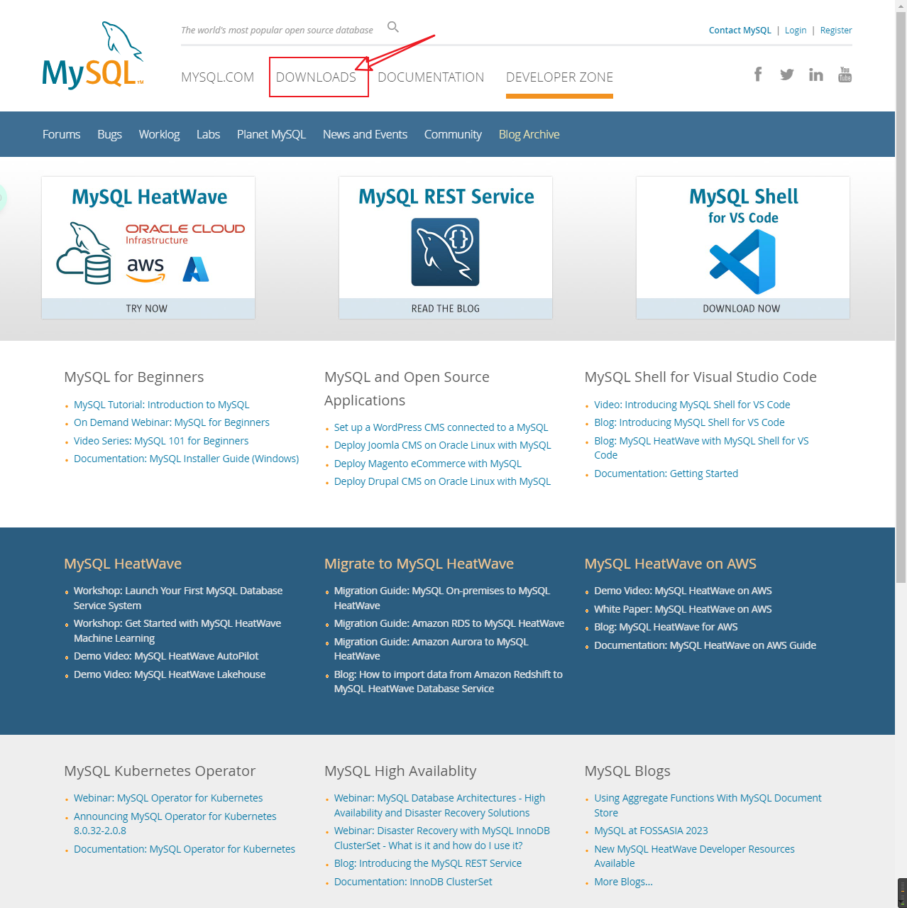

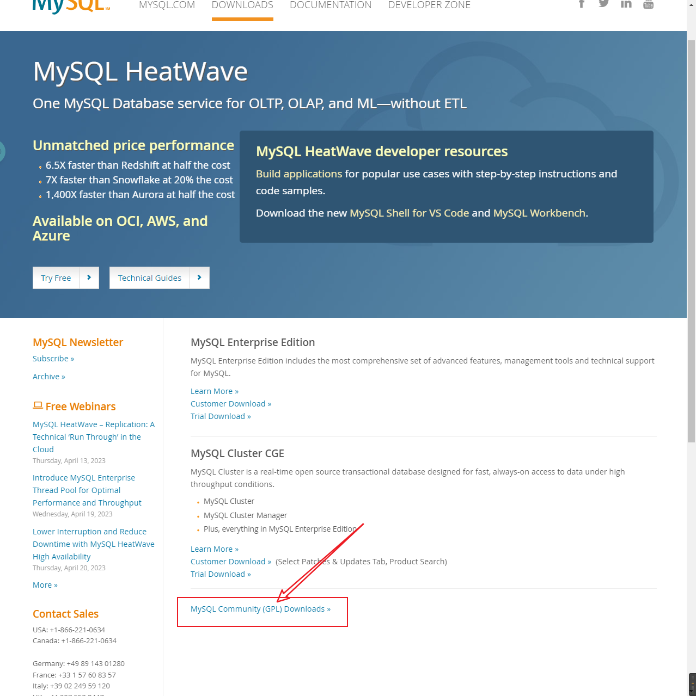

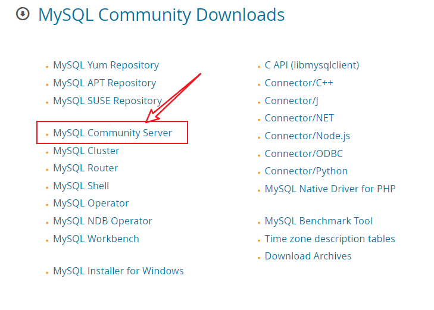

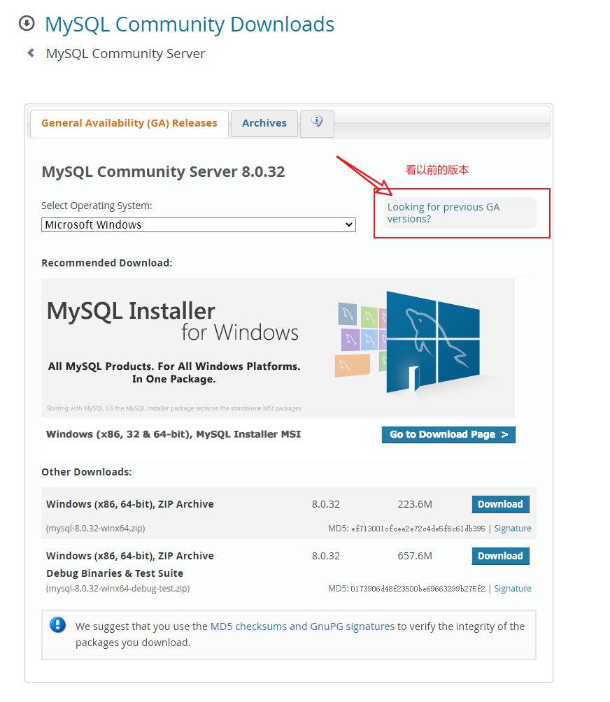

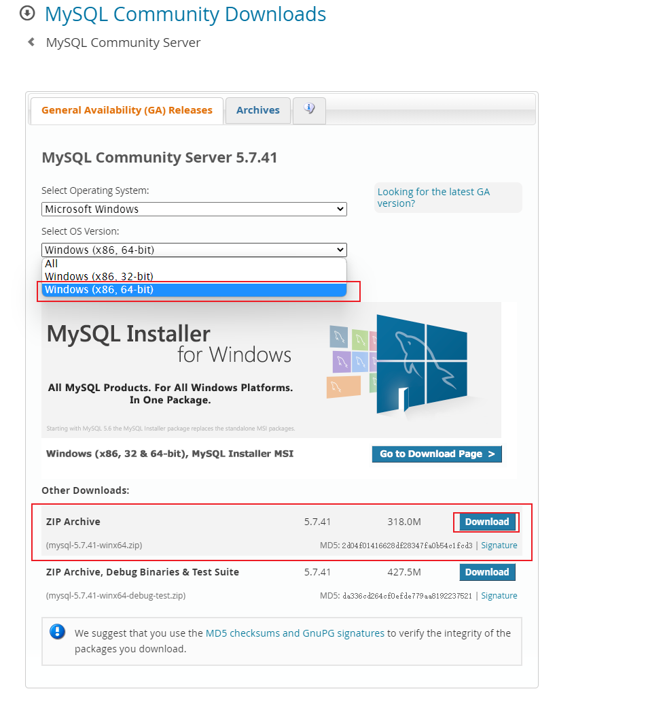

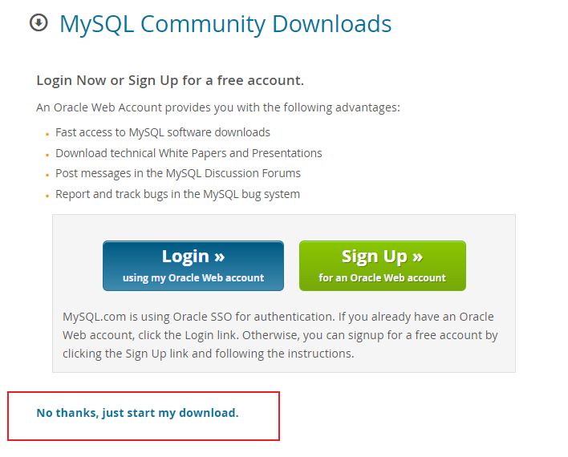

# Mysql安装

## 解压


## 配置Mysql环境

### 环境变量

环境变量（系统变量Path）配置：在path中添加MySQL的安装路径。`D:\Environment\mysql-5.7.41\bin`

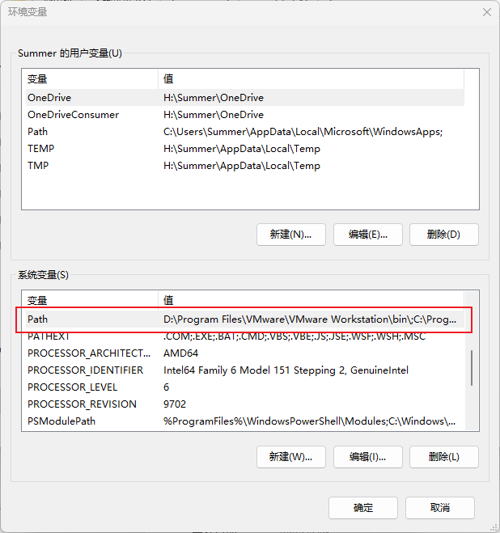

### 新建my.ini文件和data文件夹

在`MySQL`的安装目录下（`D:\Environment\mysql-5.7.41`）新建一个`txt`文档，另存为`my.ini`格式（会提示导致不可用，点确定就好）；同时在`bin`的同级目录下创建一个`data`文件夹（用于存放数据库数据）。

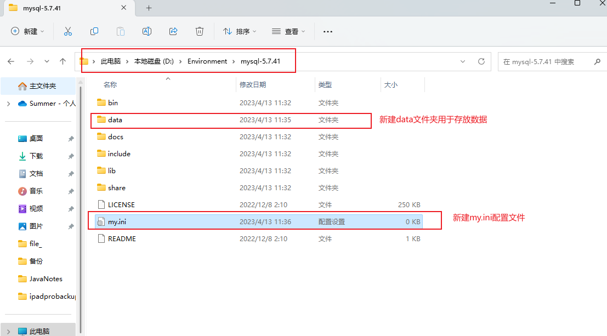

打开`my.ini`文件

```ini
[mysql] 
# 设置mysql客户端默认字符集 
default-character-set=utf8 
[mysqld] 
#设置3306端口 
port = 3306 
# 设置mysql的安装目录 
basedir=D:\Environment\mysql-5.7.41
# 设置mysql数据库的数据的存放目录 
datadir=D:\Environment\mysql-5.7.41\data 
# 允许最大连接数 
max_connections=200 
# 服务端使用的字符集默认为8比特编码的latin1字符集 
character-set-server=utf8 
# 创建新表时将使用的默认存储引擎 
default-storage-engine=INNODB
```

```ini
注：basedir和datadir的路径为自己的mysql存放的路径。
```

## 安装mysql服务

管理员身份运行`cmd`


切换到`D:\Environment\mysql-5.7.41\bin`目录下，执行`mysqld -install`

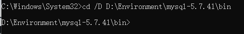


初始化数据库：`mysqld --initialize-insecure --user=mysql`


如果执行成功，会生成`data`目录：

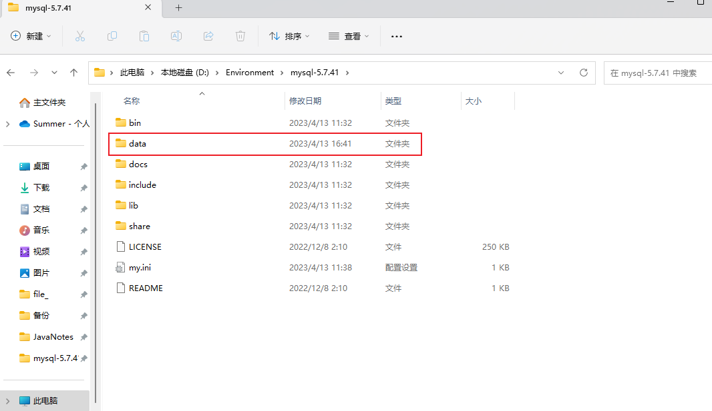

启动`mysql`服务:`net start mysql`（停止`mysql`服务指令`net stop mysql`）

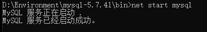

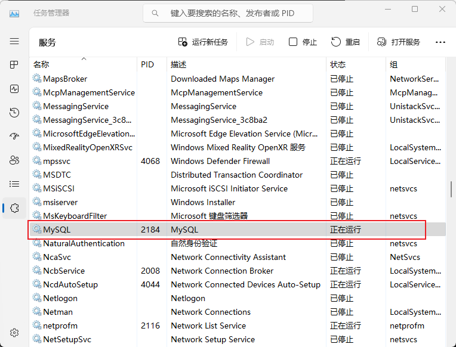

进入`mysql`管理终端：`mysql -u root -p`（当前`root`用户密码为空）


修改`root`用户密码

`use mysql;`使用`mysql`数据库

`set password = password("123456");` 提示Query OK


`update user set authentication_string=password('123456') where user='root' and Host='locahost'; `

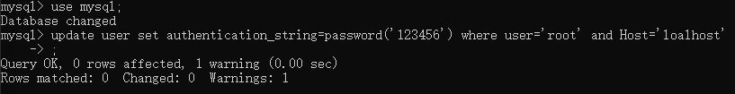

解读：上面的语句就是修改`root`用户的密码为`123456`

注意：在后i按需要带分号，回车即可执行该指令

执行：`flush privileges;`刷新权限

退出：`quit`