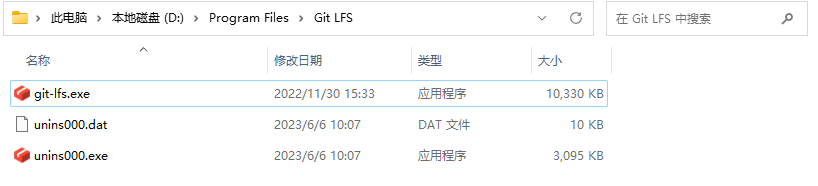
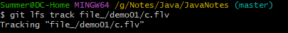
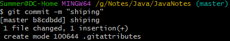

# 常见问题

## 问题描述

使用`git  push `将大于`100MB`的文件推送到`github`出现如下错误。


```
remote: error: Trace: 861ffb611c9f3722a792d6f620ad9c4648c9dee366c4541b573d720e3dd4d87f
remote: error: See https://gh.io/lfs for more information.
remote: error: File file_/demo01/c.flv is 136.43 MB; this exceeds GitHub's file size limit of 100.00 MB
remote: error: GH001: Large files detected. You may want to try Git Large File Storage - https://git-lfs.github.com.
To github.com:SummerGroot/JavaNotes.git
 ! [remote rejected] master -> master (pre-receive hook declined)
error: failed to push some refs to 'github.com:SummerGroot/JavaNotes.git'
```

## 解决方法

根据上述的报错信息，我们看出 push 的资源超过`100M`，我们可以尝试用 `Git` 大文件存储 (`LFS`)

PS：`Git` 大文件存储（`Git Large File Storage` (`LFS`)）可以简单的理解为存储大文本、视频、数据集的 `Git`。以下是官网的定义：

1. 下载`Git-LFS`，并安装。下图是安装后的目录



2. 安装完成后，打开`gitbash`，执行`git lfs install`

3. 到仓库目录，打开`gitbash`，追踪需要上传的大文件

   `git lfs track file_/demo01/c.flv`

   

4. 添加要上传的文件属性(先添加文件属性，不然可能会失败)

   `git add .gitattributes`

5. 添加属性文件上传的说明

   `git commit -m "shiping"`

   

6. 建立本地和`github`仓库的链接

   `git remote add origin git@github.com:SummerGroot/JavaNotes.git`

7. 上传属性文件
